cola Report for GDS4262
==================

**Date**: 2019-12-25 21:20:51 CET, **cola version**: 1.3.2

----------------------------------------------------------------

<style type='text/css'>

body, td, th {
   font-family: Arial,Helvetica,sans-serif;
   background-color: white;
   font-size: 13px;
  max-width: 800px;
  margin: auto;
  margin-left:210px;
  padding: 0px 10px 0px 10px;
  border-left: 1px solid #EEEEEE;
  line-height: 150%;
}

tt, code, pre {
   font-family: 'DejaVu Sans Mono', 'Droid Sans Mono', 'Lucida Console', Consolas, Monaco, 

monospace;
}

h1 {
   font-size:2.2em;
}

h2 {
   font-size:1.8em;
}

h3 {
   font-size:1.4em;
}

h4 {
   font-size:1.0em;
}

h5 {
   font-size:0.9em;
}

h6 {
   font-size:0.8em;
}

a {
  text-decoration: none;
  color: #0366d6;
}

a:hover {
  text-decoration: underline;
}

a:visited {
   color: #0366d6;
}

pre, img {
  max-width: 100%;
}
pre {
  overflow-x: auto;
}
pre code {
   display: block; padding: 0.5em;
}

code {
  font-size: 92%;
  border: 1px solid #ccc;
}

code[class] {
  background-color: #F8F8F8;
}

table, td, th {
  border: 1px solid #ccc;
}

blockquote {
   color:#666666;
   margin:0;
   padding-left: 1em;
   border-left: 0.5em #EEE solid;
}

hr {
   height: 0px;
   border-bottom: none;
   border-top-width: thin;
   border-top-style: dotted;
   border-top-color: #999999;
}

@media print {
   * {
      background: transparent !important;
      color: black !important;
      filter:none !important;
      -ms-filter: none !important;
   }

   body {
      font-size:12pt;
      max-width:100%;
   }

   a, a:visited {
      text-decoration: underline;
   }

   hr {
      visibility: hidden;
      page-break-before: always;
   }

   pre, blockquote {
      padding-right: 1em;
      page-break-inside: avoid;
   }

   tr, img {
      page-break-inside: avoid;
   }

   img {
      max-width: 100% !important;
   }

   @page :left {
      margin: 15mm 20mm 15mm 10mm;
   }

   @page :right {
      margin: 15mm 10mm 15mm 20mm;
   }

   p, h2, h3 {
      orphans: 3; widows: 3;
   }

   h2, h3 {
      page-break-after: avoid;
   }
}
</style>


## Summary


All available functions which can be applied to this `res_list` object:


```r
res_list
```

```
#> A 'ConsensusPartitionList' object with 24 methods.
#>   On a matrix with 51941 rows and 54 columns.
#>   Top rows are extracted by 'SD, CV, MAD, ATC' methods.
#>   Subgroups are detected by 'hclust, kmeans, skmeans, pam, mclust, NMF' method.
#>   Number of partitions are tried for k = 2, 3, 4, 5, 6.
#>   Performed in total 30000 partitions by row resampling.
#> 
#> Following methods can be applied to this 'ConsensusPartitionList' object:
#>  [1] "cola_report"           "collect_classes"       "collect_plots"         "collect_stats"        
#>  [5] "colnames"              "functional_enrichment" "get_anno_col"          "get_anno"             
#>  [9] "get_classes"           "get_matrix"            "get_membership"        "get_stats"            
#> [13] "is_best_k"             "is_stable_k"           "ncol"                  "nrow"                 
#> [17] "rownames"              "show"                  "suggest_best_k"        "test_to_known_factors"
#> [21] "top_rows_heatmap"      "top_rows_overlap"     
#> 
#> You can get result for a single method by, e.g. object["SD", "hclust"] or object["SD:hclust"]
#> or a subset of methods by object[c("SD", "CV")], c("hclust", "kmeans")]
```

The call of `run_all_consensus_partition_methods()` was:


```
#> run_all_consensus_partition_methods(data = mat, mc.cores = 4, anno = anno)
```

Dimension of the input matrix:


```r
mat = get_matrix(res_list)
dim(mat)
```

```
#> [1] 51941    54
```

### Density distribution

The density distribution for each sample is visualized as in one column in the
following heatmap. The clustering is based on the distance which is the
Kolmogorov-Smirnov statistic between two distributions.


```r
library(ComplexHeatmap)
densityHeatmap(mat, top_annotation = HeatmapAnnotation(df = get_anno(res_list), 
    col = get_anno_col(res_list)), ylab = "value", cluster_columns = TRUE, show_column_names = FALSE,
    mc.cores = 4)
```

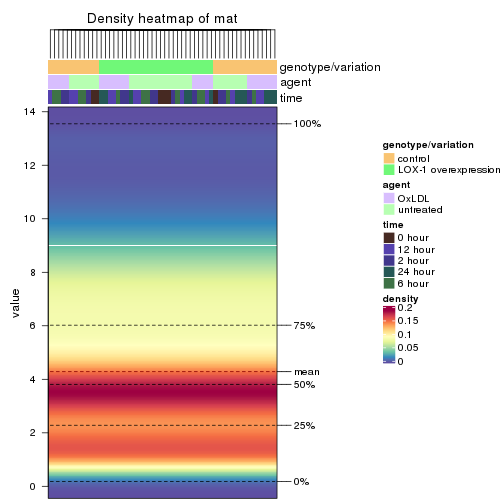


### Suggest the best k


Folowing table shows the best `k` (number of partitions) for each combination
of top-value methods and partition methods. Clicking on the method name in
the table goes to the section for a single combination of methods.

[The cola vignette](http://bioconductor.org/packages/devel/bioc/vignettes/cola/inst/doc/cola.html#toc_13)
explains the definition of the metrics used for determining the best
number of partitions.


```r
suggest_best_k(res_list)
```


|                            | The best k| 1-PAC| Mean silhouette| Concordance|   |Optional k |
|:---------------------------|----------:|-----:|---------------:|-----------:|:--|:----------|
|[SD:kmeans](#SD-kmeans)     |          2| 1.000|           0.989|       0.987|** |           |
|[SD:mclust](#SD-mclust)     |          2| 1.000|           1.000|       1.000|** |           |
|[SD:NMF](#SD-NMF)           |          2| 1.000|           1.000|       1.000|** |           |
|[MAD:kmeans](#MAD-kmeans)   |          2| 1.000|           1.000|       1.000|** |           |
|[MAD:mclust](#MAD-mclust)   |          2| 1.000|           1.000|       1.000|** |           |
|[MAD:NMF](#MAD-NMF)         |          2| 1.000|           1.000|       1.000|** |           |
|[ATC:hclust](#ATC-hclust)   |          3| 1.000|           0.949|       0.969|** |2          |
|[ATC:NMF](#ATC-NMF)         |          4| 0.948|           0.913|       0.959|*  |2          |
|[ATC:mclust](#ATC-mclust)   |          6| 0.934|           0.962|       0.970|*  |5          |
|[ATC:skmeans](#ATC-skmeans) |          6| 0.929|           0.953|       0.930|*  |2,3,4,5    |
|[CV:hclust](#CV-hclust)     |          2| 0.921|           0.953|       0.960|*  |           |
|[ATC:pam](#ATC-pam)         |          6| 0.912|           0.930|       0.828|*  |2,3,4      |
|[SD:skmeans](#SD-skmeans)   |          2| 0.900|           0.963|       0.963|   |           |
|[CV:NMF](#CV-NMF)           |          2| 0.737|           0.902|       0.943|   |           |
|[SD:pam](#SD-pam)           |          2| 0.658|           0.873|       0.939|   |           |
|[MAD:pam](#MAD-pam)         |          2| 0.578|           0.809|       0.911|   |           |
|[ATC:kmeans](#ATC-kmeans)   |          2| 0.491|           0.884|       0.908|   |           |
|[MAD:hclust](#MAD-hclust)   |          2| 0.358|           0.906|       0.838|   |           |
|[SD:hclust](#SD-hclust)     |          2| 0.351|           0.901|       0.824|   |           |
|[CV:mclust](#CV-mclust)     |          3| 0.228|           0.644|       0.767|   |           |
|[CV:kmeans](#CV-kmeans)     |          2| 0.179|           0.835|       0.828|   |           |
|[MAD:skmeans](#MAD-skmeans) |          2| 0.108|           0.907|       0.901|   |           |
|[CV:pam](#CV-pam)           |          2| 0.102|           0.653|       0.808|   |           |
|[CV:skmeans](#CV-skmeans)   |          2| 0.000|           0.493|       0.697|   |           |

\*\*: 1-PAC > 0.95, \*: 1-PAC > 0.9


### CDF of consensus matrices

Cumulative distribution function curves of consensus matrix for all methods.


```r
collect_plots(res_list, fun = plot_ecdf)
```

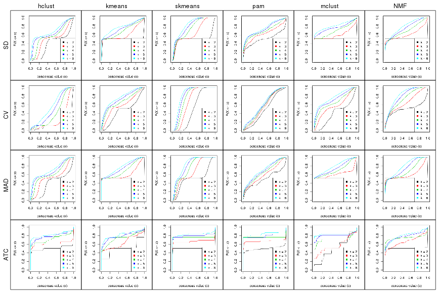


### Consensus heatmap

Consensus heatmaps for all methods. ([What is a consensus heatmap?](http://bioconductor.org/packages/devel/bioc/vignettes/cola/inst/doc/cola.html#toc_9))


<style type='text/css'>


.ui-helper-hidden {
	display: none;
}
.ui-helper-hidden-accessible {
	border: 0;
	clip: rect(0 0 0 0);
	height: 1px;
	margin: -1px;
	overflow: hidden;
	padding: 0;
	position: absolute;
	width: 1px;
}
.ui-helper-reset {
	margin: 0;
	padding: 0;
	border: 0;
	outline: 0;
	line-height: 1.3;
	text-decoration: none;
	font-size: 100%;
	list-style: none;
}
.ui-helper-clearfix:before,
.ui-helper-clearfix:after {
	content: "";
	display: table;
	border-collapse: collapse;
}
.ui-helper-clearfix:after {
	clear: both;
}
.ui-helper-zfix {
	width: 100%;
	height: 100%;
	top: 0;
	left: 0;
	position: absolute;
	opacity: 0;
	filter:Alpha(Opacity=0); 
}

.ui-front {
	z-index: 100;
}


.ui-state-disabled {
	cursor: default !important;
	pointer-events: none;
}


.ui-icon {
	display: inline-block;
	vertical-align: middle;
	margin-top: -.25em;
	position: relative;
	text-indent: -99999px;
	overflow: hidden;
	background-repeat: no-repeat;
}

.ui-widget-icon-block {
	left: 50%;
	margin-left: -8px;
	display: block;
}


.ui-widget-overlay {
	position: fixed;
	top: 0;
	left: 0;
	width: 100%;
	height: 100%;
}
.ui-accordion .ui-accordion-header {
	display: block;
	cursor: pointer;
	position: relative;
	margin: 2px 0 0 0;
	padding: .5em .5em .5em .7em;
	font-size: 100%;
}
.ui-accordion .ui-accordion-content {
	padding: 1em 2.2em;
	border-top: 0;
	overflow: auto;
}
.ui-autocomplete {
	position: absolute;
	top: 0;
	left: 0;
	cursor: default;
}
.ui-menu {
	list-style: none;
	padding: 0;
	margin: 0;
	display: block;
	outline: 0;
}
.ui-menu .ui-menu {
	position: absolute;
}
.ui-menu .ui-menu-item {
	margin: 0;
	cursor: pointer;
	
	list-style-image: url("data:image/gif;base64,R0lGODlhAQABAIAAAAAAAP///yH5BAEAAAAALAAAAAABAAEAAAIBRAA7");
}
.ui-menu .ui-menu-item-wrapper {
	position: relative;
	padding: 3px 1em 3px .4em;
}
.ui-menu .ui-menu-divider {
	margin: 5px 0;
	height: 0;
	font-size: 0;
	line-height: 0;
	border-width: 1px 0 0 0;
}
.ui-menu .ui-state-focus,
.ui-menu .ui-state-active {
	margin: -1px;
}


.ui-menu-icons {
	position: relative;
}
.ui-menu-icons .ui-menu-item-wrapper {
	padding-left: 2em;
}


.ui-menu .ui-icon {
	position: absolute;
	top: 0;
	bottom: 0;
	left: .2em;
	margin: auto 0;
}


.ui-menu .ui-menu-icon {
	left: auto;
	right: 0;
}
.ui-button {
	padding: .4em 1em;
	display: inline-block;
	position: relative;
	line-height: normal;
	margin-right: .1em;
	cursor: pointer;
	vertical-align: middle;
	text-align: center;
	-webkit-user-select: none;
	-moz-user-select: none;
	-ms-user-select: none;
	user-select: none;

	
	overflow: visible;
}

.ui-button,
.ui-button:link,
.ui-button:visited,
.ui-button:hover,
.ui-button:active {
	text-decoration: none;
}


.ui-button-icon-only {
	width: 2em;
	box-sizing: border-box;
	text-indent: -9999px;
	white-space: nowrap;
}


input.ui-button.ui-button-icon-only {
	text-indent: 0;
}


.ui-button-icon-only .ui-icon {
	position: absolute;
	top: 50%;
	left: 50%;
	margin-top: -8px;
	margin-left: -8px;
}

.ui-button.ui-icon-notext .ui-icon {
	padding: 0;
	width: 2.1em;
	height: 2.1em;
	text-indent: -9999px;
	white-space: nowrap;

}

input.ui-button.ui-icon-notext .ui-icon {
	width: auto;
	height: auto;
	text-indent: 0;
	white-space: normal;
	padding: .4em 1em;
}


input.ui-button::-moz-focus-inner,
button.ui-button::-moz-focus-inner {
	border: 0;
	padding: 0;
}
.ui-controlgroup {
	vertical-align: middle;
	display: inline-block;
}
.ui-controlgroup > .ui-controlgroup-item {
	float: left;
	margin-left: 0;
	margin-right: 0;
}
.ui-controlgroup > .ui-controlgroup-item:focus,
.ui-controlgroup > .ui-controlgroup-item.ui-visual-focus {
	z-index: 9999;
}
.ui-controlgroup-vertical > .ui-controlgroup-item {
	display: block;
	float: none;
	width: 100%;
	margin-top: 0;
	margin-bottom: 0;
	text-align: left;
}
.ui-controlgroup-vertical .ui-controlgroup-item {
	box-sizing: border-box;
}
.ui-controlgroup .ui-controlgroup-label {
	padding: .4em 1em;
}
.ui-controlgroup .ui-controlgroup-label span {
	font-size: 80%;
}
.ui-controlgroup-horizontal .ui-controlgroup-label + .ui-controlgroup-item {
	border-left: none;
}
.ui-controlgroup-vertical .ui-controlgroup-label + .ui-controlgroup-item {
	border-top: none;
}
.ui-controlgroup-horizontal .ui-controlgroup-label.ui-widget-content {
	border-right: none;
}
.ui-controlgroup-vertical .ui-controlgroup-label.ui-widget-content {
	border-bottom: none;
}


.ui-controlgroup-vertical .ui-spinner-input {

	
	width: 75%;
	width: calc( 100% - 2.4em );
}
.ui-controlgroup-vertical .ui-spinner .ui-spinner-up {
	border-top-style: solid;
}

.ui-checkboxradio-label .ui-icon-background {
	box-shadow: inset 1px 1px 1px #ccc;
	border-radius: .12em;
	border: none;
}
.ui-checkboxradio-radio-label .ui-icon-background {
	width: 16px;
	height: 16px;
	border-radius: 1em;
	overflow: visible;
	border: none;
}
.ui-checkboxradio-radio-label.ui-checkboxradio-checked .ui-icon,
.ui-checkboxradio-radio-label.ui-checkboxradio-checked:hover .ui-icon {
	background-image: none;
	width: 8px;
	height: 8px;
	border-width: 4px;
	border-style: solid;
}
.ui-checkboxradio-disabled {
	pointer-events: none;
}
.ui-datepicker {
	width: 17em;
	padding: .2em .2em 0;
	display: none;
}
.ui-datepicker .ui-datepicker-header {
	position: relative;
	padding: .2em 0;
}
.ui-datepicker .ui-datepicker-prev,
.ui-datepicker .ui-datepicker-next {
	position: absolute;
	top: 2px;
	width: 1.8em;
	height: 1.8em;
}
.ui-datepicker .ui-datepicker-prev-hover,
.ui-datepicker .ui-datepicker-next-hover {
	top: 1px;
}
.ui-datepicker .ui-datepicker-prev {
	left: 2px;
}
.ui-datepicker .ui-datepicker-next {
	right: 2px;
}
.ui-datepicker .ui-datepicker-prev-hover {
	left: 1px;
}
.ui-datepicker .ui-datepicker-next-hover {
	right: 1px;
}
.ui-datepicker .ui-datepicker-prev span,
.ui-datepicker .ui-datepicker-next span {
	display: block;
	position: absolute;
	left: 50%;
	margin-left: -8px;
	top: 50%;
	margin-top: -8px;
}
.ui-datepicker .ui-datepicker-title {
	margin: 0 2.3em;
	line-height: 1.8em;
	text-align: center;
}
.ui-datepicker .ui-datepicker-title select {
	font-size: 1em;
	margin: 1px 0;
}
.ui-datepicker select.ui-datepicker-month,
.ui-datepicker select.ui-datepicker-year {
	width: 45%;
}
.ui-datepicker table {
	width: 100%;
	font-size: .9em;
	border-collapse: collapse;
	margin: 0 0 .4em;
}
.ui-datepicker th {
	padding: .7em .3em;
	text-align: center;
	font-weight: bold;
	border: 0;
}
.ui-datepicker td {
	border: 0;
	padding: 1px;
}
.ui-datepicker td span,
.ui-datepicker td a {
	display: block;
	padding: .2em;
	text-align: right;
	text-decoration: none;
}
.ui-datepicker .ui-datepicker-buttonpane {
	background-image: none;
	margin: .7em 0 0 0;
	padding: 0 .2em;
	border-left: 0;
	border-right: 0;
	border-bottom: 0;
}
.ui-datepicker .ui-datepicker-buttonpane button {
	float: right;
	margin: .5em .2em .4em;
	cursor: pointer;
	padding: .2em .6em .3em .6em;
	width: auto;
	overflow: visible;
}
.ui-datepicker .ui-datepicker-buttonpane button.ui-datepicker-current {
	float: left;
}


.ui-datepicker.ui-datepicker-multi {
	width: auto;
}
.ui-datepicker-multi .ui-datepicker-group {
	float: left;
}
.ui-datepicker-multi .ui-datepicker-group table {
	width: 95%;
	margin: 0 auto .4em;
}
.ui-datepicker-multi-2 .ui-datepicker-group {
	width: 50%;
}
.ui-datepicker-multi-3 .ui-datepicker-group {
	width: 33.3%;
}
.ui-datepicker-multi-4 .ui-datepicker-group {
	width: 25%;
}
.ui-datepicker-multi .ui-datepicker-group-last .ui-datepicker-header,
.ui-datepicker-multi .ui-datepicker-group-middle .ui-datepicker-header {
	border-left-width: 0;
}
.ui-datepicker-multi .ui-datepicker-buttonpane {
	clear: left;
}
.ui-datepicker-row-break {
	clear: both;
	width: 100%;
	font-size: 0;
}


.ui-datepicker-rtl {
	direction: rtl;
}
.ui-datepicker-rtl .ui-datepicker-prev {
	right: 2px;
	left: auto;
}
.ui-datepicker-rtl .ui-datepicker-next {
	left: 2px;
	right: auto;
}
.ui-datepicker-rtl .ui-datepicker-prev:hover {
	right: 1px;
	left: auto;
}
.ui-datepicker-rtl .ui-datepicker-next:hover {
	left: 1px;
	right: auto;
}
.ui-datepicker-rtl .ui-datepicker-buttonpane {
	clear: right;
}
.ui-datepicker-rtl .ui-datepicker-buttonpane button {
	float: left;
}
.ui-datepicker-rtl .ui-datepicker-buttonpane button.ui-datepicker-current,
.ui-datepicker-rtl .ui-datepicker-group {
	float: right;
}
.ui-datepicker-rtl .ui-datepicker-group-last .ui-datepicker-header,
.ui-datepicker-rtl .ui-datepicker-group-middle .ui-datepicker-header {
	border-right-width: 0;
	border-left-width: 1px;
}


.ui-datepicker .ui-icon {
	display: block;
	text-indent: -99999px;
	overflow: hidden;
	background-repeat: no-repeat;
	left: .5em;
	top: .3em;
}
.ui-dialog {
	position: absolute;
	top: 0;
	left: 0;
	padding: .2em;
	outline: 0;
}
.ui-dialog .ui-dialog-titlebar {
	padding: .4em 1em;
	position: relative;
}
.ui-dialog .ui-dialog-title {
	float: left;
	margin: .1em 0;
	white-space: nowrap;
	width: 90%;
	overflow: hidden;
	text-overflow: ellipsis;
}
.ui-dialog .ui-dialog-titlebar-close {
	position: absolute;
	right: .3em;
	top: 50%;
	width: 20px;
	margin: -10px 0 0 0;
	padding: 1px;
	height: 20px;
}
.ui-dialog .ui-dialog-content {
	position: relative;
	border: 0;
	padding: .5em 1em;
	background: none;
	overflow: auto;
}
.ui-dialog .ui-dialog-buttonpane {
	text-align: left;
	border-width: 1px 0 0 0;
	background-image: none;
	margin-top: .5em;
	padding: .3em 1em .5em .4em;
}
.ui-dialog .ui-dialog-buttonpane .ui-dialog-buttonset {
	float: right;
}
.ui-dialog .ui-dialog-buttonpane button {
	margin: .5em .4em .5em 0;
	cursor: pointer;
}
.ui-dialog .ui-resizable-n {
	height: 2px;
	top: 0;
}
.ui-dialog .ui-resizable-e {
	width: 2px;
	right: 0;
}
.ui-dialog .ui-resizable-s {
	height: 2px;
	bottom: 0;
}
.ui-dialog .ui-resizable-w {
	width: 2px;
	left: 0;
}
.ui-dialog .ui-resizable-se,
.ui-dialog .ui-resizable-sw,
.ui-dialog .ui-resizable-ne,
.ui-dialog .ui-resizable-nw {
	width: 7px;
	height: 7px;
}
.ui-dialog .ui-resizable-se {
	right: 0;
	bottom: 0;
}
.ui-dialog .ui-resizable-sw {
	left: 0;
	bottom: 0;
}
.ui-dialog .ui-resizable-ne {
	right: 0;
	top: 0;
}
.ui-dialog .ui-resizable-nw {
	left: 0;
	top: 0;
}
.ui-draggable .ui-dialog-titlebar {
	cursor: move;
}
.ui-draggable-handle {
	-ms-touch-action: none;
	touch-action: none;
}
.ui-resizable {
	position: relative;
}
.ui-resizable-handle {
	position: absolute;
	font-size: 0.1px;
	display: block;
	-ms-touch-action: none;
	touch-action: none;
}
.ui-resizable-disabled .ui-resizable-handle,
.ui-resizable-autohide .ui-resizable-handle {
	display: none;
}
.ui-resizable-n {
	cursor: n-resize;
	height: 7px;
	width: 100%;
	top: -5px;
	left: 0;
}
.ui-resizable-s {
	cursor: s-resize;
	height: 7px;
	width: 100%;
	bottom: -5px;
	left: 0;
}
.ui-resizable-e {
	cursor: e-resize;
	width: 7px;
	right: -5px;
	top: 0;
	height: 100%;
}
.ui-resizable-w {
	cursor: w-resize;
	width: 7px;
	left: -5px;
	top: 0;
	height: 100%;
}
.ui-resizable-se {
	cursor: se-resize;
	width: 12px;
	height: 12px;
	right: 1px;
	bottom: 1px;
}
.ui-resizable-sw {
	cursor: sw-resize;
	width: 9px;
	height: 9px;
	left: -5px;
	bottom: -5px;
}
.ui-resizable-nw {
	cursor: nw-resize;
	width: 9px;
	height: 9px;
	left: -5px;
	top: -5px;
}
.ui-resizable-ne {
	cursor: ne-resize;
	width: 9px;
	height: 9px;
	right: -5px;
	top: -5px;
}
.ui-progressbar {
	height: 2em;
	text-align: left;
	overflow: hidden;
}
.ui-progressbar .ui-progressbar-value {
	margin: -1px;
	height: 100%;
}
.ui-progressbar .ui-progressbar-overlay {
	background: url("");
	height: 100%;
	filter: alpha(opacity=25); 
	opacity: 0.25;
}
.ui-progressbar-indeterminate .ui-progressbar-value {
	background-image: none;
}
.ui-selectable {
	-ms-touch-action: none;
	touch-action: none;
}
.ui-selectable-helper {
	position: absolute;
	z-index: 100;
	border: 1px dotted black;
}
.ui-selectmenu-menu {
	padding: 0;
	margin: 0;
	position: absolute;
	top: 0;
	left: 0;
	display: none;
}
.ui-selectmenu-menu .ui-menu {
	overflow: auto;
	overflow-x: hidden;
	padding-bottom: 1px;
}
.ui-selectmenu-menu .ui-menu .ui-selectmenu-optgroup {
	font-size: 1em;
	font-weight: bold;
	line-height: 1.5;
	padding: 2px 0.4em;
	margin: 0.5em 0 0 0;
	height: auto;
	border: 0;
}
.ui-selectmenu-open {
	display: block;
}
.ui-selectmenu-text {
	display: block;
	margin-right: 20px;
	overflow: hidden;
	text-overflow: ellipsis;
}
.ui-selectmenu-button.ui-button {
	text-align: left;
	white-space: nowrap;
	width: 14em;
}
.ui-selectmenu-icon.ui-icon {
	float: right;
	margin-top: 0;
}
.ui-slider {
	position: relative;
	text-align: left;
}
.ui-slider .ui-slider-handle {
	position: absolute;
	z-index: 2;
	width: 1.2em;
	height: 1.2em;
	cursor: default;
	-ms-touch-action: none;
	touch-action: none;
}
.ui-slider .ui-slider-range {
	position: absolute;
	z-index: 1;
	font-size: .7em;
	display: block;
	border: 0;
	background-position: 0 0;
}


.ui-slider.ui-state-disabled .ui-slider-handle,
.ui-slider.ui-state-disabled .ui-slider-range {
	filter: inherit;
}

.ui-slider-horizontal {
	height: .8em;
}
.ui-slider-horizontal .ui-slider-handle {
	top: -.3em;
	margin-left: -.6em;
}
.ui-slider-horizontal .ui-slider-range {
	top: 0;
	height: 100%;
}
.ui-slider-horizontal .ui-slider-range-min {
	left: 0;
}
.ui-slider-horizontal .ui-slider-range-max {
	right: 0;
}

.ui-slider-vertical {
	width: .8em;
	height: 100px;
}
.ui-slider-vertical .ui-slider-handle {
	left: -.3em;
	margin-left: 0;
	margin-bottom: -.6em;
}
.ui-slider-vertical .ui-slider-range {
	left: 0;
	width: 100%;
}
.ui-slider-vertical .ui-slider-range-min {
	bottom: 0;
}
.ui-slider-vertical .ui-slider-range-max {
	top: 0;
}
.ui-sortable-handle {
	-ms-touch-action: none;
	touch-action: none;
}
.ui-spinner {
	position: relative;
	display: inline-block;
	overflow: hidden;
	padding: 0;
	vertical-align: middle;
}
.ui-spinner-input {
	border: none;
	background: none;
	color: inherit;
	padding: .222em 0;
	margin: .2em 0;
	vertical-align: middle;
	margin-left: .4em;
	margin-right: 2em;
}
.ui-spinner-button {
	width: 1.6em;
	height: 50%;
	font-size: .5em;
	padding: 0;
	margin: 0;
	text-align: center;
	position: absolute;
	cursor: default;
	display: block;
	overflow: hidden;
	right: 0;
}

.ui-spinner a.ui-spinner-button {
	border-top-style: none;
	border-bottom-style: none;
	border-right-style: none;
}
.ui-spinner-up {
	top: 0;
}
.ui-spinner-down {
	bottom: 0;
}
.ui-tabs {
	position: relative;
	padding: .2em;
}
.ui-tabs .ui-tabs-nav {
	margin: 0;
	padding: .2em .2em 0;
}
.ui-tabs .ui-tabs-nav li {
	list-style: none;
	float: left;
	position: relative;
	top: 0;
	margin: 1px .2em 0 0;
	border-bottom-width: 0;
	padding: 0;
	white-space: nowrap;
}
.ui-tabs .ui-tabs-nav .ui-tabs-anchor {
	float: left;
	padding: .5em 1em;
	text-decoration: none;
}
.ui-tabs .ui-tabs-nav li.ui-tabs-active {
	margin-bottom: -1px;
	padding-bottom: 1px;
}
.ui-tabs .ui-tabs-nav li.ui-tabs-active .ui-tabs-anchor,
.ui-tabs .ui-tabs-nav li.ui-state-disabled .ui-tabs-anchor,
.ui-tabs .ui-tabs-nav li.ui-tabs-loading .ui-tabs-anchor {
	cursor: text;
}
.ui-tabs-collapsible .ui-tabs-nav li.ui-tabs-active .ui-tabs-anchor {
	cursor: pointer;
}
.ui-tabs .ui-tabs-panel {
	display: block;
	border-width: 0;
	padding: 1em 1.4em;
	background: none;
}
.ui-tooltip {
	padding: 8px;
	position: absolute;
	z-index: 9999;
	max-width: 300px;
}
body .ui-tooltip {
	border-width: 2px;
}

.ui-widget {
	font-family: Arial,Helvetica,sans-serif;
	font-size: 1em;
}
.ui-widget .ui-widget {
	font-size: 1em;
}
.ui-widget input,
.ui-widget select,
.ui-widget textarea,
.ui-widget button {
	font-family: Arial,Helvetica,sans-serif;
	font-size: 1em;
}
.ui-widget.ui-widget-content {
	border: 1px solid #c5c5c5;
}
.ui-widget-content {
	border: 1px solid #dddddd;
	background: #ffffff;
	color: #333333;
}
.ui-widget-content a {
	color: #333333;
}
.ui-widget-header {
	border: 1px solid #dddddd;
	background: #e9e9e9;
	color: #333333;
	font-weight: bold;
}
.ui-widget-header a {
	color: #333333;
}


.ui-state-default,
.ui-widget-content .ui-state-default,
.ui-widget-header .ui-state-default,
.ui-button,


html .ui-button.ui-state-disabled:hover,
html .ui-button.ui-state-disabled:active {
	border: 1px solid #c5c5c5;
	background: #f6f6f6;
	font-weight: normal;
	color: #454545;
}
.ui-state-default a,
.ui-state-default a:link,
.ui-state-default a:visited,
a.ui-button,
a:link.ui-button,
a:visited.ui-button,
.ui-button {
	color: #454545;
	text-decoration: none;
}
.ui-state-hover,
.ui-widget-content .ui-state-hover,
.ui-widget-header .ui-state-hover,
.ui-state-focus,
.ui-widget-content .ui-state-focus,
.ui-widget-header .ui-state-focus,
.ui-button:hover,
.ui-button:focus {
	border: 1px solid #cccccc;
	background: #ededed;
	font-weight: normal;
	color: #2b2b2b;
}
.ui-state-hover a,
.ui-state-hover a:hover,
.ui-state-hover a:link,
.ui-state-hover a:visited,
.ui-state-focus a,
.ui-state-focus a:hover,
.ui-state-focus a:link,
.ui-state-focus a:visited,
a.ui-button:hover,
a.ui-button:focus {
	color: #2b2b2b;
	text-decoration: none;
}

.ui-visual-focus {
	box-shadow: 0 0 3px 1px rgb(94, 158, 214);
}
.ui-state-active,
.ui-widget-content .ui-state-active,
.ui-widget-header .ui-state-active,
a.ui-button:active,
.ui-button:active,
.ui-button.ui-state-active:hover {
	border: 1px solid #003eff;
	background: #007fff;
	font-weight: normal;
	color: #ffffff;
}
.ui-icon-background,
.ui-state-active .ui-icon-background {
	border: #003eff;
	background-color: #ffffff;
}
.ui-state-active a,
.ui-state-active a:link,
.ui-state-active a:visited {
	color: #ffffff;
	text-decoration: none;
}


.ui-state-highlight,
.ui-widget-content .ui-state-highlight,
.ui-widget-header .ui-state-highlight {
	border: 1px solid #dad55e;
	background: #fffa90;
	color: #777620;
}
.ui-state-checked {
	border: 1px solid #dad55e;
	background: #fffa90;
}
.ui-state-highlight a,
.ui-widget-content .ui-state-highlight a,
.ui-widget-header .ui-state-highlight a {
	color: #777620;
}
.ui-state-error,
.ui-widget-content .ui-state-error,
.ui-widget-header .ui-state-error {
	border: 1px solid #f1a899;
	background: #fddfdf;
	color: #5f3f3f;
}
.ui-state-error a,
.ui-widget-content .ui-state-error a,
.ui-widget-header .ui-state-error a {
	color: #5f3f3f;
}
.ui-state-error-text,
.ui-widget-content .ui-state-error-text,
.ui-widget-header .ui-state-error-text {
	color: #5f3f3f;
}
.ui-priority-primary,
.ui-widget-content .ui-priority-primary,
.ui-widget-header .ui-priority-primary {
	font-weight: bold;
}
.ui-priority-secondary,
.ui-widget-content .ui-priority-secondary,
.ui-widget-header .ui-priority-secondary {
	opacity: .7;
	filter:Alpha(Opacity=70); 
	font-weight: normal;
}
.ui-state-disabled,
.ui-widget-content .ui-state-disabled,
.ui-widget-header .ui-state-disabled {
	opacity: .35;
	filter:Alpha(Opacity=35); 
	background-image: none;
}
.ui-state-disabled .ui-icon {
	filter:Alpha(Opacity=35); 
}


.ui-icon {
	width: 16px;
	height: 16px;
}
.ui-icon,
.ui-widget-content .ui-icon {
	background-image: url("images/ui-icons_444444_256x240.png");
}
.ui-widget-header .ui-icon {
	background-image: url("images/ui-icons_444444_256x240.png");
}
.ui-state-hover .ui-icon,
.ui-state-focus .ui-icon,
.ui-button:hover .ui-icon,
.ui-button:focus .ui-icon {
	background-image: url("images/ui-icons_555555_256x240.png");
}
.ui-state-active .ui-icon,
.ui-button:active .ui-icon {
	background-image: url("images/ui-icons_ffffff_256x240.png");
}
.ui-state-highlight .ui-icon,
.ui-button .ui-state-highlight.ui-icon {
	background-image: url("images/ui-icons_777620_256x240.png");
}
.ui-state-error .ui-icon,
.ui-state-error-text .ui-icon {
	background-image: url("images/ui-icons_cc0000_256x240.png");
}
.ui-button .ui-icon {
	background-image: url("images/ui-icons_777777_256x240.png");
}


.ui-icon-blank { background-position: 16px 16px; }
.ui-icon-caret-1-n { background-position: 0 0; }
.ui-icon-caret-1-ne { background-position: -16px 0; }
.ui-icon-caret-1-e { background-position: -32px 0; }
.ui-icon-caret-1-se { background-position: -48px 0; }
.ui-icon-caret-1-s { background-position: -65px 0; }
.ui-icon-caret-1-sw { background-position: -80px 0; }
.ui-icon-caret-1-w { background-position: -96px 0; }
.ui-icon-caret-1-nw { background-position: -112px 0; }
.ui-icon-caret-2-n-s { background-position: -128px 0; }
.ui-icon-caret-2-e-w { background-position: -144px 0; }
.ui-icon-triangle-1-n { background-position: 0 -16px; }
.ui-icon-triangle-1-ne { background-position: -16px -16px; }
.ui-icon-triangle-1-e { background-position: -32px -16px; }
.ui-icon-triangle-1-se { background-position: -48px -16px; }
.ui-icon-triangle-1-s { background-position: -65px -16px; }
.ui-icon-triangle-1-sw { background-position: -80px -16px; }
.ui-icon-triangle-1-w { background-position: -96px -16px; }
.ui-icon-triangle-1-nw { background-position: -112px -16px; }
.ui-icon-triangle-2-n-s { background-position: -128px -16px; }
.ui-icon-triangle-2-e-w { background-position: -144px -16px; }
.ui-icon-arrow-1-n { background-position: 0 -32px; }
.ui-icon-arrow-1-ne { background-position: -16px -32px; }
.ui-icon-arrow-1-e { background-position: -32px -32px; }
.ui-icon-arrow-1-se { background-position: -48px -32px; }
.ui-icon-arrow-1-s { background-position: -65px -32px; }
.ui-icon-arrow-1-sw { background-position: -80px -32px; }
.ui-icon-arrow-1-w { background-position: -96px -32px; }
.ui-icon-arrow-1-nw { background-position: -112px -32px; }
.ui-icon-arrow-2-n-s { background-position: -128px -32px; }
.ui-icon-arrow-2-ne-sw { background-position: -144px -32px; }
.ui-icon-arrow-2-e-w { background-position: -160px -32px; }
.ui-icon-arrow-2-se-nw { background-position: -176px -32px; }
.ui-icon-arrowstop-1-n { background-position: -192px -32px; }
.ui-icon-arrowstop-1-e { background-position: -208px -32px; }
.ui-icon-arrowstop-1-s { background-position: -224px -32px; }
.ui-icon-arrowstop-1-w { background-position: -240px -32px; }
.ui-icon-arrowthick-1-n { background-position: 1px -48px; }
.ui-icon-arrowthick-1-ne { background-position: -16px -48px; }
.ui-icon-arrowthick-1-e { background-position: -32px -48px; }
.ui-icon-arrowthick-1-se { background-position: -48px -48px; }
.ui-icon-arrowthick-1-s { background-position: -64px -48px; }
.ui-icon-arrowthick-1-sw { background-position: -80px -48px; }
.ui-icon-arrowthick-1-w { background-position: -96px -48px; }
.ui-icon-arrowthick-1-nw { background-position: -112px -48px; }
.ui-icon-arrowthick-2-n-s { background-position: -128px -48px; }
.ui-icon-arrowthick-2-ne-sw { background-position: -144px -48px; }
.ui-icon-arrowthick-2-e-w { background-position: -160px -48px; }
.ui-icon-arrowthick-2-se-nw { background-position: -176px -48px; }
.ui-icon-arrowthickstop-1-n { background-position: -192px -48px; }
.ui-icon-arrowthickstop-1-e { background-position: -208px -48px; }
.ui-icon-arrowthickstop-1-s { background-position: -224px -48px; }
.ui-icon-arrowthickstop-1-w { background-position: -240px -48px; }
.ui-icon-arrowreturnthick-1-w { background-position: 0 -64px; }
.ui-icon-arrowreturnthick-1-n { background-position: -16px -64px; }
.ui-icon-arrowreturnthick-1-e { background-position: -32px -64px; }
.ui-icon-arrowreturnthick-1-s { background-position: -48px -64px; }
.ui-icon-arrowreturn-1-w { background-position: -64px -64px; }
.ui-icon-arrowreturn-1-n { background-position: -80px -64px; }
.ui-icon-arrowreturn-1-e { background-position: -96px -64px; }
.ui-icon-arrowreturn-1-s { background-position: -112px -64px; }
.ui-icon-arrowrefresh-1-w { background-position: -128px -64px; }
.ui-icon-arrowrefresh-1-n { background-position: -144px -64px; }
.ui-icon-arrowrefresh-1-e { background-position: -160px -64px; }
.ui-icon-arrowrefresh-1-s { background-position: -176px -64px; }
.ui-icon-arrow-4 { background-position: 0 -80px; }
.ui-icon-arrow-4-diag { background-position: -16px -80px; }
.ui-icon-extlink { background-position: -32px -80px; }
.ui-icon-newwin { background-position: -48px -80px; }
.ui-icon-refresh { background-position: -64px -80px; }
.ui-icon-shuffle { background-position: -80px -80px; }
.ui-icon-transfer-e-w { background-position: -96px -80px; }
.ui-icon-transferthick-e-w { background-position: -112px -80px; }
.ui-icon-folder-collapsed { background-position: 0 -96px; }
.ui-icon-folder-open { background-position: -16px -96px; }
.ui-icon-document { background-position: -32px -96px; }
.ui-icon-document-b { background-position: -48px -96px; }
.ui-icon-note { background-position: -64px -96px; }
.ui-icon-mail-closed { background-position: -80px -96px; }
.ui-icon-mail-open { background-position: -96px -96px; }
.ui-icon-suitcase { background-position: -112px -96px; }
.ui-icon-comment { background-position: -128px -96px; }
.ui-icon-person { background-position: -144px -96px; }
.ui-icon-print { background-position: -160px -96px; }
.ui-icon-trash { background-position: -176px -96px; }
.ui-icon-locked { background-position: -192px -96px; }
.ui-icon-unlocked { background-position: -208px -96px; }
.ui-icon-bookmark { background-position: -224px -96px; }
.ui-icon-tag { background-position: -240px -96px; }
.ui-icon-home { background-position: 0 -112px; }
.ui-icon-flag { background-position: -16px -112px; }
.ui-icon-calendar { background-position: -32px -112px; }
.ui-icon-cart { background-position: -48px -112px; }
.ui-icon-pencil { background-position: -64px -112px; }
.ui-icon-clock { background-position: -80px -112px; }
.ui-icon-disk { background-position: -96px -112px; }
.ui-icon-calculator { background-position: -112px -112px; }
.ui-icon-zoomin { background-position: -128px -112px; }
.ui-icon-zoomout { background-position: -144px -112px; }
.ui-icon-search { background-position: -160px -112px; }
.ui-icon-wrench { background-position: -176px -112px; }
.ui-icon-gear { background-position: -192px -112px; }
.ui-icon-heart { background-position: -208px -112px; }
.ui-icon-star { background-position: -224px -112px; }
.ui-icon-link { background-position: -240px -112px; }
.ui-icon-cancel { background-position: 0 -128px; }
.ui-icon-plus { background-position: -16px -128px; }
.ui-icon-plusthick { background-position: -32px -128px; }
.ui-icon-minus { background-position: -48px -128px; }
.ui-icon-minusthick { background-position: -64px -128px; }
.ui-icon-close { background-position: -80px -128px; }
.ui-icon-closethick { background-position: -96px -128px; }
.ui-icon-key { background-position: -112px -128px; }
.ui-icon-lightbulb { background-position: -128px -128px; }
.ui-icon-scissors { background-position: -144px -128px; }
.ui-icon-clipboard { background-position: -160px -128px; }
.ui-icon-copy { background-position: -176px -128px; }
.ui-icon-contact { background-position: -192px -128px; }
.ui-icon-image { background-position: -208px -128px; }
.ui-icon-video { background-position: -224px -128px; }
.ui-icon-script { background-position: -240px -128px; }
.ui-icon-alert { background-position: 0 -144px; }
.ui-icon-info { background-position: -16px -144px; }
.ui-icon-notice { background-position: -32px -144px; }
.ui-icon-help { background-position: -48px -144px; }
.ui-icon-check { background-position: -64px -144px; }
.ui-icon-bullet { background-position: -80px -144px; }
.ui-icon-radio-on { background-position: -96px -144px; }
.ui-icon-radio-off { background-position: -112px -144px; }
.ui-icon-pin-w { background-position: -128px -144px; }
.ui-icon-pin-s { background-position: -144px -144px; }
.ui-icon-play { background-position: 0 -160px; }
.ui-icon-pause { background-position: -16px -160px; }
.ui-icon-seek-next { background-position: -32px -160px; }
.ui-icon-seek-prev { background-position: -48px -160px; }
.ui-icon-seek-end { background-position: -64px -160px; }
.ui-icon-seek-start { background-position: -80px -160px; }

.ui-icon-seek-first { background-position: -80px -160px; }
.ui-icon-stop { background-position: -96px -160px; }
.ui-icon-eject { background-position: -112px -160px; }
.ui-icon-volume-off { background-position: -128px -160px; }
.ui-icon-volume-on { background-position: -144px -160px; }
.ui-icon-power { background-position: 0 -176px; }
.ui-icon-signal-diag { background-position: -16px -176px; }
.ui-icon-signal { background-position: -32px -176px; }
.ui-icon-battery-0 { background-position: -48px -176px; }
.ui-icon-battery-1 { background-position: -64px -176px; }
.ui-icon-battery-2 { background-position: -80px -176px; }
.ui-icon-battery-3 { background-position: -96px -176px; }
.ui-icon-circle-plus { background-position: 0 -192px; }
.ui-icon-circle-minus { background-position: -16px -192px; }
.ui-icon-circle-close { background-position: -32px -192px; }
.ui-icon-circle-triangle-e { background-position: -48px -192px; }
.ui-icon-circle-triangle-s { background-position: -64px -192px; }
.ui-icon-circle-triangle-w { background-position: -80px -192px; }
.ui-icon-circle-triangle-n { background-position: -96px -192px; }
.ui-icon-circle-arrow-e { background-position: -112px -192px; }
.ui-icon-circle-arrow-s { background-position: -128px -192px; }
.ui-icon-circle-arrow-w { background-position: -144px -192px; }
.ui-icon-circle-arrow-n { background-position: -160px -192px; }
.ui-icon-circle-zoomin { background-position: -176px -192px; }
.ui-icon-circle-zoomout { background-position: -192px -192px; }
.ui-icon-circle-check { background-position: -208px -192px; }
.ui-icon-circlesmall-plus { background-position: 0 -208px; }
.ui-icon-circlesmall-minus { background-position: -16px -208px; }
.ui-icon-circlesmall-close { background-position: -32px -208px; }
.ui-icon-squaresmall-plus { background-position: -48px -208px; }
.ui-icon-squaresmall-minus { background-position: -64px -208px; }
.ui-icon-squaresmall-close { background-position: -80px -208px; }
.ui-icon-grip-dotted-vertical { background-position: 0 -224px; }
.ui-icon-grip-dotted-horizontal { background-position: -16px -224px; }
.ui-icon-grip-solid-vertical { background-position: -32px -224px; }
.ui-icon-grip-solid-horizontal { background-position: -48px -224px; }
.ui-icon-gripsmall-diagonal-se { background-position: -64px -224px; }
.ui-icon-grip-diagonal-se { background-position: -80px -224px; }


.ui-corner-all,
.ui-corner-top,
.ui-corner-left,
.ui-corner-tl {
	border-top-left-radius: 3px;
}
.ui-corner-all,
.ui-corner-top,
.ui-corner-right,
.ui-corner-tr {
	border-top-right-radius: 3px;
}
.ui-corner-all,
.ui-corner-bottom,
.ui-corner-left,
.ui-corner-bl {
	border-bottom-left-radius: 3px;
}
.ui-corner-all,
.ui-corner-bottom,
.ui-corner-right,
.ui-corner-br {
	border-bottom-right-radius: 3px;
}


.ui-widget-overlay {
	background: #aaaaaa;
	opacity: .3;
	filter: Alpha(Opacity=30); 
}
.ui-widget-shadow {
	-webkit-box-shadow: 0px 0px 5px #666666;
	box-shadow: 0px 0px 5px #666666;
} 
</style>
<script src='js/jquery-1.12.4.js'></script>
<script src='js/jquery-ui.js'></script>

<script>
$( function() {
	$( '#tabs-collect-consensus-heatmap' ).tabs();
} );
</script>
<div id='tabs-collect-consensus-heatmap'>
<ul>
<li><a href='#tab-collect-consensus-heatmap-1'>k = 2</a></li>
<li><a href='#tab-collect-consensus-heatmap-2'>k = 3</a></li>
<li><a href='#tab-collect-consensus-heatmap-3'>k = 4</a></li>
<li><a href='#tab-collect-consensus-heatmap-4'>k = 5</a></li>
<li><a href='#tab-collect-consensus-heatmap-5'>k = 6</a></li>
</ul>
<div id='tab-collect-consensus-heatmap-1'>
<pre><code class="r">collect_plots(res_list, k = 2, fun = consensus_heatmap, mc.cores = 4)
</code></pre>

<p>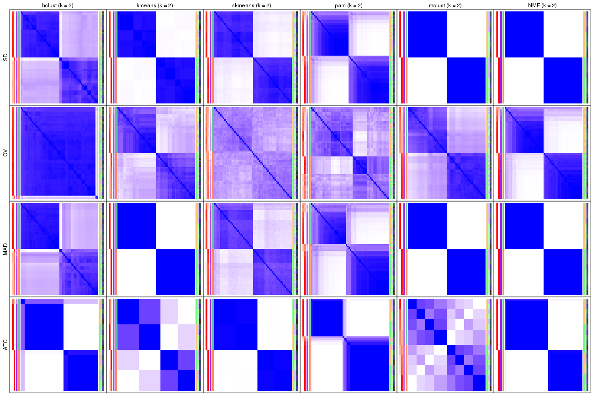</p>

</div>
<div id='tab-collect-consensus-heatmap-2'>
<pre><code class="r">collect_plots(res_list, k = 3, fun = consensus_heatmap, mc.cores = 4)
</code></pre>

<p>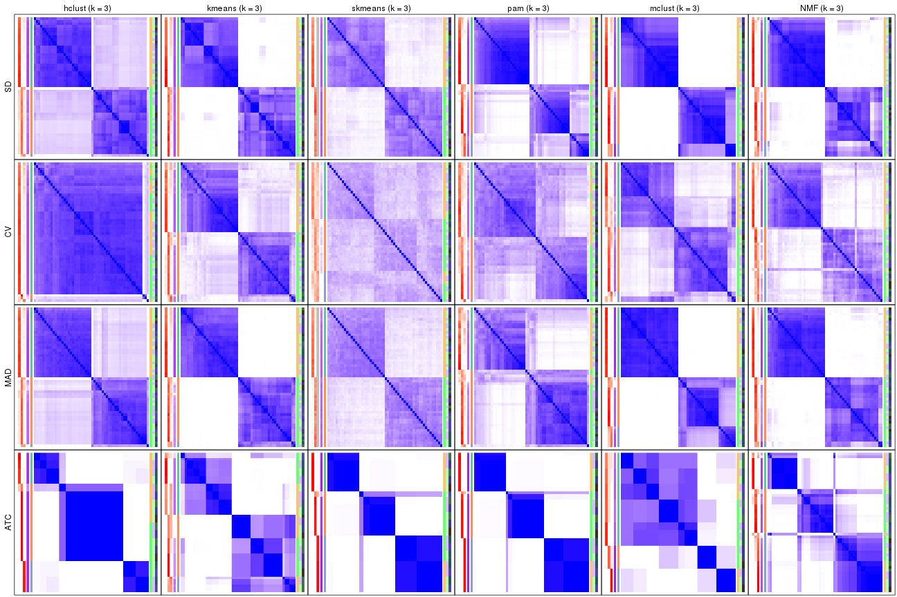</p>

</div>
<div id='tab-collect-consensus-heatmap-3'>
<pre><code class="r">collect_plots(res_list, k = 4, fun = consensus_heatmap, mc.cores = 4)
</code></pre>

<p>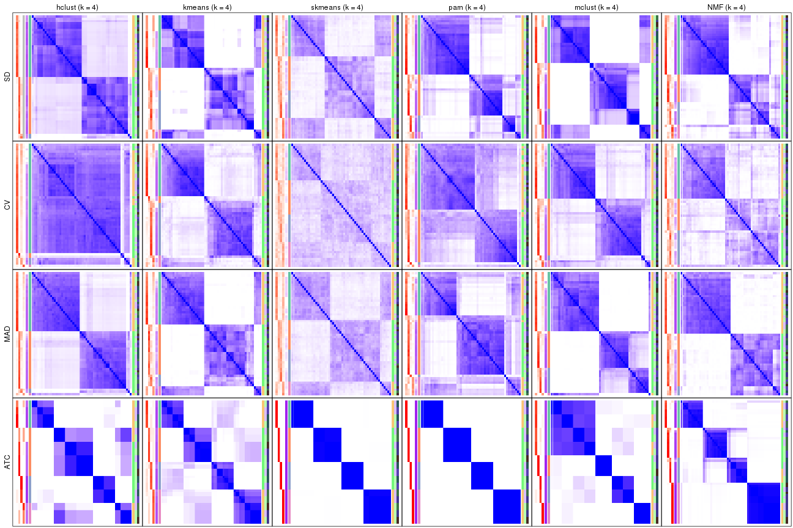</p>

</div>
<div id='tab-collect-consensus-heatmap-4'>
<pre><code class="r">collect_plots(res_list, k = 5, fun = consensus_heatmap, mc.cores = 4)
</code></pre>

<p></p>

</div>
<div id='tab-collect-consensus-heatmap-5'>
<pre><code class="r">collect_plots(res_list, k = 6, fun = consensus_heatmap, mc.cores = 4)
</code></pre>

<p>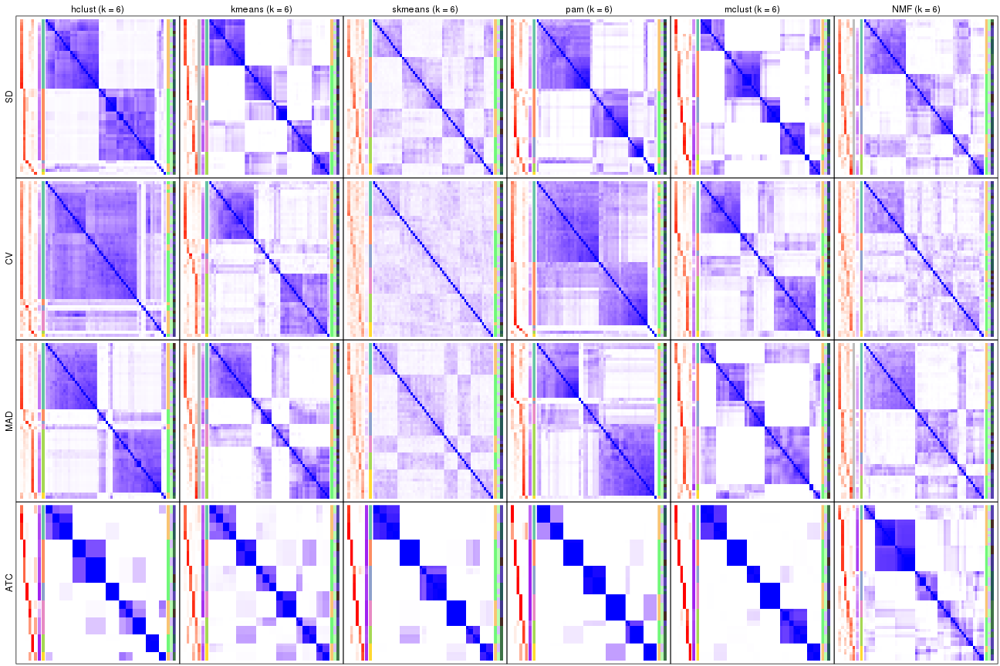</p>

</div>
</div>


### Membership heatmap

Membership heatmaps for all methods. ([What is a membership heatmap?](http://bioconductor.org/packages/devel/bioc/vignettes/cola/inst/doc/cola.html#toc_12))


<script>
$( function() {
	$( '#tabs-collect-membership-heatmap' ).tabs();
} );
</script>
<div id='tabs-collect-membership-heatmap'>
<ul>
<li><a href='#tab-collect-membership-heatmap-1'>k = 2</a></li>
<li><a href='#tab-collect-membership-heatmap-2'>k = 3</a></li>
<li><a href='#tab-collect-membership-heatmap-3'>k = 4</a></li>
<li><a href='#tab-collect-membership-heatmap-4'>k = 5</a></li>
<li><a href='#tab-collect-membership-heatmap-5'>k = 6</a></li>
</ul>
<div id='tab-collect-membership-heatmap-1'>
<pre><code class="r">collect_plots(res_list, k = 2, fun = membership_heatmap, mc.cores = 4)
</code></pre>

<p>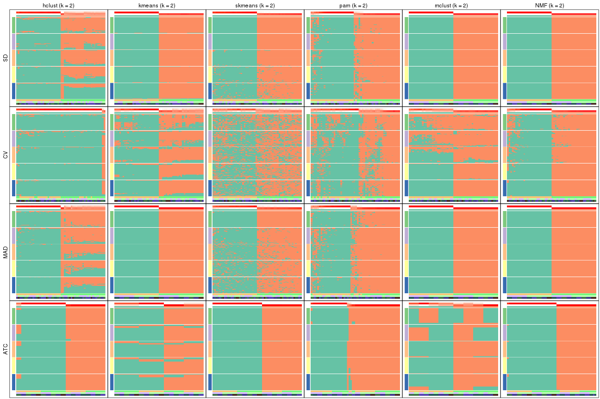</p>

</div>
<div id='tab-collect-membership-heatmap-2'>
<pre><code class="r">collect_plots(res_list, k = 3, fun = membership_heatmap, mc.cores = 4)
</code></pre>

<p>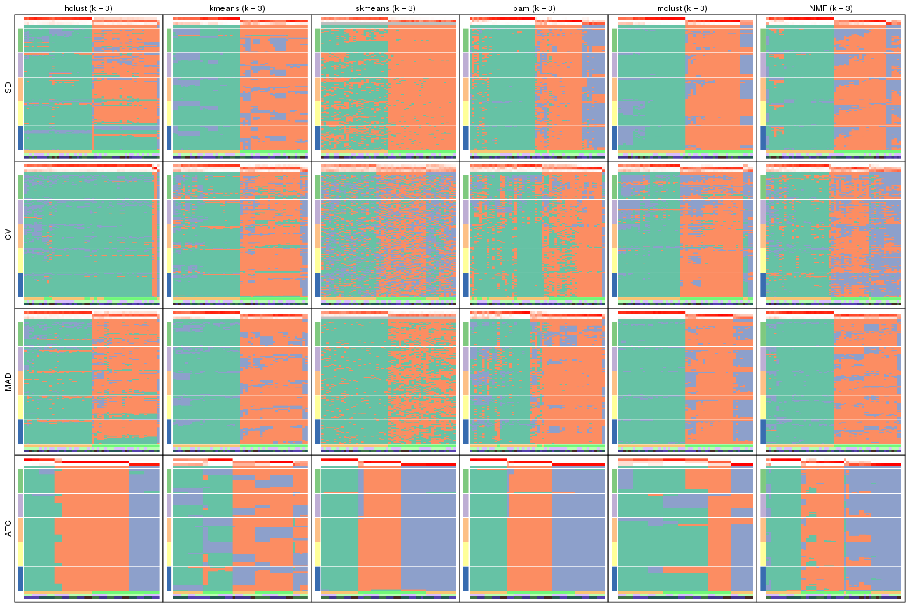</p>

</div>
<div id='tab-collect-membership-heatmap-3'>
<pre><code class="r">collect_plots(res_list, k = 4, fun = membership_heatmap, mc.cores = 4)
</code></pre>

<p>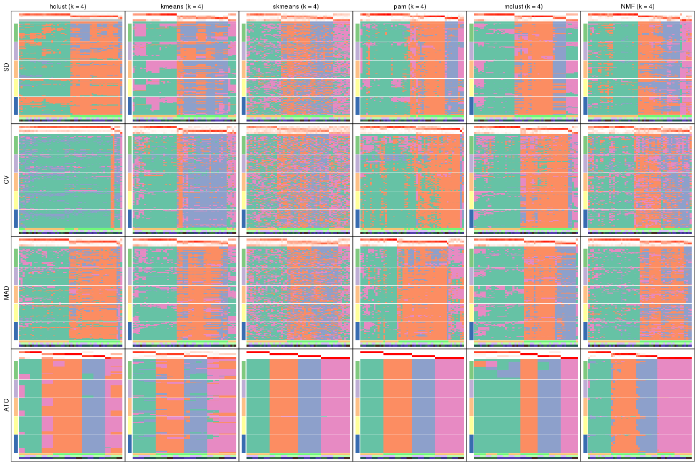</p>

</div>
<div id='tab-collect-membership-heatmap-4'>
<pre><code class="r">collect_plots(res_list, k = 5, fun = membership_heatmap, mc.cores = 4)
</code></pre>

<p>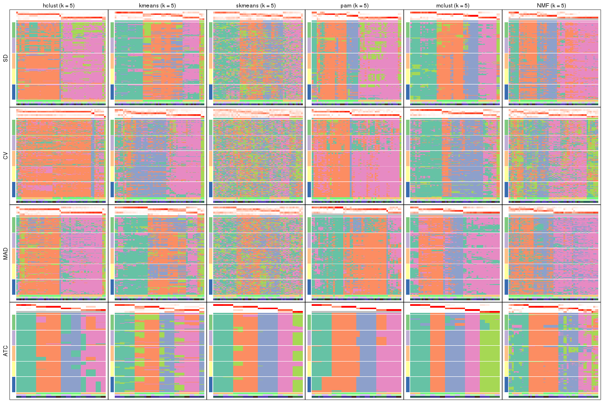</p>

</div>
<div id='tab-collect-membership-heatmap-5'>
<pre><code class="r">collect_plots(res_list, k = 6, fun = membership_heatmap, mc.cores = 4)
</code></pre>

<p>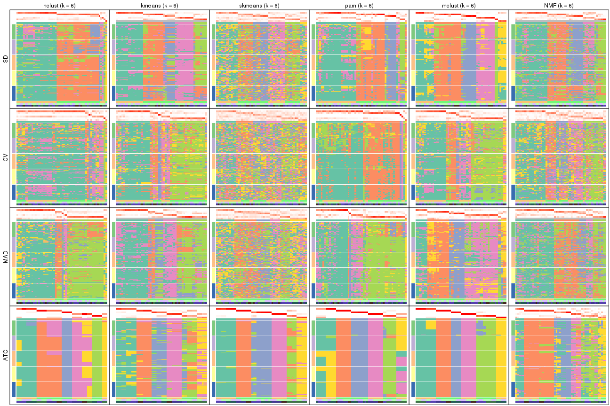</p>

</div>
</div>


### Signature heatmap

Signature heatmaps for all methods. ([What is a signature heatmap?](http://bioconductor.org/packages/devel/bioc/vignettes/cola/inst/doc/cola.html#toc_22))


Note in following heatmaps, rows are scaled.


<script>
$( function() {
	$( '#tabs-collect-get-signatures' ).tabs();
} );
</script>
<div id='tabs-collect-get-signatures'>
<ul>
<li><a href='#tab-collect-get-signatures-1'>k = 2</a></li>
<li><a href='#tab-collect-get-signatures-2'>k = 3</a></li>
<li><a href='#tab-collect-get-signatures-3'>k = 4</a></li>
<li><a href='#tab-collect-get-signatures-4'>k = 5</a></li>
<li><a href='#tab-collect-get-signatures-5'>k = 6</a></li>
</ul>
<div id='tab-collect-get-signatures-1'>
<pre><code class="r">collect_plots(res_list, k = 2, fun = get_signatures, mc.cores = 4)
</code></pre>

<p>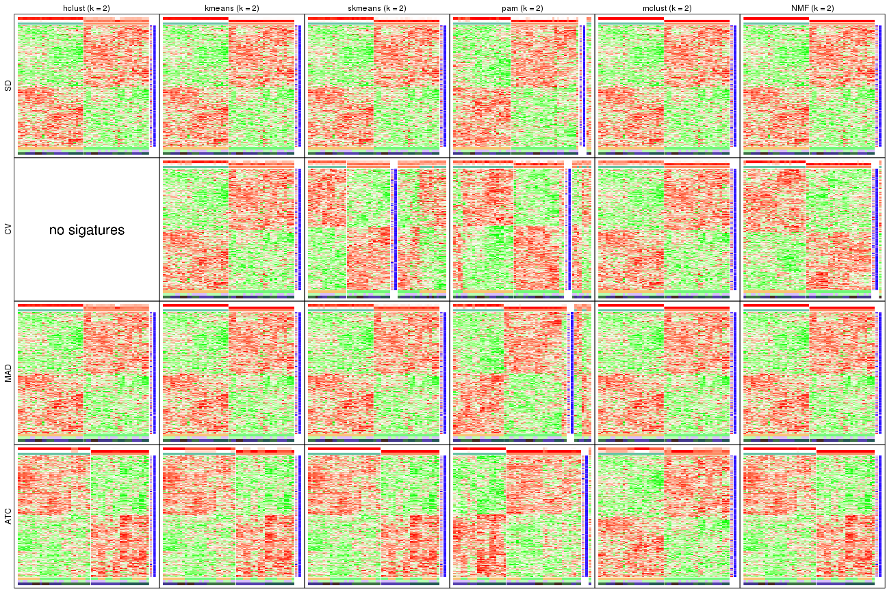</p>

</div>
<div id='tab-collect-get-signatures-2'>
<pre><code class="r">collect_plots(res_list, k = 3, fun = get_signatures, mc.cores = 4)
</code></pre>

<p>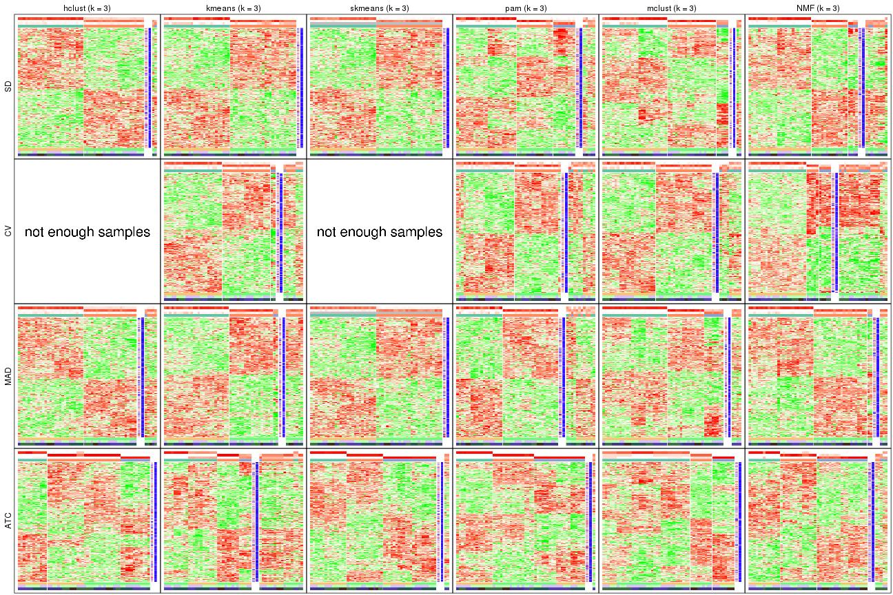</p>

</div>
<div id='tab-collect-get-signatures-3'>
<pre><code class="r">collect_plots(res_list, k = 4, fun = get_signatures, mc.cores = 4)
</code></pre>

<p>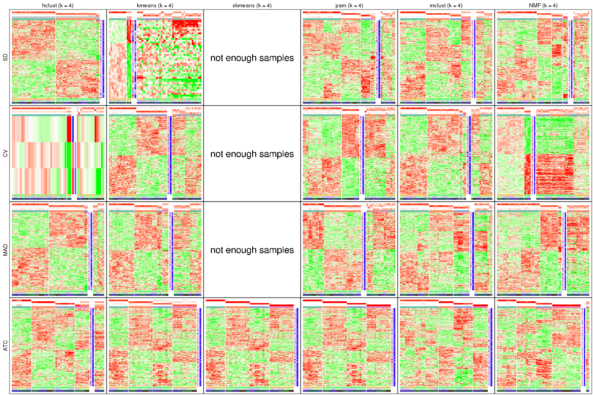</p>

</div>
<div id='tab-collect-get-signatures-4'>
<pre><code class="r">collect_plots(res_list, k = 5, fun = get_signatures, mc.cores = 4)
</code></pre>

<p>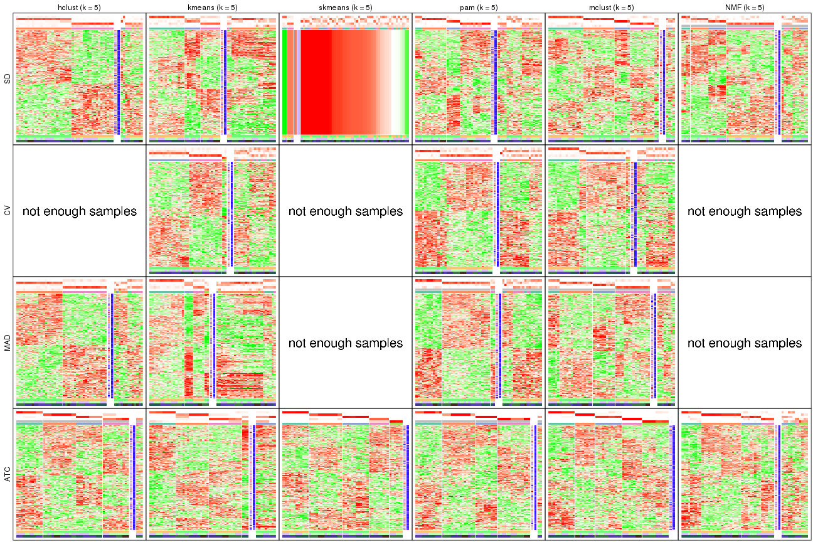</p>

</div>
<div id='tab-collect-get-signatures-5'>
<pre><code class="r">collect_plots(res_list, k = 6, fun = get_signatures, mc.cores = 4)
</code></pre>

<p>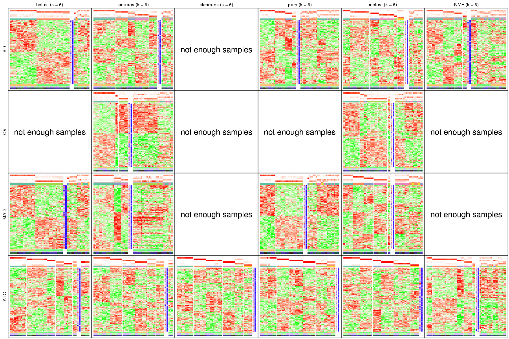</p>

</div>
</div>


### Statistics table

The statistics used for measuring the stability of consensus partitioning.
([How are they
defined?](http://bioconductor.org/packages/devel/bioc/vignettes/cola/inst/doc/cola.html#toc_13))


<script>
$( function() {
	$( '#tabs-get-stats-from-consensus-partition-list' ).tabs();
} );
</script>
<div id='tabs-get-stats-from-consensus-partition-list'>
<ul>
<li><a href='#tab-get-stats-from-consensus-partition-list-1'>k = 2</a></li>
<li><a href='#tab-get-stats-from-consensus-partition-list-2'>k = 3</a></li>
<li><a href='#tab-get-stats-from-consensus-partition-list-3'>k = 4</a></li>
<li><a href='#tab-get-stats-from-consensus-partition-list-4'>k = 5</a></li>
<li><a href='#tab-get-stats-from-consensus-partition-list-5'>k = 6</a></li>
</ul>
<div id='tab-get-stats-from-consensus-partition-list-1'>
<pre><code class="r">get_stats(res_list, k = 2)
</code></pre>

<pre><code>#&gt;             k 1-PAC mean_silhouette concordance area_increased  Rand Jaccard
#&gt; SD:NMF      2 1.000           1.000       1.000          0.510 0.491   0.491
#&gt; CV:NMF      2 0.737           0.902       0.943          0.505 0.491   0.491
#&gt; MAD:NMF     2 1.000           1.000       1.000          0.510 0.491   0.491
#&gt; ATC:NMF     2 1.000           0.997       0.998          0.504 0.497   0.497
#&gt; SD:skmeans  2 0.900           0.963       0.963          0.509 0.491   0.491
#&gt; CV:skmeans  2 0.000           0.493       0.697          0.508 0.491   0.491
#&gt; MAD:skmeans 2 0.108           0.907       0.901          0.508 0.491   0.491
#&gt; ATC:skmeans 2 1.000           0.998       0.998          0.504 0.497   0.497
#&gt; SD:mclust   2 1.000           1.000       1.000          0.510 0.491   0.491
#&gt; CV:mclust   2 0.268           0.862       0.804          0.400 0.491   0.491
#&gt; MAD:mclust  2 1.000           1.000       1.000          0.510 0.491   0.491
#&gt; ATC:mclust  2 0.239           0.709       0.794          0.507 0.491   0.491
#&gt; SD:kmeans   2 1.000           0.989       0.987          0.508 0.491   0.491
#&gt; CV:kmeans   2 0.179           0.835       0.828          0.459 0.491   0.491
#&gt; MAD:kmeans  2 1.000           1.000       1.000          0.510 0.491   0.491
#&gt; ATC:kmeans  2 0.491           0.884       0.908          0.505 0.497   0.497
#&gt; SD:pam      2 0.658           0.873       0.939          0.505 0.491   0.491
#&gt; CV:pam      2 0.102           0.653       0.808          0.488 0.493   0.493
#&gt; MAD:pam     2 0.578           0.809       0.911          0.494 0.497   0.497
#&gt; ATC:pam     2 1.000           0.960       0.983          0.497 0.508   0.508
#&gt; SD:hclust   2 0.351           0.901       0.824          0.392 0.491   0.491
#&gt; CV:hclust   2 0.921           0.953       0.960          0.108 0.927   0.927
#&gt; MAD:hclust  2 0.358           0.906       0.838          0.393 0.491   0.491
#&gt; ATC:hclust  2 1.000           0.962       0.983          0.505 0.497   0.497
</code></pre>

</div>
<div id='tab-get-stats-from-consensus-partition-list-2'>
<pre><code class="r">get_stats(res_list, k = 3)
</code></pre>

<pre><code>#&gt;             k  1-PAC mean_silhouette concordance area_increased  Rand Jaccard
#&gt; SD:NMF      3 0.6714           0.692       0.855          0.210 0.912   0.821
#&gt; CV:NMF      3 0.3788           0.572       0.742          0.289 0.820   0.646
#&gt; MAD:NMF     3 0.6533           0.762       0.861          0.192 0.965   0.929
#&gt; ATC:NMF     3 0.6753           0.781       0.899          0.317 0.721   0.498
#&gt; SD:skmeans  3 0.4243           0.800       0.706          0.292 1.000   1.000
#&gt; CV:skmeans  3 0.0000           0.220       0.540          0.331 0.804   0.619
#&gt; MAD:skmeans 3 0.1663           0.755       0.661          0.312 1.000   1.000
#&gt; ATC:skmeans 3 1.0000           0.953       0.976          0.323 0.791   0.596
#&gt; SD:mclust   3 0.7184           0.816       0.871          0.187 0.923   0.843
#&gt; CV:mclust   3 0.2282           0.644       0.767          0.438 0.927   0.853
#&gt; MAD:mclust  3 0.8533           0.818       0.888          0.201 0.894   0.783
#&gt; ATC:mclust  3 0.4906           0.850       0.836          0.135 0.547   0.368
#&gt; SD:kmeans   3 0.6116           0.849       0.827          0.218 1.000   1.000
#&gt; CV:kmeans   3 0.2478           0.680       0.788          0.293 0.950   0.897
#&gt; MAD:kmeans  3 0.6173           0.680       0.841          0.202 0.965   0.929
#&gt; ATC:kmeans  3 0.6118           0.493       0.692          0.274 0.899   0.797
#&gt; SD:pam      3 0.5475           0.748       0.866          0.248 0.881   0.757
#&gt; CV:pam      3 0.0863           0.608       0.755          0.127 0.983   0.966
#&gt; MAD:pam     3 0.3827           0.572       0.790          0.201 0.980   0.959
#&gt; ATC:pam     3 1.0000           0.972       0.984          0.350 0.799   0.613
#&gt; SD:hclust   3 0.1090           0.779       0.765          0.281 0.982   0.963
#&gt; CV:hclust   3 0.1663           0.798       0.867          1.391 0.964   0.962
#&gt; MAD:hclust  3 0.0941           0.753       0.818          0.334 0.982   0.963
#&gt; ATC:hclust  3 1.0000           0.949       0.969          0.212 0.899   0.797
</code></pre>

</div>
<div id='tab-get-stats-from-consensus-partition-list-3'>
<pre><code class="r">get_stats(res_list, k = 4)
</code></pre>

<pre><code>#&gt;             k  1-PAC mean_silhouette concordance area_increased  Rand Jaccard
#&gt; SD:NMF      4 0.5255           0.635       0.771         0.1316 0.878   0.709
#&gt; CV:NMF      4 0.3875           0.366       0.635         0.1249 0.964   0.898
#&gt; MAD:NMF     4 0.4957           0.615       0.728         0.1283 0.965   0.924
#&gt; ATC:NMF     4 0.9482           0.913       0.959         0.1325 0.807   0.502
#&gt; SD:skmeans  4 0.4384           0.318       0.605         0.1451 0.761   0.513
#&gt; CV:skmeans  4 0.0220           0.118       0.451         0.1246 0.762   0.419
#&gt; MAD:skmeans 4 0.3247           0.133       0.527         0.1316 0.785   0.561
#&gt; ATC:skmeans 4 1.0000           0.999       0.999         0.1425 0.881   0.654
#&gt; SD:mclust   4 0.6133           0.637       0.800         0.1462 0.877   0.708
#&gt; CV:mclust   4 0.4204           0.600       0.776         0.1470 0.979   0.951
#&gt; MAD:mclust  4 0.5569           0.529       0.804         0.1467 0.932   0.829
#&gt; ATC:mclust  4 0.8491           0.942       0.944         0.2424 0.799   0.590
#&gt; SD:kmeans   4 0.5671           0.203       0.605         0.1336 0.817   0.627
#&gt; CV:kmeans   4 0.4110           0.567       0.764         0.1381 0.917   0.812
#&gt; MAD:kmeans  4 0.5294           0.458       0.727         0.1337 0.885   0.751
#&gt; ATC:kmeans  4 0.6471           0.830       0.836         0.1514 0.767   0.464
#&gt; SD:pam      4 0.5388           0.704       0.818         0.1000 0.976   0.936
#&gt; CV:pam      4 0.0973           0.518       0.725         0.0443 0.984   0.966
#&gt; MAD:pam     4 0.3286           0.582       0.756         0.0920 0.869   0.730
#&gt; ATC:pam     4 1.0000           1.000       1.000         0.1342 0.874   0.636
#&gt; SD:hclust   4 0.0918           0.761       0.755         0.1611 0.982   0.962
#&gt; CV:hclust   4 0.0863           0.458       0.757         0.5788 0.899   0.887
#&gt; MAD:hclust  4 0.3278           0.648       0.777         0.1843 0.964   0.923
#&gt; ATC:hclust  4 0.7987           0.698       0.868         0.1830 0.868   0.667
</code></pre>

</div>
<div id='tab-get-stats-from-consensus-partition-list-4'>
<pre><code class="r">get_stats(res_list, k = 5)
</code></pre>

<pre><code>#&gt;             k 1-PAC mean_silhouette concordance area_increased  Rand Jaccard
#&gt; SD:NMF      5 0.484           0.574       0.711         0.0809 0.948   0.844
#&gt; CV:NMF      5 0.394           0.229       0.545         0.0736 0.945   0.835
#&gt; MAD:NMF     5 0.491           0.484       0.651         0.0932 0.884   0.741
#&gt; ATC:NMF     5 0.773           0.695       0.810         0.0390 0.962   0.848
#&gt; SD:skmeans  5 0.480           0.245       0.550         0.0652 0.894   0.640
#&gt; CV:skmeans  5 0.110           0.088       0.359         0.0661 0.785   0.333
#&gt; MAD:skmeans 5 0.443           0.134       0.475         0.0690 0.876   0.600
#&gt; ATC:skmeans 5 0.936           0.966       0.943         0.0479 0.962   0.842
#&gt; SD:mclust   5 0.696           0.765       0.858         0.1088 0.866   0.600
#&gt; CV:mclust   5 0.495           0.553       0.729         0.1011 0.864   0.674
#&gt; MAD:mclust  5 0.582           0.610       0.734         0.0667 0.918   0.771
#&gt; ATC:mclust  5 0.929           0.955       0.964         0.1272 0.899   0.652
#&gt; SD:kmeans   5 0.563           0.538       0.701         0.0639 0.799   0.463
#&gt; CV:kmeans   5 0.471           0.505       0.701         0.0857 0.897   0.733
#&gt; MAD:kmeans  5 0.530           0.466       0.644         0.0790 0.894   0.705
#&gt; ATC:kmeans  5 0.758           0.634       0.734         0.0695 0.981   0.921
#&gt; SD:pam      5 0.584           0.540       0.748         0.0633 0.966   0.904
#&gt; CV:pam      5 0.102           0.544       0.731         0.0397 0.985   0.967
#&gt; MAD:pam     5 0.336           0.554       0.732         0.0512 1.000   1.000
#&gt; ATC:pam     5 0.891           0.839       0.866         0.0497 1.000   1.000
#&gt; SD:hclust   5 0.503           0.584       0.749         0.1187 0.964   0.922
#&gt; CV:hclust   5 0.109           0.443       0.694         0.2234 0.869   0.835
#&gt; MAD:hclust  5 0.466           0.540       0.751         0.0918 0.964   0.917
#&gt; ATC:hclust  5 0.774           0.801       0.835         0.0894 0.899   0.667
</code></pre>

</div>
<div id='tab-get-stats-from-consensus-partition-list-5'>
<pre><code class="r">get_stats(res_list, k = 6)
</code></pre>

<pre><code>#&gt;             k 1-PAC mean_silhouette concordance area_increased  Rand Jaccard
#&gt; SD:NMF      6 0.506          0.4447       0.648         0.0521 0.883   0.635
#&gt; CV:NMF      6 0.435          0.2131       0.496         0.0465 0.875   0.592
#&gt; MAD:NMF     6 0.503          0.2726       0.583         0.0586 0.880   0.681
#&gt; ATC:NMF     6 0.668          0.6070       0.753         0.0247 0.948   0.777
#&gt; SD:skmeans  6 0.494          0.2066       0.503         0.0433 0.861   0.482
#&gt; CV:skmeans  6 0.245          0.0865       0.332         0.0415 0.901   0.558
#&gt; MAD:skmeans 6 0.471          0.1183       0.412         0.0418 0.830   0.388
#&gt; ATC:skmeans 6 0.929          0.9533       0.930         0.0397 0.962   0.812
#&gt; SD:mclust   6 0.743          0.6793       0.816         0.0583 0.962   0.834
#&gt; CV:mclust   6 0.536          0.5077       0.673         0.0645 0.943   0.809
#&gt; MAD:mclust  6 0.573          0.4976       0.694         0.0620 0.925   0.748
#&gt; ATC:mclust  6 0.934          0.9615       0.970         0.0388 0.975   0.867
#&gt; SD:kmeans   6 0.620          0.6579       0.730         0.0619 0.924   0.705
#&gt; CV:kmeans   6 0.504          0.4344       0.665         0.0531 0.980   0.937
#&gt; MAD:kmeans  6 0.547          0.4629       0.637         0.0459 0.982   0.933
#&gt; ATC:kmeans  6 0.821          0.7904       0.770         0.0405 0.887   0.538
#&gt; SD:pam      6 0.601          0.4052       0.732         0.0299 0.955   0.864
#&gt; CV:pam      6 0.199          0.3641       0.722         0.0365 0.980   0.956
#&gt; MAD:pam     6 0.325          0.4933       0.725         0.0376 0.978   0.939
#&gt; ATC:pam     6 0.912          0.9296       0.828         0.0448 0.902   0.605
#&gt; SD:hclust   6 0.557          0.5687       0.735         0.0687 0.982   0.957
#&gt; CV:hclust   6 0.121          0.3693       0.652         0.1482 0.901   0.855
#&gt; MAD:hclust  6 0.514          0.4912       0.719         0.0603 0.934   0.838
#&gt; ATC:hclust  6 0.866          0.8021       0.864         0.0416 0.950   0.789
</code></pre>

</div>
</div>

Following heatmap plots the partition for each combination of methods and the
lightness correspond to the silhouette scores for samples in each method. On
top the consensus subgroup is inferred from all methods by taking the mean
silhouette scores as weight.


<script>
$( function() {
	$( '#tabs-collect-stats-from-consensus-partition-list' ).tabs();
} );
</script>
<div id='tabs-collect-stats-from-consensus-partition-list'>
<ul>
<li><a href='#tab-collect-stats-from-consensus-partition-list-1'>k = 2</a></li>
<li><a href='#tab-collect-stats-from-consensus-partition-list-2'>k = 3</a></li>
<li><a href='#tab-collect-stats-from-consensus-partition-list-3'>k = 4</a></li>
<li><a href='#tab-collect-stats-from-consensus-partition-list-4'>k = 5</a></li>
<li><a href='#tab-collect-stats-from-consensus-partition-list-5'>k = 6</a></li>
</ul>
<div id='tab-collect-stats-from-consensus-partition-list-1'>
<pre><code class="r">collect_stats(res_list, k = 2)
</code></pre>

<p>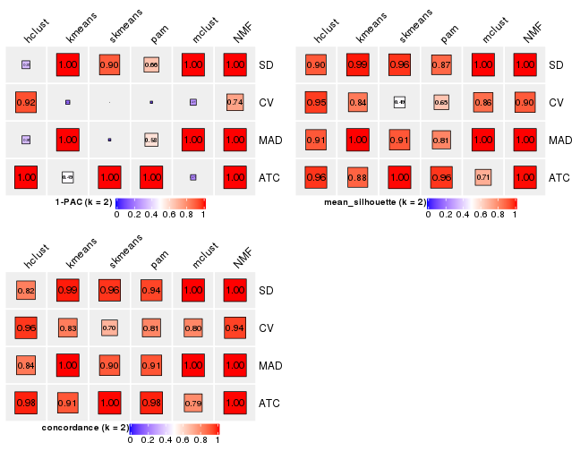</p>

</div>
<div id='tab-collect-stats-from-consensus-partition-list-2'>
<pre><code class="r">collect_stats(res_list, k = 3)
</code></pre>

<p>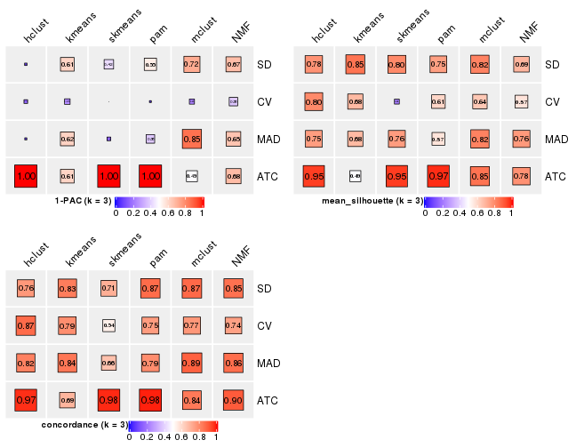</p>

</div>
<div id='tab-collect-stats-from-consensus-partition-list-3'>
<pre><code class="r">collect_stats(res_list, k = 4)
</code></pre>

<p>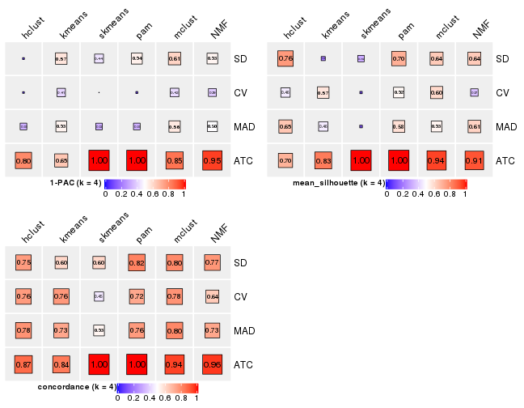</p>

</div>
<div id='tab-collect-stats-from-consensus-partition-list-4'>
<pre><code class="r">collect_stats(res_list, k = 5)
</code></pre>

<p>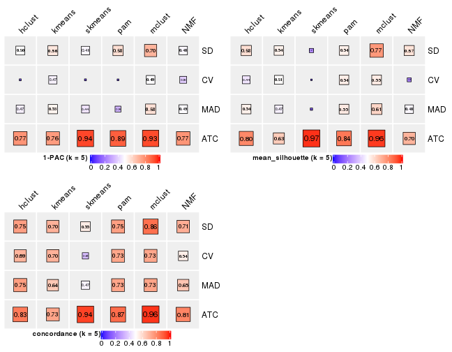</p>

</div>
<div id='tab-collect-stats-from-consensus-partition-list-5'>
<pre><code class="r">collect_stats(res_list, k = 6)
</code></pre>

<p>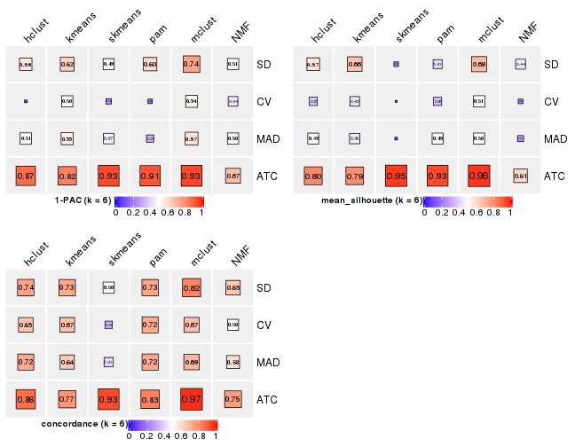</p>

</div>
</div>

### Partition from all methods


Collect partitions from all methods:


<script>
$( function() {
	$( '#tabs-collect-classes-from-consensus-partition-list' ).tabs();
} );
</script>
<div id='tabs-collect-classes-from-consensus-partition-list'>
<ul>
<li><a href='#tab-collect-classes-from-consensus-partition-list-1'>k = 2</a></li>
<li><a href='#tab-collect-classes-from-consensus-partition-list-2'>k = 3</a></li>
<li><a href='#tab-collect-classes-from-consensus-partition-list-3'>k = 4</a></li>
<li><a href='#tab-collect-classes-from-consensus-partition-list-4'>k = 5</a></li>
<li><a href='#tab-collect-classes-from-consensus-partition-list-5'>k = 6</a></li>
</ul>
<div id='tab-collect-classes-from-consensus-partition-list-1'>
<pre><code class="r">collect_classes(res_list, k = 2)
</code></pre>

<p>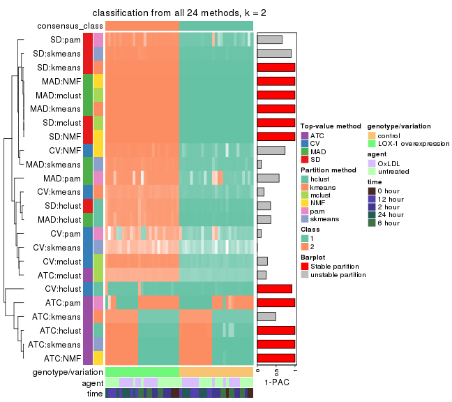</p>

</div>
<div id='tab-collect-classes-from-consensus-partition-list-2'>
<pre><code class="r">collect_classes(res_list, k = 3)
</code></pre>

<p>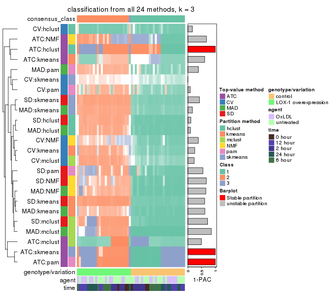</p>

</div>
<div id='tab-collect-classes-from-consensus-partition-list-3'>
<pre><code class="r">collect_classes(res_list, k = 4)
</code></pre>

<p>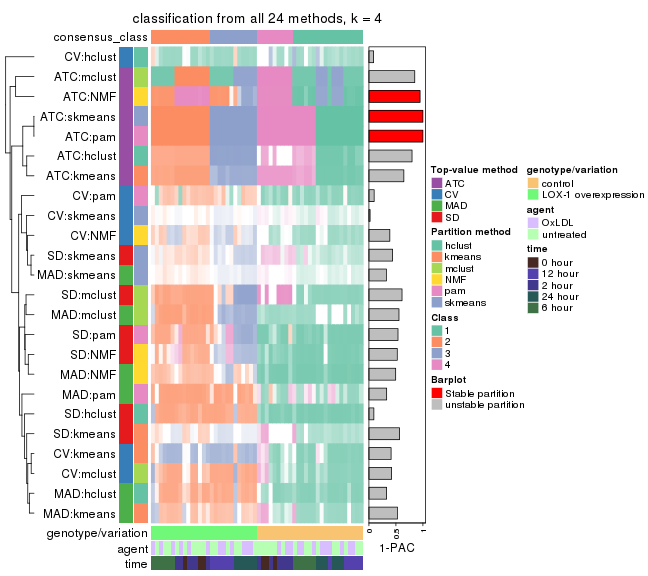</p>

</div>
<div id='tab-collect-classes-from-consensus-partition-list-4'>
<pre><code class="r">collect_classes(res_list, k = 5)
</code></pre>

<p>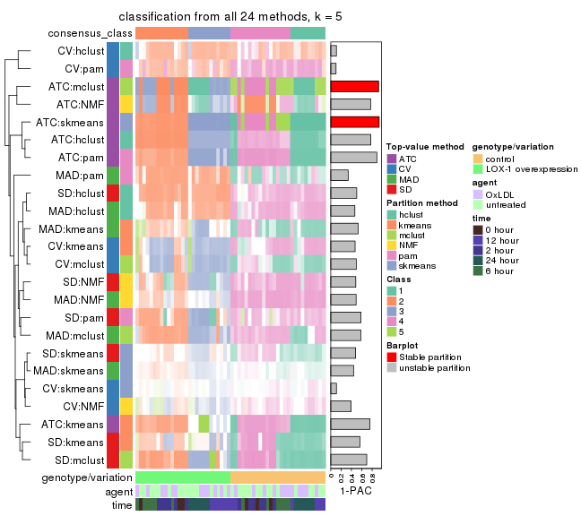</p>

</div>
<div id='tab-collect-classes-from-consensus-partition-list-5'>
<pre><code class="r">collect_classes(res_list, k = 6)
</code></pre>

<p>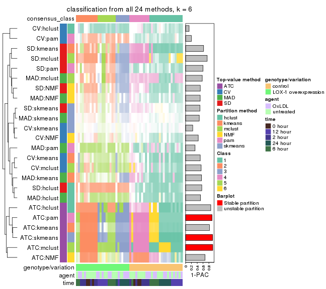</p>

</div>
</div>


### Top rows overlap


Overlap of top rows from different top-row methods:


<script>
$( function() {
	$( '#tabs-top-rows-overlap-by-euler' ).tabs();
} );
</script>
<div id='tabs-top-rows-overlap-by-euler'>
<ul>
<li><a href='#tab-top-rows-overlap-by-euler-1'>top_n = 1000</a></li>
<li><a href='#tab-top-rows-overlap-by-euler-2'>top_n = 2000</a></li>
<li><a href='#tab-top-rows-overlap-by-euler-3'>top_n = 3000</a></li>
<li><a href='#tab-top-rows-overlap-by-euler-4'>top_n = 4000</a></li>
<li><a href='#tab-top-rows-overlap-by-euler-5'>top_n = 5000</a></li>
</ul>
<div id='tab-top-rows-overlap-by-euler-1'>
<pre><code class="r">top_rows_overlap(res_list, top_n = 1000, method = &quot;euler&quot;)
</code></pre>

<p>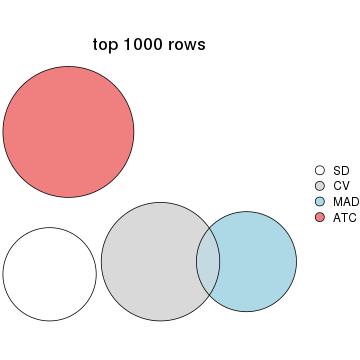</p>

</div>
<div id='tab-top-rows-overlap-by-euler-2'>
<pre><code class="r">top_rows_overlap(res_list, top_n = 2000, method = &quot;euler&quot;)
</code></pre>

<p>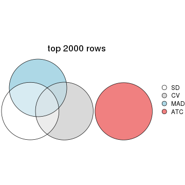</p>

</div>
<div id='tab-top-rows-overlap-by-euler-3'>
<pre><code class="r">top_rows_overlap(res_list, top_n = 3000, method = &quot;euler&quot;)
</code></pre>

<p>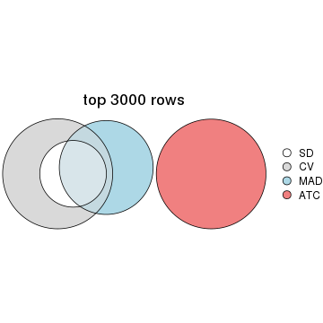</p>

</div>
<div id='tab-top-rows-overlap-by-euler-4'>
<pre><code class="r">top_rows_overlap(res_list, top_n = 4000, method = &quot;euler&quot;)
</code></pre>

<p>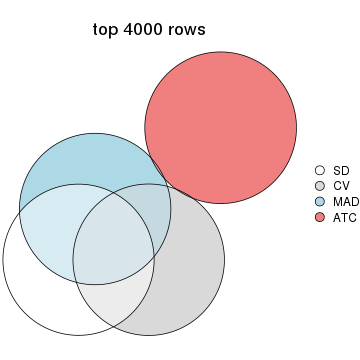</p>

</div>
<div id='tab-top-rows-overlap-by-euler-5'>
<pre><code class="r">top_rows_overlap(res_list, top_n = 5000, method = &quot;euler&quot;)
</code></pre>

<p>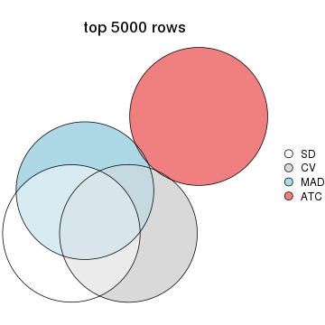</p>

</div>
</div>

Also visualize the correspondance of rankings between different top-row methods:


<script>
$( function() {
	$( '#tabs-top-rows-overlap-by-correspondance' ).tabs();
} );
</script>
<div id='tabs-top-rows-overlap-by-correspondance'>
<ul>
<li><a href='#tab-top-rows-overlap-by-correspondance-1'>top_n = 1000</a></li>
<li><a href='#tab-top-rows-overlap-by-correspondance-2'>top_n = 2000</a></li>
<li><a href='#tab-top-rows-overlap-by-correspondance-3'>top_n = 3000</a></li>
<li><a href='#tab-top-rows-overlap-by-correspondance-4'>top_n = 4000</a></li>
<li><a href='#tab-top-rows-overlap-by-correspondance-5'>top_n = 5000</a></li>
</ul>
<div id='tab-top-rows-overlap-by-correspondance-1'>
<pre><code class="r">top_rows_overlap(res_list, top_n = 1000, method = &quot;correspondance&quot;)
</code></pre>

<p>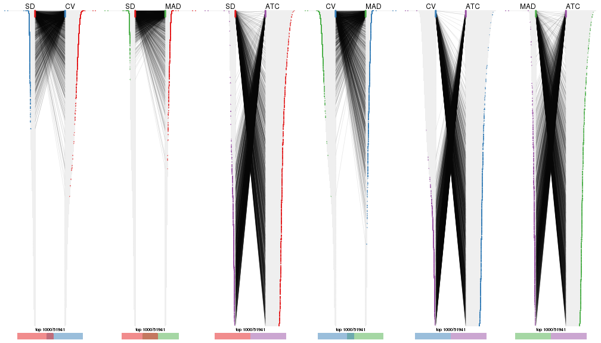</p>

</div>
<div id='tab-top-rows-overlap-by-correspondance-2'>
<pre><code class="r">top_rows_overlap(res_list, top_n = 2000, method = &quot;correspondance&quot;)
</code></pre>

<p>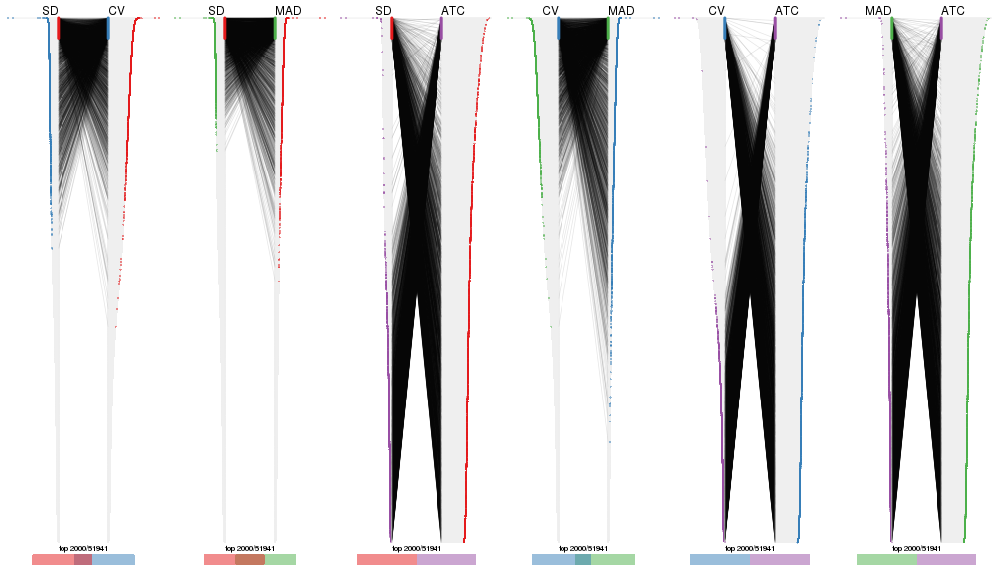</p>

</div>
<div id='tab-top-rows-overlap-by-correspondance-3'>
<pre><code class="r">top_rows_overlap(res_list, top_n = 3000, method = &quot;correspondance&quot;)
</code></pre>

<p>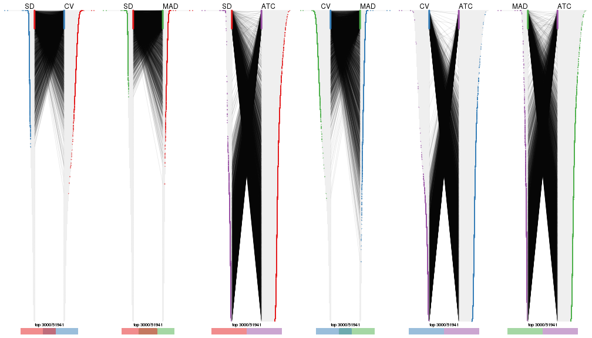</p>

</div>
<div id='tab-top-rows-overlap-by-correspondance-4'>
<pre><code class="r">top_rows_overlap(res_list, top_n = 4000, method = &quot;correspondance&quot;)
</code></pre>

<p>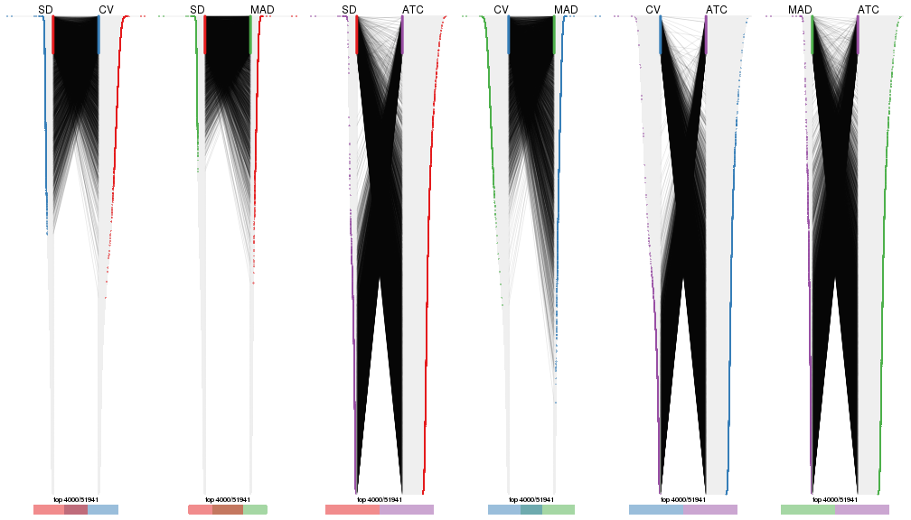</p>

</div>
<div id='tab-top-rows-overlap-by-correspondance-5'>
<pre><code class="r">top_rows_overlap(res_list, top_n = 5000, method = &quot;correspondance&quot;)
</code></pre>

<p>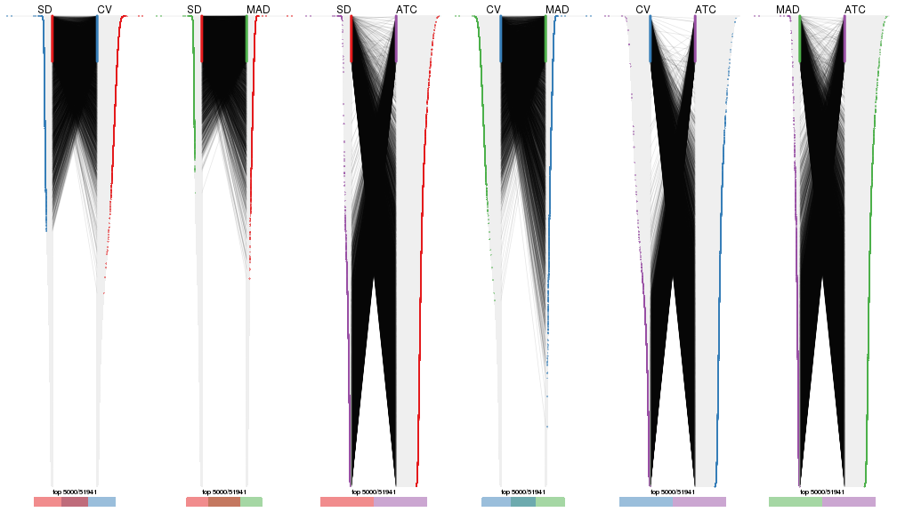</p>

</div>
</div>


Heatmaps of the top rows:


<script>
$( function() {
	$( '#tabs-top-rows-heatmap' ).tabs();
} );
</script>
<div id='tabs-top-rows-heatmap'>
<ul>
<li><a href='#tab-top-rows-heatmap-1'>top_n = 1000</a></li>
<li><a href='#tab-top-rows-heatmap-2'>top_n = 2000</a></li>
<li><a href='#tab-top-rows-heatmap-3'>top_n = 3000</a></li>
<li><a href='#tab-top-rows-heatmap-4'>top_n = 4000</a></li>
<li><a href='#tab-top-rows-heatmap-5'>top_n = 5000</a></li>
</ul>
<div id='tab-top-rows-heatmap-1'>
<pre><code class="r">top_rows_heatmap(res_list, top_n = 1000)
</code></pre>

<p>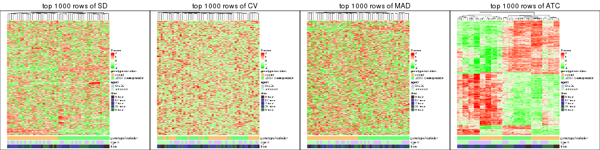</p>

</div>
<div id='tab-top-rows-heatmap-2'>
<pre><code class="r">top_rows_heatmap(res_list, top_n = 2000)
</code></pre>

<p>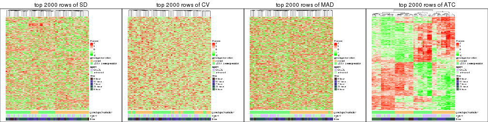</p>

</div>
<div id='tab-top-rows-heatmap-3'>
<pre><code class="r">top_rows_heatmap(res_list, top_n = 3000)
</code></pre>

<p>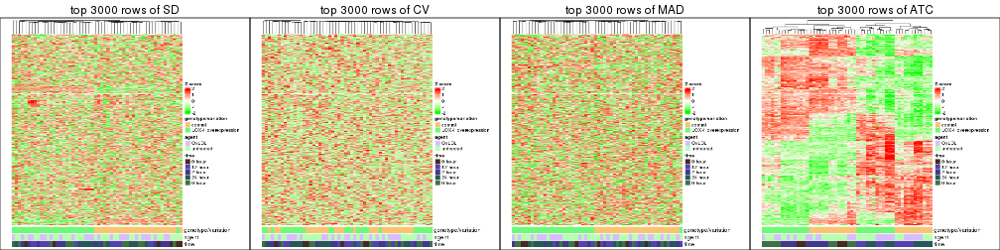</p>

</div>
<div id='tab-top-rows-heatmap-4'>
<pre><code class="r">top_rows_heatmap(res_list, top_n = 4000)
</code></pre>

<p>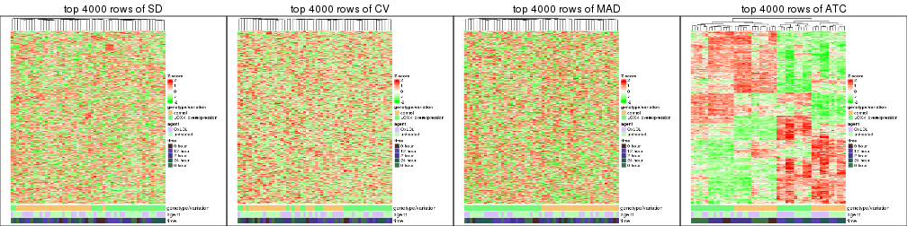</p>

</div>
<div id='tab-top-rows-heatmap-5'>
<pre><code class="r">top_rows_heatmap(res_list, top_n = 5000)
</code></pre>

<p>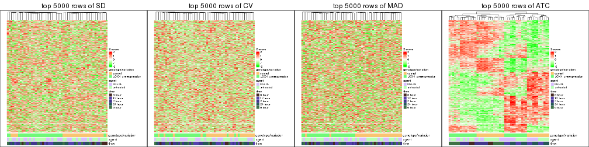</p>

</div>
</div>


### Test to known annotations


Test correlation between subgroups and known annotations. If the known
annotation is numeric, one-way ANOVA test is applied, and if the known
annotation is discrete, chi-squared contingency table test is applied.


<script>
$( function() {
	$( '#tabs-test-to-known-factors-from-consensus-partition-list' ).tabs();
} );
</script>
<div id='tabs-test-to-known-factors-from-consensus-partition-list'>
<ul>
<li><a href='#tab-test-to-known-factors-from-consensus-partition-list-1'>k = 2</a></li>
<li><a href='#tab-test-to-known-factors-from-consensus-partition-list-2'>k = 3</a></li>
<li><a href='#tab-test-to-known-factors-from-consensus-partition-list-3'>k = 4</a></li>
<li><a href='#tab-test-to-known-factors-from-consensus-partition-list-4'>k = 5</a></li>
<li><a href='#tab-test-to-known-factors-from-consensus-partition-list-5'>k = 6</a></li>
</ul>
<div id='tab-test-to-known-factors-from-consensus-partition-list-1'>
<pre><code class="r">test_to_known_factors(res_list, k = 2)
</code></pre>

<pre><code>#&gt;              n genotype/variation(p) agent(p)  time(p) k
#&gt; SD:NMF      54              1.48e-12    1.000 1.00e+00 2
#&gt; CV:NMF      53              2.46e-12    1.000 9.96e-01 2
#&gt; MAD:NMF     54              1.48e-12    1.000 1.00e+00 2
#&gt; ATC:NMF     54              1.00e+00    0.646 5.26e-11 2
#&gt; SD:skmeans  54              1.48e-12    1.000 1.00e+00 2
#&gt; CV:skmeans  34              4.09e-08    1.000 7.44e-01 2
#&gt; MAD:skmeans 54              1.48e-12    1.000 1.00e+00 2
#&gt; ATC:skmeans 54              1.00e+00    0.646 5.26e-11 2
#&gt; SD:mclust   54              1.48e-12    1.000 1.00e+00 2
#&gt; CV:mclust   54              1.48e-12    1.000 1.00e+00 2
#&gt; MAD:mclust  54              1.48e-12    1.000 1.00e+00 2
#&gt; ATC:mclust  54              1.48e-12    1.000 1.00e+00 2
#&gt; SD:kmeans   54              1.48e-12    1.000 1.00e+00 2
#&gt; CV:kmeans   54              1.48e-12    1.000 1.00e+00 2
#&gt; MAD:kmeans  54              1.48e-12    1.000 1.00e+00 2
#&gt; ATC:kmeans  54              1.00e+00    0.646 5.26e-11 2
#&gt; SD:pam      52              2.74e-11    1.000 9.50e-01 2
#&gt; CV:pam      46              2.18e-06    0.480 9.56e-01 2
#&gt; MAD:pam     47              1.97e-09    1.000 8.83e-01 2
#&gt; ATC:pam     53              4.71e-01    0.155 1.32e-08 2
#&gt; SD:hclust   54              1.48e-12    1.000 1.00e+00 2
#&gt; CV:hclust   54              4.71e-01    1.000 6.28e-01 2
#&gt; MAD:hclust  54              1.48e-12    1.000 1.00e+00 2
#&gt; ATC:hclust  54              1.00e+00    0.646 5.26e-11 2
</code></pre>

</div>
<div id='tab-test-to-known-factors-from-consensus-partition-list-2'>
<pre><code class="r">test_to_known_factors(res_list, k = 3)
</code></pre>

<pre><code>#&gt;              n genotype/variation(p) agent(p)  time(p) k
#&gt; SD:NMF      45              1.69e-10    0.201 2.53e-01 3
#&gt; CV:NMF      34              4.14e-08    0.952 2.86e-01 3
#&gt; MAD:NMF     51              8.42e-12    0.950 3.94e-01 3
#&gt; ATC:NMF     49              6.74e-07    0.131 8.96e-07 3
#&gt; SD:skmeans  54              1.48e-12    1.000 1.00e+00 3
#&gt; CV:skmeans   0                    NA       NA       NA 3
#&gt; MAD:skmeans 54              1.48e-12    1.000 1.00e+00 3
#&gt; ATC:skmeans 52              2.84e-07    0.583 1.68e-08 3
#&gt; SD:mclust   52              5.11e-12    0.723 2.21e-03 3
#&gt; CV:mclust   45              1.46e-10    1.000 8.85e-01 3
#&gt; MAD:mclust  50              1.39e-11    0.405 9.64e-03 3
#&gt; ATC:mclust  54              1.23e-04    0.509 6.90e-09 3
#&gt; SD:kmeans   54              1.48e-12    1.000 1.00e+00 3
#&gt; CV:kmeans   46              1.03e-10    0.945 9.33e-01 3
#&gt; MAD:kmeans  47              6.22e-11    0.988 8.86e-01 3
#&gt; ATC:kmeans  36              8.61e-04    0.529 1.96e-12 3
#&gt; SD:pam      49              2.29e-11    0.559 1.17e-02 3
#&gt; CV:pam      43              4.41e-07    0.580 9.01e-01 3
#&gt; MAD:pam     42              6.86e-10    1.000 9.02e-01 3
#&gt; ATC:pam     53              9.12e-08    0.360 1.61e-07 3
#&gt; SD:hclust   52              4.11e-12    1.000 9.99e-01 3
#&gt; CV:hclust   50                    NA       NA       NA 3
#&gt; MAD:hclust  49              1.93e-11    1.000 9.91e-01 3
#&gt; ATC:hclust  54              6.14e-06    0.763 6.90e-09 3
</code></pre>

</div>
<div id='tab-test-to-known-factors-from-consensus-partition-list-3'>
<pre><code class="r">test_to_known_factors(res_list, k = 4)
</code></pre>

<pre><code>#&gt;              n genotype/variation(p) agent(p)  time(p) k
#&gt; SD:NMF      44              1.51e-09    0.525 3.20e-03 4
#&gt; CV:NMF      21              1.07e-04    0.810 5.55e-01 4
#&gt; MAD:NMF     40              2.06e-09    0.592 1.30e-01 4
#&gt; ATC:NMF     52              2.10e-05    0.558 1.57e-15 4
#&gt; SD:skmeans   3              6.65e-01    0.665 6.65e-01 4
#&gt; CV:skmeans   0                    NA       NA       NA 4
#&gt; MAD:skmeans  0                    NA       NA       NA 4
#&gt; ATC:skmeans 54              1.12e-11    0.910 2.73e-07 4
#&gt; SD:mclust   44              1.51e-09    0.578 1.32e-05 4
#&gt; CV:mclust   41              6.54e-09    0.562 4.15e-01 4
#&gt; MAD:mclust  43              4.60e-10    0.421 8.64e-05 4
#&gt; ATC:mclust  54              4.40e-04    0.717 1.49e-17 4
#&gt; SD:kmeans   14                    NA    0.301 2.62e-02 4
#&gt; CV:kmeans   37              9.24e-09    0.581 6.04e-01 4
#&gt; MAD:kmeans  37              4.60e-08    0.416 3.56e-03 4
#&gt; ATC:kmeans  54              1.12e-11    0.910 2.73e-07 4
#&gt; SD:pam      45              9.25e-10    0.514 1.42e-03 4
#&gt; CV:pam      35              5.79e-06    0.372 6.81e-01 4
#&gt; MAD:pam     36              1.71e-08    0.846 9.84e-01 4
#&gt; ATC:pam     54              1.12e-11    0.910 2.73e-07 4
#&gt; SD:hclust   54              1.88e-12    0.987 9.52e-01 4
#&gt; CV:hclust   37              1.44e-01    0.175 8.12e-01 4
#&gt; MAD:hclust  47              6.22e-11    0.983 9.24e-01 4
#&gt; ATC:hclust  48              2.13e-10    0.834 6.16e-08 4
</code></pre>

</div>
<div id='tab-test-to-known-factors-from-consensus-partition-list-4'>
<pre><code class="r">test_to_known_factors(res_list, k = 5)
</code></pre>

<pre><code>#&gt;              n genotype/variation(p) agent(p)  time(p) k
#&gt; SD:NMF      42              4.01e-09   0.7413 2.65e-03 5
#&gt; CV:NMF       0                    NA       NA       NA 5
#&gt; MAD:NMF     24                    NA       NA       NA 5
#&gt; ATC:NMF     42              1.77e-03   0.0319 4.23e-13 5
#&gt; SD:skmeans   5                    NA   1.0000 8.21e-02 5
#&gt; CV:skmeans   0                    NA       NA       NA 5
#&gt; MAD:skmeans  0                    NA       NA       NA 5
#&gt; ATC:skmeans 54              5.26e-11   0.9180 1.10e-10 5
#&gt; SD:mclust   50              3.61e-10   0.3978 1.02e-05 5
#&gt; CV:mclust   38              1.12e-07   0.8054 3.86e-03 5
#&gt; MAD:mclust  46              5.67e-10   0.2575 1.37e-04 5
#&gt; ATC:mclust  54              1.67e-08   0.8528 1.07e-15 5
#&gt; SD:kmeans   33              3.22e-07   0.3196 4.38e-03 5
#&gt; CV:kmeans   36              7.49e-08   0.7851 6.52e-01 5
#&gt; MAD:kmeans  27              5.89e-06   0.1379 3.45e-03 5
#&gt; ATC:kmeans  45              9.25e-10   0.2595 5.05e-07 5
#&gt; SD:pam      35              4.65e-07   0.2423 3.20e-03 5
#&gt; CV:pam      35              5.79e-06   0.6992 8.49e-01 5
#&gt; MAD:pam     36              1.52e-08   0.8945 9.56e-01 5
#&gt; ATC:pam     52              3.00e-11   0.7291 5.01e-07 5
#&gt; SD:hclust   44              2.52e-10   0.7925 9.39e-01 5
#&gt; CV:hclust   30              7.78e-01   0.9458 4.93e-01 5
#&gt; MAD:hclust  41              1.12e-09   0.8728 9.91e-01 5
#&gt; ATC:hclust  51              4.89e-11   0.5567 5.54e-07 5
</code></pre>

</div>
<div id='tab-test-to-known-factors-from-consensus-partition-list-5'>
<pre><code class="r">test_to_known_factors(res_list, k = 6)
</code></pre>

<pre><code>#&gt;              n genotype/variation(p) agent(p)  time(p) k
#&gt; SD:NMF      30              4.89e-06  0.45299 3.95e-04 6
#&gt; CV:NMF       2                    NA       NA       NA 6
#&gt; MAD:NMF      1                    NA       NA       NA 6
#&gt; ATC:NMF     35              2.39e-02  0.04077 3.97e-15 6
#&gt; SD:skmeans   1                    NA       NA       NA 6
#&gt; CV:skmeans   0                    NA       NA       NA 6
#&gt; MAD:skmeans  0                    NA       NA       NA 6
#&gt; ATC:skmeans 54              2.10e-10  0.92970 4.54e-14 6
#&gt; SD:mclust   44              2.32e-08  0.33426 3.44e-06 6
#&gt; CV:mclust   34              7.45e-07  0.62244 4.27e-02 6
#&gt; MAD:mclust  34              7.45e-07  0.70350 5.19e-04 6
#&gt; ATC:mclust  54              2.10e-10  0.92970 4.54e-14 6
#&gt; SD:kmeans   46              2.46e-09  0.26876 1.82e-05 6
#&gt; CV:kmeans   25              3.73e-06  0.62524 7.11e-01 6
#&gt; MAD:kmeans  27              1.99e-05  0.16068 4.43e-03 6
#&gt; ATC:kmeans  51              8.65e-10  0.72566 3.07e-13 6
#&gt; SD:pam      26              9.54e-06  0.25444 2.26e-03 6
#&gt; CV:pam      13                    NA       NA       NA 6
#&gt; MAD:pam     32              1.13e-07  0.57958 7.71e-01 6
#&gt; ATC:pam     54              2.10e-10  0.81194 1.31e-12 6
#&gt; SD:hclust   43              4.15e-10  0.89204 9.86e-01 6
#&gt; CV:hclust   23                    NA       NA       NA 6
#&gt; MAD:hclust  39              3.40e-09  0.61416 8.94e-01 6
#&gt; ATC:hclust  48              3.55e-09  0.00808 8.56e-08 6
</code></pre>

</div>
</div>


 
## Results for each method


---------------------------------------------------


### SD:hclust


The object with results only for a single top-value method and a single partition method 
can be extracted as:

```r
res = res_list["SD", "hclust"]
# you can also extract it by
# res = res_list["SD:hclust"]
```

A summary of `res` and all the functions that can be applied to it:

```r
res
```

```
#> A 'ConsensusPartition' object with k = 2, 3, 4, 5, 6.
#>   On a matrix with 51941 rows and 54 columns.
#>   Top rows (1000, 2000, 3000, 4000, 5000) are extracted by 'SD' method.
#>   Subgroups are detected by 'hclust' method.
#>   Performed in total 1250 partitions by row resampling.
#>   Best k for subgroups seems to be 2.
#> 
#> Following methods can be applied to this 'ConsensusPartition' object:
#>  [1] "cola_report"             "collect_classes"         "collect_plots"          
#>  [4] "collect_stats"           "colnames"                "compare_signatures"     
#>  [7] "consensus_heatmap"       "dimension_reduction"     "functional_enrichment"  
#> [10] "get_anno_col"            "get_anno"                "get_classes"            
#> [13] "get_consensus"           "get_matrix"              "get_membership"         
#> [16] "get_param"               "get_signatures"          "get_stats"              
#> [19] "is_best_k"               "is_stable_k"             "membership_heatmap"     
#> [22] "ncol"                    "nrow"                    "plot_ecdf"              
#> [25] "rownames"                "select_partition_number" "show"                   
#> [28] "suggest_best_k"          "test_to_known_factors"
```

`collect_plots()` function collects all the plots made from `res` for all `k` (number of partitions)
into one single page to provide an easy and fast comparison between different `k`.

```r
collect_plots(res)
```

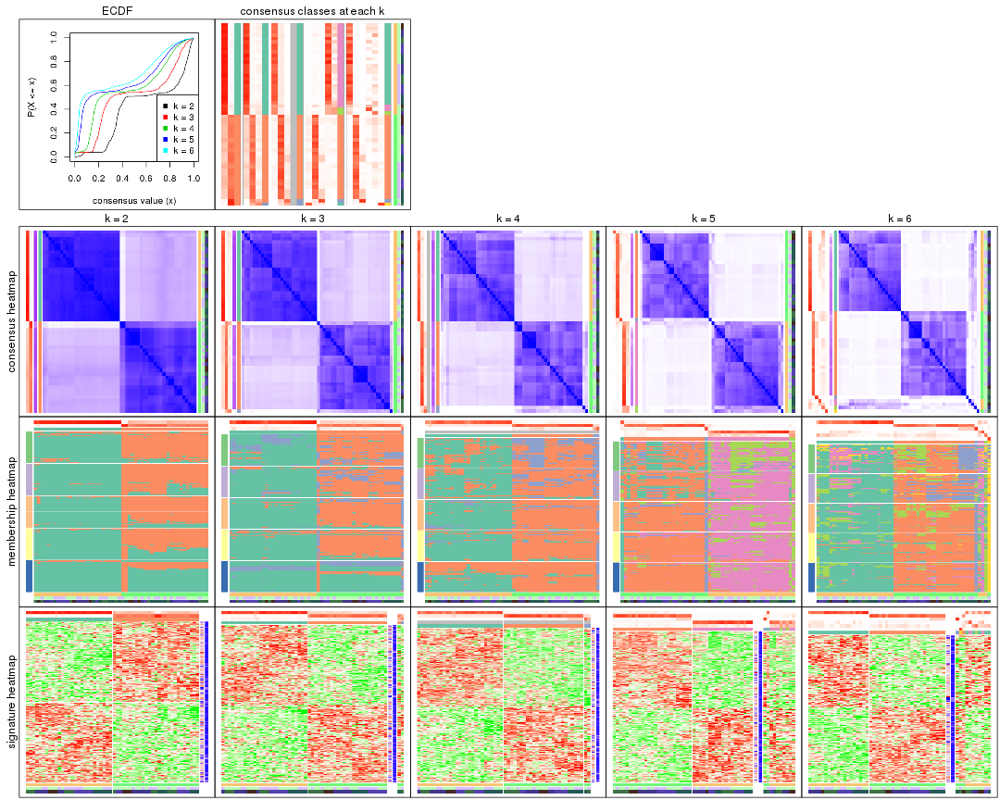

The plots are:

- The first row: a plot of the ECDF (empirical cumulative distribution
  function) curves of the consensus matrix for each `k` and the heatmap of
  predicted classes for each `k`.
- The second row: heatmaps of the consensus matrix for each `k`.
- The third row: heatmaps of the membership matrix for each `k`.
- The fouth row: heatmaps of the signatures for each `k`.

All the plots in panels can be made by individual functions and they are
plotted later in this section.

`select_partition_number()` produces several plots showing different
statistics for choosing "optimized" `k`. There are following statistics:

- ECDF curves of the consensus matrix for each `k`;
- 1-PAC. [The PAC
  score](https://en.wikipedia.org/wiki/Consensus_clustering#Over-interpretation_potential_of_consensus_clustering)
  measures the proportion of the ambiguous subgrouping.
- Mean silhouette score.
- Concordance. The mean probability of fiting the consensus class ids in all
  partitions.
- Area increased. Denote $A_k$ as the area under the ECDF curve for current
  `k`, the area increased is defined as $A_k - A_{k-1}$.
- Rand index. The percent of pairs of samples that are both in a same cluster
  or both are not in a same cluster in the partition of k and k-1.
- Jaccard index. The ratio of pairs of samples are both in a same cluster in
  the partition of k and k-1 and the pairs of samples are both in a same
  cluster in the partition k or k-1.

The detailed explanations of these statistics can be found in [the _cola_
vignette](http://bioconductor.org/packages/devel/bioc/vignettes/cola/inst/doc/cola.html#toc_13).

Generally speaking, lower PAC score, higher mean silhouette score or higher
concordance corresponds to better partition. Rand index and Jaccard index
measure how similar the current partition is compared to partition with `k-1`.
If they are too similar, we won't accept `k` is better than `k-1`.

```r
select_partition_number(res)
```

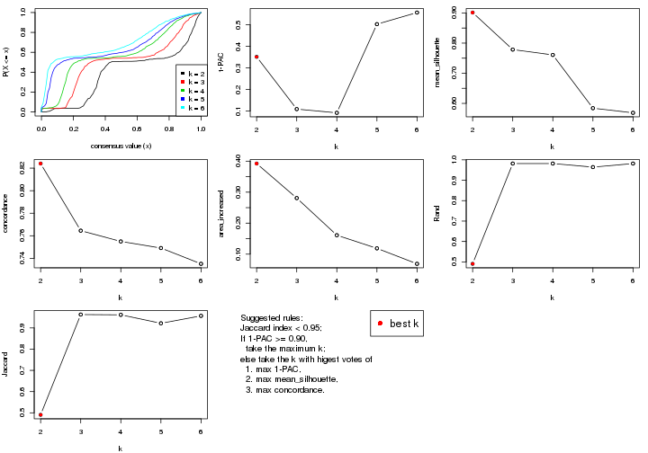

The numeric values for all these statistics can be obtained by `get_stats()`.

```r
get_stats(res)
```

```
#>   k  1-PAC mean_silhouette concordance area_increased  Rand Jaccard
#> 2 2 0.3514           0.901       0.824         0.3923 0.491   0.491
#> 3 3 0.1090           0.779       0.765         0.2808 0.982   0.963
#> 4 4 0.0918           0.761       0.755         0.1611 0.982   0.962
#> 5 5 0.5027           0.584       0.749         0.1187 0.964   0.922
#> 6 6 0.5566           0.569       0.735         0.0687 0.982   0.957
```

`suggest_best_k()` suggests the best $k$ based on these statistics. The rules are as follows:

- All $k$ with Jaccard index larger than 0.95 are removed because increasing
  $k$ does not provide enough extra information. If all $k$ are removed, it is
  marked as no subgroup is detected.
- For all $k$ with 1-PAC score larger than 0.9, the maximal $k$ is taken as
  the best $k$, and other $k$ are marked as optional $k$.
- If it does not fit the second rule. The $k$ with the maximal vote of the
  highest 1-PAC score, highest mean silhouette, and highest concordance is
  taken as the best $k$.

```r
suggest_best_k(res)
```

```
#> [1] 2
```


Following shows the table of the partitions (You need to click the **show/hide
code output** link to see it). The membership matrix (columns with name `p*`)
is inferred by
[`clue::cl_consensus()`](https://www.rdocumentation.org/link/cl_consensus?package=clue)
function with the `SE` method. Basically the value in the membership matrix
represents the probability to belong to a certain group. The finall class
label for an item is determined with the group with highest probability it
belongs to.

In `get_classes()` function, the entropy is calculated from the membership
matrix and the silhouette score is calculated from the consensus matrix.


<script>
$( function() {
	$( '#tabs-SD-hclust-get-classes' ).tabs();
} );
</script>
<div id='tabs-SD-hclust-get-classes'>
<ul>
<li><a href='#tab-SD-hclust-get-classes-1'>k = 2</a></li>
<li><a href='#tab-SD-hclust-get-classes-2'>k = 3</a></li>
<li><a href='#tab-SD-hclust-get-classes-3'>k = 4</a></li>
<li><a href='#tab-SD-hclust-get-classes-4'>k = 5</a></li>
<li><a href='#tab-SD-hclust-get-classes-5'>k = 6</a></li>
</ul>

<div id='tab-SD-hclust-get-classes-1'>
<p><a id='tab-SD-hclust-get-classes-1-a' style='color:#0366d6' href='#'>show/hide code output</a></p>
<pre><code class="r">cbind(get_classes(res, k = 2), get_membership(res, k = 2))
</code></pre>

<pre><code>#&gt;           class entropy silhouette    p1    p2
#&gt; GSM329068     2  0.9000      0.890 0.316 0.684
#&gt; GSM329074     2  0.9686      0.813 0.396 0.604
#&gt; GSM329100     2  0.9522      0.851 0.372 0.628
#&gt; GSM329062     2  0.9209      0.886 0.336 0.664
#&gt; GSM329079     2  0.9087      0.886 0.324 0.676
#&gt; GSM329090     2  0.9323      0.870 0.348 0.652
#&gt; GSM329066     2  0.9209      0.887 0.336 0.664
#&gt; GSM329086     2  0.9795      0.815 0.416 0.584
#&gt; GSM329099     2  0.9209      0.887 0.336 0.664
#&gt; GSM329071     2  0.8861      0.891 0.304 0.696
#&gt; GSM329078     2  0.9460      0.849 0.364 0.636
#&gt; GSM329081     2  0.8763      0.890 0.296 0.704
#&gt; GSM329096     2  0.8267      0.871 0.260 0.740
#&gt; GSM329102     2  0.8144      0.862 0.252 0.748
#&gt; GSM329104     2  0.2603      0.640 0.044 0.956
#&gt; GSM329067     2  0.9248      0.877 0.340 0.660
#&gt; GSM329072     2  0.9661      0.814 0.392 0.608
#&gt; GSM329075     2  0.9000      0.889 0.316 0.684
#&gt; GSM329058     2  0.8713      0.887 0.292 0.708
#&gt; GSM329073     2  0.2948      0.645 0.052 0.948
#&gt; GSM329107     2  0.9248      0.886 0.340 0.660
#&gt; GSM329057     2  0.9393      0.873 0.356 0.644
#&gt; GSM329085     2  0.9460      0.849 0.364 0.636
#&gt; GSM329089     2  0.9129      0.886 0.328 0.672
#&gt; GSM329076     2  0.8267      0.871 0.260 0.740
#&gt; GSM329094     2  0.8267      0.871 0.260 0.740
#&gt; GSM329105     2  0.8207      0.871 0.256 0.744
#&gt; GSM329056     1  0.1843      0.958 0.972 0.028
#&gt; GSM329069     1  0.2423      0.954 0.960 0.040
#&gt; GSM329077     1  0.5294      0.834 0.880 0.120
#&gt; GSM329070     1  0.1414      0.962 0.980 0.020
#&gt; GSM329082     1  0.2778      0.948 0.952 0.048
#&gt; GSM329092     1  0.2948      0.939 0.948 0.052
#&gt; GSM329083     1  0.4022      0.912 0.920 0.080
#&gt; GSM329101     1  0.1414      0.963 0.980 0.020
#&gt; GSM329106     1  0.2423      0.952 0.960 0.040
#&gt; GSM329087     1  0.2423      0.956 0.960 0.040
#&gt; GSM329091     1  0.1184      0.960 0.984 0.016
#&gt; GSM329093     1  0.2603      0.946 0.956 0.044
#&gt; GSM329080     1  0.0938      0.963 0.988 0.012
#&gt; GSM329084     1  0.1843      0.959 0.972 0.028
#&gt; GSM329088     1  0.1184      0.963 0.984 0.016
#&gt; GSM329059     1  0.1633      0.962 0.976 0.024
#&gt; GSM329097     1  0.2043      0.959 0.968 0.032
#&gt; GSM329098     1  0.1633      0.961 0.976 0.024
#&gt; GSM329055     1  0.0672      0.963 0.992 0.008
#&gt; GSM329103     1  0.2043      0.958 0.968 0.032
#&gt; GSM329108     1  0.1633      0.963 0.976 0.024
#&gt; GSM329061     1  0.2236      0.953 0.964 0.036
#&gt; GSM329064     1  0.2236      0.961 0.964 0.036
#&gt; GSM329065     1  0.2043      0.957 0.968 0.032
#&gt; GSM329060     1  0.1414      0.963 0.980 0.020
#&gt; GSM329063     1  0.1414      0.961 0.980 0.020
#&gt; GSM329095     1  0.2778      0.943 0.952 0.048
</code></pre>

<script>
$('#tab-SD-hclust-get-classes-1-a').parent().next().next().hide();
$('#tab-SD-hclust-get-classes-1-a').click(function(){
  $('#tab-SD-hclust-get-classes-1-a').parent().next().next().toggle();
  return(false);
});
</script>
</div>

<div id='tab-SD-hclust-get-classes-2'>
<p><a id='tab-SD-hclust-get-classes-2-a' style='color:#0366d6' href='#'>show/hide code output</a></p>
<pre><code class="r">cbind(get_classes(res, k = 3), get_membership(res, k = 3))
</code></pre>

<pre><code>#&gt;           class entropy silhouette    p1    p2    p3
#&gt; GSM329068     2   0.653      0.777 0.188 0.744 0.068
#&gt; GSM329074     2   0.820      0.621 0.268 0.616 0.116
#&gt; GSM329100     2   0.814      0.676 0.232 0.636 0.132
#&gt; GSM329062     2   0.685      0.783 0.216 0.716 0.068
#&gt; GSM329079     2   0.754      0.773 0.216 0.680 0.104
#&gt; GSM329090     2   0.782      0.757 0.224 0.660 0.116
#&gt; GSM329066     2   0.689      0.784 0.212 0.716 0.072
#&gt; GSM329086     2   0.846      0.706 0.280 0.592 0.128
#&gt; GSM329099     2   0.681      0.784 0.212 0.720 0.068
#&gt; GSM329071     2   0.635      0.784 0.188 0.752 0.060
#&gt; GSM329078     2   0.813      0.712 0.244 0.632 0.124
#&gt; GSM329081     2   0.564      0.777 0.180 0.784 0.036
#&gt; GSM329096     2   0.639      0.713 0.148 0.764 0.088
#&gt; GSM329102     2   0.677      0.684 0.144 0.744 0.112
#&gt; GSM329104     2   0.615     -0.683 0.000 0.592 0.408
#&gt; GSM329067     2   0.772      0.733 0.208 0.672 0.120
#&gt; GSM329072     2   0.841      0.690 0.272 0.600 0.128
#&gt; GSM329075     2   0.686      0.768 0.188 0.728 0.084
#&gt; GSM329058     2   0.552      0.775 0.180 0.788 0.032
#&gt; GSM329073     3   0.611      0.000 0.000 0.396 0.604
#&gt; GSM329107     2   0.629      0.791 0.216 0.740 0.044
#&gt; GSM329057     2   0.711      0.769 0.224 0.700 0.076
#&gt; GSM329085     2   0.813      0.712 0.244 0.632 0.124
#&gt; GSM329089     2   0.625      0.779 0.212 0.744 0.044
#&gt; GSM329076     2   0.647      0.709 0.148 0.760 0.092
#&gt; GSM329094     2   0.647      0.709 0.148 0.760 0.092
#&gt; GSM329105     2   0.639      0.713 0.148 0.764 0.088
#&gt; GSM329056     1   0.368      0.907 0.892 0.028 0.080
#&gt; GSM329069     1   0.429      0.893 0.864 0.032 0.104
#&gt; GSM329077     1   0.686      0.753 0.740 0.132 0.128
#&gt; GSM329070     1   0.341      0.914 0.904 0.028 0.068
#&gt; GSM329082     1   0.481      0.877 0.848 0.060 0.092
#&gt; GSM329092     1   0.585      0.831 0.780 0.048 0.172
#&gt; GSM329083     1   0.537      0.850 0.816 0.056 0.128
#&gt; GSM329101     1   0.177      0.921 0.960 0.016 0.024
#&gt; GSM329106     1   0.380      0.904 0.888 0.032 0.080
#&gt; GSM329087     1   0.255      0.914 0.936 0.024 0.040
#&gt; GSM329091     1   0.249      0.913 0.932 0.008 0.060
#&gt; GSM329093     1   0.365      0.894 0.896 0.036 0.068
#&gt; GSM329080     1   0.118      0.919 0.976 0.012 0.012
#&gt; GSM329084     1   0.301      0.916 0.920 0.028 0.052
#&gt; GSM329088     1   0.134      0.919 0.972 0.016 0.012
#&gt; GSM329059     1   0.336      0.911 0.900 0.016 0.084
#&gt; GSM329097     1   0.401      0.907 0.876 0.028 0.096
#&gt; GSM329098     1   0.359      0.910 0.896 0.028 0.076
#&gt; GSM329055     1   0.149      0.919 0.968 0.016 0.016
#&gt; GSM329103     1   0.293      0.909 0.924 0.040 0.036
#&gt; GSM329108     1   0.178      0.920 0.960 0.020 0.020
#&gt; GSM329061     1   0.365      0.896 0.896 0.036 0.068
#&gt; GSM329064     1   0.301      0.917 0.920 0.028 0.052
#&gt; GSM329065     1   0.293      0.906 0.924 0.036 0.040
#&gt; GSM329060     1   0.192      0.921 0.956 0.024 0.020
#&gt; GSM329063     1   0.223      0.916 0.944 0.012 0.044
#&gt; GSM329095     1   0.401      0.889 0.880 0.036 0.084
</code></pre>

<script>
$('#tab-SD-hclust-get-classes-2-a').parent().next().next().hide();
$('#tab-SD-hclust-get-classes-2-a').click(function(){
  $('#tab-SD-hclust-get-classes-2-a').parent().next().next().toggle();
  return(false);
});
</script>
</div>

<div id='tab-SD-hclust-get-classes-3'>
<p><a id='tab-SD-hclust-get-classes-3-a' style='color:#0366d6' href='#'>show/hide code output</a></p>
<pre><code class="r">cbind(get_classes(res, k = 4), get_membership(res, k = 4))
</code></pre>

<pre><code>#&gt;           class entropy silhouette    p1    p2    p3 p4
#&gt; GSM329068     2   0.382      0.782 0.040 0.864 0.076 NA
#&gt; GSM329074     2   0.694      0.606 0.104 0.688 0.116 NA
#&gt; GSM329100     2   0.642      0.647 0.060 0.720 0.116 NA
#&gt; GSM329062     2   0.400      0.783 0.052 0.860 0.056 NA
#&gt; GSM329079     2   0.447      0.772 0.052 0.836 0.076 NA
#&gt; GSM329090     2   0.488      0.759 0.048 0.816 0.072 NA
#&gt; GSM329066     2   0.334      0.788 0.048 0.888 0.048 NA
#&gt; GSM329086     2   0.602      0.715 0.056 0.744 0.072 NA
#&gt; GSM329099     2   0.326      0.788 0.048 0.892 0.044 NA
#&gt; GSM329071     2   0.381      0.791 0.032 0.864 0.080 NA
#&gt; GSM329078     2   0.648      0.696 0.088 0.720 0.112 NA
#&gt; GSM329081     2   0.426      0.783 0.040 0.844 0.084 NA
#&gt; GSM329096     2   0.461      0.700 0.024 0.752 0.224 NA
#&gt; GSM329102     2   0.505      0.672 0.020 0.732 0.236 NA
#&gt; GSM329104     3   0.436      0.574 0.000 0.248 0.744 NA
#&gt; GSM329067     2   0.534      0.719 0.036 0.784 0.108 NA
#&gt; GSM329072     2   0.619      0.685 0.084 0.740 0.084 NA
#&gt; GSM329075     2   0.413      0.774 0.040 0.848 0.088 NA
#&gt; GSM329058     2   0.381      0.783 0.032 0.864 0.080 NA
#&gt; GSM329073     3   0.745      0.623 0.000 0.172 0.420 NA
#&gt; GSM329107     2   0.347      0.797 0.052 0.884 0.040 NA
#&gt; GSM329057     2   0.516      0.768 0.060 0.800 0.088 NA
#&gt; GSM329085     2   0.648      0.696 0.088 0.720 0.112 NA
#&gt; GSM329089     2   0.447      0.783 0.048 0.836 0.076 NA
#&gt; GSM329076     2   0.464      0.695 0.024 0.748 0.228 NA
#&gt; GSM329094     2   0.464      0.695 0.024 0.748 0.228 NA
#&gt; GSM329105     2   0.450      0.707 0.024 0.764 0.212 NA
#&gt; GSM329056     1   0.530      0.826 0.748 0.104 0.000 NA
#&gt; GSM329069     1   0.571      0.790 0.708 0.100 0.000 NA
#&gt; GSM329077     1   0.771      0.559 0.508 0.232 0.008 NA
#&gt; GSM329070     1   0.507      0.838 0.768 0.112 0.000 NA
#&gt; GSM329082     1   0.655      0.737 0.660 0.152 0.008 NA
#&gt; GSM329092     1   0.698      0.566 0.596 0.104 0.016 NA
#&gt; GSM329083     1   0.674      0.604 0.588 0.092 0.008 NA
#&gt; GSM329101     1   0.385      0.852 0.840 0.116 0.000 NA
#&gt; GSM329106     1   0.599      0.801 0.688 0.124 0.000 NA
#&gt; GSM329087     1   0.404      0.840 0.832 0.112 0.000 NA
#&gt; GSM329091     1   0.442      0.837 0.812 0.088 0.000 NA
#&gt; GSM329093     1   0.551      0.797 0.744 0.116 0.004 NA
#&gt; GSM329080     1   0.310      0.849 0.876 0.104 0.000 NA
#&gt; GSM329084     1   0.478      0.834 0.788 0.100 0.000 NA
#&gt; GSM329088     1   0.328      0.850 0.864 0.116 0.000 NA
#&gt; GSM329059     1   0.535      0.826 0.744 0.104 0.000 NA
#&gt; GSM329097     1   0.580      0.819 0.704 0.112 0.000 NA
#&gt; GSM329098     1   0.527      0.828 0.752 0.108 0.000 NA
#&gt; GSM329055     1   0.337      0.849 0.864 0.108 0.000 NA
#&gt; GSM329103     1   0.450      0.838 0.804 0.124 0.000 NA
#&gt; GSM329108     1   0.358      0.852 0.852 0.116 0.000 NA
#&gt; GSM329061     1   0.506      0.794 0.768 0.104 0.000 NA
#&gt; GSM329064     1   0.467      0.843 0.796 0.108 0.000 NA
#&gt; GSM329065     1   0.457      0.829 0.800 0.124 0.000 NA
#&gt; GSM329060     1   0.405      0.851 0.828 0.124 0.000 NA
#&gt; GSM329063     1   0.423      0.841 0.824 0.092 0.000 NA
#&gt; GSM329095     1   0.594      0.751 0.700 0.104 0.004 NA
</code></pre>

<script>
$('#tab-SD-hclust-get-classes-3-a').parent().next().next().hide();
$('#tab-SD-hclust-get-classes-3-a').click(function(){
  $('#tab-SD-hclust-get-classes-3-a').parent().next().next().toggle();
  return(false);
});
</script>
</div>

<div id='tab-SD-hclust-get-classes-4'>
<p><a id='tab-SD-hclust-get-classes-4-a' style='color:#0366d6' href='#'>show/hide code output</a></p>
<pre><code class="r">cbind(get_classes(res, k = 5), get_membership(res, k = 5))
</code></pre>

<pre><code>#&gt;           class entropy silhouette    p1    p2    p3    p4    p5
#&gt; GSM329068     2   0.375     0.7811 0.072 0.852 0.024 0.032 0.020
#&gt; GSM329074     2   0.719     0.5443 0.108 0.636 0.084 0.076 0.096
#&gt; GSM329100     2   0.632     0.6454 0.120 0.692 0.076 0.032 0.080
#&gt; GSM329062     2   0.353     0.7827 0.060 0.864 0.016 0.040 0.020
#&gt; GSM329079     2   0.423     0.7715 0.088 0.824 0.020 0.040 0.028
#&gt; GSM329090     2   0.438     0.7608 0.092 0.816 0.024 0.036 0.032
#&gt; GSM329066     2   0.311     0.7837 0.048 0.884 0.008 0.040 0.020
#&gt; GSM329086     2   0.570     0.7115 0.100 0.736 0.064 0.024 0.076
#&gt; GSM329099     2   0.304     0.7841 0.044 0.888 0.008 0.040 0.020
#&gt; GSM329071     2   0.389     0.7883 0.044 0.844 0.068 0.032 0.012
#&gt; GSM329078     2   0.633     0.6935 0.100 0.700 0.060 0.056 0.084
#&gt; GSM329081     2   0.466     0.7801 0.044 0.808 0.068 0.040 0.040
#&gt; GSM329096     2   0.469     0.6881 0.016 0.712 0.248 0.020 0.004
#&gt; GSM329102     2   0.510     0.6604 0.032 0.684 0.260 0.020 0.004
#&gt; GSM329104     3   0.283     0.0000 0.016 0.124 0.860 0.000 0.000
#&gt; GSM329067     2   0.511     0.7161 0.120 0.764 0.064 0.016 0.036
#&gt; GSM329072     2   0.573     0.6946 0.092 0.736 0.032 0.052 0.088
#&gt; GSM329075     2   0.398     0.7732 0.096 0.832 0.024 0.036 0.012
#&gt; GSM329058     2   0.429     0.7815 0.052 0.828 0.056 0.036 0.028
#&gt; GSM329073     1   0.407     0.0000 0.792 0.104 0.104 0.000 0.000
#&gt; GSM329107     2   0.326     0.7952 0.036 0.880 0.024 0.044 0.016
#&gt; GSM329057     2   0.509     0.7636 0.064 0.784 0.056 0.052 0.044
#&gt; GSM329085     2   0.633     0.6935 0.100 0.700 0.060 0.056 0.084
#&gt; GSM329089     2   0.452     0.7774 0.040 0.816 0.060 0.052 0.032
#&gt; GSM329076     2   0.471     0.6835 0.016 0.708 0.252 0.020 0.004
#&gt; GSM329094     2   0.471     0.6835 0.016 0.708 0.252 0.020 0.004
#&gt; GSM329105     2   0.460     0.6966 0.016 0.724 0.236 0.020 0.004
#&gt; GSM329056     4   0.370     0.5619 0.000 0.016 0.000 0.772 0.212
#&gt; GSM329069     4   0.500     0.4089 0.012 0.032 0.004 0.676 0.276
#&gt; GSM329077     4   0.787    -0.2721 0.024 0.180 0.044 0.420 0.332
#&gt; GSM329070     4   0.401     0.5965 0.008 0.024 0.008 0.796 0.164
#&gt; GSM329082     4   0.587     0.1363 0.012 0.084 0.004 0.608 0.292
#&gt; GSM329092     5   0.658     0.0333 0.020 0.076 0.016 0.416 0.472
#&gt; GSM329083     5   0.625     0.0909 0.048 0.008 0.032 0.412 0.500
#&gt; GSM329101     4   0.219     0.6737 0.004 0.020 0.004 0.920 0.052
#&gt; GSM329106     4   0.495     0.4280 0.012 0.032 0.008 0.700 0.248
#&gt; GSM329087     4   0.260     0.6508 0.000 0.032 0.000 0.888 0.080
#&gt; GSM329091     4   0.327     0.6129 0.016 0.008 0.004 0.848 0.124
#&gt; GSM329093     4   0.424     0.5378 0.004 0.036 0.008 0.776 0.176
#&gt; GSM329080     4   0.176     0.6733 0.008 0.020 0.004 0.944 0.024
#&gt; GSM329084     4   0.412     0.5375 0.012 0.016 0.008 0.780 0.184
#&gt; GSM329088     4   0.157     0.6742 0.008 0.020 0.004 0.952 0.016
#&gt; GSM329059     4   0.391     0.5357 0.000 0.020 0.000 0.752 0.228
#&gt; GSM329097     4   0.456     0.5439 0.012 0.028 0.004 0.736 0.220
#&gt; GSM329098     4   0.397     0.5663 0.004 0.020 0.004 0.776 0.196
#&gt; GSM329055     4   0.207     0.6711 0.004 0.028 0.000 0.924 0.044
#&gt; GSM329103     4   0.306     0.6314 0.000 0.036 0.000 0.856 0.108
#&gt; GSM329108     4   0.181     0.6755 0.000 0.020 0.004 0.936 0.040
#&gt; GSM329061     4   0.420     0.4765 0.000 0.032 0.004 0.752 0.212
#&gt; GSM329064     4   0.391     0.6191 0.004 0.032 0.012 0.812 0.140
#&gt; GSM329065     4   0.325     0.6271 0.000 0.040 0.004 0.852 0.104
#&gt; GSM329060     4   0.248     0.6750 0.008 0.028 0.008 0.912 0.044
#&gt; GSM329063     4   0.327     0.6084 0.008 0.008 0.008 0.844 0.132
#&gt; GSM329095     4   0.508     0.3301 0.004 0.032 0.016 0.676 0.272
</code></pre>

<script>
$('#tab-SD-hclust-get-classes-4-a').parent().next().next().hide();
$('#tab-SD-hclust-get-classes-4-a').click(function(){
  $('#tab-SD-hclust-get-classes-4-a').parent().next().next().toggle();
  return(false);
});
</script>
</div>

<div id='tab-SD-hclust-get-classes-5'>
<p><a id='tab-SD-hclust-get-classes-5-a' style='color:#0366d6' href='#'>show/hide code output</a></p>
<pre><code class="r">cbind(get_classes(res, k = 6), get_membership(res, k = 6))
</code></pre>

<pre><code>#&gt;           class entropy silhouette    p1    p2    p3    p4    p5    p6
#&gt; GSM329068     2  0.3999      0.739 0.016 0.816 0.008 0.020 0.088 0.052
#&gt; GSM329074     2  0.7534      0.416 0.036 0.516 0.024 0.120 0.216 0.088
#&gt; GSM329100     2  0.6663      0.519 0.008 0.576 0.016 0.108 0.212 0.080
#&gt; GSM329062     2  0.4250      0.743 0.016 0.800 0.016 0.032 0.108 0.028
#&gt; GSM329079     2  0.4511      0.734 0.016 0.780 0.020 0.020 0.120 0.044
#&gt; GSM329090     2  0.4568      0.725 0.012 0.768 0.020 0.024 0.140 0.036
#&gt; GSM329066     2  0.3463      0.741 0.016 0.840 0.000 0.020 0.092 0.032
#&gt; GSM329086     2  0.5772      0.638 0.000 0.644 0.020 0.092 0.204 0.040
#&gt; GSM329099     2  0.3377      0.742 0.016 0.844 0.000 0.016 0.092 0.032
#&gt; GSM329071     2  0.4178      0.747 0.012 0.816 0.060 0.020 0.052 0.040
#&gt; GSM329078     2  0.5648      0.663 0.036 0.700 0.048 0.020 0.156 0.040
#&gt; GSM329081     2  0.3933      0.741 0.028 0.832 0.056 0.016 0.048 0.020
#&gt; GSM329096     2  0.4396      0.636 0.012 0.692 0.268 0.008 0.016 0.004
#&gt; GSM329102     2  0.4881      0.605 0.012 0.664 0.276 0.008 0.016 0.024
#&gt; GSM329104     3  0.1785      0.000 0.000 0.048 0.928 0.008 0.000 0.016
#&gt; GSM329067     2  0.6056      0.618 0.000 0.640 0.024 0.080 0.176 0.080
#&gt; GSM329072     2  0.5499      0.677 0.032 0.688 0.032 0.020 0.196 0.032
#&gt; GSM329075     2  0.4521      0.728 0.020 0.788 0.012 0.028 0.084 0.068
#&gt; GSM329058     2  0.4129      0.741 0.024 0.824 0.052 0.024 0.044 0.032
#&gt; GSM329073     6  0.2221      0.000 0.000 0.032 0.072 0.000 0.000 0.896
#&gt; GSM329107     2  0.3234      0.760 0.020 0.868 0.012 0.020 0.060 0.020
#&gt; GSM329057     2  0.4777      0.721 0.028 0.776 0.036 0.016 0.092 0.052
#&gt; GSM329085     2  0.5648      0.663 0.036 0.700 0.048 0.020 0.156 0.040
#&gt; GSM329089     2  0.4116      0.737 0.036 0.820 0.056 0.016 0.056 0.016
#&gt; GSM329076     2  0.4330      0.632 0.012 0.692 0.272 0.008 0.012 0.004
#&gt; GSM329094     2  0.4330      0.632 0.012 0.692 0.272 0.008 0.012 0.004
#&gt; GSM329105     2  0.4243      0.645 0.012 0.708 0.256 0.008 0.012 0.004
#&gt; GSM329056     1  0.4601      0.587 0.716 0.008 0.000 0.136 0.140 0.000
#&gt; GSM329069     1  0.5633      0.324 0.576 0.008 0.000 0.216 0.200 0.000
#&gt; GSM329077     4  0.7548      0.167 0.316 0.096 0.004 0.352 0.224 0.008
#&gt; GSM329070     1  0.4345      0.622 0.748 0.012 0.000 0.128 0.112 0.000
#&gt; GSM329082     1  0.5270     -0.284 0.492 0.048 0.000 0.016 0.440 0.004
#&gt; GSM329092     5  0.4774      0.000 0.260 0.020 0.012 0.024 0.680 0.004
#&gt; GSM329083     4  0.2994      0.168 0.164 0.000 0.008 0.820 0.000 0.008
#&gt; GSM329101     1  0.2202      0.707 0.908 0.012 0.000 0.052 0.028 0.000
#&gt; GSM329106     1  0.4668      0.457 0.660 0.012 0.000 0.276 0.052 0.000
#&gt; GSM329087     1  0.2492      0.678 0.876 0.020 0.000 0.004 0.100 0.000
#&gt; GSM329091     1  0.3090      0.662 0.828 0.000 0.000 0.140 0.028 0.004
#&gt; GSM329093     1  0.3977      0.555 0.748 0.020 0.000 0.016 0.212 0.004
#&gt; GSM329080     1  0.1262      0.705 0.956 0.016 0.000 0.008 0.020 0.000
#&gt; GSM329084     1  0.4312      0.585 0.744 0.004 0.000 0.180 0.060 0.012
#&gt; GSM329088     1  0.0964      0.706 0.968 0.012 0.000 0.004 0.016 0.000
#&gt; GSM329059     1  0.4765      0.532 0.680 0.004 0.000 0.112 0.204 0.000
#&gt; GSM329097     1  0.4859      0.572 0.692 0.012 0.000 0.168 0.128 0.000
#&gt; GSM329098     1  0.4618      0.588 0.720 0.012 0.000 0.124 0.144 0.000
#&gt; GSM329055     1  0.2216      0.698 0.908 0.024 0.000 0.016 0.052 0.000
#&gt; GSM329103     1  0.3178      0.658 0.836 0.028 0.000 0.008 0.124 0.004
#&gt; GSM329108     1  0.1750      0.707 0.932 0.016 0.000 0.012 0.040 0.000
#&gt; GSM329061     1  0.4053      0.452 0.700 0.020 0.000 0.004 0.272 0.004
#&gt; GSM329064     1  0.4067      0.647 0.796 0.020 0.008 0.052 0.120 0.004
#&gt; GSM329065     1  0.3100      0.652 0.840 0.024 0.000 0.008 0.124 0.004
#&gt; GSM329060     1  0.2026      0.708 0.924 0.020 0.004 0.024 0.028 0.000
#&gt; GSM329063     1  0.3345      0.663 0.828 0.000 0.004 0.112 0.052 0.004
#&gt; GSM329095     1  0.4706      0.249 0.616 0.020 0.008 0.008 0.344 0.004
</code></pre>

<script>
$('#tab-SD-hclust-get-classes-5-a').parent().next().next().hide();
$('#tab-SD-hclust-get-classes-5-a').click(function(){
  $('#tab-SD-hclust-get-classes-5-a').parent().next().next().toggle();
  return(false);
});
</script>
</div>
</div>

Heatmaps for the consensus matrix. It visualizes the probability of two
samples to be in a same group.


<script>
$( function() {
	$( '#tabs-SD-hclust-consensus-heatmap' ).tabs();
} );
</script>
<div id='tabs-SD-hclust-consensus-heatmap'>
<ul>
<li><a href='#tab-SD-hclust-consensus-heatmap-1'>k = 2</a></li>
<li><a href='#tab-SD-hclust-consensus-heatmap-2'>k = 3</a></li>
<li><a href='#tab-SD-hclust-consensus-heatmap-3'>k = 4</a></li>
<li><a href='#tab-SD-hclust-consensus-heatmap-4'>k = 5</a></li>
<li><a href='#tab-SD-hclust-consensus-heatmap-5'>k = 6</a></li>
</ul>
<div id='tab-SD-hclust-consensus-heatmap-1'>
<pre><code class="r">consensus_heatmap(res, k = 2)
</code></pre>

<p>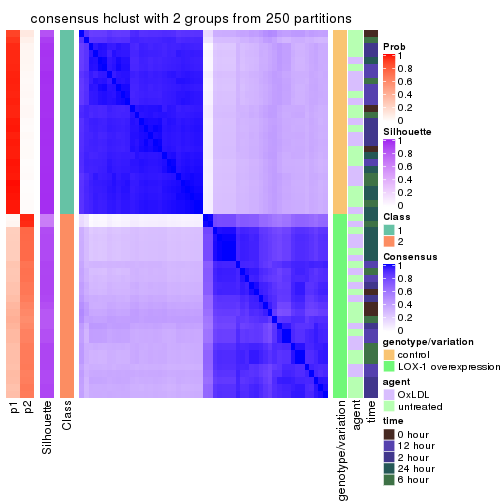</p>

</div>
<div id='tab-SD-hclust-consensus-heatmap-2'>
<pre><code class="r">consensus_heatmap(res, k = 3)
</code></pre>

<p>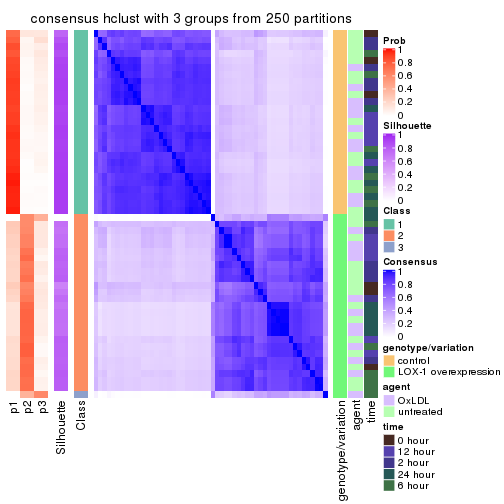</p>

</div>
<div id='tab-SD-hclust-consensus-heatmap-3'>
<pre><code class="r">consensus_heatmap(res, k = 4)
</code></pre>

<p>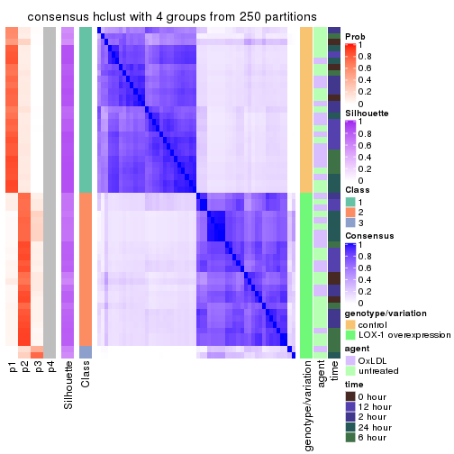</p>

</div>
<div id='tab-SD-hclust-consensus-heatmap-4'>
<pre><code class="r">consensus_heatmap(res, k = 5)
</code></pre>

<p>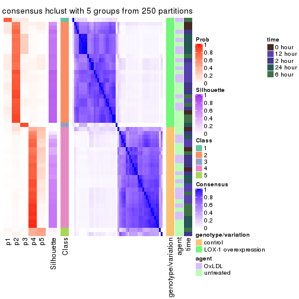</p>

</div>
<div id='tab-SD-hclust-consensus-heatmap-5'>
<pre><code class="r">consensus_heatmap(res, k = 6)
</code></pre>

<p>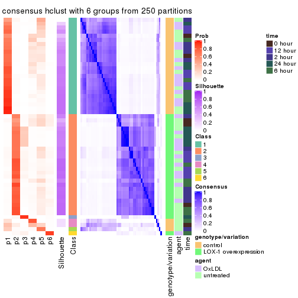</p>

</div>
</div>

Heatmaps for the membership of samples in all partitions to see how consistent they are:


<script>
$( function() {
	$( '#tabs-SD-hclust-membership-heatmap' ).tabs();
} );
</script>
<div id='tabs-SD-hclust-membership-heatmap'>
<ul>
<li><a href='#tab-SD-hclust-membership-heatmap-1'>k = 2</a></li>
<li><a href='#tab-SD-hclust-membership-heatmap-2'>k = 3</a></li>
<li><a href='#tab-SD-hclust-membership-heatmap-3'>k = 4</a></li>
<li><a href='#tab-SD-hclust-membership-heatmap-4'>k = 5</a></li>
<li><a href='#tab-SD-hclust-membership-heatmap-5'>k = 6</a></li>
</ul>
<div id='tab-SD-hclust-membership-heatmap-1'>
<pre><code class="r">membership_heatmap(res, k = 2)
</code></pre>

<p>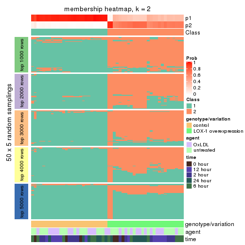</p>

</div>
<div id='tab-SD-hclust-membership-heatmap-2'>
<pre><code class="r">membership_heatmap(res, k = 3)
</code></pre>

<p>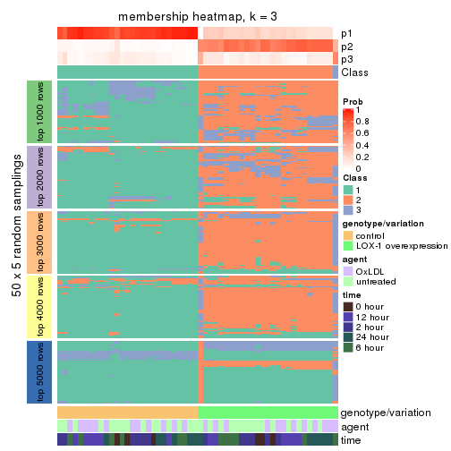</p>

</div>
<div id='tab-SD-hclust-membership-heatmap-3'>
<pre><code class="r">membership_heatmap(res, k = 4)
</code></pre>

<p>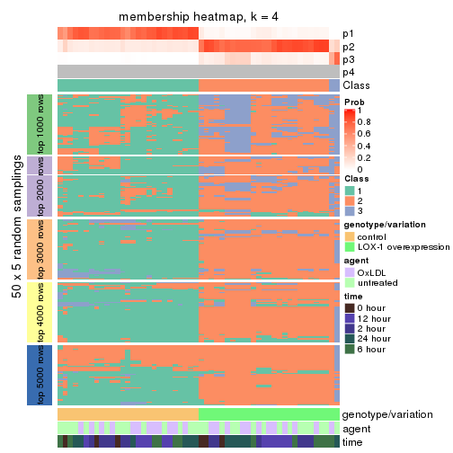</p>

</div>
<div id='tab-SD-hclust-membership-heatmap-4'>
<pre><code class="r">membership_heatmap(res, k = 5)
</code></pre>

<p>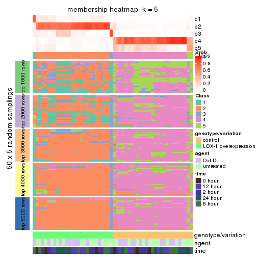</p>

</div>
<div id='tab-SD-hclust-membership-heatmap-5'>
<pre><code class="r">membership_heatmap(res, k = 6)
</code></pre>

<p>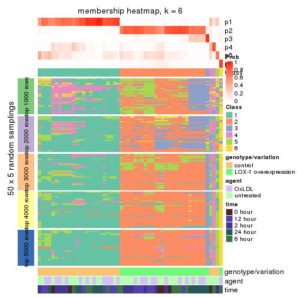</p>

</div>
</div>

As soon as we have had the classes for columns, we can look for signatures
which are significantly different between classes which can be candidate marks
for certain classes. Following are the heatmaps for signatures.


Signature heatmaps where rows are scaled:


<script>
$( function() {
	$( '#tabs-SD-hclust-get-signatures' ).tabs();
} );
</script>
<div id='tabs-SD-hclust-get-signatures'>
<ul>
<li><a href='#tab-SD-hclust-get-signatures-1'>k = 2</a></li>
<li><a href='#tab-SD-hclust-get-signatures-2'>k = 3</a></li>
<li><a href='#tab-SD-hclust-get-signatures-3'>k = 4</a></li>
<li><a href='#tab-SD-hclust-get-signatures-4'>k = 5</a></li>
<li><a href='#tab-SD-hclust-get-signatures-5'>k = 6</a></li>
</ul>
<div id='tab-SD-hclust-get-signatures-1'>
<pre><code class="r">get_signatures(res, k = 2)
</code></pre>

<p>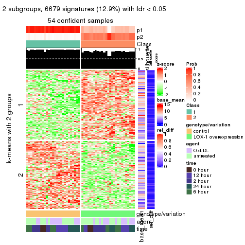</p>

</div>
<div id='tab-SD-hclust-get-signatures-2'>
<pre><code class="r">get_signatures(res, k = 3)
</code></pre>

<p>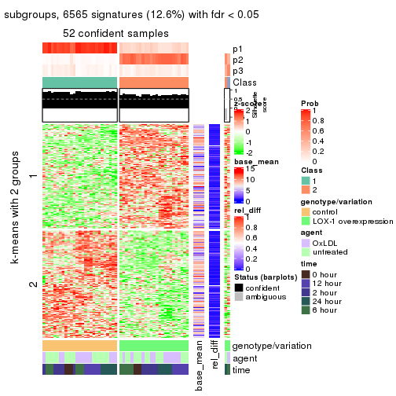</p>

</div>
<div id='tab-SD-hclust-get-signatures-3'>
<pre><code class="r">get_signatures(res, k = 4)
</code></pre>

<p>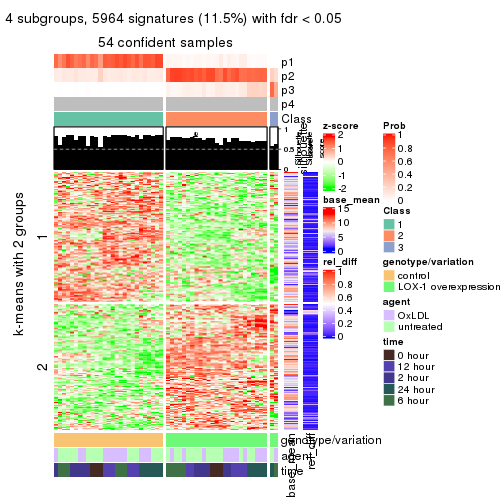</p>

</div>
<div id='tab-SD-hclust-get-signatures-4'>
<pre><code class="r">get_signatures(res, k = 5)
</code></pre>

<p>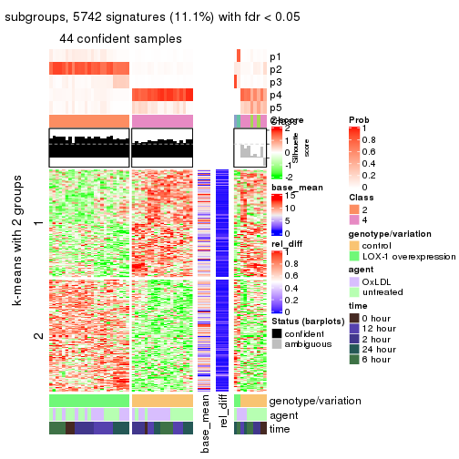</p>

</div>
<div id='tab-SD-hclust-get-signatures-5'>
<pre><code class="r">get_signatures(res, k = 6)
</code></pre>

<p>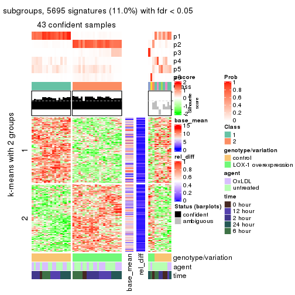</p>

</div>
</div>


Signature heatmaps where rows are not scaled:


<script>
$( function() {
	$( '#tabs-SD-hclust-get-signatures-no-scale' ).tabs();
} );
</script>
<div id='tabs-SD-hclust-get-signatures-no-scale'>
<ul>
<li><a href='#tab-SD-hclust-get-signatures-no-scale-1'>k = 2</a></li>
<li><a href='#tab-SD-hclust-get-signatures-no-scale-2'>k = 3</a></li>
<li><a href='#tab-SD-hclust-get-signatures-no-scale-3'>k = 4</a></li>
<li><a href='#tab-SD-hclust-get-signatures-no-scale-4'>k = 5</a></li>
<li><a href='#tab-SD-hclust-get-signatures-no-scale-5'>k = 6</a></li>
</ul>
<div id='tab-SD-hclust-get-signatures-no-scale-1'>
<pre><code class="r">get_signatures(res, k = 2, scale_rows = FALSE)
</code></pre>

<p>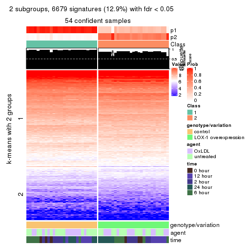</p>

</div>
<div id='tab-SD-hclust-get-signatures-no-scale-2'>
<pre><code class="r">get_signatures(res, k = 3, scale_rows = FALSE)
</code></pre>

<p>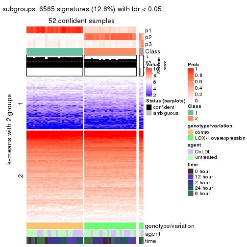</p>

</div>
<div id='tab-SD-hclust-get-signatures-no-scale-3'>
<pre><code class="r">get_signatures(res, k = 4, scale_rows = FALSE)
</code></pre>

<p>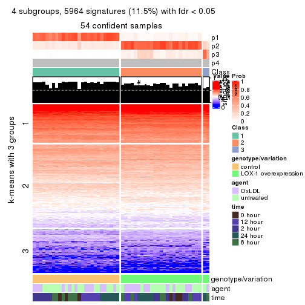</p>

</div>
<div id='tab-SD-hclust-get-signatures-no-scale-4'>
<pre><code class="r">get_signatures(res, k = 5, scale_rows = FALSE)
</code></pre>

<p>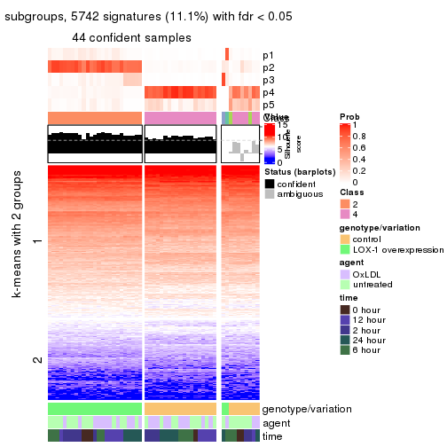</p>

</div>
<div id='tab-SD-hclust-get-signatures-no-scale-5'>
<pre><code class="r">get_signatures(res, k = 6, scale_rows = FALSE)
</code></pre>

<p>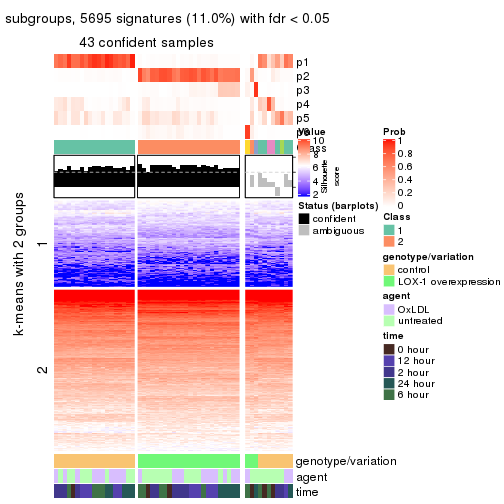</p>

</div>
</div>


Compare the overlap of signatures from different k:

```r
compare_signatures(res)
```

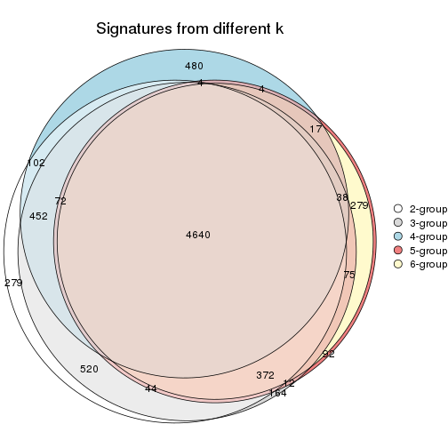

`get_signature()` returns a data frame invisibly. TO get the list of signatures, the function
call should be assigned to a variable explicitly. In following code, if `plot` argument is set
to `FALSE`, no heatmap is plotted while only the differential analysis is performed.

```r
# code only for demonstration
tb = get_signature(res, k = ..., plot = FALSE)
```

An example of the output of `tb` is:

```
#>   which_row         fdr    mean_1    mean_2 scaled_mean_1 scaled_mean_2 km
#> 1        38 0.042760348  8.373488  9.131774    -0.5533452     0.5164555  1
#> 2        40 0.018707592  7.106213  8.469186    -0.6173731     0.5762149  1
#> 3        55 0.019134737 10.221463 11.207825    -0.6159697     0.5749050  1
#> 4        59 0.006059896  5.921854  7.869574    -0.6899429     0.6439467  1
#> 5        60 0.018055526  8.928898 10.211722    -0.6204761     0.5791110  1
#> 6        98 0.009384629 15.714769 14.887706     0.6635654    -0.6193277  2
...
```

The columns in `tb` are:

1. `which_row`: row indices corresponding to the input matrix.
2. `fdr`: FDR for the differential test. 
3. `mean_x`: The mean value in group x.
4. `scaled_mean_x`: The mean value in group x after rows are scaled.
5. `km`: Row groups if k-means clustering is applied to rows.


UMAP plot which shows how samples are separated.


<script>
$( function() {
	$( '#tabs-SD-hclust-dimension-reduction' ).tabs();
} );
</script>
<div id='tabs-SD-hclust-dimension-reduction'>
<ul>
<li><a href='#tab-SD-hclust-dimension-reduction-1'>k = 2</a></li>
<li><a href='#tab-SD-hclust-dimension-reduction-2'>k = 3</a></li>
<li><a href='#tab-SD-hclust-dimension-reduction-3'>k = 4</a></li>
<li><a href='#tab-SD-hclust-dimension-reduction-4'>k = 5</a></li>
<li><a href='#tab-SD-hclust-dimension-reduction-5'>k = 6</a></li>
</ul>
<div id='tab-SD-hclust-dimension-reduction-1'>
<pre><code class="r">dimension_reduction(res, k = 2, method = &quot;UMAP&quot;)
</code></pre>

<p>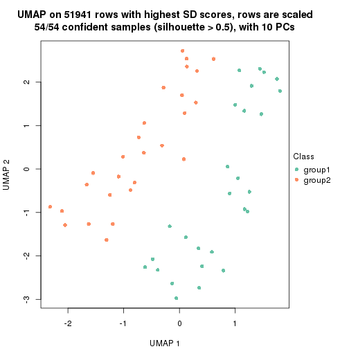</p>

</div>
<div id='tab-SD-hclust-dimension-reduction-2'>
<pre><code class="r">dimension_reduction(res, k = 3, method = &quot;UMAP&quot;)
</code></pre>

<p>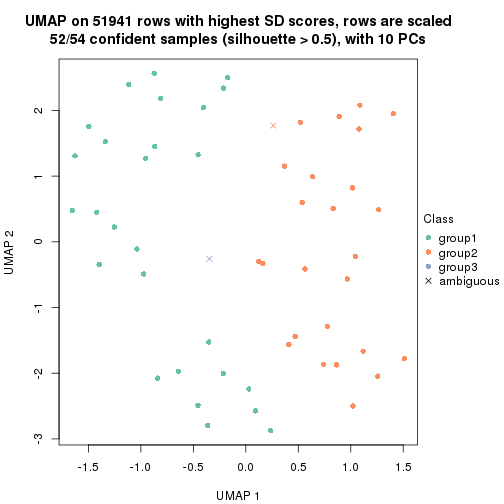</p>

</div>
<div id='tab-SD-hclust-dimension-reduction-3'>
<pre><code class="r">dimension_reduction(res, k = 4, method = &quot;UMAP&quot;)
</code></pre>

<p>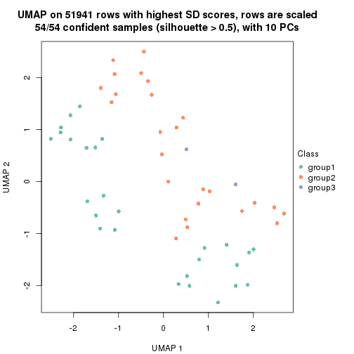</p>

</div>
<div id='tab-SD-hclust-dimension-reduction-4'>
<pre><code class="r">dimension_reduction(res, k = 5, method = &quot;UMAP&quot;)
</code></pre>

<p>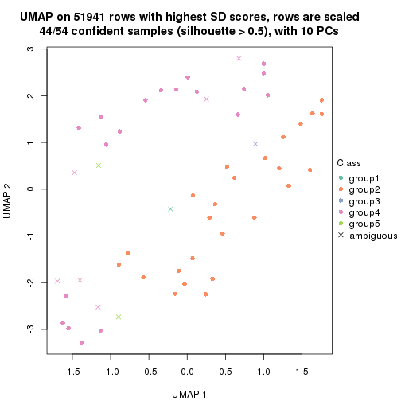</p>

</div>
<div id='tab-SD-hclust-dimension-reduction-5'>
<pre><code class="r">dimension_reduction(res, k = 6, method = &quot;UMAP&quot;)
</code></pre>

<p>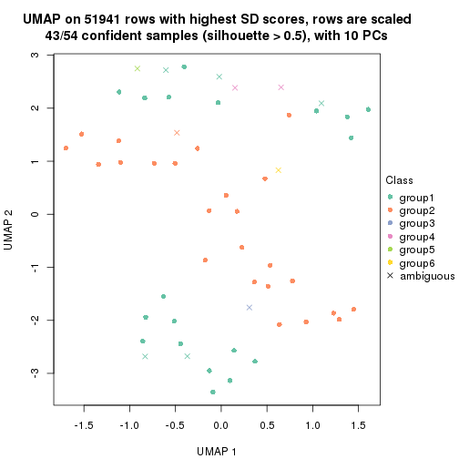</p>

</div>
</div>


Following heatmap shows how subgroups are split when increasing `k`:

```r
collect_classes(res)
```

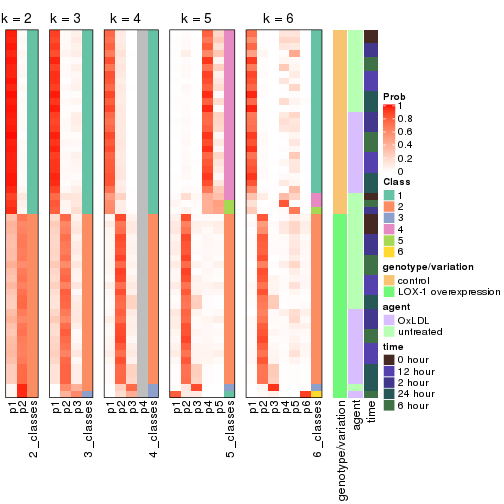


Test correlation between subgroups and known annotations. If the known
annotation is numeric, one-way ANOVA test is applied, and if the known
annotation is discrete, chi-squared contingency table test is applied.

```r
test_to_known_factors(res)
```

```
#>            n genotype/variation(p) agent(p) time(p) k
#> SD:hclust 54              1.48e-12    1.000   1.000 2
#> SD:hclust 52              4.11e-12    1.000   0.999 3
#> SD:hclust 54              1.88e-12    0.987   0.952 4
#> SD:hclust 44              2.52e-10    0.792   0.939 5
#> SD:hclust 43              4.15e-10    0.892   0.986 6
```


If matrix rows can be associated to genes, consider to use `functional_enrichment(res,
...)` to perform function enrichment for the signature genes. See [this vignette](http://bioconductor.org/packages/devel/bioc/vignettes/cola/inst/doc/functional_enrichment.html) for more detailed explanations.


 

---------------------------------------------------


### SD:kmeans**


The object with results only for a single top-value method and a single partition method 
can be extracted as:

```r
res = res_list["SD", "kmeans"]
# you can also extract it by
# res = res_list["SD:kmeans"]
```

A summary of `res` and all the functions that can be applied to it:

```r
res
```

```
#> A 'ConsensusPartition' object with k = 2, 3, 4, 5, 6.
#>   On a matrix with 51941 rows and 54 columns.
#>   Top rows (1000, 2000, 3000, 4000, 5000) are extracted by 'SD' method.
#>   Subgroups are detected by 'kmeans' method.
#>   Performed in total 1250 partitions by row resampling.
#>   Best k for subgroups seems to be 2.
#> 
#> Following methods can be applied to this 'ConsensusPartition' object:
#>  [1] "cola_report"             "collect_classes"         "collect_plots"          
#>  [4] "collect_stats"           "colnames"                "compare_signatures"     
#>  [7] "consensus_heatmap"       "dimension_reduction"     "functional_enrichment"  
#> [10] "get_anno_col"            "get_anno"                "get_classes"            
#> [13] "get_consensus"           "get_matrix"              "get_membership"         
#> [16] "get_param"               "get_signatures"          "get_stats"              
#> [19] "is_best_k"               "is_stable_k"             "membership_heatmap"     
#> [22] "ncol"                    "nrow"                    "plot_ecdf"              
#> [25] "rownames"                "select_partition_number" "show"                   
#> [28] "suggest_best_k"          "test_to_known_factors"
```

`collect_plots()` function collects all the plots made from `res` for all `k` (number of partitions)
into one single page to provide an easy and fast comparison between different `k`.

```r
collect_plots(res)
```

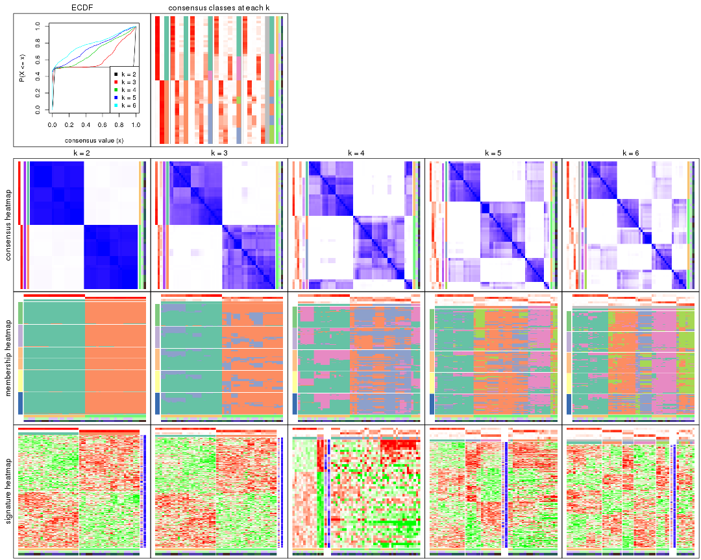

The plots are:

- The first row: a plot of the ECDF (empirical cumulative distribution
  function) curves of the consensus matrix for each `k` and the heatmap of
  predicted classes for each `k`.
- The second row: heatmaps of the consensus matrix for each `k`.
- The third row: heatmaps of the membership matrix for each `k`.
- The fouth row: heatmaps of the signatures for each `k`.

All the plots in panels can be made by individual functions and they are
plotted later in this section.

`select_partition_number()` produces several plots showing different
statistics for choosing "optimized" `k`. There are following statistics:

- ECDF curves of the consensus matrix for each `k`;
- 1-PAC. [The PAC
  score](https://en.wikipedia.org/wiki/Consensus_clustering#Over-interpretation_potential_of_consensus_clustering)
  measures the proportion of the ambiguous subgrouping.
- Mean silhouette score.
- Concordance. The mean probability of fiting the consensus class ids in all
  partitions.
- Area increased. Denote $A_k$ as the area under the ECDF curve for current
  `k`, the area increased is defined as $A_k - A_{k-1}$.
- Rand index. The percent of pairs of samples that are both in a same cluster
  or both are not in a same cluster in the partition of k and k-1.
- Jaccard index. The ratio of pairs of samples are both in a same cluster in
  the partition of k and k-1 and the pairs of samples are both in a same
  cluster in the partition k or k-1.

The detailed explanations of these statistics can be found in [the _cola_
vignette](http://bioconductor.org/packages/devel/bioc/vignettes/cola/inst/doc/cola.html#toc_13).

Generally speaking, lower PAC score, higher mean silhouette score or higher
concordance corresponds to better partition. Rand index and Jaccard index
measure how similar the current partition is compared to partition with `k-1`.
If they are too similar, we won't accept `k` is better than `k-1`.

```r
select_partition_number(res)
```

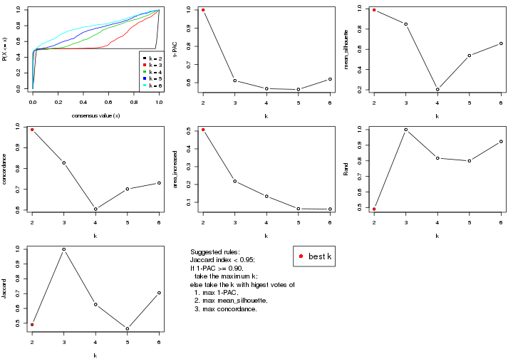

The numeric values for all these statistics can be obtained by `get_stats()`.

```r
get_stats(res)
```

```
#>   k 1-PAC mean_silhouette concordance area_increased  Rand Jaccard
#> 2 2 1.000           0.989       0.987         0.5080 0.491   0.491
#> 3 3 0.612           0.849       0.827         0.2183 1.000   1.000
#> 4 4 0.567           0.203       0.605         0.1336 0.817   0.627
#> 5 5 0.563           0.538       0.701         0.0639 0.799   0.463
#> 6 6 0.620           0.658       0.730         0.0619 0.924   0.705
```

`suggest_best_k()` suggests the best $k$ based on these statistics. The rules are as follows:

- All $k$ with Jaccard index larger than 0.95 are removed because increasing
  $k$ does not provide enough extra information. If all $k$ are removed, it is
  marked as no subgroup is detected.
- For all $k$ with 1-PAC score larger than 0.9, the maximal $k$ is taken as
  the best $k$, and other $k$ are marked as optional $k$.
- If it does not fit the second rule. The $k$ with the maximal vote of the
  highest 1-PAC score, highest mean silhouette, and highest concordance is
  taken as the best $k$.

```r
suggest_best_k(res)
```

```
#> [1] 2
```


Following shows the table of the partitions (You need to click the **show/hide
code output** link to see it). The membership matrix (columns with name `p*`)
is inferred by
[`clue::cl_consensus()`](https://www.rdocumentation.org/link/cl_consensus?package=clue)
function with the `SE` method. Basically the value in the membership matrix
represents the probability to belong to a certain group. The finall class
label for an item is determined with the group with highest probability it
belongs to.

In `get_classes()` function, the entropy is calculated from the membership
matrix and the silhouette score is calculated from the consensus matrix.


<script>
$( function() {
	$( '#tabs-SD-kmeans-get-classes' ).tabs();
} );
</script>
<div id='tabs-SD-kmeans-get-classes'>
<ul>
<li><a href='#tab-SD-kmeans-get-classes-1'>k = 2</a></li>
<li><a href='#tab-SD-kmeans-get-classes-2'>k = 3</a></li>
<li><a href='#tab-SD-kmeans-get-classes-3'>k = 4</a></li>
<li><a href='#tab-SD-kmeans-get-classes-4'>k = 5</a></li>
<li><a href='#tab-SD-kmeans-get-classes-5'>k = 6</a></li>
</ul>

<div id='tab-SD-kmeans-get-classes-1'>
<p><a id='tab-SD-kmeans-get-classes-1-a' style='color:#0366d6' href='#'>show/hide code output</a></p>
<pre><code class="r">cbind(get_classes(res, k = 2), get_membership(res, k = 2))
</code></pre>

<pre><code>#&gt;           class entropy silhouette    p1    p2
#&gt; GSM329068     2  0.0938      0.990 0.012 0.988
#&gt; GSM329074     2  0.0938      0.990 0.012 0.988
#&gt; GSM329100     2  0.0938      0.990 0.012 0.988
#&gt; GSM329062     2  0.0376      0.989 0.004 0.996
#&gt; GSM329079     2  0.0376      0.989 0.004 0.996
#&gt; GSM329090     2  0.0376      0.989 0.004 0.996
#&gt; GSM329066     2  0.0938      0.990 0.012 0.988
#&gt; GSM329086     2  0.0938      0.990 0.012 0.988
#&gt; GSM329099     2  0.0938      0.990 0.012 0.988
#&gt; GSM329071     2  0.1633      0.989 0.024 0.976
#&gt; GSM329078     2  0.1414      0.988 0.020 0.980
#&gt; GSM329081     2  0.1414      0.988 0.020 0.980
#&gt; GSM329096     2  0.1843      0.989 0.028 0.972
#&gt; GSM329102     2  0.1633      0.988 0.024 0.976
#&gt; GSM329104     2  0.1633      0.988 0.024 0.976
#&gt; GSM329067     2  0.0938      0.990 0.012 0.988
#&gt; GSM329072     2  0.0376      0.989 0.004 0.996
#&gt; GSM329075     2  0.0938      0.990 0.012 0.988
#&gt; GSM329058     2  0.1184      0.990 0.016 0.984
#&gt; GSM329073     2  0.0672      0.988 0.008 0.992
#&gt; GSM329107     2  0.1184      0.989 0.016 0.984
#&gt; GSM329057     2  0.1414      0.988 0.020 0.980
#&gt; GSM329085     2  0.1414      0.988 0.020 0.980
#&gt; GSM329089     2  0.1414      0.988 0.020 0.980
#&gt; GSM329076     2  0.1843      0.989 0.028 0.972
#&gt; GSM329094     2  0.1843      0.989 0.028 0.972
#&gt; GSM329105     2  0.1414      0.988 0.020 0.980
#&gt; GSM329056     1  0.1184      0.989 0.984 0.016
#&gt; GSM329069     1  0.1184      0.989 0.984 0.016
#&gt; GSM329077     1  0.1184      0.989 0.984 0.016
#&gt; GSM329070     1  0.1184      0.989 0.984 0.016
#&gt; GSM329082     1  0.1633      0.988 0.976 0.024
#&gt; GSM329092     1  0.1633      0.988 0.976 0.024
#&gt; GSM329083     1  0.1184      0.989 0.984 0.016
#&gt; GSM329101     1  0.0376      0.991 0.996 0.004
#&gt; GSM329106     1  0.1184      0.989 0.984 0.016
#&gt; GSM329087     1  0.0000      0.991 1.000 0.000
#&gt; GSM329091     1  0.0000      0.991 1.000 0.000
#&gt; GSM329093     1  0.0672      0.989 0.992 0.008
#&gt; GSM329080     1  0.0000      0.991 1.000 0.000
#&gt; GSM329084     1  0.0000      0.991 1.000 0.000
#&gt; GSM329088     1  0.0000      0.991 1.000 0.000
#&gt; GSM329059     1  0.1184      0.989 0.984 0.016
#&gt; GSM329097     1  0.1184      0.989 0.984 0.016
#&gt; GSM329098     1  0.1184      0.989 0.984 0.016
#&gt; GSM329055     1  0.0376      0.991 0.996 0.004
#&gt; GSM329103     1  0.0672      0.989 0.992 0.008
#&gt; GSM329108     1  0.0376      0.991 0.996 0.004
#&gt; GSM329061     1  0.0672      0.989 0.992 0.008
#&gt; GSM329064     1  0.0376      0.990 0.996 0.004
#&gt; GSM329065     1  0.0672      0.989 0.992 0.008
#&gt; GSM329060     1  0.0000      0.991 1.000 0.000
#&gt; GSM329063     1  0.0000      0.991 1.000 0.000
#&gt; GSM329095     1  0.0672      0.989 0.992 0.008
</code></pre>

<script>
$('#tab-SD-kmeans-get-classes-1-a').parent().next().next().hide();
$('#tab-SD-kmeans-get-classes-1-a').click(function(){
  $('#tab-SD-kmeans-get-classes-1-a').parent().next().next().toggle();
  return(false);
});
</script>
</div>

<div id='tab-SD-kmeans-get-classes-2'>
<p><a id='tab-SD-kmeans-get-classes-2-a' style='color:#0366d6' href='#'>show/hide code output</a></p>
<pre><code class="r">cbind(get_classes(res, k = 3), get_membership(res, k = 3))
</code></pre>

<pre><code>#&gt;           class entropy silhouette    p1    p2    p3
#&gt; GSM329068     2  0.1989      0.868 0.004 0.948 0.048
#&gt; GSM329074     2  0.3500      0.862 0.004 0.880 0.116
#&gt; GSM329100     2  0.3272      0.863 0.004 0.892 0.104
#&gt; GSM329062     2  0.2496      0.860 0.004 0.928 0.068
#&gt; GSM329079     2  0.2400      0.860 0.004 0.932 0.064
#&gt; GSM329090     2  0.3349      0.855 0.004 0.888 0.108
#&gt; GSM329066     2  0.0983      0.868 0.004 0.980 0.016
#&gt; GSM329086     2  0.2590      0.865 0.004 0.924 0.072
#&gt; GSM329099     2  0.1129      0.869 0.004 0.976 0.020
#&gt; GSM329071     2  0.4842      0.856 0.000 0.776 0.224
#&gt; GSM329078     2  0.5982      0.784 0.004 0.668 0.328
#&gt; GSM329081     2  0.2301      0.874 0.004 0.936 0.060
#&gt; GSM329096     2  0.5760      0.819 0.000 0.672 0.328
#&gt; GSM329102     2  0.6180      0.779 0.000 0.584 0.416
#&gt; GSM329104     2  0.6308      0.740 0.000 0.508 0.492
#&gt; GSM329067     2  0.2200      0.865 0.004 0.940 0.056
#&gt; GSM329072     2  0.4784      0.810 0.004 0.796 0.200
#&gt; GSM329075     2  0.3272      0.863 0.004 0.892 0.104
#&gt; GSM329058     2  0.4293      0.861 0.004 0.832 0.164
#&gt; GSM329073     2  0.6057      0.785 0.004 0.656 0.340
#&gt; GSM329107     2  0.3644      0.858 0.004 0.872 0.124
#&gt; GSM329057     2  0.5397      0.849 0.000 0.720 0.280
#&gt; GSM329085     2  0.5982      0.784 0.004 0.668 0.328
#&gt; GSM329089     2  0.4629      0.859 0.004 0.808 0.188
#&gt; GSM329076     2  0.5760      0.819 0.000 0.672 0.328
#&gt; GSM329094     2  0.5760      0.819 0.000 0.672 0.328
#&gt; GSM329105     2  0.5810      0.819 0.000 0.664 0.336
#&gt; GSM329056     1  0.5244      0.851 0.756 0.004 0.240
#&gt; GSM329069     1  0.5404      0.846 0.740 0.004 0.256
#&gt; GSM329077     1  0.5365      0.846 0.744 0.004 0.252
#&gt; GSM329070     1  0.5201      0.853 0.760 0.004 0.236
#&gt; GSM329082     1  0.5553      0.843 0.724 0.004 0.272
#&gt; GSM329092     1  0.6189      0.814 0.632 0.004 0.364
#&gt; GSM329083     1  0.5553      0.837 0.724 0.004 0.272
#&gt; GSM329101     1  0.1647      0.887 0.960 0.004 0.036
#&gt; GSM329106     1  0.5201      0.852 0.760 0.004 0.236
#&gt; GSM329087     1  0.1753      0.879 0.952 0.000 0.048
#&gt; GSM329091     1  0.1878      0.886 0.952 0.004 0.044
#&gt; GSM329093     1  0.4293      0.836 0.832 0.004 0.164
#&gt; GSM329080     1  0.0237      0.886 0.996 0.000 0.004
#&gt; GSM329084     1  0.1031      0.887 0.976 0.000 0.024
#&gt; GSM329088     1  0.0424      0.886 0.992 0.000 0.008
#&gt; GSM329059     1  0.5285      0.855 0.752 0.004 0.244
#&gt; GSM329097     1  0.5158      0.854 0.764 0.004 0.232
#&gt; GSM329098     1  0.5325      0.849 0.748 0.004 0.248
#&gt; GSM329055     1  0.0475      0.886 0.992 0.004 0.004
#&gt; GSM329103     1  0.2945      0.867 0.908 0.004 0.088
#&gt; GSM329108     1  0.0424      0.887 0.992 0.000 0.008
#&gt; GSM329061     1  0.4233      0.838 0.836 0.004 0.160
#&gt; GSM329064     1  0.2066      0.876 0.940 0.000 0.060
#&gt; GSM329065     1  0.4110      0.839 0.844 0.004 0.152
#&gt; GSM329060     1  0.0592      0.885 0.988 0.000 0.012
#&gt; GSM329063     1  0.1267      0.887 0.972 0.004 0.024
#&gt; GSM329095     1  0.4409      0.831 0.824 0.004 0.172
</code></pre>

<script>
$('#tab-SD-kmeans-get-classes-2-a').parent().next().next().hide();
$('#tab-SD-kmeans-get-classes-2-a').click(function(){
  $('#tab-SD-kmeans-get-classes-2-a').parent().next().next().toggle();
  return(false);
});
</script>
</div>

<div id='tab-SD-kmeans-get-classes-3'>
<p><a id='tab-SD-kmeans-get-classes-3-a' style='color:#0366d6' href='#'>show/hide code output</a></p>
<pre><code class="r">cbind(get_classes(res, k = 4), get_membership(res, k = 4))
</code></pre>

<pre><code>#&gt;           class entropy silhouette    p1    p2    p3    p4
#&gt; GSM329068     2  0.5126   0.371322 0.000 0.552 0.444 0.004
#&gt; GSM329074     2  0.4866   0.406356 0.000 0.596 0.404 0.000
#&gt; GSM329100     2  0.5408   0.402816 0.000 0.576 0.408 0.016
#&gt; GSM329062     3  0.4699   0.098156 0.000 0.320 0.676 0.004
#&gt; GSM329079     3  0.4819   0.045269 0.000 0.344 0.652 0.004
#&gt; GSM329090     3  0.4364   0.242816 0.000 0.220 0.764 0.016
#&gt; GSM329066     3  0.5155  -0.279802 0.000 0.468 0.528 0.004
#&gt; GSM329086     2  0.5500   0.329721 0.000 0.520 0.464 0.016
#&gt; GSM329099     3  0.4996  -0.314698 0.000 0.484 0.516 0.000
#&gt; GSM329071     3  0.4818   0.204693 0.000 0.216 0.748 0.036
#&gt; GSM329078     3  0.3813   0.302416 0.000 0.024 0.828 0.148
#&gt; GSM329081     3  0.4907  -0.198958 0.000 0.420 0.580 0.000
#&gt; GSM329096     3  0.6603   0.155737 0.000 0.316 0.580 0.104
#&gt; GSM329102     2  0.7082  -0.094980 0.000 0.448 0.428 0.124
#&gt; GSM329104     2  0.7325   0.000244 0.000 0.528 0.264 0.208
#&gt; GSM329067     2  0.5277   0.336406 0.000 0.532 0.460 0.008
#&gt; GSM329072     3  0.5533   0.249880 0.000 0.220 0.708 0.072
#&gt; GSM329075     2  0.4916   0.395067 0.000 0.576 0.424 0.000
#&gt; GSM329058     2  0.5768   0.178878 0.000 0.516 0.456 0.028
#&gt; GSM329073     2  0.5985   0.168686 0.000 0.692 0.168 0.140
#&gt; GSM329107     3  0.3610   0.260943 0.000 0.200 0.800 0.000
#&gt; GSM329057     3  0.2861   0.321076 0.000 0.096 0.888 0.016
#&gt; GSM329085     3  0.3813   0.302416 0.000 0.024 0.828 0.148
#&gt; GSM329089     3  0.1792   0.338400 0.000 0.068 0.932 0.000
#&gt; GSM329076     3  0.6603   0.155737 0.000 0.316 0.580 0.104
#&gt; GSM329094     3  0.6603   0.155737 0.000 0.316 0.580 0.104
#&gt; GSM329105     3  0.6483   0.165063 0.000 0.312 0.592 0.096
#&gt; GSM329056     1  0.4992  -0.701654 0.524 0.000 0.000 0.476
#&gt; GSM329069     4  0.5168   0.681173 0.492 0.004 0.000 0.504
#&gt; GSM329077     4  0.6003   0.702545 0.456 0.040 0.000 0.504
#&gt; GSM329070     1  0.5155  -0.683210 0.528 0.004 0.000 0.468
#&gt; GSM329082     1  0.5861  -0.018159 0.488 0.032 0.000 0.480
#&gt; GSM329092     4  0.5423   0.275083 0.332 0.028 0.000 0.640
#&gt; GSM329083     4  0.5693   0.707874 0.472 0.024 0.000 0.504
#&gt; GSM329101     1  0.1854   0.503893 0.940 0.012 0.000 0.048
#&gt; GSM329106     1  0.5478  -0.669854 0.540 0.016 0.000 0.444
#&gt; GSM329087     1  0.2469   0.532569 0.892 0.000 0.000 0.108
#&gt; GSM329091     1  0.3037   0.436063 0.880 0.020 0.000 0.100
#&gt; GSM329093     1  0.4900   0.456300 0.732 0.032 0.000 0.236
#&gt; GSM329080     1  0.0895   0.532188 0.976 0.004 0.000 0.020
#&gt; GSM329084     1  0.1624   0.523875 0.952 0.020 0.000 0.028
#&gt; GSM329088     1  0.0895   0.532188 0.976 0.004 0.000 0.020
#&gt; GSM329059     1  0.5155  -0.674582 0.528 0.004 0.000 0.468
#&gt; GSM329097     1  0.5158  -0.691872 0.524 0.004 0.000 0.472
#&gt; GSM329098     1  0.5161  -0.706473 0.520 0.004 0.000 0.476
#&gt; GSM329055     1  0.0707   0.537970 0.980 0.000 0.000 0.020
#&gt; GSM329103     1  0.3808   0.504302 0.812 0.012 0.000 0.176
#&gt; GSM329108     1  0.1109   0.541743 0.968 0.004 0.000 0.028
#&gt; GSM329061     1  0.4867   0.459814 0.736 0.032 0.000 0.232
#&gt; GSM329064     1  0.3377   0.521400 0.848 0.012 0.000 0.140
#&gt; GSM329065     1  0.4644   0.464466 0.748 0.024 0.000 0.228
#&gt; GSM329060     1  0.0804   0.543106 0.980 0.012 0.000 0.008
#&gt; GSM329063     1  0.1624   0.539362 0.952 0.020 0.000 0.028
#&gt; GSM329095     1  0.5113   0.438274 0.712 0.036 0.000 0.252
</code></pre>

<script>
$('#tab-SD-kmeans-get-classes-3-a').parent().next().next().hide();
$('#tab-SD-kmeans-get-classes-3-a').click(function(){
  $('#tab-SD-kmeans-get-classes-3-a').parent().next().next().toggle();
  return(false);
});
</script>
</div>

<div id='tab-SD-kmeans-get-classes-4'>
<p><a id='tab-SD-kmeans-get-classes-4-a' style='color:#0366d6' href='#'>show/hide code output</a></p>
<pre><code class="r">cbind(get_classes(res, k = 5), get_membership(res, k = 5))
</code></pre>

<pre><code>#&gt;           class entropy silhouette    p1    p2    p3    p4    p5
#&gt; GSM329068     2   0.156     0.4888 0.000 0.940 0.052 0.008 0.000
#&gt; GSM329074     2   0.158     0.4820 0.000 0.944 0.000 0.024 0.032
#&gt; GSM329100     2   0.207     0.4677 0.000 0.920 0.000 0.044 0.036
#&gt; GSM329062     2   0.418    -0.1167 0.000 0.644 0.352 0.000 0.004
#&gt; GSM329079     2   0.393     0.0112 0.000 0.672 0.328 0.000 0.000
#&gt; GSM329090     3   0.429     0.5307 0.000 0.468 0.532 0.000 0.000
#&gt; GSM329066     2   0.281     0.4154 0.000 0.832 0.168 0.000 0.000
#&gt; GSM329086     2   0.334     0.4308 0.000 0.860 0.084 0.028 0.028
#&gt; GSM329099     2   0.265     0.4319 0.000 0.848 0.152 0.000 0.000
#&gt; GSM329071     2   0.614    -0.1591 0.000 0.448 0.436 0.004 0.112
#&gt; GSM329078     3   0.349     0.6392 0.016 0.188 0.796 0.000 0.000
#&gt; GSM329081     2   0.355     0.3368 0.000 0.760 0.236 0.000 0.004
#&gt; GSM329096     2   0.676     0.0761 0.000 0.400 0.320 0.000 0.280
#&gt; GSM329102     5   0.660     0.1751 0.000 0.292 0.248 0.000 0.460
#&gt; GSM329104     5   0.500     0.5177 0.000 0.140 0.080 0.032 0.748
#&gt; GSM329067     2   0.217     0.4734 0.000 0.924 0.016 0.032 0.028
#&gt; GSM329072     3   0.420     0.5727 0.000 0.408 0.592 0.000 0.000
#&gt; GSM329075     2   0.130     0.4923 0.000 0.960 0.008 0.012 0.020
#&gt; GSM329058     2   0.466     0.4117 0.000 0.740 0.148 0.000 0.112
#&gt; GSM329073     5   0.622     0.3216 0.000 0.400 0.036 0.060 0.504
#&gt; GSM329107     3   0.430     0.5009 0.000 0.480 0.520 0.000 0.000
#&gt; GSM329057     3   0.518     0.5743 0.000 0.292 0.648 0.008 0.052
#&gt; GSM329085     3   0.349     0.6392 0.016 0.188 0.796 0.000 0.000
#&gt; GSM329089     3   0.430     0.5738 0.000 0.352 0.640 0.000 0.008
#&gt; GSM329076     2   0.676     0.0761 0.000 0.400 0.320 0.000 0.280
#&gt; GSM329094     2   0.676     0.0761 0.000 0.400 0.320 0.000 0.280
#&gt; GSM329105     2   0.676     0.0761 0.000 0.400 0.320 0.000 0.280
#&gt; GSM329056     4   0.380     0.8362 0.232 0.000 0.008 0.756 0.004
#&gt; GSM329069     4   0.363     0.8403 0.176 0.000 0.004 0.800 0.020
#&gt; GSM329077     4   0.526     0.7651 0.116 0.024 0.044 0.760 0.056
#&gt; GSM329070     4   0.411     0.8459 0.204 0.000 0.016 0.764 0.016
#&gt; GSM329082     1   0.702    -0.1190 0.500 0.000 0.116 0.324 0.060
#&gt; GSM329092     4   0.704     0.4897 0.312 0.000 0.116 0.508 0.064
#&gt; GSM329083     4   0.564     0.7568 0.128 0.004 0.072 0.720 0.076
#&gt; GSM329101     1   0.439     0.7048 0.764 0.000 0.024 0.184 0.028
#&gt; GSM329106     4   0.577     0.7662 0.232 0.000 0.052 0.660 0.056
#&gt; GSM329087     1   0.139     0.7807 0.956 0.000 0.008 0.024 0.012
#&gt; GSM329091     1   0.561     0.6000 0.672 0.000 0.044 0.228 0.056
#&gt; GSM329093     1   0.300     0.7320 0.872 0.000 0.088 0.008 0.032
#&gt; GSM329080     1   0.322     0.7714 0.848 0.000 0.012 0.124 0.016
#&gt; GSM329084     1   0.511     0.7204 0.744 0.000 0.052 0.144 0.060
#&gt; GSM329088     1   0.322     0.7714 0.848 0.000 0.012 0.124 0.016
#&gt; GSM329059     4   0.451     0.8271 0.232 0.000 0.016 0.728 0.024
#&gt; GSM329097     4   0.427     0.8407 0.224 0.000 0.016 0.744 0.016
#&gt; GSM329098     4   0.397     0.8418 0.224 0.000 0.008 0.756 0.012
#&gt; GSM329055     1   0.316     0.7684 0.848 0.000 0.012 0.128 0.012
#&gt; GSM329103     1   0.191     0.7639 0.932 0.000 0.032 0.004 0.032
#&gt; GSM329108     1   0.327     0.7700 0.844 0.000 0.012 0.128 0.016
#&gt; GSM329061     1   0.316     0.7234 0.864 0.000 0.092 0.012 0.032
#&gt; GSM329064     1   0.214     0.7759 0.924 0.000 0.040 0.012 0.024
#&gt; GSM329065     1   0.255     0.7418 0.896 0.000 0.076 0.008 0.020
#&gt; GSM329060     1   0.393     0.7718 0.820 0.000 0.036 0.116 0.028
#&gt; GSM329063     1   0.422     0.7604 0.808 0.000 0.044 0.108 0.040
#&gt; GSM329095     1   0.407     0.6900 0.808 0.000 0.124 0.020 0.048
</code></pre>

<script>
$('#tab-SD-kmeans-get-classes-4-a').parent().next().next().hide();
$('#tab-SD-kmeans-get-classes-4-a').click(function(){
  $('#tab-SD-kmeans-get-classes-4-a').parent().next().next().toggle();
  return(false);
});
</script>
</div>

<div id='tab-SD-kmeans-get-classes-5'>
<p><a id='tab-SD-kmeans-get-classes-5-a' style='color:#0366d6' href='#'>show/hide code output</a></p>
<pre><code class="r">cbind(get_classes(res, k = 6), get_membership(res, k = 6))
</code></pre>

<pre><code>#&gt;           class entropy silhouette    p1    p2    p3    p4    p5 p6
#&gt; GSM329068     2   0.141     0.7448 0.000 0.944 0.008 0.000 0.044 NA
#&gt; GSM329074     2   0.182     0.7216 0.000 0.928 0.016 0.004 0.004 NA
#&gt; GSM329100     2   0.169     0.7182 0.000 0.932 0.008 0.004 0.004 NA
#&gt; GSM329062     2   0.398     0.2489 0.000 0.596 0.000 0.000 0.396 NA
#&gt; GSM329079     2   0.377     0.3959 0.000 0.640 0.000 0.000 0.356 NA
#&gt; GSM329090     5   0.358     0.5589 0.000 0.308 0.000 0.000 0.688 NA
#&gt; GSM329066     2   0.321     0.7006 0.000 0.816 0.012 0.000 0.156 NA
#&gt; GSM329086     2   0.353     0.7111 0.000 0.832 0.024 0.004 0.088 NA
#&gt; GSM329099     2   0.326     0.7033 0.000 0.816 0.012 0.000 0.152 NA
#&gt; GSM329071     5   0.621    -0.1568 0.000 0.296 0.236 0.000 0.456 NA
#&gt; GSM329078     5   0.221     0.6776 0.016 0.076 0.000 0.000 0.900 NA
#&gt; GSM329081     2   0.424     0.5417 0.000 0.688 0.032 0.000 0.272 NA
#&gt; GSM329096     3   0.570     0.6847 0.000 0.224 0.524 0.000 0.252 NA
#&gt; GSM329102     3   0.541     0.6604 0.000 0.196 0.600 0.000 0.200 NA
#&gt; GSM329104     3   0.392     0.4015 0.000 0.052 0.804 0.004 0.032 NA
#&gt; GSM329067     2   0.214     0.7278 0.000 0.912 0.004 0.004 0.032 NA
#&gt; GSM329072     5   0.359     0.5829 0.000 0.268 0.000 0.000 0.720 NA
#&gt; GSM329075     2   0.112     0.7386 0.000 0.960 0.004 0.000 0.008 NA
#&gt; GSM329058     2   0.525     0.4573 0.000 0.668 0.140 0.000 0.164 NA
#&gt; GSM329073     3   0.687     0.0265 0.000 0.320 0.356 0.004 0.036 NA
#&gt; GSM329107     5   0.373     0.4963 0.000 0.344 0.000 0.000 0.652 NA
#&gt; GSM329057     5   0.374     0.6093 0.000 0.100 0.072 0.000 0.808 NA
#&gt; GSM329085     5   0.221     0.6776 0.016 0.076 0.000 0.000 0.900 NA
#&gt; GSM329089     5   0.339     0.6453 0.000 0.188 0.016 0.000 0.788 NA
#&gt; GSM329076     3   0.570     0.6847 0.000 0.224 0.524 0.000 0.252 NA
#&gt; GSM329094     3   0.570     0.6847 0.000 0.224 0.524 0.000 0.252 NA
#&gt; GSM329105     3   0.569     0.6774 0.000 0.216 0.524 0.000 0.260 NA
#&gt; GSM329056     4   0.229     0.7918 0.072 0.000 0.000 0.892 0.000 NA
#&gt; GSM329069     4   0.264     0.7926 0.036 0.000 0.008 0.884 0.004 NA
#&gt; GSM329077     4   0.469     0.7261 0.028 0.020 0.012 0.704 0.004 NA
#&gt; GSM329070     4   0.243     0.8000 0.072 0.000 0.000 0.884 0.000 NA
#&gt; GSM329082     4   0.661     0.3057 0.312 0.000 0.000 0.344 0.024 NA
#&gt; GSM329092     4   0.632     0.5369 0.160 0.000 0.012 0.476 0.016 NA
#&gt; GSM329083     4   0.483     0.6779 0.028 0.000 0.024 0.652 0.008 NA
#&gt; GSM329101     1   0.413     0.7553 0.748 0.000 0.000 0.180 0.008 NA
#&gt; GSM329106     4   0.461     0.7068 0.112 0.000 0.008 0.712 0.000 NA
#&gt; GSM329087     1   0.134     0.8204 0.948 0.000 0.000 0.024 0.000 NA
#&gt; GSM329091     1   0.522     0.6526 0.652 0.000 0.012 0.216 0.004 NA
#&gt; GSM329093     1   0.305     0.7600 0.844 0.000 0.008 0.000 0.036 NA
#&gt; GSM329080     1   0.320     0.8166 0.836 0.000 0.012 0.124 0.004 NA
#&gt; GSM329084     1   0.480     0.7661 0.732 0.000 0.024 0.120 0.008 NA
#&gt; GSM329088     1   0.306     0.8171 0.840 0.000 0.012 0.124 0.000 NA
#&gt; GSM329059     4   0.312     0.7885 0.072 0.000 0.000 0.836 0.000 NA
#&gt; GSM329097     4   0.293     0.7976 0.076 0.000 0.008 0.860 0.000 NA
#&gt; GSM329098     4   0.262     0.7970 0.076 0.000 0.000 0.872 0.000 NA
#&gt; GSM329055     1   0.267     0.8171 0.852 0.000 0.000 0.128 0.000 NA
#&gt; GSM329103     1   0.274     0.7925 0.876 0.000 0.004 0.016 0.020 NA
#&gt; GSM329108     1   0.307     0.8119 0.836 0.000 0.000 0.124 0.004 NA
#&gt; GSM329061     1   0.311     0.7547 0.836 0.000 0.008 0.000 0.032 NA
#&gt; GSM329064     1   0.196     0.8114 0.920 0.000 0.012 0.004 0.008 NA
#&gt; GSM329065     1   0.227     0.7885 0.896 0.000 0.004 0.000 0.024 NA
#&gt; GSM329060     1   0.294     0.8231 0.856 0.000 0.012 0.100 0.000 NA
#&gt; GSM329063     1   0.391     0.8021 0.800 0.000 0.016 0.096 0.004 NA
#&gt; GSM329095     1   0.412     0.6954 0.752 0.000 0.012 0.000 0.056 NA
</code></pre>

<script>
$('#tab-SD-kmeans-get-classes-5-a').parent().next().next().hide();
$('#tab-SD-kmeans-get-classes-5-a').click(function(){
  $('#tab-SD-kmeans-get-classes-5-a').parent().next().next().toggle();
  return(false);
});
</script>
</div>
</div>

Heatmaps for the consensus matrix. It visualizes the probability of two
samples to be in a same group.


<script>
$( function() {
	$( '#tabs-SD-kmeans-consensus-heatmap' ).tabs();
} );
</script>
<div id='tabs-SD-kmeans-consensus-heatmap'>
<ul>
<li><a href='#tab-SD-kmeans-consensus-heatmap-1'>k = 2</a></li>
<li><a href='#tab-SD-kmeans-consensus-heatmap-2'>k = 3</a></li>
<li><a href='#tab-SD-kmeans-consensus-heatmap-3'>k = 4</a></li>
<li><a href='#tab-SD-kmeans-consensus-heatmap-4'>k = 5</a></li>
<li><a href='#tab-SD-kmeans-consensus-heatmap-5'>k = 6</a></li>
</ul>
<div id='tab-SD-kmeans-consensus-heatmap-1'>
<pre><code class="r">consensus_heatmap(res, k = 2)
</code></pre>

<p>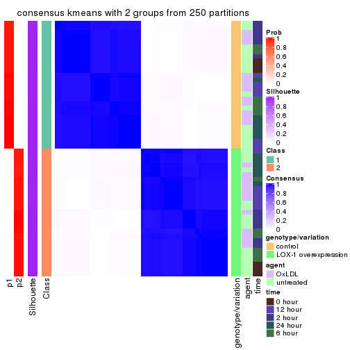</p>

</div>
<div id='tab-SD-kmeans-consensus-heatmap-2'>
<pre><code class="r">consensus_heatmap(res, k = 3)
</code></pre>

<p>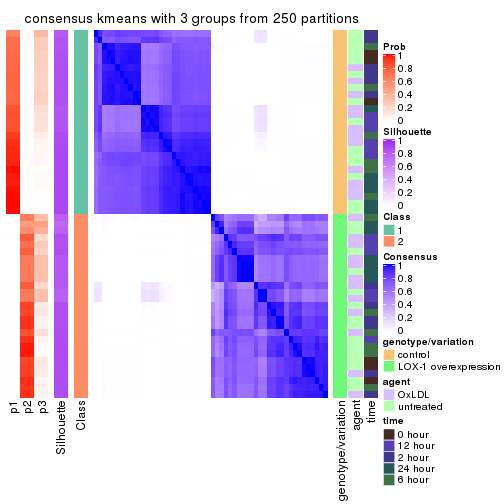</p>

</div>
<div id='tab-SD-kmeans-consensus-heatmap-3'>
<pre><code class="r">consensus_heatmap(res, k = 4)
</code></pre>

<p>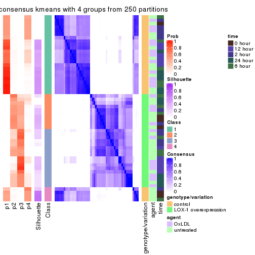</p>

</div>
<div id='tab-SD-kmeans-consensus-heatmap-4'>
<pre><code class="r">consensus_heatmap(res, k = 5)
</code></pre>

<p>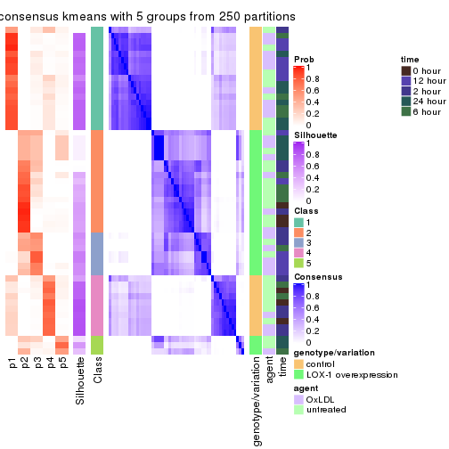</p>

</div>
<div id='tab-SD-kmeans-consensus-heatmap-5'>
<pre><code class="r">consensus_heatmap(res, k = 6)
</code></pre>

<p>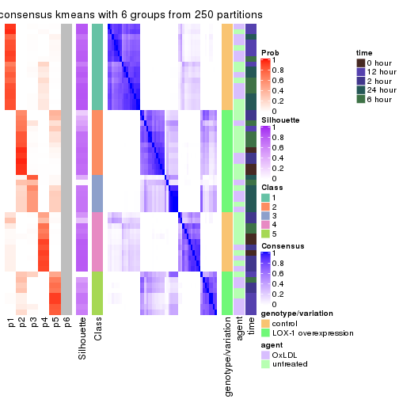</p>

</div>
</div>

Heatmaps for the membership of samples in all partitions to see how consistent they are:


<script>
$( function() {
	$( '#tabs-SD-kmeans-membership-heatmap' ).tabs();
} );
</script>
<div id='tabs-SD-kmeans-membership-heatmap'>
<ul>
<li><a href='#tab-SD-kmeans-membership-heatmap-1'>k = 2</a></li>
<li><a href='#tab-SD-kmeans-membership-heatmap-2'>k = 3</a></li>
<li><a href='#tab-SD-kmeans-membership-heatmap-3'>k = 4</a></li>
<li><a href='#tab-SD-kmeans-membership-heatmap-4'>k = 5</a></li>
<li><a href='#tab-SD-kmeans-membership-heatmap-5'>k = 6</a></li>
</ul>
<div id='tab-SD-kmeans-membership-heatmap-1'>
<pre><code class="r">membership_heatmap(res, k = 2)
</code></pre>

<p>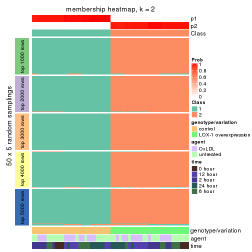</p>

</div>
<div id='tab-SD-kmeans-membership-heatmap-2'>
<pre><code class="r">membership_heatmap(res, k = 3)
</code></pre>

<p>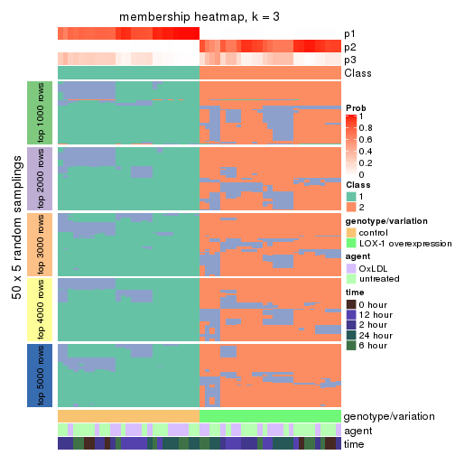</p>

</div>
<div id='tab-SD-kmeans-membership-heatmap-3'>
<pre><code class="r">membership_heatmap(res, k = 4)
</code></pre>

<p>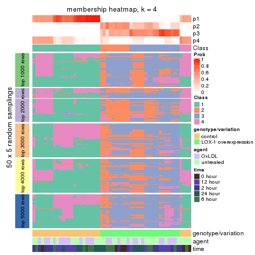</p>

</div>
<div id='tab-SD-kmeans-membership-heatmap-4'>
<pre><code class="r">membership_heatmap(res, k = 5)
</code></pre>

<p>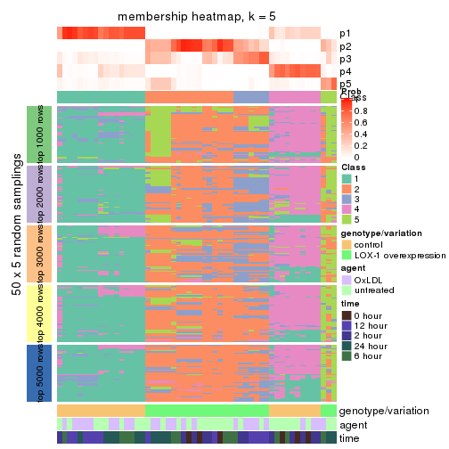</p>

</div>
<div id='tab-SD-kmeans-membership-heatmap-5'>
<pre><code class="r">membership_heatmap(res, k = 6)
</code></pre>

<p>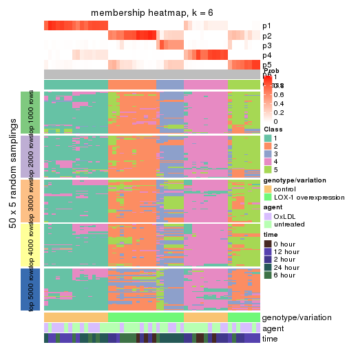</p>

</div>
</div>

As soon as we have had the classes for columns, we can look for signatures
which are significantly different between classes which can be candidate marks
for certain classes. Following are the heatmaps for signatures.


Signature heatmaps where rows are scaled:


<script>
$( function() {
	$( '#tabs-SD-kmeans-get-signatures' ).tabs();
} );
</script>
<div id='tabs-SD-kmeans-get-signatures'>
<ul>
<li><a href='#tab-SD-kmeans-get-signatures-1'>k = 2</a></li>
<li><a href='#tab-SD-kmeans-get-signatures-2'>k = 3</a></li>
<li><a href='#tab-SD-kmeans-get-signatures-3'>k = 4</a></li>
<li><a href='#tab-SD-kmeans-get-signatures-4'>k = 5</a></li>
<li><a href='#tab-SD-kmeans-get-signatures-5'>k = 6</a></li>
</ul>
<div id='tab-SD-kmeans-get-signatures-1'>
<pre><code class="r">get_signatures(res, k = 2)
</code></pre>

<p>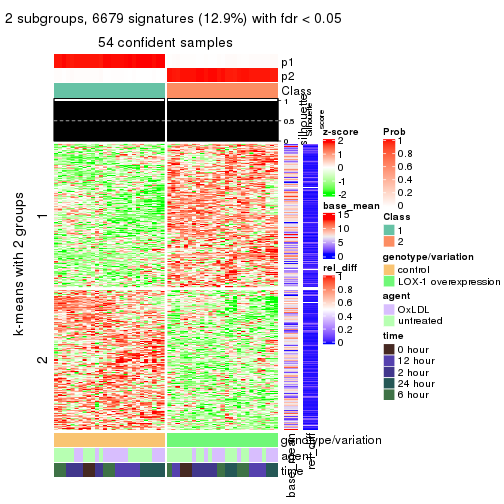</p>

</div>
<div id='tab-SD-kmeans-get-signatures-2'>
<pre><code class="r">get_signatures(res, k = 3)
</code></pre>

<p>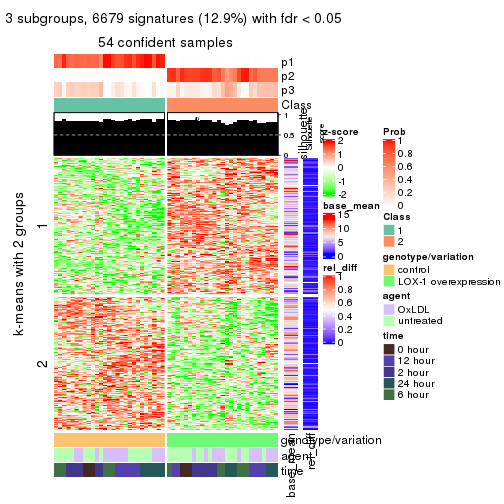</p>

</div>
<div id='tab-SD-kmeans-get-signatures-3'>
<pre><code class="r">get_signatures(res, k = 4)
</code></pre>

<p>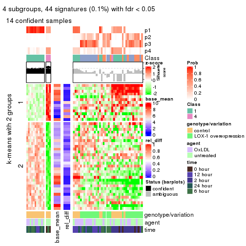</p>

</div>
<div id='tab-SD-kmeans-get-signatures-4'>
<pre><code class="r">get_signatures(res, k = 5)
</code></pre>

<p>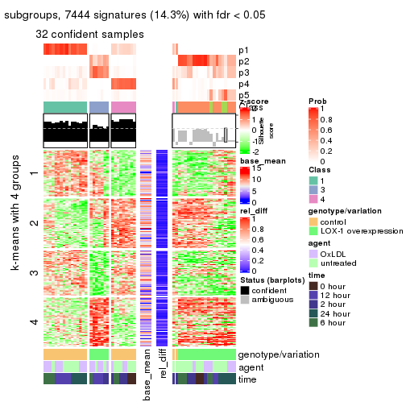</p>

</div>
<div id='tab-SD-kmeans-get-signatures-5'>
<pre><code class="r">get_signatures(res, k = 6)
</code></pre>

<p>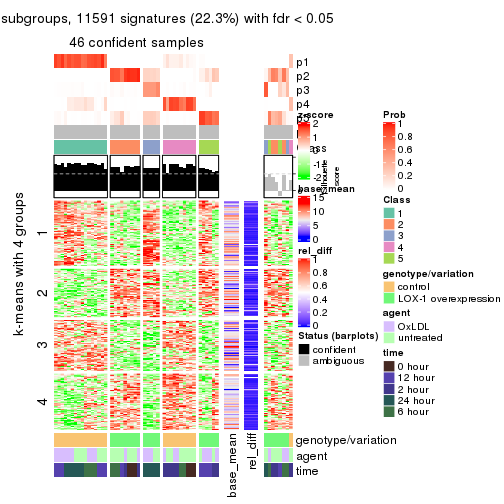</p>

</div>
</div>


Signature heatmaps where rows are not scaled:


<script>
$( function() {
	$( '#tabs-SD-kmeans-get-signatures-no-scale' ).tabs();
} );
</script>
<div id='tabs-SD-kmeans-get-signatures-no-scale'>
<ul>
<li><a href='#tab-SD-kmeans-get-signatures-no-scale-1'>k = 2</a></li>
<li><a href='#tab-SD-kmeans-get-signatures-no-scale-2'>k = 3</a></li>
<li><a href='#tab-SD-kmeans-get-signatures-no-scale-3'>k = 4</a></li>
<li><a href='#tab-SD-kmeans-get-signatures-no-scale-4'>k = 5</a></li>
<li><a href='#tab-SD-kmeans-get-signatures-no-scale-5'>k = 6</a></li>
</ul>
<div id='tab-SD-kmeans-get-signatures-no-scale-1'>
<pre><code class="r">get_signatures(res, k = 2, scale_rows = FALSE)
</code></pre>

<p>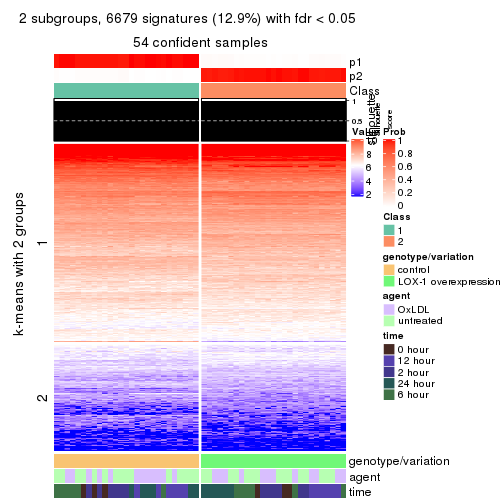</p>

</div>
<div id='tab-SD-kmeans-get-signatures-no-scale-2'>
<pre><code class="r">get_signatures(res, k = 3, scale_rows = FALSE)
</code></pre>

<p>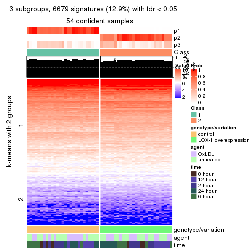</p>

</div>
<div id='tab-SD-kmeans-get-signatures-no-scale-3'>
<pre><code class="r">get_signatures(res, k = 4, scale_rows = FALSE)
</code></pre>

<p>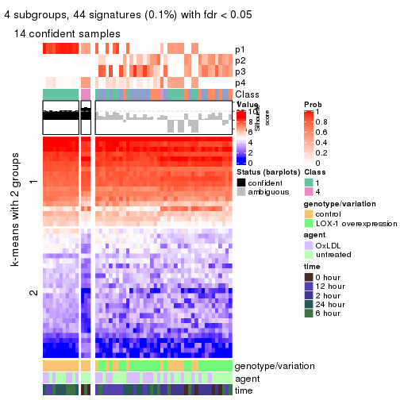</p>

</div>
<div id='tab-SD-kmeans-get-signatures-no-scale-4'>
<pre><code class="r">get_signatures(res, k = 5, scale_rows = FALSE)
</code></pre>

<p>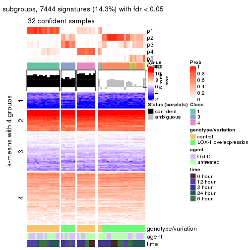</p>

</div>
<div id='tab-SD-kmeans-get-signatures-no-scale-5'>
<pre><code class="r">get_signatures(res, k = 6, scale_rows = FALSE)
</code></pre>

<p>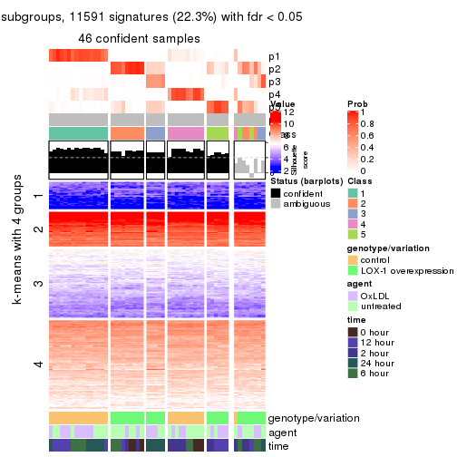</p>

</div>
</div>


Compare the overlap of signatures from different k:

```r
compare_signatures(res)
```

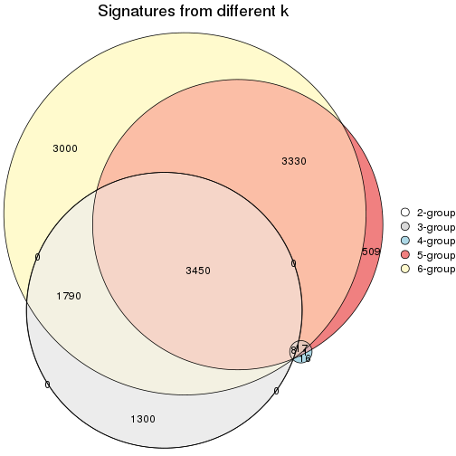

`get_signature()` returns a data frame invisibly. TO get the list of signatures, the function
call should be assigned to a variable explicitly. In following code, if `plot` argument is set
to `FALSE`, no heatmap is plotted while only the differential analysis is performed.

```r
# code only for demonstration
tb = get_signature(res, k = ..., plot = FALSE)
```

An example of the output of `tb` is:

```
#>   which_row         fdr    mean_1    mean_2 scaled_mean_1 scaled_mean_2 km
#> 1        38 0.042760348  8.373488  9.131774    -0.5533452     0.5164555  1
#> 2        40 0.018707592  7.106213  8.469186    -0.6173731     0.5762149  1
#> 3        55 0.019134737 10.221463 11.207825    -0.6159697     0.5749050  1
#> 4        59 0.006059896  5.921854  7.869574    -0.6899429     0.6439467  1
#> 5        60 0.018055526  8.928898 10.211722    -0.6204761     0.5791110  1
#> 6        98 0.009384629 15.714769 14.887706     0.6635654    -0.6193277  2
...
```

The columns in `tb` are:

1. `which_row`: row indices corresponding to the input matrix.
2. `fdr`: FDR for the differential test. 
3. `mean_x`: The mean value in group x.
4. `scaled_mean_x`: The mean value in group x after rows are scaled.
5. `km`: Row groups if k-means clustering is applied to rows.


UMAP plot which shows how samples are separated.


<script>
$( function() {
	$( '#tabs-SD-kmeans-dimension-reduction' ).tabs();
} );
</script>
<div id='tabs-SD-kmeans-dimension-reduction'>
<ul>
<li><a href='#tab-SD-kmeans-dimension-reduction-1'>k = 2</a></li>
<li><a href='#tab-SD-kmeans-dimension-reduction-2'>k = 3</a></li>
<li><a href='#tab-SD-kmeans-dimension-reduction-3'>k = 4</a></li>
<li><a href='#tab-SD-kmeans-dimension-reduction-4'>k = 5</a></li>
<li><a href='#tab-SD-kmeans-dimension-reduction-5'>k = 6</a></li>
</ul>
<div id='tab-SD-kmeans-dimension-reduction-1'>
<pre><code class="r">dimension_reduction(res, k = 2, method = &quot;UMAP&quot;)
</code></pre>

<p>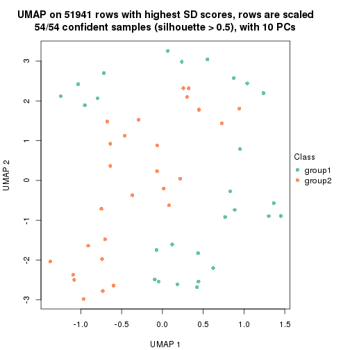</p>

</div>
<div id='tab-SD-kmeans-dimension-reduction-2'>
<pre><code class="r">dimension_reduction(res, k = 3, method = &quot;UMAP&quot;)
</code></pre>

<p>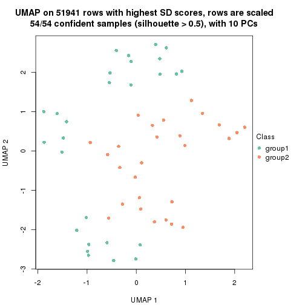</p>

</div>
<div id='tab-SD-kmeans-dimension-reduction-3'>
<pre><code class="r">dimension_reduction(res, k = 4, method = &quot;UMAP&quot;)
</code></pre>

<p>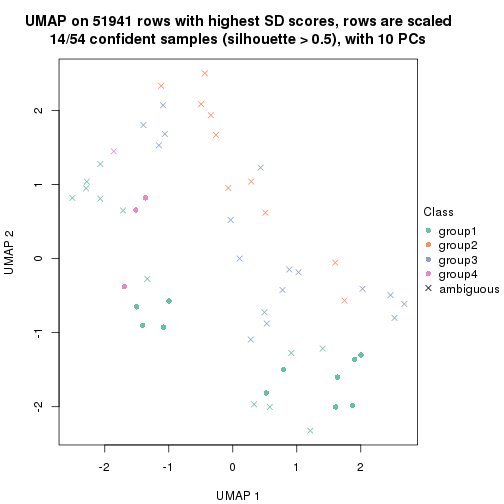</p>

</div>
<div id='tab-SD-kmeans-dimension-reduction-4'>
<pre><code class="r">dimension_reduction(res, k = 5, method = &quot;UMAP&quot;)
</code></pre>

<p>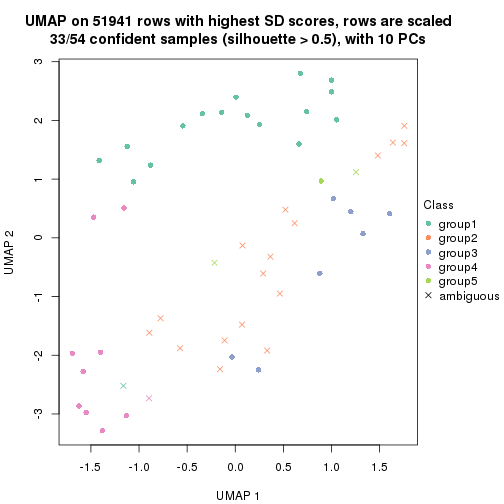</p>

</div>
<div id='tab-SD-kmeans-dimension-reduction-5'>
<pre><code class="r">dimension_reduction(res, k = 6, method = &quot;UMAP&quot;)
</code></pre>

<p>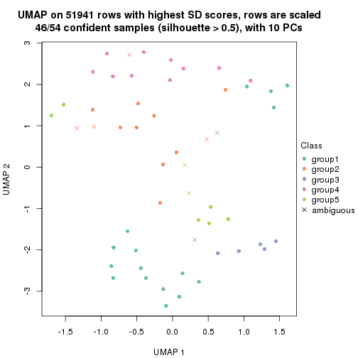</p>

</div>
</div>


Following heatmap shows how subgroups are split when increasing `k`:

```r
collect_classes(res)
```

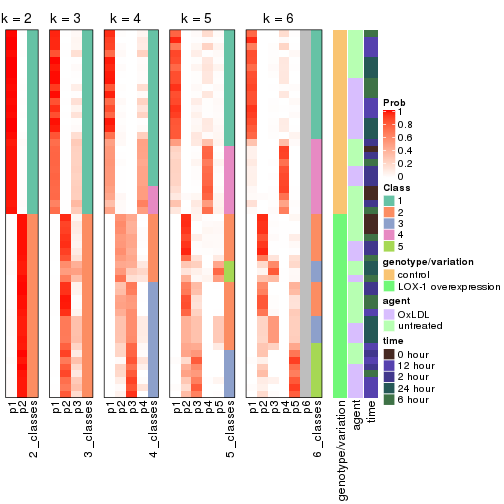


Test correlation between subgroups and known annotations. If the known
annotation is numeric, one-way ANOVA test is applied, and if the known
annotation is discrete, chi-squared contingency table test is applied.

```r
test_to_known_factors(res)
```

```
#>            n genotype/variation(p) agent(p)  time(p) k
#> SD:kmeans 54              1.48e-12    1.000 1.00e+00 2
#> SD:kmeans 54              1.48e-12    1.000 1.00e+00 3
#> SD:kmeans 14                    NA    0.301 2.62e-02 4
#> SD:kmeans 33              3.22e-07    0.320 4.38e-03 5
#> SD:kmeans 46              2.46e-09    0.269 1.82e-05 6
```


If matrix rows can be associated to genes, consider to use `functional_enrichment(res,
...)` to perform function enrichment for the signature genes. See [this vignette](http://bioconductor.org/packages/devel/bioc/vignettes/cola/inst/doc/functional_enrichment.html) for more detailed explanations.


 

---------------------------------------------------


### SD:skmeans


The object with results only for a single top-value method and a single partition method 
can be extracted as:

```r
res = res_list["SD", "skmeans"]
# you can also extract it by
# res = res_list["SD:skmeans"]
```

A summary of `res` and all the functions that can be applied to it:

```r
res
```

```
#> A 'ConsensusPartition' object with k = 2, 3, 4, 5, 6.
#>   On a matrix with 51941 rows and 54 columns.
#>   Top rows (1000, 2000, 3000, 4000, 5000) are extracted by 'SD' method.
#>   Subgroups are detected by 'skmeans' method.
#>   Performed in total 1250 partitions by row resampling.
#>   Best k for subgroups seems to be 2.
#> 
#> Following methods can be applied to this 'ConsensusPartition' object:
#>  [1] "cola_report"             "collect_classes"         "collect_plots"          
#>  [4] "collect_stats"           "colnames"                "compare_signatures"     
#>  [7] "consensus_heatmap"       "dimension_reduction"     "functional_enrichment"  
#> [10] "get_anno_col"            "get_anno"                "get_classes"            
#> [13] "get_consensus"           "get_matrix"              "get_membership"         
#> [16] "get_param"               "get_signatures"          "get_stats"              
#> [19] "is_best_k"               "is_stable_k"             "membership_heatmap"     
#> [22] "ncol"                    "nrow"                    "plot_ecdf"              
#> [25] "rownames"                "select_partition_number" "show"                   
#> [28] "suggest_best_k"          "test_to_known_factors"
```

`collect_plots()` function collects all the plots made from `res` for all `k` (number of partitions)
into one single page to provide an easy and fast comparison between different `k`.

```r
collect_plots(res)
```

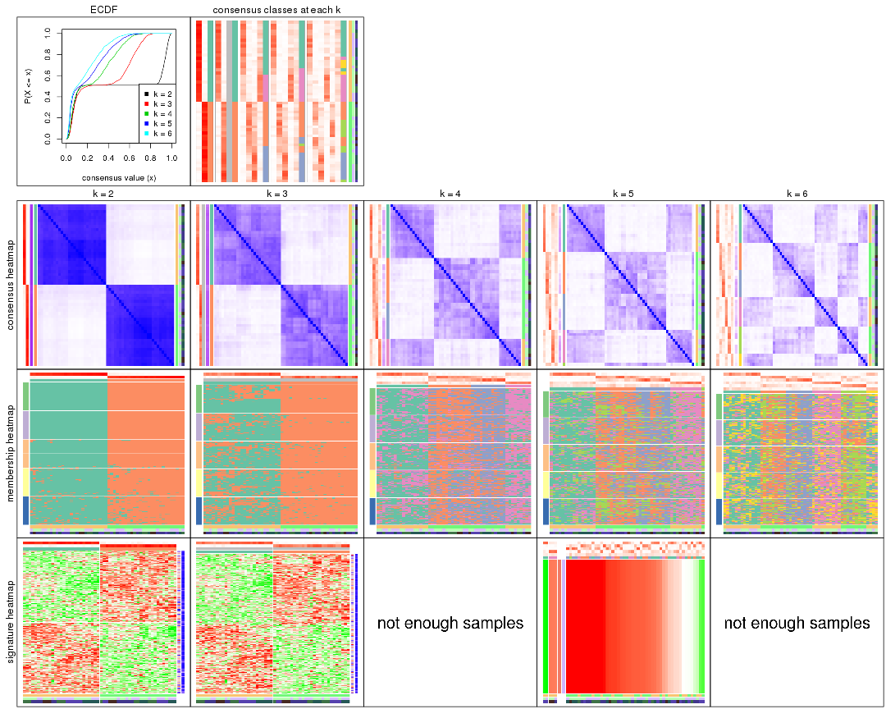

The plots are:

- The first row: a plot of the ECDF (empirical cumulative distribution
  function) curves of the consensus matrix for each `k` and the heatmap of
  predicted classes for each `k`.
- The second row: heatmaps of the consensus matrix for each `k`.
- The third row: heatmaps of the membership matrix for each `k`.
- The fouth row: heatmaps of the signatures for each `k`.

All the plots in panels can be made by individual functions and they are
plotted later in this section.

`select_partition_number()` produces several plots showing different
statistics for choosing "optimized" `k`. There are following statistics:

- ECDF curves of the consensus matrix for each `k`;
- 1-PAC. [The PAC
  score](https://en.wikipedia.org/wiki/Consensus_clustering#Over-interpretation_potential_of_consensus_clustering)
  measures the proportion of the ambiguous subgrouping.
- Mean silhouette score.
- Concordance. The mean probability of fiting the consensus class ids in all
  partitions.
- Area increased. Denote $A_k$ as the area under the ECDF curve for current
  `k`, the area increased is defined as $A_k - A_{k-1}$.
- Rand index. The percent of pairs of samples that are both in a same cluster
  or both are not in a same cluster in the partition of k and k-1.
- Jaccard index. The ratio of pairs of samples are both in a same cluster in
  the partition of k and k-1 and the pairs of samples are both in a same
  cluster in the partition k or k-1.

The detailed explanations of these statistics can be found in [the _cola_
vignette](http://bioconductor.org/packages/devel/bioc/vignettes/cola/inst/doc/cola.html#toc_13).

Generally speaking, lower PAC score, higher mean silhouette score or higher
concordance corresponds to better partition. Rand index and Jaccard index
measure how similar the current partition is compared to partition with `k-1`.
If they are too similar, we won't accept `k` is better than `k-1`.

```r
select_partition_number(res)
```

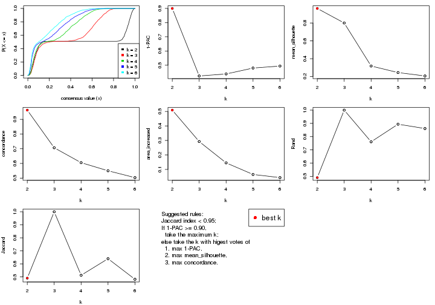

The numeric values for all these statistics can be obtained by `get_stats()`.

```r
get_stats(res)
```

```
#>   k 1-PAC mean_silhouette concordance area_increased  Rand Jaccard
#> 2 2 0.900           0.963       0.963         0.5093 0.491   0.491
#> 3 3 0.424           0.800       0.706         0.2923 1.000   1.000
#> 4 4 0.438           0.318       0.605         0.1451 0.761   0.513
#> 5 5 0.480           0.245       0.550         0.0652 0.894   0.640
#> 6 6 0.494           0.207       0.503         0.0433 0.861   0.482
```

`suggest_best_k()` suggests the best $k$ based on these statistics. The rules are as follows:

- All $k$ with Jaccard index larger than 0.95 are removed because increasing
  $k$ does not provide enough extra information. If all $k$ are removed, it is
  marked as no subgroup is detected.
- For all $k$ with 1-PAC score larger than 0.9, the maximal $k$ is taken as
  the best $k$, and other $k$ are marked as optional $k$.
- If it does not fit the second rule. The $k$ with the maximal vote of the
  highest 1-PAC score, highest mean silhouette, and highest concordance is
  taken as the best $k$.

```r
suggest_best_k(res)
```

```
#> [1] 2
```


Following shows the table of the partitions (You need to click the **show/hide
code output** link to see it). The membership matrix (columns with name `p*`)
is inferred by
[`clue::cl_consensus()`](https://www.rdocumentation.org/link/cl_consensus?package=clue)
function with the `SE` method. Basically the value in the membership matrix
represents the probability to belong to a certain group. The finall class
label for an item is determined with the group with highest probability it
belongs to.

In `get_classes()` function, the entropy is calculated from the membership
matrix and the silhouette score is calculated from the consensus matrix.


<script>
$( function() {
	$( '#tabs-SD-skmeans-get-classes' ).tabs();
} );
</script>
<div id='tabs-SD-skmeans-get-classes'>
<ul>
<li><a href='#tab-SD-skmeans-get-classes-1'>k = 2</a></li>
<li><a href='#tab-SD-skmeans-get-classes-2'>k = 3</a></li>
<li><a href='#tab-SD-skmeans-get-classes-3'>k = 4</a></li>
<li><a href='#tab-SD-skmeans-get-classes-4'>k = 5</a></li>
<li><a href='#tab-SD-skmeans-get-classes-5'>k = 6</a></li>
</ul>

<div id='tab-SD-skmeans-get-classes-1'>
<p><a id='tab-SD-skmeans-get-classes-1-a' style='color:#0366d6' href='#'>show/hide code output</a></p>
<pre><code class="r">cbind(get_classes(res, k = 2), get_membership(res, k = 2))
</code></pre>

<pre><code>#&gt;           class entropy silhouette    p1    p2
#&gt; GSM329068     2  0.2043      0.970 0.032 0.968
#&gt; GSM329074     2  0.2603      0.967 0.044 0.956
#&gt; GSM329100     2  0.1633      0.971 0.024 0.976
#&gt; GSM329062     2  0.0938      0.969 0.012 0.988
#&gt; GSM329079     2  0.1414      0.971 0.020 0.980
#&gt; GSM329090     2  0.1414      0.971 0.020 0.980
#&gt; GSM329066     2  0.2423      0.969 0.040 0.960
#&gt; GSM329086     2  0.4431      0.933 0.092 0.908
#&gt; GSM329099     2  0.1414      0.971 0.020 0.980
#&gt; GSM329071     2  0.0938      0.969 0.012 0.988
#&gt; GSM329078     2  0.2778      0.963 0.048 0.952
#&gt; GSM329081     2  0.4298      0.937 0.088 0.912
#&gt; GSM329096     2  0.0376      0.965 0.004 0.996
#&gt; GSM329102     2  0.2236      0.970 0.036 0.964
#&gt; GSM329104     2  0.3733      0.952 0.072 0.928
#&gt; GSM329067     2  0.2778      0.965 0.048 0.952
#&gt; GSM329072     2  0.4022      0.943 0.080 0.920
#&gt; GSM329075     2  0.1414      0.970 0.020 0.980
#&gt; GSM329058     2  0.2236      0.970 0.036 0.964
#&gt; GSM329073     2  0.5059      0.916 0.112 0.888
#&gt; GSM329107     2  0.0376      0.966 0.004 0.996
#&gt; GSM329057     2  0.2948      0.963 0.052 0.948
#&gt; GSM329085     2  0.3431      0.953 0.064 0.936
#&gt; GSM329089     2  0.0672      0.968 0.008 0.992
#&gt; GSM329076     2  0.2236      0.969 0.036 0.964
#&gt; GSM329094     2  0.0672      0.967 0.008 0.992
#&gt; GSM329105     2  0.0672      0.967 0.008 0.992
#&gt; GSM329056     1  0.1843      0.972 0.972 0.028
#&gt; GSM329069     1  0.1414      0.973 0.980 0.020
#&gt; GSM329077     1  0.4562      0.922 0.904 0.096
#&gt; GSM329070     1  0.1843      0.973 0.972 0.028
#&gt; GSM329082     1  0.3431      0.960 0.936 0.064
#&gt; GSM329092     1  0.3114      0.964 0.944 0.056
#&gt; GSM329083     1  0.2423      0.971 0.960 0.040
#&gt; GSM329101     1  0.1843      0.973 0.972 0.028
#&gt; GSM329106     1  0.2603      0.969 0.956 0.044
#&gt; GSM329087     1  0.0672      0.970 0.992 0.008
#&gt; GSM329091     1  0.0000      0.965 1.000 0.000
#&gt; GSM329093     1  0.2236      0.972 0.964 0.036
#&gt; GSM329080     1  0.0938      0.971 0.988 0.012
#&gt; GSM329084     1  0.3114      0.961 0.944 0.056
#&gt; GSM329088     1  0.1184      0.972 0.984 0.016
#&gt; GSM329059     1  0.3584      0.953 0.932 0.068
#&gt; GSM329097     1  0.3274      0.961 0.940 0.060
#&gt; GSM329098     1  0.4022      0.940 0.920 0.080
#&gt; GSM329055     1  0.0376      0.967 0.996 0.004
#&gt; GSM329103     1  0.0938      0.971 0.988 0.012
#&gt; GSM329108     1  0.0938      0.970 0.988 0.012
#&gt; GSM329061     1  0.1843      0.972 0.972 0.028
#&gt; GSM329064     1  0.2603      0.969 0.956 0.044
#&gt; GSM329065     1  0.1414      0.971 0.980 0.020
#&gt; GSM329060     1  0.2423      0.971 0.960 0.040
#&gt; GSM329063     1  0.1414      0.973 0.980 0.020
#&gt; GSM329095     1  0.3431      0.959 0.936 0.064
</code></pre>

<script>
$('#tab-SD-skmeans-get-classes-1-a').parent().next().next().hide();
$('#tab-SD-skmeans-get-classes-1-a').click(function(){
  $('#tab-SD-skmeans-get-classes-1-a').parent().next().next().toggle();
  return(false);
});
</script>
</div>

<div id='tab-SD-skmeans-get-classes-2'>
<p><a id='tab-SD-skmeans-get-classes-2-a' style='color:#0366d6' href='#'>show/hide code output</a></p>
<pre><code class="r">cbind(get_classes(res, k = 3), get_membership(res, k = 3))
</code></pre>

<pre><code>#&gt;           class entropy silhouette    p1    p2 p3
#&gt; GSM329068     2   0.636      0.816 0.024 0.696 NA
#&gt; GSM329074     2   0.619      0.812 0.016 0.692 NA
#&gt; GSM329100     2   0.691      0.805 0.036 0.656 NA
#&gt; GSM329062     2   0.647      0.818 0.008 0.604 NA
#&gt; GSM329079     2   0.671      0.801 0.012 0.572 NA
#&gt; GSM329090     2   0.651      0.806 0.008 0.592 NA
#&gt; GSM329066     2   0.594      0.832 0.024 0.740 NA
#&gt; GSM329086     2   0.750      0.764 0.044 0.572 NA
#&gt; GSM329099     2   0.645      0.817 0.012 0.636 NA
#&gt; GSM329071     2   0.496      0.825 0.008 0.792 NA
#&gt; GSM329078     2   0.820      0.708 0.080 0.544 NA
#&gt; GSM329081     2   0.742      0.810 0.068 0.656 NA
#&gt; GSM329096     2   0.452      0.826 0.004 0.816 NA
#&gt; GSM329102     2   0.486      0.810 0.044 0.840 NA
#&gt; GSM329104     2   0.514      0.802 0.044 0.824 NA
#&gt; GSM329067     2   0.713      0.776 0.024 0.544 NA
#&gt; GSM329072     2   0.749      0.762 0.036 0.496 NA
#&gt; GSM329075     2   0.613      0.804 0.008 0.668 NA
#&gt; GSM329058     2   0.580      0.824 0.028 0.760 NA
#&gt; GSM329073     2   0.656      0.792 0.032 0.692 NA
#&gt; GSM329107     2   0.692      0.808 0.024 0.608 NA
#&gt; GSM329057     2   0.587      0.816 0.032 0.760 NA
#&gt; GSM329085     2   0.857      0.674 0.104 0.524 NA
#&gt; GSM329089     2   0.687      0.813 0.044 0.680 NA
#&gt; GSM329076     2   0.425      0.810 0.048 0.872 NA
#&gt; GSM329094     2   0.258      0.814 0.008 0.928 NA
#&gt; GSM329105     2   0.334      0.819 0.000 0.880 NA
#&gt; GSM329056     1   0.718      0.779 0.592 0.032 NA
#&gt; GSM329069     1   0.717      0.795 0.612 0.036 NA
#&gt; GSM329077     1   0.844      0.724 0.548 0.100 NA
#&gt; GSM329070     1   0.625      0.818 0.648 0.008 NA
#&gt; GSM329082     1   0.682      0.781 0.628 0.024 NA
#&gt; GSM329092     1   0.745      0.755 0.532 0.036 NA
#&gt; GSM329083     1   0.719      0.802 0.636 0.044 NA
#&gt; GSM329101     1   0.527      0.837 0.784 0.016 NA
#&gt; GSM329106     1   0.666      0.807 0.668 0.028 NA
#&gt; GSM329087     1   0.454      0.827 0.836 0.016 NA
#&gt; GSM329091     1   0.469      0.833 0.820 0.012 NA
#&gt; GSM329093     1   0.602      0.788 0.740 0.028 NA
#&gt; GSM329080     1   0.361      0.835 0.888 0.016 NA
#&gt; GSM329084     1   0.573      0.829 0.760 0.024 NA
#&gt; GSM329088     1   0.459      0.835 0.848 0.032 NA
#&gt; GSM329059     1   0.744      0.773 0.568 0.040 NA
#&gt; GSM329097     1   0.761      0.786 0.584 0.052 NA
#&gt; GSM329098     1   0.851      0.672 0.484 0.092 NA
#&gt; GSM329055     1   0.532      0.839 0.780 0.016 NA
#&gt; GSM329103     1   0.511      0.829 0.808 0.024 NA
#&gt; GSM329108     1   0.466      0.838 0.828 0.016 NA
#&gt; GSM329061     1   0.511      0.813 0.768 0.004 NA
#&gt; GSM329064     1   0.524      0.831 0.804 0.028 NA
#&gt; GSM329065     1   0.533      0.795 0.792 0.024 NA
#&gt; GSM329060     1   0.563      0.831 0.780 0.032 NA
#&gt; GSM329063     1   0.455      0.833 0.840 0.020 NA
#&gt; GSM329095     1   0.617      0.774 0.740 0.036 NA
</code></pre>

<script>
$('#tab-SD-skmeans-get-classes-2-a').parent().next().next().hide();
$('#tab-SD-skmeans-get-classes-2-a').click(function(){
  $('#tab-SD-skmeans-get-classes-2-a').parent().next().next().toggle();
  return(false);
});
</script>
</div>

<div id='tab-SD-skmeans-get-classes-3'>
<p><a id='tab-SD-skmeans-get-classes-3-a' style='color:#0366d6' href='#'>show/hide code output</a></p>
<pre><code class="r">cbind(get_classes(res, k = 4), get_membership(res, k = 4))
</code></pre>

<pre><code>#&gt;           class entropy silhouette    p1    p2    p3    p4
#&gt; GSM329068     2   0.690     0.2934 0.016 0.568 0.336 0.080
#&gt; GSM329074     2   0.743     0.1923 0.004 0.488 0.352 0.156
#&gt; GSM329100     2   0.803     0.2436 0.048 0.508 0.320 0.124
#&gt; GSM329062     2   0.563     0.3667 0.000 0.700 0.224 0.076
#&gt; GSM329079     2   0.580     0.4057 0.024 0.736 0.168 0.072
#&gt; GSM329090     2   0.552     0.3379 0.016 0.708 0.244 0.032
#&gt; GSM329066     2   0.731     0.2049 0.040 0.516 0.380 0.064
#&gt; GSM329086     2   0.845     0.2190 0.056 0.488 0.284 0.172
#&gt; GSM329099     2   0.709     0.2532 0.024 0.560 0.336 0.080
#&gt; GSM329071     3   0.585     0.3740 0.040 0.284 0.664 0.012
#&gt; GSM329078     2   0.748    -0.0278 0.096 0.448 0.432 0.024
#&gt; GSM329081     3   0.713     0.0161 0.040 0.424 0.488 0.048
#&gt; GSM329096     3   0.462     0.4813 0.016 0.168 0.792 0.024
#&gt; GSM329102     3   0.475     0.4731 0.016 0.128 0.804 0.052
#&gt; GSM329104     3   0.581     0.4453 0.028 0.160 0.740 0.072
#&gt; GSM329067     2   0.749     0.3405 0.036 0.596 0.232 0.136
#&gt; GSM329072     2   0.650     0.3291 0.052 0.684 0.208 0.056
#&gt; GSM329075     2   0.691     0.2641 0.020 0.548 0.364 0.068
#&gt; GSM329058     3   0.658     0.1303 0.004 0.364 0.556 0.076
#&gt; GSM329073     3   0.805     0.0772 0.040 0.336 0.488 0.136
#&gt; GSM329107     2   0.675     0.1774 0.024 0.560 0.364 0.052
#&gt; GSM329057     3   0.646     0.2743 0.032 0.320 0.612 0.036
#&gt; GSM329085     2   0.761     0.0715 0.100 0.500 0.368 0.032
#&gt; GSM329089     3   0.722     0.1597 0.044 0.392 0.512 0.052
#&gt; GSM329076     3   0.461     0.4980 0.048 0.084 0.828 0.040
#&gt; GSM329094     3   0.431     0.5051 0.024 0.112 0.832 0.032
#&gt; GSM329105     3   0.453     0.4750 0.012 0.180 0.788 0.020
#&gt; GSM329056     4   0.619     0.5041 0.232 0.088 0.008 0.672
#&gt; GSM329069     4   0.611     0.5234 0.212 0.060 0.028 0.700
#&gt; GSM329077     4   0.719     0.4473 0.228 0.100 0.044 0.628
#&gt; GSM329070     4   0.622     0.4236 0.312 0.040 0.020 0.628
#&gt; GSM329082     1   0.737     0.1066 0.540 0.124 0.016 0.320
#&gt; GSM329092     1   0.785    -0.0905 0.460 0.104 0.040 0.396
#&gt; GSM329083     4   0.693     0.4241 0.244 0.056 0.060 0.640
#&gt; GSM329101     1   0.646     0.1063 0.488 0.020 0.032 0.460
#&gt; GSM329106     4   0.678     0.3983 0.304 0.044 0.044 0.608
#&gt; GSM329087     1   0.473     0.4617 0.752 0.032 0.000 0.216
#&gt; GSM329091     1   0.601     0.1264 0.504 0.020 0.012 0.464
#&gt; GSM329093     1   0.612     0.4385 0.712 0.096 0.020 0.172
#&gt; GSM329080     1   0.688     0.3877 0.620 0.036 0.068 0.276
#&gt; GSM329084     1   0.816     0.1888 0.488 0.060 0.112 0.340
#&gt; GSM329088     1   0.709     0.3260 0.584 0.040 0.064 0.312
#&gt; GSM329059     4   0.740     0.3135 0.356 0.092 0.028 0.524
#&gt; GSM329097     4   0.631     0.4866 0.244 0.068 0.020 0.668
#&gt; GSM329098     4   0.690     0.4703 0.220 0.108 0.028 0.644
#&gt; GSM329055     1   0.592     0.3187 0.612 0.028 0.012 0.348
#&gt; GSM329103     1   0.597     0.4033 0.668 0.044 0.016 0.272
#&gt; GSM329108     1   0.624     0.3397 0.628 0.036 0.024 0.312
#&gt; GSM329061     1   0.466     0.4406 0.808 0.056 0.012 0.124
#&gt; GSM329064     1   0.584     0.3808 0.684 0.028 0.028 0.260
#&gt; GSM329065     1   0.508     0.4857 0.792 0.048 0.032 0.128
#&gt; GSM329060     1   0.683     0.3798 0.624 0.040 0.060 0.276
#&gt; GSM329063     1   0.643     0.3874 0.624 0.024 0.048 0.304
#&gt; GSM329095     1   0.638     0.4129 0.712 0.104 0.040 0.144
</code></pre>

<script>
$('#tab-SD-skmeans-get-classes-3-a').parent().next().next().hide();
$('#tab-SD-skmeans-get-classes-3-a').click(function(){
  $('#tab-SD-skmeans-get-classes-3-a').parent().next().next().toggle();
  return(false);
});
</script>
</div>

<div id='tab-SD-skmeans-get-classes-4'>
<p><a id='tab-SD-skmeans-get-classes-4-a' style='color:#0366d6' href='#'>show/hide code output</a></p>
<pre><code class="r">cbind(get_classes(res, k = 5), get_membership(res, k = 5))
</code></pre>

<pre><code>#&gt;           class entropy silhouette    p1    p2    p3    p4    p5
#&gt; GSM329068     2   0.747   -0.22252 0.012 0.460 0.296 0.032 0.200
#&gt; GSM329074     3   0.793   -0.53573 0.004 0.320 0.348 0.060 0.268
#&gt; GSM329100     5   0.826    0.00000 0.008 0.276 0.312 0.084 0.320
#&gt; GSM329062     2   0.605    0.21804 0.020 0.668 0.176 0.016 0.120
#&gt; GSM329079     2   0.477    0.26290 0.008 0.772 0.088 0.016 0.116
#&gt; GSM329090     2   0.470    0.33972 0.020 0.780 0.128 0.012 0.060
#&gt; GSM329066     2   0.728    0.07221 0.008 0.496 0.256 0.032 0.208
#&gt; GSM329086     2   0.837   -0.23197 0.016 0.360 0.192 0.100 0.332
#&gt; GSM329099     2   0.673    0.04694 0.012 0.588 0.180 0.024 0.196
#&gt; GSM329071     3   0.652    0.30924 0.016 0.252 0.600 0.024 0.108
#&gt; GSM329078     2   0.709    0.21287 0.080 0.528 0.280 0.000 0.112
#&gt; GSM329081     2   0.821   -0.04055 0.048 0.364 0.320 0.028 0.240
#&gt; GSM329096     3   0.464    0.37200 0.000 0.156 0.760 0.016 0.068
#&gt; GSM329102     3   0.566    0.35141 0.024 0.100 0.728 0.032 0.116
#&gt; GSM329104     3   0.648    0.23730 0.016 0.104 0.636 0.040 0.204
#&gt; GSM329067     2   0.826   -0.31332 0.012 0.376 0.240 0.084 0.288
#&gt; GSM329072     2   0.643    0.32260 0.032 0.660 0.140 0.028 0.140
#&gt; GSM329075     3   0.768   -0.46271 0.012 0.316 0.400 0.032 0.240
#&gt; GSM329058     3   0.718   -0.04183 0.008 0.260 0.512 0.032 0.188
#&gt; GSM329073     3   0.809   -0.07356 0.020 0.212 0.428 0.064 0.276
#&gt; GSM329107     2   0.581    0.31905 0.004 0.628 0.244 0.004 0.120
#&gt; GSM329057     3   0.738    0.03767 0.028 0.364 0.448 0.024 0.136
#&gt; GSM329085     2   0.765    0.24339 0.096 0.516 0.264 0.020 0.104
#&gt; GSM329089     2   0.786    0.08250 0.028 0.400 0.340 0.032 0.200
#&gt; GSM329076     3   0.418    0.40510 0.008 0.116 0.812 0.020 0.044
#&gt; GSM329094     3   0.353    0.40547 0.004 0.092 0.844 0.004 0.056
#&gt; GSM329105     3   0.533    0.36855 0.008 0.212 0.704 0.024 0.052
#&gt; GSM329056     4   0.531    0.51091 0.132 0.016 0.012 0.732 0.108
#&gt; GSM329069     4   0.578    0.50758 0.120 0.012 0.020 0.692 0.156
#&gt; GSM329077     4   0.790    0.37460 0.148 0.044 0.064 0.520 0.224
#&gt; GSM329070     4   0.610    0.44014 0.212 0.032 0.012 0.656 0.088
#&gt; GSM329082     1   0.816    0.00195 0.388 0.060 0.020 0.304 0.228
#&gt; GSM329092     4   0.793    0.16447 0.304 0.036 0.032 0.428 0.200
#&gt; GSM329083     4   0.719    0.42306 0.188 0.032 0.036 0.580 0.164
#&gt; GSM329101     4   0.727   -0.02968 0.360 0.016 0.020 0.440 0.164
#&gt; GSM329106     4   0.594    0.45393 0.160 0.004 0.040 0.680 0.116
#&gt; GSM329087     1   0.516    0.51194 0.744 0.008 0.020 0.124 0.104
#&gt; GSM329091     1   0.662    0.18465 0.476 0.020 0.012 0.404 0.088
#&gt; GSM329093     1   0.596    0.49453 0.704 0.044 0.020 0.136 0.096
#&gt; GSM329080     1   0.747    0.39741 0.532 0.028 0.040 0.236 0.164
#&gt; GSM329084     1   0.762    0.31518 0.480 0.016 0.048 0.280 0.176
#&gt; GSM329088     1   0.722    0.35377 0.516 0.016 0.028 0.272 0.168
#&gt; GSM329059     4   0.721    0.39942 0.216 0.048 0.024 0.572 0.140
#&gt; GSM329097     4   0.515    0.52186 0.088 0.040 0.004 0.752 0.116
#&gt; GSM329098     4   0.697    0.46854 0.144 0.044 0.024 0.604 0.184
#&gt; GSM329055     1   0.690    0.37095 0.560 0.020 0.016 0.232 0.172
#&gt; GSM329103     1   0.546    0.49604 0.704 0.024 0.000 0.136 0.136
#&gt; GSM329108     1   0.719    0.31482 0.504 0.028 0.008 0.256 0.204
#&gt; GSM329061     1   0.530    0.49643 0.740 0.028 0.012 0.140 0.080
#&gt; GSM329064     1   0.580    0.48114 0.680 0.024 0.004 0.164 0.128
#&gt; GSM329065     1   0.494    0.52275 0.772 0.044 0.012 0.048 0.124
#&gt; GSM329060     1   0.700    0.41136 0.556 0.016 0.024 0.216 0.188
#&gt; GSM329063     1   0.624    0.47175 0.648 0.008 0.032 0.184 0.128
#&gt; GSM329095     1   0.636    0.46097 0.676 0.072 0.016 0.108 0.128
</code></pre>

<script>
$('#tab-SD-skmeans-get-classes-4-a').parent().next().next().hide();
$('#tab-SD-skmeans-get-classes-4-a').click(function(){
  $('#tab-SD-skmeans-get-classes-4-a').parent().next().next().toggle();
  return(false);
});
</script>
</div>

<div id='tab-SD-skmeans-get-classes-5'>
<p><a id='tab-SD-skmeans-get-classes-5-a' style='color:#0366d6' href='#'>show/hide code output</a></p>
<pre><code class="r">cbind(get_classes(res, k = 6), get_membership(res, k = 6))
</code></pre>

<pre><code>#&gt;           class entropy silhouette    p1    p2    p3    p4    p5    p6
#&gt; GSM329068     2   0.680     0.3611 0.008 0.552 0.184 0.024 0.188 0.044
#&gt; GSM329074     2   0.673     0.3115 0.012 0.572 0.244 0.048 0.072 0.052
#&gt; GSM329100     2   0.699     0.3601 0.008 0.572 0.168 0.068 0.140 0.044
#&gt; GSM329062     5   0.682    -0.0421 0.012 0.388 0.080 0.032 0.448 0.040
#&gt; GSM329079     2   0.665     0.0411 0.008 0.428 0.068 0.016 0.416 0.064
#&gt; GSM329090     5   0.596     0.2476 0.004 0.276 0.080 0.020 0.592 0.028
#&gt; GSM329066     2   0.774     0.2329 0.012 0.380 0.272 0.024 0.248 0.064
#&gt; GSM329086     2   0.814     0.2413 0.012 0.440 0.156 0.088 0.220 0.084
#&gt; GSM329099     2   0.781     0.3189 0.012 0.464 0.164 0.036 0.212 0.112
#&gt; GSM329071     3   0.729     0.1680 0.016 0.148 0.452 0.016 0.308 0.060
#&gt; GSM329078     5   0.598     0.4105 0.068 0.032 0.156 0.012 0.672 0.060
#&gt; GSM329081     5   0.799    -0.0600 0.036 0.316 0.216 0.012 0.344 0.076
#&gt; GSM329096     3   0.593     0.4684 0.016 0.128 0.672 0.020 0.124 0.040
#&gt; GSM329102     3   0.491     0.4971 0.028 0.088 0.772 0.032 0.048 0.032
#&gt; GSM329104     3   0.666     0.4226 0.028 0.164 0.624 0.036 0.060 0.088
#&gt; GSM329067     2   0.677     0.3019 0.008 0.584 0.092 0.064 0.208 0.044
#&gt; GSM329072     5   0.644     0.2741 0.032 0.188 0.068 0.020 0.628 0.064
#&gt; GSM329075     2   0.628     0.4066 0.004 0.624 0.172 0.032 0.124 0.044
#&gt; GSM329058     3   0.773     0.0213 0.012 0.332 0.384 0.020 0.144 0.108
#&gt; GSM329073     3   0.739     0.0448 0.012 0.352 0.420 0.024 0.104 0.088
#&gt; GSM329107     5   0.636     0.2831 0.016 0.208 0.108 0.016 0.608 0.044
#&gt; GSM329057     5   0.725     0.1185 0.024 0.092 0.308 0.012 0.472 0.092
#&gt; GSM329085     5   0.543     0.4272 0.100 0.028 0.116 0.012 0.716 0.028
#&gt; GSM329089     5   0.695     0.1914 0.008 0.144 0.300 0.012 0.480 0.056
#&gt; GSM329076     3   0.441     0.5224 0.012 0.068 0.796 0.016 0.076 0.032
#&gt; GSM329094     3   0.512     0.4986 0.000 0.104 0.724 0.020 0.116 0.036
#&gt; GSM329105     3   0.572     0.4117 0.008 0.072 0.640 0.012 0.232 0.036
#&gt; GSM329056     4   0.612     0.3338 0.068 0.060 0.020 0.644 0.016 0.192
#&gt; GSM329069     4   0.520     0.4029 0.052 0.040 0.020 0.736 0.020 0.132
#&gt; GSM329077     4   0.764     0.2650 0.108 0.188 0.024 0.516 0.036 0.128
#&gt; GSM329070     4   0.642     0.2779 0.172 0.036 0.000 0.580 0.028 0.184
#&gt; GSM329082     1   0.863     0.0579 0.340 0.056 0.032 0.276 0.104 0.192
#&gt; GSM329092     1   0.867    -0.0163 0.312 0.056 0.036 0.312 0.108 0.176
#&gt; GSM329083     4   0.721     0.2842 0.108 0.064 0.052 0.568 0.024 0.184
#&gt; GSM329101     6   0.737     0.0733 0.236 0.024 0.016 0.332 0.024 0.368
#&gt; GSM329106     4   0.683     0.2158 0.120 0.036 0.040 0.540 0.008 0.256
#&gt; GSM329087     1   0.630     0.1688 0.624 0.020 0.020 0.084 0.048 0.204
#&gt; GSM329091     4   0.697    -0.1890 0.328 0.020 0.004 0.376 0.016 0.256
#&gt; GSM329093     1   0.662     0.2034 0.620 0.020 0.020 0.116 0.084 0.140
#&gt; GSM329080     1   0.672    -0.1893 0.440 0.008 0.040 0.120 0.012 0.380
#&gt; GSM329084     6   0.805     0.0567 0.328 0.028 0.064 0.204 0.032 0.344
#&gt; GSM329088     6   0.700     0.1543 0.372 0.008 0.036 0.200 0.008 0.376
#&gt; GSM329059     4   0.740     0.2166 0.192 0.040 0.020 0.492 0.036 0.220
#&gt; GSM329097     4   0.563     0.3602 0.080 0.020 0.016 0.700 0.044 0.140
#&gt; GSM329098     4   0.795     0.2306 0.156 0.124 0.040 0.480 0.024 0.176
#&gt; GSM329055     1   0.741    -0.1824 0.416 0.040 0.028 0.248 0.008 0.260
#&gt; GSM329103     1   0.726     0.0664 0.548 0.044 0.028 0.128 0.048 0.204
#&gt; GSM329108     6   0.727     0.1007 0.368 0.024 0.020 0.156 0.032 0.400
#&gt; GSM329061     1   0.478     0.2542 0.752 0.016 0.004 0.092 0.024 0.112
#&gt; GSM329064     1   0.694     0.1177 0.552 0.012 0.028 0.132 0.056 0.220
#&gt; GSM329065     1   0.479     0.2132 0.752 0.008 0.020 0.036 0.040 0.144
#&gt; GSM329060     1   0.746    -0.0339 0.468 0.012 0.056 0.184 0.032 0.248
#&gt; GSM329063     1   0.708    -0.0315 0.480 0.020 0.032 0.176 0.016 0.276
#&gt; GSM329095     1   0.551     0.2629 0.704 0.016 0.008 0.048 0.124 0.100
</code></pre>

<script>
$('#tab-SD-skmeans-get-classes-5-a').parent().next().next().hide();
$('#tab-SD-skmeans-get-classes-5-a').click(function(){
  $('#tab-SD-skmeans-get-classes-5-a').parent().next().next().toggle();
  return(false);
});
</script>
</div>
</div>

Heatmaps for the consensus matrix. It visualizes the probability of two
samples to be in a same group.


<script>
$( function() {
	$( '#tabs-SD-skmeans-consensus-heatmap' ).tabs();
} );
</script>
<div id='tabs-SD-skmeans-consensus-heatmap'>
<ul>
<li><a href='#tab-SD-skmeans-consensus-heatmap-1'>k = 2</a></li>
<li><a href='#tab-SD-skmeans-consensus-heatmap-2'>k = 3</a></li>
<li><a href='#tab-SD-skmeans-consensus-heatmap-3'>k = 4</a></li>
<li><a href='#tab-SD-skmeans-consensus-heatmap-4'>k = 5</a></li>
<li><a href='#tab-SD-skmeans-consensus-heatmap-5'>k = 6</a></li>
</ul>
<div id='tab-SD-skmeans-consensus-heatmap-1'>
<pre><code class="r">consensus_heatmap(res, k = 2)
</code></pre>

<p>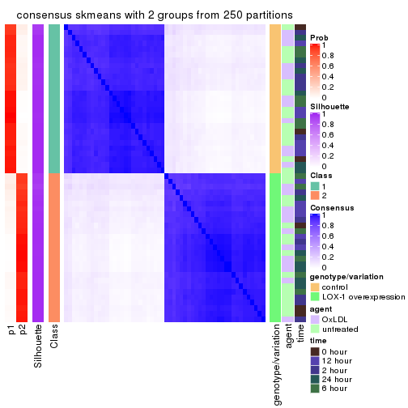</p>

</div>
<div id='tab-SD-skmeans-consensus-heatmap-2'>
<pre><code class="r">consensus_heatmap(res, k = 3)
</code></pre>

<p>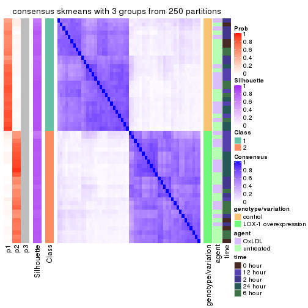</p>

</div>
<div id='tab-SD-skmeans-consensus-heatmap-3'>
<pre><code class="r">consensus_heatmap(res, k = 4)
</code></pre>

<p>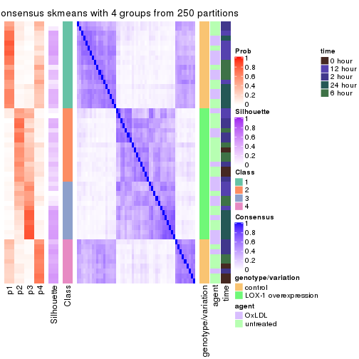</p>

</div>
<div id='tab-SD-skmeans-consensus-heatmap-4'>
<pre><code class="r">consensus_heatmap(res, k = 5)
</code></pre>

<p>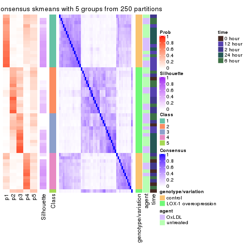</p>

</div>
<div id='tab-SD-skmeans-consensus-heatmap-5'>
<pre><code class="r">consensus_heatmap(res, k = 6)
</code></pre>

<p>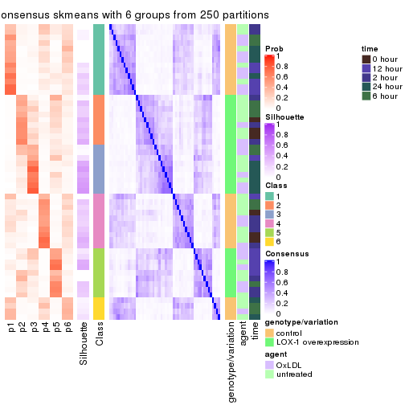</p>

</div>
</div>

Heatmaps for the membership of samples in all partitions to see how consistent they are:


<script>
$( function() {
	$( '#tabs-SD-skmeans-membership-heatmap' ).tabs();
} );
</script>
<div id='tabs-SD-skmeans-membership-heatmap'>
<ul>
<li><a href='#tab-SD-skmeans-membership-heatmap-1'>k = 2</a></li>
<li><a href='#tab-SD-skmeans-membership-heatmap-2'>k = 3</a></li>
<li><a href='#tab-SD-skmeans-membership-heatmap-3'>k = 4</a></li>
<li><a href='#tab-SD-skmeans-membership-heatmap-4'>k = 5</a></li>
<li><a href='#tab-SD-skmeans-membership-heatmap-5'>k = 6</a></li>
</ul>
<div id='tab-SD-skmeans-membership-heatmap-1'>
<pre><code class="r">membership_heatmap(res, k = 2)
</code></pre>

<p>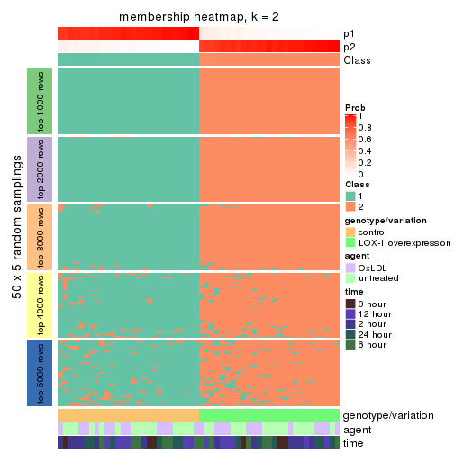</p>

</div>
<div id='tab-SD-skmeans-membership-heatmap-2'>
<pre><code class="r">membership_heatmap(res, k = 3)
</code></pre>

<p>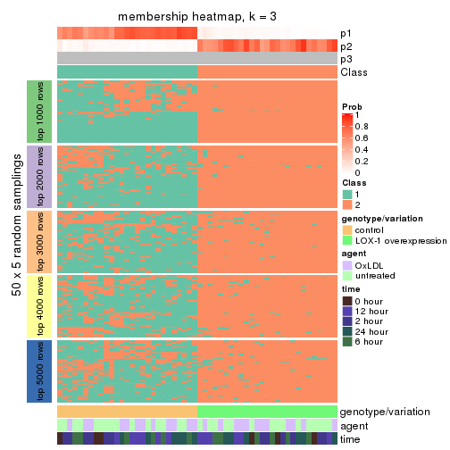</p>

</div>
<div id='tab-SD-skmeans-membership-heatmap-3'>
<pre><code class="r">membership_heatmap(res, k = 4)
</code></pre>

<p>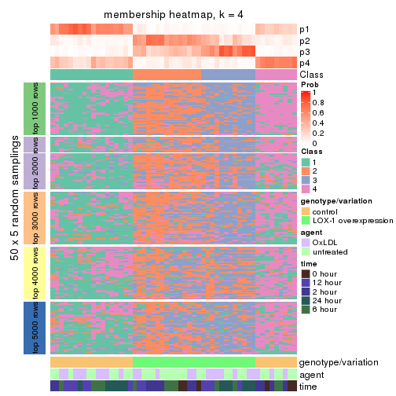</p>

</div>
<div id='tab-SD-skmeans-membership-heatmap-4'>
<pre><code class="r">membership_heatmap(res, k = 5)
</code></pre>

<p>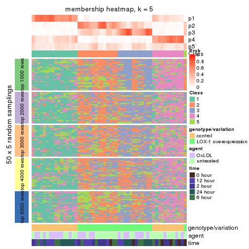</p>

</div>
<div id='tab-SD-skmeans-membership-heatmap-5'>
<pre><code class="r">membership_heatmap(res, k = 6)
</code></pre>

<p>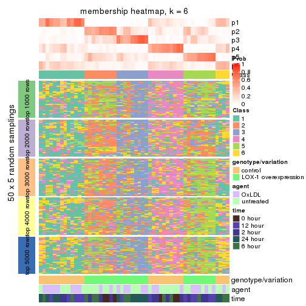</p>

</div>
</div>

As soon as we have had the classes for columns, we can look for signatures
which are significantly different between classes which can be candidate marks
for certain classes. Following are the heatmaps for signatures.


Signature heatmaps where rows are scaled:


<script>
$( function() {
	$( '#tabs-SD-skmeans-get-signatures' ).tabs();
} );
</script>
<div id='tabs-SD-skmeans-get-signatures'>
<ul>
<li><a href='#tab-SD-skmeans-get-signatures-1'>k = 2</a></li>
<li><a href='#tab-SD-skmeans-get-signatures-2'>k = 3</a></li>
<li><a href='#tab-SD-skmeans-get-signatures-3'>k = 4</a></li>
<li><a href='#tab-SD-skmeans-get-signatures-4'>k = 5</a></li>
<li><a href='#tab-SD-skmeans-get-signatures-5'>k = 6</a></li>
</ul>
<div id='tab-SD-skmeans-get-signatures-1'>
<pre><code class="r">get_signatures(res, k = 2)
</code></pre>

<p>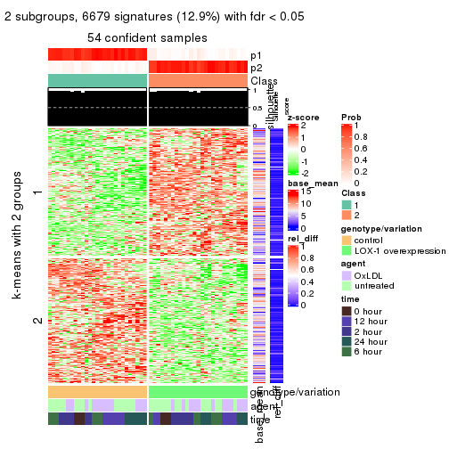</p>

</div>
<div id='tab-SD-skmeans-get-signatures-2'>
<pre><code class="r">get_signatures(res, k = 3)
</code></pre>

<p>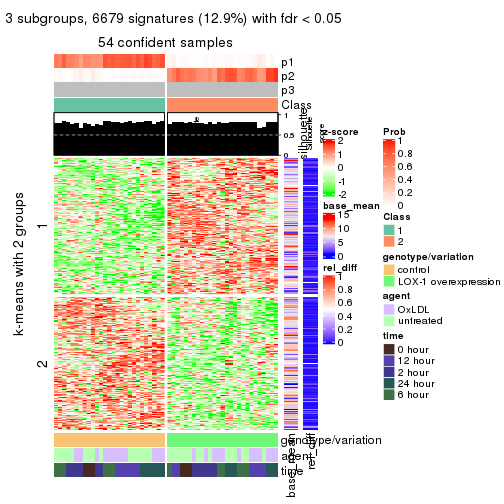</p>

</div>
<div id='tab-SD-skmeans-get-signatures-3'>
<pre><code class="r">get_signatures(res, k = 4)
</code></pre>

<p></p>

</div>
<div id='tab-SD-skmeans-get-signatures-4'>
<pre><code class="r">get_signatures(res, k = 5)
</code></pre>

<p>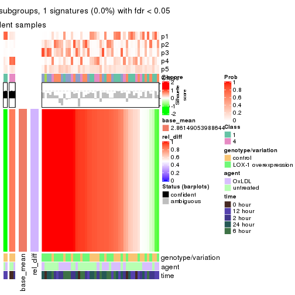</p>

</div>
<div id='tab-SD-skmeans-get-signatures-5'>
<pre><code class="r">get_signatures(res, k = 6)
</code></pre>

<p></p>

</div>
</div>


Signature heatmaps where rows are not scaled:


<script>
$( function() {
	$( '#tabs-SD-skmeans-get-signatures-no-scale' ).tabs();
} );
</script>
<div id='tabs-SD-skmeans-get-signatures-no-scale'>
<ul>
<li><a href='#tab-SD-skmeans-get-signatures-no-scale-1'>k = 2</a></li>
<li><a href='#tab-SD-skmeans-get-signatures-no-scale-2'>k = 3</a></li>
<li><a href='#tab-SD-skmeans-get-signatures-no-scale-3'>k = 4</a></li>
<li><a href='#tab-SD-skmeans-get-signatures-no-scale-4'>k = 5</a></li>
<li><a href='#tab-SD-skmeans-get-signatures-no-scale-5'>k = 6</a></li>
</ul>
<div id='tab-SD-skmeans-get-signatures-no-scale-1'>
<pre><code class="r">get_signatures(res, k = 2, scale_rows = FALSE)
</code></pre>

<p>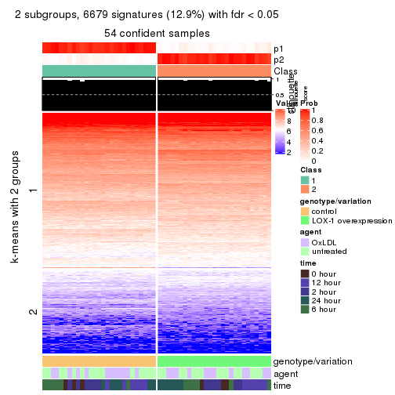</p>

</div>
<div id='tab-SD-skmeans-get-signatures-no-scale-2'>
<pre><code class="r">get_signatures(res, k = 3, scale_rows = FALSE)
</code></pre>

<p>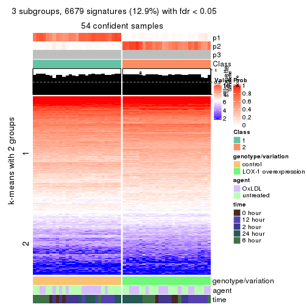</p>

</div>
<div id='tab-SD-skmeans-get-signatures-no-scale-3'>
<pre><code class="r">get_signatures(res, k = 4, scale_rows = FALSE)
</code></pre>

<p></p>

</div>
<div id='tab-SD-skmeans-get-signatures-no-scale-4'>
<pre><code class="r">get_signatures(res, k = 5, scale_rows = FALSE)
</code></pre>

<p>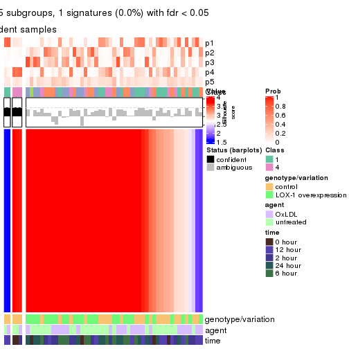</p>

</div>
<div id='tab-SD-skmeans-get-signatures-no-scale-5'>
<pre><code class="r">get_signatures(res, k = 6, scale_rows = FALSE)
</code></pre>

<p></p>

</div>
</div>


Compare the overlap of signatures from different k:

```r
compare_signatures(res)
```

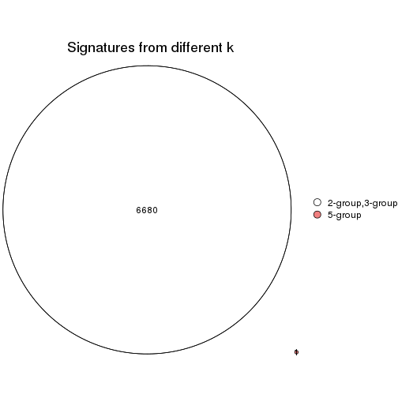

`get_signature()` returns a data frame invisibly. TO get the list of signatures, the function
call should be assigned to a variable explicitly. In following code, if `plot` argument is set
to `FALSE`, no heatmap is plotted while only the differential analysis is performed.

```r
# code only for demonstration
tb = get_signature(res, k = ..., plot = FALSE)
```

An example of the output of `tb` is:

```
#>   which_row         fdr    mean_1    mean_2 scaled_mean_1 scaled_mean_2 km
#> 1        38 0.042760348  8.373488  9.131774    -0.5533452     0.5164555  1
#> 2        40 0.018707592  7.106213  8.469186    -0.6173731     0.5762149  1
#> 3        55 0.019134737 10.221463 11.207825    -0.6159697     0.5749050  1
#> 4        59 0.006059896  5.921854  7.869574    -0.6899429     0.6439467  1
#> 5        60 0.018055526  8.928898 10.211722    -0.6204761     0.5791110  1
#> 6        98 0.009384629 15.714769 14.887706     0.6635654    -0.6193277  2
...
```

The columns in `tb` are:

1. `which_row`: row indices corresponding to the input matrix.
2. `fdr`: FDR for the differential test. 
3. `mean_x`: The mean value in group x.
4. `scaled_mean_x`: The mean value in group x after rows are scaled.
5. `km`: Row groups if k-means clustering is applied to rows.


UMAP plot which shows how samples are separated.


<script>
$( function() {
	$( '#tabs-SD-skmeans-dimension-reduction' ).tabs();
} );
</script>
<div id='tabs-SD-skmeans-dimension-reduction'>
<ul>
<li><a href='#tab-SD-skmeans-dimension-reduction-1'>k = 2</a></li>
<li><a href='#tab-SD-skmeans-dimension-reduction-2'>k = 3</a></li>
<li><a href='#tab-SD-skmeans-dimension-reduction-3'>k = 4</a></li>
<li><a href='#tab-SD-skmeans-dimension-reduction-4'>k = 5</a></li>
<li><a href='#tab-SD-skmeans-dimension-reduction-5'>k = 6</a></li>
</ul>
<div id='tab-SD-skmeans-dimension-reduction-1'>
<pre><code class="r">dimension_reduction(res, k = 2, method = &quot;UMAP&quot;)
</code></pre>

<p>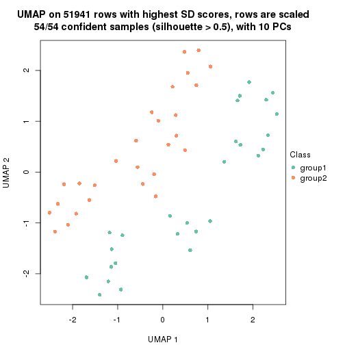</p>

</div>
<div id='tab-SD-skmeans-dimension-reduction-2'>
<pre><code class="r">dimension_reduction(res, k = 3, method = &quot;UMAP&quot;)
</code></pre>

<p>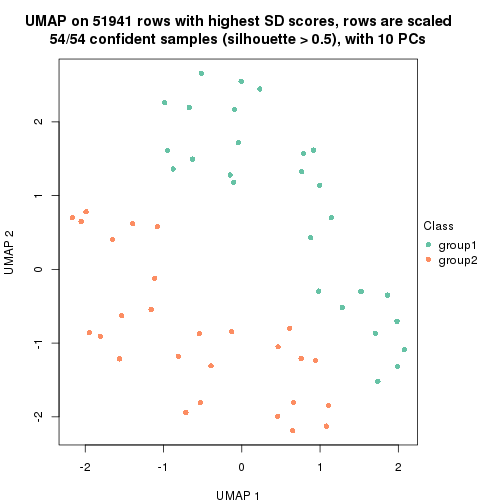</p>

</div>
<div id='tab-SD-skmeans-dimension-reduction-3'>
<pre><code class="r">dimension_reduction(res, k = 4, method = &quot;UMAP&quot;)
</code></pre>

<p>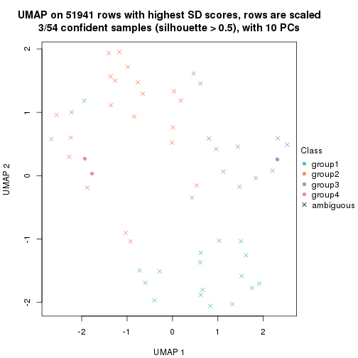</p>

</div>
<div id='tab-SD-skmeans-dimension-reduction-4'>
<pre><code class="r">dimension_reduction(res, k = 5, method = &quot;UMAP&quot;)
</code></pre>

<p>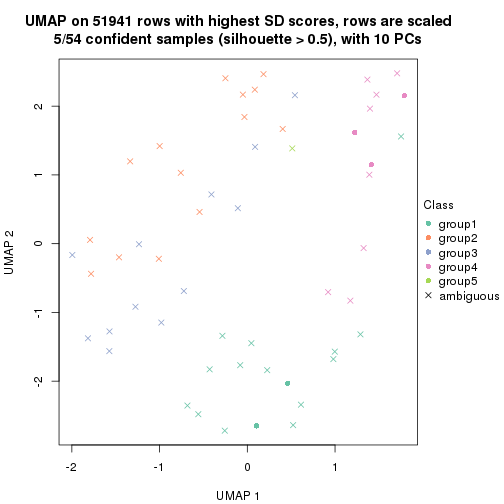</p>

</div>
<div id='tab-SD-skmeans-dimension-reduction-5'>
<pre><code class="r">dimension_reduction(res, k = 6, method = &quot;UMAP&quot;)
</code></pre>

<p>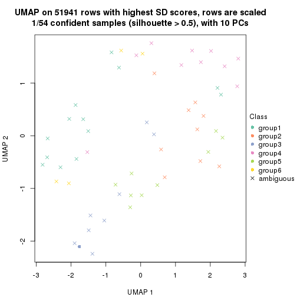</p>

</div>
</div>


Following heatmap shows how subgroups are split when increasing `k`:

```r
collect_classes(res)
```

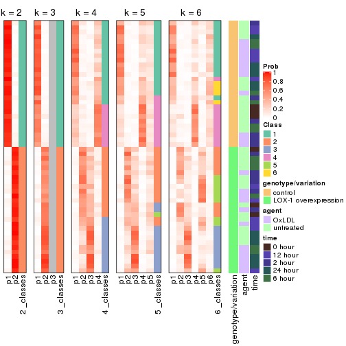


Test correlation between subgroups and known annotations. If the known
annotation is numeric, one-way ANOVA test is applied, and if the known
annotation is discrete, chi-squared contingency table test is applied.

```r
test_to_known_factors(res)
```

```
#>             n genotype/variation(p) agent(p) time(p) k
#> SD:skmeans 54              1.48e-12    1.000  1.0000 2
#> SD:skmeans 54              1.48e-12    1.000  1.0000 3
#> SD:skmeans  3              6.65e-01    0.665  0.6650 4
#> SD:skmeans  5                    NA    1.000  0.0821 5
#> SD:skmeans  1                    NA       NA      NA 6
```


If matrix rows can be associated to genes, consider to use `functional_enrichment(res,
...)` to perform function enrichment for the signature genes. See [this vignette](http://bioconductor.org/packages/devel/bioc/vignettes/cola/inst/doc/functional_enrichment.html) for more detailed explanations.


 

---------------------------------------------------


### SD:pam


The object with results only for a single top-value method and a single partition method 
can be extracted as:

```r
res = res_list["SD", "pam"]
# you can also extract it by
# res = res_list["SD:pam"]
```

A summary of `res` and all the functions that can be applied to it:

```r
res
```

```
#> A 'ConsensusPartition' object with k = 2, 3, 4, 5, 6.
#>   On a matrix with 51941 rows and 54 columns.
#>   Top rows (1000, 2000, 3000, 4000, 5000) are extracted by 'SD' method.
#>   Subgroups are detected by 'pam' method.
#>   Performed in total 1250 partitions by row resampling.
#>   Best k for subgroups seems to be 2.
#> 
#> Following methods can be applied to this 'ConsensusPartition' object:
#>  [1] "cola_report"             "collect_classes"         "collect_plots"          
#>  [4] "collect_stats"           "colnames"                "compare_signatures"     
#>  [7] "consensus_heatmap"       "dimension_reduction"     "functional_enrichment"  
#> [10] "get_anno_col"            "get_anno"                "get_classes"            
#> [13] "get_consensus"           "get_matrix"              "get_membership"         
#> [16] "get_param"               "get_signatures"          "get_stats"              
#> [19] "is_best_k"               "is_stable_k"             "membership_heatmap"     
#> [22] "ncol"                    "nrow"                    "plot_ecdf"              
#> [25] "rownames"                "select_partition_number" "show"                   
#> [28] "suggest_best_k"          "test_to_known_factors"
```

`collect_plots()` function collects all the plots made from `res` for all `k` (number of partitions)
into one single page to provide an easy and fast comparison between different `k`.

```r
collect_plots(res)
```

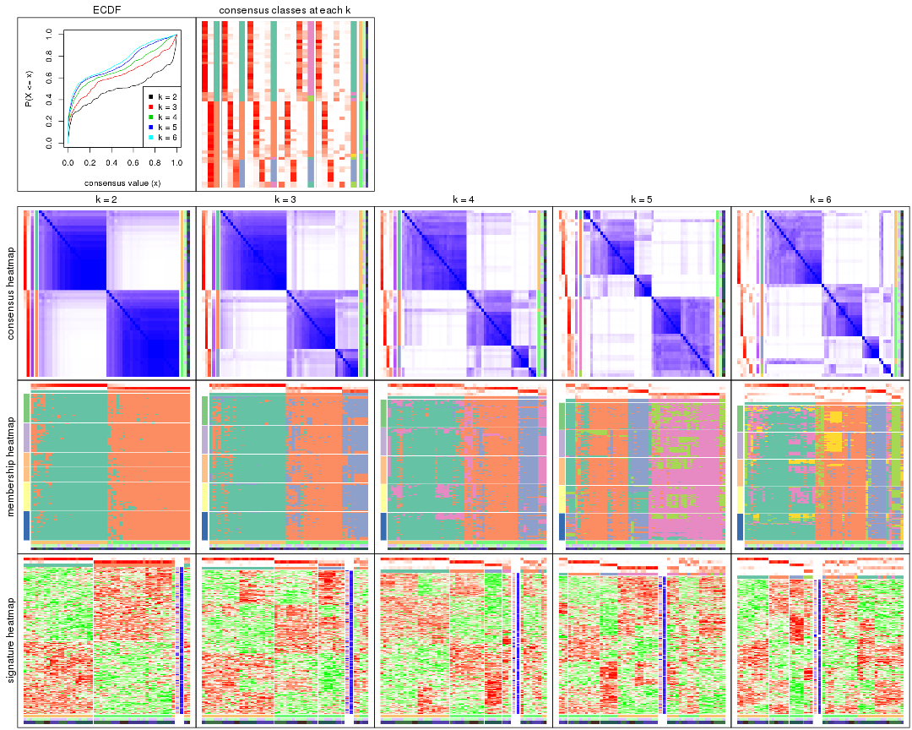

The plots are:

- The first row: a plot of the ECDF (empirical cumulative distribution
  function) curves of the consensus matrix for each `k` and the heatmap of
  predicted classes for each `k`.
- The second row: heatmaps of the consensus matrix for each `k`.
- The third row: heatmaps of the membership matrix for each `k`.
- The fouth row: heatmaps of the signatures for each `k`.

All the plots in panels can be made by individual functions and they are
plotted later in this section.

`select_partition_number()` produces several plots showing different
statistics for choosing "optimized" `k`. There are following statistics:

- ECDF curves of the consensus matrix for each `k`;
- 1-PAC. [The PAC
  score](https://en.wikipedia.org/wiki/Consensus_clustering#Over-interpretation_potential_of_consensus_clustering)
  measures the proportion of the ambiguous subgrouping.
- Mean silhouette score.
- Concordance. The mean probability of fiting the consensus class ids in all
  partitions.
- Area increased. Denote $A_k$ as the area under the ECDF curve for current
  `k`, the area increased is defined as $A_k - A_{k-1}$.
- Rand index. The percent of pairs of samples that are both in a same cluster
  or both are not in a same cluster in the partition of k and k-1.
- Jaccard index. The ratio of pairs of samples are both in a same cluster in
  the partition of k and k-1 and the pairs of samples are both in a same
  cluster in the partition k or k-1.

The detailed explanations of these statistics can be found in [the _cola_
vignette](http://bioconductor.org/packages/devel/bioc/vignettes/cola/inst/doc/cola.html#toc_13).

Generally speaking, lower PAC score, higher mean silhouette score or higher
concordance corresponds to better partition. Rand index and Jaccard index
measure how similar the current partition is compared to partition with `k-1`.
If they are too similar, we won't accept `k` is better than `k-1`.

```r
select_partition_number(res)
```

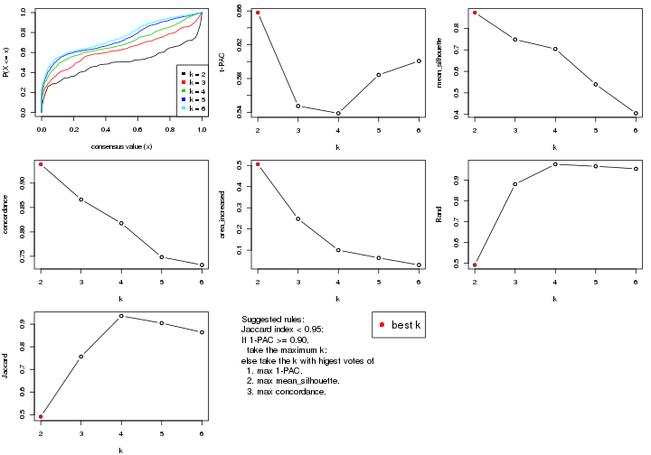

The numeric values for all these statistics can be obtained by `get_stats()`.

```r
get_stats(res)
```

```
#>   k 1-PAC mean_silhouette concordance area_increased  Rand Jaccard
#> 2 2 0.658           0.873       0.939         0.5054 0.491   0.491
#> 3 3 0.547           0.748       0.866         0.2475 0.881   0.757
#> 4 4 0.539           0.704       0.818         0.1000 0.976   0.936
#> 5 5 0.584           0.540       0.748         0.0633 0.966   0.904
#> 6 6 0.601           0.405       0.732         0.0299 0.955   0.864
```

`suggest_best_k()` suggests the best $k$ based on these statistics. The rules are as follows:

- All $k$ with Jaccard index larger than 0.95 are removed because increasing
  $k$ does not provide enough extra information. If all $k$ are removed, it is
  marked as no subgroup is detected.
- For all $k$ with 1-PAC score larger than 0.9, the maximal $k$ is taken as
  the best $k$, and other $k$ are marked as optional $k$.
- If it does not fit the second rule. The $k$ with the maximal vote of the
  highest 1-PAC score, highest mean silhouette, and highest concordance is
  taken as the best $k$.

```r
suggest_best_k(res)
```

```
#> [1] 2
```


Following shows the table of the partitions (You need to click the **show/hide
code output** link to see it). The membership matrix (columns with name `p*`)
is inferred by
[`clue::cl_consensus()`](https://www.rdocumentation.org/link/cl_consensus?package=clue)
function with the `SE` method. Basically the value in the membership matrix
represents the probability to belong to a certain group. The finall class
label for an item is determined with the group with highest probability it
belongs to.

In `get_classes()` function, the entropy is calculated from the membership
matrix and the silhouette score is calculated from the consensus matrix.


<script>
$( function() {
	$( '#tabs-SD-pam-get-classes' ).tabs();
} );
</script>
<div id='tabs-SD-pam-get-classes'>
<ul>
<li><a href='#tab-SD-pam-get-classes-1'>k = 2</a></li>
<li><a href='#tab-SD-pam-get-classes-2'>k = 3</a></li>
<li><a href='#tab-SD-pam-get-classes-3'>k = 4</a></li>
<li><a href='#tab-SD-pam-get-classes-4'>k = 5</a></li>
<li><a href='#tab-SD-pam-get-classes-5'>k = 6</a></li>
</ul>

<div id='tab-SD-pam-get-classes-1'>
<p><a id='tab-SD-pam-get-classes-1-a' style='color:#0366d6' href='#'>show/hide code output</a></p>
<pre><code class="r">cbind(get_classes(res, k = 2), get_membership(res, k = 2))
</code></pre>

<pre><code>#&gt;           class entropy silhouette    p1    p2
#&gt; GSM329068     2  0.1414      0.939 0.020 0.980
#&gt; GSM329074     2  0.0000      0.941 0.000 1.000
#&gt; GSM329100     2  0.0376      0.942 0.004 0.996
#&gt; GSM329062     2  0.0376      0.942 0.004 0.996
#&gt; GSM329079     2  0.0000      0.941 0.000 1.000
#&gt; GSM329090     2  0.0000      0.941 0.000 1.000
#&gt; GSM329066     2  0.0376      0.942 0.004 0.996
#&gt; GSM329086     2  0.2423      0.927 0.040 0.960
#&gt; GSM329099     2  0.0672      0.942 0.008 0.992
#&gt; GSM329071     2  0.0000      0.941 0.000 1.000
#&gt; GSM329078     2  0.6712      0.791 0.176 0.824
#&gt; GSM329081     2  0.4939      0.873 0.108 0.892
#&gt; GSM329096     2  0.7602      0.724 0.220 0.780
#&gt; GSM329102     2  0.0376      0.942 0.004 0.996
#&gt; GSM329104     2  0.0376      0.942 0.004 0.996
#&gt; GSM329067     2  0.1633      0.937 0.024 0.976
#&gt; GSM329072     2  0.8763      0.581 0.296 0.704
#&gt; GSM329075     2  0.0672      0.942 0.008 0.992
#&gt; GSM329058     2  0.1414      0.939 0.020 0.980
#&gt; GSM329073     2  0.1633      0.938 0.024 0.976
#&gt; GSM329107     2  0.0000      0.941 0.000 1.000
#&gt; GSM329057     2  0.0938      0.941 0.012 0.988
#&gt; GSM329085     2  0.5519      0.848 0.128 0.872
#&gt; GSM329089     2  0.1633      0.937 0.024 0.976
#&gt; GSM329076     2  0.0000      0.941 0.000 1.000
#&gt; GSM329094     2  0.2043      0.932 0.032 0.968
#&gt; GSM329105     2  0.0376      0.942 0.004 0.996
#&gt; GSM329056     1  0.9850      0.284 0.572 0.428
#&gt; GSM329069     1  0.0938      0.918 0.988 0.012
#&gt; GSM329077     1  0.0376      0.920 0.996 0.004
#&gt; GSM329070     1  0.9358      0.492 0.648 0.352
#&gt; GSM329082     1  0.3114      0.897 0.944 0.056
#&gt; GSM329092     1  0.1184      0.917 0.984 0.016
#&gt; GSM329083     1  0.8555      0.640 0.720 0.280
#&gt; GSM329101     1  0.7453      0.746 0.788 0.212
#&gt; GSM329106     1  0.5294      0.845 0.880 0.120
#&gt; GSM329087     1  0.0000      0.920 1.000 0.000
#&gt; GSM329091     1  0.2043      0.910 0.968 0.032
#&gt; GSM329093     1  0.0376      0.920 0.996 0.004
#&gt; GSM329080     1  0.0000      0.920 1.000 0.000
#&gt; GSM329084     1  0.4562      0.867 0.904 0.096
#&gt; GSM329088     1  0.0000      0.920 1.000 0.000
#&gt; GSM329059     1  0.1633      0.913 0.976 0.024
#&gt; GSM329097     1  0.7674      0.730 0.776 0.224
#&gt; GSM329098     2  0.8555      0.618 0.280 0.720
#&gt; GSM329055     1  0.0000      0.920 1.000 0.000
#&gt; GSM329103     1  0.0000      0.920 1.000 0.000
#&gt; GSM329108     1  0.0000      0.920 1.000 0.000
#&gt; GSM329061     1  0.0000      0.920 1.000 0.000
#&gt; GSM329064     1  0.0000      0.920 1.000 0.000
#&gt; GSM329065     1  0.0000      0.920 1.000 0.000
#&gt; GSM329060     1  0.0376      0.920 0.996 0.004
#&gt; GSM329063     1  0.0000      0.920 1.000 0.000
#&gt; GSM329095     1  0.0672      0.919 0.992 0.008
</code></pre>

<script>
$('#tab-SD-pam-get-classes-1-a').parent().next().next().hide();
$('#tab-SD-pam-get-classes-1-a').click(function(){
  $('#tab-SD-pam-get-classes-1-a').parent().next().next().toggle();
  return(false);
});
</script>
</div>

<div id='tab-SD-pam-get-classes-2'>
<p><a id='tab-SD-pam-get-classes-2-a' style='color:#0366d6' href='#'>show/hide code output</a></p>
<pre><code class="r">cbind(get_classes(res, k = 3), get_membership(res, k = 3))
</code></pre>

<pre><code>#&gt;           class entropy silhouette    p1    p2    p3
#&gt; GSM329068     2  0.0237     0.7944 0.000 0.996 0.004
#&gt; GSM329074     2  0.1860     0.7873 0.000 0.948 0.052
#&gt; GSM329100     2  0.1643     0.7886 0.000 0.956 0.044
#&gt; GSM329062     2  0.1031     0.7961 0.000 0.976 0.024
#&gt; GSM329079     2  0.0237     0.7942 0.000 0.996 0.004
#&gt; GSM329090     2  0.3551     0.7193 0.000 0.868 0.132
#&gt; GSM329066     2  0.0592     0.7955 0.000 0.988 0.012
#&gt; GSM329086     2  0.1163     0.7878 0.028 0.972 0.000
#&gt; GSM329099     2  0.0000     0.7938 0.000 1.000 0.000
#&gt; GSM329071     2  0.6140     0.0762 0.000 0.596 0.404
#&gt; GSM329078     3  0.6521     0.6137 0.040 0.248 0.712
#&gt; GSM329081     2  0.4768     0.7080 0.100 0.848 0.052
#&gt; GSM329096     3  0.7400     0.7033 0.072 0.264 0.664
#&gt; GSM329102     3  0.5327     0.7873 0.000 0.272 0.728
#&gt; GSM329104     3  0.4121     0.8155 0.000 0.168 0.832
#&gt; GSM329067     2  0.0424     0.7951 0.000 0.992 0.008
#&gt; GSM329072     2  0.9262     0.1997 0.176 0.500 0.324
#&gt; GSM329075     2  0.6476    -0.1470 0.004 0.548 0.448
#&gt; GSM329058     2  0.2063     0.7888 0.008 0.948 0.044
#&gt; GSM329073     2  0.5360     0.5901 0.012 0.768 0.220
#&gt; GSM329107     2  0.3116     0.7582 0.000 0.892 0.108
#&gt; GSM329057     3  0.2959     0.7639 0.000 0.100 0.900
#&gt; GSM329085     3  0.6742     0.6220 0.052 0.240 0.708
#&gt; GSM329089     2  0.5958     0.5235 0.008 0.692 0.300
#&gt; GSM329076     3  0.4605     0.8311 0.000 0.204 0.796
#&gt; GSM329094     3  0.4834     0.8311 0.004 0.204 0.792
#&gt; GSM329105     3  0.4654     0.8295 0.000 0.208 0.792
#&gt; GSM329056     1  0.7337     0.2619 0.540 0.428 0.032
#&gt; GSM329069     1  0.0848     0.9068 0.984 0.008 0.008
#&gt; GSM329077     1  0.0237     0.9052 0.996 0.000 0.004
#&gt; GSM329070     1  0.7091     0.5282 0.640 0.320 0.040
#&gt; GSM329082     1  0.2550     0.8876 0.932 0.056 0.012
#&gt; GSM329092     1  0.1491     0.9038 0.968 0.016 0.016
#&gt; GSM329083     1  0.6053     0.6723 0.720 0.260 0.020
#&gt; GSM329101     1  0.5305     0.7705 0.788 0.192 0.020
#&gt; GSM329106     1  0.4324     0.8422 0.860 0.112 0.028
#&gt; GSM329087     1  0.0237     0.9052 0.996 0.000 0.004
#&gt; GSM329091     1  0.2569     0.8978 0.936 0.032 0.032
#&gt; GSM329093     1  0.0661     0.9065 0.988 0.008 0.004
#&gt; GSM329080     1  0.0592     0.9052 0.988 0.000 0.012
#&gt; GSM329084     1  0.4920     0.8288 0.840 0.108 0.052
#&gt; GSM329088     1  0.1529     0.9024 0.960 0.000 0.040
#&gt; GSM329059     1  0.1525     0.8990 0.964 0.032 0.004
#&gt; GSM329097     1  0.5633     0.7492 0.768 0.208 0.024
#&gt; GSM329098     2  0.6148     0.4938 0.244 0.728 0.028
#&gt; GSM329055     1  0.1031     0.9044 0.976 0.000 0.024
#&gt; GSM329103     1  0.0592     0.9056 0.988 0.000 0.012
#&gt; GSM329108     1  0.0592     0.9056 0.988 0.000 0.012
#&gt; GSM329061     1  0.0000     0.9051 1.000 0.000 0.000
#&gt; GSM329064     1  0.0237     0.9052 0.996 0.000 0.004
#&gt; GSM329065     1  0.0892     0.9049 0.980 0.000 0.020
#&gt; GSM329060     1  0.0747     0.9062 0.984 0.000 0.016
#&gt; GSM329063     1  0.0237     0.9052 0.996 0.000 0.004
#&gt; GSM329095     1  0.3551     0.8346 0.868 0.000 0.132
</code></pre>

<script>
$('#tab-SD-pam-get-classes-2-a').parent().next().next().hide();
$('#tab-SD-pam-get-classes-2-a').click(function(){
  $('#tab-SD-pam-get-classes-2-a').parent().next().next().toggle();
  return(false);
});
</script>
</div>

<div id='tab-SD-pam-get-classes-3'>
<p><a id='tab-SD-pam-get-classes-3-a' style='color:#0366d6' href='#'>show/hide code output</a></p>
<pre><code class="r">cbind(get_classes(res, k = 4), get_membership(res, k = 4))
</code></pre>

<pre><code>#&gt;           class entropy silhouette    p1    p2    p3    p4
#&gt; GSM329068     2  0.0779     0.7602 0.000 0.980 0.004 0.016
#&gt; GSM329074     2  0.2670     0.7481 0.000 0.904 0.072 0.024
#&gt; GSM329100     2  0.2021     0.7583 0.000 0.936 0.040 0.024
#&gt; GSM329062     2  0.1284     0.7588 0.000 0.964 0.012 0.024
#&gt; GSM329079     2  0.0188     0.7604 0.000 0.996 0.004 0.000
#&gt; GSM329090     2  0.5231     0.1750 0.000 0.604 0.012 0.384
#&gt; GSM329066     2  0.0921     0.7618 0.000 0.972 0.028 0.000
#&gt; GSM329086     2  0.1109     0.7557 0.028 0.968 0.000 0.004
#&gt; GSM329099     2  0.0000     0.7600 0.000 1.000 0.000 0.000
#&gt; GSM329071     2  0.4877     0.3229 0.000 0.592 0.408 0.000
#&gt; GSM329078     4  0.7135     0.7283 0.012 0.108 0.332 0.548
#&gt; GSM329081     2  0.4340     0.6884 0.096 0.836 0.044 0.024
#&gt; GSM329096     3  0.3876     0.7310 0.040 0.124 0.836 0.000
#&gt; GSM329102     3  0.2589     0.8114 0.000 0.116 0.884 0.000
#&gt; GSM329104     3  0.3013     0.7735 0.000 0.032 0.888 0.080
#&gt; GSM329067     2  0.1284     0.7594 0.000 0.964 0.012 0.024
#&gt; GSM329072     4  0.8087     0.6598 0.064 0.248 0.136 0.552
#&gt; GSM329075     2  0.5628     0.2529 0.000 0.556 0.420 0.024
#&gt; GSM329058     2  0.1807     0.7587 0.008 0.940 0.052 0.000
#&gt; GSM329073     2  0.6056     0.5569 0.020 0.700 0.212 0.068
#&gt; GSM329107     2  0.5249     0.4837 0.000 0.708 0.044 0.248
#&gt; GSM329057     3  0.5257     0.4468 0.000 0.060 0.728 0.212
#&gt; GSM329085     4  0.7504     0.7253 0.044 0.084 0.324 0.548
#&gt; GSM329089     2  0.7162     0.0429 0.004 0.536 0.136 0.324
#&gt; GSM329076     3  0.1474     0.8497 0.000 0.052 0.948 0.000
#&gt; GSM329094     3  0.1389     0.8507 0.000 0.048 0.952 0.000
#&gt; GSM329105     3  0.1389     0.8507 0.000 0.048 0.952 0.000
#&gt; GSM329056     1  0.7889     0.3419 0.460 0.336 0.012 0.192
#&gt; GSM329069     1  0.1902     0.8521 0.932 0.000 0.004 0.064
#&gt; GSM329077     1  0.1022     0.8489 0.968 0.000 0.000 0.032
#&gt; GSM329070     1  0.7434     0.5577 0.564 0.264 0.016 0.156
#&gt; GSM329082     1  0.2845     0.8388 0.904 0.056 0.004 0.036
#&gt; GSM329092     1  0.2989     0.8509 0.884 0.012 0.004 0.100
#&gt; GSM329083     1  0.6912     0.6362 0.592 0.192 0.000 0.216
#&gt; GSM329101     1  0.5985     0.7368 0.692 0.168 0.000 0.140
#&gt; GSM329106     1  0.5530     0.7842 0.740 0.104 0.004 0.152
#&gt; GSM329087     1  0.0336     0.8451 0.992 0.000 0.000 0.008
#&gt; GSM329091     1  0.4079     0.8353 0.800 0.020 0.000 0.180
#&gt; GSM329093     1  0.1042     0.8503 0.972 0.008 0.000 0.020
#&gt; GSM329080     1  0.2760     0.8464 0.872 0.000 0.000 0.128
#&gt; GSM329084     1  0.6029     0.7750 0.748 0.092 0.060 0.100
#&gt; GSM329088     1  0.3672     0.8372 0.824 0.000 0.012 0.164
#&gt; GSM329059     1  0.1452     0.8420 0.956 0.036 0.000 0.008
#&gt; GSM329097     1  0.6020     0.7330 0.700 0.168 0.004 0.128
#&gt; GSM329098     2  0.6863     0.3623 0.184 0.616 0.004 0.196
#&gt; GSM329055     1  0.3486     0.8327 0.812 0.000 0.000 0.188
#&gt; GSM329103     1  0.2281     0.8496 0.904 0.000 0.000 0.096
#&gt; GSM329108     1  0.2469     0.8484 0.892 0.000 0.000 0.108
#&gt; GSM329061     1  0.0000     0.8458 1.000 0.000 0.000 0.000
#&gt; GSM329064     1  0.0469     0.8470 0.988 0.000 0.000 0.012
#&gt; GSM329065     1  0.3219     0.8399 0.836 0.000 0.000 0.164
#&gt; GSM329060     1  0.2412     0.8533 0.908 0.000 0.008 0.084
#&gt; GSM329063     1  0.1042     0.8466 0.972 0.000 0.008 0.020
#&gt; GSM329095     1  0.5004     0.3526 0.604 0.000 0.004 0.392
</code></pre>

<script>
$('#tab-SD-pam-get-classes-3-a').parent().next().next().hide();
$('#tab-SD-pam-get-classes-3-a').click(function(){
  $('#tab-SD-pam-get-classes-3-a').parent().next().next().toggle();
  return(false);
});
</script>
</div>

<div id='tab-SD-pam-get-classes-4'>
<p><a id='tab-SD-pam-get-classes-4-a' style='color:#0366d6' href='#'>show/hide code output</a></p>
<pre><code class="r">cbind(get_classes(res, k = 5), get_membership(res, k = 5))
</code></pre>

<pre><code>#&gt;           class entropy silhouette    p1    p2    p3    p4    p5
#&gt; GSM329068     2  0.1310    0.74304 0.020 0.956 0.000 0.000 0.024
#&gt; GSM329074     2  0.3466    0.72625 0.024 0.856 0.072 0.000 0.048
#&gt; GSM329100     2  0.2758    0.73784 0.024 0.896 0.032 0.000 0.048
#&gt; GSM329062     2  0.1630    0.74127 0.036 0.944 0.016 0.000 0.004
#&gt; GSM329079     2  0.0566    0.74406 0.004 0.984 0.000 0.000 0.012
#&gt; GSM329090     2  0.4304   -0.02974 0.484 0.516 0.000 0.000 0.000
#&gt; GSM329066     2  0.1106    0.74452 0.000 0.964 0.024 0.000 0.012
#&gt; GSM329086     2  0.1106    0.74286 0.000 0.964 0.000 0.024 0.012
#&gt; GSM329099     2  0.0404    0.74384 0.000 0.988 0.000 0.000 0.012
#&gt; GSM329071     2  0.4192    0.35564 0.000 0.596 0.404 0.000 0.000
#&gt; GSM329078     1  0.4617    0.84406 0.716 0.060 0.224 0.000 0.000
#&gt; GSM329081     2  0.4479    0.69165 0.024 0.812 0.036 0.088 0.040
#&gt; GSM329096     3  0.3165    0.76063 0.000 0.116 0.848 0.036 0.000
#&gt; GSM329102     3  0.1965    0.81653 0.000 0.096 0.904 0.000 0.000
#&gt; GSM329104     3  0.4495    0.67053 0.160 0.016 0.768 0.000 0.056
#&gt; GSM329067     2  0.2086    0.73927 0.020 0.924 0.008 0.000 0.048
#&gt; GSM329072     1  0.5395    0.77921 0.716 0.156 0.092 0.036 0.000
#&gt; GSM329075     2  0.5755    0.34589 0.020 0.556 0.372 0.000 0.052
#&gt; GSM329058     2  0.1914    0.74284 0.000 0.928 0.056 0.008 0.008
#&gt; GSM329073     2  0.6932    0.48823 0.064 0.588 0.168 0.004 0.176
#&gt; GSM329107     2  0.4639    0.35194 0.344 0.632 0.024 0.000 0.000
#&gt; GSM329057     3  0.4755    0.46245 0.244 0.060 0.696 0.000 0.000
#&gt; GSM329085     1  0.4953    0.84244 0.716 0.044 0.216 0.024 0.000
#&gt; GSM329089     2  0.6128   -0.00824 0.380 0.500 0.116 0.004 0.000
#&gt; GSM329076     3  0.0963    0.84375 0.000 0.036 0.964 0.000 0.000
#&gt; GSM329094     3  0.0963    0.84375 0.000 0.036 0.964 0.000 0.000
#&gt; GSM329105     3  0.0963    0.84375 0.000 0.036 0.964 0.000 0.000
#&gt; GSM329056     5  0.7338    0.50020 0.020 0.216 0.008 0.348 0.408
#&gt; GSM329069     4  0.3128    0.56509 0.004 0.000 0.004 0.824 0.168
#&gt; GSM329077     4  0.1608    0.63255 0.000 0.000 0.000 0.928 0.072
#&gt; GSM329070     4  0.6217   -0.07092 0.004 0.104 0.004 0.444 0.444
#&gt; GSM329082     4  0.2983    0.58139 0.000 0.056 0.000 0.868 0.076
#&gt; GSM329092     4  0.4451    0.41497 0.008 0.004 0.004 0.668 0.316
#&gt; GSM329083     5  0.6616    0.44562 0.032 0.108 0.000 0.360 0.500
#&gt; GSM329101     4  0.5940    0.12306 0.000 0.140 0.000 0.568 0.292
#&gt; GSM329106     4  0.5487    0.27834 0.000 0.072 0.004 0.600 0.324
#&gt; GSM329087     4  0.0162    0.62246 0.000 0.000 0.000 0.996 0.004
#&gt; GSM329091     4  0.4384    0.48245 0.000 0.016 0.000 0.660 0.324
#&gt; GSM329093     4  0.1124    0.62363 0.000 0.004 0.000 0.960 0.036
#&gt; GSM329080     4  0.4009    0.53430 0.000 0.000 0.004 0.684 0.312
#&gt; GSM329084     4  0.5570    0.43538 0.000 0.076 0.020 0.656 0.248
#&gt; GSM329088     4  0.4430    0.46193 0.000 0.000 0.012 0.628 0.360
#&gt; GSM329059     4  0.0566    0.62236 0.000 0.004 0.000 0.984 0.012
#&gt; GSM329097     4  0.5684    0.26080 0.000 0.096 0.004 0.600 0.300
#&gt; GSM329098     2  0.6369   -0.11885 0.008 0.508 0.000 0.140 0.344
#&gt; GSM329055     4  0.4219    0.37964 0.000 0.000 0.000 0.584 0.416
#&gt; GSM329103     4  0.3143    0.55347 0.000 0.000 0.000 0.796 0.204
#&gt; GSM329108     4  0.3242    0.56814 0.000 0.000 0.000 0.784 0.216
#&gt; GSM329061     4  0.0290    0.62352 0.000 0.000 0.000 0.992 0.008
#&gt; GSM329064     4  0.0510    0.62482 0.000 0.000 0.000 0.984 0.016
#&gt; GSM329065     4  0.3816    0.52163 0.000 0.000 0.000 0.696 0.304
#&gt; GSM329060     4  0.3910    0.56670 0.000 0.000 0.008 0.720 0.272
#&gt; GSM329063     4  0.0880    0.62678 0.000 0.000 0.000 0.968 0.032
#&gt; GSM329095     4  0.5114   -0.02701 0.404 0.000 0.004 0.560 0.032
</code></pre>

<script>
$('#tab-SD-pam-get-classes-4-a').parent().next().next().hide();
$('#tab-SD-pam-get-classes-4-a').click(function(){
  $('#tab-SD-pam-get-classes-4-a').parent().next().next().toggle();
  return(false);
});
</script>
</div>

<div id='tab-SD-pam-get-classes-5'>
<p><a id='tab-SD-pam-get-classes-5-a' style='color:#0366d6' href='#'>show/hide code output</a></p>
<pre><code class="r">cbind(get_classes(res, k = 6), get_membership(res, k = 6))
</code></pre>

<pre><code>#&gt;           class entropy silhouette    p1    p2    p3    p4    p5    p6
#&gt; GSM329068     2  0.2003   0.539516 0.000 0.884 0.000 0.000 0.000 0.116
#&gt; GSM329074     2  0.4301   0.437706 0.000 0.696 0.064 0.000 0.000 0.240
#&gt; GSM329100     2  0.3695   0.468822 0.000 0.732 0.024 0.000 0.000 0.244
#&gt; GSM329062     2  0.1605   0.549456 0.000 0.940 0.012 0.000 0.016 0.032
#&gt; GSM329079     2  0.0146   0.541373 0.000 0.996 0.000 0.000 0.000 0.004
#&gt; GSM329090     2  0.3867   0.000535 0.000 0.512 0.000 0.000 0.488 0.000
#&gt; GSM329066     2  0.0458   0.536096 0.000 0.984 0.016 0.000 0.000 0.000
#&gt; GSM329086     2  0.0692   0.536122 0.020 0.976 0.000 0.000 0.000 0.004
#&gt; GSM329099     2  0.0146   0.541373 0.000 0.996 0.000 0.000 0.000 0.004
#&gt; GSM329071     2  0.3747  -0.041479 0.000 0.604 0.396 0.000 0.000 0.000
#&gt; GSM329078     5  0.3746   0.862185 0.000 0.048 0.192 0.000 0.760 0.000
#&gt; GSM329081     2  0.4873   0.425571 0.080 0.716 0.032 0.004 0.000 0.168
#&gt; GSM329096     3  0.2930   0.681590 0.036 0.124 0.840 0.000 0.000 0.000
#&gt; GSM329102     3  0.1501   0.776108 0.000 0.076 0.924 0.000 0.000 0.000
#&gt; GSM329104     3  0.6424   0.399677 0.000 0.016 0.576 0.056 0.208 0.144
#&gt; GSM329067     2  0.3126   0.480511 0.000 0.752 0.000 0.000 0.000 0.248
#&gt; GSM329072     5  0.4479   0.765547 0.024 0.144 0.088 0.000 0.744 0.000
#&gt; GSM329075     2  0.6137  -0.152095 0.000 0.412 0.336 0.004 0.000 0.248
#&gt; GSM329058     2  0.1938   0.525137 0.008 0.920 0.052 0.000 0.000 0.020
#&gt; GSM329073     6  0.6061   0.000000 0.000 0.404 0.156 0.016 0.000 0.424
#&gt; GSM329107     2  0.4335   0.203938 0.000 0.644 0.024 0.000 0.324 0.008
#&gt; GSM329057     3  0.4204   0.443321 0.000 0.052 0.696 0.000 0.252 0.000
#&gt; GSM329085     5  0.3932   0.849938 0.024 0.024 0.192 0.000 0.760 0.000
#&gt; GSM329089     2  0.5443  -0.028772 0.004 0.504 0.108 0.000 0.384 0.000
#&gt; GSM329076     3  0.0632   0.804711 0.000 0.024 0.976 0.000 0.000 0.000
#&gt; GSM329094     3  0.0632   0.804711 0.000 0.024 0.976 0.000 0.000 0.000
#&gt; GSM329105     3  0.0632   0.804711 0.000 0.024 0.976 0.000 0.000 0.000
#&gt; GSM329056     1  0.7448  -0.296793 0.328 0.152 0.000 0.328 0.000 0.192
#&gt; GSM329069     1  0.3416   0.517898 0.804 0.000 0.000 0.140 0.000 0.056
#&gt; GSM329077     1  0.1471   0.586731 0.932 0.000 0.000 0.064 0.000 0.004
#&gt; GSM329070     4  0.6232  -0.251108 0.416 0.100 0.004 0.436 0.000 0.044
#&gt; GSM329082     1  0.3127   0.550905 0.852 0.044 0.000 0.084 0.000 0.020
#&gt; GSM329092     1  0.5349   0.239261 0.584 0.000 0.000 0.316 0.020 0.080
#&gt; GSM329083     4  0.6352   0.222440 0.188 0.084 0.000 0.596 0.012 0.120
#&gt; GSM329101     1  0.5639   0.145930 0.552 0.132 0.000 0.304 0.000 0.012
#&gt; GSM329106     1  0.5283   0.227828 0.560 0.064 0.000 0.356 0.000 0.020
#&gt; GSM329087     1  0.0000   0.585156 1.000 0.000 0.000 0.000 0.000 0.000
#&gt; GSM329091     1  0.4455   0.361433 0.616 0.016 0.000 0.352 0.000 0.016
#&gt; GSM329093     1  0.1340   0.587467 0.948 0.004 0.000 0.040 0.000 0.008
#&gt; GSM329080     1  0.4026   0.390870 0.636 0.000 0.000 0.348 0.000 0.016
#&gt; GSM329084     1  0.5608   0.304351 0.612 0.068 0.028 0.276 0.000 0.016
#&gt; GSM329088     1  0.4419   0.306972 0.568 0.000 0.008 0.408 0.000 0.016
#&gt; GSM329059     1  0.0748   0.586700 0.976 0.004 0.000 0.016 0.000 0.004
#&gt; GSM329097     1  0.5848   0.196669 0.588 0.084 0.000 0.264 0.000 0.064
#&gt; GSM329098     2  0.6223  -0.128915 0.124 0.504 0.000 0.324 0.000 0.048
#&gt; GSM329055     1  0.3843   0.289481 0.548 0.000 0.000 0.452 0.000 0.000
#&gt; GSM329103     1  0.3290   0.523580 0.776 0.000 0.000 0.208 0.000 0.016
#&gt; GSM329108     1  0.3076   0.524681 0.760 0.000 0.000 0.240 0.000 0.000
#&gt; GSM329061     1  0.0363   0.586954 0.988 0.000 0.000 0.012 0.000 0.000
#&gt; GSM329064     1  0.0547   0.587663 0.980 0.000 0.000 0.020 0.000 0.000
#&gt; GSM329065     1  0.3756   0.432256 0.644 0.000 0.000 0.352 0.000 0.004
#&gt; GSM329060     1  0.3894   0.460433 0.664 0.000 0.004 0.324 0.000 0.008
#&gt; GSM329063     1  0.0865   0.585593 0.964 0.000 0.000 0.036 0.000 0.000
#&gt; GSM329095     1  0.4930   0.000959 0.528 0.000 0.000 0.040 0.420 0.012
</code></pre>

<script>
$('#tab-SD-pam-get-classes-5-a').parent().next().next().hide();
$('#tab-SD-pam-get-classes-5-a').click(function(){
  $('#tab-SD-pam-get-classes-5-a').parent().next().next().toggle();
  return(false);
});
</script>
</div>
</div>

Heatmaps for the consensus matrix. It visualizes the probability of two
samples to be in a same group.


<script>
$( function() {
	$( '#tabs-SD-pam-consensus-heatmap' ).tabs();
} );
</script>
<div id='tabs-SD-pam-consensus-heatmap'>
<ul>
<li><a href='#tab-SD-pam-consensus-heatmap-1'>k = 2</a></li>
<li><a href='#tab-SD-pam-consensus-heatmap-2'>k = 3</a></li>
<li><a href='#tab-SD-pam-consensus-heatmap-3'>k = 4</a></li>
<li><a href='#tab-SD-pam-consensus-heatmap-4'>k = 5</a></li>
<li><a href='#tab-SD-pam-consensus-heatmap-5'>k = 6</a></li>
</ul>
<div id='tab-SD-pam-consensus-heatmap-1'>
<pre><code class="r">consensus_heatmap(res, k = 2)
</code></pre>

<p>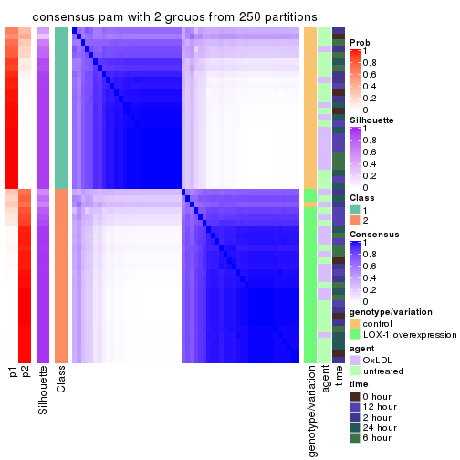</p>

</div>
<div id='tab-SD-pam-consensus-heatmap-2'>
<pre><code class="r">consensus_heatmap(res, k = 3)
</code></pre>

<p>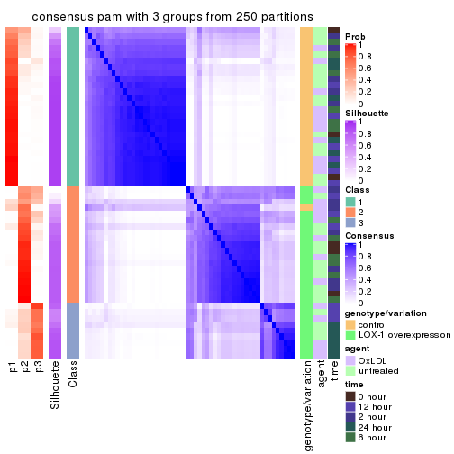</p>

</div>
<div id='tab-SD-pam-consensus-heatmap-3'>
<pre><code class="r">consensus_heatmap(res, k = 4)
</code></pre>

<p>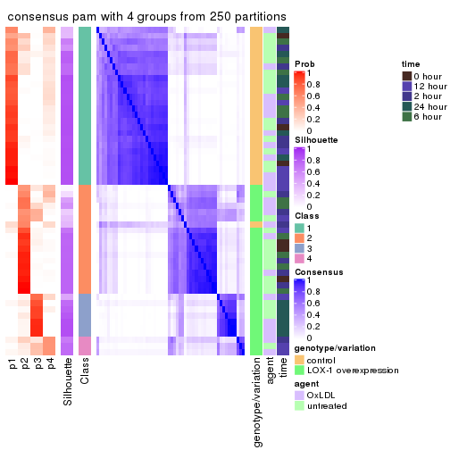</p>

</div>
<div id='tab-SD-pam-consensus-heatmap-4'>
<pre><code class="r">consensus_heatmap(res, k = 5)
</code></pre>

<p>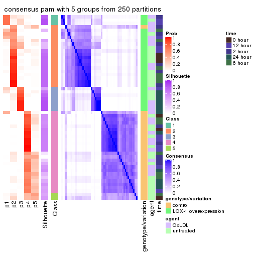</p>

</div>
<div id='tab-SD-pam-consensus-heatmap-5'>
<pre><code class="r">consensus_heatmap(res, k = 6)
</code></pre>

<p>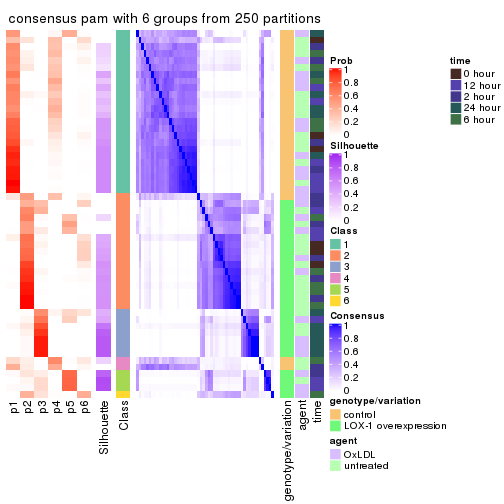</p>

</div>
</div>

Heatmaps for the membership of samples in all partitions to see how consistent they are:


<script>
$( function() {
	$( '#tabs-SD-pam-membership-heatmap' ).tabs();
} );
</script>
<div id='tabs-SD-pam-membership-heatmap'>
<ul>
<li><a href='#tab-SD-pam-membership-heatmap-1'>k = 2</a></li>
<li><a href='#tab-SD-pam-membership-heatmap-2'>k = 3</a></li>
<li><a href='#tab-SD-pam-membership-heatmap-3'>k = 4</a></li>
<li><a href='#tab-SD-pam-membership-heatmap-4'>k = 5</a></li>
<li><a href='#tab-SD-pam-membership-heatmap-5'>k = 6</a></li>
</ul>
<div id='tab-SD-pam-membership-heatmap-1'>
<pre><code class="r">membership_heatmap(res, k = 2)
</code></pre>

<p>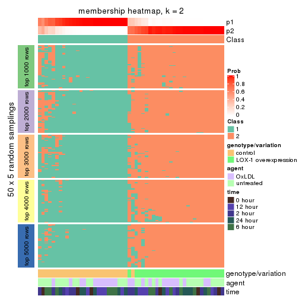</p>

</div>
<div id='tab-SD-pam-membership-heatmap-2'>
<pre><code class="r">membership_heatmap(res, k = 3)
</code></pre>

<p>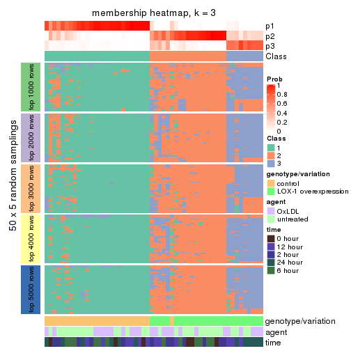</p>

</div>
<div id='tab-SD-pam-membership-heatmap-3'>
<pre><code class="r">membership_heatmap(res, k = 4)
</code></pre>

<p>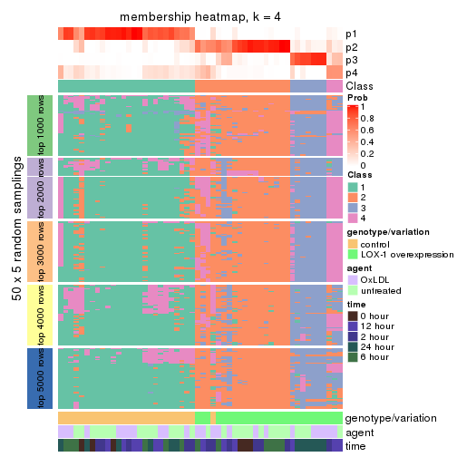</p>

</div>
<div id='tab-SD-pam-membership-heatmap-4'>
<pre><code class="r">membership_heatmap(res, k = 5)
</code></pre>

<p>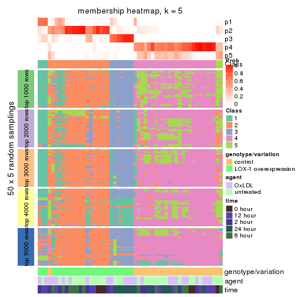</p>

</div>
<div id='tab-SD-pam-membership-heatmap-5'>
<pre><code class="r">membership_heatmap(res, k = 6)
</code></pre>

<p>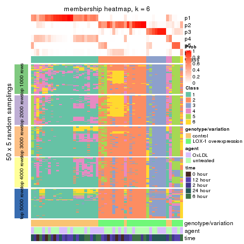</p>

</div>
</div>

As soon as we have had the classes for columns, we can look for signatures
which are significantly different between classes which can be candidate marks
for certain classes. Following are the heatmaps for signatures.


Signature heatmaps where rows are scaled:


<script>
$( function() {
	$( '#tabs-SD-pam-get-signatures' ).tabs();
} );
</script>
<div id='tabs-SD-pam-get-signatures'>
<ul>
<li><a href='#tab-SD-pam-get-signatures-1'>k = 2</a></li>
<li><a href='#tab-SD-pam-get-signatures-2'>k = 3</a></li>
<li><a href='#tab-SD-pam-get-signatures-3'>k = 4</a></li>
<li><a href='#tab-SD-pam-get-signatures-4'>k = 5</a></li>
<li><a href='#tab-SD-pam-get-signatures-5'>k = 6</a></li>
</ul>
<div id='tab-SD-pam-get-signatures-1'>
<pre><code class="r">get_signatures(res, k = 2)
</code></pre>

<p>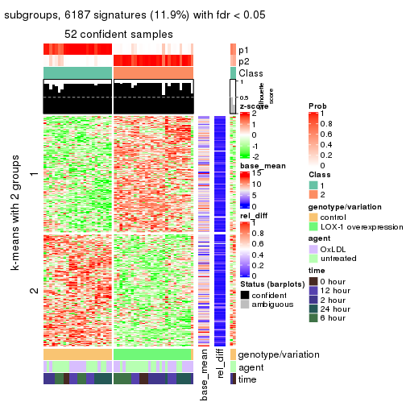</p>

</div>
<div id='tab-SD-pam-get-signatures-2'>
<pre><code class="r">get_signatures(res, k = 3)
</code></pre>

<p>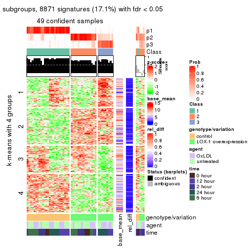</p>

</div>
<div id='tab-SD-pam-get-signatures-3'>
<pre><code class="r">get_signatures(res, k = 4)
</code></pre>

<p>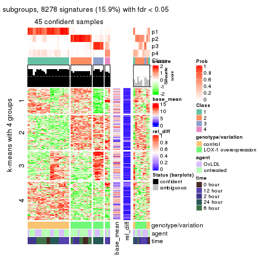</p>

</div>
<div id='tab-SD-pam-get-signatures-4'>
<pre><code class="r">get_signatures(res, k = 5)
</code></pre>

<p>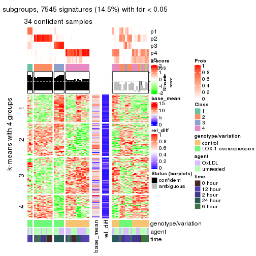</p>

</div>
<div id='tab-SD-pam-get-signatures-5'>
<pre><code class="r">get_signatures(res, k = 6)
</code></pre>

<p>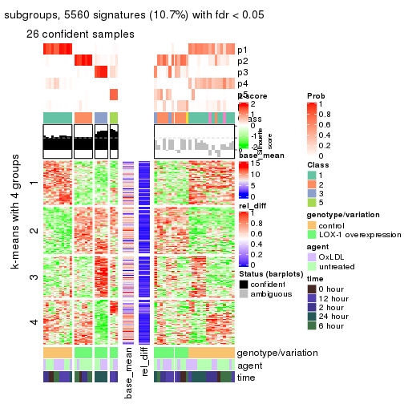</p>

</div>
</div>


Signature heatmaps where rows are not scaled:


<script>
$( function() {
	$( '#tabs-SD-pam-get-signatures-no-scale' ).tabs();
} );
</script>
<div id='tabs-SD-pam-get-signatures-no-scale'>
<ul>
<li><a href='#tab-SD-pam-get-signatures-no-scale-1'>k = 2</a></li>
<li><a href='#tab-SD-pam-get-signatures-no-scale-2'>k = 3</a></li>
<li><a href='#tab-SD-pam-get-signatures-no-scale-3'>k = 4</a></li>
<li><a href='#tab-SD-pam-get-signatures-no-scale-4'>k = 5</a></li>
<li><a href='#tab-SD-pam-get-signatures-no-scale-5'>k = 6</a></li>
</ul>
<div id='tab-SD-pam-get-signatures-no-scale-1'>
<pre><code class="r">get_signatures(res, k = 2, scale_rows = FALSE)
</code></pre>

<p>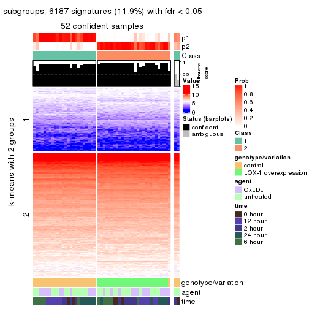</p>

</div>
<div id='tab-SD-pam-get-signatures-no-scale-2'>
<pre><code class="r">get_signatures(res, k = 3, scale_rows = FALSE)
</code></pre>

<p>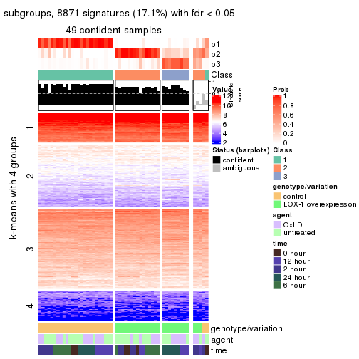</p>

</div>
<div id='tab-SD-pam-get-signatures-no-scale-3'>
<pre><code class="r">get_signatures(res, k = 4, scale_rows = FALSE)
</code></pre>

<p>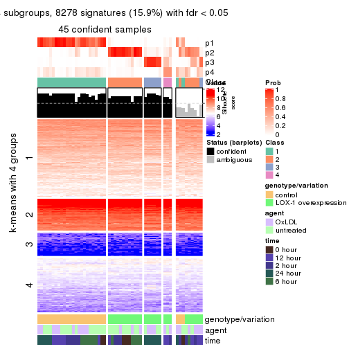</p>

</div>
<div id='tab-SD-pam-get-signatures-no-scale-4'>
<pre><code class="r">get_signatures(res, k = 5, scale_rows = FALSE)
</code></pre>

<p>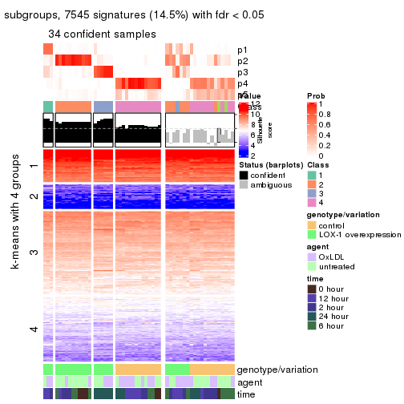</p>

</div>
<div id='tab-SD-pam-get-signatures-no-scale-5'>
<pre><code class="r">get_signatures(res, k = 6, scale_rows = FALSE)
</code></pre>

<p>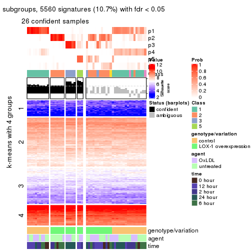</p>

</div>
</div>


Compare the overlap of signatures from different k:

```r
compare_signatures(res)
```

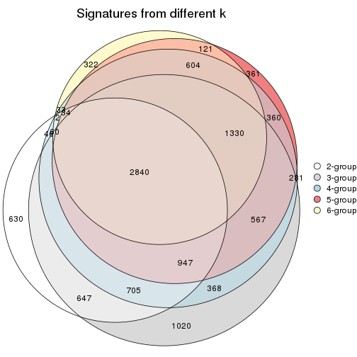

`get_signature()` returns a data frame invisibly. TO get the list of signatures, the function
call should be assigned to a variable explicitly. In following code, if `plot` argument is set
to `FALSE`, no heatmap is plotted while only the differential analysis is performed.

```r
# code only for demonstration
tb = get_signature(res, k = ..., plot = FALSE)
```

An example of the output of `tb` is:

```
#>   which_row         fdr    mean_1    mean_2 scaled_mean_1 scaled_mean_2 km
#> 1        38 0.042760348  8.373488  9.131774    -0.5533452     0.5164555  1
#> 2        40 0.018707592  7.106213  8.469186    -0.6173731     0.5762149  1
#> 3        55 0.019134737 10.221463 11.207825    -0.6159697     0.5749050  1
#> 4        59 0.006059896  5.921854  7.869574    -0.6899429     0.6439467  1
#> 5        60 0.018055526  8.928898 10.211722    -0.6204761     0.5791110  1
#> 6        98 0.009384629 15.714769 14.887706     0.6635654    -0.6193277  2
...
```

The columns in `tb` are:

1. `which_row`: row indices corresponding to the input matrix.
2. `fdr`: FDR for the differential test. 
3. `mean_x`: The mean value in group x.
4. `scaled_mean_x`: The mean value in group x after rows are scaled.
5. `km`: Row groups if k-means clustering is applied to rows.


UMAP plot which shows how samples are separated.


<script>
$( function() {
	$( '#tabs-SD-pam-dimension-reduction' ).tabs();
} );
</script>
<div id='tabs-SD-pam-dimension-reduction'>
<ul>
<li><a href='#tab-SD-pam-dimension-reduction-1'>k = 2</a></li>
<li><a href='#tab-SD-pam-dimension-reduction-2'>k = 3</a></li>
<li><a href='#tab-SD-pam-dimension-reduction-3'>k = 4</a></li>
<li><a href='#tab-SD-pam-dimension-reduction-4'>k = 5</a></li>
<li><a href='#tab-SD-pam-dimension-reduction-5'>k = 6</a></li>
</ul>
<div id='tab-SD-pam-dimension-reduction-1'>
<pre><code class="r">dimension_reduction(res, k = 2, method = &quot;UMAP&quot;)
</code></pre>

<p>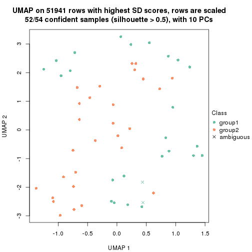</p>

</div>
<div id='tab-SD-pam-dimension-reduction-2'>
<pre><code class="r">dimension_reduction(res, k = 3, method = &quot;UMAP&quot;)
</code></pre>

<p>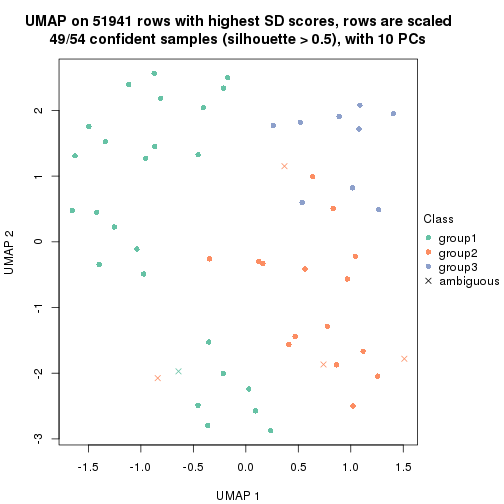</p>

</div>
<div id='tab-SD-pam-dimension-reduction-3'>
<pre><code class="r">dimension_reduction(res, k = 4, method = &quot;UMAP&quot;)
</code></pre>

<p>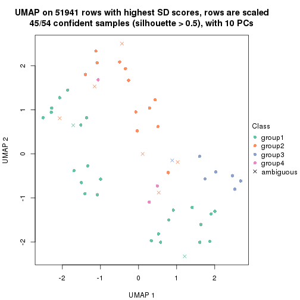</p>

</div>
<div id='tab-SD-pam-dimension-reduction-4'>
<pre><code class="r">dimension_reduction(res, k = 5, method = &quot;UMAP&quot;)
</code></pre>

<p>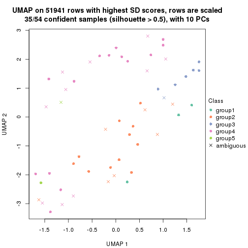</p>

</div>
<div id='tab-SD-pam-dimension-reduction-5'>
<pre><code class="r">dimension_reduction(res, k = 6, method = &quot;UMAP&quot;)
</code></pre>

<p>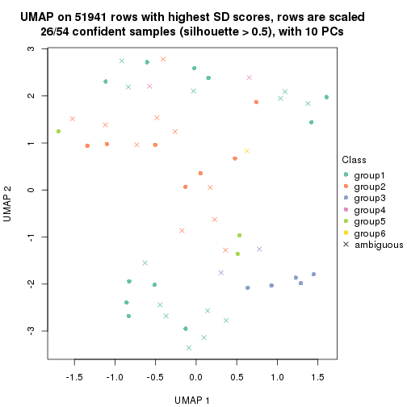</p>

</div>
</div>


Following heatmap shows how subgroups are split when increasing `k`:

```r
collect_classes(res)
```

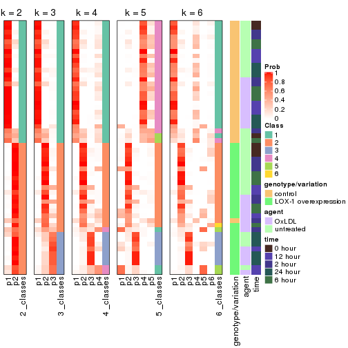


Test correlation between subgroups and known annotations. If the known
annotation is numeric, one-way ANOVA test is applied, and if the known
annotation is discrete, chi-squared contingency table test is applied.

```r
test_to_known_factors(res)
```

```
#>         n genotype/variation(p) agent(p) time(p) k
#> SD:pam 52              2.74e-11    1.000 0.94950 2
#> SD:pam 49              2.29e-11    0.559 0.01174 3
#> SD:pam 45              9.25e-10    0.514 0.00142 4
#> SD:pam 35              4.65e-07    0.242 0.00320 5
#> SD:pam 26              9.54e-06    0.254 0.00226 6
```


If matrix rows can be associated to genes, consider to use `functional_enrichment(res,
...)` to perform function enrichment for the signature genes. See [this vignette](http://bioconductor.org/packages/devel/bioc/vignettes/cola/inst/doc/functional_enrichment.html) for more detailed explanations.


 

---------------------------------------------------


### SD:mclust**


The object with results only for a single top-value method and a single partition method 
can be extracted as:

```r
res = res_list["SD", "mclust"]
# you can also extract it by
# res = res_list["SD:mclust"]
```

A summary of `res` and all the functions that can be applied to it:

```r
res
```

```
#> A 'ConsensusPartition' object with k = 2, 3, 4, 5, 6.
#>   On a matrix with 51941 rows and 54 columns.
#>   Top rows (1000, 2000, 3000, 4000, 5000) are extracted by 'SD' method.
#>   Subgroups are detected by 'mclust' method.
#>   Performed in total 1250 partitions by row resampling.
#>   Best k for subgroups seems to be 2.
#> 
#> Following methods can be applied to this 'ConsensusPartition' object:
#>  [1] "cola_report"             "collect_classes"         "collect_plots"          
#>  [4] "collect_stats"           "colnames"                "compare_signatures"     
#>  [7] "consensus_heatmap"       "dimension_reduction"     "functional_enrichment"  
#> [10] "get_anno_col"            "get_anno"                "get_classes"            
#> [13] "get_consensus"           "get_matrix"              "get_membership"         
#> [16] "get_param"               "get_signatures"          "get_stats"              
#> [19] "is_best_k"               "is_stable_k"             "membership_heatmap"     
#> [22] "ncol"                    "nrow"                    "plot_ecdf"              
#> [25] "rownames"                "select_partition_number" "show"                   
#> [28] "suggest_best_k"          "test_to_known_factors"
```

`collect_plots()` function collects all the plots made from `res` for all `k` (number of partitions)
into one single page to provide an easy and fast comparison between different `k`.

```r
collect_plots(res)
```

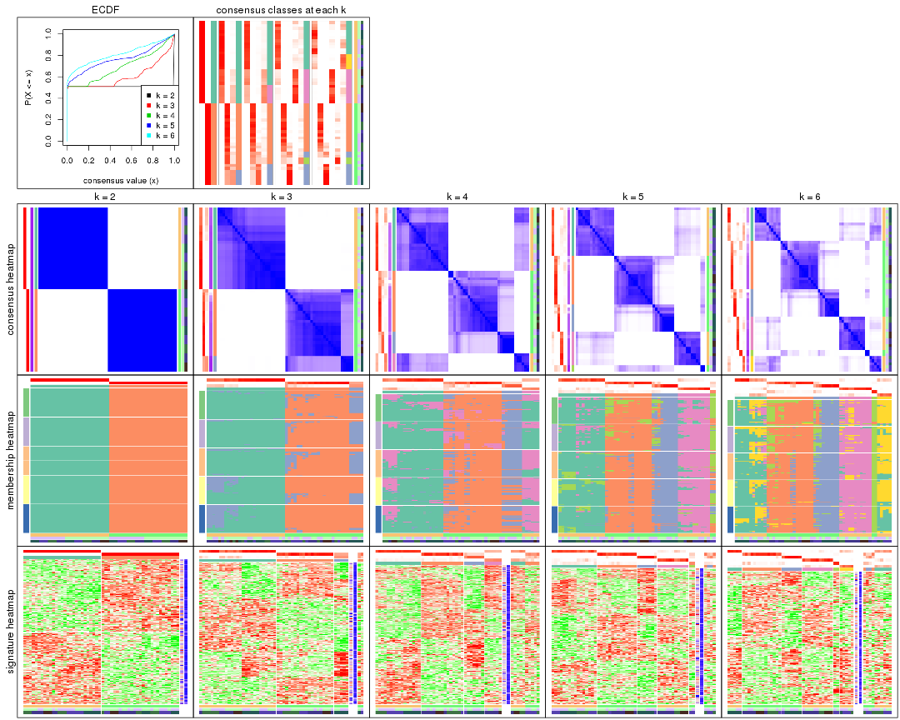

The plots are:

- The first row: a plot of the ECDF (empirical cumulative distribution
  function) curves of the consensus matrix for each `k` and the heatmap of
  predicted classes for each `k`.
- The second row: heatmaps of the consensus matrix for each `k`.
- The third row: heatmaps of the membership matrix for each `k`.
- The fouth row: heatmaps of the signatures for each `k`.

All the plots in panels can be made by individual functions and they are
plotted later in this section.

`select_partition_number()` produces several plots showing different
statistics for choosing "optimized" `k`. There are following statistics:

- ECDF curves of the consensus matrix for each `k`;
- 1-PAC. [The PAC
  score](https://en.wikipedia.org/wiki/Consensus_clustering#Over-interpretation_potential_of_consensus_clustering)
  measures the proportion of the ambiguous subgrouping.
- Mean silhouette score.
- Concordance. The mean probability of fiting the consensus class ids in all
  partitions.
- Area increased. Denote $A_k$ as the area under the ECDF curve for current
  `k`, the area increased is defined as $A_k - A_{k-1}$.
- Rand index. The percent of pairs of samples that are both in a same cluster
  or both are not in a same cluster in the partition of k and k-1.
- Jaccard index. The ratio of pairs of samples are both in a same cluster in
  the partition of k and k-1 and the pairs of samples are both in a same
  cluster in the partition k or k-1.

The detailed explanations of these statistics can be found in [the _cola_
vignette](http://bioconductor.org/packages/devel/bioc/vignettes/cola/inst/doc/cola.html#toc_13).

Generally speaking, lower PAC score, higher mean silhouette score or higher
concordance corresponds to better partition. Rand index and Jaccard index
measure how similar the current partition is compared to partition with `k-1`.
If they are too similar, we won't accept `k` is better than `k-1`.

```r
select_partition_number(res)
```

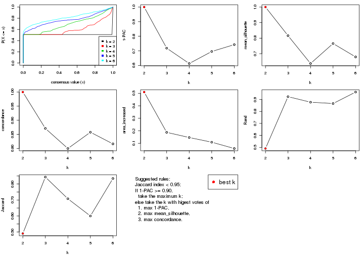

The numeric values for all these statistics can be obtained by `get_stats()`.

```r
get_stats(res)
```

```
#>   k 1-PAC mean_silhouette concordance area_increased  Rand Jaccard
#> 2 2 1.000           1.000       1.000         0.5099 0.491   0.491
#> 3 3 0.718           0.816       0.871         0.1875 0.923   0.843
#> 4 4 0.613           0.637       0.800         0.1462 0.877   0.708
#> 5 5 0.696           0.765       0.858         0.1088 0.866   0.600
#> 6 6 0.743           0.679       0.816         0.0583 0.962   0.834
```

`suggest_best_k()` suggests the best $k$ based on these statistics. The rules are as follows:

- All $k$ with Jaccard index larger than 0.95 are removed because increasing
  $k$ does not provide enough extra information. If all $k$ are removed, it is
  marked as no subgroup is detected.
- For all $k$ with 1-PAC score larger than 0.9, the maximal $k$ is taken as
  the best $k$, and other $k$ are marked as optional $k$.
- If it does not fit the second rule. The $k$ with the maximal vote of the
  highest 1-PAC score, highest mean silhouette, and highest concordance is
  taken as the best $k$.

```r
suggest_best_k(res)
```

```
#> [1] 2
```


Following shows the table of the partitions (You need to click the **show/hide
code output** link to see it). The membership matrix (columns with name `p*`)
is inferred by
[`clue::cl_consensus()`](https://www.rdocumentation.org/link/cl_consensus?package=clue)
function with the `SE` method. Basically the value in the membership matrix
represents the probability to belong to a certain group. The finall class
label for an item is determined with the group with highest probability it
belongs to.

In `get_classes()` function, the entropy is calculated from the membership
matrix and the silhouette score is calculated from the consensus matrix.


<script>
$( function() {
	$( '#tabs-SD-mclust-get-classes' ).tabs();
} );
</script>
<div id='tabs-SD-mclust-get-classes'>
<ul>
<li><a href='#tab-SD-mclust-get-classes-1'>k = 2</a></li>
<li><a href='#tab-SD-mclust-get-classes-2'>k = 3</a></li>
<li><a href='#tab-SD-mclust-get-classes-3'>k = 4</a></li>
<li><a href='#tab-SD-mclust-get-classes-4'>k = 5</a></li>
<li><a href='#tab-SD-mclust-get-classes-5'>k = 6</a></li>
</ul>

<div id='tab-SD-mclust-get-classes-1'>
<p><a id='tab-SD-mclust-get-classes-1-a' style='color:#0366d6' href='#'>show/hide code output</a></p>
<pre><code class="r">cbind(get_classes(res, k = 2), get_membership(res, k = 2))
</code></pre>

<pre><code>#&gt;           class entropy silhouette p1 p2
#&gt; GSM329068     2       0          1  0  1
#&gt; GSM329074     2       0          1  0  1
#&gt; GSM329100     2       0          1  0  1
#&gt; GSM329062     2       0          1  0  1
#&gt; GSM329079     2       0          1  0  1
#&gt; GSM329090     2       0          1  0  1
#&gt; GSM329066     2       0          1  0  1
#&gt; GSM329086     2       0          1  0  1
#&gt; GSM329099     2       0          1  0  1
#&gt; GSM329071     2       0          1  0  1
#&gt; GSM329078     2       0          1  0  1
#&gt; GSM329081     2       0          1  0  1
#&gt; GSM329096     2       0          1  0  1
#&gt; GSM329102     2       0          1  0  1
#&gt; GSM329104     2       0          1  0  1
#&gt; GSM329067     2       0          1  0  1
#&gt; GSM329072     2       0          1  0  1
#&gt; GSM329075     2       0          1  0  1
#&gt; GSM329058     2       0          1  0  1
#&gt; GSM329073     2       0          1  0  1
#&gt; GSM329107     2       0          1  0  1
#&gt; GSM329057     2       0          1  0  1
#&gt; GSM329085     2       0          1  0  1
#&gt; GSM329089     2       0          1  0  1
#&gt; GSM329076     2       0          1  0  1
#&gt; GSM329094     2       0          1  0  1
#&gt; GSM329105     2       0          1  0  1
#&gt; GSM329056     1       0          1  1  0
#&gt; GSM329069     1       0          1  1  0
#&gt; GSM329077     1       0          1  1  0
#&gt; GSM329070     1       0          1  1  0
#&gt; GSM329082     1       0          1  1  0
#&gt; GSM329092     1       0          1  1  0
#&gt; GSM329083     1       0          1  1  0
#&gt; GSM329101     1       0          1  1  0
#&gt; GSM329106     1       0          1  1  0
#&gt; GSM329087     1       0          1  1  0
#&gt; GSM329091     1       0          1  1  0
#&gt; GSM329093     1       0          1  1  0
#&gt; GSM329080     1       0          1  1  0
#&gt; GSM329084     1       0          1  1  0
#&gt; GSM329088     1       0          1  1  0
#&gt; GSM329059     1       0          1  1  0
#&gt; GSM329097     1       0          1  1  0
#&gt; GSM329098     1       0          1  1  0
#&gt; GSM329055     1       0          1  1  0
#&gt; GSM329103     1       0          1  1  0
#&gt; GSM329108     1       0          1  1  0
#&gt; GSM329061     1       0          1  1  0
#&gt; GSM329064     1       0          1  1  0
#&gt; GSM329065     1       0          1  1  0
#&gt; GSM329060     1       0          1  1  0
#&gt; GSM329063     1       0          1  1  0
#&gt; GSM329095     1       0          1  1  0
</code></pre>

<script>
$('#tab-SD-mclust-get-classes-1-a').parent().next().next().hide();
$('#tab-SD-mclust-get-classes-1-a').click(function(){
  $('#tab-SD-mclust-get-classes-1-a').parent().next().next().toggle();
  return(false);
});
</script>
</div>

<div id='tab-SD-mclust-get-classes-2'>
<p><a id='tab-SD-mclust-get-classes-2-a' style='color:#0366d6' href='#'>show/hide code output</a></p>
<pre><code class="r">cbind(get_classes(res, k = 3), get_membership(res, k = 3))
</code></pre>

<pre><code>#&gt;           class entropy silhouette    p1    p2    p3
#&gt; GSM329068     2  0.0592      0.846 0.000 0.988 0.012
#&gt; GSM329074     2  0.0892      0.845 0.000 0.980 0.020
#&gt; GSM329100     2  0.0747      0.844 0.000 0.984 0.016
#&gt; GSM329062     2  0.1031      0.844 0.000 0.976 0.024
#&gt; GSM329079     2  0.0000      0.846 0.000 1.000 0.000
#&gt; GSM329090     2  0.2165      0.819 0.000 0.936 0.064
#&gt; GSM329066     2  0.0424      0.846 0.000 0.992 0.008
#&gt; GSM329086     2  0.0892      0.843 0.000 0.980 0.020
#&gt; GSM329099     2  0.0237      0.846 0.000 0.996 0.004
#&gt; GSM329071     2  0.4452      0.564 0.000 0.808 0.192
#&gt; GSM329078     2  0.3340      0.767 0.000 0.880 0.120
#&gt; GSM329081     2  0.0592      0.846 0.000 0.988 0.012
#&gt; GSM329096     3  0.6274      0.991 0.000 0.456 0.544
#&gt; GSM329102     3  0.6291      0.976 0.000 0.468 0.532
#&gt; GSM329104     2  0.6308     -0.889 0.000 0.508 0.492
#&gt; GSM329067     2  0.0592      0.846 0.000 0.988 0.012
#&gt; GSM329072     2  0.1860      0.827 0.000 0.948 0.052
#&gt; GSM329075     2  0.0747      0.844 0.000 0.984 0.016
#&gt; GSM329058     2  0.2261      0.811 0.000 0.932 0.068
#&gt; GSM329073     2  0.4452      0.514 0.000 0.808 0.192
#&gt; GSM329107     2  0.1529      0.831 0.000 0.960 0.040
#&gt; GSM329057     2  0.5363      0.172 0.000 0.724 0.276
#&gt; GSM329085     2  0.3267      0.769 0.000 0.884 0.116
#&gt; GSM329089     2  0.3267      0.747 0.000 0.884 0.116
#&gt; GSM329076     3  0.6280      0.988 0.000 0.460 0.540
#&gt; GSM329094     3  0.6274      0.991 0.000 0.456 0.544
#&gt; GSM329105     3  0.6274      0.991 0.000 0.456 0.544
#&gt; GSM329056     1  0.4291      0.875 0.820 0.000 0.180
#&gt; GSM329069     1  0.4178      0.878 0.828 0.000 0.172
#&gt; GSM329077     1  0.5760      0.792 0.672 0.000 0.328
#&gt; GSM329070     1  0.3551      0.893 0.868 0.000 0.132
#&gt; GSM329082     1  0.5529      0.813 0.704 0.000 0.296
#&gt; GSM329092     1  0.5497      0.818 0.708 0.000 0.292
#&gt; GSM329083     1  0.3752      0.888 0.856 0.000 0.144
#&gt; GSM329101     1  0.1289      0.914 0.968 0.000 0.032
#&gt; GSM329106     1  0.2878      0.901 0.904 0.000 0.096
#&gt; GSM329087     1  0.0892      0.917 0.980 0.000 0.020
#&gt; GSM329091     1  0.1031      0.911 0.976 0.000 0.024
#&gt; GSM329093     1  0.0424      0.915 0.992 0.000 0.008
#&gt; GSM329080     1  0.0424      0.915 0.992 0.000 0.008
#&gt; GSM329084     1  0.1031      0.916 0.976 0.000 0.024
#&gt; GSM329088     1  0.0237      0.916 0.996 0.000 0.004
#&gt; GSM329059     1  0.5497      0.816 0.708 0.000 0.292
#&gt; GSM329097     1  0.5706      0.797 0.680 0.000 0.320
#&gt; GSM329098     1  0.5760      0.791 0.672 0.000 0.328
#&gt; GSM329055     1  0.0237      0.915 0.996 0.000 0.004
#&gt; GSM329103     1  0.0424      0.915 0.992 0.000 0.008
#&gt; GSM329108     1  0.0237      0.916 0.996 0.000 0.004
#&gt; GSM329061     1  0.0424      0.915 0.992 0.000 0.008
#&gt; GSM329064     1  0.0237      0.915 0.996 0.000 0.004
#&gt; GSM329065     1  0.0424      0.915 0.992 0.000 0.008
#&gt; GSM329060     1  0.0424      0.915 0.992 0.000 0.008
#&gt; GSM329063     1  0.1031      0.910 0.976 0.000 0.024
#&gt; GSM329095     1  0.0747      0.916 0.984 0.000 0.016
</code></pre>

<script>
$('#tab-SD-mclust-get-classes-2-a').parent().next().next().hide();
$('#tab-SD-mclust-get-classes-2-a').click(function(){
  $('#tab-SD-mclust-get-classes-2-a').parent().next().next().toggle();
  return(false);
});
</script>
</div>

<div id='tab-SD-mclust-get-classes-3'>
<p><a id='tab-SD-mclust-get-classes-3-a' style='color:#0366d6' href='#'>show/hide code output</a></p>
<pre><code class="r">cbind(get_classes(res, k = 4), get_membership(res, k = 4))
</code></pre>

<pre><code>#&gt;           class entropy silhouette    p1    p2    p3    p4
#&gt; GSM329068     2  0.1474     0.7908 0.000 0.948 0.000 0.052
#&gt; GSM329074     2  0.1637     0.7876 0.000 0.940 0.000 0.060
#&gt; GSM329100     2  0.1716     0.7863 0.000 0.936 0.000 0.064
#&gt; GSM329062     2  0.1109     0.7918 0.000 0.968 0.004 0.028
#&gt; GSM329079     2  0.0895     0.7935 0.000 0.976 0.004 0.020
#&gt; GSM329090     2  0.3554     0.7352 0.000 0.844 0.020 0.136
#&gt; GSM329066     2  0.1174     0.7961 0.000 0.968 0.012 0.020
#&gt; GSM329086     2  0.0469     0.7945 0.000 0.988 0.012 0.000
#&gt; GSM329099     2  0.1576     0.7912 0.000 0.948 0.004 0.048
#&gt; GSM329071     2  0.5663    -0.1596 0.000 0.536 0.440 0.024
#&gt; GSM329078     2  0.7310     0.3578 0.000 0.532 0.256 0.212
#&gt; GSM329081     2  0.1978     0.7805 0.000 0.928 0.068 0.004
#&gt; GSM329096     3  0.3610     0.9437 0.000 0.200 0.800 0.000
#&gt; GSM329102     3  0.3610     0.9437 0.000 0.200 0.800 0.000
#&gt; GSM329104     3  0.3873     0.9207 0.000 0.228 0.772 0.000
#&gt; GSM329067     2  0.0921     0.7946 0.000 0.972 0.000 0.028
#&gt; GSM329072     2  0.4017     0.7259 0.000 0.828 0.044 0.128
#&gt; GSM329075     2  0.1716     0.7863 0.000 0.936 0.000 0.064
#&gt; GSM329058     2  0.4312     0.7015 0.000 0.812 0.132 0.056
#&gt; GSM329073     2  0.5565     0.4501 0.000 0.684 0.260 0.056
#&gt; GSM329107     2  0.4236     0.7156 0.000 0.824 0.088 0.088
#&gt; GSM329057     3  0.5835     0.6128 0.000 0.372 0.588 0.040
#&gt; GSM329085     2  0.7289     0.3658 0.000 0.536 0.252 0.212
#&gt; GSM329089     2  0.6160     0.3303 0.000 0.612 0.316 0.072
#&gt; GSM329076     3  0.3610     0.9437 0.000 0.200 0.800 0.000
#&gt; GSM329094     3  0.3610     0.9437 0.000 0.200 0.800 0.000
#&gt; GSM329105     3  0.3610     0.9437 0.000 0.200 0.800 0.000
#&gt; GSM329056     1  0.5602    -0.5969 0.508 0.000 0.020 0.472
#&gt; GSM329069     1  0.5597    -0.5808 0.516 0.000 0.020 0.464
#&gt; GSM329077     4  0.4889     0.9062 0.360 0.000 0.004 0.636
#&gt; GSM329070     1  0.5372    -0.5102 0.544 0.000 0.012 0.444
#&gt; GSM329082     4  0.5613     0.9007 0.380 0.000 0.028 0.592
#&gt; GSM329092     4  0.5638     0.8969 0.388 0.000 0.028 0.584
#&gt; GSM329083     1  0.5174    -0.1965 0.620 0.000 0.012 0.368
#&gt; GSM329101     1  0.3052     0.6344 0.860 0.000 0.004 0.136
#&gt; GSM329106     1  0.5026     0.0875 0.672 0.000 0.016 0.312
#&gt; GSM329087     1  0.1677     0.7465 0.948 0.000 0.012 0.040
#&gt; GSM329091     1  0.2675     0.7201 0.908 0.000 0.044 0.048
#&gt; GSM329093     1  0.2402     0.7266 0.912 0.000 0.012 0.076
#&gt; GSM329080     1  0.1661     0.7310 0.944 0.000 0.004 0.052
#&gt; GSM329084     1  0.1890     0.7281 0.936 0.000 0.008 0.056
#&gt; GSM329088     1  0.1722     0.7300 0.944 0.000 0.008 0.048
#&gt; GSM329059     4  0.5050     0.8827 0.408 0.000 0.004 0.588
#&gt; GSM329097     4  0.4761     0.9197 0.372 0.000 0.000 0.628
#&gt; GSM329098     4  0.4872     0.9058 0.356 0.000 0.004 0.640
#&gt; GSM329055     1  0.1743     0.7322 0.940 0.000 0.004 0.056
#&gt; GSM329103     1  0.2610     0.7137 0.900 0.000 0.012 0.088
#&gt; GSM329108     1  0.1209     0.7432 0.964 0.000 0.004 0.032
#&gt; GSM329061     1  0.2142     0.7358 0.928 0.000 0.016 0.056
#&gt; GSM329064     1  0.1488     0.7464 0.956 0.000 0.012 0.032
#&gt; GSM329065     1  0.2060     0.7371 0.932 0.000 0.016 0.052
#&gt; GSM329060     1  0.2060     0.7255 0.932 0.000 0.016 0.052
#&gt; GSM329063     1  0.2483     0.7168 0.916 0.000 0.032 0.052
#&gt; GSM329095     1  0.1854     0.7382 0.940 0.000 0.012 0.048
</code></pre>

<script>
$('#tab-SD-mclust-get-classes-3-a').parent().next().next().hide();
$('#tab-SD-mclust-get-classes-3-a').click(function(){
  $('#tab-SD-mclust-get-classes-3-a').parent().next().next().toggle();
  return(false);
});
</script>
</div>

<div id='tab-SD-mclust-get-classes-4'>
<p><a id='tab-SD-mclust-get-classes-4-a' style='color:#0366d6' href='#'>show/hide code output</a></p>
<pre><code class="r">cbind(get_classes(res, k = 5), get_membership(res, k = 5))
</code></pre>

<pre><code>#&gt;           class entropy silhouette    p1    p2    p3    p4    p5
#&gt; GSM329068     2  0.0880      0.829 0.000 0.968 0.000 0.000 0.032
#&gt; GSM329074     2  0.1043      0.826 0.000 0.960 0.000 0.000 0.040
#&gt; GSM329100     2  0.1197      0.821 0.000 0.952 0.000 0.000 0.048
#&gt; GSM329062     2  0.1484      0.827 0.000 0.944 0.008 0.000 0.048
#&gt; GSM329079     2  0.1628      0.823 0.000 0.936 0.008 0.000 0.056
#&gt; GSM329090     2  0.3318      0.688 0.000 0.808 0.012 0.000 0.180
#&gt; GSM329066     2  0.1211      0.834 0.000 0.960 0.016 0.000 0.024
#&gt; GSM329086     2  0.1251      0.834 0.000 0.956 0.008 0.000 0.036
#&gt; GSM329099     2  0.0451      0.836 0.000 0.988 0.004 0.000 0.008
#&gt; GSM329071     3  0.5467      0.295 0.000 0.276 0.624 0.000 0.100
#&gt; GSM329078     5  0.5770      1.000 0.000 0.256 0.140 0.000 0.604
#&gt; GSM329081     2  0.2645      0.794 0.000 0.888 0.044 0.000 0.068
#&gt; GSM329096     3  0.0404      0.793 0.000 0.012 0.988 0.000 0.000
#&gt; GSM329102     3  0.0290      0.794 0.000 0.008 0.992 0.000 0.000
#&gt; GSM329104     3  0.1522      0.771 0.000 0.044 0.944 0.000 0.012
#&gt; GSM329067     2  0.0771      0.837 0.000 0.976 0.004 0.000 0.020
#&gt; GSM329072     2  0.3562      0.666 0.000 0.788 0.016 0.000 0.196
#&gt; GSM329075     2  0.1197      0.821 0.000 0.952 0.000 0.000 0.048
#&gt; GSM329058     2  0.3048      0.654 0.000 0.820 0.176 0.000 0.004
#&gt; GSM329073     2  0.4084      0.342 0.000 0.668 0.328 0.000 0.004
#&gt; GSM329107     2  0.5162      0.414 0.000 0.692 0.148 0.000 0.160
#&gt; GSM329057     3  0.4269      0.614 0.000 0.108 0.776 0.000 0.116
#&gt; GSM329085     5  0.5770      1.000 0.000 0.256 0.140 0.000 0.604
#&gt; GSM329089     3  0.6275     -0.219 0.000 0.364 0.480 0.000 0.156
#&gt; GSM329076     3  0.0290      0.794 0.000 0.008 0.992 0.000 0.000
#&gt; GSM329094     3  0.0290      0.794 0.000 0.008 0.992 0.000 0.000
#&gt; GSM329105     3  0.0290      0.794 0.000 0.008 0.992 0.000 0.000
#&gt; GSM329056     4  0.2464      0.873 0.096 0.000 0.000 0.888 0.016
#&gt; GSM329069     4  0.2824      0.866 0.116 0.000 0.000 0.864 0.020
#&gt; GSM329077     4  0.0693      0.855 0.008 0.000 0.000 0.980 0.012
#&gt; GSM329070     4  0.2864      0.863 0.136 0.000 0.000 0.852 0.012
#&gt; GSM329082     4  0.2664      0.870 0.092 0.000 0.004 0.884 0.020
#&gt; GSM329092     4  0.2720      0.869 0.096 0.000 0.004 0.880 0.020
#&gt; GSM329083     4  0.4114      0.753 0.244 0.000 0.000 0.732 0.024
#&gt; GSM329101     1  0.4716      0.522 0.656 0.000 0.000 0.308 0.036
#&gt; GSM329106     4  0.4697      0.600 0.320 0.000 0.000 0.648 0.032
#&gt; GSM329087     1  0.1605      0.856 0.944 0.000 0.004 0.040 0.012
#&gt; GSM329091     1  0.4786      0.780 0.720 0.000 0.000 0.092 0.188
#&gt; GSM329093     1  0.2952      0.840 0.872 0.000 0.004 0.088 0.036
#&gt; GSM329080     1  0.2127      0.833 0.892 0.000 0.000 0.000 0.108
#&gt; GSM329084     1  0.2583      0.826 0.864 0.000 0.000 0.004 0.132
#&gt; GSM329088     1  0.2629      0.824 0.860 0.000 0.000 0.004 0.136
#&gt; GSM329059     4  0.1430      0.880 0.052 0.000 0.000 0.944 0.004
#&gt; GSM329097     4  0.1270      0.880 0.052 0.000 0.000 0.948 0.000
#&gt; GSM329098     4  0.0693      0.855 0.008 0.000 0.000 0.980 0.012
#&gt; GSM329055     1  0.4119      0.774 0.780 0.000 0.000 0.152 0.068
#&gt; GSM329103     1  0.4897      0.754 0.728 0.000 0.004 0.156 0.112
#&gt; GSM329108     1  0.3215      0.831 0.852 0.000 0.000 0.092 0.056
#&gt; GSM329061     1  0.3577      0.835 0.836 0.000 0.004 0.076 0.084
#&gt; GSM329064     1  0.1901      0.855 0.928 0.000 0.004 0.056 0.012
#&gt; GSM329065     1  0.2529      0.852 0.900 0.000 0.004 0.040 0.056
#&gt; GSM329060     1  0.2338      0.831 0.884 0.000 0.004 0.000 0.112
#&gt; GSM329063     1  0.2674      0.826 0.856 0.000 0.000 0.004 0.140
#&gt; GSM329095     1  0.2238      0.852 0.912 0.000 0.004 0.020 0.064
</code></pre>

<script>
$('#tab-SD-mclust-get-classes-4-a').parent().next().next().hide();
$('#tab-SD-mclust-get-classes-4-a').click(function(){
  $('#tab-SD-mclust-get-classes-4-a').parent().next().next().toggle();
  return(false);
});
</script>
</div>

<div id='tab-SD-mclust-get-classes-5'>
<p><a id='tab-SD-mclust-get-classes-5-a' style='color:#0366d6' href='#'>show/hide code output</a></p>
<pre><code class="r">cbind(get_classes(res, k = 6), get_membership(res, k = 6))
</code></pre>

<pre><code>#&gt;           class entropy silhouette    p1    p2    p3    p4    p5    p6
#&gt; GSM329068     2  0.1049     0.8185 0.000 0.960 0.000 0.000 0.032 0.008
#&gt; GSM329074     2  0.1225     0.8162 0.000 0.952 0.000 0.000 0.036 0.012
#&gt; GSM329100     2  0.1297     0.8148 0.000 0.948 0.000 0.000 0.040 0.012
#&gt; GSM329062     2  0.1814     0.7951 0.000 0.900 0.000 0.000 0.100 0.000
#&gt; GSM329079     2  0.2070     0.7941 0.000 0.892 0.000 0.000 0.100 0.008
#&gt; GSM329090     2  0.3905     0.5506 0.000 0.668 0.000 0.000 0.316 0.016
#&gt; GSM329066     2  0.1461     0.8155 0.000 0.940 0.000 0.000 0.044 0.016
#&gt; GSM329086     2  0.0777     0.8226 0.000 0.972 0.000 0.000 0.024 0.004
#&gt; GSM329099     2  0.0363     0.8224 0.000 0.988 0.000 0.000 0.000 0.012
#&gt; GSM329071     3  0.5165     0.4880 0.000 0.228 0.616 0.000 0.156 0.000
#&gt; GSM329078     5  0.0937     1.0000 0.000 0.040 0.000 0.000 0.960 0.000
#&gt; GSM329081     2  0.3230     0.7653 0.000 0.836 0.024 0.000 0.116 0.024
#&gt; GSM329096     3  0.0622     0.8203 0.000 0.008 0.980 0.000 0.012 0.000
#&gt; GSM329102     3  0.0146     0.8186 0.000 0.000 0.996 0.000 0.000 0.004
#&gt; GSM329104     3  0.0837     0.8159 0.000 0.020 0.972 0.000 0.004 0.004
#&gt; GSM329067     2  0.0725     0.8225 0.000 0.976 0.000 0.000 0.012 0.012
#&gt; GSM329072     2  0.4078     0.5161 0.000 0.640 0.000 0.000 0.340 0.020
#&gt; GSM329075     2  0.1297     0.8148 0.000 0.948 0.000 0.000 0.040 0.012
#&gt; GSM329058     2  0.3836     0.6695 0.000 0.772 0.176 0.000 0.040 0.012
#&gt; GSM329073     2  0.4184     0.4927 0.000 0.672 0.296 0.000 0.028 0.004
#&gt; GSM329107     2  0.5372     0.2727 0.000 0.528 0.104 0.000 0.364 0.004
#&gt; GSM329057     3  0.3772     0.6743 0.000 0.068 0.772 0.000 0.160 0.000
#&gt; GSM329085     5  0.0937     1.0000 0.000 0.040 0.000 0.000 0.960 0.000
#&gt; GSM329089     3  0.6009     0.0191 0.000 0.244 0.412 0.000 0.344 0.000
#&gt; GSM329076     3  0.0146     0.8186 0.000 0.000 0.996 0.000 0.000 0.004
#&gt; GSM329094     3  0.0291     0.8213 0.000 0.004 0.992 0.000 0.004 0.000
#&gt; GSM329105     3  0.0291     0.8213 0.000 0.004 0.992 0.000 0.004 0.000
#&gt; GSM329056     4  0.1334     0.8748 0.020 0.000 0.000 0.948 0.000 0.032
#&gt; GSM329069     4  0.1492     0.8818 0.024 0.000 0.000 0.940 0.000 0.036
#&gt; GSM329077     4  0.0458     0.8722 0.000 0.000 0.000 0.984 0.000 0.016
#&gt; GSM329070     4  0.1633     0.8832 0.024 0.000 0.000 0.932 0.000 0.044
#&gt; GSM329082     4  0.3314     0.7549 0.004 0.000 0.000 0.740 0.000 0.256
#&gt; GSM329092     4  0.3518     0.7491 0.012 0.000 0.000 0.732 0.000 0.256
#&gt; GSM329083     4  0.2826     0.8238 0.092 0.000 0.000 0.856 0.000 0.052
#&gt; GSM329101     1  0.6047     0.2128 0.400 0.000 0.000 0.340 0.000 0.260
#&gt; GSM329106     4  0.4117     0.6959 0.140 0.000 0.000 0.748 0.000 0.112
#&gt; GSM329087     1  0.4833    -0.1389 0.516 0.000 0.000 0.056 0.000 0.428
#&gt; GSM329091     1  0.4687     0.4501 0.604 0.000 0.000 0.060 0.000 0.336
#&gt; GSM329093     6  0.3290     0.8219 0.252 0.000 0.000 0.004 0.000 0.744
#&gt; GSM329080     1  0.0777     0.5837 0.972 0.000 0.000 0.004 0.000 0.024
#&gt; GSM329084     1  0.0260     0.5780 0.992 0.000 0.000 0.000 0.000 0.008
#&gt; GSM329088     1  0.1434     0.5855 0.940 0.000 0.000 0.012 0.000 0.048
#&gt; GSM329059     4  0.2006     0.8580 0.004 0.000 0.000 0.892 0.000 0.104
#&gt; GSM329097     4  0.1333     0.8810 0.008 0.000 0.000 0.944 0.000 0.048
#&gt; GSM329098     4  0.0547     0.8743 0.000 0.000 0.000 0.980 0.000 0.020
#&gt; GSM329055     1  0.5411     0.3991 0.532 0.000 0.000 0.132 0.000 0.336
#&gt; GSM329103     6  0.3102     0.7099 0.156 0.000 0.000 0.028 0.000 0.816
#&gt; GSM329108     1  0.4948     0.2128 0.476 0.000 0.000 0.064 0.000 0.460
#&gt; GSM329061     6  0.2854     0.8068 0.208 0.000 0.000 0.000 0.000 0.792
#&gt; GSM329064     1  0.4388     0.1755 0.572 0.000 0.000 0.028 0.000 0.400
#&gt; GSM329065     6  0.3428     0.8023 0.304 0.000 0.000 0.000 0.000 0.696
#&gt; GSM329060     1  0.0632     0.5825 0.976 0.000 0.000 0.000 0.000 0.024
#&gt; GSM329063     1  0.1141     0.5846 0.948 0.000 0.000 0.000 0.000 0.052
#&gt; GSM329095     6  0.3747     0.6636 0.396 0.000 0.000 0.000 0.000 0.604
</code></pre>

<script>
$('#tab-SD-mclust-get-classes-5-a').parent().next().next().hide();
$('#tab-SD-mclust-get-classes-5-a').click(function(){
  $('#tab-SD-mclust-get-classes-5-a').parent().next().next().toggle();
  return(false);
});
</script>
</div>
</div>

Heatmaps for the consensus matrix. It visualizes the probability of two
samples to be in a same group.


<script>
$( function() {
	$( '#tabs-SD-mclust-consensus-heatmap' ).tabs();
} );
</script>
<div id='tabs-SD-mclust-consensus-heatmap'>
<ul>
<li><a href='#tab-SD-mclust-consensus-heatmap-1'>k = 2</a></li>
<li><a href='#tab-SD-mclust-consensus-heatmap-2'>k = 3</a></li>
<li><a href='#tab-SD-mclust-consensus-heatmap-3'>k = 4</a></li>
<li><a href='#tab-SD-mclust-consensus-heatmap-4'>k = 5</a></li>
<li><a href='#tab-SD-mclust-consensus-heatmap-5'>k = 6</a></li>
</ul>
<div id='tab-SD-mclust-consensus-heatmap-1'>
<pre><code class="r">consensus_heatmap(res, k = 2)
</code></pre>

<p>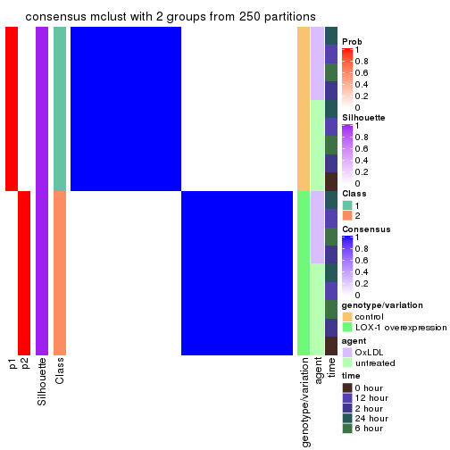</p>

</div>
<div id='tab-SD-mclust-consensus-heatmap-2'>
<pre><code class="r">consensus_heatmap(res, k = 3)
</code></pre>

<p>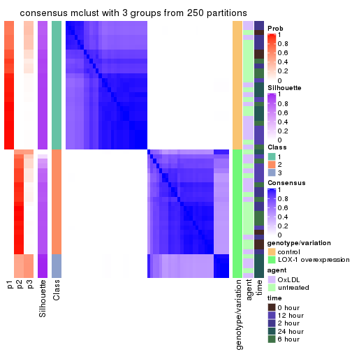</p>

</div>
<div id='tab-SD-mclust-consensus-heatmap-3'>
<pre><code class="r">consensus_heatmap(res, k = 4)
</code></pre>

<p>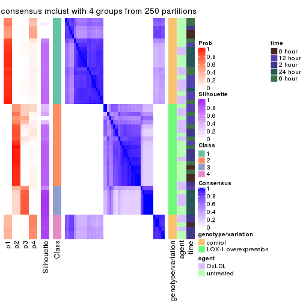</p>

</div>
<div id='tab-SD-mclust-consensus-heatmap-4'>
<pre><code class="r">consensus_heatmap(res, k = 5)
</code></pre>

<p>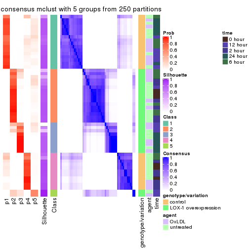</p>

</div>
<div id='tab-SD-mclust-consensus-heatmap-5'>
<pre><code class="r">consensus_heatmap(res, k = 6)
</code></pre>

<p>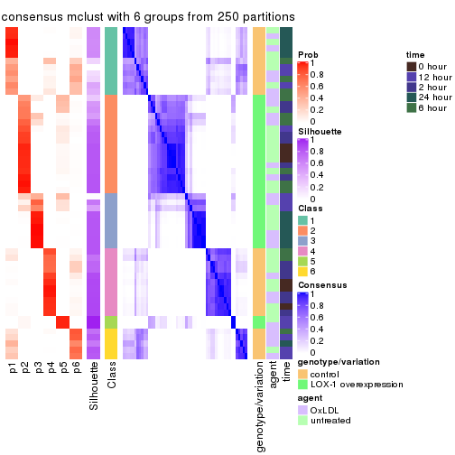</p>

</div>
</div>

Heatmaps for the membership of samples in all partitions to see how consistent they are:


<script>
$( function() {
	$( '#tabs-SD-mclust-membership-heatmap' ).tabs();
} );
</script>
<div id='tabs-SD-mclust-membership-heatmap'>
<ul>
<li><a href='#tab-SD-mclust-membership-heatmap-1'>k = 2</a></li>
<li><a href='#tab-SD-mclust-membership-heatmap-2'>k = 3</a></li>
<li><a href='#tab-SD-mclust-membership-heatmap-3'>k = 4</a></li>
<li><a href='#tab-SD-mclust-membership-heatmap-4'>k = 5</a></li>
<li><a href='#tab-SD-mclust-membership-heatmap-5'>k = 6</a></li>
</ul>
<div id='tab-SD-mclust-membership-heatmap-1'>
<pre><code class="r">membership_heatmap(res, k = 2)
</code></pre>

<p>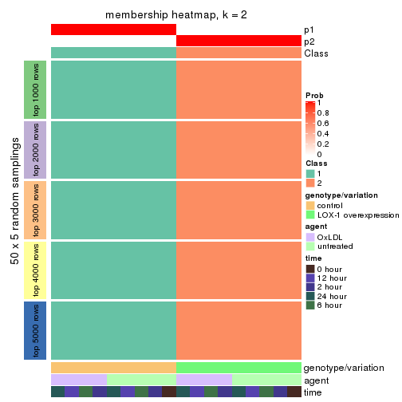</p>

</div>
<div id='tab-SD-mclust-membership-heatmap-2'>
<pre><code class="r">membership_heatmap(res, k = 3)
</code></pre>

<p>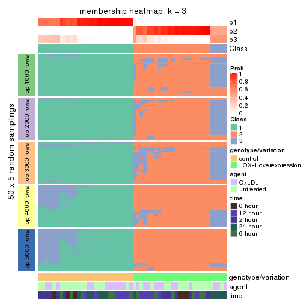</p>

</div>
<div id='tab-SD-mclust-membership-heatmap-3'>
<pre><code class="r">membership_heatmap(res, k = 4)
</code></pre>

<p>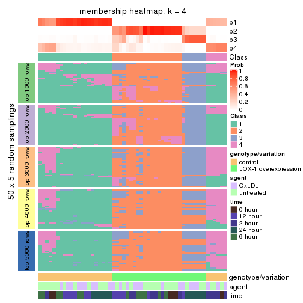</p>

</div>
<div id='tab-SD-mclust-membership-heatmap-4'>
<pre><code class="r">membership_heatmap(res, k = 5)
</code></pre>

<p>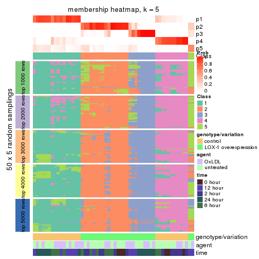</p>

</div>
<div id='tab-SD-mclust-membership-heatmap-5'>
<pre><code class="r">membership_heatmap(res, k = 6)
</code></pre>

<p>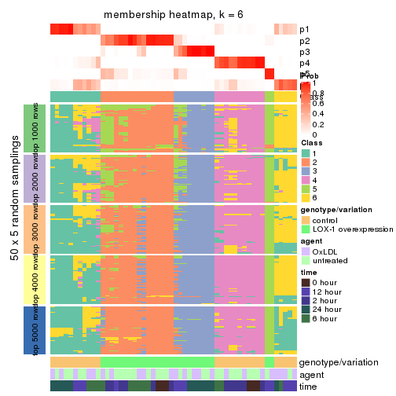</p>

</div>
</div>

As soon as we have had the classes for columns, we can look for signatures
which are significantly different between classes which can be candidate marks
for certain classes. Following are the heatmaps for signatures.


Signature heatmaps where rows are scaled:


<script>
$( function() {
	$( '#tabs-SD-mclust-get-signatures' ).tabs();
} );
</script>
<div id='tabs-SD-mclust-get-signatures'>
<ul>
<li><a href='#tab-SD-mclust-get-signatures-1'>k = 2</a></li>
<li><a href='#tab-SD-mclust-get-signatures-2'>k = 3</a></li>
<li><a href='#tab-SD-mclust-get-signatures-3'>k = 4</a></li>
<li><a href='#tab-SD-mclust-get-signatures-4'>k = 5</a></li>
<li><a href='#tab-SD-mclust-get-signatures-5'>k = 6</a></li>
</ul>
<div id='tab-SD-mclust-get-signatures-1'>
<pre><code class="r">get_signatures(res, k = 2)
</code></pre>

<p>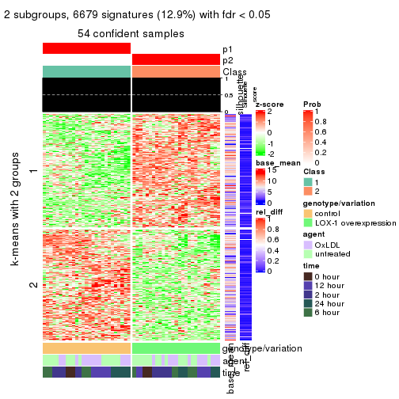</p>

</div>
<div id='tab-SD-mclust-get-signatures-2'>
<pre><code class="r">get_signatures(res, k = 3)
</code></pre>

<p>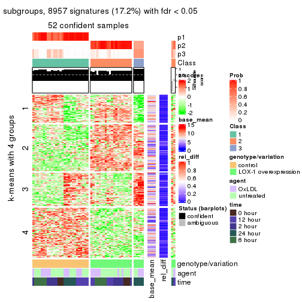</p>

</div>
<div id='tab-SD-mclust-get-signatures-3'>
<pre><code class="r">get_signatures(res, k = 4)
</code></pre>

<p>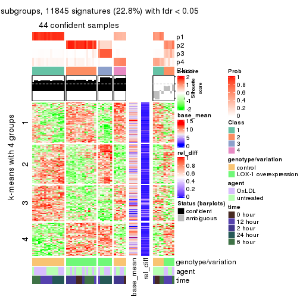</p>

</div>
<div id='tab-SD-mclust-get-signatures-4'>
<pre><code class="r">get_signatures(res, k = 5)
</code></pre>

<p>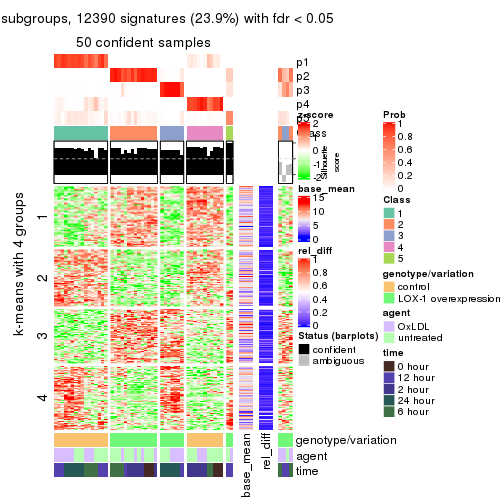</p>

</div>
<div id='tab-SD-mclust-get-signatures-5'>
<pre><code class="r">get_signatures(res, k = 6)
</code></pre>

<p>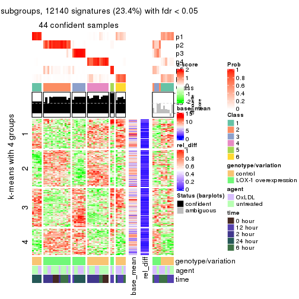</p>

</div>
</div>


Signature heatmaps where rows are not scaled:


<script>
$( function() {
	$( '#tabs-SD-mclust-get-signatures-no-scale' ).tabs();
} );
</script>
<div id='tabs-SD-mclust-get-signatures-no-scale'>
<ul>
<li><a href='#tab-SD-mclust-get-signatures-no-scale-1'>k = 2</a></li>
<li><a href='#tab-SD-mclust-get-signatures-no-scale-2'>k = 3</a></li>
<li><a href='#tab-SD-mclust-get-signatures-no-scale-3'>k = 4</a></li>
<li><a href='#tab-SD-mclust-get-signatures-no-scale-4'>k = 5</a></li>
<li><a href='#tab-SD-mclust-get-signatures-no-scale-5'>k = 6</a></li>
</ul>
<div id='tab-SD-mclust-get-signatures-no-scale-1'>
<pre><code class="r">get_signatures(res, k = 2, scale_rows = FALSE)
</code></pre>

<p>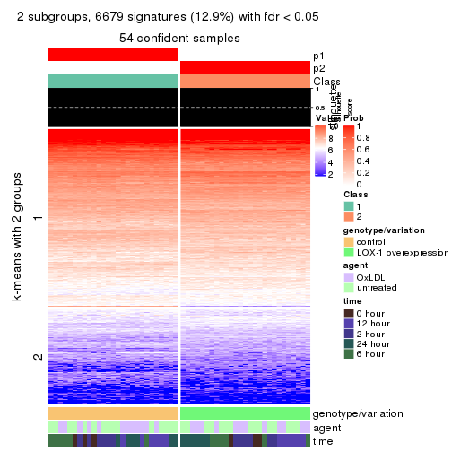</p>

</div>
<div id='tab-SD-mclust-get-signatures-no-scale-2'>
<pre><code class="r">get_signatures(res, k = 3, scale_rows = FALSE)
</code></pre>

<p>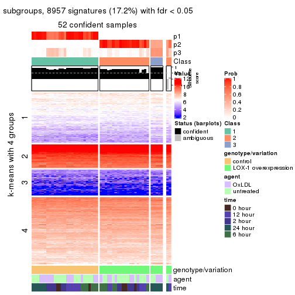</p>

</div>
<div id='tab-SD-mclust-get-signatures-no-scale-3'>
<pre><code class="r">get_signatures(res, k = 4, scale_rows = FALSE)
</code></pre>

<p>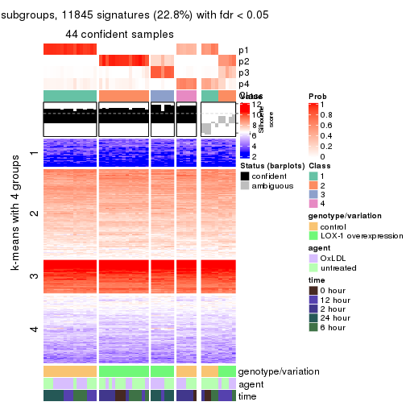</p>

</div>
<div id='tab-SD-mclust-get-signatures-no-scale-4'>
<pre><code class="r">get_signatures(res, k = 5, scale_rows = FALSE)
</code></pre>

<p>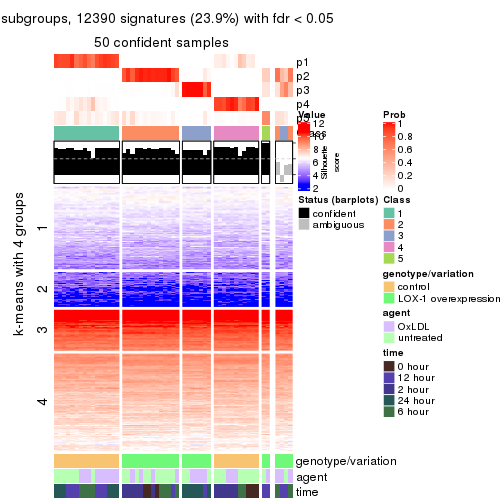</p>

</div>
<div id='tab-SD-mclust-get-signatures-no-scale-5'>
<pre><code class="r">get_signatures(res, k = 6, scale_rows = FALSE)
</code></pre>

<p>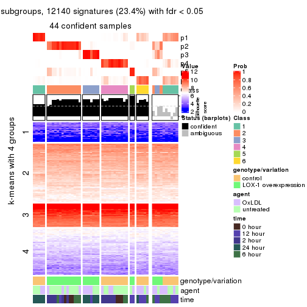</p>

</div>
</div>


Compare the overlap of signatures from different k:

```r
compare_signatures(res)
```

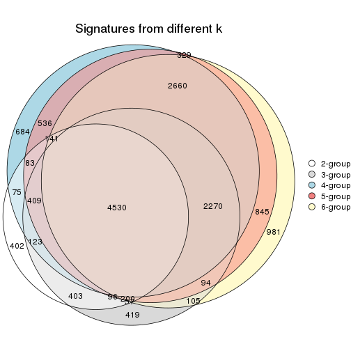

`get_signature()` returns a data frame invisibly. TO get the list of signatures, the function
call should be assigned to a variable explicitly. In following code, if `plot` argument is set
to `FALSE`, no heatmap is plotted while only the differential analysis is performed.

```r
# code only for demonstration
tb = get_signature(res, k = ..., plot = FALSE)
```

An example of the output of `tb` is:

```
#>   which_row         fdr    mean_1    mean_2 scaled_mean_1 scaled_mean_2 km
#> 1        38 0.042760348  8.373488  9.131774    -0.5533452     0.5164555  1
#> 2        40 0.018707592  7.106213  8.469186    -0.6173731     0.5762149  1
#> 3        55 0.019134737 10.221463 11.207825    -0.6159697     0.5749050  1
#> 4        59 0.006059896  5.921854  7.869574    -0.6899429     0.6439467  1
#> 5        60 0.018055526  8.928898 10.211722    -0.6204761     0.5791110  1
#> 6        98 0.009384629 15.714769 14.887706     0.6635654    -0.6193277  2
...
```

The columns in `tb` are:

1. `which_row`: row indices corresponding to the input matrix.
2. `fdr`: FDR for the differential test. 
3. `mean_x`: The mean value in group x.
4. `scaled_mean_x`: The mean value in group x after rows are scaled.
5. `km`: Row groups if k-means clustering is applied to rows.


UMAP plot which shows how samples are separated.


<script>
$( function() {
	$( '#tabs-SD-mclust-dimension-reduction' ).tabs();
} );
</script>
<div id='tabs-SD-mclust-dimension-reduction'>
<ul>
<li><a href='#tab-SD-mclust-dimension-reduction-1'>k = 2</a></li>
<li><a href='#tab-SD-mclust-dimension-reduction-2'>k = 3</a></li>
<li><a href='#tab-SD-mclust-dimension-reduction-3'>k = 4</a></li>
<li><a href='#tab-SD-mclust-dimension-reduction-4'>k = 5</a></li>
<li><a href='#tab-SD-mclust-dimension-reduction-5'>k = 6</a></li>
</ul>
<div id='tab-SD-mclust-dimension-reduction-1'>
<pre><code class="r">dimension_reduction(res, k = 2, method = &quot;UMAP&quot;)
</code></pre>

<p></p>

</div>
<div id='tab-SD-mclust-dimension-reduction-2'>
<pre><code class="r">dimension_reduction(res, k = 3, method = &quot;UMAP&quot;)
</code></pre>

<p>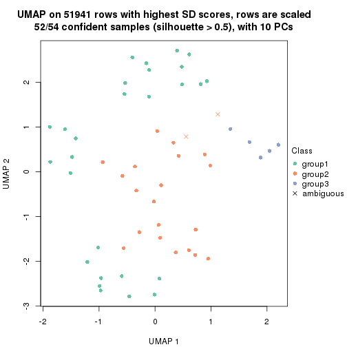</p>

</div>
<div id='tab-SD-mclust-dimension-reduction-3'>
<pre><code class="r">dimension_reduction(res, k = 4, method = &quot;UMAP&quot;)
</code></pre>

<p>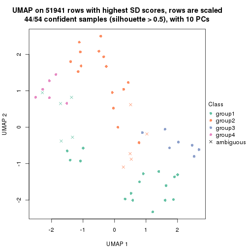</p>

</div>
<div id='tab-SD-mclust-dimension-reduction-4'>
<pre><code class="r">dimension_reduction(res, k = 5, method = &quot;UMAP&quot;)
</code></pre>

<p>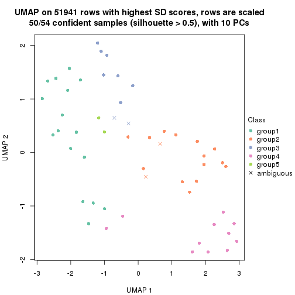</p>

</div>
<div id='tab-SD-mclust-dimension-reduction-5'>
<pre><code class="r">dimension_reduction(res, k = 6, method = &quot;UMAP&quot;)
</code></pre>

<p>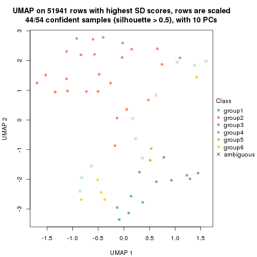</p>

</div>
</div>


Following heatmap shows how subgroups are split when increasing `k`:

```r
collect_classes(res)
```

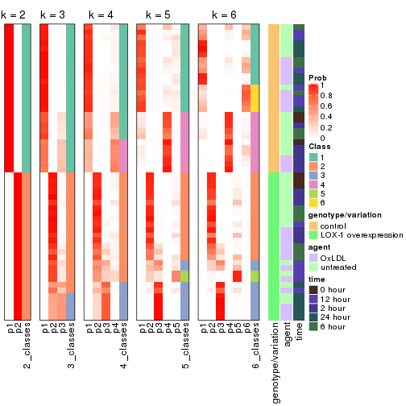


Test correlation between subgroups and known annotations. If the known
annotation is numeric, one-way ANOVA test is applied, and if the known
annotation is discrete, chi-squared contingency table test is applied.

```r
test_to_known_factors(res)
```

```
#>            n genotype/variation(p) agent(p)  time(p) k
#> SD:mclust 54              1.48e-12    1.000 1.00e+00 2
#> SD:mclust 52              5.11e-12    0.723 2.21e-03 3
#> SD:mclust 44              1.51e-09    0.578 1.32e-05 4
#> SD:mclust 50              3.61e-10    0.398 1.02e-05 5
#> SD:mclust 44              2.32e-08    0.334 3.44e-06 6
```


If matrix rows can be associated to genes, consider to use `functional_enrichment(res,
...)` to perform function enrichment for the signature genes. See [this vignette](http://bioconductor.org/packages/devel/bioc/vignettes/cola/inst/doc/functional_enrichment.html) for more detailed explanations.


 

---------------------------------------------------


### SD:NMF**


The object with results only for a single top-value method and a single partition method 
can be extracted as:

```r
res = res_list["SD", "NMF"]
# you can also extract it by
# res = res_list["SD:NMF"]
```

A summary of `res` and all the functions that can be applied to it:

```r
res
```

```
#> A 'ConsensusPartition' object with k = 2, 3, 4, 5, 6.
#>   On a matrix with 51941 rows and 54 columns.
#>   Top rows (1000, 2000, 3000, 4000, 5000) are extracted by 'SD' method.
#>   Subgroups are detected by 'NMF' method.
#>   Performed in total 1250 partitions by row resampling.
#>   Best k for subgroups seems to be 2.
#> 
#> Following methods can be applied to this 'ConsensusPartition' object:
#>  [1] "cola_report"             "collect_classes"         "collect_plots"          
#>  [4] "collect_stats"           "colnames"                "compare_signatures"     
#>  [7] "consensus_heatmap"       "dimension_reduction"     "functional_enrichment"  
#> [10] "get_anno_col"            "get_anno"                "get_classes"            
#> [13] "get_consensus"           "get_matrix"              "get_membership"         
#> [16] "get_param"               "get_signatures"          "get_stats"              
#> [19] "is_best_k"               "is_stable_k"             "membership_heatmap"     
#> [22] "ncol"                    "nrow"                    "plot_ecdf"              
#> [25] "rownames"                "select_partition_number" "show"                   
#> [28] "suggest_best_k"          "test_to_known_factors"
```

`collect_plots()` function collects all the plots made from `res` for all `k` (number of partitions)
into one single page to provide an easy and fast comparison between different `k`.

```r
collect_plots(res)
```

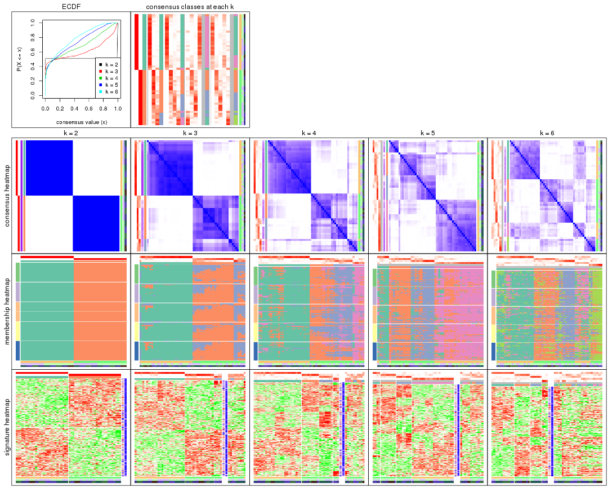

The plots are:

- The first row: a plot of the ECDF (empirical cumulative distribution
  function) curves of the consensus matrix for each `k` and the heatmap of
  predicted classes for each `k`.
- The second row: heatmaps of the consensus matrix for each `k`.
- The third row: heatmaps of the membership matrix for each `k`.
- The fouth row: heatmaps of the signatures for each `k`.

All the plots in panels can be made by individual functions and they are
plotted later in this section.

`select_partition_number()` produces several plots showing different
statistics for choosing "optimized" `k`. There are following statistics:

- ECDF curves of the consensus matrix for each `k`;
- 1-PAC. [The PAC
  score](https://en.wikipedia.org/wiki/Consensus_clustering#Over-interpretation_potential_of_consensus_clustering)
  measures the proportion of the ambiguous subgrouping.
- Mean silhouette score.
- Concordance. The mean probability of fiting the consensus class ids in all
  partitions.
- Area increased. Denote $A_k$ as the area under the ECDF curve for current
  `k`, the area increased is defined as $A_k - A_{k-1}$.
- Rand index. The percent of pairs of samples that are both in a same cluster
  or both are not in a same cluster in the partition of k and k-1.
- Jaccard index. The ratio of pairs of samples are both in a same cluster in
  the partition of k and k-1 and the pairs of samples are both in a same
  cluster in the partition k or k-1.

The detailed explanations of these statistics can be found in [the _cola_
vignette](http://bioconductor.org/packages/devel/bioc/vignettes/cola/inst/doc/cola.html#toc_13).

Generally speaking, lower PAC score, higher mean silhouette score or higher
concordance corresponds to better partition. Rand index and Jaccard index
measure how similar the current partition is compared to partition with `k-1`.
If they are too similar, we won't accept `k` is better than `k-1`.

```r
select_partition_number(res)
```

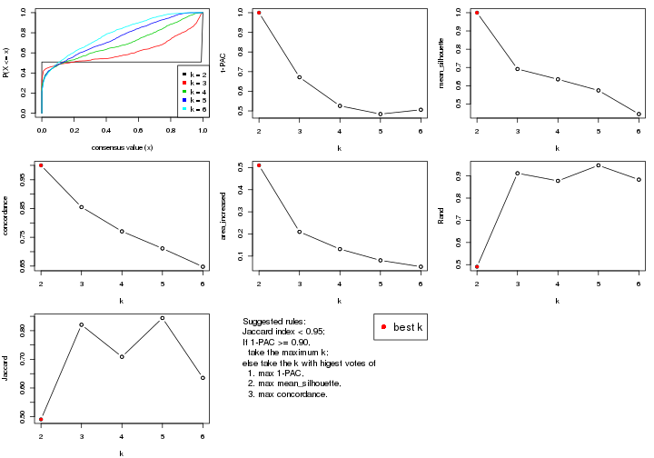

The numeric values for all these statistics can be obtained by `get_stats()`.

```r
get_stats(res)
```

```
#>   k 1-PAC mean_silhouette concordance area_increased  Rand Jaccard
#> 2 2 1.000           1.000       1.000         0.5099 0.491   0.491
#> 3 3 0.671           0.692       0.855         0.2096 0.912   0.821
#> 4 4 0.525           0.635       0.771         0.1316 0.878   0.709
#> 5 5 0.484           0.574       0.711         0.0809 0.948   0.844
#> 6 6 0.506           0.445       0.648         0.0521 0.883   0.635
```

`suggest_best_k()` suggests the best $k$ based on these statistics. The rules are as follows:

- All $k$ with Jaccard index larger than 0.95 are removed because increasing
  $k$ does not provide enough extra information. If all $k$ are removed, it is
  marked as no subgroup is detected.
- For all $k$ with 1-PAC score larger than 0.9, the maximal $k$ is taken as
  the best $k$, and other $k$ are marked as optional $k$.
- If it does not fit the second rule. The $k$ with the maximal vote of the
  highest 1-PAC score, highest mean silhouette, and highest concordance is
  taken as the best $k$.

```r
suggest_best_k(res)
```

```
#> [1] 2
```


Following shows the table of the partitions (You need to click the **show/hide
code output** link to see it). The membership matrix (columns with name `p*`)
is inferred by
[`clue::cl_consensus()`](https://www.rdocumentation.org/link/cl_consensus?package=clue)
function with the `SE` method. Basically the value in the membership matrix
represents the probability to belong to a certain group. The finall class
label for an item is determined with the group with highest probability it
belongs to.

In `get_classes()` function, the entropy is calculated from the membership
matrix and the silhouette score is calculated from the consensus matrix.


<script>
$( function() {
	$( '#tabs-SD-NMF-get-classes' ).tabs();
} );
</script>
<div id='tabs-SD-NMF-get-classes'>
<ul>
<li><a href='#tab-SD-NMF-get-classes-1'>k = 2</a></li>
<li><a href='#tab-SD-NMF-get-classes-2'>k = 3</a></li>
<li><a href='#tab-SD-NMF-get-classes-3'>k = 4</a></li>
<li><a href='#tab-SD-NMF-get-classes-4'>k = 5</a></li>
<li><a href='#tab-SD-NMF-get-classes-5'>k = 6</a></li>
</ul>

<div id='tab-SD-NMF-get-classes-1'>
<p><a id='tab-SD-NMF-get-classes-1-a' style='color:#0366d6' href='#'>show/hide code output</a></p>
<pre><code class="r">cbind(get_classes(res, k = 2), get_membership(res, k = 2))
</code></pre>

<pre><code>#&gt;           class entropy silhouette p1 p2
#&gt; GSM329068     2       0          1  0  1
#&gt; GSM329074     2       0          1  0  1
#&gt; GSM329100     2       0          1  0  1
#&gt; GSM329062     2       0          1  0  1
#&gt; GSM329079     2       0          1  0  1
#&gt; GSM329090     2       0          1  0  1
#&gt; GSM329066     2       0          1  0  1
#&gt; GSM329086     2       0          1  0  1
#&gt; GSM329099     2       0          1  0  1
#&gt; GSM329071     2       0          1  0  1
#&gt; GSM329078     2       0          1  0  1
#&gt; GSM329081     2       0          1  0  1
#&gt; GSM329096     2       0          1  0  1
#&gt; GSM329102     2       0          1  0  1
#&gt; GSM329104     2       0          1  0  1
#&gt; GSM329067     2       0          1  0  1
#&gt; GSM329072     2       0          1  0  1
#&gt; GSM329075     2       0          1  0  1
#&gt; GSM329058     2       0          1  0  1
#&gt; GSM329073     2       0          1  0  1
#&gt; GSM329107     2       0          1  0  1
#&gt; GSM329057     2       0          1  0  1
#&gt; GSM329085     2       0          1  0  1
#&gt; GSM329089     2       0          1  0  1
#&gt; GSM329076     2       0          1  0  1
#&gt; GSM329094     2       0          1  0  1
#&gt; GSM329105     2       0          1  0  1
#&gt; GSM329056     1       0          1  1  0
#&gt; GSM329069     1       0          1  1  0
#&gt; GSM329077     1       0          1  1  0
#&gt; GSM329070     1       0          1  1  0
#&gt; GSM329082     1       0          1  1  0
#&gt; GSM329092     1       0          1  1  0
#&gt; GSM329083     1       0          1  1  0
#&gt; GSM329101     1       0          1  1  0
#&gt; GSM329106     1       0          1  1  0
#&gt; GSM329087     1       0          1  1  0
#&gt; GSM329091     1       0          1  1  0
#&gt; GSM329093     1       0          1  1  0
#&gt; GSM329080     1       0          1  1  0
#&gt; GSM329084     1       0          1  1  0
#&gt; GSM329088     1       0          1  1  0
#&gt; GSM329059     1       0          1  1  0
#&gt; GSM329097     1       0          1  1  0
#&gt; GSM329098     1       0          1  1  0
#&gt; GSM329055     1       0          1  1  0
#&gt; GSM329103     1       0          1  1  0
#&gt; GSM329108     1       0          1  1  0
#&gt; GSM329061     1       0          1  1  0
#&gt; GSM329064     1       0          1  1  0
#&gt; GSM329065     1       0          1  1  0
#&gt; GSM329060     1       0          1  1  0
#&gt; GSM329063     1       0          1  1  0
#&gt; GSM329095     1       0          1  1  0
</code></pre>

<script>
$('#tab-SD-NMF-get-classes-1-a').parent().next().next().hide();
$('#tab-SD-NMF-get-classes-1-a').click(function(){
  $('#tab-SD-NMF-get-classes-1-a').parent().next().next().toggle();
  return(false);
});
</script>
</div>

<div id='tab-SD-NMF-get-classes-2'>
<p><a id='tab-SD-NMF-get-classes-2-a' style='color:#0366d6' href='#'>show/hide code output</a></p>
<pre><code class="r">cbind(get_classes(res, k = 3), get_membership(res, k = 3))
</code></pre>

<pre><code>#&gt;           class entropy silhouette    p1    p2    p3
#&gt; GSM329068     2  0.0747      0.685 0.000 0.984 0.016
#&gt; GSM329074     2  0.1289      0.661 0.000 0.968 0.032
#&gt; GSM329100     2  0.1289      0.665 0.000 0.968 0.032
#&gt; GSM329062     2  0.4974      0.599 0.000 0.764 0.236
#&gt; GSM329079     2  0.4555      0.639 0.000 0.800 0.200
#&gt; GSM329090     3  0.6299      0.266 0.000 0.476 0.524
#&gt; GSM329066     2  0.3941      0.667 0.000 0.844 0.156
#&gt; GSM329086     2  0.1289      0.677 0.000 0.968 0.032
#&gt; GSM329099     2  0.2448      0.697 0.000 0.924 0.076
#&gt; GSM329071     2  0.6095      0.220 0.000 0.608 0.392
#&gt; GSM329078     3  0.2878      0.586 0.000 0.096 0.904
#&gt; GSM329081     2  0.4796      0.611 0.000 0.780 0.220
#&gt; GSM329096     2  0.6026      0.317 0.000 0.624 0.376
#&gt; GSM329102     2  0.3412      0.688 0.000 0.876 0.124
#&gt; GSM329104     2  0.4002      0.674 0.000 0.840 0.160
#&gt; GSM329067     2  0.0592      0.680 0.000 0.988 0.012
#&gt; GSM329072     3  0.5859      0.581 0.000 0.344 0.656
#&gt; GSM329075     2  0.1529      0.655 0.000 0.960 0.040
#&gt; GSM329058     2  0.2165      0.698 0.000 0.936 0.064
#&gt; GSM329073     2  0.1753      0.675 0.000 0.952 0.048
#&gt; GSM329107     2  0.6309     -0.322 0.000 0.500 0.500
#&gt; GSM329057     3  0.5706      0.599 0.000 0.320 0.680
#&gt; GSM329085     3  0.2711      0.578 0.000 0.088 0.912
#&gt; GSM329089     3  0.6286      0.308 0.000 0.464 0.536
#&gt; GSM329076     2  0.5988      0.368 0.000 0.632 0.368
#&gt; GSM329094     2  0.6079      0.309 0.000 0.612 0.388
#&gt; GSM329105     2  0.6307     -0.153 0.000 0.512 0.488
#&gt; GSM329056     1  0.5847      0.793 0.780 0.172 0.048
#&gt; GSM329069     1  0.4232      0.870 0.872 0.084 0.044
#&gt; GSM329077     1  0.6839      0.668 0.684 0.272 0.044
#&gt; GSM329070     1  0.1585      0.921 0.964 0.008 0.028
#&gt; GSM329082     1  0.1031      0.927 0.976 0.000 0.024
#&gt; GSM329092     1  0.1411      0.924 0.964 0.000 0.036
#&gt; GSM329083     1  0.5202      0.827 0.820 0.136 0.044
#&gt; GSM329101     1  0.0829      0.927 0.984 0.004 0.012
#&gt; GSM329106     1  0.3148      0.897 0.916 0.048 0.036
#&gt; GSM329087     1  0.0747      0.928 0.984 0.000 0.016
#&gt; GSM329091     1  0.0661      0.928 0.988 0.004 0.008
#&gt; GSM329093     1  0.1860      0.916 0.948 0.000 0.052
#&gt; GSM329080     1  0.0592      0.928 0.988 0.000 0.012
#&gt; GSM329084     1  0.0747      0.929 0.984 0.000 0.016
#&gt; GSM329088     1  0.0592      0.928 0.988 0.000 0.012
#&gt; GSM329059     1  0.0829      0.928 0.984 0.004 0.012
#&gt; GSM329097     1  0.1315      0.926 0.972 0.008 0.020
#&gt; GSM329098     1  0.5956      0.776 0.768 0.188 0.044
#&gt; GSM329055     1  0.0424      0.928 0.992 0.000 0.008
#&gt; GSM329103     1  0.0747      0.927 0.984 0.000 0.016
#&gt; GSM329108     1  0.0000      0.928 1.000 0.000 0.000
#&gt; GSM329061     1  0.1643      0.919 0.956 0.000 0.044
#&gt; GSM329064     1  0.0592      0.928 0.988 0.000 0.012
#&gt; GSM329065     1  0.2165      0.908 0.936 0.000 0.064
#&gt; GSM329060     1  0.1031      0.926 0.976 0.000 0.024
#&gt; GSM329063     1  0.0424      0.929 0.992 0.000 0.008
#&gt; GSM329095     1  0.6286      0.378 0.536 0.000 0.464
</code></pre>

<script>
$('#tab-SD-NMF-get-classes-2-a').parent().next().next().hide();
$('#tab-SD-NMF-get-classes-2-a').click(function(){
  $('#tab-SD-NMF-get-classes-2-a').parent().next().next().toggle();
  return(false);
});
</script>
</div>

<div id='tab-SD-NMF-get-classes-3'>
<p><a id='tab-SD-NMF-get-classes-3-a' style='color:#0366d6' href='#'>show/hide code output</a></p>
<pre><code class="r">cbind(get_classes(res, k = 4), get_membership(res, k = 4))
</code></pre>

<pre><code>#&gt;           class entropy silhouette    p1    p2    p3    p4
#&gt; GSM329068     2  0.2198     0.7094 0.000 0.920 0.072 0.008
#&gt; GSM329074     2  0.2081     0.7028 0.000 0.916 0.084 0.000
#&gt; GSM329100     2  0.1389     0.6849 0.000 0.952 0.048 0.000
#&gt; GSM329062     2  0.5517     0.5645 0.000 0.724 0.092 0.184
#&gt; GSM329079     2  0.4336     0.6479 0.000 0.812 0.060 0.128
#&gt; GSM329090     4  0.5957     0.3865 0.000 0.364 0.048 0.588
#&gt; GSM329066     2  0.6637     0.1136 0.000 0.540 0.368 0.092
#&gt; GSM329086     2  0.2987     0.6990 0.000 0.880 0.104 0.016
#&gt; GSM329099     2  0.5148     0.5754 0.000 0.736 0.208 0.056
#&gt; GSM329071     3  0.7363     0.5399 0.000 0.284 0.516 0.200
#&gt; GSM329078     4  0.2670     0.5764 0.000 0.024 0.072 0.904
#&gt; GSM329081     2  0.6971     0.0171 0.000 0.508 0.372 0.120
#&gt; GSM329096     3  0.5750     0.6935 0.000 0.216 0.696 0.088
#&gt; GSM329102     3  0.3873     0.6385 0.000 0.228 0.772 0.000
#&gt; GSM329104     3  0.4188     0.6343 0.000 0.244 0.752 0.004
#&gt; GSM329067     2  0.2256     0.6687 0.000 0.924 0.056 0.020
#&gt; GSM329072     4  0.5031     0.5527 0.000 0.212 0.048 0.740
#&gt; GSM329075     2  0.2053     0.7045 0.000 0.924 0.072 0.004
#&gt; GSM329058     2  0.5650     0.0902 0.000 0.544 0.432 0.024
#&gt; GSM329073     3  0.5290     0.0390 0.000 0.476 0.516 0.008
#&gt; GSM329107     4  0.6883     0.2537 0.000 0.260 0.156 0.584
#&gt; GSM329057     3  0.6543     0.4331 0.000 0.084 0.544 0.372
#&gt; GSM329085     4  0.2563     0.5726 0.000 0.020 0.072 0.908
#&gt; GSM329089     3  0.7627     0.3754 0.000 0.204 0.408 0.388
#&gt; GSM329076     3  0.4057     0.6846 0.000 0.160 0.812 0.028
#&gt; GSM329094     3  0.5221     0.6998 0.000 0.208 0.732 0.060
#&gt; GSM329105     3  0.5950     0.6896 0.000 0.148 0.696 0.156
#&gt; GSM329056     1  0.6090     0.6565 0.648 0.292 0.044 0.016
#&gt; GSM329069     1  0.5338     0.7785 0.768 0.152 0.056 0.024
#&gt; GSM329077     1  0.7183     0.3992 0.488 0.412 0.080 0.020
#&gt; GSM329070     1  0.3703     0.8316 0.868 0.080 0.032 0.020
#&gt; GSM329082     1  0.6052     0.7601 0.748 0.080 0.072 0.100
#&gt; GSM329092     1  0.7518     0.6443 0.640 0.136 0.088 0.136
#&gt; GSM329083     1  0.4476     0.8134 0.828 0.104 0.040 0.028
#&gt; GSM329101     1  0.1256     0.8479 0.964 0.000 0.028 0.008
#&gt; GSM329106     1  0.2718     0.8419 0.912 0.056 0.020 0.012
#&gt; GSM329087     1  0.0779     0.8432 0.980 0.000 0.004 0.016
#&gt; GSM329091     1  0.1452     0.8466 0.956 0.000 0.036 0.008
#&gt; GSM329093     1  0.3591     0.7843 0.824 0.000 0.008 0.168
#&gt; GSM329080     1  0.2530     0.8278 0.896 0.000 0.100 0.004
#&gt; GSM329084     1  0.2589     0.8219 0.884 0.000 0.116 0.000
#&gt; GSM329088     1  0.1824     0.8418 0.936 0.000 0.060 0.004
#&gt; GSM329059     1  0.4952     0.7989 0.796 0.132 0.044 0.028
#&gt; GSM329097     1  0.6323     0.7243 0.696 0.200 0.068 0.036
#&gt; GSM329098     1  0.6484     0.5899 0.596 0.336 0.048 0.020
#&gt; GSM329055     1  0.0895     0.8452 0.976 0.000 0.020 0.004
#&gt; GSM329103     1  0.1637     0.8422 0.940 0.000 0.000 0.060
#&gt; GSM329108     1  0.1059     0.8460 0.972 0.000 0.016 0.012
#&gt; GSM329061     1  0.2831     0.8165 0.876 0.000 0.004 0.120
#&gt; GSM329064     1  0.1398     0.8429 0.956 0.000 0.004 0.040
#&gt; GSM329065     1  0.3161     0.8096 0.864 0.000 0.012 0.124
#&gt; GSM329060     1  0.2742     0.8364 0.900 0.000 0.076 0.024
#&gt; GSM329063     1  0.1867     0.8399 0.928 0.000 0.072 0.000
#&gt; GSM329095     4  0.5681     0.0129 0.404 0.000 0.028 0.568
</code></pre>

<script>
$('#tab-SD-NMF-get-classes-3-a').parent().next().next().hide();
$('#tab-SD-NMF-get-classes-3-a').click(function(){
  $('#tab-SD-NMF-get-classes-3-a').parent().next().next().toggle();
  return(false);
});
</script>
</div>

<div id='tab-SD-NMF-get-classes-4'>
<p><a id='tab-SD-NMF-get-classes-4-a' style='color:#0366d6' href='#'>show/hide code output</a></p>
<pre><code class="r">cbind(get_classes(res, k = 5), get_membership(res, k = 5))
</code></pre>

<pre><code>#&gt;           class entropy silhouette    p1    p2    p3    p4 p5
#&gt; GSM329068     2   0.397     0.6539 0.008 0.792 0.164 0.000 NA
#&gt; GSM329074     2   0.421     0.6420 0.004 0.776 0.164 0.000 NA
#&gt; GSM329100     2   0.464     0.6430 0.008 0.760 0.120 0.000 NA
#&gt; GSM329062     2   0.624     0.5300 0.124 0.624 0.216 0.000 NA
#&gt; GSM329079     2   0.570     0.5623 0.132 0.688 0.148 0.000 NA
#&gt; GSM329090     1   0.575     0.5050 0.632 0.252 0.104 0.000 NA
#&gt; GSM329066     2   0.649     0.0232 0.040 0.468 0.416 0.000 NA
#&gt; GSM329086     2   0.598     0.5954 0.016 0.636 0.184 0.000 NA
#&gt; GSM329099     2   0.676     0.4178 0.048 0.560 0.260 0.000 NA
#&gt; GSM329071     3   0.564     0.5642 0.096 0.208 0.672 0.000 NA
#&gt; GSM329078     1   0.216     0.6749 0.920 0.020 0.052 0.000 NA
#&gt; GSM329081     3   0.697     0.1222 0.088 0.396 0.456 0.004 NA
#&gt; GSM329096     3   0.261     0.6991 0.016 0.060 0.900 0.000 NA
#&gt; GSM329102     3   0.192     0.6871 0.000 0.040 0.928 0.000 NA
#&gt; GSM329104     3   0.362     0.6570 0.000 0.096 0.832 0.004 NA
#&gt; GSM329067     2   0.370     0.6329 0.020 0.840 0.060 0.000 NA
#&gt; GSM329072     1   0.435     0.6607 0.784 0.132 0.072 0.000 NA
#&gt; GSM329075     2   0.323     0.6614 0.000 0.840 0.128 0.000 NA
#&gt; GSM329058     3   0.609     0.1625 0.012 0.400 0.500 0.000 NA
#&gt; GSM329073     3   0.675     0.2250 0.020 0.328 0.492 0.000 NA
#&gt; GSM329107     1   0.638     0.4120 0.580 0.220 0.184 0.000 NA
#&gt; GSM329057     3   0.505     0.5768 0.220 0.048 0.708 0.000 NA
#&gt; GSM329085     1   0.189     0.6757 0.936 0.012 0.040 0.004 NA
#&gt; GSM329089     3   0.626     0.3759 0.340 0.092 0.544 0.000 NA
#&gt; GSM329076     3   0.176     0.6838 0.012 0.012 0.944 0.004 NA
#&gt; GSM329094     3   0.208     0.6983 0.004 0.064 0.920 0.004 NA
#&gt; GSM329105     3   0.250     0.7001 0.040 0.036 0.908 0.000 NA
#&gt; GSM329056     4   0.633     0.5648 0.000 0.264 0.000 0.524 NA
#&gt; GSM329069     4   0.649     0.5673 0.004 0.176 0.000 0.488 NA
#&gt; GSM329077     2   0.702    -0.1223 0.004 0.400 0.004 0.276 NA
#&gt; GSM329070     4   0.526     0.7105 0.012 0.076 0.000 0.684 NA
#&gt; GSM329082     4   0.756     0.5479 0.148 0.128 0.000 0.512 NA
#&gt; GSM329092     4   0.814     0.3305 0.140 0.168 0.000 0.348 NA
#&gt; GSM329083     4   0.626     0.6530 0.020 0.100 0.012 0.616 NA
#&gt; GSM329101     4   0.271     0.7548 0.000 0.008 0.000 0.860 NA
#&gt; GSM329106     4   0.407     0.7356 0.000 0.032 0.004 0.768 NA
#&gt; GSM329087     4   0.174     0.7479 0.012 0.000 0.000 0.932 NA
#&gt; GSM329091     4   0.228     0.7533 0.004 0.000 0.004 0.896 NA
#&gt; GSM329093     4   0.550     0.5483 0.280 0.004 0.000 0.628 NA
#&gt; GSM329080     4   0.316     0.7391 0.004 0.000 0.044 0.860 NA
#&gt; GSM329084     4   0.395     0.7176 0.004 0.000 0.076 0.808 NA
#&gt; GSM329088     4   0.263     0.7453 0.000 0.000 0.040 0.888 NA
#&gt; GSM329059     4   0.598     0.6445 0.000 0.168 0.000 0.580 NA
#&gt; GSM329097     4   0.691     0.4696 0.008 0.248 0.000 0.428 NA
#&gt; GSM329098     4   0.690     0.3819 0.004 0.336 0.000 0.388 NA
#&gt; GSM329055     4   0.275     0.7539 0.012 0.008 0.004 0.884 NA
#&gt; GSM329103     4   0.337     0.7433 0.056 0.004 0.000 0.848 NA
#&gt; GSM329108     4   0.336     0.7547 0.008 0.016 0.004 0.840 NA
#&gt; GSM329061     4   0.501     0.6022 0.248 0.000 0.000 0.676 NA
#&gt; GSM329064     4   0.272     0.7532 0.028 0.000 0.012 0.892 NA
#&gt; GSM329065     4   0.430     0.6737 0.184 0.000 0.000 0.756 NA
#&gt; GSM329060     4   0.338     0.7367 0.024 0.000 0.040 0.860 NA
#&gt; GSM329063     4   0.285     0.7440 0.000 0.000 0.036 0.872 NA
#&gt; GSM329095     1   0.537     0.3139 0.652 0.000 0.008 0.264 NA
</code></pre>

<script>
$('#tab-SD-NMF-get-classes-4-a').parent().next().next().hide();
$('#tab-SD-NMF-get-classes-4-a').click(function(){
  $('#tab-SD-NMF-get-classes-4-a').parent().next().next().toggle();
  return(false);
});
</script>
</div>

<div id='tab-SD-NMF-get-classes-5'>
<p><a id='tab-SD-NMF-get-classes-5-a' style='color:#0366d6' href='#'>show/hide code output</a></p>
<pre><code class="r">cbind(get_classes(res, k = 6), get_membership(res, k = 6))
</code></pre>

<pre><code>#&gt;           class entropy silhouette    p1    p2    p3    p4    p5 p6
#&gt; GSM329068     2   0.473    0.65654 0.000 0.764 0.092 0.080 0.032 NA
#&gt; GSM329074     2   0.449    0.61502 0.000 0.764 0.068 0.088 0.000 NA
#&gt; GSM329100     2   0.500    0.60959 0.000 0.720 0.072 0.144 0.004 NA
#&gt; GSM329062     2   0.629    0.54578 0.000 0.592 0.120 0.052 0.216 NA
#&gt; GSM329079     2   0.607    0.57649 0.000 0.648 0.092 0.044 0.164 NA
#&gt; GSM329090     5   0.535    0.40495 0.000 0.264 0.052 0.024 0.640 NA
#&gt; GSM329066     2   0.690    0.31472 0.000 0.480 0.300 0.012 0.116 NA
#&gt; GSM329086     2   0.702    0.54406 0.000 0.552 0.124 0.152 0.032 NA
#&gt; GSM329099     2   0.678    0.49765 0.000 0.568 0.168 0.040 0.060 NA
#&gt; GSM329071     3   0.652    0.39400 0.000 0.212 0.544 0.008 0.180 NA
#&gt; GSM329078     5   0.141    0.61235 0.000 0.004 0.044 0.000 0.944 NA
#&gt; GSM329081     2   0.769    0.18924 0.004 0.396 0.300 0.020 0.128 NA
#&gt; GSM329096     3   0.336    0.67546 0.000 0.060 0.844 0.000 0.056 NA
#&gt; GSM329102     3   0.243    0.66983 0.000 0.072 0.884 0.000 0.000 NA
#&gt; GSM329104     3   0.443    0.57766 0.004 0.044 0.728 0.008 0.008 NA
#&gt; GSM329067     2   0.453    0.60703 0.000 0.756 0.024 0.152 0.020 NA
#&gt; GSM329072     5   0.376    0.57788 0.000 0.144 0.028 0.020 0.800 NA
#&gt; GSM329075     2   0.369    0.65473 0.000 0.820 0.080 0.076 0.004 NA
#&gt; GSM329058     3   0.655    0.00483 0.000 0.352 0.420 0.012 0.016 NA
#&gt; GSM329073     3   0.707    0.00144 0.004 0.304 0.368 0.036 0.008 NA
#&gt; GSM329107     5   0.550    0.43966 0.000 0.184 0.124 0.008 0.656 NA
#&gt; GSM329057     3   0.627    0.33977 0.000 0.052 0.536 0.012 0.308 NA
#&gt; GSM329085     5   0.110    0.60634 0.000 0.004 0.020 0.004 0.964 NA
#&gt; GSM329089     5   0.628   -0.19209 0.000 0.128 0.412 0.004 0.424 NA
#&gt; GSM329076     3   0.240    0.66774 0.016 0.032 0.908 0.000 0.016 NA
#&gt; GSM329094     3   0.245    0.67900 0.000 0.076 0.892 0.004 0.016 NA
#&gt; GSM329105     3   0.292    0.67848 0.000 0.068 0.864 0.000 0.056 NA
#&gt; GSM329056     1   0.650   -0.30744 0.440 0.160 0.004 0.360 0.000 NA
#&gt; GSM329069     4   0.581    0.45067 0.340 0.080 0.000 0.536 0.000 NA
#&gt; GSM329077     4   0.715    0.30149 0.152 0.336 0.004 0.400 0.000 NA
#&gt; GSM329070     1   0.631   -0.10522 0.500 0.064 0.000 0.340 0.004 NA
#&gt; GSM329082     4   0.761    0.21232 0.356 0.064 0.000 0.380 0.128 NA
#&gt; GSM329092     4   0.687    0.48767 0.184 0.080 0.000 0.576 0.100 NA
#&gt; GSM329083     1   0.665    0.01329 0.460 0.036 0.004 0.260 0.000 NA
#&gt; GSM329101     1   0.353    0.58543 0.808 0.004 0.008 0.144 0.000 NA
#&gt; GSM329106     1   0.470    0.42412 0.704 0.044 0.000 0.212 0.000 NA
#&gt; GSM329087     1   0.229    0.62551 0.904 0.000 0.000 0.044 0.012 NA
#&gt; GSM329091     1   0.290    0.61622 0.864 0.000 0.012 0.080 0.000 NA
#&gt; GSM329093     1   0.564    0.27332 0.532 0.000 0.004 0.076 0.364 NA
#&gt; GSM329080     1   0.385    0.59138 0.808 0.000 0.092 0.044 0.000 NA
#&gt; GSM329084     1   0.560    0.47892 0.676 0.000 0.112 0.100 0.004 NA
#&gt; GSM329088     1   0.355    0.61388 0.832 0.000 0.068 0.048 0.000 NA
#&gt; GSM329059     4   0.633    0.38208 0.392 0.108 0.000 0.448 0.004 NA
#&gt; GSM329097     4   0.584    0.51725 0.296 0.164 0.000 0.528 0.000 NA
#&gt; GSM329098     4   0.691    0.40679 0.320 0.204 0.000 0.416 0.004 NA
#&gt; GSM329055     1   0.347    0.60292 0.820 0.004 0.004 0.112 0.000 NA
#&gt; GSM329103     1   0.495    0.56776 0.740 0.004 0.004 0.092 0.096 NA
#&gt; GSM329108     1   0.389    0.56924 0.772 0.004 0.000 0.168 0.004 NA
#&gt; GSM329061     1   0.559    0.40777 0.624 0.000 0.004 0.080 0.248 NA
#&gt; GSM329064     1   0.400    0.60077 0.808 0.004 0.004 0.092 0.056 NA
#&gt; GSM329065     1   0.460    0.51802 0.732 0.000 0.004 0.048 0.180 NA
#&gt; GSM329060     1   0.411    0.60891 0.808 0.000 0.052 0.068 0.016 NA
#&gt; GSM329063     1   0.411    0.59561 0.804 0.004 0.048 0.064 0.004 NA
#&gt; GSM329095     5   0.583    0.02815 0.316 0.000 0.008 0.072 0.564 NA
</code></pre>

<script>
$('#tab-SD-NMF-get-classes-5-a').parent().next().next().hide();
$('#tab-SD-NMF-get-classes-5-a').click(function(){
  $('#tab-SD-NMF-get-classes-5-a').parent().next().next().toggle();
  return(false);
});
</script>
</div>
</div>

Heatmaps for the consensus matrix. It visualizes the probability of two
samples to be in a same group.


<script>
$( function() {
	$( '#tabs-SD-NMF-consensus-heatmap' ).tabs();
} );
</script>
<div id='tabs-SD-NMF-consensus-heatmap'>
<ul>
<li><a href='#tab-SD-NMF-consensus-heatmap-1'>k = 2</a></li>
<li><a href='#tab-SD-NMF-consensus-heatmap-2'>k = 3</a></li>
<li><a href='#tab-SD-NMF-consensus-heatmap-3'>k = 4</a></li>
<li><a href='#tab-SD-NMF-consensus-heatmap-4'>k = 5</a></li>
<li><a href='#tab-SD-NMF-consensus-heatmap-5'>k = 6</a></li>
</ul>
<div id='tab-SD-NMF-consensus-heatmap-1'>
<pre><code class="r">consensus_heatmap(res, k = 2)
</code></pre>

<p>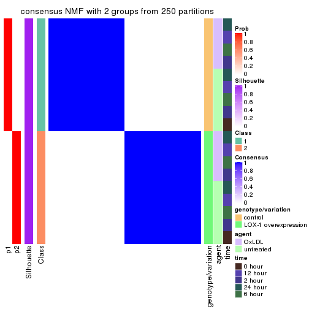</p>

</div>
<div id='tab-SD-NMF-consensus-heatmap-2'>
<pre><code class="r">consensus_heatmap(res, k = 3)
</code></pre>

<p>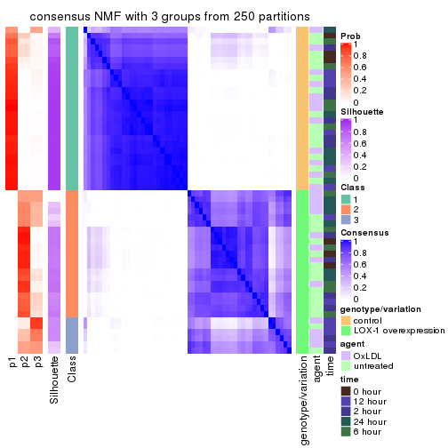</p>

</div>
<div id='tab-SD-NMF-consensus-heatmap-3'>
<pre><code class="r">consensus_heatmap(res, k = 4)
</code></pre>

<p>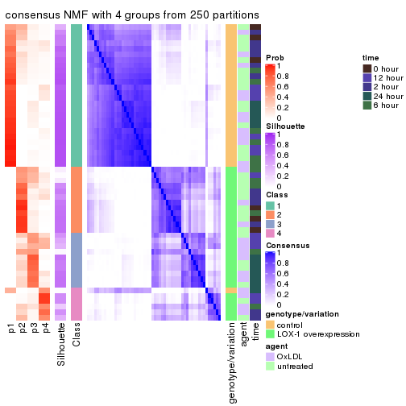</p>

</div>
<div id='tab-SD-NMF-consensus-heatmap-4'>
<pre><code class="r">consensus_heatmap(res, k = 5)
</code></pre>

<p>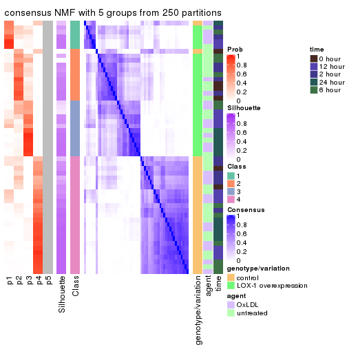</p>

</div>
<div id='tab-SD-NMF-consensus-heatmap-5'>
<pre><code class="r">consensus_heatmap(res, k = 6)
</code></pre>

<p>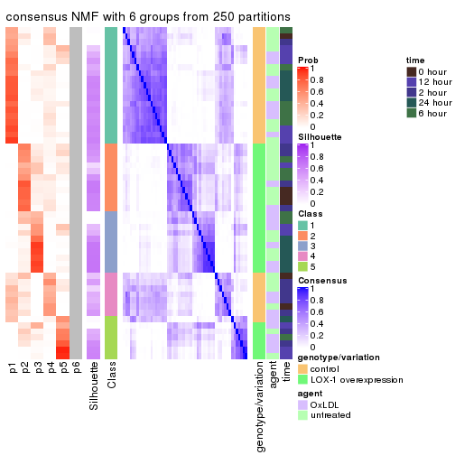</p>

</div>
</div>

Heatmaps for the membership of samples in all partitions to see how consistent they are:


<script>
$( function() {
	$( '#tabs-SD-NMF-membership-heatmap' ).tabs();
} );
</script>
<div id='tabs-SD-NMF-membership-heatmap'>
<ul>
<li><a href='#tab-SD-NMF-membership-heatmap-1'>k = 2</a></li>
<li><a href='#tab-SD-NMF-membership-heatmap-2'>k = 3</a></li>
<li><a href='#tab-SD-NMF-membership-heatmap-3'>k = 4</a></li>
<li><a href='#tab-SD-NMF-membership-heatmap-4'>k = 5</a></li>
<li><a href='#tab-SD-NMF-membership-heatmap-5'>k = 6</a></li>
</ul>
<div id='tab-SD-NMF-membership-heatmap-1'>
<pre><code class="r">membership_heatmap(res, k = 2)
</code></pre>

<p></p>

</div>
<div id='tab-SD-NMF-membership-heatmap-2'>
<pre><code class="r">membership_heatmap(res, k = 3)
</code></pre>

<p>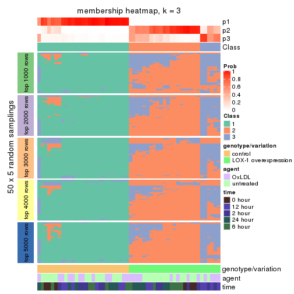</p>

</div>
<div id='tab-SD-NMF-membership-heatmap-3'>
<pre><code class="r">membership_heatmap(res, k = 4)
</code></pre>

<p>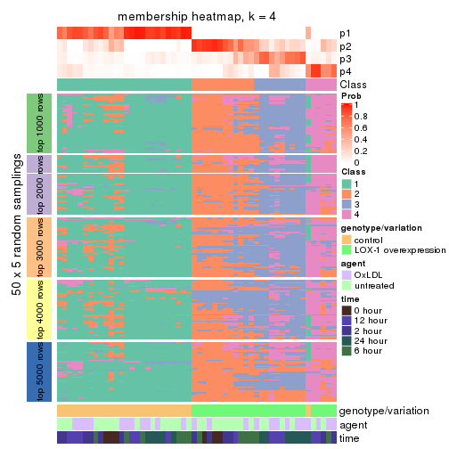</p>

</div>
<div id='tab-SD-NMF-membership-heatmap-4'>
<pre><code class="r">membership_heatmap(res, k = 5)
</code></pre>

<p></p>

</div>
<div id='tab-SD-NMF-membership-heatmap-5'>
<pre><code class="r">membership_heatmap(res, k = 6)
</code></pre>

<p>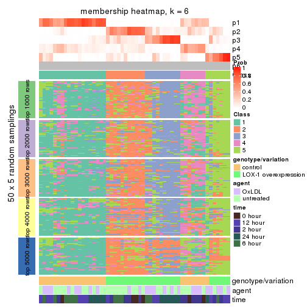</p>

</div>
</div>

As soon as we have had the classes for columns, we can look for signatures
which are significantly different between classes which can be candidate marks
for certain classes. Following are the heatmaps for signatures.


Signature heatmaps where rows are scaled:


<script>
$( function() {
	$( '#tabs-SD-NMF-get-signatures' ).tabs();
} );
</script>
<div id='tabs-SD-NMF-get-signatures'>
<ul>
<li><a href='#tab-SD-NMF-get-signatures-1'>k = 2</a></li>
<li><a href='#tab-SD-NMF-get-signatures-2'>k = 3</a></li>
<li><a href='#tab-SD-NMF-get-signatures-3'>k = 4</a></li>
<li><a href='#tab-SD-NMF-get-signatures-4'>k = 5</a></li>
<li><a href='#tab-SD-NMF-get-signatures-5'>k = 6</a></li>
</ul>
<div id='tab-SD-NMF-get-signatures-1'>
<pre><code class="r">get_signatures(res, k = 2)
</code></pre>

<p></p>

</div>
<div id='tab-SD-NMF-get-signatures-2'>
<pre><code class="r">get_signatures(res, k = 3)
</code></pre>

<p>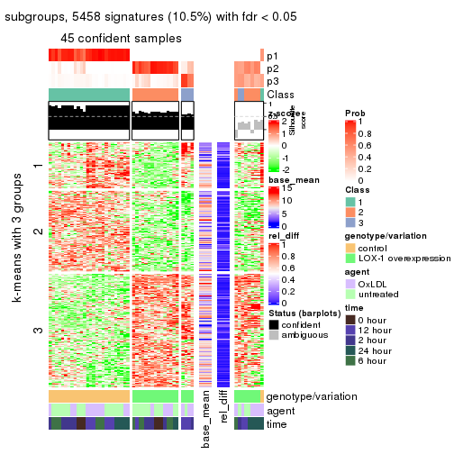</p>

</div>
<div id='tab-SD-NMF-get-signatures-3'>
<pre><code class="r">get_signatures(res, k = 4)
</code></pre>

<p>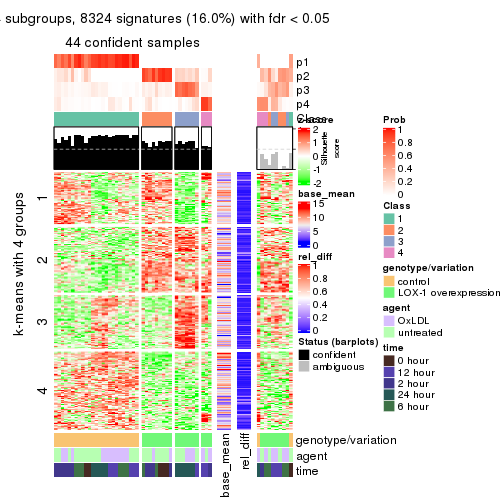</p>

</div>
<div id='tab-SD-NMF-get-signatures-4'>
<pre><code class="r">get_signatures(res, k = 5)
</code></pre>

<p>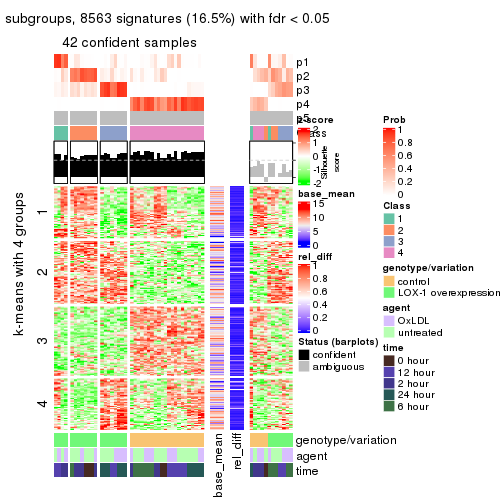</p>

</div>
<div id='tab-SD-NMF-get-signatures-5'>
<pre><code class="r">get_signatures(res, k = 6)
</code></pre>

<p>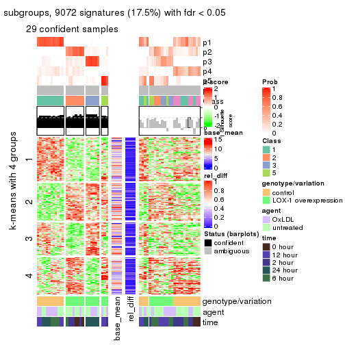</p>

</div>
</div>


Signature heatmaps where rows are not scaled:


<script>
$( function() {
	$( '#tabs-SD-NMF-get-signatures-no-scale' ).tabs();
} );
</script>
<div id='tabs-SD-NMF-get-signatures-no-scale'>
<ul>
<li><a href='#tab-SD-NMF-get-signatures-no-scale-1'>k = 2</a></li>
<li><a href='#tab-SD-NMF-get-signatures-no-scale-2'>k = 3</a></li>
<li><a href='#tab-SD-NMF-get-signatures-no-scale-3'>k = 4</a></li>
<li><a href='#tab-SD-NMF-get-signatures-no-scale-4'>k = 5</a></li>
<li><a href='#tab-SD-NMF-get-signatures-no-scale-5'>k = 6</a></li>
</ul>
<div id='tab-SD-NMF-get-signatures-no-scale-1'>
<pre><code class="r">get_signatures(res, k = 2, scale_rows = FALSE)
</code></pre>

<p></p>

</div>
<div id='tab-SD-NMF-get-signatures-no-scale-2'>
<pre><code class="r">get_signatures(res, k = 3, scale_rows = FALSE)
</code></pre>

<p>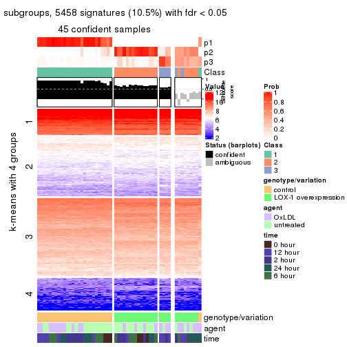</p>

</div>
<div id='tab-SD-NMF-get-signatures-no-scale-3'>
<pre><code class="r">get_signatures(res, k = 4, scale_rows = FALSE)
</code></pre>

<p>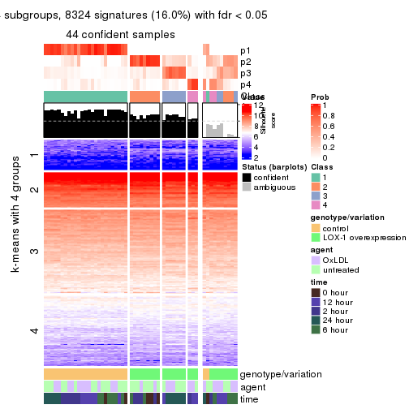</p>

</div>
<div id='tab-SD-NMF-get-signatures-no-scale-4'>
<pre><code class="r">get_signatures(res, k = 5, scale_rows = FALSE)
</code></pre>

<p>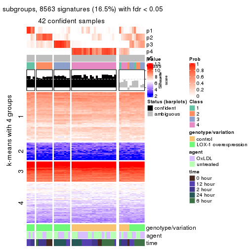</p>

</div>
<div id='tab-SD-NMF-get-signatures-no-scale-5'>
<pre><code class="r">get_signatures(res, k = 6, scale_rows = FALSE)
</code></pre>

<p>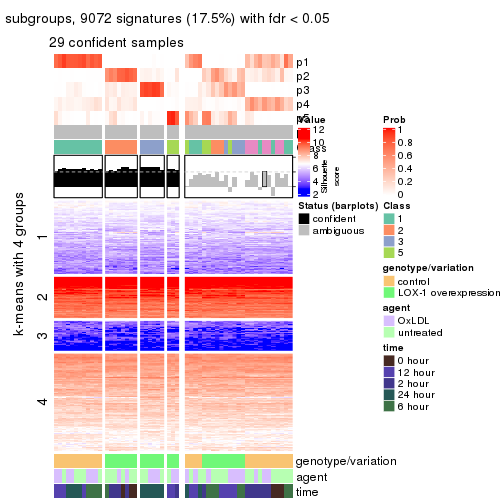</p>

</div>
</div>


Compare the overlap of signatures from different k:

```r
compare_signatures(res)
```

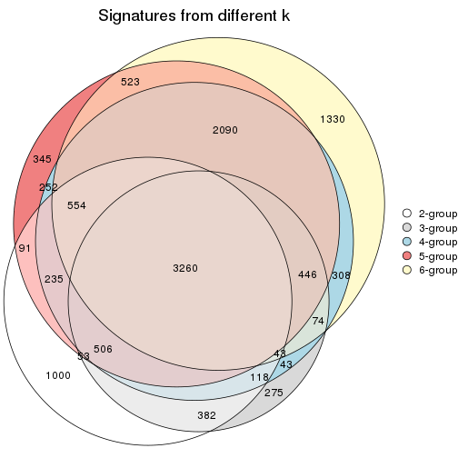

`get_signature()` returns a data frame invisibly. TO get the list of signatures, the function
call should be assigned to a variable explicitly. In following code, if `plot` argument is set
to `FALSE`, no heatmap is plotted while only the differential analysis is performed.

```r
# code only for demonstration
tb = get_signature(res, k = ..., plot = FALSE)
```

An example of the output of `tb` is:

```
#>   which_row         fdr    mean_1    mean_2 scaled_mean_1 scaled_mean_2 km
#> 1        38 0.042760348  8.373488  9.131774    -0.5533452     0.5164555  1
#> 2        40 0.018707592  7.106213  8.469186    -0.6173731     0.5762149  1
#> 3        55 0.019134737 10.221463 11.207825    -0.6159697     0.5749050  1
#> 4        59 0.006059896  5.921854  7.869574    -0.6899429     0.6439467  1
#> 5        60 0.018055526  8.928898 10.211722    -0.6204761     0.5791110  1
#> 6        98 0.009384629 15.714769 14.887706     0.6635654    -0.6193277  2
...
```

The columns in `tb` are:

1. `which_row`: row indices corresponding to the input matrix.
2. `fdr`: FDR for the differential test. 
3. `mean_x`: The mean value in group x.
4. `scaled_mean_x`: The mean value in group x after rows are scaled.
5. `km`: Row groups if k-means clustering is applied to rows.


UMAP plot which shows how samples are separated.


<script>
$( function() {
	$( '#tabs-SD-NMF-dimension-reduction' ).tabs();
} );
</script>
<div id='tabs-SD-NMF-dimension-reduction'>
<ul>
<li><a href='#tab-SD-NMF-dimension-reduction-1'>k = 2</a></li>
<li><a href='#tab-SD-NMF-dimension-reduction-2'>k = 3</a></li>
<li><a href='#tab-SD-NMF-dimension-reduction-3'>k = 4</a></li>
<li><a href='#tab-SD-NMF-dimension-reduction-4'>k = 5</a></li>
<li><a href='#tab-SD-NMF-dimension-reduction-5'>k = 6</a></li>
</ul>
<div id='tab-SD-NMF-dimension-reduction-1'>
<pre><code class="r">dimension_reduction(res, k = 2, method = &quot;UMAP&quot;)
</code></pre>

<p>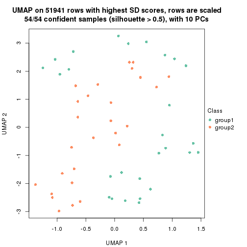</p>

</div>
<div id='tab-SD-NMF-dimension-reduction-2'>
<pre><code class="r">dimension_reduction(res, k = 3, method = &quot;UMAP&quot;)
</code></pre>

<p>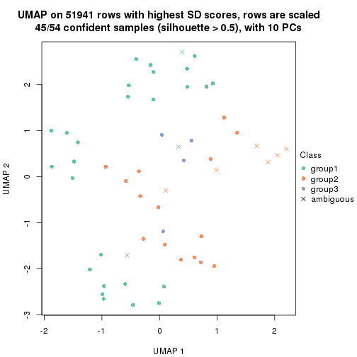</p>

</div>
<div id='tab-SD-NMF-dimension-reduction-3'>
<pre><code class="r">dimension_reduction(res, k = 4, method = &quot;UMAP&quot;)
</code></pre>

<p>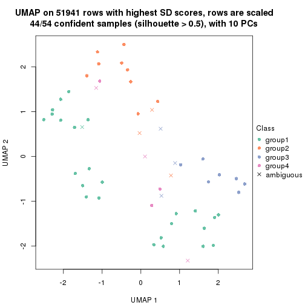</p>

</div>
<div id='tab-SD-NMF-dimension-reduction-4'>
<pre><code class="r">dimension_reduction(res, k = 5, method = &quot;UMAP&quot;)
</code></pre>

<p>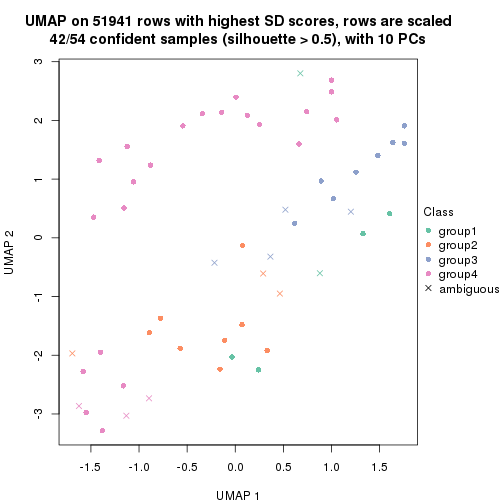</p>

</div>
<div id='tab-SD-NMF-dimension-reduction-5'>
<pre><code class="r">dimension_reduction(res, k = 6, method = &quot;UMAP&quot;)
</code></pre>

<p>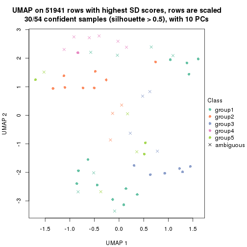</p>

</div>
</div>


Following heatmap shows how subgroups are split when increasing `k`:

```r
collect_classes(res)
```

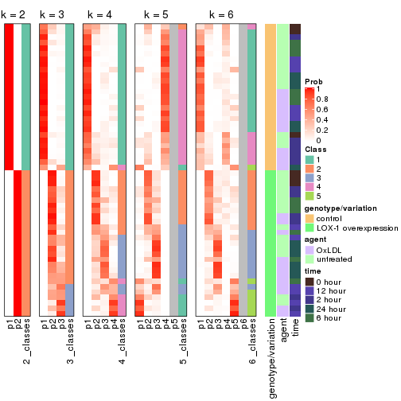


Test correlation between subgroups and known annotations. If the known
annotation is numeric, one-way ANOVA test is applied, and if the known
annotation is discrete, chi-squared contingency table test is applied.

```r
test_to_known_factors(res)
```

```
#>         n genotype/variation(p) agent(p)  time(p) k
#> SD:NMF 54              1.48e-12    1.000 1.000000 2
#> SD:NMF 45              1.69e-10    0.201 0.252569 3
#> SD:NMF 44              1.51e-09    0.525 0.003201 4
#> SD:NMF 42              4.01e-09    0.741 0.002653 5
#> SD:NMF 30              4.89e-06    0.453 0.000395 6
```


If matrix rows can be associated to genes, consider to use `functional_enrichment(res,
...)` to perform function enrichment for the signature genes. See [this vignette](http://bioconductor.org/packages/devel/bioc/vignettes/cola/inst/doc/functional_enrichment.html) for more detailed explanations.


 

---------------------------------------------------


### CV:hclust*


The object with results only for a single top-value method and a single partition method 
can be extracted as:

```r
res = res_list["CV", "hclust"]
# you can also extract it by
# res = res_list["CV:hclust"]
```

A summary of `res` and all the functions that can be applied to it:

```r
res
```

```
#> A 'ConsensusPartition' object with k = 2, 3, 4, 5, 6.
#>   On a matrix with 51941 rows and 54 columns.
#>   Top rows (1000, 2000, 3000, 4000, 5000) are extracted by 'CV' method.
#>   Subgroups are detected by 'hclust' method.
#>   Performed in total 1250 partitions by row resampling.
#>   Best k for subgroups seems to be 2.
#> 
#> Following methods can be applied to this 'ConsensusPartition' object:
#>  [1] "cola_report"             "collect_classes"         "collect_plots"          
#>  [4] "collect_stats"           "colnames"                "compare_signatures"     
#>  [7] "consensus_heatmap"       "dimension_reduction"     "functional_enrichment"  
#> [10] "get_anno_col"            "get_anno"                "get_classes"            
#> [13] "get_consensus"           "get_matrix"              "get_membership"         
#> [16] "get_param"               "get_signatures"          "get_stats"              
#> [19] "is_best_k"               "is_stable_k"             "membership_heatmap"     
#> [22] "ncol"                    "nrow"                    "plot_ecdf"              
#> [25] "rownames"                "select_partition_number" "show"                   
#> [28] "suggest_best_k"          "test_to_known_factors"
```

`collect_plots()` function collects all the plots made from `res` for all `k` (number of partitions)
into one single page to provide an easy and fast comparison between different `k`.

```r
collect_plots(res)
```

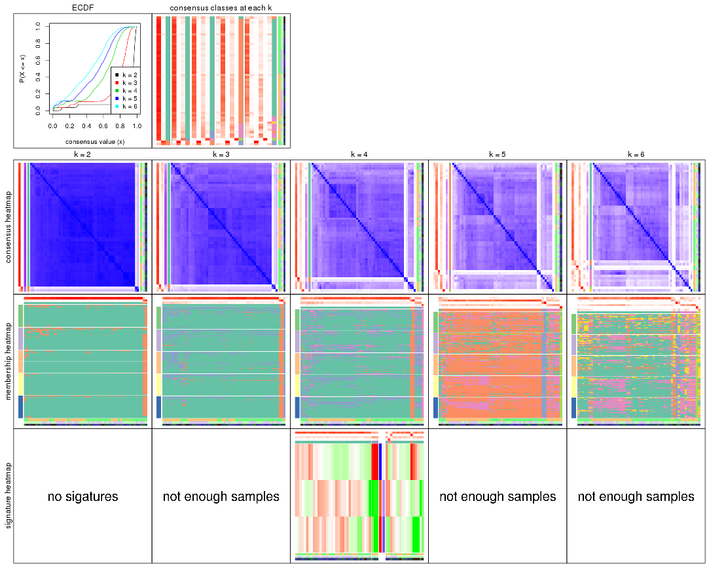

The plots are:

- The first row: a plot of the ECDF (empirical cumulative distribution
  function) curves of the consensus matrix for each `k` and the heatmap of
  predicted classes for each `k`.
- The second row: heatmaps of the consensus matrix for each `k`.
- The third row: heatmaps of the membership matrix for each `k`.
- The fouth row: heatmaps of the signatures for each `k`.

All the plots in panels can be made by individual functions and they are
plotted later in this section.

`select_partition_number()` produces several plots showing different
statistics for choosing "optimized" `k`. There are following statistics:

- ECDF curves of the consensus matrix for each `k`;
- 1-PAC. [The PAC
  score](https://en.wikipedia.org/wiki/Consensus_clustering#Over-interpretation_potential_of_consensus_clustering)
  measures the proportion of the ambiguous subgrouping.
- Mean silhouette score.
- Concordance. The mean probability of fiting the consensus class ids in all
  partitions.
- Area increased. Denote $A_k$ as the area under the ECDF curve for current
  `k`, the area increased is defined as $A_k - A_{k-1}$.
- Rand index. The percent of pairs of samples that are both in a same cluster
  or both are not in a same cluster in the partition of k and k-1.
- Jaccard index. The ratio of pairs of samples are both in a same cluster in
  the partition of k and k-1 and the pairs of samples are both in a same
  cluster in the partition k or k-1.

The detailed explanations of these statistics can be found in [the _cola_
vignette](http://bioconductor.org/packages/devel/bioc/vignettes/cola/inst/doc/cola.html#toc_13).

Generally speaking, lower PAC score, higher mean silhouette score or higher
concordance corresponds to better partition. Rand index and Jaccard index
measure how similar the current partition is compared to partition with `k-1`.
If they are too similar, we won't accept `k` is better than `k-1`.

```r
select_partition_number(res)
```

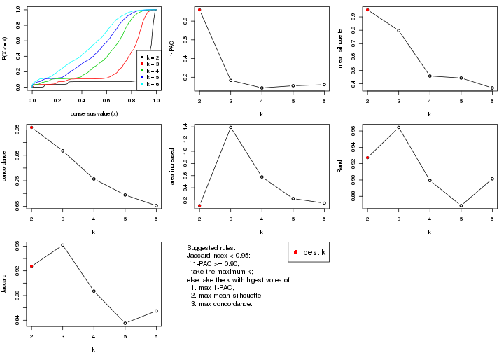

The numeric values for all these statistics can be obtained by `get_stats()`.

```r
get_stats(res)
```

```
#>   k  1-PAC mean_silhouette concordance area_increased  Rand Jaccard
#> 2 2 0.9208           0.953       0.960          0.108 0.927   0.927
#> 3 3 0.1663           0.798       0.867          1.391 0.964   0.962
#> 4 4 0.0863           0.458       0.757          0.579 0.899   0.887
#> 5 5 0.1094           0.443       0.694          0.223 0.869   0.835
#> 6 6 0.1208           0.369       0.652          0.148 0.901   0.855
```

`suggest_best_k()` suggests the best $k$ based on these statistics. The rules are as follows:

- All $k$ with Jaccard index larger than 0.95 are removed because increasing
  $k$ does not provide enough extra information. If all $k$ are removed, it is
  marked as no subgroup is detected.
- For all $k$ with 1-PAC score larger than 0.9, the maximal $k$ is taken as
  the best $k$, and other $k$ are marked as optional $k$.
- If it does not fit the second rule. The $k$ with the maximal vote of the
  highest 1-PAC score, highest mean silhouette, and highest concordance is
  taken as the best $k$.

```r
suggest_best_k(res)
```

```
#> [1] 2
```


Following shows the table of the partitions (You need to click the **show/hide
code output** link to see it). The membership matrix (columns with name `p*`)
is inferred by
[`clue::cl_consensus()`](https://www.rdocumentation.org/link/cl_consensus?package=clue)
function with the `SE` method. Basically the value in the membership matrix
represents the probability to belong to a certain group. The finall class
label for an item is determined with the group with highest probability it
belongs to.

In `get_classes()` function, the entropy is calculated from the membership
matrix and the silhouette score is calculated from the consensus matrix.


<script>
$( function() {
	$( '#tabs-CV-hclust-get-classes' ).tabs();
} );
</script>
<div id='tabs-CV-hclust-get-classes'>
<ul>
<li><a href='#tab-CV-hclust-get-classes-1'>k = 2</a></li>
<li><a href='#tab-CV-hclust-get-classes-2'>k = 3</a></li>
<li><a href='#tab-CV-hclust-get-classes-3'>k = 4</a></li>
<li><a href='#tab-CV-hclust-get-classes-4'>k = 5</a></li>
<li><a href='#tab-CV-hclust-get-classes-5'>k = 6</a></li>
</ul>

<div id='tab-CV-hclust-get-classes-1'>
<p><a id='tab-CV-hclust-get-classes-1-a' style='color:#0366d6' href='#'>show/hide code output</a></p>
<pre><code class="r">cbind(get_classes(res, k = 2), get_membership(res, k = 2))
</code></pre>

<pre><code>#&gt;           class entropy silhouette    p1    p2
#&gt; GSM329068     1  0.1843      0.971 0.972 0.028
#&gt; GSM329074     1  0.2236      0.969 0.964 0.036
#&gt; GSM329100     1  0.5294      0.869 0.880 0.120
#&gt; GSM329062     1  0.1184      0.969 0.984 0.016
#&gt; GSM329079     1  0.1184      0.971 0.984 0.016
#&gt; GSM329090     1  0.1843      0.970 0.972 0.028
#&gt; GSM329066     1  0.1184      0.971 0.984 0.016
#&gt; GSM329086     1  0.5408      0.868 0.876 0.124
#&gt; GSM329099     1  0.1184      0.971 0.984 0.016
#&gt; GSM329071     1  0.1633      0.970 0.976 0.024
#&gt; GSM329078     1  0.1414      0.970 0.980 0.020
#&gt; GSM329081     1  0.2043      0.967 0.968 0.032
#&gt; GSM329096     1  0.1633      0.969 0.976 0.024
#&gt; GSM329102     1  0.2043      0.967 0.968 0.032
#&gt; GSM329104     2  0.4562      0.779 0.096 0.904
#&gt; GSM329067     1  0.3114      0.950 0.944 0.056
#&gt; GSM329072     1  0.1414      0.969 0.980 0.020
#&gt; GSM329075     1  0.0672      0.970 0.992 0.008
#&gt; GSM329058     1  0.2948      0.957 0.948 0.052
#&gt; GSM329073     2  0.8661      0.719 0.288 0.712
#&gt; GSM329107     1  0.1414      0.969 0.980 0.020
#&gt; GSM329057     1  0.2043      0.968 0.968 0.032
#&gt; GSM329085     1  0.1184      0.969 0.984 0.016
#&gt; GSM329089     1  0.1633      0.971 0.976 0.024
#&gt; GSM329076     1  0.1184      0.971 0.984 0.016
#&gt; GSM329094     1  0.1843      0.968 0.972 0.028
#&gt; GSM329105     1  0.1414      0.971 0.980 0.020
#&gt; GSM329056     1  0.2423      0.963 0.960 0.040
#&gt; GSM329069     1  0.3584      0.952 0.932 0.068
#&gt; GSM329077     1  0.2948      0.959 0.948 0.052
#&gt; GSM329070     1  0.3114      0.954 0.944 0.056
#&gt; GSM329082     1  0.1633      0.971 0.976 0.024
#&gt; GSM329092     1  0.4939      0.901 0.892 0.108
#&gt; GSM329083     1  0.3733      0.939 0.928 0.072
#&gt; GSM329101     1  0.1184      0.969 0.984 0.016
#&gt; GSM329106     1  0.3431      0.947 0.936 0.064
#&gt; GSM329087     1  0.0938      0.971 0.988 0.012
#&gt; GSM329091     1  0.0938      0.970 0.988 0.012
#&gt; GSM329093     1  0.1414      0.970 0.980 0.020
#&gt; GSM329080     1  0.1184      0.969 0.984 0.016
#&gt; GSM329084     1  0.3879      0.937 0.924 0.076
#&gt; GSM329088     1  0.1414      0.969 0.980 0.020
#&gt; GSM329059     1  0.3733      0.945 0.928 0.072
#&gt; GSM329097     1  0.1184      0.970 0.984 0.016
#&gt; GSM329098     1  0.2043      0.970 0.968 0.032
#&gt; GSM329055     1  0.0672      0.970 0.992 0.008
#&gt; GSM329103     1  0.1843      0.971 0.972 0.028
#&gt; GSM329108     1  0.1633      0.970 0.976 0.024
#&gt; GSM329061     1  0.1633      0.970 0.976 0.024
#&gt; GSM329064     1  0.1633      0.970 0.976 0.024
#&gt; GSM329065     1  0.0938      0.969 0.988 0.012
#&gt; GSM329060     1  0.0376      0.971 0.996 0.004
#&gt; GSM329063     1  0.2948      0.957 0.948 0.052
#&gt; GSM329095     1  0.1633      0.971 0.976 0.024
</code></pre>

<script>
$('#tab-CV-hclust-get-classes-1-a').parent().next().next().hide();
$('#tab-CV-hclust-get-classes-1-a').click(function(){
  $('#tab-CV-hclust-get-classes-1-a').parent().next().next().toggle();
  return(false);
});
</script>
</div>

<div id='tab-CV-hclust-get-classes-2'>
<p><a id='tab-CV-hclust-get-classes-2-a' style='color:#0366d6' href='#'>show/hide code output</a></p>
<pre><code class="r">cbind(get_classes(res, k = 3), get_membership(res, k = 3))
</code></pre>

<pre><code>#&gt;           class entropy silhouette    p1    p2    p3
#&gt; GSM329068     1  0.3532      0.870 0.884 0.008 0.108
#&gt; GSM329074     1  0.3983      0.854 0.852 0.004 0.144
#&gt; GSM329100     1  0.7388      0.586 0.692 0.100 0.208
#&gt; GSM329062     1  0.2400      0.878 0.932 0.004 0.064
#&gt; GSM329079     1  0.1950      0.879 0.952 0.008 0.040
#&gt; GSM329090     1  0.2955      0.878 0.912 0.008 0.080
#&gt; GSM329066     1  0.2173      0.879 0.944 0.008 0.048
#&gt; GSM329086     1  0.6587      0.706 0.752 0.092 0.156
#&gt; GSM329099     1  0.2173      0.880 0.944 0.008 0.048
#&gt; GSM329071     1  0.2774      0.872 0.920 0.008 0.072
#&gt; GSM329078     1  0.3043      0.874 0.908 0.008 0.084
#&gt; GSM329081     1  0.4195      0.848 0.852 0.012 0.136
#&gt; GSM329096     1  0.2749      0.874 0.924 0.012 0.064
#&gt; GSM329102     1  0.3910      0.863 0.876 0.020 0.104
#&gt; GSM329104     2  0.0424      0.466 0.008 0.992 0.000
#&gt; GSM329067     1  0.4915      0.765 0.804 0.012 0.184
#&gt; GSM329072     1  0.2584      0.873 0.928 0.008 0.064
#&gt; GSM329075     1  0.1964      0.881 0.944 0.000 0.056
#&gt; GSM329058     1  0.4249      0.860 0.864 0.028 0.108
#&gt; GSM329073     2  0.6794      0.228 0.196 0.728 0.076
#&gt; GSM329107     1  0.2200      0.880 0.940 0.004 0.056
#&gt; GSM329057     1  0.3886      0.867 0.880 0.024 0.096
#&gt; GSM329085     1  0.2860      0.873 0.912 0.004 0.084
#&gt; GSM329089     1  0.2955      0.876 0.912 0.008 0.080
#&gt; GSM329076     1  0.2496      0.880 0.928 0.004 0.068
#&gt; GSM329094     1  0.3610      0.863 0.888 0.016 0.096
#&gt; GSM329105     1  0.2446      0.880 0.936 0.012 0.052
#&gt; GSM329056     1  0.4228      0.838 0.844 0.008 0.148
#&gt; GSM329069     1  0.5012      0.793 0.788 0.008 0.204
#&gt; GSM329077     1  0.5378      0.750 0.756 0.008 0.236
#&gt; GSM329070     1  0.5692      0.695 0.724 0.008 0.268
#&gt; GSM329082     1  0.3607      0.869 0.880 0.008 0.112
#&gt; GSM329092     3  0.5986      0.000 0.284 0.012 0.704
#&gt; GSM329083     1  0.6172      0.583 0.680 0.012 0.308
#&gt; GSM329101     1  0.2959      0.865 0.900 0.000 0.100
#&gt; GSM329106     1  0.5982      0.721 0.744 0.028 0.228
#&gt; GSM329087     1  0.1964      0.880 0.944 0.000 0.056
#&gt; GSM329091     1  0.2796      0.870 0.908 0.000 0.092
#&gt; GSM329093     1  0.2774      0.882 0.920 0.008 0.072
#&gt; GSM329080     1  0.2448      0.871 0.924 0.000 0.076
#&gt; GSM329084     1  0.6209      0.414 0.628 0.004 0.368
#&gt; GSM329088     1  0.3272      0.867 0.892 0.004 0.104
#&gt; GSM329059     1  0.5517      0.712 0.728 0.004 0.268
#&gt; GSM329097     1  0.2860      0.880 0.912 0.004 0.084
#&gt; GSM329098     1  0.3500      0.874 0.880 0.004 0.116
#&gt; GSM329055     1  0.1860      0.874 0.948 0.000 0.052
#&gt; GSM329103     1  0.2772      0.881 0.916 0.004 0.080
#&gt; GSM329108     1  0.2682      0.879 0.920 0.004 0.076
#&gt; GSM329061     1  0.3030      0.877 0.904 0.004 0.092
#&gt; GSM329064     1  0.3532      0.878 0.884 0.008 0.108
#&gt; GSM329065     1  0.2261      0.872 0.932 0.000 0.068
#&gt; GSM329060     1  0.2261      0.879 0.932 0.000 0.068
#&gt; GSM329063     1  0.5156      0.771 0.776 0.008 0.216
#&gt; GSM329095     1  0.3532      0.876 0.884 0.008 0.108
</code></pre>

<script>
$('#tab-CV-hclust-get-classes-2-a').parent().next().next().hide();
$('#tab-CV-hclust-get-classes-2-a').click(function(){
  $('#tab-CV-hclust-get-classes-2-a').parent().next().next().toggle();
  return(false);
});
</script>
</div>

<div id='tab-CV-hclust-get-classes-3'>
<p><a id='tab-CV-hclust-get-classes-3-a' style='color:#0366d6' href='#'>show/hide code output</a></p>
<pre><code class="r">cbind(get_classes(res, k = 4), get_membership(res, k = 4))
</code></pre>

<pre><code>#&gt;           class entropy silhouette    p1    p2    p3    p4
#&gt; GSM329068     1  0.4961     0.5407 0.748 0.004 0.212 0.036
#&gt; GSM329074     1  0.5141     0.4382 0.700 0.000 0.268 0.032
#&gt; GSM329100     1  0.8172    -0.3512 0.480 0.100 0.352 0.068
#&gt; GSM329062     1  0.3088     0.6403 0.864 0.000 0.128 0.008
#&gt; GSM329079     1  0.2466     0.6414 0.900 0.004 0.096 0.000
#&gt; GSM329090     1  0.2839     0.6439 0.884 0.004 0.108 0.004
#&gt; GSM329066     1  0.3072     0.6391 0.868 0.004 0.124 0.004
#&gt; GSM329086     1  0.6642     0.2372 0.612 0.060 0.304 0.024
#&gt; GSM329099     1  0.3128     0.6390 0.864 0.004 0.128 0.004
#&gt; GSM329071     1  0.3102     0.6373 0.872 0.004 0.116 0.008
#&gt; GSM329078     1  0.3271     0.6356 0.856 0.000 0.132 0.012
#&gt; GSM329081     1  0.4574     0.5126 0.768 0.008 0.208 0.016
#&gt; GSM329096     1  0.3236     0.6368 0.856 0.004 0.136 0.004
#&gt; GSM329102     1  0.4505     0.5907 0.788 0.008 0.180 0.024
#&gt; GSM329104     2  0.0188     0.3613 0.000 0.996 0.004 0.000
#&gt; GSM329067     1  0.6873     0.0368 0.560 0.004 0.328 0.108
#&gt; GSM329072     1  0.3224     0.6429 0.864 0.000 0.120 0.016
#&gt; GSM329075     1  0.2814     0.6414 0.868 0.000 0.132 0.000
#&gt; GSM329058     1  0.4814     0.5716 0.780 0.024 0.176 0.020
#&gt; GSM329073     2  0.6774     0.3593 0.160 0.684 0.108 0.048
#&gt; GSM329107     1  0.2737     0.6510 0.888 0.000 0.104 0.008
#&gt; GSM329057     1  0.3949     0.6163 0.832 0.016 0.140 0.012
#&gt; GSM329085     1  0.3032     0.6400 0.868 0.000 0.124 0.008
#&gt; GSM329089     1  0.3575     0.6451 0.844 0.008 0.140 0.008
#&gt; GSM329076     1  0.3105     0.6447 0.856 0.004 0.140 0.000
#&gt; GSM329094     1  0.3829     0.6087 0.828 0.004 0.152 0.016
#&gt; GSM329105     1  0.3043     0.6455 0.876 0.008 0.112 0.004
#&gt; GSM329056     1  0.5563     0.1633 0.636 0.008 0.336 0.020
#&gt; GSM329069     1  0.6691    -0.0750 0.548 0.004 0.364 0.084
#&gt; GSM329077     1  0.5937    -0.0877 0.608 0.000 0.340 0.052
#&gt; GSM329070     3  0.6434     0.6078 0.448 0.008 0.496 0.048
#&gt; GSM329082     1  0.4579     0.5933 0.768 0.000 0.200 0.032
#&gt; GSM329092     4  0.3959     0.0000 0.068 0.000 0.092 0.840
#&gt; GSM329083     3  0.6645     0.7089 0.420 0.004 0.504 0.072
#&gt; GSM329101     1  0.4542     0.4636 0.752 0.000 0.228 0.020
#&gt; GSM329106     1  0.6951    -0.5975 0.488 0.024 0.432 0.056
#&gt; GSM329087     1  0.3539     0.5746 0.820 0.000 0.176 0.004
#&gt; GSM329091     1  0.4399     0.4909 0.760 0.000 0.224 0.016
#&gt; GSM329093     1  0.3907     0.6214 0.808 0.004 0.180 0.008
#&gt; GSM329080     1  0.4284     0.4940 0.780 0.000 0.200 0.020
#&gt; GSM329084     3  0.7179     0.6024 0.408 0.000 0.456 0.136
#&gt; GSM329088     1  0.4857     0.4418 0.740 0.004 0.232 0.024
#&gt; GSM329059     1  0.6447    -0.4141 0.484 0.000 0.448 0.068
#&gt; GSM329097     1  0.4049     0.5781 0.780 0.000 0.212 0.008
#&gt; GSM329098     1  0.4360     0.5330 0.744 0.000 0.248 0.008
#&gt; GSM329055     1  0.3636     0.5629 0.820 0.000 0.172 0.008
#&gt; GSM329103     1  0.3636     0.6148 0.820 0.000 0.172 0.008
#&gt; GSM329108     1  0.3529     0.6005 0.836 0.000 0.152 0.012
#&gt; GSM329061     1  0.4034     0.5981 0.804 0.004 0.180 0.012
#&gt; GSM329064     1  0.4479     0.5692 0.760 0.008 0.224 0.008
#&gt; GSM329065     1  0.3895     0.5466 0.804 0.000 0.184 0.012
#&gt; GSM329060     1  0.3810     0.6024 0.804 0.000 0.188 0.008
#&gt; GSM329063     1  0.5836     0.1897 0.640 0.000 0.304 0.056
#&gt; GSM329095     1  0.4114     0.6113 0.788 0.004 0.200 0.008
</code></pre>

<script>
$('#tab-CV-hclust-get-classes-3-a').parent().next().next().hide();
$('#tab-CV-hclust-get-classes-3-a').click(function(){
  $('#tab-CV-hclust-get-classes-3-a').parent().next().next().toggle();
  return(false);
});
</script>
</div>

<div id='tab-CV-hclust-get-classes-4'>
<p><a id='tab-CV-hclust-get-classes-4-a' style='color:#0366d6' href='#'>show/hide code output</a></p>
<pre><code class="r">cbind(get_classes(res, k = 5), get_membership(res, k = 5))
</code></pre>

<pre><code>#&gt;           class entropy silhouette    p1    p2    p3    p4    p5
#&gt; GSM329068     2   0.540     0.5037 0.088 0.692 0.000 0.200 0.020
#&gt; GSM329074     2   0.639     0.2395 0.148 0.560 0.000 0.276 0.016
#&gt; GSM329100     1   0.807     0.0000 0.428 0.300 0.096 0.164 0.012
#&gt; GSM329062     2   0.389     0.6201 0.060 0.808 0.000 0.128 0.004
#&gt; GSM329079     2   0.306     0.6276 0.036 0.856 0.000 0.108 0.000
#&gt; GSM329090     2   0.318     0.6251 0.048 0.860 0.000 0.088 0.004
#&gt; GSM329066     2   0.360     0.6263 0.036 0.820 0.000 0.140 0.004
#&gt; GSM329086     2   0.726     0.0567 0.172 0.508 0.028 0.276 0.016
#&gt; GSM329099     2   0.369     0.6238 0.028 0.804 0.000 0.164 0.004
#&gt; GSM329071     2   0.317     0.6179 0.024 0.848 0.000 0.124 0.004
#&gt; GSM329078     2   0.347     0.6099 0.052 0.840 0.000 0.104 0.004
#&gt; GSM329081     2   0.539     0.4679 0.144 0.692 0.004 0.156 0.004
#&gt; GSM329096     2   0.331     0.6227 0.020 0.832 0.000 0.144 0.004
#&gt; GSM329102     2   0.468     0.5762 0.072 0.764 0.004 0.148 0.012
#&gt; GSM329104     3   0.029     0.4657 0.000 0.000 0.992 0.008 0.000
#&gt; GSM329067     2   0.790    -0.4586 0.280 0.392 0.004 0.260 0.064
#&gt; GSM329072     2   0.332     0.6184 0.032 0.848 0.000 0.112 0.008
#&gt; GSM329075     2   0.328     0.6269 0.032 0.836 0.000 0.132 0.000
#&gt; GSM329058     2   0.586     0.4639 0.108 0.672 0.016 0.192 0.012
#&gt; GSM329073     3   0.682     0.4810 0.228 0.096 0.600 0.064 0.012
#&gt; GSM329107     2   0.303     0.6350 0.020 0.856 0.000 0.120 0.004
#&gt; GSM329057     2   0.483     0.5406 0.100 0.752 0.008 0.136 0.004
#&gt; GSM329085     2   0.316     0.6175 0.036 0.848 0.000 0.116 0.000
#&gt; GSM329089     2   0.373     0.6249 0.036 0.808 0.000 0.152 0.004
#&gt; GSM329076     2   0.328     0.6274 0.020 0.824 0.000 0.156 0.000
#&gt; GSM329094     2   0.379     0.5929 0.036 0.816 0.000 0.136 0.012
#&gt; GSM329105     2   0.299     0.6269 0.016 0.864 0.004 0.112 0.004
#&gt; GSM329056     2   0.577     0.0416 0.056 0.516 0.004 0.416 0.008
#&gt; GSM329069     4   0.712     0.2939 0.108 0.404 0.000 0.424 0.064
#&gt; GSM329077     2   0.685    -0.2109 0.136 0.476 0.000 0.356 0.032
#&gt; GSM329070     4   0.609     0.5127 0.056 0.300 0.004 0.600 0.040
#&gt; GSM329082     2   0.468     0.5780 0.028 0.736 0.000 0.208 0.028
#&gt; GSM329092     5   0.165     0.0000 0.000 0.020 0.000 0.040 0.940
#&gt; GSM329083     4   0.685     0.4509 0.152 0.268 0.004 0.544 0.032
#&gt; GSM329101     2   0.482     0.3756 0.016 0.632 0.000 0.340 0.012
#&gt; GSM329106     4   0.656     0.4953 0.056 0.336 0.012 0.548 0.048
#&gt; GSM329087     2   0.379     0.5297 0.000 0.724 0.000 0.272 0.004
#&gt; GSM329091     2   0.494     0.4115 0.028 0.652 0.000 0.308 0.012
#&gt; GSM329093     2   0.410     0.5825 0.012 0.724 0.000 0.260 0.004
#&gt; GSM329080     2   0.442     0.4115 0.008 0.668 0.000 0.316 0.008
#&gt; GSM329084     4   0.805     0.1655 0.268 0.312 0.000 0.332 0.088
#&gt; GSM329088     2   0.495     0.3301 0.020 0.616 0.000 0.352 0.012
#&gt; GSM329059     4   0.720     0.1329 0.220 0.316 0.000 0.436 0.028
#&gt; GSM329097     2   0.440     0.4968 0.016 0.656 0.000 0.328 0.000
#&gt; GSM329098     2   0.486     0.4944 0.048 0.656 0.000 0.296 0.000
#&gt; GSM329055     2   0.374     0.5223 0.000 0.732 0.000 0.264 0.004
#&gt; GSM329103     2   0.381     0.5952 0.020 0.780 0.000 0.196 0.004
#&gt; GSM329108     2   0.403     0.5753 0.020 0.764 0.000 0.208 0.008
#&gt; GSM329061     2   0.424     0.5509 0.016 0.712 0.000 0.268 0.004
#&gt; GSM329064     2   0.475     0.5280 0.036 0.676 0.000 0.284 0.004
#&gt; GSM329065     2   0.404     0.4967 0.004 0.704 0.000 0.288 0.004
#&gt; GSM329060     2   0.453     0.5530 0.040 0.700 0.000 0.260 0.000
#&gt; GSM329063     2   0.660     0.1552 0.120 0.564 0.000 0.276 0.040
#&gt; GSM329095     2   0.454     0.5870 0.048 0.740 0.000 0.204 0.008
</code></pre>

<script>
$('#tab-CV-hclust-get-classes-4-a').parent().next().next().hide();
$('#tab-CV-hclust-get-classes-4-a').click(function(){
  $('#tab-CV-hclust-get-classes-4-a').parent().next().next().toggle();
  return(false);
});
</script>
</div>

<div id='tab-CV-hclust-get-classes-5'>
<p><a id='tab-CV-hclust-get-classes-5-a' style='color:#0366d6' href='#'>show/hide code output</a></p>
<pre><code class="r">cbind(get_classes(res, k = 6), get_membership(res, k = 6))
</code></pre>

<pre><code>#&gt;           class entropy silhouette    p1    p2    p3    p4    p5    p6
#&gt; GSM329068     1  0.5799    0.43709 0.652 0.036 0.004 0.144 0.012 0.152
#&gt; GSM329074     1  0.7094    0.18634 0.488 0.124 0.000 0.228 0.008 0.152
#&gt; GSM329100     2  0.8526   -0.01270 0.200 0.364 0.084 0.092 0.016 0.244
#&gt; GSM329062     1  0.4355    0.60222 0.756 0.032 0.000 0.148 0.000 0.064
#&gt; GSM329079     1  0.3590    0.60114 0.800 0.028 0.000 0.152 0.000 0.020
#&gt; GSM329090     1  0.3836    0.61500 0.816 0.052 0.000 0.084 0.004 0.044
#&gt; GSM329066     1  0.3650    0.60723 0.808 0.032 0.000 0.136 0.004 0.020
#&gt; GSM329086     1  0.7163   -0.29808 0.452 0.060 0.024 0.180 0.000 0.284
#&gt; GSM329099     1  0.3999    0.60222 0.772 0.040 0.000 0.168 0.004 0.016
#&gt; GSM329071     1  0.3890    0.60559 0.804 0.016 0.004 0.116 0.004 0.056
#&gt; GSM329078     1  0.3962    0.58923 0.800 0.028 0.000 0.108 0.004 0.060
#&gt; GSM329081     1  0.5879    0.41593 0.652 0.132 0.000 0.068 0.012 0.136
#&gt; GSM329096     1  0.3437    0.61483 0.832 0.024 0.008 0.112 0.000 0.024
#&gt; GSM329102     1  0.4850    0.56334 0.740 0.072 0.004 0.112 0.000 0.072
#&gt; GSM329104     3  0.0000    0.41736 0.000 0.000 1.000 0.000 0.000 0.000
#&gt; GSM329067     6  0.6092    0.00000 0.304 0.012 0.000 0.112 0.028 0.544
#&gt; GSM329072     1  0.3136    0.61051 0.844 0.020 0.000 0.108 0.000 0.028
#&gt; GSM329075     1  0.3224    0.60987 0.824 0.004 0.000 0.132 0.000 0.040
#&gt; GSM329058     1  0.6168    0.42029 0.624 0.056 0.008 0.160 0.008 0.144
#&gt; GSM329073     3  0.7403    0.42892 0.040 0.140 0.448 0.056 0.008 0.308
#&gt; GSM329107     1  0.3399    0.62157 0.836 0.020 0.000 0.100 0.004 0.040
#&gt; GSM329057     1  0.5599    0.45224 0.684 0.048 0.008 0.112 0.008 0.140
#&gt; GSM329085     1  0.3651    0.59790 0.812 0.024 0.000 0.116 0.000 0.048
#&gt; GSM329089     1  0.4271    0.60546 0.756 0.012 0.004 0.172 0.004 0.052
#&gt; GSM329076     1  0.3727    0.61319 0.792 0.020 0.004 0.160 0.000 0.024
#&gt; GSM329094     1  0.4115    0.58624 0.800 0.044 0.008 0.088 0.000 0.060
#&gt; GSM329105     1  0.2991    0.61929 0.872 0.016 0.008 0.072 0.004 0.028
#&gt; GSM329056     4  0.5434    0.13492 0.368 0.048 0.000 0.544 0.000 0.040
#&gt; GSM329069     4  0.6897    0.11684 0.248 0.032 0.000 0.504 0.040 0.176
#&gt; GSM329077     1  0.7535   -0.20933 0.356 0.204 0.000 0.332 0.020 0.088
#&gt; GSM329070     4  0.5749    0.32762 0.172 0.112 0.004 0.660 0.016 0.036
#&gt; GSM329082     1  0.4800    0.56439 0.716 0.056 0.000 0.192 0.012 0.024
#&gt; GSM329092     5  0.0891    0.00000 0.008 0.000 0.000 0.024 0.968 0.000
#&gt; GSM329083     4  0.6357    0.00346 0.120 0.308 0.000 0.520 0.012 0.040
#&gt; GSM329101     1  0.4392    0.13718 0.504 0.016 0.000 0.476 0.000 0.004
#&gt; GSM329106     4  0.5846    0.32172 0.164 0.068 0.004 0.664 0.016 0.084
#&gt; GSM329087     1  0.4206    0.39406 0.624 0.008 0.000 0.356 0.000 0.012
#&gt; GSM329091     1  0.4582    0.26469 0.552 0.024 0.000 0.416 0.000 0.008
#&gt; GSM329093     1  0.4382    0.54925 0.680 0.020 0.000 0.280 0.004 0.016
#&gt; GSM329080     1  0.3986    0.18659 0.532 0.004 0.000 0.464 0.000 0.000
#&gt; GSM329084     2  0.6848    0.14201 0.248 0.496 0.000 0.184 0.060 0.012
#&gt; GSM329088     4  0.4939   -0.17905 0.468 0.028 0.000 0.484 0.000 0.020
#&gt; GSM329059     4  0.7734   -0.28583 0.184 0.188 0.000 0.348 0.008 0.272
#&gt; GSM329097     1  0.4440    0.37402 0.556 0.016 0.000 0.420 0.000 0.008
#&gt; GSM329098     1  0.5486    0.45292 0.568 0.064 0.000 0.332 0.000 0.036
#&gt; GSM329055     1  0.4187    0.38615 0.624 0.004 0.000 0.356 0.000 0.016
#&gt; GSM329103     1  0.4304    0.55689 0.716 0.040 0.000 0.228 0.000 0.016
#&gt; GSM329108     1  0.4216    0.50853 0.676 0.020 0.000 0.292 0.000 0.012
#&gt; GSM329061     1  0.4854    0.50327 0.632 0.040 0.000 0.308 0.004 0.016
#&gt; GSM329064     1  0.5230    0.44298 0.580 0.052 0.000 0.344 0.004 0.020
#&gt; GSM329065     1  0.4024    0.34852 0.592 0.004 0.000 0.400 0.000 0.004
#&gt; GSM329060     1  0.4891    0.46713 0.612 0.028 0.000 0.328 0.000 0.032
#&gt; GSM329063     1  0.6736    0.16521 0.492 0.196 0.000 0.260 0.020 0.032
#&gt; GSM329095     1  0.5160    0.55463 0.680 0.084 0.000 0.192 0.000 0.044
</code></pre>

<script>
$('#tab-CV-hclust-get-classes-5-a').parent().next().next().hide();
$('#tab-CV-hclust-get-classes-5-a').click(function(){
  $('#tab-CV-hclust-get-classes-5-a').parent().next().next().toggle();
  return(false);
});
</script>
</div>
</div>

Heatmaps for the consensus matrix. It visualizes the probability of two
samples to be in a same group.


<script>
$( function() {
	$( '#tabs-CV-hclust-consensus-heatmap' ).tabs();
} );
</script>
<div id='tabs-CV-hclust-consensus-heatmap'>
<ul>
<li><a href='#tab-CV-hclust-consensus-heatmap-1'>k = 2</a></li>
<li><a href='#tab-CV-hclust-consensus-heatmap-2'>k = 3</a></li>
<li><a href='#tab-CV-hclust-consensus-heatmap-3'>k = 4</a></li>
<li><a href='#tab-CV-hclust-consensus-heatmap-4'>k = 5</a></li>
<li><a href='#tab-CV-hclust-consensus-heatmap-5'>k = 6</a></li>
</ul>
<div id='tab-CV-hclust-consensus-heatmap-1'>
<pre><code class="r">consensus_heatmap(res, k = 2)
</code></pre>

<p>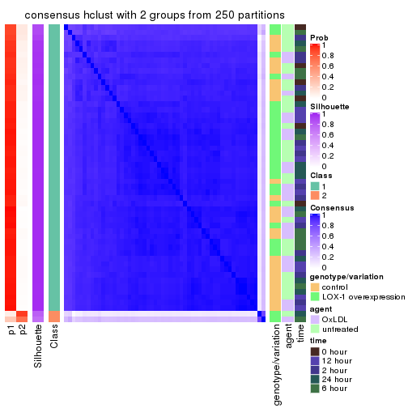</p>

</div>
<div id='tab-CV-hclust-consensus-heatmap-2'>
<pre><code class="r">consensus_heatmap(res, k = 3)
</code></pre>

<p>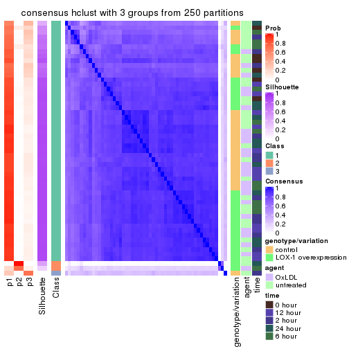</p>

</div>
<div id='tab-CV-hclust-consensus-heatmap-3'>
<pre><code class="r">consensus_heatmap(res, k = 4)
</code></pre>

<p>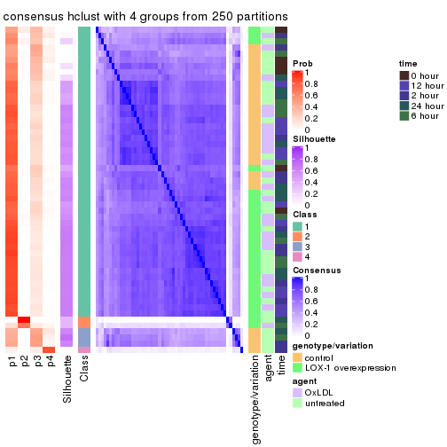</p>

</div>
<div id='tab-CV-hclust-consensus-heatmap-4'>
<pre><code class="r">consensus_heatmap(res, k = 5)
</code></pre>

<p>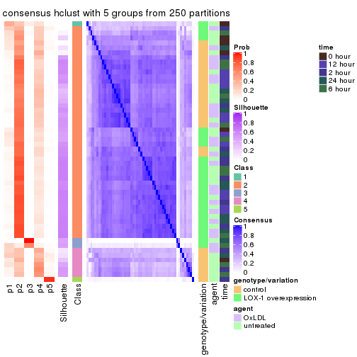</p>

</div>
<div id='tab-CV-hclust-consensus-heatmap-5'>
<pre><code class="r">consensus_heatmap(res, k = 6)
</code></pre>

<p>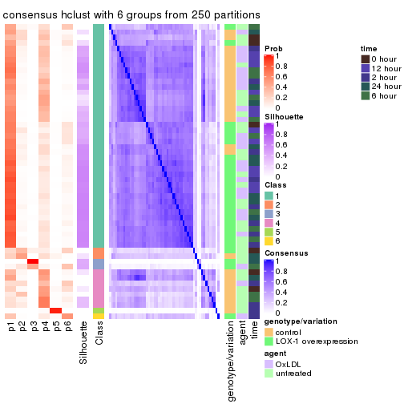</p>

</div>
</div>

Heatmaps for the membership of samples in all partitions to see how consistent they are:


<script>
$( function() {
	$( '#tabs-CV-hclust-membership-heatmap' ).tabs();
} );
</script>
<div id='tabs-CV-hclust-membership-heatmap'>
<ul>
<li><a href='#tab-CV-hclust-membership-heatmap-1'>k = 2</a></li>
<li><a href='#tab-CV-hclust-membership-heatmap-2'>k = 3</a></li>
<li><a href='#tab-CV-hclust-membership-heatmap-3'>k = 4</a></li>
<li><a href='#tab-CV-hclust-membership-heatmap-4'>k = 5</a></li>
<li><a href='#tab-CV-hclust-membership-heatmap-5'>k = 6</a></li>
</ul>
<div id='tab-CV-hclust-membership-heatmap-1'>
<pre><code class="r">membership_heatmap(res, k = 2)
</code></pre>

<p>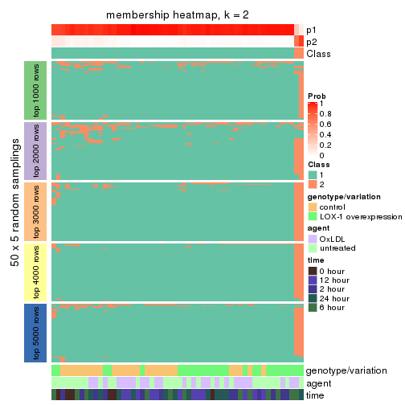</p>

</div>
<div id='tab-CV-hclust-membership-heatmap-2'>
<pre><code class="r">membership_heatmap(res, k = 3)
</code></pre>

<p>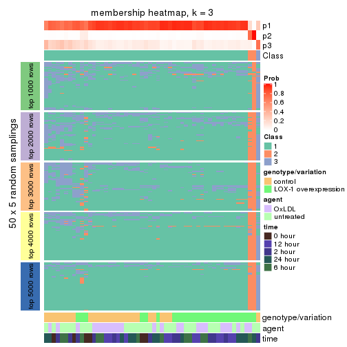</p>

</div>
<div id='tab-CV-hclust-membership-heatmap-3'>
<pre><code class="r">membership_heatmap(res, k = 4)
</code></pre>

<p>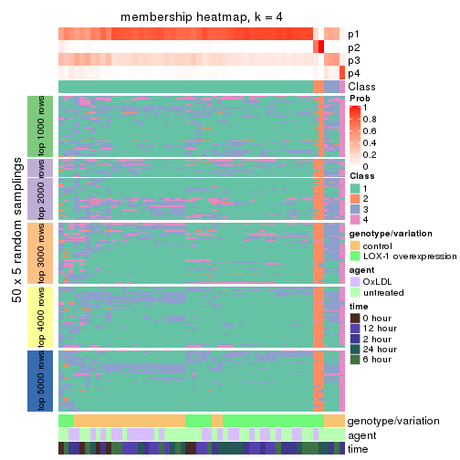</p>

</div>
<div id='tab-CV-hclust-membership-heatmap-4'>
<pre><code class="r">membership_heatmap(res, k = 5)
</code></pre>

<p>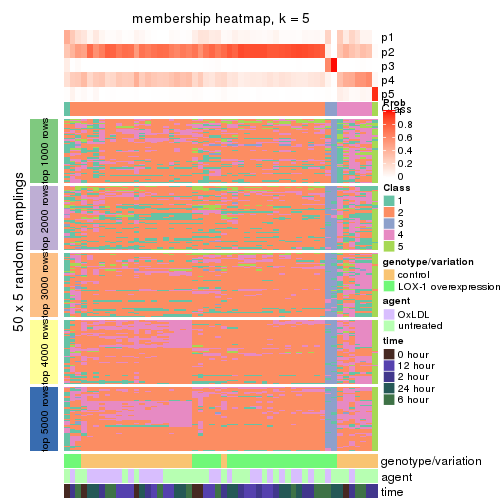</p>

</div>
<div id='tab-CV-hclust-membership-heatmap-5'>
<pre><code class="r">membership_heatmap(res, k = 6)
</code></pre>

<p>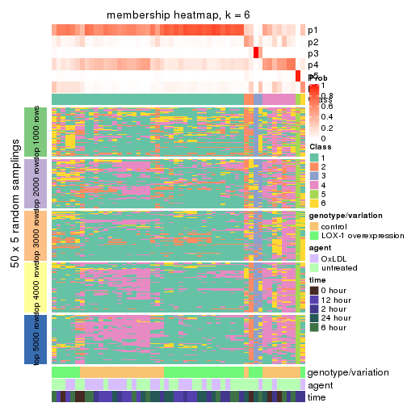</p>

</div>
</div>

As soon as we have had the classes for columns, we can look for signatures
which are significantly different between classes which can be candidate marks
for certain classes. Following are the heatmaps for signatures.


Signature heatmaps where rows are scaled:


<script>
$( function() {
	$( '#tabs-CV-hclust-get-signatures' ).tabs();
} );
</script>
<div id='tabs-CV-hclust-get-signatures'>
<ul>
<li><a href='#tab-CV-hclust-get-signatures-1'>k = 2</a></li>
<li><a href='#tab-CV-hclust-get-signatures-2'>k = 3</a></li>
<li><a href='#tab-CV-hclust-get-signatures-3'>k = 4</a></li>
<li><a href='#tab-CV-hclust-get-signatures-4'>k = 5</a></li>
<li><a href='#tab-CV-hclust-get-signatures-5'>k = 6</a></li>
</ul>
<div id='tab-CV-hclust-get-signatures-1'>
<pre><code class="r">get_signatures(res, k = 2)
</code></pre>

<p></p>

</div>
<div id='tab-CV-hclust-get-signatures-2'>
<pre><code class="r">get_signatures(res, k = 3)
</code></pre>

<p></p>

</div>
<div id='tab-CV-hclust-get-signatures-3'>
<pre><code class="r">get_signatures(res, k = 4)
</code></pre>

<p>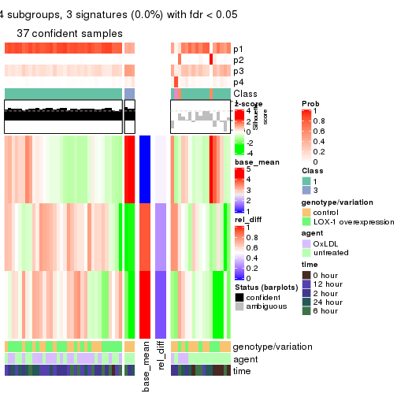</p>

</div>
<div id='tab-CV-hclust-get-signatures-4'>
<pre><code class="r">get_signatures(res, k = 5)
</code></pre>

<p></p>

</div>
<div id='tab-CV-hclust-get-signatures-5'>
<pre><code class="r">get_signatures(res, k = 6)
</code></pre>

<p></p>

</div>
</div>


Signature heatmaps where rows are not scaled:


<script>
$( function() {
	$( '#tabs-CV-hclust-get-signatures-no-scale' ).tabs();
} );
</script>
<div id='tabs-CV-hclust-get-signatures-no-scale'>
<ul>
<li><a href='#tab-CV-hclust-get-signatures-no-scale-1'>k = 2</a></li>
<li><a href='#tab-CV-hclust-get-signatures-no-scale-2'>k = 3</a></li>
<li><a href='#tab-CV-hclust-get-signatures-no-scale-3'>k = 4</a></li>
<li><a href='#tab-CV-hclust-get-signatures-no-scale-4'>k = 5</a></li>
<li><a href='#tab-CV-hclust-get-signatures-no-scale-5'>k = 6</a></li>
</ul>
<div id='tab-CV-hclust-get-signatures-no-scale-1'>
<pre><code class="r">get_signatures(res, k = 2, scale_rows = FALSE)
</code></pre>

<p></p>

</div>
<div id='tab-CV-hclust-get-signatures-no-scale-2'>
<pre><code class="r">get_signatures(res, k = 3, scale_rows = FALSE)
</code></pre>

<p></p>

</div>
<div id='tab-CV-hclust-get-signatures-no-scale-3'>
<pre><code class="r">get_signatures(res, k = 4, scale_rows = FALSE)
</code></pre>

<p>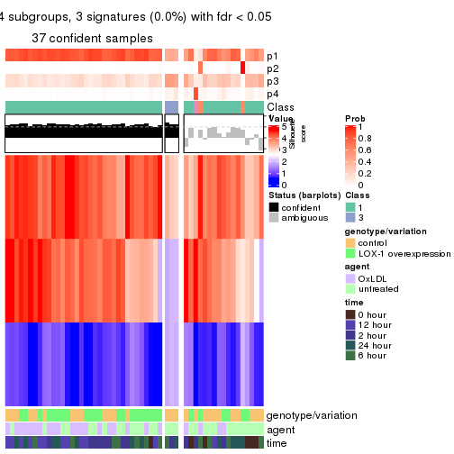</p>

</div>
<div id='tab-CV-hclust-get-signatures-no-scale-4'>
<pre><code class="r">get_signatures(res, k = 5, scale_rows = FALSE)
</code></pre>

<p></p>

</div>
<div id='tab-CV-hclust-get-signatures-no-scale-5'>
<pre><code class="r">get_signatures(res, k = 6, scale_rows = FALSE)
</code></pre>

<p></p>

</div>
</div>


Compare the overlap of signatures from different k:

```r
compare_signatures(res)
```

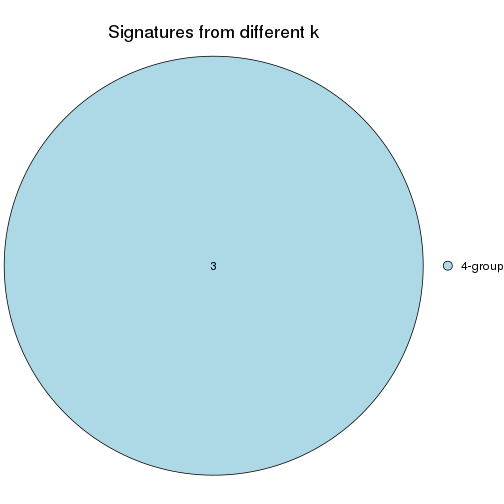

`get_signature()` returns a data frame invisibly. TO get the list of signatures, the function
call should be assigned to a variable explicitly. In following code, if `plot` argument is set
to `FALSE`, no heatmap is plotted while only the differential analysis is performed.

```r
# code only for demonstration
tb = get_signature(res, k = ..., plot = FALSE)
```

An example of the output of `tb` is:

```
#>   which_row         fdr    mean_1    mean_2 scaled_mean_1 scaled_mean_2 km
#> 1        38 0.042760348  8.373488  9.131774    -0.5533452     0.5164555  1
#> 2        40 0.018707592  7.106213  8.469186    -0.6173731     0.5762149  1
#> 3        55 0.019134737 10.221463 11.207825    -0.6159697     0.5749050  1
#> 4        59 0.006059896  5.921854  7.869574    -0.6899429     0.6439467  1
#> 5        60 0.018055526  8.928898 10.211722    -0.6204761     0.5791110  1
#> 6        98 0.009384629 15.714769 14.887706     0.6635654    -0.6193277  2
...
```

The columns in `tb` are:

1. `which_row`: row indices corresponding to the input matrix.
2. `fdr`: FDR for the differential test. 
3. `mean_x`: The mean value in group x.
4. `scaled_mean_x`: The mean value in group x after rows are scaled.
5. `km`: Row groups if k-means clustering is applied to rows.


UMAP plot which shows how samples are separated.


<script>
$( function() {
	$( '#tabs-CV-hclust-dimension-reduction' ).tabs();
} );
</script>
<div id='tabs-CV-hclust-dimension-reduction'>
<ul>
<li><a href='#tab-CV-hclust-dimension-reduction-1'>k = 2</a></li>
<li><a href='#tab-CV-hclust-dimension-reduction-2'>k = 3</a></li>
<li><a href='#tab-CV-hclust-dimension-reduction-3'>k = 4</a></li>
<li><a href='#tab-CV-hclust-dimension-reduction-4'>k = 5</a></li>
<li><a href='#tab-CV-hclust-dimension-reduction-5'>k = 6</a></li>
</ul>
<div id='tab-CV-hclust-dimension-reduction-1'>
<pre><code class="r">dimension_reduction(res, k = 2, method = &quot;UMAP&quot;)
</code></pre>

<p>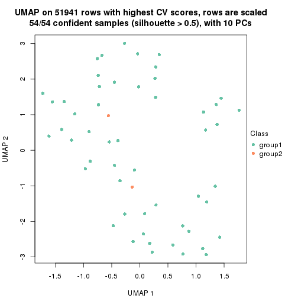</p>

</div>
<div id='tab-CV-hclust-dimension-reduction-2'>
<pre><code class="r">dimension_reduction(res, k = 3, method = &quot;UMAP&quot;)
</code></pre>

<p>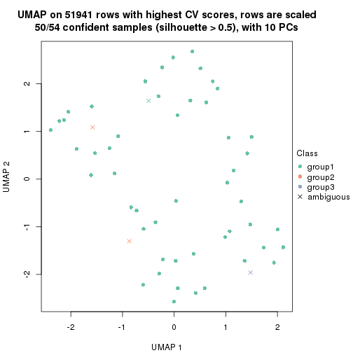</p>

</div>
<div id='tab-CV-hclust-dimension-reduction-3'>
<pre><code class="r">dimension_reduction(res, k = 4, method = &quot;UMAP&quot;)
</code></pre>

<p>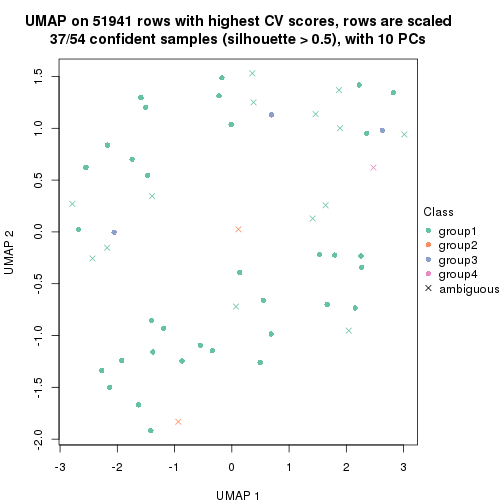</p>

</div>
<div id='tab-CV-hclust-dimension-reduction-4'>
<pre><code class="r">dimension_reduction(res, k = 5, method = &quot;UMAP&quot;)
</code></pre>

<p>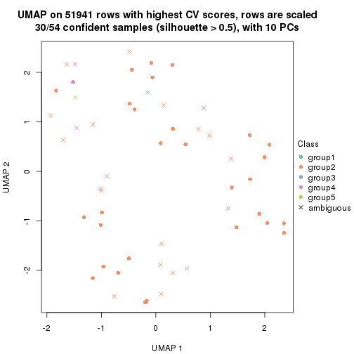</p>

</div>
<div id='tab-CV-hclust-dimension-reduction-5'>
<pre><code class="r">dimension_reduction(res, k = 6, method = &quot;UMAP&quot;)
</code></pre>

<p>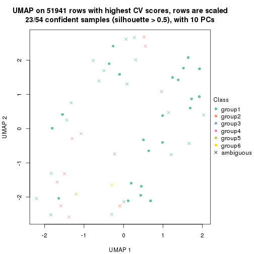</p>

</div>
</div>


Following heatmap shows how subgroups are split when increasing `k`:

```r
collect_classes(res)
```

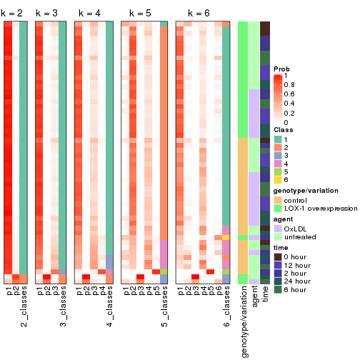


Test correlation between subgroups and known annotations. If the known
annotation is numeric, one-way ANOVA test is applied, and if the known
annotation is discrete, chi-squared contingency table test is applied.

```r
test_to_known_factors(res)
```

```
#>            n genotype/variation(p) agent(p) time(p) k
#> CV:hclust 54                 0.471    1.000   0.628 2
#> CV:hclust 50                    NA       NA      NA 3
#> CV:hclust 37                 0.144    0.175   0.812 4
#> CV:hclust 30                 0.778    0.946   0.493 5
#> CV:hclust 23                    NA       NA      NA 6
```


If matrix rows can be associated to genes, consider to use `functional_enrichment(res,
...)` to perform function enrichment for the signature genes. See [this vignette](http://bioconductor.org/packages/devel/bioc/vignettes/cola/inst/doc/functional_enrichment.html) for more detailed explanations.


 

---------------------------------------------------


### CV:kmeans


The object with results only for a single top-value method and a single partition method 
can be extracted as:

```r
res = res_list["CV", "kmeans"]
# you can also extract it by
# res = res_list["CV:kmeans"]
```

A summary of `res` and all the functions that can be applied to it:

```r
res
```

```
#> A 'ConsensusPartition' object with k = 2, 3, 4, 5, 6.
#>   On a matrix with 51941 rows and 54 columns.
#>   Top rows (1000, 2000, 3000, 4000, 5000) are extracted by 'CV' method.
#>   Subgroups are detected by 'kmeans' method.
#>   Performed in total 1250 partitions by row resampling.
#>   Best k for subgroups seems to be 2.
#> 
#> Following methods can be applied to this 'ConsensusPartition' object:
#>  [1] "cola_report"             "collect_classes"         "collect_plots"          
#>  [4] "collect_stats"           "colnames"                "compare_signatures"     
#>  [7] "consensus_heatmap"       "dimension_reduction"     "functional_enrichment"  
#> [10] "get_anno_col"            "get_anno"                "get_classes"            
#> [13] "get_consensus"           "get_matrix"              "get_membership"         
#> [16] "get_param"               "get_signatures"          "get_stats"              
#> [19] "is_best_k"               "is_stable_k"             "membership_heatmap"     
#> [22] "ncol"                    "nrow"                    "plot_ecdf"              
#> [25] "rownames"                "select_partition_number" "show"                   
#> [28] "suggest_best_k"          "test_to_known_factors"
```

`collect_plots()` function collects all the plots made from `res` for all `k` (number of partitions)
into one single page to provide an easy and fast comparison between different `k`.

```r
collect_plots(res)
```

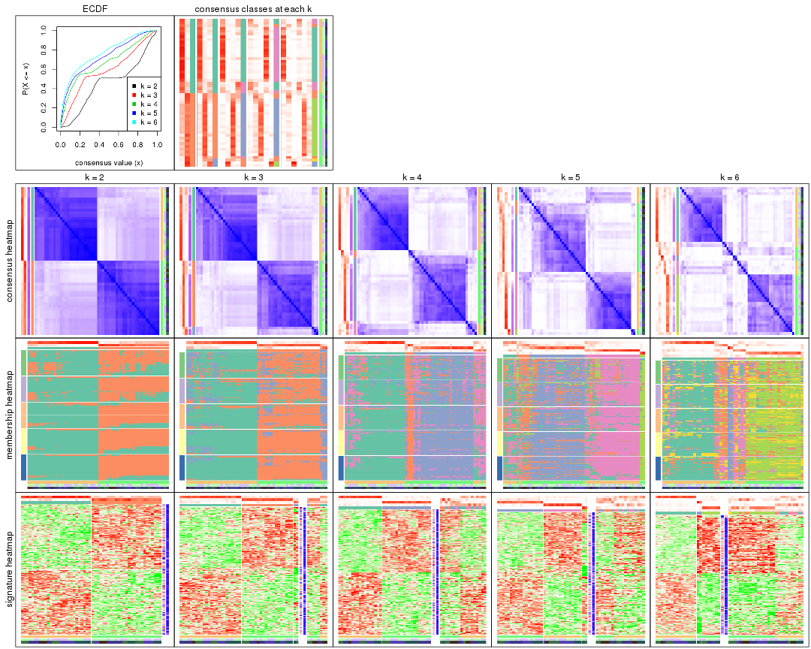

The plots are:

- The first row: a plot of the ECDF (empirical cumulative distribution
  function) curves of the consensus matrix for each `k` and the heatmap of
  predicted classes for each `k`.
- The second row: heatmaps of the consensus matrix for each `k`.
- The third row: heatmaps of the membership matrix for each `k`.
- The fouth row: heatmaps of the signatures for each `k`.

All the plots in panels can be made by individual functions and they are
plotted later in this section.

`select_partition_number()` produces several plots showing different
statistics for choosing "optimized" `k`. There are following statistics:

- ECDF curves of the consensus matrix for each `k`;
- 1-PAC. [The PAC
  score](https://en.wikipedia.org/wiki/Consensus_clustering#Over-interpretation_potential_of_consensus_clustering)
  measures the proportion of the ambiguous subgrouping.
- Mean silhouette score.
- Concordance. The mean probability of fiting the consensus class ids in all
  partitions.
- Area increased. Denote $A_k$ as the area under the ECDF curve for current
  `k`, the area increased is defined as $A_k - A_{k-1}$.
- Rand index. The percent of pairs of samples that are both in a same cluster
  or both are not in a same cluster in the partition of k and k-1.
- Jaccard index. The ratio of pairs of samples are both in a same cluster in
  the partition of k and k-1 and the pairs of samples are both in a same
  cluster in the partition k or k-1.

The detailed explanations of these statistics can be found in [the _cola_
vignette](http://bioconductor.org/packages/devel/bioc/vignettes/cola/inst/doc/cola.html#toc_13).

Generally speaking, lower PAC score, higher mean silhouette score or higher
concordance corresponds to better partition. Rand index and Jaccard index
measure how similar the current partition is compared to partition with `k-1`.
If they are too similar, we won't accept `k` is better than `k-1`.

```r
select_partition_number(res)
```

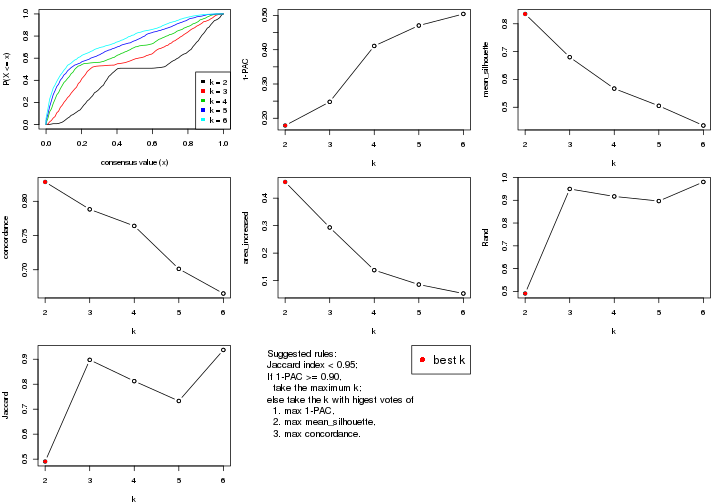

The numeric values for all these statistics can be obtained by `get_stats()`.

```r
get_stats(res)
```

```
#>   k 1-PAC mean_silhouette concordance area_increased  Rand Jaccard
#> 2 2 0.179           0.835       0.828         0.4589 0.491   0.491
#> 3 3 0.248           0.680       0.788         0.2933 0.950   0.897
#> 4 4 0.411           0.567       0.764         0.1381 0.917   0.812
#> 5 5 0.471           0.505       0.701         0.0857 0.897   0.733
#> 6 6 0.504           0.434       0.665         0.0531 0.980   0.937
```

`suggest_best_k()` suggests the best $k$ based on these statistics. The rules are as follows:

- All $k$ with Jaccard index larger than 0.95 are removed because increasing
  $k$ does not provide enough extra information. If all $k$ are removed, it is
  marked as no subgroup is detected.
- For all $k$ with 1-PAC score larger than 0.9, the maximal $k$ is taken as
  the best $k$, and other $k$ are marked as optional $k$.
- If it does not fit the second rule. The $k$ with the maximal vote of the
  highest 1-PAC score, highest mean silhouette, and highest concordance is
  taken as the best $k$.

```r
suggest_best_k(res)
```

```
#> [1] 2
```


Following shows the table of the partitions (You need to click the **show/hide
code output** link to see it). The membership matrix (columns with name `p*`)
is inferred by
[`clue::cl_consensus()`](https://www.rdocumentation.org/link/cl_consensus?package=clue)
function with the `SE` method. Basically the value in the membership matrix
represents the probability to belong to a certain group. The finall class
label for an item is determined with the group with highest probability it
belongs to.

In `get_classes()` function, the entropy is calculated from the membership
matrix and the silhouette score is calculated from the consensus matrix.


<script>
$( function() {
	$( '#tabs-CV-kmeans-get-classes' ).tabs();
} );
</script>
<div id='tabs-CV-kmeans-get-classes'>
<ul>
<li><a href='#tab-CV-kmeans-get-classes-1'>k = 2</a></li>
<li><a href='#tab-CV-kmeans-get-classes-2'>k = 3</a></li>
<li><a href='#tab-CV-kmeans-get-classes-3'>k = 4</a></li>
<li><a href='#tab-CV-kmeans-get-classes-4'>k = 5</a></li>
<li><a href='#tab-CV-kmeans-get-classes-5'>k = 6</a></li>
</ul>

<div id='tab-CV-kmeans-get-classes-1'>
<p><a id='tab-CV-kmeans-get-classes-1-a' style='color:#0366d6' href='#'>show/hide code output</a></p>
<pre><code class="r">cbind(get_classes(res, k = 2), get_membership(res, k = 2))
</code></pre>

<pre><code>#&gt;           class entropy silhouette    p1    p2
#&gt; GSM329068     2  0.5737      0.813 0.136 0.864
#&gt; GSM329074     2  0.4939      0.793 0.108 0.892
#&gt; GSM329100     2  0.4562      0.783 0.096 0.904
#&gt; GSM329062     2  0.7299      0.844 0.204 0.796
#&gt; GSM329079     2  0.9608      0.813 0.384 0.616
#&gt; GSM329090     2  0.9323      0.835 0.348 0.652
#&gt; GSM329066     2  0.9393      0.828 0.356 0.644
#&gt; GSM329086     2  0.4815      0.764 0.104 0.896
#&gt; GSM329099     2  0.9661      0.794 0.392 0.608
#&gt; GSM329071     2  0.8608      0.854 0.284 0.716
#&gt; GSM329078     2  0.9460      0.826 0.364 0.636
#&gt; GSM329081     2  0.8955      0.852 0.312 0.688
#&gt; GSM329096     2  0.8608      0.852 0.284 0.716
#&gt; GSM329102     2  0.9170      0.838 0.332 0.668
#&gt; GSM329104     2  0.2236      0.717 0.036 0.964
#&gt; GSM329067     2  0.4690      0.792 0.100 0.900
#&gt; GSM329072     2  0.9087      0.850 0.324 0.676
#&gt; GSM329075     2  0.9170      0.845 0.332 0.668
#&gt; GSM329058     2  0.5408      0.799 0.124 0.876
#&gt; GSM329073     2  0.4298      0.740 0.088 0.912
#&gt; GSM329107     2  0.9087      0.851 0.324 0.676
#&gt; GSM329057     2  0.6887      0.839 0.184 0.816
#&gt; GSM329085     2  0.9580      0.811 0.380 0.620
#&gt; GSM329089     2  0.7950      0.853 0.240 0.760
#&gt; GSM329076     2  0.9323      0.824 0.348 0.652
#&gt; GSM329094     2  0.8267      0.847 0.260 0.740
#&gt; GSM329105     2  0.9129      0.847 0.328 0.672
#&gt; GSM329056     1  0.5178      0.870 0.884 0.116
#&gt; GSM329069     1  0.8608      0.718 0.716 0.284
#&gt; GSM329077     1  0.8861      0.706 0.696 0.304
#&gt; GSM329070     1  0.6148      0.847 0.848 0.152
#&gt; GSM329082     1  0.3584      0.883 0.932 0.068
#&gt; GSM329092     1  0.8813      0.713 0.700 0.300
#&gt; GSM329083     1  0.5294      0.850 0.880 0.120
#&gt; GSM329101     1  0.1414      0.888 0.980 0.020
#&gt; GSM329106     1  0.4939      0.859 0.892 0.108
#&gt; GSM329087     1  0.1633      0.883 0.976 0.024
#&gt; GSM329091     1  0.2778      0.886 0.952 0.048
#&gt; GSM329093     1  0.1184      0.886 0.984 0.016
#&gt; GSM329080     1  0.1184      0.887 0.984 0.016
#&gt; GSM329084     1  0.6712      0.832 0.824 0.176
#&gt; GSM329088     1  0.1633      0.884 0.976 0.024
#&gt; GSM329059     1  0.8144      0.772 0.748 0.252
#&gt; GSM329097     1  0.2236      0.882 0.964 0.036
#&gt; GSM329098     1  0.6247      0.846 0.844 0.156
#&gt; GSM329055     1  0.0938      0.887 0.988 0.012
#&gt; GSM329103     1  0.1414      0.888 0.980 0.020
#&gt; GSM329108     1  0.1184      0.889 0.984 0.016
#&gt; GSM329061     1  0.1184      0.886 0.984 0.016
#&gt; GSM329064     1  0.3431      0.887 0.936 0.064
#&gt; GSM329065     1  0.1184      0.886 0.984 0.016
#&gt; GSM329060     1  0.1843      0.887 0.972 0.028
#&gt; GSM329063     1  0.6438      0.841 0.836 0.164
#&gt; GSM329095     1  0.4690      0.852 0.900 0.100
</code></pre>

<script>
$('#tab-CV-kmeans-get-classes-1-a').parent().next().next().hide();
$('#tab-CV-kmeans-get-classes-1-a').click(function(){
  $('#tab-CV-kmeans-get-classes-1-a').parent().next().next().toggle();
  return(false);
});
</script>
</div>

<div id='tab-CV-kmeans-get-classes-2'>
<p><a id='tab-CV-kmeans-get-classes-2-a' style='color:#0366d6' href='#'>show/hide code output</a></p>
<pre><code class="r">cbind(get_classes(res, k = 3), get_membership(res, k = 3))
</code></pre>

<pre><code>#&gt;           class entropy silhouette    p1    p2    p3
#&gt; GSM329068     2   0.577    0.50257 0.024 0.756 0.220
#&gt; GSM329074     2   0.721    0.00431 0.036 0.604 0.360
#&gt; GSM329100     2   0.723    0.20034 0.048 0.640 0.312
#&gt; GSM329062     2   0.454    0.67165 0.028 0.848 0.124
#&gt; GSM329079     2   0.518    0.74972 0.156 0.812 0.032
#&gt; GSM329090     2   0.485    0.76163 0.128 0.836 0.036
#&gt; GSM329066     2   0.433    0.75867 0.144 0.844 0.012
#&gt; GSM329086     3   0.739    0.30337 0.032 0.472 0.496
#&gt; GSM329099     2   0.635    0.70586 0.188 0.752 0.060
#&gt; GSM329071     2   0.415    0.74960 0.080 0.876 0.044
#&gt; GSM329078     2   0.535    0.74287 0.160 0.804 0.036
#&gt; GSM329081     2   0.502    0.75521 0.108 0.836 0.056
#&gt; GSM329096     2   0.441    0.75899 0.104 0.860 0.036
#&gt; GSM329102     2   0.619    0.70706 0.140 0.776 0.084
#&gt; GSM329104     3   0.495    0.70244 0.016 0.176 0.808
#&gt; GSM329067     2   0.665    0.20660 0.024 0.656 0.320
#&gt; GSM329072     2   0.509    0.75381 0.112 0.832 0.056
#&gt; GSM329075     2   0.708    0.69335 0.176 0.720 0.104
#&gt; GSM329058     2   0.654    0.30335 0.028 0.684 0.288
#&gt; GSM329073     3   0.580    0.70163 0.016 0.248 0.736
#&gt; GSM329107     2   0.460    0.76652 0.108 0.852 0.040
#&gt; GSM329057     2   0.496    0.68505 0.048 0.836 0.116
#&gt; GSM329085     2   0.535    0.73404 0.152 0.808 0.040
#&gt; GSM329089     2   0.380    0.72686 0.056 0.892 0.052
#&gt; GSM329076     2   0.585    0.72789 0.172 0.780 0.048
#&gt; GSM329094     2   0.582    0.72048 0.096 0.800 0.104
#&gt; GSM329105     2   0.434    0.75877 0.120 0.856 0.024
#&gt; GSM329056     1   0.498    0.79918 0.840 0.064 0.096
#&gt; GSM329069     1   0.867    0.39743 0.504 0.108 0.388
#&gt; GSM329077     1   0.914    0.27458 0.448 0.144 0.408
#&gt; GSM329070     1   0.522    0.75018 0.788 0.016 0.196
#&gt; GSM329082     1   0.557    0.78482 0.812 0.080 0.108
#&gt; GSM329092     1   0.874    0.42483 0.512 0.116 0.372
#&gt; GSM329083     1   0.606    0.73201 0.764 0.048 0.188
#&gt; GSM329101     1   0.265    0.82373 0.928 0.060 0.012
#&gt; GSM329106     1   0.457    0.76547 0.828 0.012 0.160
#&gt; GSM329087     1   0.329    0.81506 0.896 0.096 0.008
#&gt; GSM329091     1   0.331    0.82642 0.908 0.064 0.028
#&gt; GSM329093     1   0.327    0.82239 0.904 0.080 0.016
#&gt; GSM329080     1   0.275    0.82208 0.924 0.064 0.012
#&gt; GSM329084     1   0.755    0.66770 0.684 0.112 0.204
#&gt; GSM329088     1   0.290    0.82265 0.920 0.064 0.016
#&gt; GSM329059     1   0.797    0.62912 0.652 0.128 0.220
#&gt; GSM329097     1   0.397    0.81132 0.876 0.100 0.024
#&gt; GSM329098     1   0.714    0.72245 0.720 0.120 0.160
#&gt; GSM329055     1   0.268    0.82273 0.924 0.068 0.008
#&gt; GSM329103     1   0.392    0.82429 0.884 0.080 0.036
#&gt; GSM329108     1   0.328    0.82581 0.908 0.068 0.024
#&gt; GSM329061     1   0.287    0.82166 0.916 0.076 0.008
#&gt; GSM329064     1   0.482    0.81487 0.844 0.108 0.048
#&gt; GSM329065     1   0.323    0.82460 0.908 0.072 0.020
#&gt; GSM329060     1   0.346    0.82228 0.892 0.096 0.012
#&gt; GSM329063     1   0.720    0.70313 0.712 0.108 0.180
#&gt; GSM329095     1   0.714    0.71448 0.720 0.160 0.120
</code></pre>

<script>
$('#tab-CV-kmeans-get-classes-2-a').parent().next().next().hide();
$('#tab-CV-kmeans-get-classes-2-a').click(function(){
  $('#tab-CV-kmeans-get-classes-2-a').parent().next().next().toggle();
  return(false);
});
</script>
</div>

<div id='tab-CV-kmeans-get-classes-3'>
<p><a id='tab-CV-kmeans-get-classes-3-a' style='color:#0366d6' href='#'>show/hide code output</a></p>
<pre><code class="r">cbind(get_classes(res, k = 4), get_membership(res, k = 4))
</code></pre>

<pre><code>#&gt;           class entropy silhouette    p1    p2    p3    p4
#&gt; GSM329068     3   0.687     0.4974 0.008 0.132 0.612 0.248
#&gt; GSM329074     4   0.688    -0.2237 0.000 0.104 0.424 0.472
#&gt; GSM329100     3   0.750     0.0300 0.004 0.156 0.436 0.404
#&gt; GSM329062     3   0.460     0.6866 0.004 0.044 0.792 0.160
#&gt; GSM329079     3   0.479     0.7258 0.120 0.028 0.808 0.044
#&gt; GSM329090     3   0.296     0.7572 0.044 0.012 0.904 0.040
#&gt; GSM329066     3   0.239     0.7591 0.052 0.008 0.924 0.016
#&gt; GSM329086     2   0.781     0.0167 0.008 0.408 0.400 0.184
#&gt; GSM329099     3   0.516     0.7131 0.128 0.020 0.784 0.068
#&gt; GSM329071     3   0.255     0.7494 0.008 0.028 0.920 0.044
#&gt; GSM329078     3   0.415     0.7338 0.076 0.012 0.844 0.068
#&gt; GSM329081     3   0.412     0.7454 0.040 0.032 0.852 0.076
#&gt; GSM329096     3   0.372     0.7520 0.048 0.024 0.872 0.056
#&gt; GSM329102     3   0.675     0.6544 0.116 0.076 0.700 0.108
#&gt; GSM329104     2   0.198     0.4989 0.004 0.940 0.040 0.016
#&gt; GSM329067     3   0.715     0.0254 0.000 0.132 0.436 0.432
#&gt; GSM329072     3   0.457     0.7339 0.044 0.072 0.832 0.052
#&gt; GSM329075     3   0.638     0.6722 0.136 0.060 0.720 0.084
#&gt; GSM329058     3   0.633     0.4980 0.000 0.200 0.656 0.144
#&gt; GSM329073     2   0.522     0.5337 0.008 0.772 0.100 0.120
#&gt; GSM329107     3   0.310     0.7596 0.028 0.024 0.900 0.048
#&gt; GSM329057     3   0.434     0.7048 0.008 0.052 0.824 0.116
#&gt; GSM329085     3   0.489     0.7163 0.088 0.036 0.812 0.064
#&gt; GSM329089     3   0.249     0.7458 0.004 0.016 0.916 0.064
#&gt; GSM329076     3   0.627     0.6784 0.144 0.080 0.724 0.052
#&gt; GSM329094     3   0.596     0.6784 0.040 0.088 0.744 0.128
#&gt; GSM329105     3   0.331     0.7533 0.036 0.044 0.892 0.028
#&gt; GSM329056     1   0.440     0.7082 0.828 0.036 0.024 0.112
#&gt; GSM329069     4   0.838     0.2243 0.380 0.208 0.028 0.384
#&gt; GSM329077     4   0.529     0.4468 0.140 0.028 0.056 0.776
#&gt; GSM329070     1   0.553     0.5981 0.740 0.104 0.004 0.152
#&gt; GSM329082     1   0.655     0.3971 0.604 0.040 0.032 0.324
#&gt; GSM329092     4   0.523     0.4321 0.180 0.076 0.000 0.744
#&gt; GSM329083     1   0.640    -0.0449 0.504 0.040 0.012 0.444
#&gt; GSM329101     1   0.147     0.7699 0.960 0.004 0.024 0.012
#&gt; GSM329106     1   0.505     0.6547 0.784 0.112 0.008 0.096
#&gt; GSM329087     1   0.335     0.7583 0.884 0.012 0.068 0.036
#&gt; GSM329091     1   0.250     0.7693 0.924 0.012 0.028 0.036
#&gt; GSM329093     1   0.330     0.7680 0.888 0.012 0.052 0.048
#&gt; GSM329080     1   0.145     0.7713 0.956 0.000 0.036 0.008
#&gt; GSM329084     4   0.658     0.2585 0.380 0.024 0.040 0.556
#&gt; GSM329088     1   0.206     0.7715 0.936 0.008 0.048 0.008
#&gt; GSM329059     1   0.822    -0.2876 0.420 0.080 0.084 0.416
#&gt; GSM329097     1   0.331     0.7594 0.880 0.004 0.076 0.040
#&gt; GSM329098     1   0.725     0.4258 0.612 0.036 0.108 0.244
#&gt; GSM329055     1   0.206     0.7720 0.940 0.008 0.032 0.020
#&gt; GSM329103     1   0.344     0.7645 0.884 0.020 0.040 0.056
#&gt; GSM329108     1   0.254     0.7693 0.924 0.024 0.028 0.024
#&gt; GSM329061     1   0.286     0.7667 0.908 0.012 0.048 0.032
#&gt; GSM329064     1   0.460     0.7322 0.824 0.028 0.052 0.096
#&gt; GSM329065     1   0.215     0.7723 0.936 0.008 0.036 0.020
#&gt; GSM329060     1   0.281     0.7727 0.908 0.008 0.052 0.032
#&gt; GSM329063     1   0.706     0.0318 0.492 0.048 0.036 0.424
#&gt; GSM329095     1   0.750     0.4655 0.620 0.052 0.140 0.188
</code></pre>

<script>
$('#tab-CV-kmeans-get-classes-3-a').parent().next().next().hide();
$('#tab-CV-kmeans-get-classes-3-a').click(function(){
  $('#tab-CV-kmeans-get-classes-3-a').parent().next().next().toggle();
  return(false);
});
</script>
</div>

<div id='tab-CV-kmeans-get-classes-4'>
<p><a id='tab-CV-kmeans-get-classes-4-a' style='color:#0366d6' href='#'>show/hide code output</a></p>
<pre><code class="r">cbind(get_classes(res, k = 5), get_membership(res, k = 5))
</code></pre>

<pre><code>#&gt;           class entropy silhouette    p1    p2    p3    p4    p5
#&gt; GSM329068     3   0.612     0.1834 0.052 0.412 0.500 0.000 0.036
#&gt; GSM329074     2   0.648     0.4574 0.136 0.592 0.236 0.000 0.036
#&gt; GSM329100     2   0.767     0.4011 0.160 0.472 0.264 0.000 0.104
#&gt; GSM329062     3   0.491     0.5156 0.016 0.324 0.644 0.012 0.004
#&gt; GSM329079     3   0.539     0.6100 0.016 0.120 0.720 0.136 0.008
#&gt; GSM329090     3   0.376     0.6900 0.024 0.116 0.828 0.032 0.000
#&gt; GSM329066     3   0.327     0.6875 0.008 0.064 0.860 0.068 0.000
#&gt; GSM329086     2   0.821     0.0255 0.096 0.352 0.304 0.004 0.244
#&gt; GSM329099     3   0.597     0.5879 0.036 0.168 0.680 0.108 0.008
#&gt; GSM329071     3   0.449     0.6645 0.016 0.192 0.760 0.020 0.012
#&gt; GSM329078     3   0.459     0.6619 0.036 0.116 0.792 0.048 0.008
#&gt; GSM329081     3   0.441     0.6457 0.028 0.168 0.772 0.032 0.000
#&gt; GSM329096     3   0.405     0.6831 0.048 0.108 0.816 0.028 0.000
#&gt; GSM329102     3   0.709     0.4937 0.108 0.172 0.616 0.072 0.032
#&gt; GSM329104     5   0.155     0.7633 0.004 0.032 0.016 0.000 0.948
#&gt; GSM329067     2   0.530     0.4383 0.060 0.688 0.228 0.000 0.024
#&gt; GSM329072     3   0.533     0.6393 0.052 0.128 0.752 0.044 0.024
#&gt; GSM329075     3   0.696     0.5090 0.032 0.200 0.600 0.136 0.032
#&gt; GSM329058     3   0.707     0.2545 0.048 0.280 0.512 0.000 0.160
#&gt; GSM329073     5   0.510     0.7459 0.048 0.104 0.096 0.000 0.752
#&gt; GSM329107     3   0.354     0.6855 0.008 0.124 0.836 0.028 0.004
#&gt; GSM329057     3   0.508     0.6188 0.052 0.176 0.736 0.004 0.032
#&gt; GSM329085     3   0.459     0.6439 0.044 0.120 0.788 0.044 0.004
#&gt; GSM329089     3   0.447     0.6458 0.028 0.208 0.748 0.012 0.004
#&gt; GSM329076     3   0.621     0.5887 0.072 0.100 0.684 0.132 0.012
#&gt; GSM329094     3   0.618     0.5387 0.108 0.188 0.660 0.028 0.016
#&gt; GSM329105     3   0.281     0.6972 0.012 0.028 0.900 0.044 0.016
#&gt; GSM329056     4   0.518     0.5760 0.104 0.116 0.012 0.748 0.020
#&gt; GSM329069     4   0.844    -0.3618 0.252 0.304 0.008 0.324 0.112
#&gt; GSM329077     1   0.629     0.2836 0.580 0.316 0.024 0.064 0.016
#&gt; GSM329070     4   0.670     0.3231 0.272 0.048 0.000 0.560 0.120
#&gt; GSM329082     4   0.688    -0.0160 0.392 0.072 0.036 0.480 0.020
#&gt; GSM329092     1   0.642     0.3097 0.568 0.308 0.004 0.084 0.036
#&gt; GSM329083     1   0.612     0.4134 0.580 0.052 0.004 0.324 0.040
#&gt; GSM329101     4   0.153     0.7106 0.028 0.008 0.008 0.952 0.004
#&gt; GSM329106     4   0.588     0.4969 0.160 0.048 0.000 0.680 0.112
#&gt; GSM329087     4   0.261     0.7067 0.060 0.016 0.024 0.900 0.000
#&gt; GSM329091     4   0.308     0.6987 0.080 0.016 0.024 0.876 0.004
#&gt; GSM329093     4   0.428     0.6886 0.100 0.040 0.032 0.816 0.012
#&gt; GSM329080     4   0.125     0.7067 0.036 0.000 0.008 0.956 0.000
#&gt; GSM329084     1   0.610     0.5193 0.648 0.084 0.024 0.228 0.016
#&gt; GSM329088     4   0.199     0.7062 0.048 0.000 0.016 0.928 0.008
#&gt; GSM329059     2   0.787    -0.3957 0.320 0.356 0.024 0.276 0.024
#&gt; GSM329097     4   0.274     0.7035 0.044 0.016 0.036 0.900 0.004
#&gt; GSM329098     4   0.844    -0.0764 0.248 0.200 0.124 0.412 0.016
#&gt; GSM329055     4   0.246     0.7084 0.060 0.020 0.008 0.908 0.004
#&gt; GSM329103     4   0.480     0.6771 0.112 0.040 0.032 0.788 0.028
#&gt; GSM329108     4   0.226     0.7062 0.060 0.012 0.004 0.916 0.008
#&gt; GSM329061     4   0.407     0.6871 0.104 0.040 0.020 0.824 0.012
#&gt; GSM329064     4   0.560     0.6275 0.116 0.080 0.048 0.736 0.020
#&gt; GSM329065     4   0.162     0.7105 0.040 0.008 0.008 0.944 0.000
#&gt; GSM329060     4   0.364     0.6929 0.072 0.036 0.044 0.848 0.000
#&gt; GSM329063     1   0.708     0.2447 0.464 0.072 0.044 0.396 0.024
#&gt; GSM329095     4   0.799     0.1567 0.240 0.104 0.136 0.496 0.024
</code></pre>

<script>
$('#tab-CV-kmeans-get-classes-4-a').parent().next().next().hide();
$('#tab-CV-kmeans-get-classes-4-a').click(function(){
  $('#tab-CV-kmeans-get-classes-4-a').parent().next().next().toggle();
  return(false);
});
</script>
</div>

<div id='tab-CV-kmeans-get-classes-5'>
<p><a id='tab-CV-kmeans-get-classes-5-a' style='color:#0366d6' href='#'>show/hide code output</a></p>
<pre><code class="r">cbind(get_classes(res, k = 6), get_membership(res, k = 6))
</code></pre>

<pre><code>#&gt;           class entropy silhouette    p1    p2    p3    p4    p5    p6
#&gt; GSM329068     5  0.6372     0.0837 0.000 0.400 0.024 0.048 0.460 0.068
#&gt; GSM329074     2  0.4907     0.2757 0.000 0.720 0.012 0.096 0.152 0.020
#&gt; GSM329100     2  0.7505     0.1559 0.000 0.500 0.072 0.156 0.192 0.080
#&gt; GSM329062     5  0.4672     0.4472 0.004 0.300 0.000 0.012 0.648 0.036
#&gt; GSM329079     5  0.4821     0.5130 0.144 0.076 0.000 0.012 0.736 0.032
#&gt; GSM329090     5  0.4494     0.5584 0.032 0.064 0.000 0.004 0.752 0.148
#&gt; GSM329066     5  0.3415     0.5677 0.084 0.048 0.000 0.004 0.840 0.024
#&gt; GSM329086     6  0.8387     0.0000 0.004 0.224 0.208 0.036 0.232 0.296
#&gt; GSM329099     5  0.5687     0.4866 0.124 0.124 0.004 0.008 0.676 0.064
#&gt; GSM329071     5  0.4617     0.5229 0.008 0.132 0.008 0.000 0.732 0.120
#&gt; GSM329078     5  0.4886     0.4781 0.040 0.020 0.000 0.016 0.684 0.240
#&gt; GSM329081     5  0.5123     0.4995 0.012 0.156 0.004 0.020 0.708 0.100
#&gt; GSM329096     5  0.4251     0.5381 0.012 0.056 0.004 0.012 0.776 0.140
#&gt; GSM329102     5  0.7243     0.2076 0.056 0.096 0.020 0.056 0.540 0.232
#&gt; GSM329104     3  0.0458     0.7165 0.000 0.016 0.984 0.000 0.000 0.000
#&gt; GSM329067     2  0.5040     0.1775 0.000 0.724 0.016 0.044 0.148 0.068
#&gt; GSM329072     5  0.4975     0.4384 0.020 0.028 0.004 0.016 0.664 0.268
#&gt; GSM329075     5  0.6580     0.4297 0.108 0.156 0.020 0.020 0.620 0.076
#&gt; GSM329058     5  0.7194     0.1682 0.004 0.208 0.076 0.044 0.532 0.136
#&gt; GSM329073     3  0.5325     0.6784 0.004 0.068 0.724 0.024 0.064 0.116
#&gt; GSM329107     5  0.3381     0.5786 0.012 0.092 0.000 0.004 0.836 0.056
#&gt; GSM329057     5  0.5808     0.3928 0.004 0.124 0.004 0.028 0.612 0.228
#&gt; GSM329085     5  0.4237     0.4612 0.024 0.008 0.000 0.004 0.692 0.272
#&gt; GSM329089     5  0.4994     0.4810 0.004 0.156 0.000 0.000 0.660 0.180
#&gt; GSM329076     5  0.6392     0.4018 0.100 0.088 0.016 0.012 0.628 0.156
#&gt; GSM329094     5  0.6454     0.2509 0.008 0.128 0.016 0.044 0.580 0.224
#&gt; GSM329105     5  0.2932     0.5751 0.020 0.028 0.000 0.004 0.868 0.080
#&gt; GSM329056     1  0.5850     0.6053 0.684 0.080 0.008 0.116 0.020 0.092
#&gt; GSM329069     2  0.8460    -0.0956 0.220 0.332 0.080 0.252 0.004 0.112
#&gt; GSM329077     4  0.5102     0.1932 0.004 0.360 0.008 0.576 0.004 0.048
#&gt; GSM329070     1  0.7460     0.2200 0.428 0.028 0.100 0.296 0.000 0.148
#&gt; GSM329082     1  0.7250    -0.1533 0.396 0.028 0.004 0.344 0.040 0.188
#&gt; GSM329092     4  0.6880     0.2159 0.024 0.236 0.032 0.476 0.000 0.232
#&gt; GSM329083     4  0.5558     0.3295 0.212 0.036 0.008 0.660 0.008 0.076
#&gt; GSM329101     1  0.2329     0.7196 0.904 0.012 0.000 0.024 0.004 0.056
#&gt; GSM329106     1  0.6199     0.5273 0.632 0.020 0.084 0.136 0.000 0.128
#&gt; GSM329087     1  0.2537     0.7197 0.896 0.004 0.000 0.020 0.032 0.048
#&gt; GSM329091     1  0.4257     0.6936 0.788 0.024 0.004 0.072 0.008 0.104
#&gt; GSM329093     1  0.4296     0.6992 0.800 0.020 0.008 0.080 0.024 0.068
#&gt; GSM329080     1  0.2612     0.7178 0.896 0.012 0.000 0.024 0.024 0.044
#&gt; GSM329084     4  0.5320     0.3605 0.088 0.064 0.000 0.724 0.032 0.092
#&gt; GSM329088     1  0.2993     0.7138 0.876 0.012 0.000 0.036 0.032 0.044
#&gt; GSM329059     2  0.7224    -0.0615 0.104 0.388 0.004 0.368 0.008 0.128
#&gt; GSM329097     1  0.3621     0.7150 0.848 0.032 0.004 0.036 0.044 0.036
#&gt; GSM329098     1  0.8884    -0.1655 0.312 0.168 0.008 0.228 0.156 0.128
#&gt; GSM329055     1  0.2182     0.7248 0.916 0.004 0.000 0.032 0.020 0.028
#&gt; GSM329103     1  0.5030     0.6762 0.752 0.016 0.020 0.080 0.032 0.100
#&gt; GSM329108     1  0.3036     0.7146 0.868 0.004 0.008 0.064 0.008 0.048
#&gt; GSM329061     1  0.3476     0.7130 0.848 0.012 0.004 0.052 0.020 0.064
#&gt; GSM329064     1  0.5454     0.6465 0.712 0.044 0.004 0.108 0.028 0.104
#&gt; GSM329065     1  0.1718     0.7282 0.932 0.000 0.000 0.016 0.008 0.044
#&gt; GSM329060     1  0.4005     0.7117 0.816 0.020 0.000 0.064 0.040 0.060
#&gt; GSM329063     4  0.7416     0.2848 0.280 0.060 0.012 0.460 0.028 0.160
#&gt; GSM329095     1  0.7755     0.2209 0.484 0.032 0.032 0.112 0.100 0.240
</code></pre>

<script>
$('#tab-CV-kmeans-get-classes-5-a').parent().next().next().hide();
$('#tab-CV-kmeans-get-classes-5-a').click(function(){
  $('#tab-CV-kmeans-get-classes-5-a').parent().next().next().toggle();
  return(false);
});
</script>
</div>
</div>

Heatmaps for the consensus matrix. It visualizes the probability of two
samples to be in a same group.


<script>
$( function() {
	$( '#tabs-CV-kmeans-consensus-heatmap' ).tabs();
} );
</script>
<div id='tabs-CV-kmeans-consensus-heatmap'>
<ul>
<li><a href='#tab-CV-kmeans-consensus-heatmap-1'>k = 2</a></li>
<li><a href='#tab-CV-kmeans-consensus-heatmap-2'>k = 3</a></li>
<li><a href='#tab-CV-kmeans-consensus-heatmap-3'>k = 4</a></li>
<li><a href='#tab-CV-kmeans-consensus-heatmap-4'>k = 5</a></li>
<li><a href='#tab-CV-kmeans-consensus-heatmap-5'>k = 6</a></li>
</ul>
<div id='tab-CV-kmeans-consensus-heatmap-1'>
<pre><code class="r">consensus_heatmap(res, k = 2)
</code></pre>

<p>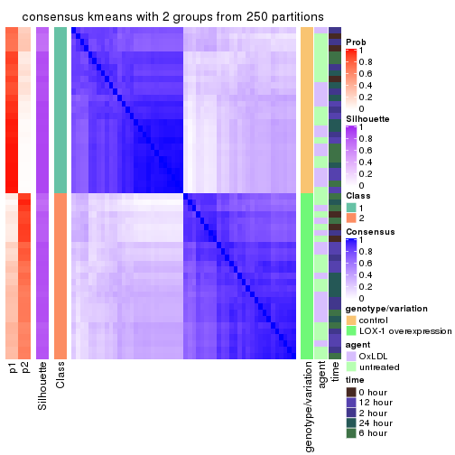</p>

</div>
<div id='tab-CV-kmeans-consensus-heatmap-2'>
<pre><code class="r">consensus_heatmap(res, k = 3)
</code></pre>

<p>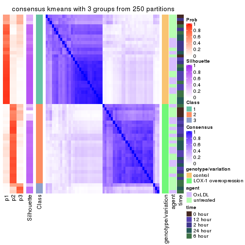</p>

</div>
<div id='tab-CV-kmeans-consensus-heatmap-3'>
<pre><code class="r">consensus_heatmap(res, k = 4)
</code></pre>

<p>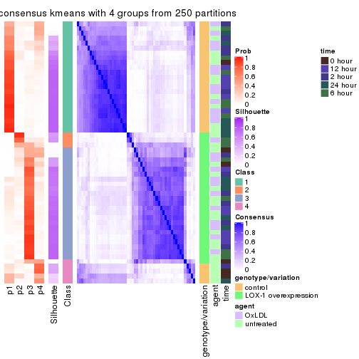</p>

</div>
<div id='tab-CV-kmeans-consensus-heatmap-4'>
<pre><code class="r">consensus_heatmap(res, k = 5)
</code></pre>

<p>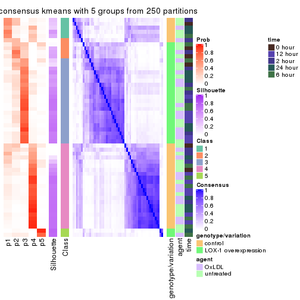</p>

</div>
<div id='tab-CV-kmeans-consensus-heatmap-5'>
<pre><code class="r">consensus_heatmap(res, k = 6)
</code></pre>

<p>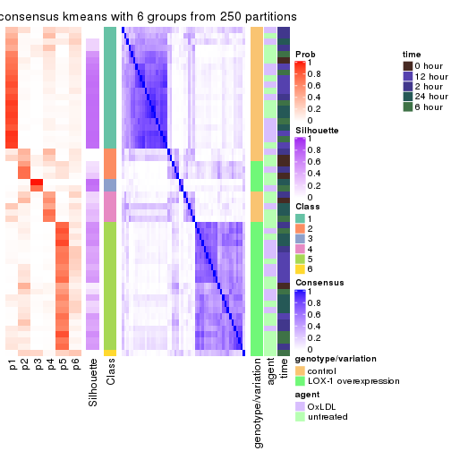</p>

</div>
</div>

Heatmaps for the membership of samples in all partitions to see how consistent they are:


<script>
$( function() {
	$( '#tabs-CV-kmeans-membership-heatmap' ).tabs();
} );
</script>
<div id='tabs-CV-kmeans-membership-heatmap'>
<ul>
<li><a href='#tab-CV-kmeans-membership-heatmap-1'>k = 2</a></li>
<li><a href='#tab-CV-kmeans-membership-heatmap-2'>k = 3</a></li>
<li><a href='#tab-CV-kmeans-membership-heatmap-3'>k = 4</a></li>
<li><a href='#tab-CV-kmeans-membership-heatmap-4'>k = 5</a></li>
<li><a href='#tab-CV-kmeans-membership-heatmap-5'>k = 6</a></li>
</ul>
<div id='tab-CV-kmeans-membership-heatmap-1'>
<pre><code class="r">membership_heatmap(res, k = 2)
</code></pre>

<p>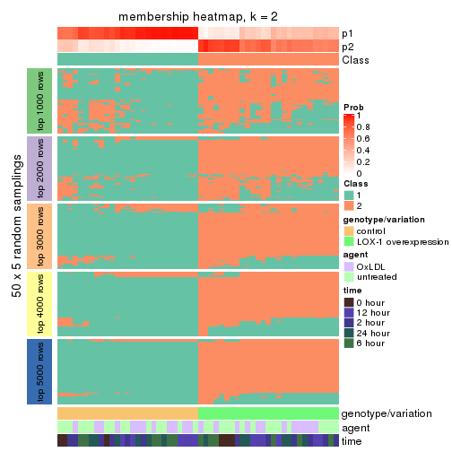</p>

</div>
<div id='tab-CV-kmeans-membership-heatmap-2'>
<pre><code class="r">membership_heatmap(res, k = 3)
</code></pre>

<p>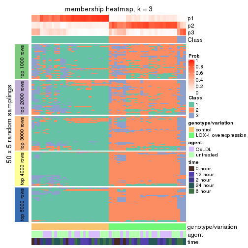</p>

</div>
<div id='tab-CV-kmeans-membership-heatmap-3'>
<pre><code class="r">membership_heatmap(res, k = 4)
</code></pre>

<p>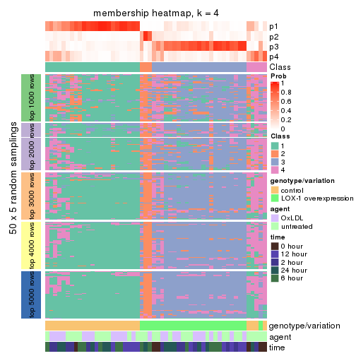</p>

</div>
<div id='tab-CV-kmeans-membership-heatmap-4'>
<pre><code class="r">membership_heatmap(res, k = 5)
</code></pre>

<p>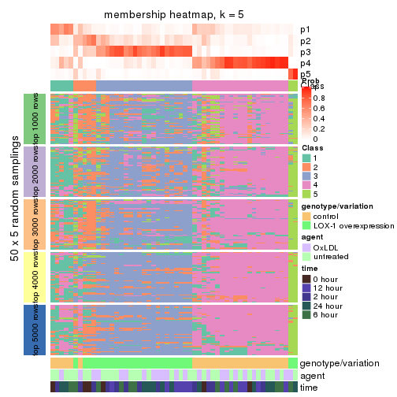</p>

</div>
<div id='tab-CV-kmeans-membership-heatmap-5'>
<pre><code class="r">membership_heatmap(res, k = 6)
</code></pre>

<p>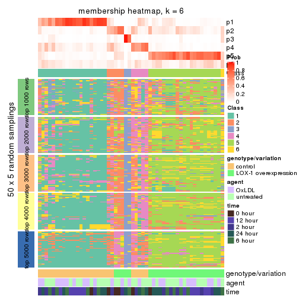</p>

</div>
</div>

As soon as we have had the classes for columns, we can look for signatures
which are significantly different between classes which can be candidate marks
for certain classes. Following are the heatmaps for signatures.


Signature heatmaps where rows are scaled:


<script>
$( function() {
	$( '#tabs-CV-kmeans-get-signatures' ).tabs();
} );
</script>
<div id='tabs-CV-kmeans-get-signatures'>
<ul>
<li><a href='#tab-CV-kmeans-get-signatures-1'>k = 2</a></li>
<li><a href='#tab-CV-kmeans-get-signatures-2'>k = 3</a></li>
<li><a href='#tab-CV-kmeans-get-signatures-3'>k = 4</a></li>
<li><a href='#tab-CV-kmeans-get-signatures-4'>k = 5</a></li>
<li><a href='#tab-CV-kmeans-get-signatures-5'>k = 6</a></li>
</ul>
<div id='tab-CV-kmeans-get-signatures-1'>
<pre><code class="r">get_signatures(res, k = 2)
</code></pre>

<p>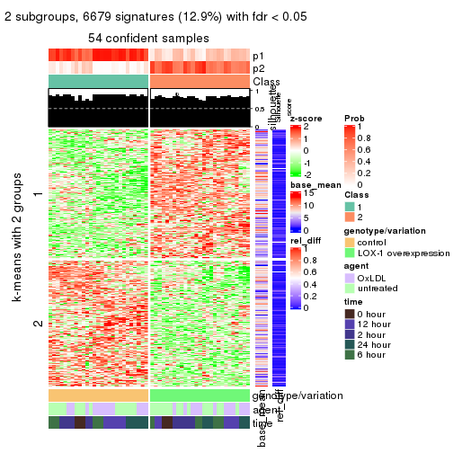</p>

</div>
<div id='tab-CV-kmeans-get-signatures-2'>
<pre><code class="r">get_signatures(res, k = 3)
</code></pre>

<p>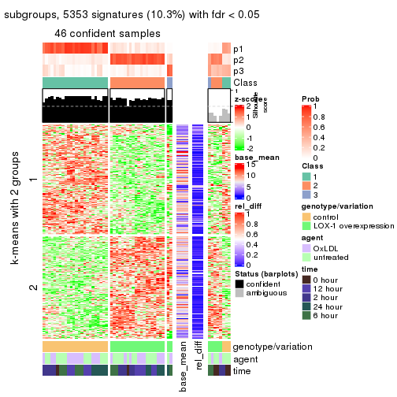</p>

</div>
<div id='tab-CV-kmeans-get-signatures-3'>
<pre><code class="r">get_signatures(res, k = 4)
</code></pre>

<p>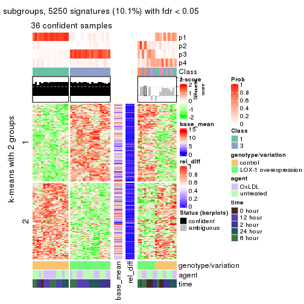</p>

</div>
<div id='tab-CV-kmeans-get-signatures-4'>
<pre><code class="r">get_signatures(res, k = 5)
</code></pre>

<p>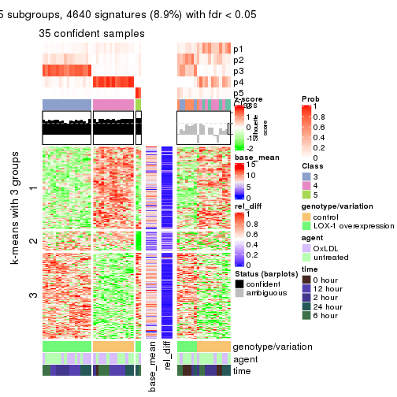</p>

</div>
<div id='tab-CV-kmeans-get-signatures-5'>
<pre><code class="r">get_signatures(res, k = 6)
</code></pre>

<p>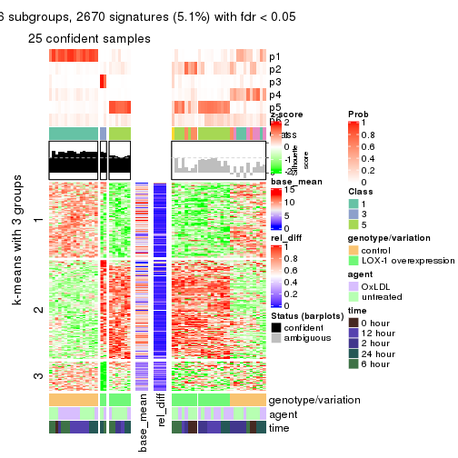</p>

</div>
</div>


Signature heatmaps where rows are not scaled:


<script>
$( function() {
	$( '#tabs-CV-kmeans-get-signatures-no-scale' ).tabs();
} );
</script>
<div id='tabs-CV-kmeans-get-signatures-no-scale'>
<ul>
<li><a href='#tab-CV-kmeans-get-signatures-no-scale-1'>k = 2</a></li>
<li><a href='#tab-CV-kmeans-get-signatures-no-scale-2'>k = 3</a></li>
<li><a href='#tab-CV-kmeans-get-signatures-no-scale-3'>k = 4</a></li>
<li><a href='#tab-CV-kmeans-get-signatures-no-scale-4'>k = 5</a></li>
<li><a href='#tab-CV-kmeans-get-signatures-no-scale-5'>k = 6</a></li>
</ul>
<div id='tab-CV-kmeans-get-signatures-no-scale-1'>
<pre><code class="r">get_signatures(res, k = 2, scale_rows = FALSE)
</code></pre>

<p>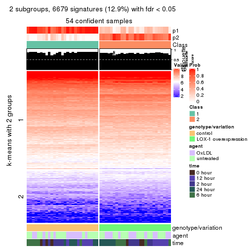</p>

</div>
<div id='tab-CV-kmeans-get-signatures-no-scale-2'>
<pre><code class="r">get_signatures(res, k = 3, scale_rows = FALSE)
</code></pre>

<p>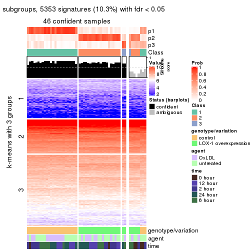</p>

</div>
<div id='tab-CV-kmeans-get-signatures-no-scale-3'>
<pre><code class="r">get_signatures(res, k = 4, scale_rows = FALSE)
</code></pre>

<p>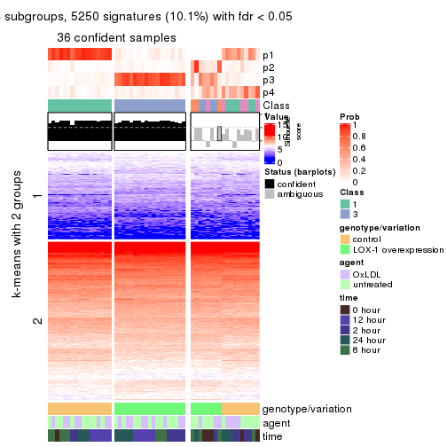</p>

</div>
<div id='tab-CV-kmeans-get-signatures-no-scale-4'>
<pre><code class="r">get_signatures(res, k = 5, scale_rows = FALSE)
</code></pre>

<p>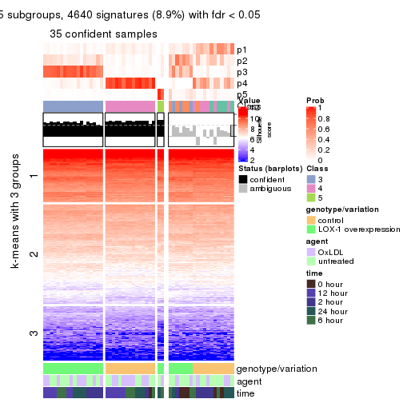</p>

</div>
<div id='tab-CV-kmeans-get-signatures-no-scale-5'>
<pre><code class="r">get_signatures(res, k = 6, scale_rows = FALSE)
</code></pre>

<p>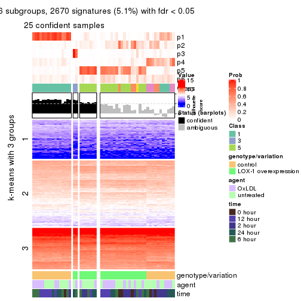</p>

</div>
</div>


Compare the overlap of signatures from different k:

```r
compare_signatures(res)
```

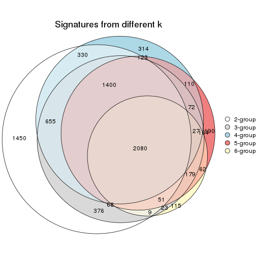

`get_signature()` returns a data frame invisibly. TO get the list of signatures, the function
call should be assigned to a variable explicitly. In following code, if `plot` argument is set
to `FALSE`, no heatmap is plotted while only the differential analysis is performed.

```r
# code only for demonstration
tb = get_signature(res, k = ..., plot = FALSE)
```

An example of the output of `tb` is:

```
#>   which_row         fdr    mean_1    mean_2 scaled_mean_1 scaled_mean_2 km
#> 1        38 0.042760348  8.373488  9.131774    -0.5533452     0.5164555  1
#> 2        40 0.018707592  7.106213  8.469186    -0.6173731     0.5762149  1
#> 3        55 0.019134737 10.221463 11.207825    -0.6159697     0.5749050  1
#> 4        59 0.006059896  5.921854  7.869574    -0.6899429     0.6439467  1
#> 5        60 0.018055526  8.928898 10.211722    -0.6204761     0.5791110  1
#> 6        98 0.009384629 15.714769 14.887706     0.6635654    -0.6193277  2
...
```

The columns in `tb` are:

1. `which_row`: row indices corresponding to the input matrix.
2. `fdr`: FDR for the differential test. 
3. `mean_x`: The mean value in group x.
4. `scaled_mean_x`: The mean value in group x after rows are scaled.
5. `km`: Row groups if k-means clustering is applied to rows.


UMAP plot which shows how samples are separated.


<script>
$( function() {
	$( '#tabs-CV-kmeans-dimension-reduction' ).tabs();
} );
</script>
<div id='tabs-CV-kmeans-dimension-reduction'>
<ul>
<li><a href='#tab-CV-kmeans-dimension-reduction-1'>k = 2</a></li>
<li><a href='#tab-CV-kmeans-dimension-reduction-2'>k = 3</a></li>
<li><a href='#tab-CV-kmeans-dimension-reduction-3'>k = 4</a></li>
<li><a href='#tab-CV-kmeans-dimension-reduction-4'>k = 5</a></li>
<li><a href='#tab-CV-kmeans-dimension-reduction-5'>k = 6</a></li>
</ul>
<div id='tab-CV-kmeans-dimension-reduction-1'>
<pre><code class="r">dimension_reduction(res, k = 2, method = &quot;UMAP&quot;)
</code></pre>

<p>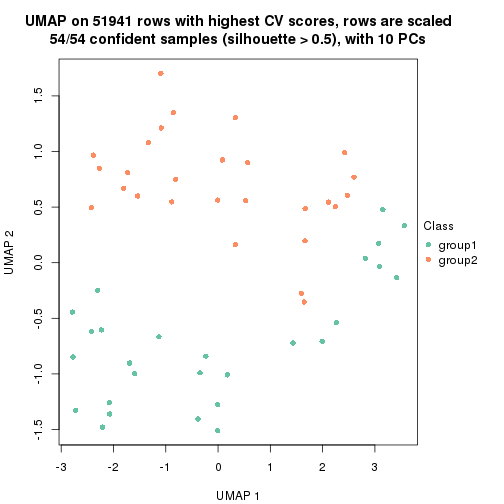</p>

</div>
<div id='tab-CV-kmeans-dimension-reduction-2'>
<pre><code class="r">dimension_reduction(res, k = 3, method = &quot;UMAP&quot;)
</code></pre>

<p>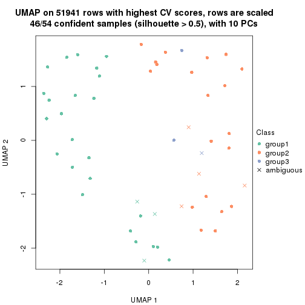</p>

</div>
<div id='tab-CV-kmeans-dimension-reduction-3'>
<pre><code class="r">dimension_reduction(res, k = 4, method = &quot;UMAP&quot;)
</code></pre>

<p>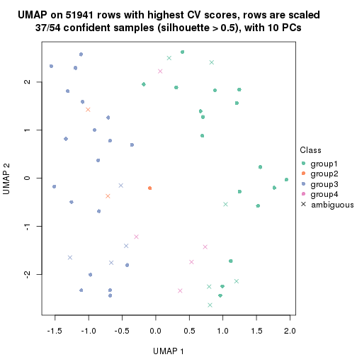</p>

</div>
<div id='tab-CV-kmeans-dimension-reduction-4'>
<pre><code class="r">dimension_reduction(res, k = 5, method = &quot;UMAP&quot;)
</code></pre>

<p>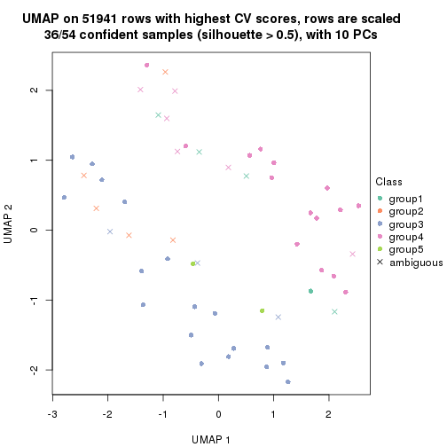</p>

</div>
<div id='tab-CV-kmeans-dimension-reduction-5'>
<pre><code class="r">dimension_reduction(res, k = 6, method = &quot;UMAP&quot;)
</code></pre>

<p>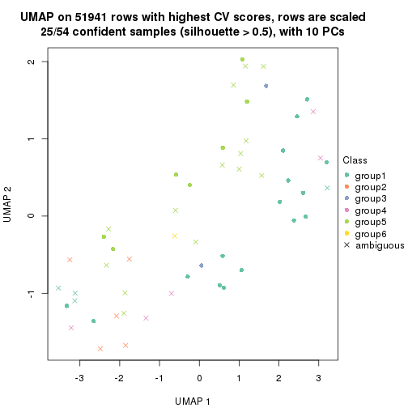</p>

</div>
</div>


Following heatmap shows how subgroups are split when increasing `k`:

```r
collect_classes(res)
```

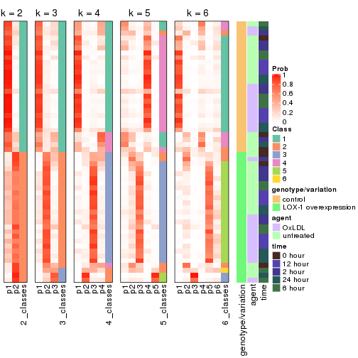


Test correlation between subgroups and known annotations. If the known
annotation is numeric, one-way ANOVA test is applied, and if the known
annotation is discrete, chi-squared contingency table test is applied.

```r
test_to_known_factors(res)
```

```
#>            n genotype/variation(p) agent(p) time(p) k
#> CV:kmeans 54              1.48e-12    1.000   1.000 2
#> CV:kmeans 46              1.03e-10    0.945   0.933 3
#> CV:kmeans 37              9.24e-09    0.581   0.604 4
#> CV:kmeans 36              7.49e-08    0.785   0.652 5
#> CV:kmeans 25              3.73e-06    0.625   0.711 6
```


If matrix rows can be associated to genes, consider to use `functional_enrichment(res,
...)` to perform function enrichment for the signature genes. See [this vignette](http://bioconductor.org/packages/devel/bioc/vignettes/cola/inst/doc/functional_enrichment.html) for more detailed explanations.


 

---------------------------------------------------


### CV:skmeans


The object with results only for a single top-value method and a single partition method 
can be extracted as:

```r
res = res_list["CV", "skmeans"]
# you can also extract it by
# res = res_list["CV:skmeans"]
```

A summary of `res` and all the functions that can be applied to it:

```r
res
```

```
#> A 'ConsensusPartition' object with k = 2, 3, 4, 5, 6.
#>   On a matrix with 51941 rows and 54 columns.
#>   Top rows (1000, 2000, 3000, 4000, 5000) are extracted by 'CV' method.
#>   Subgroups are detected by 'skmeans' method.
#>   Performed in total 1250 partitions by row resampling.
#>   Best k for subgroups seems to be 2.
#> 
#> Following methods can be applied to this 'ConsensusPartition' object:
#>  [1] "cola_report"             "collect_classes"         "collect_plots"          
#>  [4] "collect_stats"           "colnames"                "compare_signatures"     
#>  [7] "consensus_heatmap"       "dimension_reduction"     "functional_enrichment"  
#> [10] "get_anno_col"            "get_anno"                "get_classes"            
#> [13] "get_consensus"           "get_matrix"              "get_membership"         
#> [16] "get_param"               "get_signatures"          "get_stats"              
#> [19] "is_best_k"               "is_stable_k"             "membership_heatmap"     
#> [22] "ncol"                    "nrow"                    "plot_ecdf"              
#> [25] "rownames"                "select_partition_number" "show"                   
#> [28] "suggest_best_k"          "test_to_known_factors"
```

`collect_plots()` function collects all the plots made from `res` for all `k` (number of partitions)
into one single page to provide an easy and fast comparison between different `k`.

```r
collect_plots(res)
```

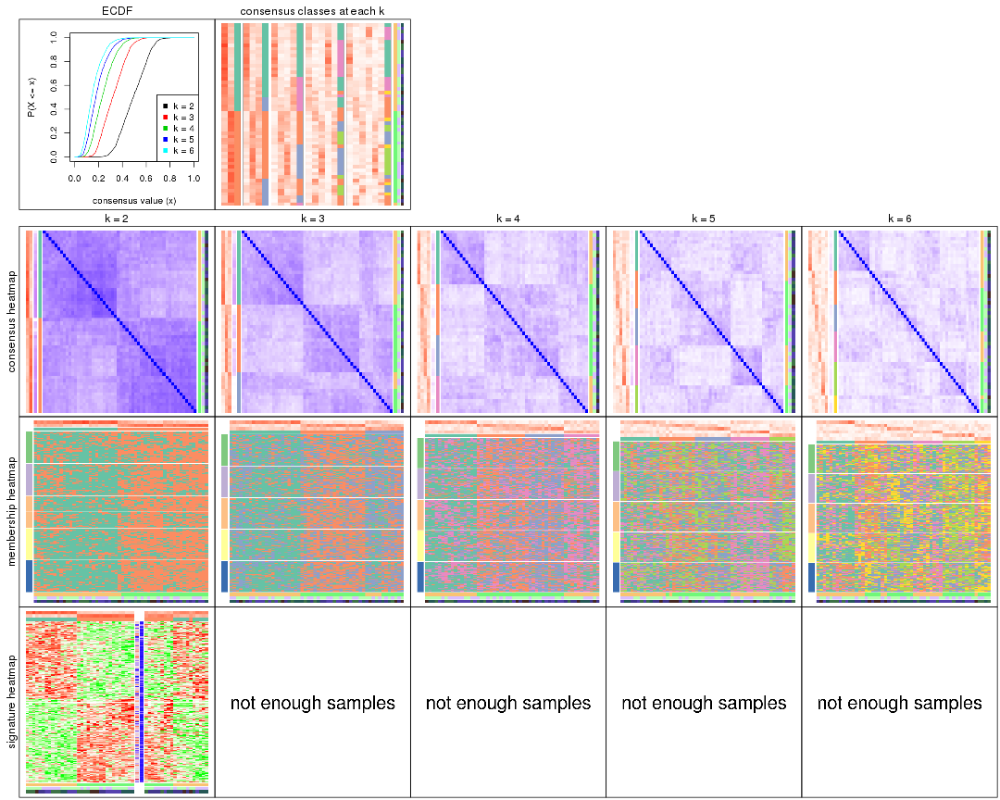

The plots are:

- The first row: a plot of the ECDF (empirical cumulative distribution
  function) curves of the consensus matrix for each `k` and the heatmap of
  predicted classes for each `k`.
- The second row: heatmaps of the consensus matrix for each `k`.
- The third row: heatmaps of the membership matrix for each `k`.
- The fouth row: heatmaps of the signatures for each `k`.

All the plots in panels can be made by individual functions and they are
plotted later in this section.

`select_partition_number()` produces several plots showing different
statistics for choosing "optimized" `k`. There are following statistics:

- ECDF curves of the consensus matrix for each `k`;
- 1-PAC. [The PAC
  score](https://en.wikipedia.org/wiki/Consensus_clustering#Over-interpretation_potential_of_consensus_clustering)
  measures the proportion of the ambiguous subgrouping.
- Mean silhouette score.
- Concordance. The mean probability of fiting the consensus class ids in all
  partitions.
- Area increased. Denote $A_k$ as the area under the ECDF curve for current
  `k`, the area increased is defined as $A_k - A_{k-1}$.
- Rand index. The percent of pairs of samples that are both in a same cluster
  or both are not in a same cluster in the partition of k and k-1.
- Jaccard index. The ratio of pairs of samples are both in a same cluster in
  the partition of k and k-1 and the pairs of samples are both in a same
  cluster in the partition k or k-1.

The detailed explanations of these statistics can be found in [the _cola_
vignette](http://bioconductor.org/packages/devel/bioc/vignettes/cola/inst/doc/cola.html#toc_13).

Generally speaking, lower PAC score, higher mean silhouette score or higher
concordance corresponds to better partition. Rand index and Jaccard index
measure how similar the current partition is compared to partition with `k-1`.
If they are too similar, we won't accept `k` is better than `k-1`.

```r
select_partition_number(res)
```

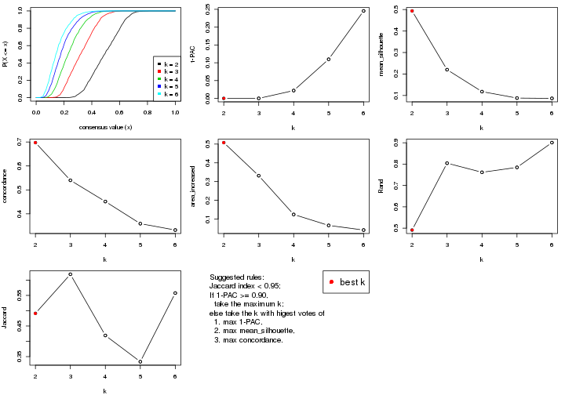

The numeric values for all these statistics can be obtained by `get_stats()`.

```r
get_stats(res)
```

```
#>   k 1-PAC mean_silhouette concordance area_increased  Rand Jaccard
#> 2 2 0.000          0.4934       0.697         0.5078 0.491   0.491
#> 3 3 0.000          0.2200       0.540         0.3313 0.804   0.619
#> 4 4 0.022          0.1178       0.451         0.1246 0.762   0.419
#> 5 5 0.110          0.0880       0.359         0.0661 0.785   0.333
#> 6 6 0.245          0.0865       0.332         0.0415 0.901   0.558
```

`suggest_best_k()` suggests the best $k$ based on these statistics. The rules are as follows:

- All $k$ with Jaccard index larger than 0.95 are removed because increasing
  $k$ does not provide enough extra information. If all $k$ are removed, it is
  marked as no subgroup is detected.
- For all $k$ with 1-PAC score larger than 0.9, the maximal $k$ is taken as
  the best $k$, and other $k$ are marked as optional $k$.
- If it does not fit the second rule. The $k$ with the maximal vote of the
  highest 1-PAC score, highest mean silhouette, and highest concordance is
  taken as the best $k$.

```r
suggest_best_k(res)
```

```
#> [1] 2
```


Following shows the table of the partitions (You need to click the **show/hide
code output** link to see it). The membership matrix (columns with name `p*`)
is inferred by
[`clue::cl_consensus()`](https://www.rdocumentation.org/link/cl_consensus?package=clue)
function with the `SE` method. Basically the value in the membership matrix
represents the probability to belong to a certain group. The finall class
label for an item is determined with the group with highest probability it
belongs to.

In `get_classes()` function, the entropy is calculated from the membership
matrix and the silhouette score is calculated from the consensus matrix.


<script>
$( function() {
	$( '#tabs-CV-skmeans-get-classes' ).tabs();
} );
</script>
<div id='tabs-CV-skmeans-get-classes'>
<ul>
<li><a href='#tab-CV-skmeans-get-classes-1'>k = 2</a></li>
<li><a href='#tab-CV-skmeans-get-classes-2'>k = 3</a></li>
<li><a href='#tab-CV-skmeans-get-classes-3'>k = 4</a></li>
<li><a href='#tab-CV-skmeans-get-classes-4'>k = 5</a></li>
<li><a href='#tab-CV-skmeans-get-classes-5'>k = 6</a></li>
</ul>

<div id='tab-CV-skmeans-get-classes-1'>
<p><a id='tab-CV-skmeans-get-classes-1-a' style='color:#0366d6' href='#'>show/hide code output</a></p>
<pre><code class="r">cbind(get_classes(res, k = 2), get_membership(res, k = 2))
</code></pre>

<pre><code>#&gt;           class entropy silhouette    p1    p2
#&gt; GSM329068     2   0.767     0.5932 0.224 0.776
#&gt; GSM329074     2   0.767     0.5831 0.224 0.776
#&gt; GSM329100     2   0.827     0.5481 0.260 0.740
#&gt; GSM329062     2   0.753     0.6121 0.216 0.784
#&gt; GSM329079     2   0.973     0.3154 0.404 0.596
#&gt; GSM329090     2   0.958     0.3931 0.380 0.620
#&gt; GSM329066     2   0.886     0.5196 0.304 0.696
#&gt; GSM329086     2   0.900     0.5242 0.316 0.684
#&gt; GSM329099     2   0.997     0.1365 0.468 0.532
#&gt; GSM329071     2   0.795     0.6002 0.240 0.760
#&gt; GSM329078     2   0.886     0.5580 0.304 0.696
#&gt; GSM329081     2   0.827     0.5938 0.260 0.740
#&gt; GSM329096     2   0.745     0.6057 0.212 0.788
#&gt; GSM329102     2   0.900     0.5166 0.316 0.684
#&gt; GSM329104     2   0.943     0.4598 0.360 0.640
#&gt; GSM329067     2   0.821     0.5761 0.256 0.744
#&gt; GSM329072     2   0.936     0.4898 0.352 0.648
#&gt; GSM329075     2   0.987     0.3380 0.432 0.568
#&gt; GSM329058     2   0.861     0.5608 0.284 0.716
#&gt; GSM329073     2   0.900     0.4997 0.316 0.684
#&gt; GSM329107     2   0.844     0.5850 0.272 0.728
#&gt; GSM329057     2   0.745     0.6010 0.212 0.788
#&gt; GSM329085     2   0.958     0.3934 0.380 0.620
#&gt; GSM329089     2   0.753     0.6090 0.216 0.784
#&gt; GSM329076     2   0.988     0.3133 0.436 0.564
#&gt; GSM329094     2   0.767     0.6078 0.224 0.776
#&gt; GSM329105     2   0.802     0.5998 0.244 0.756
#&gt; GSM329056     1   0.833     0.5694 0.736 0.264
#&gt; GSM329069     1   0.946     0.3949 0.636 0.364
#&gt; GSM329077     2   0.999     0.0182 0.484 0.516
#&gt; GSM329070     1   0.689     0.6055 0.816 0.184
#&gt; GSM329082     1   0.955     0.4054 0.624 0.376
#&gt; GSM329092     1   0.994     0.1319 0.544 0.456
#&gt; GSM329083     1   0.855     0.5455 0.720 0.280
#&gt; GSM329101     1   0.506     0.6150 0.888 0.112
#&gt; GSM329106     1   0.839     0.5695 0.732 0.268
#&gt; GSM329087     1   0.795     0.5674 0.760 0.240
#&gt; GSM329091     1   0.753     0.6083 0.784 0.216
#&gt; GSM329093     1   0.861     0.5555 0.716 0.284
#&gt; GSM329080     1   0.671     0.6058 0.824 0.176
#&gt; GSM329084     1   0.991     0.2793 0.556 0.444
#&gt; GSM329088     1   0.745     0.5996 0.788 0.212
#&gt; GSM329059     1   0.985     0.3405 0.572 0.428
#&gt; GSM329097     1   0.833     0.5737 0.736 0.264
#&gt; GSM329098     1   0.963     0.3815 0.612 0.388
#&gt; GSM329055     1   0.615     0.6126 0.848 0.152
#&gt; GSM329103     1   0.909     0.5104 0.676 0.324
#&gt; GSM329108     1   0.745     0.6064 0.788 0.212
#&gt; GSM329061     1   0.808     0.5727 0.752 0.248
#&gt; GSM329064     1   0.904     0.4815 0.680 0.320
#&gt; GSM329065     1   0.788     0.5810 0.764 0.236
#&gt; GSM329060     1   0.946     0.4191 0.636 0.364
#&gt; GSM329063     1   0.975     0.3120 0.592 0.408
#&gt; GSM329095     1   0.952     0.4493 0.628 0.372
</code></pre>

<script>
$('#tab-CV-skmeans-get-classes-1-a').parent().next().next().hide();
$('#tab-CV-skmeans-get-classes-1-a').click(function(){
  $('#tab-CV-skmeans-get-classes-1-a').parent().next().next().toggle();
  return(false);
});
</script>
</div>

<div id='tab-CV-skmeans-get-classes-2'>
<p><a id='tab-CV-skmeans-get-classes-2-a' style='color:#0366d6' href='#'>show/hide code output</a></p>
<pre><code class="r">cbind(get_classes(res, k = 3), get_membership(res, k = 3))
</code></pre>

<pre><code>#&gt;           class entropy silhouette    p1    p2    p3
#&gt; GSM329068     2   0.867    0.12733 0.104 0.480 0.416
#&gt; GSM329074     3   0.767    0.02841 0.060 0.340 0.600
#&gt; GSM329100     3   0.863   -0.06777 0.100 0.436 0.464
#&gt; GSM329062     2   0.853    0.15270 0.100 0.524 0.376
#&gt; GSM329079     2   0.959    0.08379 0.200 0.420 0.380
#&gt; GSM329090     2   0.839    0.28961 0.148 0.616 0.236
#&gt; GSM329066     2   0.906    0.25618 0.200 0.552 0.248
#&gt; GSM329086     2   0.956    0.04915 0.200 0.444 0.356
#&gt; GSM329099     2   0.973   -0.00159 0.224 0.400 0.376
#&gt; GSM329071     2   0.807    0.28950 0.104 0.620 0.276
#&gt; GSM329078     2   0.803    0.31207 0.168 0.656 0.176
#&gt; GSM329081     2   0.856    0.25330 0.148 0.596 0.256
#&gt; GSM329096     2   0.733    0.31764 0.092 0.692 0.216
#&gt; GSM329102     3   0.984   -0.01077 0.248 0.368 0.384
#&gt; GSM329104     3   0.914   -0.07058 0.144 0.408 0.448
#&gt; GSM329067     3   0.820   -0.07697 0.076 0.400 0.524
#&gt; GSM329072     2   0.935    0.18663 0.212 0.512 0.276
#&gt; GSM329075     3   0.976   -0.01185 0.244 0.324 0.432
#&gt; GSM329058     2   0.831    0.20260 0.096 0.568 0.336
#&gt; GSM329073     3   0.870    0.01408 0.116 0.360 0.524
#&gt; GSM329107     2   0.847    0.22626 0.104 0.552 0.344
#&gt; GSM329057     2   0.817    0.25015 0.088 0.576 0.336
#&gt; GSM329085     2   0.802    0.30598 0.160 0.656 0.184
#&gt; GSM329089     2   0.798    0.27535 0.108 0.636 0.256
#&gt; GSM329076     2   0.989    0.06085 0.272 0.400 0.328
#&gt; GSM329094     2   0.873    0.22881 0.148 0.572 0.280
#&gt; GSM329105     2   0.849    0.26191 0.156 0.608 0.236
#&gt; GSM329056     1   0.848    0.33253 0.568 0.112 0.320
#&gt; GSM329069     1   0.907    0.12033 0.440 0.136 0.424
#&gt; GSM329077     3   0.870    0.23217 0.256 0.160 0.584
#&gt; GSM329070     1   0.853    0.32752 0.556 0.112 0.332
#&gt; GSM329082     1   0.961    0.16262 0.424 0.204 0.372
#&gt; GSM329092     3   0.922    0.02724 0.360 0.160 0.480
#&gt; GSM329083     1   0.868    0.22735 0.476 0.104 0.420
#&gt; GSM329101     1   0.671    0.48032 0.748 0.112 0.140
#&gt; GSM329106     1   0.800    0.41218 0.644 0.120 0.236
#&gt; GSM329087     1   0.848    0.44081 0.616 0.196 0.188
#&gt; GSM329091     1   0.788    0.43993 0.656 0.120 0.224
#&gt; GSM329093     1   0.912    0.36580 0.548 0.216 0.236
#&gt; GSM329080     1   0.718    0.47547 0.712 0.104 0.184
#&gt; GSM329084     3   0.958   -0.09077 0.396 0.196 0.408
#&gt; GSM329088     1   0.739    0.46545 0.704 0.136 0.160
#&gt; GSM329059     3   0.953   -0.04423 0.372 0.192 0.436
#&gt; GSM329097     1   0.860    0.41266 0.604 0.188 0.208
#&gt; GSM329098     3   0.962    0.01741 0.348 0.212 0.440
#&gt; GSM329055     1   0.722    0.48006 0.712 0.112 0.176
#&gt; GSM329103     1   0.936    0.31517 0.516 0.236 0.248
#&gt; GSM329108     1   0.831    0.43782 0.632 0.180 0.188
#&gt; GSM329061     1   0.836    0.42232 0.624 0.160 0.216
#&gt; GSM329064     1   0.933    0.29708 0.508 0.200 0.292
#&gt; GSM329065     1   0.802    0.46414 0.656 0.184 0.160
#&gt; GSM329060     1   0.935    0.32071 0.508 0.288 0.204
#&gt; GSM329063     1   0.935    0.26948 0.512 0.212 0.276
#&gt; GSM329095     1   0.974    0.13653 0.440 0.248 0.312
</code></pre>

<script>
$('#tab-CV-skmeans-get-classes-2-a').parent().next().next().hide();
$('#tab-CV-skmeans-get-classes-2-a').click(function(){
  $('#tab-CV-skmeans-get-classes-2-a').parent().next().next().toggle();
  return(false);
});
</script>
</div>

<div id='tab-CV-skmeans-get-classes-3'>
<p><a id='tab-CV-skmeans-get-classes-3-a' style='color:#0366d6' href='#'>show/hide code output</a></p>
<pre><code class="r">cbind(get_classes(res, k = 4), get_membership(res, k = 4))
</code></pre>

<pre><code>#&gt;           class entropy silhouette    p1    p2    p3    p4
#&gt; GSM329068     2   0.855   -0.01097 0.060 0.396 0.396 0.148
#&gt; GSM329074     2   0.839    0.03735 0.052 0.484 0.300 0.164
#&gt; GSM329100     3   0.889   -0.06530 0.048 0.340 0.344 0.268
#&gt; GSM329062     2   0.867   -0.00909 0.072 0.432 0.348 0.148
#&gt; GSM329079     2   0.894    0.14276 0.172 0.500 0.188 0.140
#&gt; GSM329090     3   0.874    0.08521 0.088 0.268 0.484 0.160
#&gt; GSM329066     2   0.873    0.03187 0.136 0.448 0.328 0.088
#&gt; GSM329086     3   0.908    0.03818 0.100 0.236 0.452 0.212
#&gt; GSM329099     2   0.858    0.15177 0.172 0.540 0.120 0.168
#&gt; GSM329071     3   0.726    0.18628 0.088 0.164 0.656 0.092
#&gt; GSM329078     3   0.863    0.14136 0.124 0.264 0.504 0.108
#&gt; GSM329081     2   0.934   -0.01377 0.128 0.360 0.348 0.164
#&gt; GSM329096     3   0.781    0.15657 0.068 0.216 0.592 0.124
#&gt; GSM329102     2   0.962    0.06153 0.136 0.352 0.228 0.284
#&gt; GSM329104     2   0.969    0.02011 0.140 0.332 0.280 0.248
#&gt; GSM329067     3   0.795   -0.00329 0.024 0.412 0.416 0.148
#&gt; GSM329072     3   0.939    0.08206 0.176 0.248 0.424 0.152
#&gt; GSM329075     2   0.835    0.18275 0.160 0.564 0.112 0.164
#&gt; GSM329058     2   0.870    0.03935 0.064 0.464 0.280 0.192
#&gt; GSM329073     2   0.820    0.12911 0.076 0.560 0.156 0.208
#&gt; GSM329107     2   0.958   -0.03413 0.160 0.340 0.328 0.172
#&gt; GSM329057     3   0.714    0.15544 0.036 0.252 0.616 0.096
#&gt; GSM329085     3   0.832    0.17411 0.164 0.156 0.568 0.112
#&gt; GSM329089     3   0.758    0.17399 0.056 0.184 0.616 0.144
#&gt; GSM329076     2   0.966    0.01542 0.196 0.352 0.292 0.160
#&gt; GSM329094     3   0.915    0.03608 0.076 0.328 0.364 0.232
#&gt; GSM329105     2   0.858   -0.06136 0.080 0.412 0.388 0.120
#&gt; GSM329056     1   0.876    0.14897 0.480 0.172 0.084 0.264
#&gt; GSM329069     4   0.967    0.10316 0.292 0.156 0.204 0.348
#&gt; GSM329077     4   0.840    0.15294 0.112 0.272 0.096 0.520
#&gt; GSM329070     4   0.834   -0.06182 0.348 0.168 0.040 0.444
#&gt; GSM329082     4   0.917    0.07091 0.268 0.140 0.148 0.444
#&gt; GSM329092     4   0.941    0.15874 0.176 0.220 0.172 0.432
#&gt; GSM329083     4   0.862    0.06057 0.304 0.136 0.084 0.476
#&gt; GSM329101     1   0.706    0.30648 0.664 0.104 0.060 0.172
#&gt; GSM329106     1   0.864    0.15117 0.460 0.116 0.096 0.328
#&gt; GSM329087     1   0.839    0.25570 0.556 0.148 0.108 0.188
#&gt; GSM329091     1   0.746    0.25558 0.580 0.044 0.096 0.280
#&gt; GSM329093     1   0.933    0.14542 0.444 0.188 0.156 0.212
#&gt; GSM329080     1   0.690    0.32601 0.684 0.076 0.088 0.152
#&gt; GSM329084     4   0.894    0.20122 0.188 0.172 0.140 0.500
#&gt; GSM329088     1   0.792    0.28143 0.600 0.112 0.104 0.184
#&gt; GSM329059     4   0.970    0.16862 0.204 0.220 0.196 0.380
#&gt; GSM329097     1   0.909    0.19018 0.472 0.160 0.140 0.228
#&gt; GSM329098     4   0.968    0.10398 0.224 0.284 0.148 0.344
#&gt; GSM329055     1   0.713    0.29813 0.648 0.140 0.040 0.172
#&gt; GSM329103     1   0.879    0.14593 0.452 0.116 0.112 0.320
#&gt; GSM329108     1   0.775    0.23063 0.536 0.100 0.048 0.316
#&gt; GSM329061     1   0.863    0.20935 0.508 0.108 0.128 0.256
#&gt; GSM329064     1   0.975    0.02269 0.336 0.188 0.184 0.292
#&gt; GSM329065     1   0.717    0.31792 0.664 0.076 0.108 0.152
#&gt; GSM329060     1   0.923    0.15094 0.420 0.104 0.212 0.264
#&gt; GSM329063     4   0.864    0.08300 0.336 0.076 0.140 0.448
#&gt; GSM329095     4   0.966    0.04129 0.292 0.128 0.272 0.308
</code></pre>

<script>
$('#tab-CV-skmeans-get-classes-3-a').parent().next().next().hide();
$('#tab-CV-skmeans-get-classes-3-a').click(function(){
  $('#tab-CV-skmeans-get-classes-3-a').parent().next().next().toggle();
  return(false);
});
</script>
</div>

<div id='tab-CV-skmeans-get-classes-4'>
<p><a id='tab-CV-skmeans-get-classes-4-a' style='color:#0366d6' href='#'>show/hide code output</a></p>
<pre><code class="r">cbind(get_classes(res, k = 5), get_membership(res, k = 5))
</code></pre>

<pre><code>#&gt;           class entropy silhouette    p1    p2    p3    p4    p5
#&gt; GSM329068     2   0.862    0.07795 0.160 0.428 0.112 0.044 0.256
#&gt; GSM329074     2   0.773    0.12509 0.092 0.560 0.104 0.048 0.196
#&gt; GSM329100     2   0.828    0.10752 0.120 0.500 0.168 0.040 0.172
#&gt; GSM329062     2   0.854   -0.03990 0.064 0.332 0.256 0.036 0.312
#&gt; GSM329079     5   0.924    0.09917 0.088 0.160 0.192 0.164 0.396
#&gt; GSM329090     3   0.904    0.09833 0.100 0.148 0.404 0.100 0.248
#&gt; GSM329066     5   0.843    0.01100 0.048 0.112 0.324 0.104 0.412
#&gt; GSM329086     2   0.909    0.00810 0.120 0.340 0.280 0.056 0.204
#&gt; GSM329099     5   0.958    0.10100 0.136 0.188 0.176 0.148 0.352
#&gt; GSM329071     3   0.735    0.15714 0.028 0.296 0.528 0.076 0.072
#&gt; GSM329078     3   0.734    0.21589 0.100 0.096 0.624 0.080 0.100
#&gt; GSM329081     3   0.908    0.05761 0.068 0.264 0.372 0.116 0.180
#&gt; GSM329096     3   0.850    0.09957 0.048 0.252 0.380 0.052 0.268
#&gt; GSM329102     5   0.897    0.06004 0.140 0.144 0.204 0.080 0.432
#&gt; GSM329104     2   0.915    0.09980 0.160 0.412 0.196 0.092 0.140
#&gt; GSM329067     2   0.805    0.11236 0.068 0.516 0.160 0.052 0.204
#&gt; GSM329072     3   0.865    0.12826 0.116 0.128 0.484 0.092 0.180
#&gt; GSM329075     5   0.864    0.14520 0.096 0.172 0.112 0.132 0.488
#&gt; GSM329058     2   0.883    0.09402 0.140 0.428 0.208 0.052 0.172
#&gt; GSM329073     5   0.897   -0.07018 0.148 0.312 0.172 0.040 0.328
#&gt; GSM329107     3   0.888    0.04083 0.044 0.232 0.348 0.100 0.276
#&gt; GSM329057     3   0.809    0.11717 0.048 0.300 0.452 0.052 0.148
#&gt; GSM329085     3   0.665    0.22721 0.112 0.048 0.656 0.036 0.148
#&gt; GSM329089     3   0.832    0.15154 0.108 0.260 0.472 0.052 0.108
#&gt; GSM329076     5   0.856    0.06833 0.084 0.096 0.212 0.128 0.480
#&gt; GSM329094     5   0.825   -0.02251 0.088 0.108 0.280 0.056 0.468
#&gt; GSM329105     3   0.803    0.00691 0.068 0.100 0.408 0.048 0.376
#&gt; GSM329056     4   0.887    0.13519 0.232 0.168 0.072 0.424 0.104
#&gt; GSM329069     2   0.881   -0.03333 0.228 0.340 0.064 0.304 0.064
#&gt; GSM329077     2   0.931    0.01906 0.288 0.312 0.096 0.096 0.208
#&gt; GSM329070     1   0.870    0.03820 0.428 0.132 0.052 0.256 0.132
#&gt; GSM329082     1   0.961    0.02509 0.284 0.108 0.152 0.280 0.176
#&gt; GSM329092     1   0.866    0.04717 0.396 0.324 0.080 0.108 0.092
#&gt; GSM329083     1   0.834    0.06728 0.500 0.120 0.080 0.216 0.084
#&gt; GSM329101     4   0.619    0.27600 0.180 0.020 0.056 0.676 0.068
#&gt; GSM329106     4   0.860    0.07166 0.356 0.100 0.104 0.372 0.068
#&gt; GSM329087     4   0.800    0.14193 0.260 0.036 0.132 0.492 0.080
#&gt; GSM329091     4   0.792    0.19463 0.216 0.084 0.088 0.540 0.072
#&gt; GSM329093     1   0.907    0.03925 0.388 0.088 0.168 0.256 0.100
#&gt; GSM329080     4   0.623    0.29177 0.132 0.032 0.068 0.696 0.072
#&gt; GSM329084     1   0.968    0.08555 0.328 0.172 0.132 0.184 0.184
#&gt; GSM329088     4   0.644    0.28002 0.104 0.068 0.056 0.692 0.080
#&gt; GSM329059     2   0.957   -0.02559 0.280 0.288 0.108 0.188 0.136
#&gt; GSM329097     4   0.913    0.13744 0.148 0.148 0.120 0.432 0.152
#&gt; GSM329098     1   0.952    0.04352 0.312 0.244 0.084 0.176 0.184
#&gt; GSM329055     4   0.749    0.18824 0.244 0.020 0.060 0.532 0.144
#&gt; GSM329103     1   0.913    0.01038 0.356 0.084 0.148 0.296 0.116
#&gt; GSM329108     4   0.850    0.12481 0.296 0.084 0.084 0.436 0.100
#&gt; GSM329061     1   0.860   -0.02764 0.380 0.060 0.100 0.344 0.116
#&gt; GSM329064     1   0.920    0.08178 0.404 0.108 0.140 0.216 0.132
#&gt; GSM329065     4   0.778    0.22895 0.168 0.044 0.136 0.560 0.092
#&gt; GSM329060     1   0.969    0.02028 0.304 0.156 0.188 0.232 0.120
#&gt; GSM329063     4   0.943   -0.07012 0.268 0.136 0.076 0.284 0.236
#&gt; GSM329095     1   0.991    0.08058 0.256 0.152 0.188 0.204 0.200
</code></pre>

<script>
$('#tab-CV-skmeans-get-classes-4-a').parent().next().next().hide();
$('#tab-CV-skmeans-get-classes-4-a').click(function(){
  $('#tab-CV-skmeans-get-classes-4-a').parent().next().next().toggle();
  return(false);
});
</script>
</div>

<div id='tab-CV-skmeans-get-classes-5'>
<p><a id='tab-CV-skmeans-get-classes-5-a' style='color:#0366d6' href='#'>show/hide code output</a></p>
<pre><code class="r">cbind(get_classes(res, k = 6), get_membership(res, k = 6))
</code></pre>

<pre><code>#&gt;           class entropy silhouette    p1    p2    p3    p4    p5    p6
#&gt; GSM329068     2   0.908    0.00866 0.036 0.324 0.200 0.084 0.156 0.200
#&gt; GSM329074     2   0.730    0.06500 0.028 0.536 0.096 0.028 0.088 0.224
#&gt; GSM329100     2   0.829    0.02784 0.052 0.460 0.132 0.040 0.184 0.132
#&gt; GSM329062     2   0.812    0.06012 0.016 0.412 0.220 0.028 0.160 0.164
#&gt; GSM329079     3   0.898    0.09115 0.136 0.096 0.412 0.116 0.156 0.084
#&gt; GSM329090     5   0.833    0.14798 0.060 0.112 0.156 0.088 0.488 0.096
#&gt; GSM329066     3   0.799    0.05965 0.080 0.068 0.468 0.076 0.260 0.048
#&gt; GSM329086     6   0.818    0.13212 0.032 0.132 0.128 0.060 0.172 0.476
#&gt; GSM329099     3   0.917    0.08631 0.100 0.136 0.376 0.140 0.172 0.076
#&gt; GSM329071     5   0.919    0.12234 0.088 0.160 0.116 0.088 0.368 0.180
#&gt; GSM329078     5   0.809    0.19278 0.056 0.096 0.136 0.120 0.516 0.076
#&gt; GSM329081     5   0.887    0.05193 0.092 0.108 0.232 0.060 0.388 0.120
#&gt; GSM329096     5   0.712    0.14173 0.036 0.080 0.176 0.052 0.588 0.068
#&gt; GSM329102     3   0.889    0.10815 0.068 0.056 0.392 0.164 0.148 0.172
#&gt; GSM329104     6   0.793    0.15326 0.032 0.196 0.100 0.076 0.092 0.504
#&gt; GSM329067     2   0.832   -0.07155 0.032 0.348 0.096 0.048 0.140 0.336
#&gt; GSM329072     5   0.901    0.10475 0.060 0.080 0.136 0.188 0.380 0.156
#&gt; GSM329075     3   0.782    0.12997 0.072 0.120 0.548 0.100 0.056 0.104
#&gt; GSM329058     6   0.900    0.04513 0.040 0.224 0.196 0.052 0.188 0.300
#&gt; GSM329073     6   0.841    0.12841 0.036 0.108 0.272 0.084 0.092 0.408
#&gt; GSM329107     5   0.895    0.10701 0.092 0.200 0.212 0.048 0.356 0.092
#&gt; GSM329057     5   0.887    0.12224 0.036 0.244 0.212 0.056 0.316 0.136
#&gt; GSM329085     5   0.620    0.20981 0.072 0.036 0.040 0.116 0.680 0.056
#&gt; GSM329089     5   0.835    0.13778 0.040 0.208 0.112 0.032 0.412 0.196
#&gt; GSM329076     3   0.914    0.10887 0.116 0.056 0.336 0.112 0.244 0.136
#&gt; GSM329094     3   0.918    0.02232 0.036 0.128 0.276 0.112 0.268 0.180
#&gt; GSM329105     3   0.837    0.02992 0.048 0.072 0.392 0.076 0.304 0.108
#&gt; GSM329056     1   0.894    0.09974 0.324 0.128 0.216 0.096 0.024 0.212
#&gt; GSM329069     6   0.832   -0.01501 0.176 0.184 0.044 0.128 0.032 0.436
#&gt; GSM329077     2   0.722    0.10243 0.056 0.592 0.116 0.064 0.040 0.132
#&gt; GSM329070     4   0.883   -0.00571 0.244 0.108 0.108 0.356 0.028 0.156
#&gt; GSM329082     4   0.967    0.06870 0.168 0.168 0.132 0.284 0.092 0.156
#&gt; GSM329092     2   0.877    0.05768 0.088 0.400 0.092 0.196 0.048 0.176
#&gt; GSM329083     4   0.909    0.04989 0.148 0.180 0.140 0.316 0.020 0.196
#&gt; GSM329101     1   0.778    0.18151 0.528 0.064 0.108 0.168 0.032 0.100
#&gt; GSM329106     1   0.874    0.06985 0.360 0.112 0.064 0.236 0.036 0.192
#&gt; GSM329087     1   0.853    0.08387 0.400 0.052 0.100 0.268 0.116 0.064
#&gt; GSM329091     1   0.754    0.18535 0.548 0.076 0.080 0.188 0.036 0.072
#&gt; GSM329093     4   0.806    0.08572 0.172 0.040 0.108 0.496 0.128 0.056
#&gt; GSM329080     1   0.579    0.24367 0.720 0.052 0.052 0.072 0.064 0.040
#&gt; GSM329084     2   0.949   -0.04163 0.232 0.280 0.164 0.140 0.068 0.116
#&gt; GSM329088     1   0.694    0.21295 0.632 0.076 0.076 0.048 0.084 0.084
#&gt; GSM329059     2   0.915    0.04616 0.212 0.332 0.056 0.140 0.076 0.184
#&gt; GSM329097     1   0.941    0.13492 0.324 0.108 0.092 0.148 0.116 0.212
#&gt; GSM329098     2   0.905    0.00446 0.084 0.308 0.268 0.196 0.064 0.080
#&gt; GSM329055     1   0.791    0.06740 0.380 0.036 0.144 0.348 0.044 0.048
#&gt; GSM329103     4   0.748    0.05713 0.156 0.060 0.076 0.572 0.064 0.072
#&gt; GSM329108     1   0.856    0.07039 0.364 0.080 0.076 0.308 0.048 0.124
#&gt; GSM329061     4   0.680    0.02512 0.248 0.032 0.064 0.572 0.044 0.040
#&gt; GSM329064     4   0.969    0.03173 0.180 0.108 0.132 0.260 0.108 0.212
#&gt; GSM329065     1   0.811    0.15992 0.484 0.052 0.092 0.208 0.108 0.056
#&gt; GSM329060     1   0.968    0.04714 0.268 0.184 0.108 0.180 0.164 0.096
#&gt; GSM329063     4   0.969    0.05348 0.220 0.196 0.116 0.224 0.080 0.164
#&gt; GSM329095     4   0.966    0.07057 0.184 0.156 0.076 0.264 0.184 0.136
</code></pre>

<script>
$('#tab-CV-skmeans-get-classes-5-a').parent().next().next().hide();
$('#tab-CV-skmeans-get-classes-5-a').click(function(){
  $('#tab-CV-skmeans-get-classes-5-a').parent().next().next().toggle();
  return(false);
});
</script>
</div>
</div>

Heatmaps for the consensus matrix. It visualizes the probability of two
samples to be in a same group.


<script>
$( function() {
	$( '#tabs-CV-skmeans-consensus-heatmap' ).tabs();
} );
</script>
<div id='tabs-CV-skmeans-consensus-heatmap'>
<ul>
<li><a href='#tab-CV-skmeans-consensus-heatmap-1'>k = 2</a></li>
<li><a href='#tab-CV-skmeans-consensus-heatmap-2'>k = 3</a></li>
<li><a href='#tab-CV-skmeans-consensus-heatmap-3'>k = 4</a></li>
<li><a href='#tab-CV-skmeans-consensus-heatmap-4'>k = 5</a></li>
<li><a href='#tab-CV-skmeans-consensus-heatmap-5'>k = 6</a></li>
</ul>
<div id='tab-CV-skmeans-consensus-heatmap-1'>
<pre><code class="r">consensus_heatmap(res, k = 2)
</code></pre>

<p>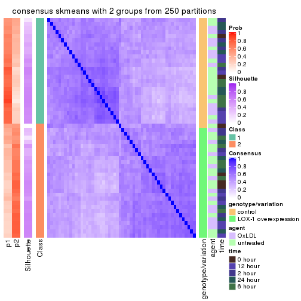</p>

</div>
<div id='tab-CV-skmeans-consensus-heatmap-2'>
<pre><code class="r">consensus_heatmap(res, k = 3)
</code></pre>

<p>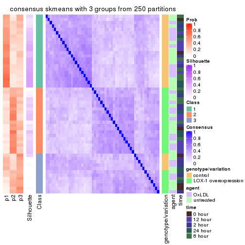</p>

</div>
<div id='tab-CV-skmeans-consensus-heatmap-3'>
<pre><code class="r">consensus_heatmap(res, k = 4)
</code></pre>

<p>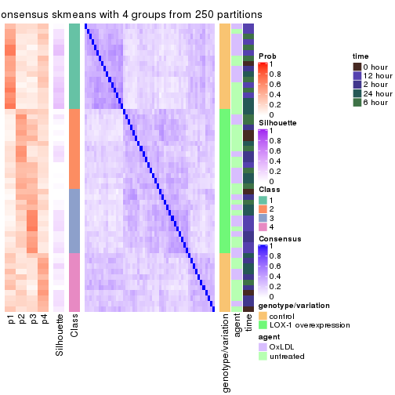</p>

</div>
<div id='tab-CV-skmeans-consensus-heatmap-4'>
<pre><code class="r">consensus_heatmap(res, k = 5)
</code></pre>

<p>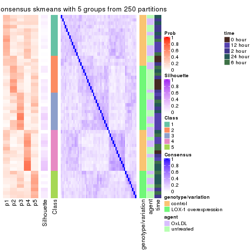</p>

</div>
<div id='tab-CV-skmeans-consensus-heatmap-5'>
<pre><code class="r">consensus_heatmap(res, k = 6)
</code></pre>

<p>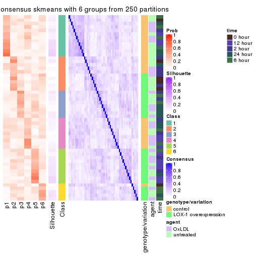</p>

</div>
</div>

Heatmaps for the membership of samples in all partitions to see how consistent they are:


<script>
$( function() {
	$( '#tabs-CV-skmeans-membership-heatmap' ).tabs();
} );
</script>
<div id='tabs-CV-skmeans-membership-heatmap'>
<ul>
<li><a href='#tab-CV-skmeans-membership-heatmap-1'>k = 2</a></li>
<li><a href='#tab-CV-skmeans-membership-heatmap-2'>k = 3</a></li>
<li><a href='#tab-CV-skmeans-membership-heatmap-3'>k = 4</a></li>
<li><a href='#tab-CV-skmeans-membership-heatmap-4'>k = 5</a></li>
<li><a href='#tab-CV-skmeans-membership-heatmap-5'>k = 6</a></li>
</ul>
<div id='tab-CV-skmeans-membership-heatmap-1'>
<pre><code class="r">membership_heatmap(res, k = 2)
</code></pre>

<p>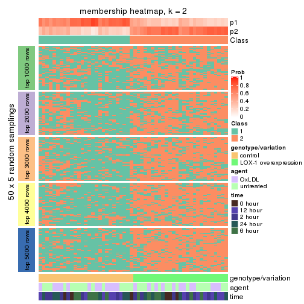</p>

</div>
<div id='tab-CV-skmeans-membership-heatmap-2'>
<pre><code class="r">membership_heatmap(res, k = 3)
</code></pre>

<p>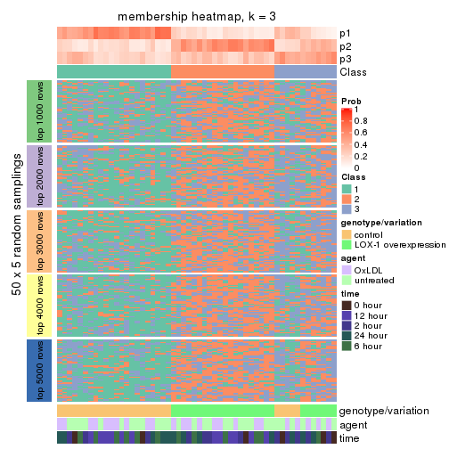</p>

</div>
<div id='tab-CV-skmeans-membership-heatmap-3'>
<pre><code class="r">membership_heatmap(res, k = 4)
</code></pre>

<p>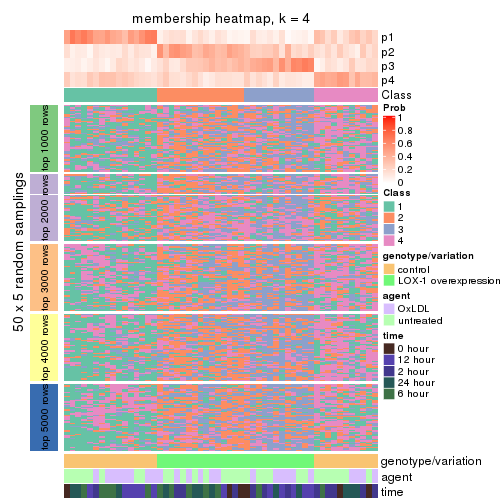</p>

</div>
<div id='tab-CV-skmeans-membership-heatmap-4'>
<pre><code class="r">membership_heatmap(res, k = 5)
</code></pre>

<p>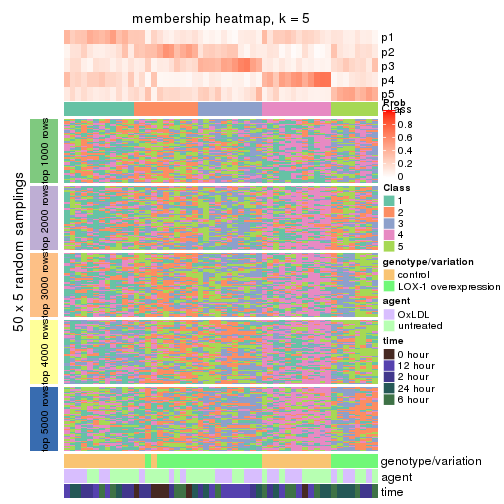</p>

</div>
<div id='tab-CV-skmeans-membership-heatmap-5'>
<pre><code class="r">membership_heatmap(res, k = 6)
</code></pre>

<p>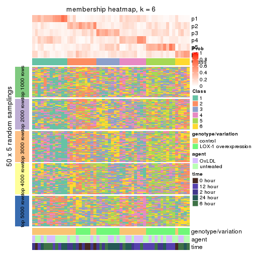</p>

</div>
</div>

As soon as we have had the classes for columns, we can look for signatures
which are significantly different between classes which can be candidate marks
for certain classes. Following are the heatmaps for signatures.


Signature heatmaps where rows are scaled:


<script>
$( function() {
	$( '#tabs-CV-skmeans-get-signatures' ).tabs();
} );
</script>
<div id='tabs-CV-skmeans-get-signatures'>
<ul>
<li><a href='#tab-CV-skmeans-get-signatures-1'>k = 2</a></li>
<li><a href='#tab-CV-skmeans-get-signatures-2'>k = 3</a></li>
<li><a href='#tab-CV-skmeans-get-signatures-3'>k = 4</a></li>
<li><a href='#tab-CV-skmeans-get-signatures-4'>k = 5</a></li>
<li><a href='#tab-CV-skmeans-get-signatures-5'>k = 6</a></li>
</ul>
<div id='tab-CV-skmeans-get-signatures-1'>
<pre><code class="r">get_signatures(res, k = 2)
</code></pre>

<p>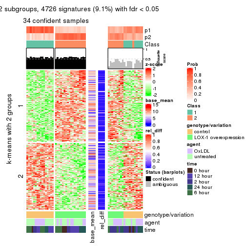</p>

</div>
<div id='tab-CV-skmeans-get-signatures-2'>
<pre><code class="r">get_signatures(res, k = 3)
</code></pre>

<p></p>

</div>
<div id='tab-CV-skmeans-get-signatures-3'>
<pre><code class="r">get_signatures(res, k = 4)
</code></pre>

<p></p>

</div>
<div id='tab-CV-skmeans-get-signatures-4'>
<pre><code class="r">get_signatures(res, k = 5)
</code></pre>

<p></p>

</div>
<div id='tab-CV-skmeans-get-signatures-5'>
<pre><code class="r">get_signatures(res, k = 6)
</code></pre>

<p></p>

</div>
</div>


Signature heatmaps where rows are not scaled:


<script>
$( function() {
	$( '#tabs-CV-skmeans-get-signatures-no-scale' ).tabs();
} );
</script>
<div id='tabs-CV-skmeans-get-signatures-no-scale'>
<ul>
<li><a href='#tab-CV-skmeans-get-signatures-no-scale-1'>k = 2</a></li>
<li><a href='#tab-CV-skmeans-get-signatures-no-scale-2'>k = 3</a></li>
<li><a href='#tab-CV-skmeans-get-signatures-no-scale-3'>k = 4</a></li>
<li><a href='#tab-CV-skmeans-get-signatures-no-scale-4'>k = 5</a></li>
<li><a href='#tab-CV-skmeans-get-signatures-no-scale-5'>k = 6</a></li>
</ul>
<div id='tab-CV-skmeans-get-signatures-no-scale-1'>
<pre><code class="r">get_signatures(res, k = 2, scale_rows = FALSE)
</code></pre>

<p>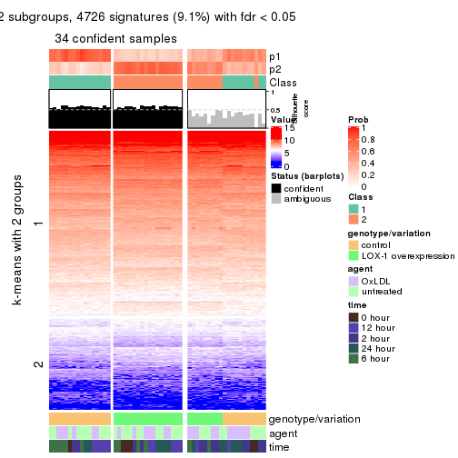</p>

</div>
<div id='tab-CV-skmeans-get-signatures-no-scale-2'>
<pre><code class="r">get_signatures(res, k = 3, scale_rows = FALSE)
</code></pre>

<p></p>

</div>
<div id='tab-CV-skmeans-get-signatures-no-scale-3'>
<pre><code class="r">get_signatures(res, k = 4, scale_rows = FALSE)
</code></pre>

<p></p>

</div>
<div id='tab-CV-skmeans-get-signatures-no-scale-4'>
<pre><code class="r">get_signatures(res, k = 5, scale_rows = FALSE)
</code></pre>

<p></p>

</div>
<div id='tab-CV-skmeans-get-signatures-no-scale-5'>
<pre><code class="r">get_signatures(res, k = 6, scale_rows = FALSE)
</code></pre>

<p></p>

</div>
</div>


Compare the overlap of signatures from different k:

```r
compare_signatures(res)
```

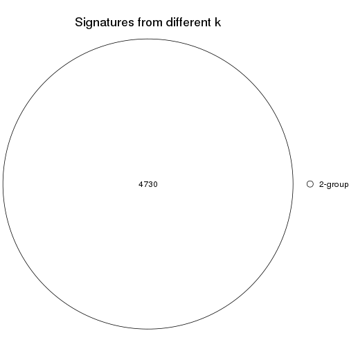

`get_signature()` returns a data frame invisibly. TO get the list of signatures, the function
call should be assigned to a variable explicitly. In following code, if `plot` argument is set
to `FALSE`, no heatmap is plotted while only the differential analysis is performed.

```r
# code only for demonstration
tb = get_signature(res, k = ..., plot = FALSE)
```

An example of the output of `tb` is:

```
#>   which_row         fdr    mean_1    mean_2 scaled_mean_1 scaled_mean_2 km
#> 1        38 0.042760348  8.373488  9.131774    -0.5533452     0.5164555  1
#> 2        40 0.018707592  7.106213  8.469186    -0.6173731     0.5762149  1
#> 3        55 0.019134737 10.221463 11.207825    -0.6159697     0.5749050  1
#> 4        59 0.006059896  5.921854  7.869574    -0.6899429     0.6439467  1
#> 5        60 0.018055526  8.928898 10.211722    -0.6204761     0.5791110  1
#> 6        98 0.009384629 15.714769 14.887706     0.6635654    -0.6193277  2
...
```

The columns in `tb` are:

1. `which_row`: row indices corresponding to the input matrix.
2. `fdr`: FDR for the differential test. 
3. `mean_x`: The mean value in group x.
4. `scaled_mean_x`: The mean value in group x after rows are scaled.
5. `km`: Row groups if k-means clustering is applied to rows.


UMAP plot which shows how samples are separated.


<script>
$( function() {
	$( '#tabs-CV-skmeans-dimension-reduction' ).tabs();
} );
</script>
<div id='tabs-CV-skmeans-dimension-reduction'>
<ul>
<li><a href='#tab-CV-skmeans-dimension-reduction-1'>k = 2</a></li>
<li><a href='#tab-CV-skmeans-dimension-reduction-2'>k = 3</a></li>
<li><a href='#tab-CV-skmeans-dimension-reduction-3'>k = 4</a></li>
<li><a href='#tab-CV-skmeans-dimension-reduction-4'>k = 5</a></li>
<li><a href='#tab-CV-skmeans-dimension-reduction-5'>k = 6</a></li>
</ul>
<div id='tab-CV-skmeans-dimension-reduction-1'>
<pre><code class="r">dimension_reduction(res, k = 2, method = &quot;UMAP&quot;)
</code></pre>

<p>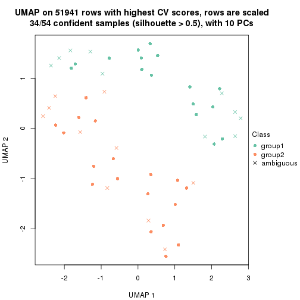</p>

</div>
<div id='tab-CV-skmeans-dimension-reduction-2'>
<pre><code class="r">dimension_reduction(res, k = 3, method = &quot;UMAP&quot;)
</code></pre>

<p>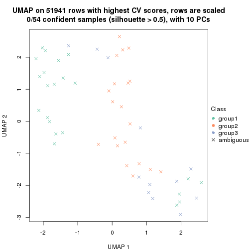</p>

</div>
<div id='tab-CV-skmeans-dimension-reduction-3'>
<pre><code class="r">dimension_reduction(res, k = 4, method = &quot;UMAP&quot;)
</code></pre>

<p>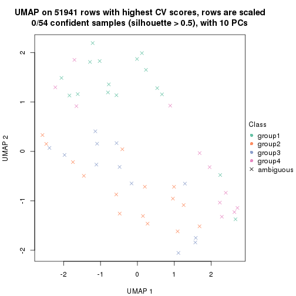</p>

</div>
<div id='tab-CV-skmeans-dimension-reduction-4'>
<pre><code class="r">dimension_reduction(res, k = 5, method = &quot;UMAP&quot;)
</code></pre>

<p>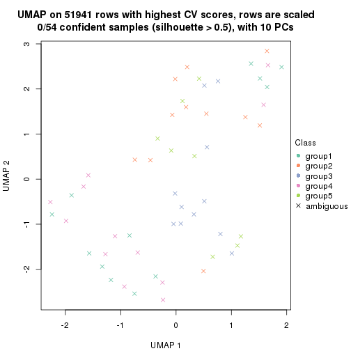</p>

</div>
<div id='tab-CV-skmeans-dimension-reduction-5'>
<pre><code class="r">dimension_reduction(res, k = 6, method = &quot;UMAP&quot;)
</code></pre>

<p>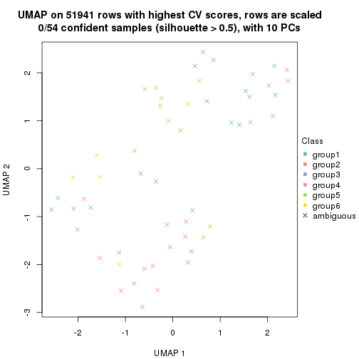</p>

</div>
</div>


Following heatmap shows how subgroups are split when increasing `k`:

```r
collect_classes(res)
```

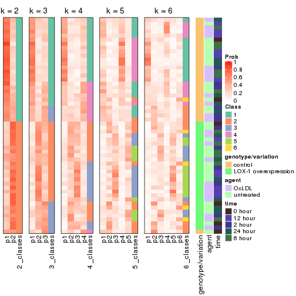


Test correlation between subgroups and known annotations. If the known
annotation is numeric, one-way ANOVA test is applied, and if the known
annotation is discrete, chi-squared contingency table test is applied.

```r
test_to_known_factors(res)
```

```
#>             n genotype/variation(p) agent(p) time(p) k
#> CV:skmeans 34              4.09e-08        1   0.744 2
#> CV:skmeans  0                    NA       NA      NA 3
#> CV:skmeans  0                    NA       NA      NA 4
#> CV:skmeans  0                    NA       NA      NA 5
#> CV:skmeans  0                    NA       NA      NA 6
```


If matrix rows can be associated to genes, consider to use `functional_enrichment(res,
...)` to perform function enrichment for the signature genes. See [this vignette](http://bioconductor.org/packages/devel/bioc/vignettes/cola/inst/doc/functional_enrichment.html) for more detailed explanations.


 

---------------------------------------------------


### CV:pam


The object with results only for a single top-value method and a single partition method 
can be extracted as:

```r
res = res_list["CV", "pam"]
# you can also extract it by
# res = res_list["CV:pam"]
```

A summary of `res` and all the functions that can be applied to it:

```r
res
```

```
#> A 'ConsensusPartition' object with k = 2, 3, 4, 5, 6.
#>   On a matrix with 51941 rows and 54 columns.
#>   Top rows (1000, 2000, 3000, 4000, 5000) are extracted by 'CV' method.
#>   Subgroups are detected by 'pam' method.
#>   Performed in total 1250 partitions by row resampling.
#>   Best k for subgroups seems to be 2.
#> 
#> Following methods can be applied to this 'ConsensusPartition' object:
#>  [1] "cola_report"             "collect_classes"         "collect_plots"          
#>  [4] "collect_stats"           "colnames"                "compare_signatures"     
#>  [7] "consensus_heatmap"       "dimension_reduction"     "functional_enrichment"  
#> [10] "get_anno_col"            "get_anno"                "get_classes"            
#> [13] "get_consensus"           "get_matrix"              "get_membership"         
#> [16] "get_param"               "get_signatures"          "get_stats"              
#> [19] "is_best_k"               "is_stable_k"             "membership_heatmap"     
#> [22] "ncol"                    "nrow"                    "plot_ecdf"              
#> [25] "rownames"                "select_partition_number" "show"                   
#> [28] "suggest_best_k"          "test_to_known_factors"
```

`collect_plots()` function collects all the plots made from `res` for all `k` (number of partitions)
into one single page to provide an easy and fast comparison between different `k`.

```r
collect_plots(res)
```

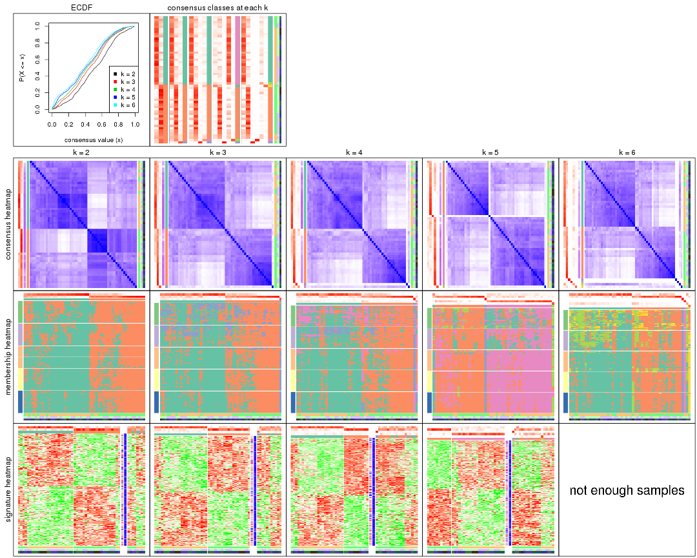

The plots are:

- The first row: a plot of the ECDF (empirical cumulative distribution
  function) curves of the consensus matrix for each `k` and the heatmap of
  predicted classes for each `k`.
- The second row: heatmaps of the consensus matrix for each `k`.
- The third row: heatmaps of the membership matrix for each `k`.
- The fouth row: heatmaps of the signatures for each `k`.

All the plots in panels can be made by individual functions and they are
plotted later in this section.

`select_partition_number()` produces several plots showing different
statistics for choosing "optimized" `k`. There are following statistics:

- ECDF curves of the consensus matrix for each `k`;
- 1-PAC. [The PAC
  score](https://en.wikipedia.org/wiki/Consensus_clustering#Over-interpretation_potential_of_consensus_clustering)
  measures the proportion of the ambiguous subgrouping.
- Mean silhouette score.
- Concordance. The mean probability of fiting the consensus class ids in all
  partitions.
- Area increased. Denote $A_k$ as the area under the ECDF curve for current
  `k`, the area increased is defined as $A_k - A_{k-1}$.
- Rand index. The percent of pairs of samples that are both in a same cluster
  or both are not in a same cluster in the partition of k and k-1.
- Jaccard index. The ratio of pairs of samples are both in a same cluster in
  the partition of k and k-1 and the pairs of samples are both in a same
  cluster in the partition k or k-1.

The detailed explanations of these statistics can be found in [the _cola_
vignette](http://bioconductor.org/packages/devel/bioc/vignettes/cola/inst/doc/cola.html#toc_13).

Generally speaking, lower PAC score, higher mean silhouette score or higher
concordance corresponds to better partition. Rand index and Jaccard index
measure how similar the current partition is compared to partition with `k-1`.
If they are too similar, we won't accept `k` is better than `k-1`.

```r
select_partition_number(res)
```

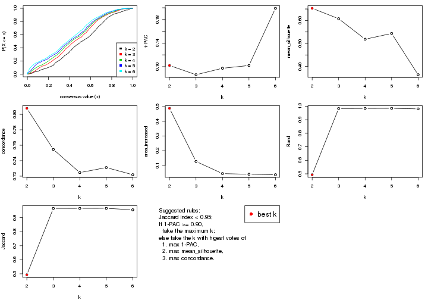

The numeric values for all these statistics can be obtained by `get_stats()`.

```r
get_stats(res)
```

```
#>   k  1-PAC mean_silhouette concordance area_increased  Rand Jaccard
#> 2 2 0.1020           0.653       0.808         0.4884 0.493   0.493
#> 3 3 0.0863           0.608       0.755         0.1268 0.983   0.966
#> 4 4 0.0973           0.518       0.725         0.0443 0.984   0.966
#> 5 5 0.1020           0.544       0.731         0.0397 0.985   0.967
#> 6 6 0.1991           0.364       0.722         0.0365 0.980   0.956
```

`suggest_best_k()` suggests the best $k$ based on these statistics. The rules are as follows:

- All $k$ with Jaccard index larger than 0.95 are removed because increasing
  $k$ does not provide enough extra information. If all $k$ are removed, it is
  marked as no subgroup is detected.
- For all $k$ with 1-PAC score larger than 0.9, the maximal $k$ is taken as
  the best $k$, and other $k$ are marked as optional $k$.
- If it does not fit the second rule. The $k$ with the maximal vote of the
  highest 1-PAC score, highest mean silhouette, and highest concordance is
  taken as the best $k$.

```r
suggest_best_k(res)
```

```
#> [1] 2
```


Following shows the table of the partitions (You need to click the **show/hide
code output** link to see it). The membership matrix (columns with name `p*`)
is inferred by
[`clue::cl_consensus()`](https://www.rdocumentation.org/link/cl_consensus?package=clue)
function with the `SE` method. Basically the value in the membership matrix
represents the probability to belong to a certain group. The finall class
label for an item is determined with the group with highest probability it
belongs to.

In `get_classes()` function, the entropy is calculated from the membership
matrix and the silhouette score is calculated from the consensus matrix.


<script>
$( function() {
	$( '#tabs-CV-pam-get-classes' ).tabs();
} );
</script>
<div id='tabs-CV-pam-get-classes'>
<ul>
<li><a href='#tab-CV-pam-get-classes-1'>k = 2</a></li>
<li><a href='#tab-CV-pam-get-classes-2'>k = 3</a></li>
<li><a href='#tab-CV-pam-get-classes-3'>k = 4</a></li>
<li><a href='#tab-CV-pam-get-classes-4'>k = 5</a></li>
<li><a href='#tab-CV-pam-get-classes-5'>k = 6</a></li>
</ul>

<div id='tab-CV-pam-get-classes-1'>
<p><a id='tab-CV-pam-get-classes-1-a' style='color:#0366d6' href='#'>show/hide code output</a></p>
<pre><code class="r">cbind(get_classes(res, k = 2), get_membership(res, k = 2))
</code></pre>

<pre><code>#&gt;           class entropy silhouette    p1    p2
#&gt; GSM329068     2  0.7528     0.6820 0.216 0.784
#&gt; GSM329074     2  0.0000     0.7422 0.000 1.000
#&gt; GSM329100     2  0.1633     0.7431 0.024 0.976
#&gt; GSM329062     2  0.0938     0.7472 0.012 0.988
#&gt; GSM329079     2  0.4022     0.7504 0.080 0.920
#&gt; GSM329090     2  0.9000     0.5643 0.316 0.684
#&gt; GSM329066     2  0.1414     0.7499 0.020 0.980
#&gt; GSM329086     1  0.7376     0.6974 0.792 0.208
#&gt; GSM329099     2  0.6801     0.7204 0.180 0.820
#&gt; GSM329071     2  0.9286     0.5309 0.344 0.656
#&gt; GSM329078     1  1.0000     0.0441 0.504 0.496
#&gt; GSM329081     2  0.2043     0.7522 0.032 0.968
#&gt; GSM329096     2  0.8763     0.5905 0.296 0.704
#&gt; GSM329102     1  0.9000     0.5233 0.684 0.316
#&gt; GSM329104     2  0.8144     0.6397 0.252 0.748
#&gt; GSM329067     2  0.9460     0.4462 0.364 0.636
#&gt; GSM329072     1  0.8081     0.7064 0.752 0.248
#&gt; GSM329075     2  0.3584     0.7476 0.068 0.932
#&gt; GSM329058     2  0.9248     0.4719 0.340 0.660
#&gt; GSM329073     2  0.8499     0.6064 0.276 0.724
#&gt; GSM329107     2  0.1414     0.7465 0.020 0.980
#&gt; GSM329057     2  0.1184     0.7486 0.016 0.984
#&gt; GSM329085     1  0.9129     0.5971 0.672 0.328
#&gt; GSM329089     2  0.9635     0.3859 0.388 0.612
#&gt; GSM329076     2  0.1633     0.7505 0.024 0.976
#&gt; GSM329094     2  0.7815     0.6720 0.232 0.768
#&gt; GSM329105     2  0.8555     0.5975 0.280 0.720
#&gt; GSM329056     1  0.5178     0.7761 0.884 0.116
#&gt; GSM329069     1  0.4939     0.7760 0.892 0.108
#&gt; GSM329077     1  0.8267     0.6839 0.740 0.260
#&gt; GSM329070     1  0.9775     0.4132 0.588 0.412
#&gt; GSM329082     1  0.0000     0.7456 1.000 0.000
#&gt; GSM329092     2  0.8207     0.6382 0.256 0.744
#&gt; GSM329083     1  0.8016     0.6974 0.756 0.244
#&gt; GSM329101     1  0.2603     0.7673 0.956 0.044
#&gt; GSM329106     1  0.6887     0.7405 0.816 0.184
#&gt; GSM329087     1  0.6438     0.7472 0.836 0.164
#&gt; GSM329091     2  0.9248     0.5323 0.340 0.660
#&gt; GSM329093     1  0.2603     0.7673 0.956 0.044
#&gt; GSM329080     1  0.2236     0.7591 0.964 0.036
#&gt; GSM329084     1  0.9866     0.3458 0.568 0.432
#&gt; GSM329088     1  0.5519     0.7697 0.872 0.128
#&gt; GSM329059     1  0.4022     0.7752 0.920 0.080
#&gt; GSM329097     1  0.8327     0.6124 0.736 0.264
#&gt; GSM329098     2  0.9795     0.3664 0.416 0.584
#&gt; GSM329055     1  0.2236     0.7629 0.964 0.036
#&gt; GSM329103     1  0.0376     0.7477 0.996 0.004
#&gt; GSM329108     1  0.9044     0.4886 0.680 0.320
#&gt; GSM329061     1  0.7950     0.7188 0.760 0.240
#&gt; GSM329064     1  0.6343     0.7703 0.840 0.160
#&gt; GSM329065     1  0.8081     0.6551 0.752 0.248
#&gt; GSM329060     1  0.8016     0.7020 0.756 0.244
#&gt; GSM329063     1  0.5629     0.7636 0.868 0.132
#&gt; GSM329095     1  0.4431     0.7769 0.908 0.092
</code></pre>

<script>
$('#tab-CV-pam-get-classes-1-a').parent().next().next().hide();
$('#tab-CV-pam-get-classes-1-a').click(function(){
  $('#tab-CV-pam-get-classes-1-a').parent().next().next().toggle();
  return(false);
});
</script>
</div>

<div id='tab-CV-pam-get-classes-2'>
<p><a id='tab-CV-pam-get-classes-2-a' style='color:#0366d6' href='#'>show/hide code output</a></p>
<pre><code class="r">cbind(get_classes(res, k = 3), get_membership(res, k = 3))
</code></pre>

<pre><code>#&gt;           class entropy silhouette    p1    p2    p3
#&gt; GSM329068     2   0.578      0.657 0.200 0.768 0.032
#&gt; GSM329074     2   0.288      0.658 0.000 0.904 0.096
#&gt; GSM329100     2   0.245      0.670 0.012 0.936 0.052
#&gt; GSM329062     2   0.183      0.674 0.008 0.956 0.036
#&gt; GSM329079     2   0.398      0.687 0.068 0.884 0.048
#&gt; GSM329090     2   0.780      0.528 0.296 0.624 0.080
#&gt; GSM329066     2   0.116      0.686 0.028 0.972 0.000
#&gt; GSM329086     1   0.732      0.655 0.704 0.184 0.112
#&gt; GSM329099     2   0.605      0.685 0.180 0.768 0.052
#&gt; GSM329071     2   0.748      0.526 0.308 0.632 0.060
#&gt; GSM329078     1   0.757      0.139 0.508 0.452 0.040
#&gt; GSM329081     2   0.288      0.686 0.024 0.924 0.052
#&gt; GSM329096     2   0.718      0.529 0.304 0.648 0.048
#&gt; GSM329102     1   0.889      0.419 0.556 0.284 0.160
#&gt; GSM329104     3   0.521      0.000 0.052 0.124 0.824
#&gt; GSM329067     2   0.660      0.418 0.384 0.604 0.012
#&gt; GSM329072     1   0.774      0.674 0.668 0.216 0.116
#&gt; GSM329075     2   0.348      0.687 0.044 0.904 0.052
#&gt; GSM329058     2   0.689      0.422 0.340 0.632 0.028
#&gt; GSM329073     2   0.709      0.582 0.248 0.688 0.064
#&gt; GSM329107     2   0.406      0.651 0.012 0.860 0.128
#&gt; GSM329057     2   0.117      0.681 0.016 0.976 0.008
#&gt; GSM329085     1   0.764      0.606 0.640 0.284 0.076
#&gt; GSM329089     2   0.847      0.262 0.400 0.508 0.092
#&gt; GSM329076     2   0.206      0.683 0.024 0.952 0.024
#&gt; GSM329094     2   0.715      0.632 0.228 0.696 0.076
#&gt; GSM329105     2   0.716      0.543 0.276 0.668 0.056
#&gt; GSM329056     1   0.525      0.761 0.828 0.096 0.076
#&gt; GSM329069     1   0.534      0.756 0.824 0.084 0.092
#&gt; GSM329077     1   0.789      0.634 0.664 0.196 0.140
#&gt; GSM329070     1   0.825      0.467 0.560 0.352 0.088
#&gt; GSM329082     1   0.153      0.742 0.960 0.000 0.040
#&gt; GSM329092     2   0.861      0.518 0.228 0.600 0.172
#&gt; GSM329083     1   0.783      0.683 0.672 0.160 0.168
#&gt; GSM329101     1   0.219      0.747 0.948 0.024 0.028
#&gt; GSM329106     1   0.669      0.719 0.748 0.148 0.104
#&gt; GSM329087     1   0.412      0.739 0.868 0.108 0.024
#&gt; GSM329091     2   0.898      0.427 0.276 0.552 0.172
#&gt; GSM329093     1   0.401      0.762 0.880 0.036 0.084
#&gt; GSM329080     1   0.441      0.754 0.860 0.036 0.104
#&gt; GSM329084     1   0.786      0.446 0.572 0.364 0.064
#&gt; GSM329088     1   0.568      0.754 0.804 0.072 0.124
#&gt; GSM329059     1   0.417      0.761 0.876 0.048 0.076
#&gt; GSM329097     1   0.666      0.592 0.704 0.252 0.044
#&gt; GSM329098     2   0.923      0.310 0.348 0.488 0.164
#&gt; GSM329055     1   0.475      0.737 0.832 0.024 0.144
#&gt; GSM329103     1   0.226      0.745 0.932 0.000 0.068
#&gt; GSM329108     1   0.654      0.437 0.672 0.304 0.024
#&gt; GSM329061     1   0.648      0.708 0.728 0.224 0.048
#&gt; GSM329064     1   0.609      0.754 0.784 0.124 0.092
#&gt; GSM329065     1   0.826      0.605 0.632 0.216 0.152
#&gt; GSM329060     1   0.527      0.703 0.776 0.212 0.012
#&gt; GSM329063     1   0.385      0.745 0.876 0.108 0.016
#&gt; GSM329095     1   0.353      0.760 0.900 0.068 0.032
</code></pre>

<script>
$('#tab-CV-pam-get-classes-2-a').parent().next().next().hide();
$('#tab-CV-pam-get-classes-2-a').click(function(){
  $('#tab-CV-pam-get-classes-2-a').parent().next().next().toggle();
  return(false);
});
</script>
</div>

<div id='tab-CV-pam-get-classes-3'>
<p><a id='tab-CV-pam-get-classes-3-a' style='color:#0366d6' href='#'>show/hide code output</a></p>
<pre><code class="r">cbind(get_classes(res, k = 4), get_membership(res, k = 4))
</code></pre>

<pre><code>#&gt;           class entropy silhouette    p1    p2    p3    p4
#&gt; GSM329068     2  0.4500     0.5212 0.192 0.776 0.000 0.032
#&gt; GSM329074     2  0.3080     0.5009 0.000 0.880 0.024 0.096
#&gt; GSM329100     2  0.3103     0.5132 0.008 0.892 0.028 0.072
#&gt; GSM329062     2  0.1917     0.5288 0.008 0.944 0.012 0.036
#&gt; GSM329079     2  0.3146     0.5416 0.056 0.896 0.016 0.032
#&gt; GSM329090     2  0.7105     0.3763 0.300 0.592 0.044 0.064
#&gt; GSM329066     2  0.0817     0.5526 0.024 0.976 0.000 0.000
#&gt; GSM329086     1  0.6265     0.6270 0.708 0.176 0.032 0.084
#&gt; GSM329099     2  0.5406     0.5082 0.172 0.756 0.024 0.048
#&gt; GSM329071     2  0.6390     0.3756 0.308 0.624 0.040 0.028
#&gt; GSM329078     1  0.6753     0.1567 0.500 0.432 0.024 0.044
#&gt; GSM329081     2  0.2841     0.5583 0.024 0.912 0.032 0.032
#&gt; GSM329096     2  0.5967     0.3956 0.304 0.644 0.040 0.012
#&gt; GSM329102     1  0.8170     0.3852 0.528 0.276 0.060 0.136
#&gt; GSM329104     3  0.1520     0.0000 0.020 0.024 0.956 0.000
#&gt; GSM329067     2  0.5299     0.3407 0.388 0.600 0.004 0.008
#&gt; GSM329072     1  0.7060     0.6722 0.656 0.196 0.088 0.060
#&gt; GSM329075     2  0.3170     0.5402 0.044 0.892 0.008 0.056
#&gt; GSM329058     2  0.5779     0.3658 0.336 0.628 0.012 0.024
#&gt; GSM329073     2  0.7576     0.0103 0.128 0.536 0.024 0.312
#&gt; GSM329107     2  0.4077     0.4979 0.012 0.848 0.072 0.068
#&gt; GSM329057     2  0.1042     0.5524 0.020 0.972 0.008 0.000
#&gt; GSM329085     1  0.6310     0.5968 0.644 0.280 0.060 0.016
#&gt; GSM329089     2  0.7350     0.2358 0.400 0.496 0.064 0.040
#&gt; GSM329076     2  0.1811     0.5526 0.028 0.948 0.020 0.004
#&gt; GSM329094     2  0.6435     0.4210 0.232 0.672 0.064 0.032
#&gt; GSM329105     2  0.5967     0.4280 0.284 0.652 0.060 0.004
#&gt; GSM329056     1  0.4475     0.7434 0.828 0.080 0.016 0.076
#&gt; GSM329069     1  0.4780     0.7353 0.812 0.076 0.020 0.092
#&gt; GSM329077     1  0.7329     0.6058 0.644 0.164 0.060 0.132
#&gt; GSM329070     1  0.7221     0.4723 0.540 0.340 0.016 0.104
#&gt; GSM329082     1  0.1936     0.7234 0.940 0.000 0.028 0.032
#&gt; GSM329092     4  0.7345     0.0000 0.116 0.336 0.016 0.532
#&gt; GSM329083     1  0.7211     0.6557 0.656 0.140 0.060 0.144
#&gt; GSM329101     1  0.2605     0.7299 0.920 0.024 0.016 0.040
#&gt; GSM329106     1  0.5799     0.7093 0.752 0.136 0.040 0.072
#&gt; GSM329087     1  0.3234     0.7249 0.884 0.084 0.020 0.012
#&gt; GSM329091     2  0.7929     0.0454 0.260 0.540 0.036 0.164
#&gt; GSM329093     1  0.3551     0.7366 0.868 0.020 0.016 0.096
#&gt; GSM329080     1  0.4349     0.7340 0.840 0.036 0.040 0.084
#&gt; GSM329084     1  0.6729     0.4555 0.564 0.356 0.016 0.064
#&gt; GSM329088     1  0.5437     0.7286 0.776 0.068 0.036 0.120
#&gt; GSM329059     1  0.3586     0.7407 0.880 0.032 0.048 0.040
#&gt; GSM329097     1  0.5944     0.5628 0.680 0.252 0.012 0.056
#&gt; GSM329098     2  0.8141     0.1007 0.304 0.480 0.028 0.188
#&gt; GSM329055     1  0.4741     0.7097 0.800 0.024 0.032 0.144
#&gt; GSM329103     1  0.2413     0.7268 0.916 0.000 0.020 0.064
#&gt; GSM329108     1  0.5520     0.4242 0.664 0.304 0.020 0.012
#&gt; GSM329061     1  0.5623     0.6990 0.720 0.216 0.016 0.048
#&gt; GSM329064     1  0.5554     0.7370 0.772 0.116 0.044 0.068
#&gt; GSM329065     1  0.7540     0.5612 0.600 0.216 0.040 0.144
#&gt; GSM329060     1  0.4134     0.7081 0.796 0.188 0.008 0.008
#&gt; GSM329063     1  0.3002     0.7294 0.892 0.084 0.012 0.012
#&gt; GSM329095     1  0.2546     0.7408 0.920 0.044 0.008 0.028
</code></pre>

<script>
$('#tab-CV-pam-get-classes-3-a').parent().next().next().hide();
$('#tab-CV-pam-get-classes-3-a').click(function(){
  $('#tab-CV-pam-get-classes-3-a').parent().next().next().toggle();
  return(false);
});
</script>
</div>

<div id='tab-CV-pam-get-classes-4'>
<p><a id='tab-CV-pam-get-classes-4-a' style='color:#0366d6' href='#'>show/hide code output</a></p>
<pre><code class="r">cbind(get_classes(res, k = 5), get_membership(res, k = 5))
</code></pre>

<pre><code>#&gt;           class entropy silhouette    p1    p2    p3    p4    p5
#&gt; GSM329068     2  0.4028      0.544 0.040 0.768 0.000 0.192 0.000
#&gt; GSM329074     2  0.3344      0.520 0.080 0.860 0.008 0.004 0.048
#&gt; GSM329100     2  0.4499      0.443 0.072 0.792 0.016 0.008 0.112
#&gt; GSM329062     2  0.1969      0.559 0.004 0.932 0.008 0.012 0.044
#&gt; GSM329079     2  0.2504      0.564 0.064 0.896 0.000 0.040 0.000
#&gt; GSM329090     2  0.6331      0.474 0.044 0.592 0.024 0.304 0.036
#&gt; GSM329066     2  0.0771      0.566 0.004 0.976 0.000 0.020 0.000
#&gt; GSM329086     4  0.5866      0.644 0.120 0.176 0.016 0.676 0.012
#&gt; GSM329099     2  0.4415      0.543 0.044 0.760 0.012 0.184 0.000
#&gt; GSM329071     2  0.5522      0.474 0.040 0.620 0.028 0.312 0.000
#&gt; GSM329078     4  0.6068      0.156 0.044 0.428 0.008 0.496 0.024
#&gt; GSM329081     2  0.2263      0.569 0.036 0.920 0.020 0.024 0.000
#&gt; GSM329096     2  0.5108      0.469 0.024 0.648 0.024 0.304 0.000
#&gt; GSM329102     4  0.6886      0.390 0.200 0.272 0.016 0.508 0.004
#&gt; GSM329104     3  0.0579      0.000 0.000 0.008 0.984 0.008 0.000
#&gt; GSM329067     2  0.4985      0.381 0.012 0.580 0.000 0.392 0.016
#&gt; GSM329072     4  0.5980      0.681 0.112 0.188 0.040 0.660 0.000
#&gt; GSM329075     2  0.2632      0.569 0.072 0.888 0.000 0.040 0.000
#&gt; GSM329058     2  0.4989      0.400 0.028 0.628 0.004 0.336 0.004
#&gt; GSM329073     1  0.5939      0.000 0.580 0.344 0.012 0.036 0.028
#&gt; GSM329107     2  0.4276      0.533 0.080 0.824 0.036 0.020 0.040
#&gt; GSM329057     2  0.1059      0.568 0.008 0.968 0.004 0.020 0.000
#&gt; GSM329085     4  0.5466      0.591 0.040 0.284 0.032 0.644 0.000
#&gt; GSM329089     2  0.6391      0.236 0.064 0.496 0.028 0.404 0.008
#&gt; GSM329076     2  0.1612      0.568 0.016 0.948 0.012 0.024 0.000
#&gt; GSM329094     2  0.5677      0.491 0.072 0.664 0.024 0.236 0.004
#&gt; GSM329105     2  0.5157      0.479 0.016 0.656 0.040 0.288 0.000
#&gt; GSM329056     4  0.4500      0.753 0.084 0.076 0.004 0.800 0.036
#&gt; GSM329069     4  0.4443      0.748 0.128 0.064 0.004 0.788 0.016
#&gt; GSM329077     4  0.6890      0.620 0.132 0.168 0.032 0.624 0.044
#&gt; GSM329070     4  0.6290      0.491 0.136 0.316 0.004 0.540 0.004
#&gt; GSM329082     4  0.1864      0.740 0.068 0.000 0.004 0.924 0.004
#&gt; GSM329092     5  0.3714      0.000 0.024 0.084 0.000 0.052 0.840
#&gt; GSM329083     4  0.6988      0.645 0.216 0.116 0.024 0.596 0.048
#&gt; GSM329101     4  0.2125      0.746 0.052 0.024 0.004 0.920 0.000
#&gt; GSM329106     4  0.4902      0.716 0.128 0.124 0.004 0.740 0.004
#&gt; GSM329087     4  0.2491      0.734 0.036 0.068 0.000 0.896 0.000
#&gt; GSM329091     2  0.7043      0.289 0.232 0.508 0.004 0.232 0.024
#&gt; GSM329093     4  0.3331      0.754 0.132 0.020 0.004 0.840 0.004
#&gt; GSM329080     4  0.3812      0.749 0.160 0.036 0.000 0.800 0.004
#&gt; GSM329084     4  0.5933      0.466 0.108 0.332 0.000 0.556 0.004
#&gt; GSM329088     4  0.4579      0.740 0.188 0.056 0.004 0.748 0.004
#&gt; GSM329059     4  0.2844      0.754 0.064 0.032 0.016 0.888 0.000
#&gt; GSM329097     4  0.5316      0.561 0.084 0.256 0.000 0.656 0.004
#&gt; GSM329098     2  0.7360      0.294 0.200 0.472 0.004 0.284 0.040
#&gt; GSM329055     4  0.4129      0.724 0.228 0.016 0.004 0.748 0.004
#&gt; GSM329103     4  0.2464      0.747 0.092 0.000 0.004 0.892 0.012
#&gt; GSM329108     4  0.4822      0.433 0.048 0.288 0.000 0.664 0.000
#&gt; GSM329061     4  0.5072      0.704 0.072 0.204 0.008 0.712 0.004
#&gt; GSM329064     4  0.4740      0.746 0.100 0.108 0.024 0.768 0.000
#&gt; GSM329065     4  0.6389      0.587 0.240 0.192 0.004 0.560 0.004
#&gt; GSM329060     4  0.3513      0.711 0.020 0.180 0.000 0.800 0.000
#&gt; GSM329063     4  0.2388      0.736 0.028 0.072 0.000 0.900 0.000
#&gt; GSM329095     4  0.2308      0.753 0.048 0.036 0.000 0.912 0.004
</code></pre>

<script>
$('#tab-CV-pam-get-classes-4-a').parent().next().next().hide();
$('#tab-CV-pam-get-classes-4-a').click(function(){
  $('#tab-CV-pam-get-classes-4-a').parent().next().next().toggle();
  return(false);
});
</script>
</div>

<div id='tab-CV-pam-get-classes-5'>
<p><a id='tab-CV-pam-get-classes-5-a' style='color:#0366d6' href='#'>show/hide code output</a></p>
<pre><code class="r">cbind(get_classes(res, k = 6), get_membership(res, k = 6))
</code></pre>

<pre><code>#&gt;           class entropy silhouette    p1    p2    p3    p4    p5    p6
#&gt; GSM329068     2  0.4117     0.6108 0.184 0.752 0.000 0.000 0.048 0.016
#&gt; GSM329074     2  0.3280     0.5781 0.004 0.844 0.000 0.012 0.084 0.056
#&gt; GSM329100     2  0.5184     0.1978 0.008 0.612 0.004 0.016 0.316 0.044
#&gt; GSM329062     2  0.2030     0.6096 0.016 0.924 0.000 0.008 0.016 0.036
#&gt; GSM329079     2  0.2696     0.6145 0.048 0.872 0.000 0.000 0.076 0.004
#&gt; GSM329090     2  0.5897     0.4728 0.300 0.588 0.016 0.012 0.052 0.032
#&gt; GSM329066     2  0.0858     0.6162 0.028 0.968 0.000 0.000 0.000 0.004
#&gt; GSM329086     1  0.6369     0.0641 0.604 0.164 0.008 0.004 0.136 0.084
#&gt; GSM329099     2  0.4463     0.6032 0.180 0.736 0.000 0.000 0.048 0.036
#&gt; GSM329071     2  0.5385     0.4752 0.296 0.612 0.012 0.000 0.056 0.024
#&gt; GSM329078     1  0.5166     0.1537 0.516 0.420 0.000 0.000 0.036 0.028
#&gt; GSM329081     2  0.2395     0.6184 0.020 0.908 0.012 0.000 0.028 0.032
#&gt; GSM329096     2  0.4830     0.4823 0.308 0.636 0.016 0.000 0.008 0.032
#&gt; GSM329102     1  0.6760    -0.1061 0.456 0.276 0.008 0.004 0.228 0.028
#&gt; GSM329104     3  0.0146     0.0000 0.000 0.004 0.996 0.000 0.000 0.000
#&gt; GSM329067     2  0.5347     0.3279 0.400 0.528 0.000 0.008 0.044 0.020
#&gt; GSM329072     1  0.5646     0.3022 0.656 0.184 0.020 0.000 0.112 0.028
#&gt; GSM329075     2  0.2639     0.6201 0.032 0.876 0.000 0.000 0.084 0.008
#&gt; GSM329058     2  0.5095     0.3941 0.332 0.600 0.000 0.004 0.040 0.024
#&gt; GSM329073     6  0.4087     0.0000 0.024 0.228 0.008 0.000 0.008 0.732
#&gt; GSM329107     2  0.3969     0.5891 0.012 0.816 0.020 0.008 0.088 0.056
#&gt; GSM329057     2  0.0748     0.6133 0.016 0.976 0.004 0.000 0.000 0.004
#&gt; GSM329085     1  0.5324     0.2990 0.620 0.292 0.016 0.000 0.052 0.020
#&gt; GSM329089     2  0.5605     0.2088 0.420 0.500 0.012 0.004 0.040 0.024
#&gt; GSM329076     2  0.1337     0.6149 0.016 0.956 0.008 0.000 0.008 0.012
#&gt; GSM329094     2  0.5075     0.5528 0.256 0.660 0.008 0.000 0.032 0.044
#&gt; GSM329105     2  0.4569     0.5164 0.280 0.672 0.020 0.000 0.008 0.020
#&gt; GSM329056     1  0.4245     0.4646 0.784 0.064 0.000 0.008 0.112 0.032
#&gt; GSM329069     1  0.4270     0.3939 0.752 0.064 0.000 0.000 0.164 0.020
#&gt; GSM329077     1  0.6434     0.1469 0.608 0.152 0.012 0.008 0.148 0.072
#&gt; GSM329070     1  0.6037     0.2224 0.532 0.308 0.000 0.000 0.120 0.040
#&gt; GSM329082     1  0.1728     0.4706 0.924 0.004 0.000 0.000 0.064 0.008
#&gt; GSM329092     4  0.0748     0.0000 0.004 0.016 0.000 0.976 0.004 0.000
#&gt; GSM329083     5  0.5978     0.0000 0.444 0.056 0.008 0.004 0.448 0.040
#&gt; GSM329101     1  0.1850     0.4842 0.924 0.016 0.000 0.000 0.052 0.008
#&gt; GSM329106     1  0.4700     0.3885 0.716 0.128 0.000 0.004 0.144 0.008
#&gt; GSM329087     1  0.1989     0.4886 0.916 0.052 0.000 0.000 0.028 0.004
#&gt; GSM329091     2  0.6284     0.1853 0.208 0.488 0.000 0.012 0.284 0.008
#&gt; GSM329093     1  0.3448     0.4572 0.828 0.024 0.000 0.004 0.116 0.028
#&gt; GSM329080     1  0.3668     0.4267 0.788 0.040 0.000 0.004 0.164 0.004
#&gt; GSM329084     1  0.6289     0.1270 0.516 0.296 0.000 0.000 0.136 0.052
#&gt; GSM329088     1  0.4224     0.3739 0.724 0.048 0.000 0.004 0.220 0.004
#&gt; GSM329059     1  0.2997     0.4720 0.868 0.024 0.004 0.000 0.068 0.036
#&gt; GSM329097     1  0.5263     0.1781 0.624 0.248 0.000 0.000 0.116 0.012
#&gt; GSM329098     2  0.6870     0.1557 0.244 0.444 0.000 0.008 0.260 0.044
#&gt; GSM329055     1  0.3957     0.2595 0.696 0.020 0.000 0.000 0.280 0.004
#&gt; GSM329103     1  0.2165     0.4485 0.884 0.000 0.000 0.000 0.108 0.008
#&gt; GSM329108     1  0.4389     0.1977 0.660 0.288 0.000 0.000 0.052 0.000
#&gt; GSM329061     1  0.4655     0.4030 0.708 0.184 0.000 0.000 0.096 0.012
#&gt; GSM329064     1  0.4519     0.4210 0.740 0.108 0.004 0.000 0.136 0.012
#&gt; GSM329065     1  0.5729    -0.0047 0.528 0.180 0.000 0.000 0.288 0.004
#&gt; GSM329060     1  0.2743     0.4890 0.828 0.164 0.000 0.000 0.008 0.000
#&gt; GSM329063     1  0.1657     0.4921 0.928 0.056 0.000 0.000 0.016 0.000
#&gt; GSM329095     1  0.2475     0.4892 0.892 0.036 0.000 0.000 0.060 0.012
</code></pre>

<script>
$('#tab-CV-pam-get-classes-5-a').parent().next().next().hide();
$('#tab-CV-pam-get-classes-5-a').click(function(){
  $('#tab-CV-pam-get-classes-5-a').parent().next().next().toggle();
  return(false);
});
</script>
</div>
</div>

Heatmaps for the consensus matrix. It visualizes the probability of two
samples to be in a same group.


<script>
$( function() {
	$( '#tabs-CV-pam-consensus-heatmap' ).tabs();
} );
</script>
<div id='tabs-CV-pam-consensus-heatmap'>
<ul>
<li><a href='#tab-CV-pam-consensus-heatmap-1'>k = 2</a></li>
<li><a href='#tab-CV-pam-consensus-heatmap-2'>k = 3</a></li>
<li><a href='#tab-CV-pam-consensus-heatmap-3'>k = 4</a></li>
<li><a href='#tab-CV-pam-consensus-heatmap-4'>k = 5</a></li>
<li><a href='#tab-CV-pam-consensus-heatmap-5'>k = 6</a></li>
</ul>
<div id='tab-CV-pam-consensus-heatmap-1'>
<pre><code class="r">consensus_heatmap(res, k = 2)
</code></pre>

<p>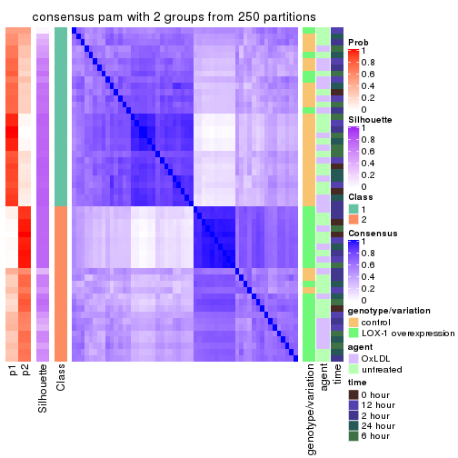</p>

</div>
<div id='tab-CV-pam-consensus-heatmap-2'>
<pre><code class="r">consensus_heatmap(res, k = 3)
</code></pre>

<p>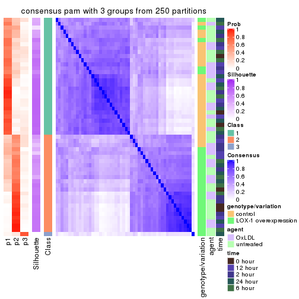</p>

</div>
<div id='tab-CV-pam-consensus-heatmap-3'>
<pre><code class="r">consensus_heatmap(res, k = 4)
</code></pre>

<p>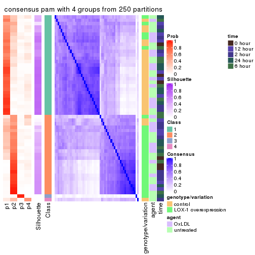</p>

</div>
<div id='tab-CV-pam-consensus-heatmap-4'>
<pre><code class="r">consensus_heatmap(res, k = 5)
</code></pre>

<p>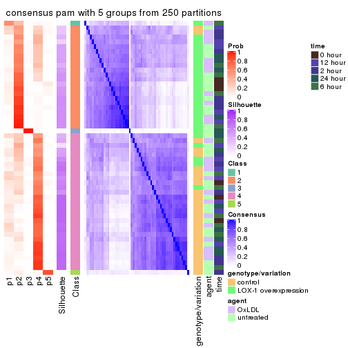</p>

</div>
<div id='tab-CV-pam-consensus-heatmap-5'>
<pre><code class="r">consensus_heatmap(res, k = 6)
</code></pre>

<p>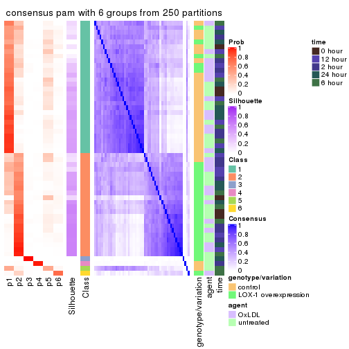</p>

</div>
</div>

Heatmaps for the membership of samples in all partitions to see how consistent they are:


<script>
$( function() {
	$( '#tabs-CV-pam-membership-heatmap' ).tabs();
} );
</script>
<div id='tabs-CV-pam-membership-heatmap'>
<ul>
<li><a href='#tab-CV-pam-membership-heatmap-1'>k = 2</a></li>
<li><a href='#tab-CV-pam-membership-heatmap-2'>k = 3</a></li>
<li><a href='#tab-CV-pam-membership-heatmap-3'>k = 4</a></li>
<li><a href='#tab-CV-pam-membership-heatmap-4'>k = 5</a></li>
<li><a href='#tab-CV-pam-membership-heatmap-5'>k = 6</a></li>
</ul>
<div id='tab-CV-pam-membership-heatmap-1'>
<pre><code class="r">membership_heatmap(res, k = 2)
</code></pre>

<p>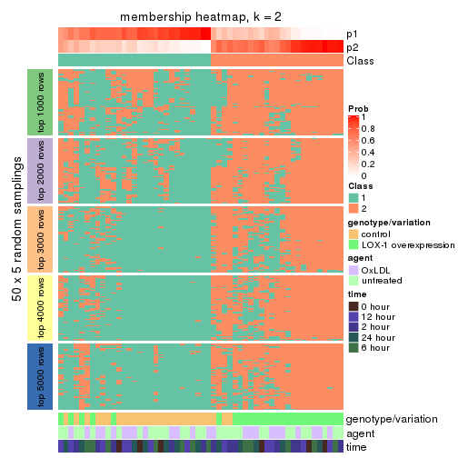</p>

</div>
<div id='tab-CV-pam-membership-heatmap-2'>
<pre><code class="r">membership_heatmap(res, k = 3)
</code></pre>

<p>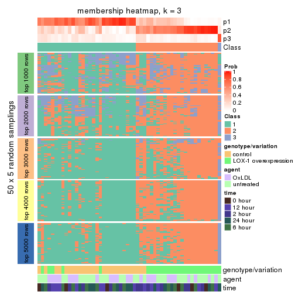</p>

</div>
<div id='tab-CV-pam-membership-heatmap-3'>
<pre><code class="r">membership_heatmap(res, k = 4)
</code></pre>

<p>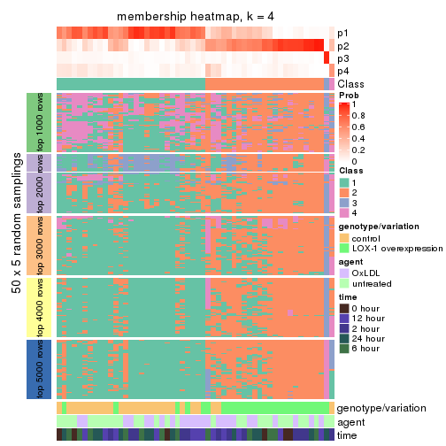</p>

</div>
<div id='tab-CV-pam-membership-heatmap-4'>
<pre><code class="r">membership_heatmap(res, k = 5)
</code></pre>

<p>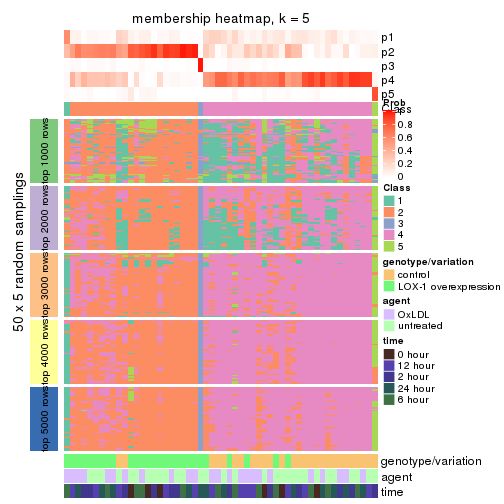</p>

</div>
<div id='tab-CV-pam-membership-heatmap-5'>
<pre><code class="r">membership_heatmap(res, k = 6)
</code></pre>

<p>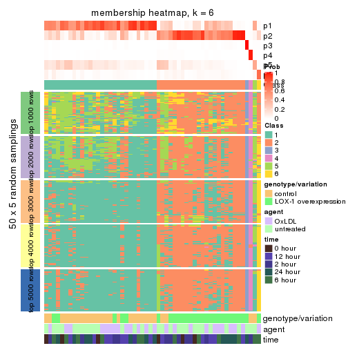</p>

</div>
</div>

As soon as we have had the classes for columns, we can look for signatures
which are significantly different between classes which can be candidate marks
for certain classes. Following are the heatmaps for signatures.


Signature heatmaps where rows are scaled:


<script>
$( function() {
	$( '#tabs-CV-pam-get-signatures' ).tabs();
} );
</script>
<div id='tabs-CV-pam-get-signatures'>
<ul>
<li><a href='#tab-CV-pam-get-signatures-1'>k = 2</a></li>
<li><a href='#tab-CV-pam-get-signatures-2'>k = 3</a></li>
<li><a href='#tab-CV-pam-get-signatures-3'>k = 4</a></li>
<li><a href='#tab-CV-pam-get-signatures-4'>k = 5</a></li>
<li><a href='#tab-CV-pam-get-signatures-5'>k = 6</a></li>
</ul>
<div id='tab-CV-pam-get-signatures-1'>
<pre><code class="r">get_signatures(res, k = 2)
</code></pre>

<p>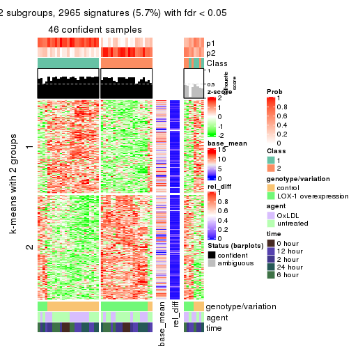</p>

</div>
<div id='tab-CV-pam-get-signatures-2'>
<pre><code class="r">get_signatures(res, k = 3)
</code></pre>

<p>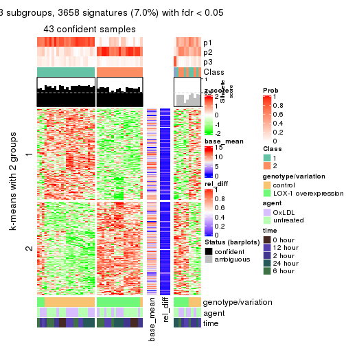</p>

</div>
<div id='tab-CV-pam-get-signatures-3'>
<pre><code class="r">get_signatures(res, k = 4)
</code></pre>

<p>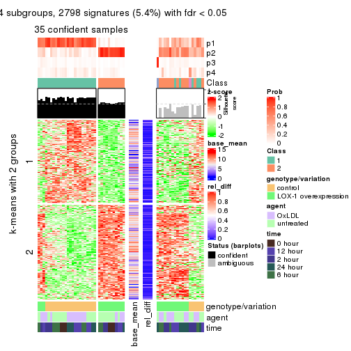</p>

</div>
<div id='tab-CV-pam-get-signatures-4'>
<pre><code class="r">get_signatures(res, k = 5)
</code></pre>

<p>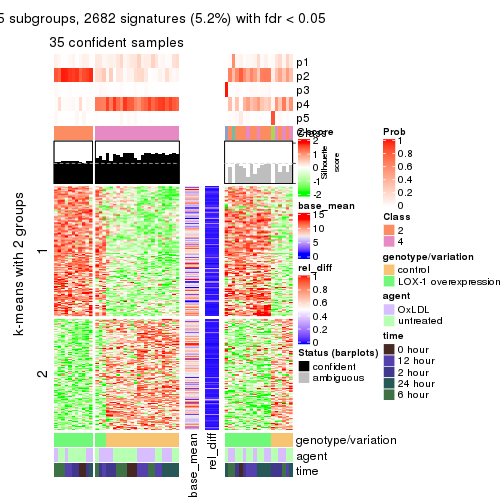</p>

</div>
<div id='tab-CV-pam-get-signatures-5'>
<pre><code class="r">get_signatures(res, k = 6)
</code></pre>

<p></p>

</div>
</div>


Signature heatmaps where rows are not scaled:


<script>
$( function() {
	$( '#tabs-CV-pam-get-signatures-no-scale' ).tabs();
} );
</script>
<div id='tabs-CV-pam-get-signatures-no-scale'>
<ul>
<li><a href='#tab-CV-pam-get-signatures-no-scale-1'>k = 2</a></li>
<li><a href='#tab-CV-pam-get-signatures-no-scale-2'>k = 3</a></li>
<li><a href='#tab-CV-pam-get-signatures-no-scale-3'>k = 4</a></li>
<li><a href='#tab-CV-pam-get-signatures-no-scale-4'>k = 5</a></li>
<li><a href='#tab-CV-pam-get-signatures-no-scale-5'>k = 6</a></li>
</ul>
<div id='tab-CV-pam-get-signatures-no-scale-1'>
<pre><code class="r">get_signatures(res, k = 2, scale_rows = FALSE)
</code></pre>

<p>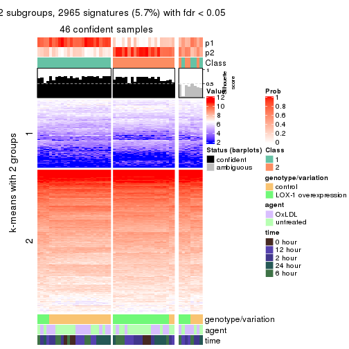</p>

</div>
<div id='tab-CV-pam-get-signatures-no-scale-2'>
<pre><code class="r">get_signatures(res, k = 3, scale_rows = FALSE)
</code></pre>

<p>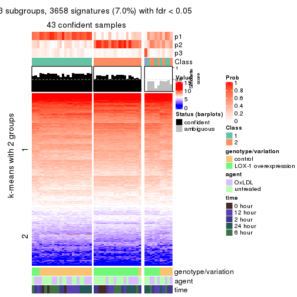</p>

</div>
<div id='tab-CV-pam-get-signatures-no-scale-3'>
<pre><code class="r">get_signatures(res, k = 4, scale_rows = FALSE)
</code></pre>

<p>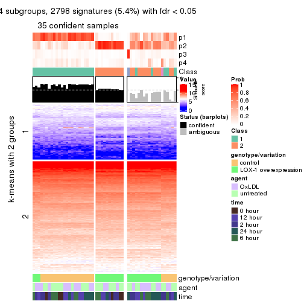</p>

</div>
<div id='tab-CV-pam-get-signatures-no-scale-4'>
<pre><code class="r">get_signatures(res, k = 5, scale_rows = FALSE)
</code></pre>

<p>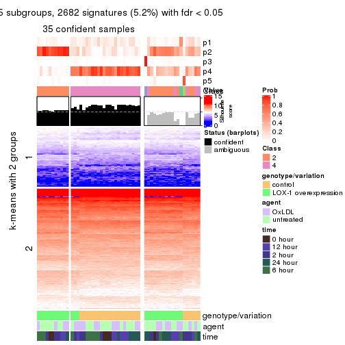</p>

</div>
<div id='tab-CV-pam-get-signatures-no-scale-5'>
<pre><code class="r">get_signatures(res, k = 6, scale_rows = FALSE)
</code></pre>

<p></p>

</div>
</div>


Compare the overlap of signatures from different k:

```r
compare_signatures(res)
```

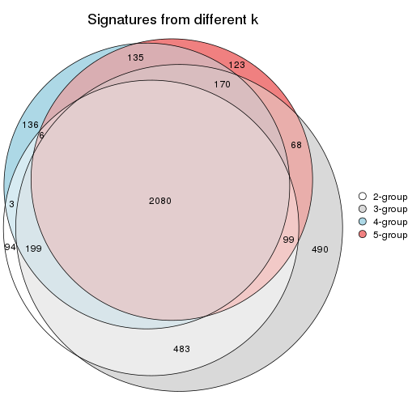

`get_signature()` returns a data frame invisibly. TO get the list of signatures, the function
call should be assigned to a variable explicitly. In following code, if `plot` argument is set
to `FALSE`, no heatmap is plotted while only the differential analysis is performed.

```r
# code only for demonstration
tb = get_signature(res, k = ..., plot = FALSE)
```

An example of the output of `tb` is:

```
#>   which_row         fdr    mean_1    mean_2 scaled_mean_1 scaled_mean_2 km
#> 1        38 0.042760348  8.373488  9.131774    -0.5533452     0.5164555  1
#> 2        40 0.018707592  7.106213  8.469186    -0.6173731     0.5762149  1
#> 3        55 0.019134737 10.221463 11.207825    -0.6159697     0.5749050  1
#> 4        59 0.006059896  5.921854  7.869574    -0.6899429     0.6439467  1
#> 5        60 0.018055526  8.928898 10.211722    -0.6204761     0.5791110  1
#> 6        98 0.009384629 15.714769 14.887706     0.6635654    -0.6193277  2
...
```

The columns in `tb` are:

1. `which_row`: row indices corresponding to the input matrix.
2. `fdr`: FDR for the differential test. 
3. `mean_x`: The mean value in group x.
4. `scaled_mean_x`: The mean value in group x after rows are scaled.
5. `km`: Row groups if k-means clustering is applied to rows.


UMAP plot which shows how samples are separated.


<script>
$( function() {
	$( '#tabs-CV-pam-dimension-reduction' ).tabs();
} );
</script>
<div id='tabs-CV-pam-dimension-reduction'>
<ul>
<li><a href='#tab-CV-pam-dimension-reduction-1'>k = 2</a></li>
<li><a href='#tab-CV-pam-dimension-reduction-2'>k = 3</a></li>
<li><a href='#tab-CV-pam-dimension-reduction-3'>k = 4</a></li>
<li><a href='#tab-CV-pam-dimension-reduction-4'>k = 5</a></li>
<li><a href='#tab-CV-pam-dimension-reduction-5'>k = 6</a></li>
</ul>
<div id='tab-CV-pam-dimension-reduction-1'>
<pre><code class="r">dimension_reduction(res, k = 2, method = &quot;UMAP&quot;)
</code></pre>

<p>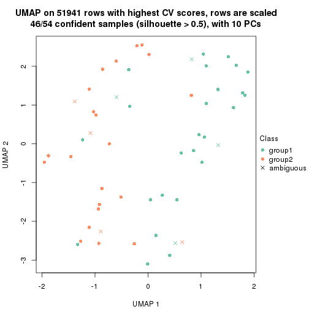</p>

</div>
<div id='tab-CV-pam-dimension-reduction-2'>
<pre><code class="r">dimension_reduction(res, k = 3, method = &quot;UMAP&quot;)
</code></pre>

<p>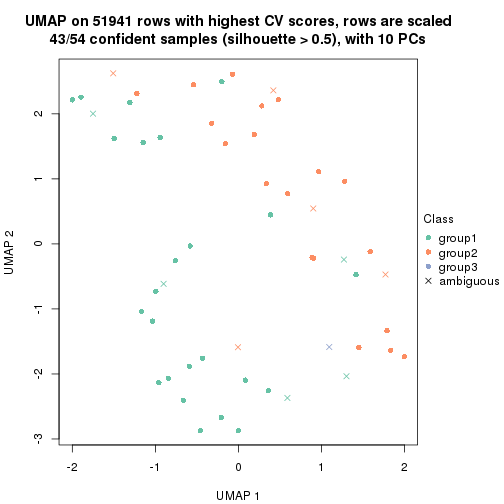</p>

</div>
<div id='tab-CV-pam-dimension-reduction-3'>
<pre><code class="r">dimension_reduction(res, k = 4, method = &quot;UMAP&quot;)
</code></pre>

<p>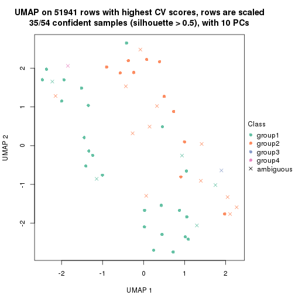</p>

</div>
<div id='tab-CV-pam-dimension-reduction-4'>
<pre><code class="r">dimension_reduction(res, k = 5, method = &quot;UMAP&quot;)
</code></pre>

<p>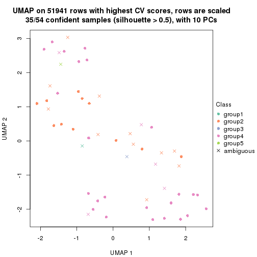</p>

</div>
<div id='tab-CV-pam-dimension-reduction-5'>
<pre><code class="r">dimension_reduction(res, k = 6, method = &quot;UMAP&quot;)
</code></pre>

<p>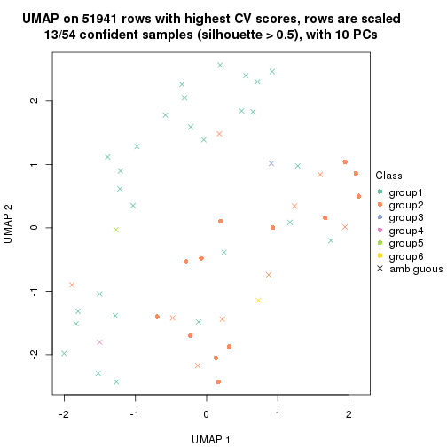</p>

</div>
</div>


Following heatmap shows how subgroups are split when increasing `k`:

```r
collect_classes(res)
```

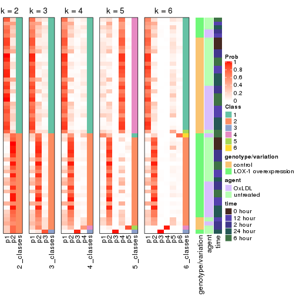


Test correlation between subgroups and known annotations. If the known
annotation is numeric, one-way ANOVA test is applied, and if the known
annotation is discrete, chi-squared contingency table test is applied.

```r
test_to_known_factors(res)
```

```
#>         n genotype/variation(p) agent(p) time(p) k
#> CV:pam 46              2.18e-06    0.480   0.956 2
#> CV:pam 43              4.41e-07    0.580   0.901 3
#> CV:pam 35              5.79e-06    0.372   0.681 4
#> CV:pam 35              5.79e-06    0.699   0.849 5
#> CV:pam 13                    NA       NA      NA 6
```


If matrix rows can be associated to genes, consider to use `functional_enrichment(res,
...)` to perform function enrichment for the signature genes. See [this vignette](http://bioconductor.org/packages/devel/bioc/vignettes/cola/inst/doc/functional_enrichment.html) for more detailed explanations.


 

---------------------------------------------------


### CV:mclust


The object with results only for a single top-value method and a single partition method 
can be extracted as:

```r
res = res_list["CV", "mclust"]
# you can also extract it by
# res = res_list["CV:mclust"]
```

A summary of `res` and all the functions that can be applied to it:

```r
res
```

```
#> A 'ConsensusPartition' object with k = 2, 3, 4, 5, 6.
#>   On a matrix with 51941 rows and 54 columns.
#>   Top rows (1000, 2000, 3000, 4000, 5000) are extracted by 'CV' method.
#>   Subgroups are detected by 'mclust' method.
#>   Performed in total 1250 partitions by row resampling.
#>   Best k for subgroups seems to be 3.
#> 
#> Following methods can be applied to this 'ConsensusPartition' object:
#>  [1] "cola_report"             "collect_classes"         "collect_plots"          
#>  [4] "collect_stats"           "colnames"                "compare_signatures"     
#>  [7] "consensus_heatmap"       "dimension_reduction"     "functional_enrichment"  
#> [10] "get_anno_col"            "get_anno"                "get_classes"            
#> [13] "get_consensus"           "get_matrix"              "get_membership"         
#> [16] "get_param"               "get_signatures"          "get_stats"              
#> [19] "is_best_k"               "is_stable_k"             "membership_heatmap"     
#> [22] "ncol"                    "nrow"                    "plot_ecdf"              
#> [25] "rownames"                "select_partition_number" "show"                   
#> [28] "suggest_best_k"          "test_to_known_factors"
```

`collect_plots()` function collects all the plots made from `res` for all `k` (number of partitions)
into one single page to provide an easy and fast comparison between different `k`.

```r
collect_plots(res)
```

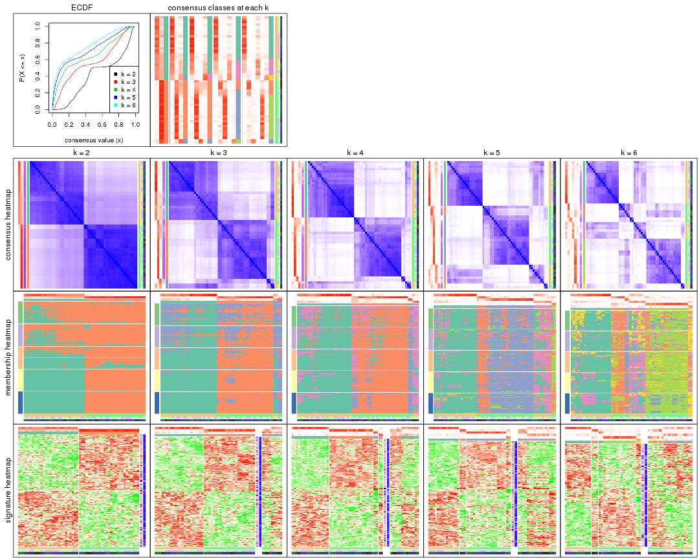

The plots are:

- The first row: a plot of the ECDF (empirical cumulative distribution
  function) curves of the consensus matrix for each `k` and the heatmap of
  predicted classes for each `k`.
- The second row: heatmaps of the consensus matrix for each `k`.
- The third row: heatmaps of the membership matrix for each `k`.
- The fouth row: heatmaps of the signatures for each `k`.

All the plots in panels can be made by individual functions and they are
plotted later in this section.

`select_partition_number()` produces several plots showing different
statistics for choosing "optimized" `k`. There are following statistics:

- ECDF curves of the consensus matrix for each `k`;
- 1-PAC. [The PAC
  score](https://en.wikipedia.org/wiki/Consensus_clustering#Over-interpretation_potential_of_consensus_clustering)
  measures the proportion of the ambiguous subgrouping.
- Mean silhouette score.
- Concordance. The mean probability of fiting the consensus class ids in all
  partitions.
- Area increased. Denote $A_k$ as the area under the ECDF curve for current
  `k`, the area increased is defined as $A_k - A_{k-1}$.
- Rand index. The percent of pairs of samples that are both in a same cluster
  or both are not in a same cluster in the partition of k and k-1.
- Jaccard index. The ratio of pairs of samples are both in a same cluster in
  the partition of k and k-1 and the pairs of samples are both in a same
  cluster in the partition k or k-1.

The detailed explanations of these statistics can be found in [the _cola_
vignette](http://bioconductor.org/packages/devel/bioc/vignettes/cola/inst/doc/cola.html#toc_13).

Generally speaking, lower PAC score, higher mean silhouette score or higher
concordance corresponds to better partition. Rand index and Jaccard index
measure how similar the current partition is compared to partition with `k-1`.
If they are too similar, we won't accept `k` is better than `k-1`.

```r
select_partition_number(res)
```

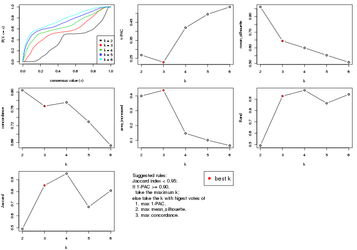

The numeric values for all these statistics can be obtained by `get_stats()`.

```r
get_stats(res)
```

```
#>   k 1-PAC mean_silhouette concordance area_increased  Rand Jaccard
#> 2 2 0.268           0.862       0.804         0.3995 0.491   0.491
#> 3 3 0.228           0.644       0.767         0.4377 0.927   0.853
#> 4 4 0.420           0.600       0.776         0.1470 0.979   0.951
#> 5 5 0.495           0.553       0.729         0.1011 0.864   0.674
#> 6 6 0.536           0.508       0.673         0.0645 0.943   0.809
```

`suggest_best_k()` suggests the best $k$ based on these statistics. The rules are as follows:

- All $k$ with Jaccard index larger than 0.95 are removed because increasing
  $k$ does not provide enough extra information. If all $k$ are removed, it is
  marked as no subgroup is detected.
- For all $k$ with 1-PAC score larger than 0.9, the maximal $k$ is taken as
  the best $k$, and other $k$ are marked as optional $k$.
- If it does not fit the second rule. The $k$ with the maximal vote of the
  highest 1-PAC score, highest mean silhouette, and highest concordance is
  taken as the best $k$.

```r
suggest_best_k(res)
```

```
#> [1] 3
```


Following shows the table of the partitions (You need to click the **show/hide
code output** link to see it). The membership matrix (columns with name `p*`)
is inferred by
[`clue::cl_consensus()`](https://www.rdocumentation.org/link/cl_consensus?package=clue)
function with the `SE` method. Basically the value in the membership matrix
represents the probability to belong to a certain group. The finall class
label for an item is determined with the group with highest probability it
belongs to.

In `get_classes()` function, the entropy is calculated from the membership
matrix and the silhouette score is calculated from the consensus matrix.


<script>
$( function() {
	$( '#tabs-CV-mclust-get-classes' ).tabs();
} );
</script>
<div id='tabs-CV-mclust-get-classes'>
<ul>
<li><a href='#tab-CV-mclust-get-classes-1'>k = 2</a></li>
<li><a href='#tab-CV-mclust-get-classes-2'>k = 3</a></li>
<li><a href='#tab-CV-mclust-get-classes-3'>k = 4</a></li>
<li><a href='#tab-CV-mclust-get-classes-4'>k = 5</a></li>
<li><a href='#tab-CV-mclust-get-classes-5'>k = 6</a></li>
</ul>

<div id='tab-CV-mclust-get-classes-1'>
<p><a id='tab-CV-mclust-get-classes-1-a' style='color:#0366d6' href='#'>show/hide code output</a></p>
<pre><code class="r">cbind(get_classes(res, k = 2), get_membership(res, k = 2))
</code></pre>

<pre><code>#&gt;           class entropy silhouette    p1    p2
#&gt; GSM329068     2   0.204      0.938 0.032 0.968
#&gt; GSM329074     2   0.430      0.915 0.088 0.912
#&gt; GSM329100     2   0.373      0.922 0.072 0.928
#&gt; GSM329062     2   0.204      0.942 0.032 0.968
#&gt; GSM329079     2   0.388      0.916 0.076 0.924
#&gt; GSM329090     2   0.260      0.941 0.044 0.956
#&gt; GSM329066     2   0.311      0.931 0.056 0.944
#&gt; GSM329086     2   0.295      0.938 0.052 0.948
#&gt; GSM329099     2   0.443      0.905 0.092 0.908
#&gt; GSM329071     2   0.141      0.941 0.020 0.980
#&gt; GSM329078     2   0.278      0.941 0.048 0.952
#&gt; GSM329081     2   0.163      0.943 0.024 0.976
#&gt; GSM329096     2   0.163      0.940 0.024 0.976
#&gt; GSM329102     2   0.388      0.933 0.076 0.924
#&gt; GSM329104     2   0.605      0.836 0.148 0.852
#&gt; GSM329067     2   0.295      0.935 0.052 0.948
#&gt; GSM329072     2   0.204      0.941 0.032 0.968
#&gt; GSM329075     2   0.456      0.893 0.096 0.904
#&gt; GSM329058     2   0.388      0.926 0.076 0.924
#&gt; GSM329073     2   0.584      0.845 0.140 0.860
#&gt; GSM329107     2   0.260      0.935 0.044 0.956
#&gt; GSM329057     2   0.184      0.939 0.028 0.972
#&gt; GSM329085     2   0.295      0.939 0.052 0.948
#&gt; GSM329089     2   0.141      0.942 0.020 0.980
#&gt; GSM329076     2   0.416      0.908 0.084 0.916
#&gt; GSM329094     2   0.204      0.943 0.032 0.968
#&gt; GSM329105     2   0.260      0.937 0.044 0.956
#&gt; GSM329056     1   0.980      0.799 0.584 0.416
#&gt; GSM329069     1   0.991      0.770 0.556 0.444
#&gt; GSM329077     1   0.985      0.731 0.572 0.428
#&gt; GSM329070     1   0.987      0.783 0.568 0.432
#&gt; GSM329082     1   0.946      0.829 0.636 0.364
#&gt; GSM329092     1   0.971      0.756 0.600 0.400
#&gt; GSM329083     1   0.913      0.831 0.672 0.328
#&gt; GSM329101     1   0.697      0.788 0.812 0.188
#&gt; GSM329106     1   0.973      0.811 0.596 0.404
#&gt; GSM329087     1   0.821      0.827 0.744 0.256
#&gt; GSM329091     1   0.866      0.835 0.712 0.288
#&gt; GSM329093     1   0.615      0.758 0.848 0.152
#&gt; GSM329080     1   0.722      0.796 0.800 0.200
#&gt; GSM329084     1   0.985      0.791 0.572 0.428
#&gt; GSM329088     1   0.861      0.835 0.716 0.284
#&gt; GSM329059     1   0.985      0.785 0.572 0.428
#&gt; GSM329097     1   0.866      0.835 0.712 0.288
#&gt; GSM329098     1   0.991      0.768 0.556 0.444
#&gt; GSM329055     1   0.595      0.750 0.856 0.144
#&gt; GSM329103     1   0.839      0.831 0.732 0.268
#&gt; GSM329108     1   0.802      0.822 0.756 0.244
#&gt; GSM329061     1   0.644      0.772 0.836 0.164
#&gt; GSM329064     1   0.969      0.812 0.604 0.396
#&gt; GSM329065     1   0.706      0.791 0.808 0.192
#&gt; GSM329060     1   0.833      0.831 0.736 0.264
#&gt; GSM329063     1   0.975      0.810 0.592 0.408
#&gt; GSM329095     1   0.969      0.813 0.604 0.396
</code></pre>

<script>
$('#tab-CV-mclust-get-classes-1-a').parent().next().next().hide();
$('#tab-CV-mclust-get-classes-1-a').click(function(){
  $('#tab-CV-mclust-get-classes-1-a').parent().next().next().toggle();
  return(false);
});
</script>
</div>

<div id='tab-CV-mclust-get-classes-2'>
<p><a id='tab-CV-mclust-get-classes-2-a' style='color:#0366d6' href='#'>show/hide code output</a></p>
<pre><code class="r">cbind(get_classes(res, k = 3), get_membership(res, k = 3))
</code></pre>

<pre><code>#&gt;           class entropy silhouette    p1    p2    p3
#&gt; GSM329068     2   0.583     0.6996 0.008 0.708 0.284
#&gt; GSM329074     2   0.672     0.4757 0.012 0.568 0.420
#&gt; GSM329100     2   0.661     0.4752 0.008 0.560 0.432
#&gt; GSM329062     2   0.451     0.7950 0.012 0.832 0.156
#&gt; GSM329079     2   0.509     0.7939 0.072 0.836 0.092
#&gt; GSM329090     2   0.301     0.7982 0.028 0.920 0.052
#&gt; GSM329066     2   0.281     0.7772 0.032 0.928 0.040
#&gt; GSM329086     2   0.680     0.6322 0.024 0.632 0.344
#&gt; GSM329099     2   0.525     0.7808 0.096 0.828 0.076
#&gt; GSM329071     2   0.199     0.7881 0.004 0.948 0.048
#&gt; GSM329078     2   0.318     0.8087 0.024 0.912 0.064
#&gt; GSM329081     2   0.312     0.8120 0.012 0.908 0.080
#&gt; GSM329096     2   0.305     0.8077 0.020 0.916 0.064
#&gt; GSM329102     2   0.658     0.7441 0.068 0.740 0.192
#&gt; GSM329104     3   0.517     0.3461 0.012 0.204 0.784
#&gt; GSM329067     2   0.638     0.5868 0.008 0.624 0.368
#&gt; GSM329072     2   0.409     0.8135 0.028 0.872 0.100
#&gt; GSM329075     2   0.715     0.7001 0.092 0.708 0.200
#&gt; GSM329058     2   0.660     0.6559 0.024 0.664 0.312
#&gt; GSM329073     3   0.610     0.2888 0.024 0.252 0.724
#&gt; GSM329107     2   0.274     0.7807 0.020 0.928 0.052
#&gt; GSM329057     2   0.426     0.8006 0.012 0.848 0.140
#&gt; GSM329085     2   0.391     0.8132 0.020 0.876 0.104
#&gt; GSM329089     2   0.250     0.8011 0.004 0.928 0.068
#&gt; GSM329076     2   0.566     0.7745 0.096 0.808 0.096
#&gt; GSM329094     2   0.495     0.7887 0.016 0.808 0.176
#&gt; GSM329105     2   0.292     0.7939 0.032 0.924 0.044
#&gt; GSM329056     1   0.738     0.6344 0.680 0.084 0.236
#&gt; GSM329069     1   0.851     0.2745 0.512 0.096 0.392
#&gt; GSM329077     3   0.888    -0.1043 0.416 0.120 0.464
#&gt; GSM329070     1   0.792     0.4700 0.584 0.072 0.344
#&gt; GSM329082     1   0.733     0.6204 0.672 0.072 0.256
#&gt; GSM329092     3   0.855    -0.0764 0.412 0.096 0.492
#&gt; GSM329083     1   0.713     0.5572 0.664 0.052 0.284
#&gt; GSM329101     1   0.234     0.7067 0.940 0.012 0.048
#&gt; GSM329106     1   0.745     0.5564 0.636 0.060 0.304
#&gt; GSM329087     1   0.334     0.7283 0.908 0.060 0.032
#&gt; GSM329091     1   0.533     0.7259 0.824 0.076 0.100
#&gt; GSM329093     1   0.162     0.6940 0.964 0.024 0.012
#&gt; GSM329080     1   0.231     0.7063 0.944 0.032 0.024
#&gt; GSM329084     1   0.816     0.5232 0.608 0.104 0.288
#&gt; GSM329088     1   0.447     0.7327 0.864 0.076 0.060
#&gt; GSM329059     1   0.871     0.4800 0.580 0.156 0.264
#&gt; GSM329097     1   0.466     0.7340 0.856 0.076 0.068
#&gt; GSM329098     1   0.839     0.5439 0.612 0.140 0.248
#&gt; GSM329055     1   0.148     0.6837 0.968 0.012 0.020
#&gt; GSM329103     1   0.406     0.7308 0.880 0.076 0.044
#&gt; GSM329108     1   0.397     0.7289 0.880 0.032 0.088
#&gt; GSM329061     1   0.158     0.7058 0.964 0.028 0.008
#&gt; GSM329064     1   0.723     0.6616 0.712 0.116 0.172
#&gt; GSM329065     1   0.266     0.7203 0.932 0.024 0.044
#&gt; GSM329060     1   0.491     0.7316 0.844 0.088 0.068
#&gt; GSM329063     1   0.791     0.6053 0.648 0.112 0.240
#&gt; GSM329095     1   0.787     0.5660 0.664 0.200 0.136
</code></pre>

<script>
$('#tab-CV-mclust-get-classes-2-a').parent().next().next().hide();
$('#tab-CV-mclust-get-classes-2-a').click(function(){
  $('#tab-CV-mclust-get-classes-2-a').parent().next().next().toggle();
  return(false);
});
</script>
</div>

<div id='tab-CV-mclust-get-classes-3'>
<p><a id='tab-CV-mclust-get-classes-3-a' style='color:#0366d6' href='#'>show/hide code output</a></p>
<pre><code class="r">cbind(get_classes(res, k = 4), get_membership(res, k = 4))
</code></pre>

<pre><code>#&gt;           class entropy silhouette    p1    p2    p3    p4
#&gt; GSM329068     2   0.678     0.5261 0.012 0.640 0.140 0.208
#&gt; GSM329074     2   0.792    -0.2339 0.000 0.356 0.320 0.324
#&gt; GSM329100     2   0.789    -0.1899 0.000 0.376 0.320 0.304
#&gt; GSM329062     2   0.413     0.7094 0.000 0.824 0.052 0.124
#&gt; GSM329079     2   0.411     0.7072 0.124 0.832 0.036 0.008
#&gt; GSM329090     2   0.256     0.7530 0.036 0.920 0.036 0.008
#&gt; GSM329066     2   0.217     0.7545 0.024 0.936 0.032 0.008
#&gt; GSM329086     2   0.769     0.3490 0.024 0.532 0.300 0.144
#&gt; GSM329099     2   0.523     0.6783 0.148 0.776 0.048 0.028
#&gt; GSM329071     2   0.182     0.7525 0.008 0.948 0.032 0.012
#&gt; GSM329078     2   0.345     0.7512 0.052 0.884 0.020 0.044
#&gt; GSM329081     2   0.241     0.7553 0.004 0.924 0.032 0.040
#&gt; GSM329096     2   0.281     0.7583 0.016 0.912 0.040 0.032
#&gt; GSM329102     2   0.693     0.6379 0.096 0.688 0.124 0.092
#&gt; GSM329104     3   0.410     0.7674 0.004 0.056 0.836 0.104
#&gt; GSM329067     2   0.763     0.0966 0.000 0.472 0.256 0.272
#&gt; GSM329072     2   0.412     0.7427 0.028 0.852 0.072 0.048
#&gt; GSM329075     2   0.717     0.4681 0.252 0.620 0.072 0.056
#&gt; GSM329058     2   0.673     0.5326 0.020 0.640 0.244 0.096
#&gt; GSM329073     3   0.593     0.7715 0.020 0.160 0.728 0.092
#&gt; GSM329107     2   0.233     0.7518 0.020 0.928 0.044 0.008
#&gt; GSM329057     2   0.309     0.7417 0.000 0.888 0.052 0.060
#&gt; GSM329085     2   0.359     0.7545 0.040 0.880 0.032 0.048
#&gt; GSM329089     2   0.213     0.7489 0.000 0.932 0.036 0.032
#&gt; GSM329076     2   0.515     0.7044 0.120 0.792 0.044 0.044
#&gt; GSM329094     2   0.485     0.7227 0.020 0.804 0.060 0.116
#&gt; GSM329105     2   0.175     0.7550 0.024 0.952 0.012 0.012
#&gt; GSM329056     1   0.506     0.6583 0.756 0.024 0.020 0.200
#&gt; GSM329069     4   0.695     0.2796 0.372 0.032 0.052 0.544
#&gt; GSM329077     4   0.563     0.6266 0.156 0.064 0.028 0.752
#&gt; GSM329070     1   0.670     0.4596 0.624 0.016 0.088 0.272
#&gt; GSM329082     1   0.630     0.3266 0.600 0.024 0.032 0.344
#&gt; GSM329092     4   0.454     0.6032 0.140 0.012 0.040 0.808
#&gt; GSM329083     1   0.567     0.2192 0.584 0.008 0.016 0.392
#&gt; GSM329101     1   0.185     0.7402 0.940 0.000 0.012 0.048
#&gt; GSM329106     1   0.600     0.5106 0.664 0.008 0.060 0.268
#&gt; GSM329087     1   0.209     0.7525 0.940 0.020 0.012 0.028
#&gt; GSM329091     1   0.401     0.7369 0.840 0.024 0.016 0.120
#&gt; GSM329093     1   0.167     0.7494 0.952 0.004 0.012 0.032
#&gt; GSM329080     1   0.217     0.7469 0.936 0.012 0.016 0.036
#&gt; GSM329084     1   0.627     0.3472 0.588 0.024 0.028 0.360
#&gt; GSM329088     1   0.302     0.7506 0.900 0.024 0.016 0.060
#&gt; GSM329059     1   0.779     0.0795 0.516 0.128 0.032 0.324
#&gt; GSM329097     1   0.263     0.7506 0.916 0.048 0.008 0.028
#&gt; GSM329098     1   0.677     0.4890 0.640 0.116 0.016 0.228
#&gt; GSM329055     1   0.144     0.7470 0.960 0.004 0.008 0.028
#&gt; GSM329103     1   0.273     0.7488 0.912 0.032 0.008 0.048
#&gt; GSM329108     1   0.225     0.7538 0.928 0.004 0.016 0.052
#&gt; GSM329061     1   0.112     0.7501 0.972 0.004 0.012 0.012
#&gt; GSM329064     1   0.452     0.7099 0.820 0.064 0.012 0.104
#&gt; GSM329065     1   0.126     0.7536 0.964 0.000 0.008 0.028
#&gt; GSM329060     1   0.345     0.7458 0.880 0.044 0.012 0.064
#&gt; GSM329063     1   0.617     0.5939 0.692 0.048 0.036 0.224
#&gt; GSM329095     1   0.656     0.4897 0.660 0.168 0.008 0.164
</code></pre>

<script>
$('#tab-CV-mclust-get-classes-3-a').parent().next().next().hide();
$('#tab-CV-mclust-get-classes-3-a').click(function(){
  $('#tab-CV-mclust-get-classes-3-a').parent().next().next().toggle();
  return(false);
});
</script>
</div>

<div id='tab-CV-mclust-get-classes-4'>
<p><a id='tab-CV-mclust-get-classes-4-a' style='color:#0366d6' href='#'>show/hide code output</a></p>
<pre><code class="r">cbind(get_classes(res, k = 5), get_membership(res, k = 5))
</code></pre>

<pre><code>#&gt;           class entropy silhouette    p1    p2    p3    p4    p5
#&gt; GSM329068     2   0.538      0.375 0.004 0.548 0.408 0.032 0.008
#&gt; GSM329074     2   0.408      0.669 0.004 0.792 0.164 0.028 0.012
#&gt; GSM329100     2   0.464      0.607 0.004 0.780 0.132 0.052 0.032
#&gt; GSM329062     3   0.503      0.427 0.000 0.324 0.636 0.020 0.020
#&gt; GSM329079     3   0.434      0.714 0.064 0.052 0.820 0.012 0.052
#&gt; GSM329090     3   0.287      0.746 0.020 0.052 0.896 0.012 0.020
#&gt; GSM329066     3   0.274      0.739 0.016 0.040 0.900 0.004 0.040
#&gt; GSM329086     3   0.672     -0.092 0.000 0.392 0.468 0.040 0.100
#&gt; GSM329099     3   0.477      0.687 0.084 0.048 0.796 0.020 0.052
#&gt; GSM329071     3   0.277      0.728 0.004 0.100 0.876 0.000 0.020
#&gt; GSM329078     3   0.378      0.741 0.036 0.032 0.852 0.016 0.064
#&gt; GSM329081     3   0.345      0.737 0.004 0.104 0.848 0.008 0.036
#&gt; GSM329096     3   0.313      0.736 0.004 0.084 0.868 0.004 0.040
#&gt; GSM329102     3   0.648      0.607 0.072 0.096 0.688 0.048 0.096
#&gt; GSM329104     5   0.522      0.713 0.004 0.304 0.012 0.036 0.644
#&gt; GSM329067     2   0.354      0.694 0.000 0.788 0.200 0.008 0.004
#&gt; GSM329072     3   0.358      0.736 0.012 0.052 0.856 0.012 0.068
#&gt; GSM329075     3   0.677      0.526 0.140 0.060 0.660 0.076 0.064
#&gt; GSM329058     3   0.612     -0.178 0.004 0.448 0.472 0.040 0.036
#&gt; GSM329073     5   0.660      0.692 0.012 0.296 0.112 0.020 0.560
#&gt; GSM329107     3   0.214      0.748 0.000 0.048 0.920 0.004 0.028
#&gt; GSM329057     3   0.440      0.568 0.000 0.276 0.696 0.000 0.028
#&gt; GSM329085     3   0.334      0.741 0.032 0.028 0.872 0.008 0.060
#&gt; GSM329089     3   0.361      0.676 0.000 0.184 0.796 0.004 0.016
#&gt; GSM329076     3   0.520      0.685 0.076 0.056 0.776 0.048 0.044
#&gt; GSM329094     3   0.520      0.658 0.000 0.124 0.744 0.060 0.072
#&gt; GSM329105     3   0.250      0.750 0.008 0.052 0.908 0.004 0.028
#&gt; GSM329056     1   0.596      0.240 0.596 0.020 0.020 0.324 0.040
#&gt; GSM329069     4   0.728      0.534 0.188 0.112 0.028 0.592 0.080
#&gt; GSM329077     4   0.706      0.310 0.092 0.228 0.028 0.592 0.060
#&gt; GSM329070     4   0.645      0.283 0.400 0.020 0.004 0.484 0.092
#&gt; GSM329082     1   0.651      0.166 0.552 0.044 0.020 0.340 0.044
#&gt; GSM329092     4   0.687      0.207 0.052 0.228 0.020 0.600 0.100
#&gt; GSM329083     4   0.603      0.391 0.380 0.044 0.004 0.540 0.032
#&gt; GSM329101     1   0.277      0.689 0.876 0.004 0.000 0.100 0.020
#&gt; GSM329106     4   0.619      0.207 0.436 0.008 0.008 0.468 0.080
#&gt; GSM329087     1   0.216      0.723 0.924 0.000 0.036 0.016 0.024
#&gt; GSM329091     1   0.432      0.642 0.760 0.004 0.024 0.200 0.012
#&gt; GSM329093     1   0.212      0.721 0.924 0.000 0.012 0.044 0.020
#&gt; GSM329080     1   0.261      0.702 0.888 0.004 0.000 0.088 0.020
#&gt; GSM329084     4   0.679      0.286 0.380 0.072 0.020 0.496 0.032
#&gt; GSM329088     1   0.425      0.670 0.804 0.012 0.020 0.132 0.032
#&gt; GSM329059     4   0.834      0.389 0.320 0.136 0.076 0.420 0.048
#&gt; GSM329097     1   0.326      0.713 0.876 0.008 0.048 0.048 0.020
#&gt; GSM329098     1   0.710      0.067 0.524 0.052 0.076 0.324 0.024
#&gt; GSM329055     1   0.181      0.710 0.928 0.000 0.000 0.060 0.012
#&gt; GSM329103     1   0.276      0.716 0.892 0.000 0.036 0.060 0.012
#&gt; GSM329108     1   0.291      0.707 0.876 0.008 0.000 0.088 0.028
#&gt; GSM329061     1   0.195      0.726 0.932 0.000 0.012 0.040 0.016
#&gt; GSM329064     1   0.534      0.601 0.740 0.024 0.044 0.156 0.036
#&gt; GSM329065     1   0.181      0.725 0.936 0.000 0.004 0.040 0.020
#&gt; GSM329060     1   0.332      0.708 0.864 0.000 0.040 0.072 0.024
#&gt; GSM329063     1   0.697      0.233 0.560 0.060 0.060 0.292 0.028
#&gt; GSM329095     1   0.699      0.342 0.604 0.020 0.148 0.176 0.052
</code></pre>

<script>
$('#tab-CV-mclust-get-classes-4-a').parent().next().next().hide();
$('#tab-CV-mclust-get-classes-4-a').click(function(){
  $('#tab-CV-mclust-get-classes-4-a').parent().next().next().toggle();
  return(false);
});
</script>
</div>

<div id='tab-CV-mclust-get-classes-5'>
<p><a id='tab-CV-mclust-get-classes-5-a' style='color:#0366d6' href='#'>show/hide code output</a></p>
<pre><code class="r">cbind(get_classes(res, k = 6), get_membership(res, k = 6))
</code></pre>

<pre><code>#&gt;           class entropy silhouette    p1    p2    p3    p4    p5    p6
#&gt; GSM329068     2   0.485     0.5291 0.008 0.640 0.008 0.012 0.308 0.024
#&gt; GSM329074     2   0.391     0.5013 0.000 0.812 0.036 0.016 0.104 0.032
#&gt; GSM329100     2   0.370     0.4679 0.000 0.820 0.044 0.004 0.100 0.032
#&gt; GSM329062     5   0.468     0.2266 0.000 0.384 0.012 0.000 0.576 0.028
#&gt; GSM329079     5   0.567     0.6206 0.052 0.044 0.072 0.028 0.724 0.080
#&gt; GSM329090     5   0.397     0.6823 0.012 0.040 0.084 0.008 0.820 0.036
#&gt; GSM329066     5   0.384     0.6725 0.012 0.040 0.072 0.012 0.832 0.032
#&gt; GSM329086     2   0.763     0.3079 0.004 0.396 0.088 0.036 0.332 0.144
#&gt; GSM329099     5   0.625     0.5769 0.060 0.032 0.092 0.048 0.680 0.088
#&gt; GSM329071     5   0.330     0.6758 0.000 0.080 0.032 0.012 0.852 0.024
#&gt; GSM329078     5   0.516     0.6299 0.032 0.060 0.048 0.016 0.752 0.092
#&gt; GSM329081     5   0.381     0.6724 0.004 0.068 0.048 0.000 0.820 0.060
#&gt; GSM329096     5   0.369     0.6633 0.004 0.112 0.036 0.004 0.820 0.024
#&gt; GSM329102     5   0.768     0.4015 0.036 0.116 0.096 0.040 0.524 0.188
#&gt; GSM329104     3   0.481     0.7087 0.000 0.232 0.692 0.044 0.012 0.020
#&gt; GSM329067     2   0.335     0.5592 0.004 0.824 0.008 0.008 0.140 0.016
#&gt; GSM329072     5   0.474     0.6458 0.008 0.060 0.064 0.004 0.760 0.104
#&gt; GSM329075     5   0.808     0.3984 0.064 0.060 0.108 0.112 0.516 0.140
#&gt; GSM329058     2   0.662     0.4163 0.000 0.496 0.060 0.020 0.328 0.096
#&gt; GSM329073     3   0.597     0.6865 0.004 0.224 0.616 0.012 0.108 0.036
#&gt; GSM329107     5   0.269     0.6919 0.004 0.044 0.036 0.004 0.892 0.020
#&gt; GSM329057     5   0.476     0.4707 0.000 0.280 0.028 0.000 0.656 0.036
#&gt; GSM329085     5   0.509     0.6014 0.008 0.068 0.080 0.000 0.724 0.120
#&gt; GSM329089     5   0.409     0.6051 0.000 0.172 0.032 0.008 0.768 0.020
#&gt; GSM329076     5   0.693     0.5620 0.080 0.060 0.104 0.060 0.632 0.064
#&gt; GSM329094     5   0.532     0.5611 0.008 0.152 0.032 0.000 0.684 0.124
#&gt; GSM329105     5   0.297     0.6893 0.008 0.048 0.016 0.000 0.872 0.056
#&gt; GSM329056     4   0.554     0.2109 0.416 0.016 0.012 0.512 0.016 0.028
#&gt; GSM329069     4   0.622    -0.0335 0.096 0.072 0.024 0.652 0.012 0.144
#&gt; GSM329077     6   0.693     0.7574 0.048 0.152 0.012 0.312 0.008 0.468
#&gt; GSM329070     4   0.538     0.4390 0.244 0.000 0.052 0.648 0.008 0.048
#&gt; GSM329082     1   0.666     0.1218 0.508 0.016 0.016 0.188 0.012 0.260
#&gt; GSM329092     6   0.647     0.7697 0.040 0.120 0.020 0.236 0.008 0.576
#&gt; GSM329083     4   0.581     0.3509 0.316 0.012 0.008 0.544 0.000 0.120
#&gt; GSM329101     1   0.376     0.5426 0.764 0.000 0.004 0.192 0.000 0.040
#&gt; GSM329106     4   0.496     0.4598 0.300 0.004 0.040 0.636 0.004 0.016
#&gt; GSM329087     1   0.162     0.6527 0.940 0.000 0.000 0.012 0.024 0.024
#&gt; GSM329091     1   0.530     0.4665 0.632 0.004 0.012 0.280 0.016 0.056
#&gt; GSM329093     1   0.186     0.6493 0.928 0.000 0.004 0.032 0.004 0.032
#&gt; GSM329080     1   0.326     0.6027 0.824 0.000 0.004 0.140 0.008 0.024
#&gt; GSM329084     4   0.710     0.2774 0.348 0.040 0.012 0.376 0.004 0.220
#&gt; GSM329088     1   0.479     0.5194 0.700 0.008 0.020 0.232 0.012 0.028
#&gt; GSM329059     4   0.754     0.3227 0.264 0.084 0.024 0.496 0.048 0.084
#&gt; GSM329097     1   0.401     0.6217 0.820 0.012 0.024 0.088 0.024 0.032
#&gt; GSM329098     1   0.718    -0.1392 0.456 0.028 0.016 0.344 0.064 0.092
#&gt; GSM329055     1   0.301     0.5959 0.832 0.000 0.000 0.132 0.000 0.036
#&gt; GSM329103     1   0.361     0.6345 0.840 0.000 0.024 0.068 0.040 0.028
#&gt; GSM329108     1   0.328     0.5968 0.808 0.000 0.000 0.152 0.000 0.040
#&gt; GSM329061     1   0.170     0.6502 0.936 0.000 0.000 0.028 0.012 0.024
#&gt; GSM329064     1   0.627     0.4093 0.628 0.016 0.016 0.188 0.052 0.100
#&gt; GSM329065     1   0.236     0.6532 0.900 0.000 0.004 0.048 0.004 0.044
#&gt; GSM329060     1   0.377     0.6204 0.832 0.012 0.016 0.088 0.028 0.024
#&gt; GSM329063     1   0.700     0.1765 0.540 0.044 0.012 0.240 0.040 0.124
#&gt; GSM329095     1   0.733     0.2653 0.540 0.020 0.020 0.136 0.132 0.152
</code></pre>

<script>
$('#tab-CV-mclust-get-classes-5-a').parent().next().next().hide();
$('#tab-CV-mclust-get-classes-5-a').click(function(){
  $('#tab-CV-mclust-get-classes-5-a').parent().next().next().toggle();
  return(false);
});
</script>
</div>
</div>

Heatmaps for the consensus matrix. It visualizes the probability of two
samples to be in a same group.


<script>
$( function() {
	$( '#tabs-CV-mclust-consensus-heatmap' ).tabs();
} );
</script>
<div id='tabs-CV-mclust-consensus-heatmap'>
<ul>
<li><a href='#tab-CV-mclust-consensus-heatmap-1'>k = 2</a></li>
<li><a href='#tab-CV-mclust-consensus-heatmap-2'>k = 3</a></li>
<li><a href='#tab-CV-mclust-consensus-heatmap-3'>k = 4</a></li>
<li><a href='#tab-CV-mclust-consensus-heatmap-4'>k = 5</a></li>
<li><a href='#tab-CV-mclust-consensus-heatmap-5'>k = 6</a></li>
</ul>
<div id='tab-CV-mclust-consensus-heatmap-1'>
<pre><code class="r">consensus_heatmap(res, k = 2)
</code></pre>

<p>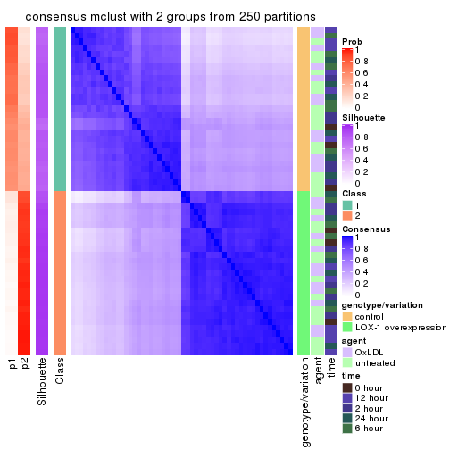</p>

</div>
<div id='tab-CV-mclust-consensus-heatmap-2'>
<pre><code class="r">consensus_heatmap(res, k = 3)
</code></pre>

<p>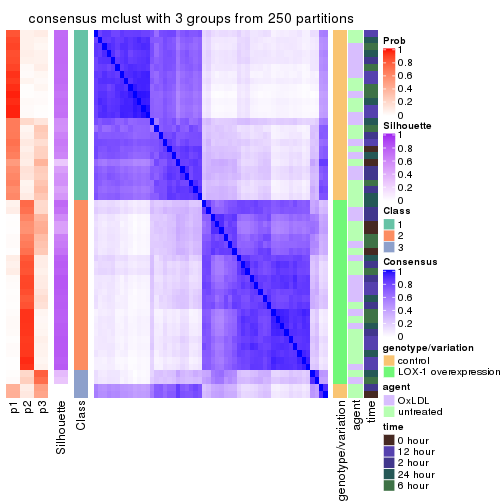</p>

</div>
<div id='tab-CV-mclust-consensus-heatmap-3'>
<pre><code class="r">consensus_heatmap(res, k = 4)
</code></pre>

<p>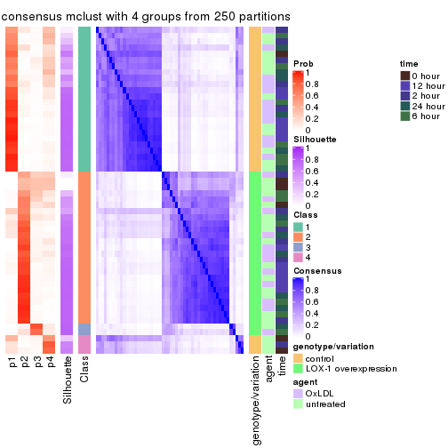</p>

</div>
<div id='tab-CV-mclust-consensus-heatmap-4'>
<pre><code class="r">consensus_heatmap(res, k = 5)
</code></pre>

<p>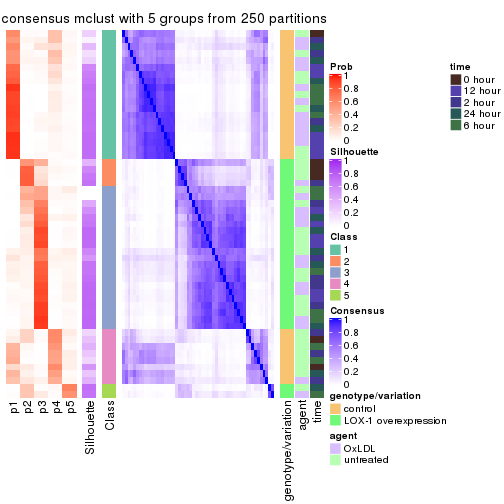</p>

</div>
<div id='tab-CV-mclust-consensus-heatmap-5'>
<pre><code class="r">consensus_heatmap(res, k = 6)
</code></pre>

<p>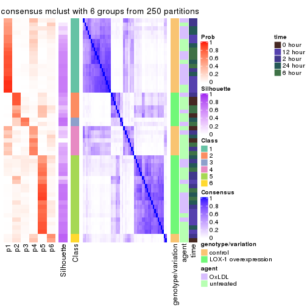</p>

</div>
</div>

Heatmaps for the membership of samples in all partitions to see how consistent they are:


<script>
$( function() {
	$( '#tabs-CV-mclust-membership-heatmap' ).tabs();
} );
</script>
<div id='tabs-CV-mclust-membership-heatmap'>
<ul>
<li><a href='#tab-CV-mclust-membership-heatmap-1'>k = 2</a></li>
<li><a href='#tab-CV-mclust-membership-heatmap-2'>k = 3</a></li>
<li><a href='#tab-CV-mclust-membership-heatmap-3'>k = 4</a></li>
<li><a href='#tab-CV-mclust-membership-heatmap-4'>k = 5</a></li>
<li><a href='#tab-CV-mclust-membership-heatmap-5'>k = 6</a></li>
</ul>
<div id='tab-CV-mclust-membership-heatmap-1'>
<pre><code class="r">membership_heatmap(res, k = 2)
</code></pre>

<p>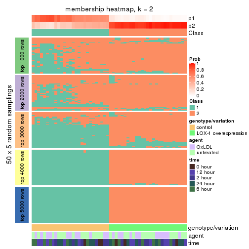</p>

</div>
<div id='tab-CV-mclust-membership-heatmap-2'>
<pre><code class="r">membership_heatmap(res, k = 3)
</code></pre>

<p>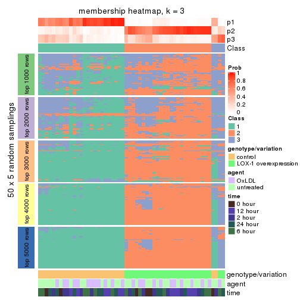</p>

</div>
<div id='tab-CV-mclust-membership-heatmap-3'>
<pre><code class="r">membership_heatmap(res, k = 4)
</code></pre>

<p>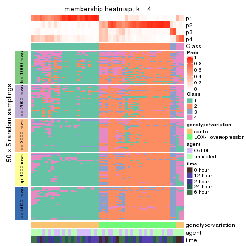</p>

</div>
<div id='tab-CV-mclust-membership-heatmap-4'>
<pre><code class="r">membership_heatmap(res, k = 5)
</code></pre>

<p>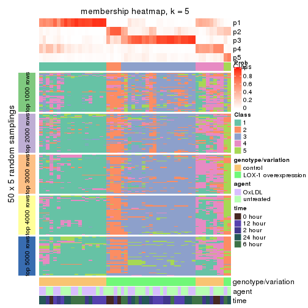</p>

</div>
<div id='tab-CV-mclust-membership-heatmap-5'>
<pre><code class="r">membership_heatmap(res, k = 6)
</code></pre>

<p>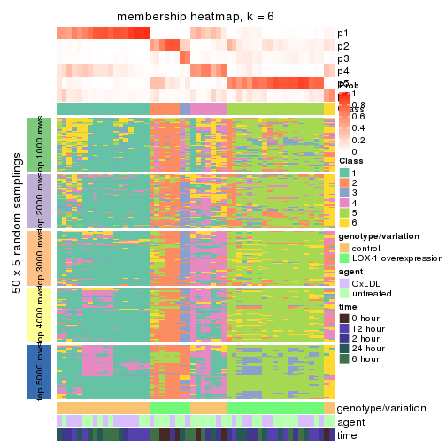</p>

</div>
</div>

As soon as we have had the classes for columns, we can look for signatures
which are significantly different between classes which can be candidate marks
for certain classes. Following are the heatmaps for signatures.


Signature heatmaps where rows are scaled:


<script>
$( function() {
	$( '#tabs-CV-mclust-get-signatures' ).tabs();
} );
</script>
<div id='tabs-CV-mclust-get-signatures'>
<ul>
<li><a href='#tab-CV-mclust-get-signatures-1'>k = 2</a></li>
<li><a href='#tab-CV-mclust-get-signatures-2'>k = 3</a></li>
<li><a href='#tab-CV-mclust-get-signatures-3'>k = 4</a></li>
<li><a href='#tab-CV-mclust-get-signatures-4'>k = 5</a></li>
<li><a href='#tab-CV-mclust-get-signatures-5'>k = 6</a></li>
</ul>
<div id='tab-CV-mclust-get-signatures-1'>
<pre><code class="r">get_signatures(res, k = 2)
</code></pre>

<p>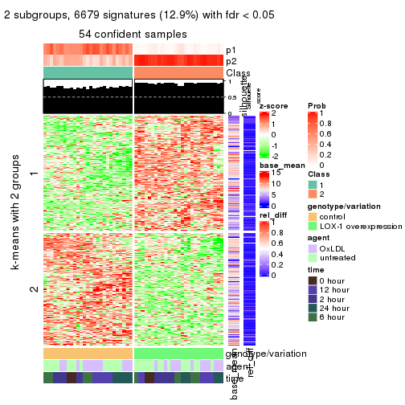</p>

</div>
<div id='tab-CV-mclust-get-signatures-2'>
<pre><code class="r">get_signatures(res, k = 3)
</code></pre>

<p>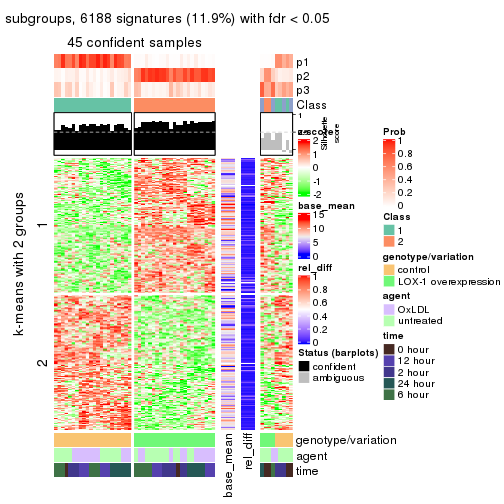</p>

</div>
<div id='tab-CV-mclust-get-signatures-3'>
<pre><code class="r">get_signatures(res, k = 4)
</code></pre>

<p>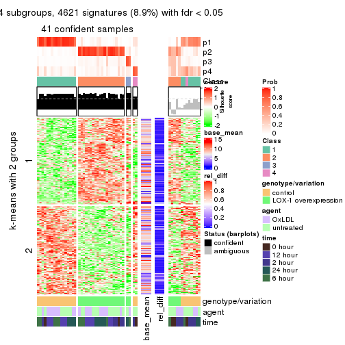</p>

</div>
<div id='tab-CV-mclust-get-signatures-4'>
<pre><code class="r">get_signatures(res, k = 5)
</code></pre>

<p></p>

</div>
<div id='tab-CV-mclust-get-signatures-5'>
<pre><code class="r">get_signatures(res, k = 6)
</code></pre>

<p>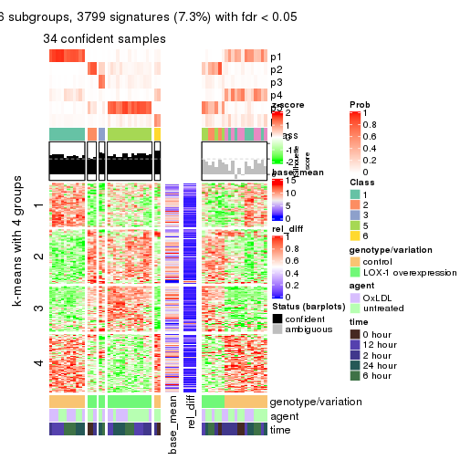</p>

</div>
</div>


Signature heatmaps where rows are not scaled:


<script>
$( function() {
	$( '#tabs-CV-mclust-get-signatures-no-scale' ).tabs();
} );
</script>
<div id='tabs-CV-mclust-get-signatures-no-scale'>
<ul>
<li><a href='#tab-CV-mclust-get-signatures-no-scale-1'>k = 2</a></li>
<li><a href='#tab-CV-mclust-get-signatures-no-scale-2'>k = 3</a></li>
<li><a href='#tab-CV-mclust-get-signatures-no-scale-3'>k = 4</a></li>
<li><a href='#tab-CV-mclust-get-signatures-no-scale-4'>k = 5</a></li>
<li><a href='#tab-CV-mclust-get-signatures-no-scale-5'>k = 6</a></li>
</ul>
<div id='tab-CV-mclust-get-signatures-no-scale-1'>
<pre><code class="r">get_signatures(res, k = 2, scale_rows = FALSE)
</code></pre>

<p>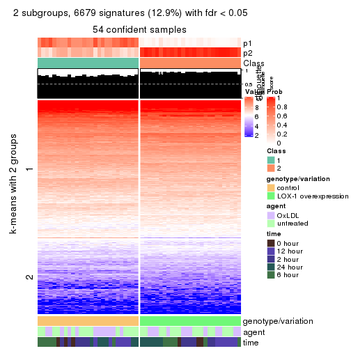</p>

</div>
<div id='tab-CV-mclust-get-signatures-no-scale-2'>
<pre><code class="r">get_signatures(res, k = 3, scale_rows = FALSE)
</code></pre>

<p>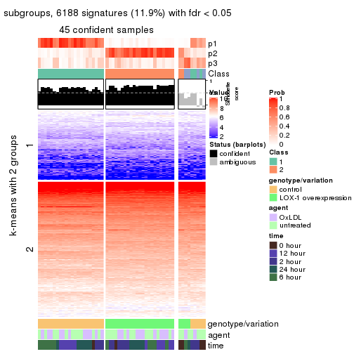</p>

</div>
<div id='tab-CV-mclust-get-signatures-no-scale-3'>
<pre><code class="r">get_signatures(res, k = 4, scale_rows = FALSE)
</code></pre>

<p>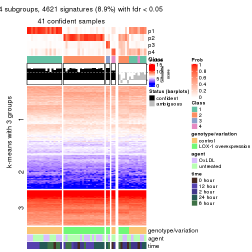</p>

</div>
<div id='tab-CV-mclust-get-signatures-no-scale-4'>
<pre><code class="r">get_signatures(res, k = 5, scale_rows = FALSE)
</code></pre>

<p>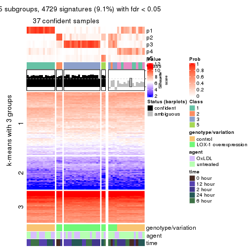</p>

</div>
<div id='tab-CV-mclust-get-signatures-no-scale-5'>
<pre><code class="r">get_signatures(res, k = 6, scale_rows = FALSE)
</code></pre>

<p>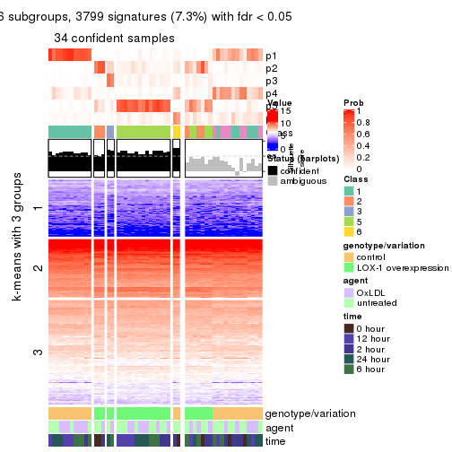</p>

</div>
</div>


Compare the overlap of signatures from different k:

```r
compare_signatures(res)
```

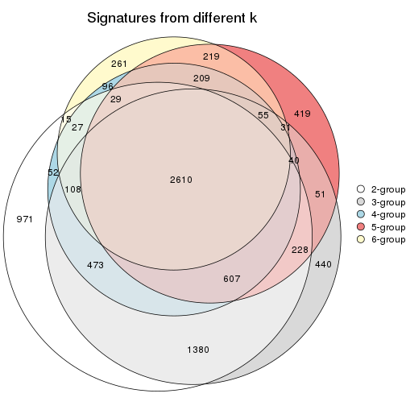

`get_signature()` returns a data frame invisibly. TO get the list of signatures, the function
call should be assigned to a variable explicitly. In following code, if `plot` argument is set
to `FALSE`, no heatmap is plotted while only the differential analysis is performed.

```r
# code only for demonstration
tb = get_signature(res, k = ..., plot = FALSE)
```

An example of the output of `tb` is:

```
#>   which_row         fdr    mean_1    mean_2 scaled_mean_1 scaled_mean_2 km
#> 1        38 0.042760348  8.373488  9.131774    -0.5533452     0.5164555  1
#> 2        40 0.018707592  7.106213  8.469186    -0.6173731     0.5762149  1
#> 3        55 0.019134737 10.221463 11.207825    -0.6159697     0.5749050  1
#> 4        59 0.006059896  5.921854  7.869574    -0.6899429     0.6439467  1
#> 5        60 0.018055526  8.928898 10.211722    -0.6204761     0.5791110  1
#> 6        98 0.009384629 15.714769 14.887706     0.6635654    -0.6193277  2
...
```

The columns in `tb` are:

1. `which_row`: row indices corresponding to the input matrix.
2. `fdr`: FDR for the differential test. 
3. `mean_x`: The mean value in group x.
4. `scaled_mean_x`: The mean value in group x after rows are scaled.
5. `km`: Row groups if k-means clustering is applied to rows.


UMAP plot which shows how samples are separated.


<script>
$( function() {
	$( '#tabs-CV-mclust-dimension-reduction' ).tabs();
} );
</script>
<div id='tabs-CV-mclust-dimension-reduction'>
<ul>
<li><a href='#tab-CV-mclust-dimension-reduction-1'>k = 2</a></li>
<li><a href='#tab-CV-mclust-dimension-reduction-2'>k = 3</a></li>
<li><a href='#tab-CV-mclust-dimension-reduction-3'>k = 4</a></li>
<li><a href='#tab-CV-mclust-dimension-reduction-4'>k = 5</a></li>
<li><a href='#tab-CV-mclust-dimension-reduction-5'>k = 6</a></li>
</ul>
<div id='tab-CV-mclust-dimension-reduction-1'>
<pre><code class="r">dimension_reduction(res, k = 2, method = &quot;UMAP&quot;)
</code></pre>

<p>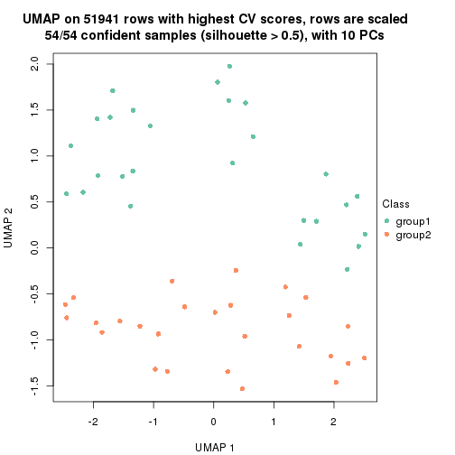</p>

</div>
<div id='tab-CV-mclust-dimension-reduction-2'>
<pre><code class="r">dimension_reduction(res, k = 3, method = &quot;UMAP&quot;)
</code></pre>

<p>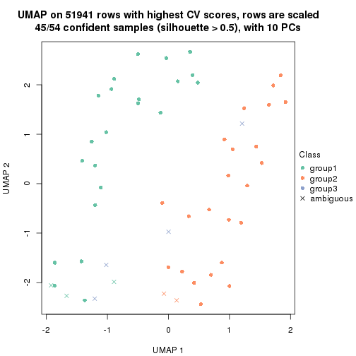</p>

</div>
<div id='tab-CV-mclust-dimension-reduction-3'>
<pre><code class="r">dimension_reduction(res, k = 4, method = &quot;UMAP&quot;)
</code></pre>

<p>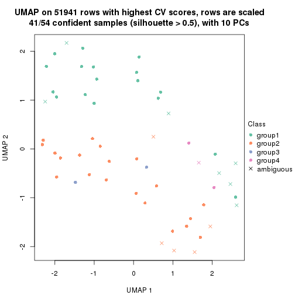</p>

</div>
<div id='tab-CV-mclust-dimension-reduction-4'>
<pre><code class="r">dimension_reduction(res, k = 5, method = &quot;UMAP&quot;)
</code></pre>

<p>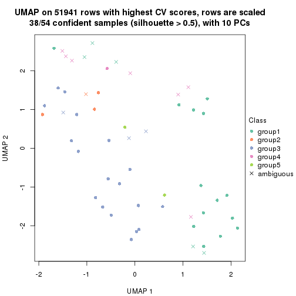</p>

</div>
<div id='tab-CV-mclust-dimension-reduction-5'>
<pre><code class="r">dimension_reduction(res, k = 6, method = &quot;UMAP&quot;)
</code></pre>

<p>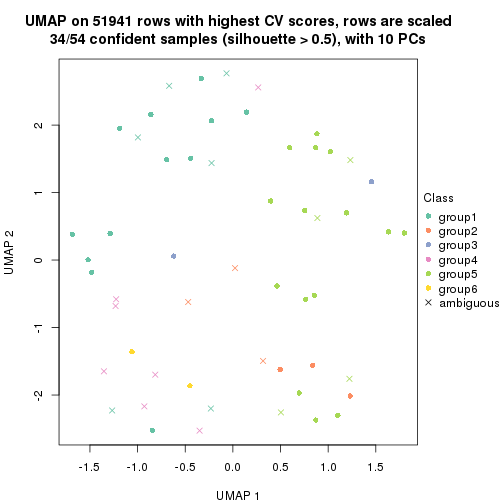</p>

</div>
</div>


Following heatmap shows how subgroups are split when increasing `k`:

```r
collect_classes(res)
```

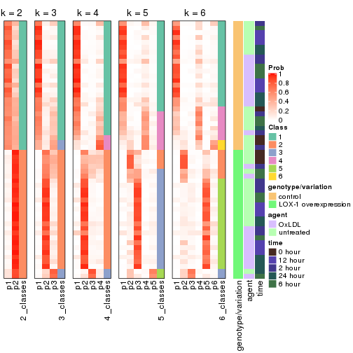


Test correlation between subgroups and known annotations. If the known
annotation is numeric, one-way ANOVA test is applied, and if the known
annotation is discrete, chi-squared contingency table test is applied.

```r
test_to_known_factors(res)
```

```
#>            n genotype/variation(p) agent(p) time(p) k
#> CV:mclust 54              1.48e-12    1.000 1.00000 2
#> CV:mclust 45              1.46e-10    1.000 0.88461 3
#> CV:mclust 41              6.54e-09    0.562 0.41532 4
#> CV:mclust 38              1.12e-07    0.805 0.00386 5
#> CV:mclust 34              7.45e-07    0.622 0.04269 6
```


If matrix rows can be associated to genes, consider to use `functional_enrichment(res,
...)` to perform function enrichment for the signature genes. See [this vignette](http://bioconductor.org/packages/devel/bioc/vignettes/cola/inst/doc/functional_enrichment.html) for more detailed explanations.


 

---------------------------------------------------


### CV:NMF


The object with results only for a single top-value method and a single partition method 
can be extracted as:

```r
res = res_list["CV", "NMF"]
# you can also extract it by
# res = res_list["CV:NMF"]
```

A summary of `res` and all the functions that can be applied to it:

```r
res
```

```
#> A 'ConsensusPartition' object with k = 2, 3, 4, 5, 6.
#>   On a matrix with 51941 rows and 54 columns.
#>   Top rows (1000, 2000, 3000, 4000, 5000) are extracted by 'CV' method.
#>   Subgroups are detected by 'NMF' method.
#>   Performed in total 1250 partitions by row resampling.
#>   Best k for subgroups seems to be 2.
#> 
#> Following methods can be applied to this 'ConsensusPartition' object:
#>  [1] "cola_report"             "collect_classes"         "collect_plots"          
#>  [4] "collect_stats"           "colnames"                "compare_signatures"     
#>  [7] "consensus_heatmap"       "dimension_reduction"     "functional_enrichment"  
#> [10] "get_anno_col"            "get_anno"                "get_classes"            
#> [13] "get_consensus"           "get_matrix"              "get_membership"         
#> [16] "get_param"               "get_signatures"          "get_stats"              
#> [19] "is_best_k"               "is_stable_k"             "membership_heatmap"     
#> [22] "ncol"                    "nrow"                    "plot_ecdf"              
#> [25] "rownames"                "select_partition_number" "show"                   
#> [28] "suggest_best_k"          "test_to_known_factors"
```

`collect_plots()` function collects all the plots made from `res` for all `k` (number of partitions)
into one single page to provide an easy and fast comparison between different `k`.

```r
collect_plots(res)
```

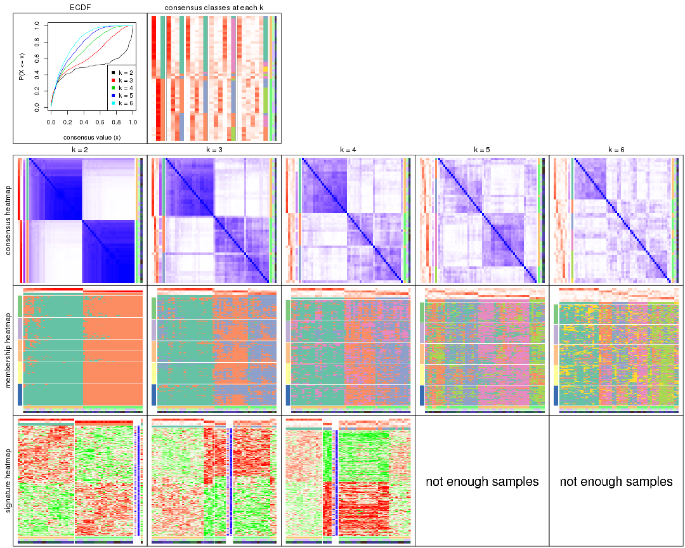

The plots are:

- The first row: a plot of the ECDF (empirical cumulative distribution
  function) curves of the consensus matrix for each `k` and the heatmap of
  predicted classes for each `k`.
- The second row: heatmaps of the consensus matrix for each `k`.
- The third row: heatmaps of the membership matrix for each `k`.
- The fouth row: heatmaps of the signatures for each `k`.

All the plots in panels can be made by individual functions and they are
plotted later in this section.

`select_partition_number()` produces several plots showing different
statistics for choosing "optimized" `k`. There are following statistics:

- ECDF curves of the consensus matrix for each `k`;
- 1-PAC. [The PAC
  score](https://en.wikipedia.org/wiki/Consensus_clustering#Over-interpretation_potential_of_consensus_clustering)
  measures the proportion of the ambiguous subgrouping.
- Mean silhouette score.
- Concordance. The mean probability of fiting the consensus class ids in all
  partitions.
- Area increased. Denote $A_k$ as the area under the ECDF curve for current
  `k`, the area increased is defined as $A_k - A_{k-1}$.
- Rand index. The percent of pairs of samples that are both in a same cluster
  or both are not in a same cluster in the partition of k and k-1.
- Jaccard index. The ratio of pairs of samples are both in a same cluster in
  the partition of k and k-1 and the pairs of samples are both in a same
  cluster in the partition k or k-1.

The detailed explanations of these statistics can be found in [the _cola_
vignette](http://bioconductor.org/packages/devel/bioc/vignettes/cola/inst/doc/cola.html#toc_13).

Generally speaking, lower PAC score, higher mean silhouette score or higher
concordance corresponds to better partition. Rand index and Jaccard index
measure how similar the current partition is compared to partition with `k-1`.
If they are too similar, we won't accept `k` is better than `k-1`.

```r
select_partition_number(res)
```

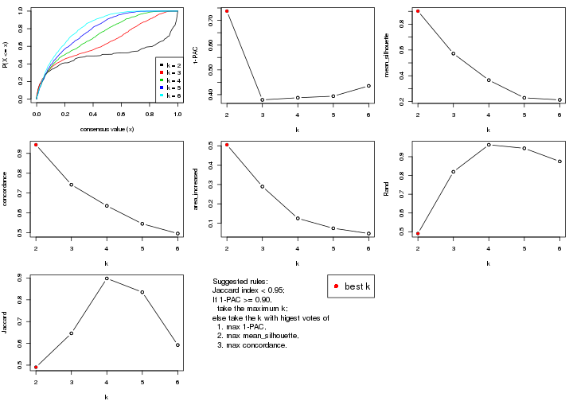

The numeric values for all these statistics can be obtained by `get_stats()`.

```r
get_stats(res)
```

```
#>   k 1-PAC mean_silhouette concordance area_increased  Rand Jaccard
#> 2 2 0.737           0.902       0.943         0.5053 0.491   0.491
#> 3 3 0.379           0.572       0.742         0.2893 0.820   0.646
#> 4 4 0.387           0.366       0.635         0.1249 0.964   0.898
#> 5 5 0.394           0.229       0.545         0.0736 0.945   0.835
#> 6 6 0.435           0.213       0.496         0.0465 0.875   0.592
```

`suggest_best_k()` suggests the best $k$ based on these statistics. The rules are as follows:

- All $k$ with Jaccard index larger than 0.95 are removed because increasing
  $k$ does not provide enough extra information. If all $k$ are removed, it is
  marked as no subgroup is detected.
- For all $k$ with 1-PAC score larger than 0.9, the maximal $k$ is taken as
  the best $k$, and other $k$ are marked as optional $k$.
- If it does not fit the second rule. The $k$ with the maximal vote of the
  highest 1-PAC score, highest mean silhouette, and highest concordance is
  taken as the best $k$.

```r
suggest_best_k(res)
```

```
#> [1] 2
```


Following shows the table of the partitions (You need to click the **show/hide
code output** link to see it). The membership matrix (columns with name `p*`)
is inferred by
[`clue::cl_consensus()`](https://www.rdocumentation.org/link/cl_consensus?package=clue)
function with the `SE` method. Basically the value in the membership matrix
represents the probability to belong to a certain group. The finall class
label for an item is determined with the group with highest probability it
belongs to.

In `get_classes()` function, the entropy is calculated from the membership
matrix and the silhouette score is calculated from the consensus matrix.


<script>
$( function() {
	$( '#tabs-CV-NMF-get-classes' ).tabs();
} );
</script>
<div id='tabs-CV-NMF-get-classes'>
<ul>
<li><a href='#tab-CV-NMF-get-classes-1'>k = 2</a></li>
<li><a href='#tab-CV-NMF-get-classes-2'>k = 3</a></li>
<li><a href='#tab-CV-NMF-get-classes-3'>k = 4</a></li>
<li><a href='#tab-CV-NMF-get-classes-4'>k = 5</a></li>
<li><a href='#tab-CV-NMF-get-classes-5'>k = 6</a></li>
</ul>

<div id='tab-CV-NMF-get-classes-1'>
<p><a id='tab-CV-NMF-get-classes-1-a' style='color:#0366d6' href='#'>show/hide code output</a></p>
<pre><code class="r">cbind(get_classes(res, k = 2), get_membership(res, k = 2))
</code></pre>

<pre><code>#&gt;           class entropy silhouette    p1    p2
#&gt; GSM329068     2  0.0376      0.967 0.004 0.996
#&gt; GSM329074     2  0.0376      0.967 0.004 0.996
#&gt; GSM329100     2  0.0000      0.969 0.000 1.000
#&gt; GSM329062     2  0.0672      0.967 0.008 0.992
#&gt; GSM329079     2  0.4690      0.910 0.100 0.900
#&gt; GSM329090     2  0.0938      0.968 0.012 0.988
#&gt; GSM329066     2  0.0000      0.969 0.000 1.000
#&gt; GSM329086     2  0.2423      0.958 0.040 0.960
#&gt; GSM329099     2  0.4431      0.915 0.092 0.908
#&gt; GSM329071     2  0.0672      0.968 0.008 0.992
#&gt; GSM329078     2  0.3274      0.947 0.060 0.940
#&gt; GSM329081     2  0.0672      0.968 0.008 0.992
#&gt; GSM329096     2  0.0000      0.969 0.000 1.000
#&gt; GSM329102     2  0.3114      0.951 0.056 0.944
#&gt; GSM329104     2  0.0938      0.967 0.012 0.988
#&gt; GSM329067     2  0.0000      0.969 0.000 1.000
#&gt; GSM329072     2  0.2948      0.953 0.052 0.948
#&gt; GSM329075     2  0.6623      0.816 0.172 0.828
#&gt; GSM329058     2  0.0000      0.969 0.000 1.000
#&gt; GSM329073     2  0.3274      0.949 0.060 0.940
#&gt; GSM329107     2  0.0000      0.969 0.000 1.000
#&gt; GSM329057     2  0.0000      0.969 0.000 1.000
#&gt; GSM329085     2  0.2603      0.954 0.044 0.956
#&gt; GSM329089     2  0.0000      0.969 0.000 1.000
#&gt; GSM329076     2  0.3733      0.934 0.072 0.928
#&gt; GSM329094     2  0.1414      0.966 0.020 0.980
#&gt; GSM329105     2  0.0376      0.968 0.004 0.996
#&gt; GSM329056     1  0.1633      0.914 0.976 0.024
#&gt; GSM329069     1  0.6148      0.838 0.848 0.152
#&gt; GSM329077     1  0.9954      0.266 0.540 0.460
#&gt; GSM329070     1  0.0672      0.916 0.992 0.008
#&gt; GSM329082     1  0.2043      0.911 0.968 0.032
#&gt; GSM329092     1  0.8443      0.696 0.728 0.272
#&gt; GSM329083     1  0.0672      0.917 0.992 0.008
#&gt; GSM329101     1  0.0000      0.916 1.000 0.000
#&gt; GSM329106     1  0.0376      0.916 0.996 0.004
#&gt; GSM329087     1  0.0672      0.917 0.992 0.008
#&gt; GSM329091     1  0.0938      0.917 0.988 0.012
#&gt; GSM329093     1  0.0376      0.916 0.996 0.004
#&gt; GSM329080     1  0.0376      0.916 0.996 0.004
#&gt; GSM329084     1  0.7883      0.748 0.764 0.236
#&gt; GSM329088     1  0.0672      0.917 0.992 0.008
#&gt; GSM329059     1  0.9286      0.593 0.656 0.344
#&gt; GSM329097     1  0.2236      0.909 0.964 0.036
#&gt; GSM329098     1  0.5408      0.860 0.876 0.124
#&gt; GSM329055     1  0.0376      0.916 0.996 0.004
#&gt; GSM329103     1  0.0672      0.917 0.992 0.008
#&gt; GSM329108     1  0.0376      0.916 0.996 0.004
#&gt; GSM329061     1  0.0672      0.917 0.992 0.008
#&gt; GSM329064     1  0.2778      0.907 0.952 0.048
#&gt; GSM329065     1  0.0376      0.916 0.996 0.004
#&gt; GSM329060     1  0.1414      0.916 0.980 0.020
#&gt; GSM329063     1  0.5946      0.841 0.856 0.144
#&gt; GSM329095     1  0.8327      0.711 0.736 0.264
</code></pre>

<script>
$('#tab-CV-NMF-get-classes-1-a').parent().next().next().hide();
$('#tab-CV-NMF-get-classes-1-a').click(function(){
  $('#tab-CV-NMF-get-classes-1-a').parent().next().next().toggle();
  return(false);
});
</script>
</div>

<div id='tab-CV-NMF-get-classes-2'>
<p><a id='tab-CV-NMF-get-classes-2-a' style='color:#0366d6' href='#'>show/hide code output</a></p>
<pre><code class="r">cbind(get_classes(res, k = 3), get_membership(res, k = 3))
</code></pre>

<pre><code>#&gt;           class entropy silhouette    p1    p2    p3
#&gt; GSM329068     3   0.565   0.526241 0.000 0.312 0.688
#&gt; GSM329074     3   0.543   0.543699 0.000 0.284 0.716
#&gt; GSM329100     3   0.603   0.496834 0.004 0.336 0.660
#&gt; GSM329062     3   0.621   0.329866 0.000 0.428 0.572
#&gt; GSM329079     3   0.777   0.330437 0.052 0.412 0.536
#&gt; GSM329090     2   0.385   0.533539 0.004 0.860 0.136
#&gt; GSM329066     2   0.497   0.492032 0.000 0.764 0.236
#&gt; GSM329086     3   0.668   0.085348 0.008 0.484 0.508
#&gt; GSM329099     3   0.802   0.436188 0.088 0.308 0.604
#&gt; GSM329071     2   0.536   0.424847 0.000 0.724 0.276
#&gt; GSM329078     2   0.380   0.534030 0.032 0.888 0.080
#&gt; GSM329081     2   0.663   0.008127 0.008 0.552 0.440
#&gt; GSM329096     2   0.412   0.538572 0.000 0.832 0.168
#&gt; GSM329102     2   0.733  -0.000978 0.032 0.544 0.424
#&gt; GSM329104     3   0.498   0.534228 0.004 0.216 0.780
#&gt; GSM329067     3   0.627   0.306086 0.000 0.452 0.548
#&gt; GSM329072     2   0.427   0.512773 0.024 0.860 0.116
#&gt; GSM329075     3   0.698   0.495675 0.064 0.236 0.700
#&gt; GSM329058     3   0.514   0.555336 0.000 0.252 0.748
#&gt; GSM329073     3   0.577   0.510135 0.012 0.260 0.728
#&gt; GSM329107     2   0.536   0.392421 0.000 0.724 0.276
#&gt; GSM329057     2   0.601   0.237153 0.000 0.628 0.372
#&gt; GSM329085     2   0.177   0.520940 0.016 0.960 0.024
#&gt; GSM329089     2   0.599   0.244931 0.000 0.632 0.368
#&gt; GSM329076     2   0.665   0.371188 0.024 0.656 0.320
#&gt; GSM329094     2   0.590   0.432344 0.008 0.700 0.292
#&gt; GSM329105     2   0.525   0.446111 0.000 0.736 0.264
#&gt; GSM329056     1   0.489   0.800905 0.772 0.000 0.228
#&gt; GSM329069     1   0.680   0.650050 0.632 0.024 0.344
#&gt; GSM329077     3   0.820   0.186218 0.316 0.096 0.588
#&gt; GSM329070     1   0.375   0.849915 0.856 0.000 0.144
#&gt; GSM329082     1   0.533   0.821186 0.820 0.120 0.060
#&gt; GSM329092     1   0.892   0.442987 0.544 0.152 0.304
#&gt; GSM329083     1   0.249   0.864881 0.932 0.008 0.060
#&gt; GSM329101     1   0.171   0.862650 0.960 0.008 0.032
#&gt; GSM329106     1   0.353   0.855700 0.884 0.008 0.108
#&gt; GSM329087     1   0.407   0.844240 0.864 0.120 0.016
#&gt; GSM329091     1   0.217   0.865047 0.944 0.008 0.048
#&gt; GSM329093     1   0.357   0.864525 0.900 0.060 0.040
#&gt; GSM329080     1   0.255   0.864474 0.936 0.024 0.040
#&gt; GSM329084     1   0.778   0.668256 0.676 0.168 0.156
#&gt; GSM329088     1   0.268   0.862346 0.924 0.008 0.068
#&gt; GSM329059     1   0.875   0.525355 0.572 0.152 0.276
#&gt; GSM329097     1   0.563   0.822831 0.808 0.116 0.076
#&gt; GSM329098     1   0.592   0.765059 0.724 0.016 0.260
#&gt; GSM329055     1   0.178   0.860295 0.960 0.020 0.020
#&gt; GSM329103     1   0.404   0.859194 0.880 0.080 0.040
#&gt; GSM329108     1   0.243   0.864739 0.940 0.024 0.036
#&gt; GSM329061     1   0.328   0.862920 0.908 0.068 0.024
#&gt; GSM329064     1   0.426   0.859187 0.868 0.036 0.096
#&gt; GSM329065     1   0.321   0.863349 0.912 0.060 0.028
#&gt; GSM329060     1   0.371   0.859317 0.892 0.076 0.032
#&gt; GSM329063     1   0.679   0.760292 0.740 0.160 0.100
#&gt; GSM329095     2   0.825  -0.147970 0.428 0.496 0.076
</code></pre>

<script>
$('#tab-CV-NMF-get-classes-2-a').parent().next().next().hide();
$('#tab-CV-NMF-get-classes-2-a').click(function(){
  $('#tab-CV-NMF-get-classes-2-a').parent().next().next().toggle();
  return(false);
});
</script>
</div>

<div id='tab-CV-NMF-get-classes-3'>
<p><a id='tab-CV-NMF-get-classes-3-a' style='color:#0366d6' href='#'>show/hide code output</a></p>
<pre><code class="r">cbind(get_classes(res, k = 4), get_membership(res, k = 4))
</code></pre>

<pre><code>#&gt;           class entropy silhouette    p1    p2    p3    p4
#&gt; GSM329068     2   0.483     0.4774 0.000 0.784 0.124 0.092
#&gt; GSM329074     2   0.508     0.4679 0.004 0.776 0.108 0.112
#&gt; GSM329100     2   0.646     0.4242 0.004 0.660 0.160 0.176
#&gt; GSM329062     2   0.647     0.3088 0.000 0.612 0.280 0.108
#&gt; GSM329079     2   0.858     0.2940 0.060 0.476 0.280 0.184
#&gt; GSM329090     3   0.517     0.5109 0.012 0.136 0.776 0.076
#&gt; GSM329066     3   0.628     0.4473 0.008 0.252 0.656 0.084
#&gt; GSM329086     2   0.813     0.1503 0.012 0.428 0.304 0.256
#&gt; GSM329099     2   0.830     0.4105 0.076 0.540 0.144 0.240
#&gt; GSM329071     3   0.553     0.4530 0.000 0.228 0.704 0.068
#&gt; GSM329078     3   0.508     0.5159 0.044 0.080 0.804 0.072
#&gt; GSM329081     3   0.708     0.0720 0.008 0.420 0.476 0.096
#&gt; GSM329096     3   0.449     0.5141 0.000 0.140 0.800 0.060
#&gt; GSM329102     2   0.850     0.1593 0.024 0.372 0.280 0.324
#&gt; GSM329104     2   0.715     0.4261 0.008 0.532 0.116 0.344
#&gt; GSM329067     2   0.639     0.2638 0.000 0.604 0.304 0.092
#&gt; GSM329072     3   0.609     0.4564 0.024 0.080 0.712 0.184
#&gt; GSM329075     2   0.728     0.4401 0.024 0.608 0.152 0.216
#&gt; GSM329058     2   0.591     0.4692 0.000 0.700 0.152 0.148
#&gt; GSM329073     2   0.772     0.4065 0.028 0.548 0.152 0.272
#&gt; GSM329107     3   0.633     0.3849 0.000 0.264 0.632 0.104
#&gt; GSM329057     3   0.648     0.2542 0.000 0.368 0.552 0.080
#&gt; GSM329085     3   0.360     0.5143 0.024 0.012 0.864 0.100
#&gt; GSM329089     3   0.600     0.3838 0.004 0.316 0.628 0.052
#&gt; GSM329076     3   0.830     0.2538 0.032 0.252 0.480 0.236
#&gt; GSM329094     3   0.759     0.2515 0.004 0.268 0.508 0.220
#&gt; GSM329105     3   0.734     0.2116 0.004 0.304 0.528 0.164
#&gt; GSM329056     1   0.599     0.4570 0.692 0.148 0.000 0.160
#&gt; GSM329069     1   0.795    -0.0547 0.520 0.208 0.024 0.248
#&gt; GSM329077     2   0.764    -0.2813 0.120 0.496 0.024 0.360
#&gt; GSM329070     1   0.519     0.5401 0.752 0.084 0.000 0.164
#&gt; GSM329082     1   0.722     0.0531 0.516 0.024 0.080 0.380
#&gt; GSM329092     4   0.883     0.0000 0.300 0.284 0.044 0.372
#&gt; GSM329083     1   0.501     0.5547 0.764 0.056 0.004 0.176
#&gt; GSM329101     1   0.164     0.6288 0.940 0.000 0.000 0.060
#&gt; GSM329106     1   0.380     0.6066 0.836 0.032 0.000 0.132
#&gt; GSM329087     1   0.501     0.5472 0.764 0.000 0.160 0.076
#&gt; GSM329091     1   0.338     0.6209 0.868 0.016 0.008 0.108
#&gt; GSM329093     1   0.491     0.5959 0.776 0.000 0.084 0.140
#&gt; GSM329080     1   0.280     0.6284 0.900 0.008 0.012 0.080
#&gt; GSM329084     1   0.901    -0.1964 0.456 0.132 0.132 0.280
#&gt; GSM329088     1   0.347     0.6242 0.876 0.020 0.020 0.084
#&gt; GSM329059     1   0.892    -0.0320 0.480 0.196 0.100 0.224
#&gt; GSM329097     1   0.644     0.5094 0.700 0.032 0.108 0.160
#&gt; GSM329098     1   0.765     0.0292 0.520 0.228 0.008 0.244
#&gt; GSM329055     1   0.247     0.6326 0.908 0.000 0.012 0.080
#&gt; GSM329103     1   0.604     0.5151 0.696 0.008 0.096 0.200
#&gt; GSM329108     1   0.384     0.6159 0.832 0.004 0.020 0.144
#&gt; GSM329061     1   0.436     0.6086 0.808 0.000 0.056 0.136
#&gt; GSM329064     1   0.624     0.5065 0.700 0.076 0.028 0.196
#&gt; GSM329065     1   0.387     0.6254 0.844 0.000 0.060 0.096
#&gt; GSM329060     1   0.581     0.5450 0.748 0.028 0.128 0.096
#&gt; GSM329063     1   0.793     0.1433 0.544 0.048 0.132 0.276
#&gt; GSM329095     3   0.857    -0.1712 0.320 0.048 0.440 0.192
</code></pre>

<script>
$('#tab-CV-NMF-get-classes-3-a').parent().next().next().hide();
$('#tab-CV-NMF-get-classes-3-a').click(function(){
  $('#tab-CV-NMF-get-classes-3-a').parent().next().next().toggle();
  return(false);
});
</script>
</div>

<div id='tab-CV-NMF-get-classes-4'>
<p><a id='tab-CV-NMF-get-classes-4-a' style='color:#0366d6' href='#'>show/hide code output</a></p>
<pre><code class="r">cbind(get_classes(res, k = 5), get_membership(res, k = 5))
</code></pre>

<pre><code>#&gt;           class entropy silhouette    p1    p2    p3    p4    p5
#&gt; GSM329068     2   0.637    0.15047 0.052 0.588 0.080 0.000 0.280
#&gt; GSM329074     2   0.626    0.19810 0.080 0.628 0.064 0.000 0.228
#&gt; GSM329100     2   0.661    0.24548 0.088 0.624 0.128 0.000 0.160
#&gt; GSM329062     2   0.592    0.28419 0.032 0.664 0.172 0.000 0.132
#&gt; GSM329079     5   0.841    0.30427 0.068 0.216 0.180 0.064 0.472
#&gt; GSM329090     3   0.598    0.40030 0.064 0.080 0.704 0.016 0.136
#&gt; GSM329066     3   0.740    0.28672 0.068 0.184 0.520 0.004 0.224
#&gt; GSM329086     2   0.864   -0.05172 0.116 0.312 0.260 0.016 0.296
#&gt; GSM329099     5   0.831    0.34480 0.124 0.172 0.136 0.056 0.512
#&gt; GSM329071     3   0.513    0.37493 0.040 0.228 0.700 0.000 0.032
#&gt; GSM329078     3   0.621    0.43699 0.096 0.072 0.700 0.028 0.104
#&gt; GSM329081     3   0.829   -0.01110 0.092 0.300 0.376 0.012 0.220
#&gt; GSM329096     3   0.473    0.46486 0.036 0.124 0.772 0.000 0.068
#&gt; GSM329102     5   0.823    0.16710 0.168 0.144 0.176 0.024 0.488
#&gt; GSM329104     5   0.721    0.21038 0.144 0.244 0.068 0.004 0.540
#&gt; GSM329067     2   0.624    0.28944 0.056 0.628 0.228 0.000 0.088
#&gt; GSM329072     3   0.801    0.30391 0.224 0.060 0.496 0.040 0.180
#&gt; GSM329075     5   0.674    0.34644 0.076 0.252 0.048 0.024 0.600
#&gt; GSM329058     5   0.728    0.09024 0.064 0.344 0.136 0.000 0.456
#&gt; GSM329073     5   0.478    0.40423 0.052 0.108 0.048 0.008 0.784
#&gt; GSM329107     3   0.710    0.25791 0.044 0.256 0.512 0.000 0.188
#&gt; GSM329057     3   0.705    0.28098 0.052 0.236 0.536 0.000 0.176
#&gt; GSM329085     3   0.449    0.45136 0.124 0.004 0.788 0.020 0.064
#&gt; GSM329089     3   0.595    0.30796 0.036 0.292 0.608 0.000 0.064
#&gt; GSM329076     3   0.843    0.14557 0.104 0.164 0.432 0.032 0.268
#&gt; GSM329094     3   0.801    0.24363 0.112 0.236 0.420 0.000 0.232
#&gt; GSM329105     3   0.743    0.17783 0.124 0.072 0.456 0.004 0.344
#&gt; GSM329056     4   0.706    0.36029 0.216 0.120 0.008 0.580 0.076
#&gt; GSM329069     4   0.819    0.11769 0.220 0.336 0.024 0.364 0.056
#&gt; GSM329077     2   0.735    0.21490 0.328 0.484 0.008 0.112 0.068
#&gt; GSM329070     4   0.565    0.40222 0.228 0.036 0.000 0.668 0.068
#&gt; GSM329082     1   0.837    0.00000 0.380 0.068 0.068 0.372 0.112
#&gt; GSM329092     2   0.813   -0.08564 0.292 0.436 0.044 0.184 0.044
#&gt; GSM329083     4   0.598    0.29283 0.292 0.040 0.008 0.616 0.044
#&gt; GSM329101     4   0.291    0.41302 0.080 0.012 0.000 0.880 0.028
#&gt; GSM329106     4   0.490    0.42366 0.184 0.016 0.000 0.732 0.068
#&gt; GSM329087     4   0.671    0.11102 0.188 0.004 0.144 0.608 0.056
#&gt; GSM329091     4   0.384    0.38307 0.148 0.016 0.004 0.812 0.020
#&gt; GSM329093     4   0.638    0.13045 0.276 0.012 0.044 0.604 0.064
#&gt; GSM329080     4   0.344    0.44455 0.116 0.004 0.008 0.844 0.028
#&gt; GSM329084     4   0.903   -0.00496 0.316 0.100 0.092 0.356 0.136
#&gt; GSM329088     4   0.470    0.44247 0.164 0.020 0.024 0.768 0.024
#&gt; GSM329059     4   0.900    0.17326 0.260 0.212 0.096 0.368 0.064
#&gt; GSM329097     4   0.726    0.32170 0.168 0.136 0.084 0.592 0.020
#&gt; GSM329098     4   0.832    0.15198 0.260 0.188 0.016 0.424 0.112
#&gt; GSM329055     4   0.443    0.33840 0.152 0.004 0.004 0.772 0.068
#&gt; GSM329103     4   0.704   -0.18274 0.292 0.020 0.048 0.548 0.092
#&gt; GSM329108     4   0.533    0.24524 0.196 0.012 0.004 0.700 0.088
#&gt; GSM329061     4   0.570    0.25001 0.224 0.008 0.084 0.668 0.016
#&gt; GSM329064     4   0.721    0.17768 0.228 0.080 0.020 0.576 0.096
#&gt; GSM329065     4   0.496    0.26640 0.164 0.000 0.056 0.744 0.036
#&gt; GSM329060     4   0.743    0.26601 0.204 0.076 0.148 0.556 0.016
#&gt; GSM329063     4   0.842   -0.20825 0.316 0.056 0.108 0.424 0.096
#&gt; GSM329095     3   0.873   -0.17912 0.212 0.036 0.388 0.256 0.108
</code></pre>

<script>
$('#tab-CV-NMF-get-classes-4-a').parent().next().next().hide();
$('#tab-CV-NMF-get-classes-4-a').click(function(){
  $('#tab-CV-NMF-get-classes-4-a').parent().next().next().toggle();
  return(false);
});
</script>
</div>

<div id='tab-CV-NMF-get-classes-5'>
<p><a id='tab-CV-NMF-get-classes-5-a' style='color:#0366d6' href='#'>show/hide code output</a></p>
<pre><code class="r">cbind(get_classes(res, k = 6), get_membership(res, k = 6))
</code></pre>

<pre><code>#&gt;           class entropy silhouette    p1    p2    p3    p4    p5    p6
#&gt; GSM329068     4   0.736    0.06569 0.000 0.272 0.124 0.468 0.100 0.036
#&gt; GSM329074     4   0.660    0.04851 0.000 0.292 0.088 0.532 0.052 0.036
#&gt; GSM329100     4   0.731    0.06400 0.000 0.244 0.048 0.496 0.128 0.084
#&gt; GSM329062     4   0.665    0.15662 0.000 0.204 0.044 0.564 0.152 0.036
#&gt; GSM329079     2   0.717    0.35602 0.084 0.608 0.076 0.092 0.100 0.040
#&gt; GSM329090     5   0.588    0.40477 0.012 0.168 0.040 0.048 0.676 0.056
#&gt; GSM329066     5   0.775    0.14773 0.012 0.340 0.108 0.096 0.400 0.044
#&gt; GSM329086     3   0.872    0.06872 0.008 0.168 0.352 0.180 0.192 0.100
#&gt; GSM329099     2   0.655    0.38446 0.028 0.656 0.084 0.072 0.100 0.060
#&gt; GSM329071     5   0.531    0.40521 0.000 0.056 0.044 0.116 0.724 0.060
#&gt; GSM329078     5   0.588    0.37607 0.036 0.076 0.092 0.036 0.708 0.052
#&gt; GSM329081     5   0.746    0.03397 0.016 0.364 0.052 0.120 0.408 0.040
#&gt; GSM329096     5   0.565    0.33373 0.000 0.044 0.200 0.072 0.660 0.024
#&gt; GSM329102     3   0.617    0.12543 0.028 0.228 0.628 0.044 0.040 0.032
#&gt; GSM329104     2   0.798    0.20415 0.000 0.396 0.156 0.116 0.060 0.272
#&gt; GSM329067     4   0.794    0.12501 0.000 0.188 0.104 0.452 0.168 0.088
#&gt; GSM329072     5   0.762    0.06066 0.036 0.088 0.352 0.032 0.420 0.072
#&gt; GSM329075     2   0.592    0.37861 0.032 0.672 0.096 0.152 0.012 0.036
#&gt; GSM329058     2   0.743    0.24639 0.000 0.500 0.104 0.180 0.172 0.044
#&gt; GSM329073     2   0.578    0.27647 0.004 0.548 0.356 0.032 0.020 0.040
#&gt; GSM329107     5   0.799    0.18412 0.004 0.204 0.140 0.204 0.412 0.036
#&gt; GSM329057     5   0.739    0.28900 0.000 0.140 0.172 0.176 0.488 0.024
#&gt; GSM329085     5   0.443    0.35152 0.016 0.016 0.184 0.004 0.748 0.032
#&gt; GSM329089     5   0.625    0.36102 0.000 0.052 0.068 0.196 0.624 0.060
#&gt; GSM329076     3   0.886    0.13456 0.036 0.212 0.368 0.112 0.184 0.088
#&gt; GSM329094     3   0.699    0.15811 0.004 0.096 0.512 0.152 0.228 0.008
#&gt; GSM329105     3   0.680    0.00599 0.004 0.196 0.456 0.020 0.304 0.020
#&gt; GSM329056     1   0.743    0.10915 0.448 0.124 0.020 0.152 0.000 0.256
#&gt; GSM329069     4   0.767   -0.27394 0.284 0.044 0.028 0.340 0.012 0.292
#&gt; GSM329077     4   0.699    0.10576 0.052 0.092 0.072 0.564 0.008 0.212
#&gt; GSM329070     1   0.607    0.29701 0.532 0.072 0.016 0.040 0.000 0.340
#&gt; GSM329082     3   0.869   -0.08822 0.288 0.028 0.288 0.152 0.040 0.204
#&gt; GSM329092     4   0.779    0.04201 0.140 0.024 0.084 0.476 0.040 0.236
#&gt; GSM329083     1   0.725    0.09784 0.444 0.064 0.052 0.080 0.008 0.352
#&gt; GSM329101     1   0.347    0.51141 0.840 0.028 0.024 0.008 0.004 0.096
#&gt; GSM329106     1   0.515    0.39449 0.636 0.048 0.012 0.020 0.000 0.284
#&gt; GSM329087     1   0.688    0.38015 0.584 0.036 0.120 0.004 0.152 0.104
#&gt; GSM329091     1   0.534    0.44809 0.716 0.008 0.072 0.060 0.012 0.132
#&gt; GSM329093     1   0.746    0.40292 0.548 0.092 0.080 0.016 0.088 0.176
#&gt; GSM329080     1   0.476    0.42824 0.744 0.024 0.016 0.020 0.028 0.168
#&gt; GSM329084     6   0.959    0.30948 0.208 0.132 0.200 0.156 0.060 0.244
#&gt; GSM329088     1   0.557    0.40388 0.688 0.060 0.020 0.016 0.036 0.180
#&gt; GSM329059     6   0.896    0.28510 0.240 0.084 0.060 0.272 0.064 0.280
#&gt; GSM329097     1   0.769    0.11161 0.432 0.020 0.004 0.164 0.140 0.240
#&gt; GSM329098     4   0.890   -0.37716 0.236 0.216 0.076 0.248 0.012 0.212
#&gt; GSM329055     1   0.475    0.49944 0.752 0.060 0.072 0.000 0.008 0.108
#&gt; GSM329103     1   0.750    0.37976 0.524 0.060 0.156 0.032 0.036 0.192
#&gt; GSM329108     1   0.628    0.44410 0.628 0.040 0.072 0.032 0.020 0.208
#&gt; GSM329061     1   0.602    0.45185 0.656 0.016 0.084 0.012 0.064 0.168
#&gt; GSM329064     1   0.830    0.24443 0.460 0.088 0.132 0.076 0.040 0.204
#&gt; GSM329065     1   0.452    0.50478 0.780 0.004 0.076 0.012 0.044 0.084
#&gt; GSM329060     1   0.830   -0.03590 0.404 0.028 0.044 0.104 0.172 0.248
#&gt; GSM329063     3   0.815   -0.25460 0.324 0.032 0.364 0.088 0.032 0.160
#&gt; GSM329095     5   0.888   -0.06017 0.240 0.044 0.172 0.048 0.332 0.164
</code></pre>

<script>
$('#tab-CV-NMF-get-classes-5-a').parent().next().next().hide();
$('#tab-CV-NMF-get-classes-5-a').click(function(){
  $('#tab-CV-NMF-get-classes-5-a').parent().next().next().toggle();
  return(false);
});
</script>
</div>
</div>

Heatmaps for the consensus matrix. It visualizes the probability of two
samples to be in a same group.


<script>
$( function() {
	$( '#tabs-CV-NMF-consensus-heatmap' ).tabs();
} );
</script>
<div id='tabs-CV-NMF-consensus-heatmap'>
<ul>
<li><a href='#tab-CV-NMF-consensus-heatmap-1'>k = 2</a></li>
<li><a href='#tab-CV-NMF-consensus-heatmap-2'>k = 3</a></li>
<li><a href='#tab-CV-NMF-consensus-heatmap-3'>k = 4</a></li>
<li><a href='#tab-CV-NMF-consensus-heatmap-4'>k = 5</a></li>
<li><a href='#tab-CV-NMF-consensus-heatmap-5'>k = 6</a></li>
</ul>
<div id='tab-CV-NMF-consensus-heatmap-1'>
<pre><code class="r">consensus_heatmap(res, k = 2)
</code></pre>

<p>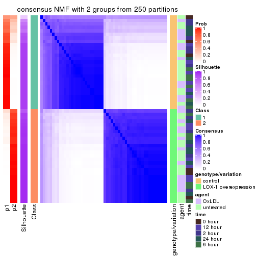</p>

</div>
<div id='tab-CV-NMF-consensus-heatmap-2'>
<pre><code class="r">consensus_heatmap(res, k = 3)
</code></pre>

<p>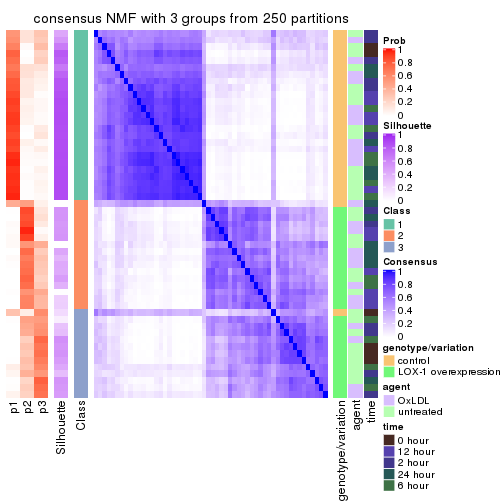</p>

</div>
<div id='tab-CV-NMF-consensus-heatmap-3'>
<pre><code class="r">consensus_heatmap(res, k = 4)
</code></pre>

<p>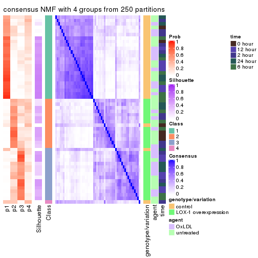</p>

</div>
<div id='tab-CV-NMF-consensus-heatmap-4'>
<pre><code class="r">consensus_heatmap(res, k = 5)
</code></pre>

<p>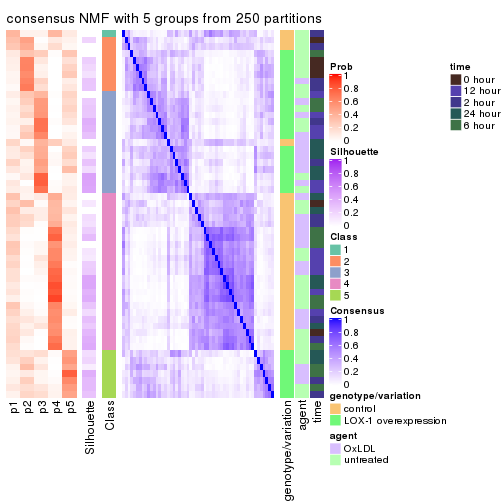</p>

</div>
<div id='tab-CV-NMF-consensus-heatmap-5'>
<pre><code class="r">consensus_heatmap(res, k = 6)
</code></pre>

<p>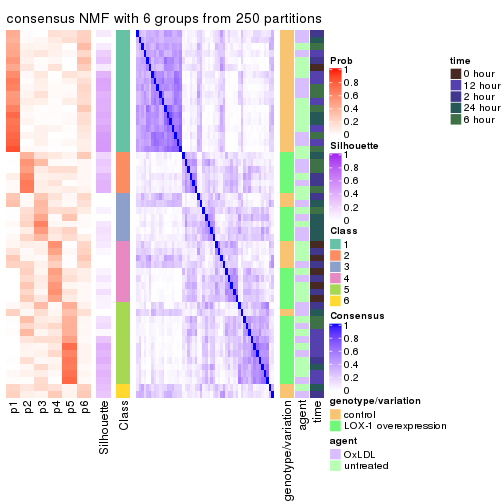</p>

</div>
</div>

Heatmaps for the membership of samples in all partitions to see how consistent they are:


<script>
$( function() {
	$( '#tabs-CV-NMF-membership-heatmap' ).tabs();
} );
</script>
<div id='tabs-CV-NMF-membership-heatmap'>
<ul>
<li><a href='#tab-CV-NMF-membership-heatmap-1'>k = 2</a></li>
<li><a href='#tab-CV-NMF-membership-heatmap-2'>k = 3</a></li>
<li><a href='#tab-CV-NMF-membership-heatmap-3'>k = 4</a></li>
<li><a href='#tab-CV-NMF-membership-heatmap-4'>k = 5</a></li>
<li><a href='#tab-CV-NMF-membership-heatmap-5'>k = 6</a></li>
</ul>
<div id='tab-CV-NMF-membership-heatmap-1'>
<pre><code class="r">membership_heatmap(res, k = 2)
</code></pre>

<p>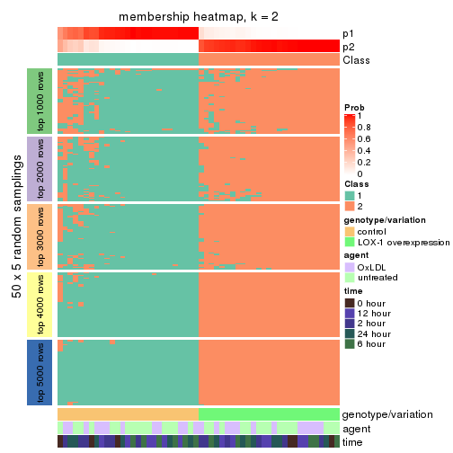</p>

</div>
<div id='tab-CV-NMF-membership-heatmap-2'>
<pre><code class="r">membership_heatmap(res, k = 3)
</code></pre>

<p>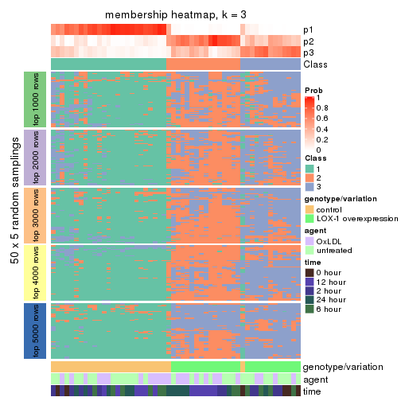</p>

</div>
<div id='tab-CV-NMF-membership-heatmap-3'>
<pre><code class="r">membership_heatmap(res, k = 4)
</code></pre>

<p>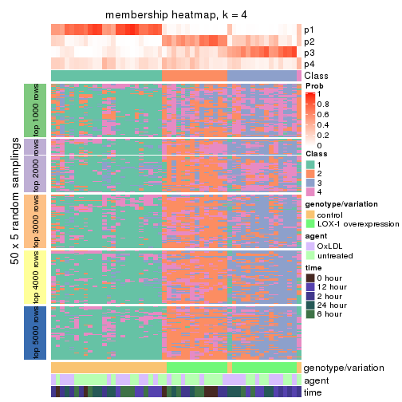</p>

</div>
<div id='tab-CV-NMF-membership-heatmap-4'>
<pre><code class="r">membership_heatmap(res, k = 5)
</code></pre>

<p>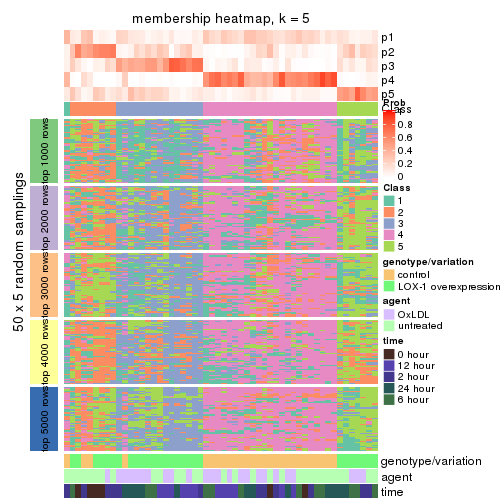</p>

</div>
<div id='tab-CV-NMF-membership-heatmap-5'>
<pre><code class="r">membership_heatmap(res, k = 6)
</code></pre>

<p>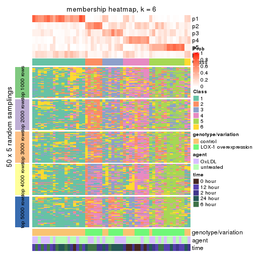</p>

</div>
</div>

As soon as we have had the classes for columns, we can look for signatures
which are significantly different between classes which can be candidate marks
for certain classes. Following are the heatmaps for signatures.


Signature heatmaps where rows are scaled:


<script>
$( function() {
	$( '#tabs-CV-NMF-get-signatures' ).tabs();
} );
</script>
<div id='tabs-CV-NMF-get-signatures'>
<ul>
<li><a href='#tab-CV-NMF-get-signatures-1'>k = 2</a></li>
<li><a href='#tab-CV-NMF-get-signatures-2'>k = 3</a></li>
<li><a href='#tab-CV-NMF-get-signatures-3'>k = 4</a></li>
<li><a href='#tab-CV-NMF-get-signatures-4'>k = 5</a></li>
<li><a href='#tab-CV-NMF-get-signatures-5'>k = 6</a></li>
</ul>
<div id='tab-CV-NMF-get-signatures-1'>
<pre><code class="r">get_signatures(res, k = 2)
</code></pre>

<p>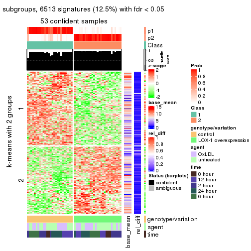</p>

</div>
<div id='tab-CV-NMF-get-signatures-2'>
<pre><code class="r">get_signatures(res, k = 3)
</code></pre>

<p>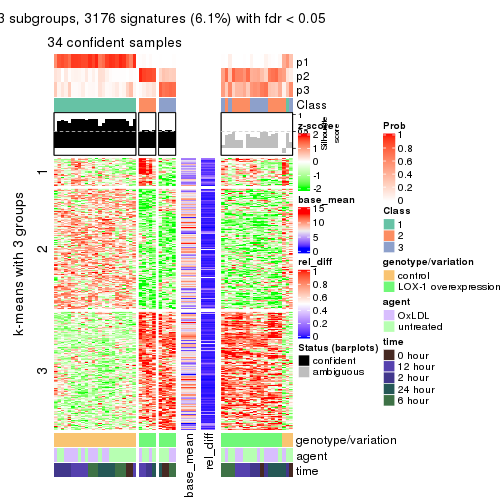</p>

</div>
<div id='tab-CV-NMF-get-signatures-3'>
<pre><code class="r">get_signatures(res, k = 4)
</code></pre>

<p>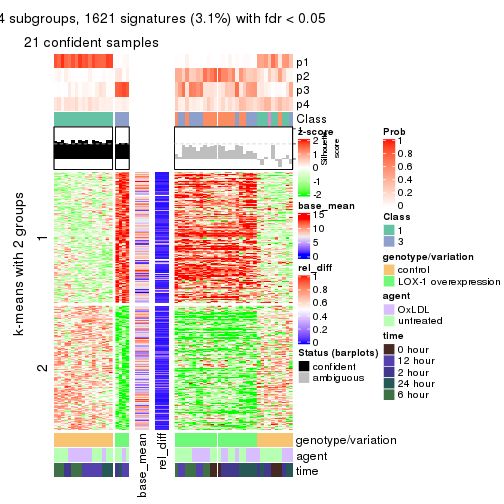</p>

</div>
<div id='tab-CV-NMF-get-signatures-4'>
<pre><code class="r">get_signatures(res, k = 5)
</code></pre>

<p></p>

</div>
<div id='tab-CV-NMF-get-signatures-5'>
<pre><code class="r">get_signatures(res, k = 6)
</code></pre>

<p></p>

</div>
</div>


Signature heatmaps where rows are not scaled:


<script>
$( function() {
	$( '#tabs-CV-NMF-get-signatures-no-scale' ).tabs();
} );
</script>
<div id='tabs-CV-NMF-get-signatures-no-scale'>
<ul>
<li><a href='#tab-CV-NMF-get-signatures-no-scale-1'>k = 2</a></li>
<li><a href='#tab-CV-NMF-get-signatures-no-scale-2'>k = 3</a></li>
<li><a href='#tab-CV-NMF-get-signatures-no-scale-3'>k = 4</a></li>
<li><a href='#tab-CV-NMF-get-signatures-no-scale-4'>k = 5</a></li>
<li><a href='#tab-CV-NMF-get-signatures-no-scale-5'>k = 6</a></li>
</ul>
<div id='tab-CV-NMF-get-signatures-no-scale-1'>
<pre><code class="r">get_signatures(res, k = 2, scale_rows = FALSE)
</code></pre>

<p>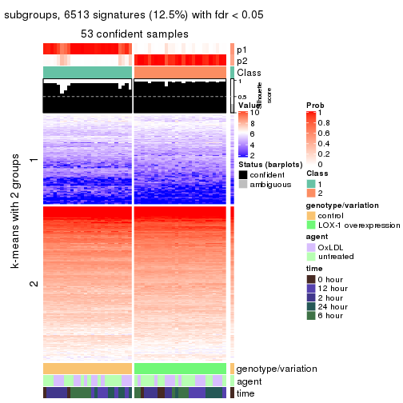</p>

</div>
<div id='tab-CV-NMF-get-signatures-no-scale-2'>
<pre><code class="r">get_signatures(res, k = 3, scale_rows = FALSE)
</code></pre>

<p>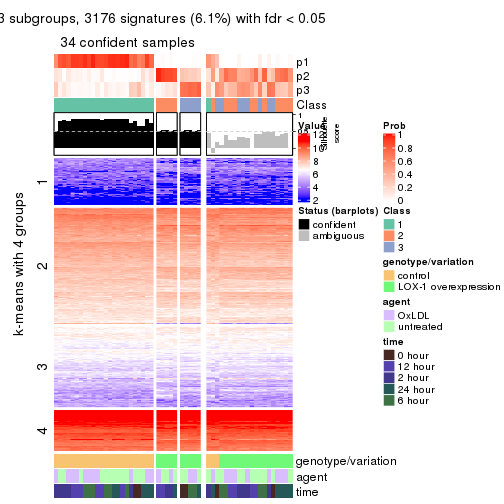</p>

</div>
<div id='tab-CV-NMF-get-signatures-no-scale-3'>
<pre><code class="r">get_signatures(res, k = 4, scale_rows = FALSE)
</code></pre>

<p>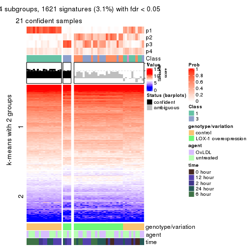</p>

</div>
<div id='tab-CV-NMF-get-signatures-no-scale-4'>
<pre><code class="r">get_signatures(res, k = 5, scale_rows = FALSE)
</code></pre>

<p></p>

</div>
<div id='tab-CV-NMF-get-signatures-no-scale-5'>
<pre><code class="r">get_signatures(res, k = 6, scale_rows = FALSE)
</code></pre>

<p></p>

</div>
</div>


Compare the overlap of signatures from different k:

```r
compare_signatures(res)
```

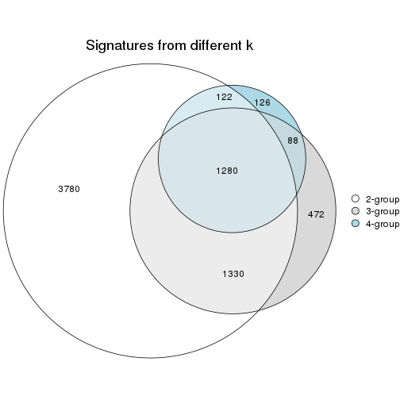

`get_signature()` returns a data frame invisibly. TO get the list of signatures, the function
call should be assigned to a variable explicitly. In following code, if `plot` argument is set
to `FALSE`, no heatmap is plotted while only the differential analysis is performed.

```r
# code only for demonstration
tb = get_signature(res, k = ..., plot = FALSE)
```

An example of the output of `tb` is:

```
#>   which_row         fdr    mean_1    mean_2 scaled_mean_1 scaled_mean_2 km
#> 1        38 0.042760348  8.373488  9.131774    -0.5533452     0.5164555  1
#> 2        40 0.018707592  7.106213  8.469186    -0.6173731     0.5762149  1
#> 3        55 0.019134737 10.221463 11.207825    -0.6159697     0.5749050  1
#> 4        59 0.006059896  5.921854  7.869574    -0.6899429     0.6439467  1
#> 5        60 0.018055526  8.928898 10.211722    -0.6204761     0.5791110  1
#> 6        98 0.009384629 15.714769 14.887706     0.6635654    -0.6193277  2
...
```

The columns in `tb` are:

1. `which_row`: row indices corresponding to the input matrix.
2. `fdr`: FDR for the differential test. 
3. `mean_x`: The mean value in group x.
4. `scaled_mean_x`: The mean value in group x after rows are scaled.
5. `km`: Row groups if k-means clustering is applied to rows.


UMAP plot which shows how samples are separated.


<script>
$( function() {
	$( '#tabs-CV-NMF-dimension-reduction' ).tabs();
} );
</script>
<div id='tabs-CV-NMF-dimension-reduction'>
<ul>
<li><a href='#tab-CV-NMF-dimension-reduction-1'>k = 2</a></li>
<li><a href='#tab-CV-NMF-dimension-reduction-2'>k = 3</a></li>
<li><a href='#tab-CV-NMF-dimension-reduction-3'>k = 4</a></li>
<li><a href='#tab-CV-NMF-dimension-reduction-4'>k = 5</a></li>
<li><a href='#tab-CV-NMF-dimension-reduction-5'>k = 6</a></li>
</ul>
<div id='tab-CV-NMF-dimension-reduction-1'>
<pre><code class="r">dimension_reduction(res, k = 2, method = &quot;UMAP&quot;)
</code></pre>

<p>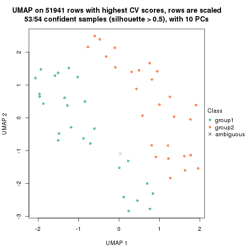</p>

</div>
<div id='tab-CV-NMF-dimension-reduction-2'>
<pre><code class="r">dimension_reduction(res, k = 3, method = &quot;UMAP&quot;)
</code></pre>

<p>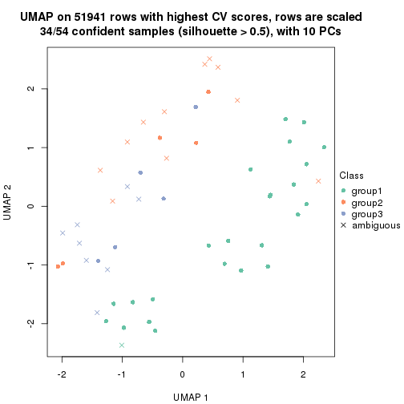</p>

</div>
<div id='tab-CV-NMF-dimension-reduction-3'>
<pre><code class="r">dimension_reduction(res, k = 4, method = &quot;UMAP&quot;)
</code></pre>

<p>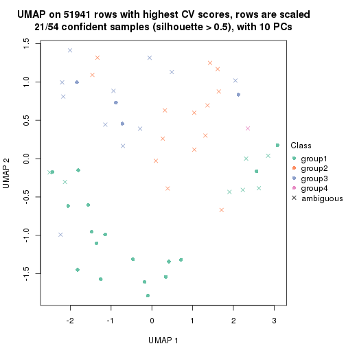</p>

</div>
<div id='tab-CV-NMF-dimension-reduction-4'>
<pre><code class="r">dimension_reduction(res, k = 5, method = &quot;UMAP&quot;)
</code></pre>

<p>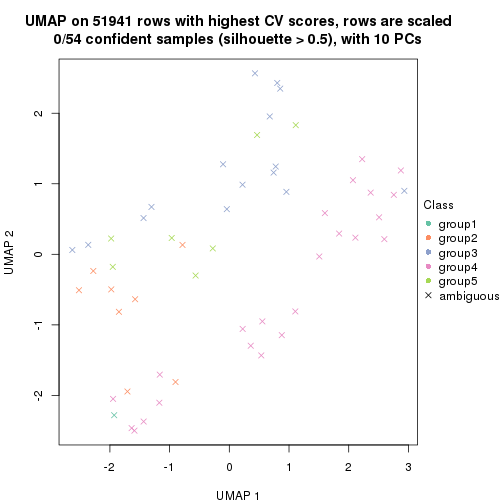</p>

</div>
<div id='tab-CV-NMF-dimension-reduction-5'>
<pre><code class="r">dimension_reduction(res, k = 6, method = &quot;UMAP&quot;)
</code></pre>

<p>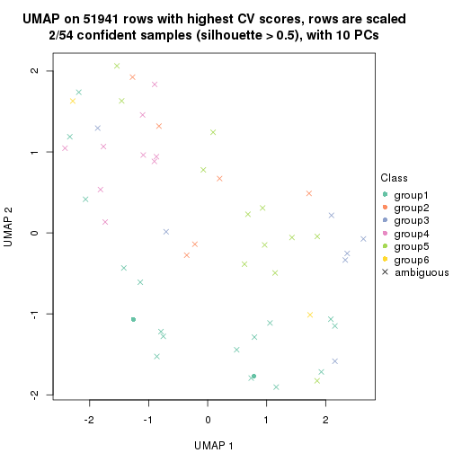</p>

</div>
</div>


Following heatmap shows how subgroups are split when increasing `k`:

```r
collect_classes(res)
```

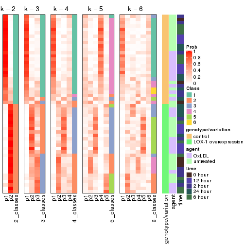


Test correlation between subgroups and known annotations. If the known
annotation is numeric, one-way ANOVA test is applied, and if the known
annotation is discrete, chi-squared contingency table test is applied.

```r
test_to_known_factors(res)
```

```
#>         n genotype/variation(p) agent(p) time(p) k
#> CV:NMF 53              2.46e-12    1.000   0.996 2
#> CV:NMF 34              4.14e-08    0.952   0.286 3
#> CV:NMF 21              1.07e-04    0.810   0.555 4
#> CV:NMF  0                    NA       NA      NA 5
#> CV:NMF  2                    NA       NA      NA 6
```


If matrix rows can be associated to genes, consider to use `functional_enrichment(res,
...)` to perform function enrichment for the signature genes. See [this vignette](http://bioconductor.org/packages/devel/bioc/vignettes/cola/inst/doc/functional_enrichment.html) for more detailed explanations.


 

---------------------------------------------------


### MAD:hclust


The object with results only for a single top-value method and a single partition method 
can be extracted as:

```r
res = res_list["MAD", "hclust"]
# you can also extract it by
# res = res_list["MAD:hclust"]
```

A summary of `res` and all the functions that can be applied to it:

```r
res
```

```
#> A 'ConsensusPartition' object with k = 2, 3, 4, 5, 6.
#>   On a matrix with 51941 rows and 54 columns.
#>   Top rows (1000, 2000, 3000, 4000, 5000) are extracted by 'MAD' method.
#>   Subgroups are detected by 'hclust' method.
#>   Performed in total 1250 partitions by row resampling.
#>   Best k for subgroups seems to be 2.
#> 
#> Following methods can be applied to this 'ConsensusPartition' object:
#>  [1] "cola_report"             "collect_classes"         "collect_plots"          
#>  [4] "collect_stats"           "colnames"                "compare_signatures"     
#>  [7] "consensus_heatmap"       "dimension_reduction"     "functional_enrichment"  
#> [10] "get_anno_col"            "get_anno"                "get_classes"            
#> [13] "get_consensus"           "get_matrix"              "get_membership"         
#> [16] "get_param"               "get_signatures"          "get_stats"              
#> [19] "is_best_k"               "is_stable_k"             "membership_heatmap"     
#> [22] "ncol"                    "nrow"                    "plot_ecdf"              
#> [25] "rownames"                "select_partition_number" "show"                   
#> [28] "suggest_best_k"          "test_to_known_factors"
```

`collect_plots()` function collects all the plots made from `res` for all `k` (number of partitions)
into one single page to provide an easy and fast comparison between different `k`.

```r
collect_plots(res)
```

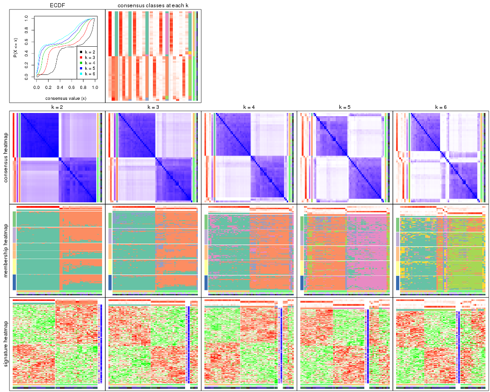

The plots are:

- The first row: a plot of the ECDF (empirical cumulative distribution
  function) curves of the consensus matrix for each `k` and the heatmap of
  predicted classes for each `k`.
- The second row: heatmaps of the consensus matrix for each `k`.
- The third row: heatmaps of the membership matrix for each `k`.
- The fouth row: heatmaps of the signatures for each `k`.

All the plots in panels can be made by individual functions and they are
plotted later in this section.

`select_partition_number()` produces several plots showing different
statistics for choosing "optimized" `k`. There are following statistics:

- ECDF curves of the consensus matrix for each `k`;
- 1-PAC. [The PAC
  score](https://en.wikipedia.org/wiki/Consensus_clustering#Over-interpretation_potential_of_consensus_clustering)
  measures the proportion of the ambiguous subgrouping.
- Mean silhouette score.
- Concordance. The mean probability of fiting the consensus class ids in all
  partitions.
- Area increased. Denote $A_k$ as the area under the ECDF curve for current
  `k`, the area increased is defined as $A_k - A_{k-1}$.
- Rand index. The percent of pairs of samples that are both in a same cluster
  or both are not in a same cluster in the partition of k and k-1.
- Jaccard index. The ratio of pairs of samples are both in a same cluster in
  the partition of k and k-1 and the pairs of samples are both in a same
  cluster in the partition k or k-1.

The detailed explanations of these statistics can be found in [the _cola_
vignette](http://bioconductor.org/packages/devel/bioc/vignettes/cola/inst/doc/cola.html#toc_13).

Generally speaking, lower PAC score, higher mean silhouette score or higher
concordance corresponds to better partition. Rand index and Jaccard index
measure how similar the current partition is compared to partition with `k-1`.
If they are too similar, we won't accept `k` is better than `k-1`.

```r
select_partition_number(res)
```

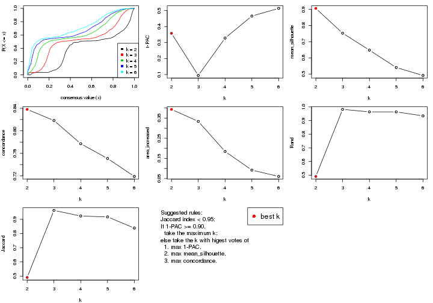

The numeric values for all these statistics can be obtained by `get_stats()`.

```r
get_stats(res)
```

```
#>   k  1-PAC mean_silhouette concordance area_increased  Rand Jaccard
#> 2 2 0.3576           0.906       0.838         0.3932 0.491   0.491
#> 3 3 0.0941           0.753       0.818         0.3336 0.982   0.963
#> 4 4 0.3278           0.648       0.777         0.1843 0.964   0.923
#> 5 5 0.4659           0.540       0.751         0.0918 0.964   0.917
#> 6 6 0.5137           0.491       0.719         0.0603 0.934   0.838
```

`suggest_best_k()` suggests the best $k$ based on these statistics. The rules are as follows:

- All $k$ with Jaccard index larger than 0.95 are removed because increasing
  $k$ does not provide enough extra information. If all $k$ are removed, it is
  marked as no subgroup is detected.
- For all $k$ with 1-PAC score larger than 0.9, the maximal $k$ is taken as
  the best $k$, and other $k$ are marked as optional $k$.
- If it does not fit the second rule. The $k$ with the maximal vote of the
  highest 1-PAC score, highest mean silhouette, and highest concordance is
  taken as the best $k$.

```r
suggest_best_k(res)
```

```
#> [1] 2
```


Following shows the table of the partitions (You need to click the **show/hide
code output** link to see it). The membership matrix (columns with name `p*`)
is inferred by
[`clue::cl_consensus()`](https://www.rdocumentation.org/link/cl_consensus?package=clue)
function with the `SE` method. Basically the value in the membership matrix
represents the probability to belong to a certain group. The finall class
label for an item is determined with the group with highest probability it
belongs to.

In `get_classes()` function, the entropy is calculated from the membership
matrix and the silhouette score is calculated from the consensus matrix.


<script>
$( function() {
	$( '#tabs-MAD-hclust-get-classes' ).tabs();
} );
</script>
<div id='tabs-MAD-hclust-get-classes'>
<ul>
<li><a href='#tab-MAD-hclust-get-classes-1'>k = 2</a></li>
<li><a href='#tab-MAD-hclust-get-classes-2'>k = 3</a></li>
<li><a href='#tab-MAD-hclust-get-classes-3'>k = 4</a></li>
<li><a href='#tab-MAD-hclust-get-classes-4'>k = 5</a></li>
<li><a href='#tab-MAD-hclust-get-classes-5'>k = 6</a></li>
</ul>

<div id='tab-MAD-hclust-get-classes-1'>
<p><a id='tab-MAD-hclust-get-classes-1-a' style='color:#0366d6' href='#'>show/hide code output</a></p>
<pre><code class="r">cbind(get_classes(res, k = 2), get_membership(res, k = 2))
</code></pre>

<pre><code>#&gt;           class entropy silhouette    p1    p2
#&gt; GSM329068     2  0.9209      0.887 0.336 0.664
#&gt; GSM329074     2  0.8955      0.872 0.312 0.688
#&gt; GSM329100     2  0.7139      0.806 0.196 0.804
#&gt; GSM329062     2  0.9087      0.887 0.324 0.676
#&gt; GSM329079     2  0.9129      0.886 0.328 0.672
#&gt; GSM329090     2  0.9323      0.881 0.348 0.652
#&gt; GSM329066     2  0.9129      0.886 0.328 0.672
#&gt; GSM329086     2  0.7674      0.821 0.224 0.776
#&gt; GSM329099     2  0.9170      0.886 0.332 0.668
#&gt; GSM329071     2  0.9248      0.885 0.340 0.660
#&gt; GSM329078     2  0.9552      0.860 0.376 0.624
#&gt; GSM329081     2  0.9983      0.666 0.476 0.524
#&gt; GSM329096     2  0.8955      0.887 0.312 0.688
#&gt; GSM329102     2  0.8327      0.858 0.264 0.736
#&gt; GSM329104     2  0.2043      0.654 0.032 0.968
#&gt; GSM329067     2  0.8555      0.855 0.280 0.720
#&gt; GSM329072     2  0.9775      0.767 0.412 0.588
#&gt; GSM329075     2  0.9087      0.887 0.324 0.676
#&gt; GSM329058     2  0.9460      0.863 0.364 0.636
#&gt; GSM329073     2  0.1414      0.651 0.020 0.980
#&gt; GSM329107     2  0.9286      0.882 0.344 0.656
#&gt; GSM329057     2  0.9286      0.882 0.344 0.656
#&gt; GSM329085     2  0.9552      0.860 0.376 0.624
#&gt; GSM329089     2  0.9754      0.818 0.408 0.592
#&gt; GSM329076     2  0.8861      0.883 0.304 0.696
#&gt; GSM329094     2  0.8661      0.872 0.288 0.712
#&gt; GSM329105     2  0.8909      0.885 0.308 0.692
#&gt; GSM329056     1  0.1633      0.975 0.976 0.024
#&gt; GSM329069     1  0.1184      0.970 0.984 0.016
#&gt; GSM329077     1  0.3431      0.936 0.936 0.064
#&gt; GSM329070     1  0.1633      0.975 0.976 0.024
#&gt; GSM329082     1  0.2778      0.954 0.952 0.048
#&gt; GSM329092     1  0.2043      0.964 0.968 0.032
#&gt; GSM329083     1  0.1414      0.970 0.980 0.020
#&gt; GSM329101     1  0.0376      0.976 0.996 0.004
#&gt; GSM329106     1  0.0672      0.977 0.992 0.008
#&gt; GSM329087     1  0.1414      0.974 0.980 0.020
#&gt; GSM329091     1  0.0672      0.977 0.992 0.008
#&gt; GSM329093     1  0.0938      0.978 0.988 0.012
#&gt; GSM329080     1  0.0672      0.977 0.992 0.008
#&gt; GSM329084     1  0.2043      0.962 0.968 0.032
#&gt; GSM329088     1  0.1184      0.977 0.984 0.016
#&gt; GSM329059     1  0.2236      0.964 0.964 0.036
#&gt; GSM329097     1  0.1843      0.974 0.972 0.028
#&gt; GSM329098     1  0.3114      0.938 0.944 0.056
#&gt; GSM329055     1  0.0938      0.977 0.988 0.012
#&gt; GSM329103     1  0.2043      0.973 0.968 0.032
#&gt; GSM329108     1  0.1184      0.978 0.984 0.016
#&gt; GSM329061     1  0.1414      0.974 0.980 0.020
#&gt; GSM329064     1  0.1633      0.973 0.976 0.024
#&gt; GSM329065     1  0.0938      0.977 0.988 0.012
#&gt; GSM329060     1  0.1184      0.976 0.984 0.016
#&gt; GSM329063     1  0.0376      0.976 0.996 0.004
#&gt; GSM329095     1  0.1184      0.976 0.984 0.016
</code></pre>

<script>
$('#tab-MAD-hclust-get-classes-1-a').parent().next().next().hide();
$('#tab-MAD-hclust-get-classes-1-a').click(function(){
  $('#tab-MAD-hclust-get-classes-1-a').parent().next().next().toggle();
  return(false);
});
</script>
</div>

<div id='tab-MAD-hclust-get-classes-2'>
<p><a id='tab-MAD-hclust-get-classes-2-a' style='color:#0366d6' href='#'>show/hide code output</a></p>
<pre><code class="r">cbind(get_classes(res, k = 3), get_membership(res, k = 3))
</code></pre>

<pre><code>#&gt;           class entropy silhouette    p1    p2    p3
#&gt; GSM329068     2   0.547      0.768 0.160 0.800 0.040
#&gt; GSM329074     2   0.716      0.607 0.140 0.720 0.140
#&gt; GSM329100     2   0.663      0.290 0.056 0.724 0.220
#&gt; GSM329062     2   0.518      0.765 0.156 0.812 0.032
#&gt; GSM329079     2   0.512      0.765 0.152 0.816 0.032
#&gt; GSM329090     2   0.531      0.767 0.136 0.816 0.048
#&gt; GSM329066     2   0.512      0.765 0.152 0.816 0.032
#&gt; GSM329086     2   0.738      0.247 0.088 0.684 0.228
#&gt; GSM329099     2   0.551      0.764 0.156 0.800 0.044
#&gt; GSM329071     2   0.493      0.769 0.140 0.828 0.032
#&gt; GSM329078     2   0.558      0.746 0.168 0.792 0.040
#&gt; GSM329081     2   0.764      0.539 0.284 0.640 0.076
#&gt; GSM329096     2   0.514      0.745 0.120 0.828 0.052
#&gt; GSM329102     2   0.574      0.642 0.104 0.804 0.092
#&gt; GSM329104     3   0.652      0.000 0.004 0.484 0.512
#&gt; GSM329067     2   0.738      0.482 0.116 0.700 0.184
#&gt; GSM329072     2   0.730      0.610 0.220 0.692 0.088
#&gt; GSM329075     2   0.554      0.757 0.144 0.804 0.052
#&gt; GSM329058     2   0.621      0.735 0.192 0.756 0.052
#&gt; GSM329073     2   0.610     -0.611 0.000 0.608 0.392
#&gt; GSM329107     2   0.588      0.764 0.148 0.788 0.064
#&gt; GSM329057     2   0.493      0.761 0.140 0.828 0.032
#&gt; GSM329085     2   0.558      0.746 0.168 0.792 0.040
#&gt; GSM329089     2   0.694      0.682 0.224 0.708 0.068
#&gt; GSM329076     2   0.485      0.744 0.128 0.836 0.036
#&gt; GSM329094     2   0.517      0.705 0.116 0.828 0.056
#&gt; GSM329105     2   0.466      0.744 0.124 0.844 0.032
#&gt; GSM329056     1   0.362      0.922 0.896 0.032 0.072
#&gt; GSM329069     1   0.468      0.887 0.840 0.028 0.132
#&gt; GSM329077     1   0.504      0.882 0.836 0.060 0.104
#&gt; GSM329070     1   0.547      0.830 0.792 0.032 0.176
#&gt; GSM329082     1   0.437      0.912 0.868 0.076 0.056
#&gt; GSM329092     1   0.753      0.712 0.664 0.084 0.252
#&gt; GSM329083     1   0.313      0.897 0.904 0.008 0.088
#&gt; GSM329101     1   0.268      0.925 0.932 0.028 0.040
#&gt; GSM329106     1   0.253      0.926 0.936 0.044 0.020
#&gt; GSM329087     1   0.290      0.924 0.924 0.048 0.028
#&gt; GSM329091     1   0.269      0.924 0.932 0.032 0.036
#&gt; GSM329093     1   0.408      0.923 0.880 0.048 0.072
#&gt; GSM329080     1   0.230      0.922 0.944 0.036 0.020
#&gt; GSM329084     1   0.512      0.866 0.816 0.032 0.152
#&gt; GSM329088     1   0.326      0.926 0.912 0.040 0.048
#&gt; GSM329059     1   0.456      0.907 0.860 0.076 0.064
#&gt; GSM329097     1   0.417      0.924 0.872 0.036 0.092
#&gt; GSM329098     1   0.516      0.887 0.832 0.096 0.072
#&gt; GSM329055     1   0.304      0.925 0.920 0.044 0.036
#&gt; GSM329103     1   0.504      0.916 0.832 0.048 0.120
#&gt; GSM329108     1   0.347      0.927 0.904 0.040 0.056
#&gt; GSM329061     1   0.369      0.923 0.896 0.052 0.052
#&gt; GSM329064     1   0.482      0.898 0.848 0.064 0.088
#&gt; GSM329065     1   0.304      0.925 0.920 0.044 0.036
#&gt; GSM329060     1   0.379      0.920 0.892 0.060 0.048
#&gt; GSM329063     1   0.328      0.920 0.908 0.024 0.068
#&gt; GSM329095     1   0.474      0.897 0.852 0.084 0.064
</code></pre>

<script>
$('#tab-MAD-hclust-get-classes-2-a').parent().next().next().hide();
$('#tab-MAD-hclust-get-classes-2-a').click(function(){
  $('#tab-MAD-hclust-get-classes-2-a').parent().next().next().toggle();
  return(false);
});
</script>
</div>

<div id='tab-MAD-hclust-get-classes-3'>
<p><a id='tab-MAD-hclust-get-classes-3-a' style='color:#0366d6' href='#'>show/hide code output</a></p>
<pre><code class="r">cbind(get_classes(res, k = 4), get_membership(res, k = 4))
</code></pre>

<pre><code>#&gt;           class entropy silhouette    p1    p2    p3    p4
#&gt; GSM329068     2   0.395    0.75909 0.072 0.852 0.068 0.008
#&gt; GSM329074     2   0.679    0.50220 0.084 0.628 0.264 0.024
#&gt; GSM329100     2   0.571    0.27268 0.012 0.604 0.368 0.016
#&gt; GSM329062     2   0.309    0.75359 0.056 0.888 0.056 0.000
#&gt; GSM329079     2   0.311    0.75334 0.052 0.892 0.052 0.004
#&gt; GSM329090     2   0.374    0.75412 0.048 0.872 0.052 0.028
#&gt; GSM329066     2   0.335    0.75756 0.052 0.880 0.064 0.004
#&gt; GSM329086     2   0.657    0.11005 0.044 0.552 0.384 0.020
#&gt; GSM329099     2   0.358    0.75280 0.060 0.868 0.068 0.004
#&gt; GSM329071     2   0.286    0.75841 0.044 0.904 0.048 0.004
#&gt; GSM329078     2   0.494    0.73013 0.068 0.812 0.076 0.044
#&gt; GSM329081     2   0.660    0.60544 0.160 0.700 0.076 0.064
#&gt; GSM329096     2   0.523    0.72342 0.048 0.780 0.140 0.032
#&gt; GSM329102     2   0.605    0.58584 0.040 0.680 0.252 0.028
#&gt; GSM329104     3   0.741    0.57462 0.000 0.252 0.516 0.232
#&gt; GSM329067     2   0.649    0.38426 0.044 0.616 0.312 0.028
#&gt; GSM329072     2   0.639    0.64492 0.140 0.716 0.096 0.048
#&gt; GSM329075     2   0.464    0.74279 0.064 0.812 0.112 0.012
#&gt; GSM329058     2   0.573    0.70482 0.088 0.756 0.124 0.032
#&gt; GSM329073     3   0.487    0.52926 0.000 0.304 0.684 0.012
#&gt; GSM329107     2   0.401    0.75155 0.048 0.852 0.084 0.016
#&gt; GSM329057     2   0.463    0.74660 0.056 0.828 0.076 0.040
#&gt; GSM329085     2   0.501    0.72946 0.068 0.808 0.080 0.044
#&gt; GSM329089     2   0.610    0.67427 0.132 0.732 0.100 0.036
#&gt; GSM329076     2   0.534    0.70489 0.052 0.760 0.168 0.020
#&gt; GSM329094     2   0.555    0.66876 0.048 0.736 0.196 0.020
#&gt; GSM329105     2   0.487    0.71755 0.048 0.792 0.144 0.016
#&gt; GSM329056     1   0.391    0.76554 0.840 0.036 0.004 0.120
#&gt; GSM329069     1   0.517    0.53661 0.704 0.020 0.008 0.268
#&gt; GSM329077     1   0.577    0.59571 0.732 0.040 0.040 0.188
#&gt; GSM329070     1   0.530   -0.00872 0.612 0.016 0.000 0.372
#&gt; GSM329082     1   0.448    0.72991 0.820 0.072 0.008 0.100
#&gt; GSM329092     4   0.702    0.00000 0.332 0.120 0.004 0.544
#&gt; GSM329083     1   0.407    0.57614 0.748 0.000 0.000 0.252
#&gt; GSM329101     1   0.248    0.77921 0.916 0.032 0.000 0.052
#&gt; GSM329106     1   0.264    0.77111 0.908 0.032 0.000 0.060
#&gt; GSM329087     1   0.294    0.77757 0.900 0.040 0.004 0.056
#&gt; GSM329091     1   0.283    0.77846 0.904 0.032 0.004 0.060
#&gt; GSM329093     1   0.406    0.76204 0.836 0.048 0.004 0.112
#&gt; GSM329080     1   0.223    0.77399 0.928 0.036 0.000 0.036
#&gt; GSM329084     1   0.557    0.43731 0.664 0.028 0.008 0.300
#&gt; GSM329088     1   0.365    0.77804 0.860 0.040 0.004 0.096
#&gt; GSM329059     1   0.508    0.68669 0.784 0.080 0.012 0.124
#&gt; GSM329097     1   0.418    0.76586 0.824 0.032 0.008 0.136
#&gt; GSM329098     1   0.505    0.68888 0.788 0.092 0.012 0.108
#&gt; GSM329055     1   0.241    0.77811 0.920 0.040 0.000 0.040
#&gt; GSM329103     1   0.498    0.74074 0.764 0.052 0.004 0.180
#&gt; GSM329108     1   0.333    0.77725 0.872 0.040 0.000 0.088
#&gt; GSM329061     1   0.423    0.76481 0.824 0.048 0.004 0.124
#&gt; GSM329064     1   0.593    0.46653 0.688 0.060 0.012 0.240
#&gt; GSM329065     1   0.276    0.77635 0.904 0.044 0.000 0.052
#&gt; GSM329060     1   0.439    0.74592 0.808 0.060 0.000 0.132
#&gt; GSM329063     1   0.407    0.69933 0.792 0.008 0.004 0.196
#&gt; GSM329095     1   0.553    0.64781 0.736 0.092 0.004 0.168
</code></pre>

<script>
$('#tab-MAD-hclust-get-classes-3-a').parent().next().next().hide();
$('#tab-MAD-hclust-get-classes-3-a').click(function(){
  $('#tab-MAD-hclust-get-classes-3-a').parent().next().next().toggle();
  return(false);
});
</script>
</div>

<div id='tab-MAD-hclust-get-classes-4'>
<p><a id='tab-MAD-hclust-get-classes-4-a' style='color:#0366d6' href='#'>show/hide code output</a></p>
<pre><code class="r">cbind(get_classes(res, k = 5), get_membership(res, k = 5))
</code></pre>

<pre><code>#&gt;           class entropy silhouette    p1    p2    p3    p4    p5
#&gt; GSM329068     2   0.367     0.7159 0.012 0.848 0.012 0.044 0.084
#&gt; GSM329074     2   0.646     0.2569 0.016 0.560 0.028 0.068 0.328
#&gt; GSM329100     2   0.445    -0.2043 0.000 0.504 0.004 0.000 0.492
#&gt; GSM329062     2   0.248     0.7114 0.004 0.900 0.000 0.028 0.068
#&gt; GSM329079     2   0.246     0.7120 0.008 0.904 0.000 0.024 0.064
#&gt; GSM329090     2   0.322     0.7166 0.008 0.876 0.040 0.016 0.060
#&gt; GSM329066     2   0.279     0.7194 0.008 0.896 0.012 0.024 0.060
#&gt; GSM329086     5   0.575     0.1455 0.008 0.424 0.040 0.012 0.516
#&gt; GSM329099     2   0.276     0.7084 0.008 0.888 0.000 0.032 0.072
#&gt; GSM329071     2   0.239     0.7224 0.004 0.916 0.020 0.016 0.044
#&gt; GSM329078     2   0.507     0.6846 0.024 0.776 0.088 0.036 0.076
#&gt; GSM329081     2   0.647     0.5707 0.060 0.688 0.056 0.108 0.088
#&gt; GSM329096     2   0.481     0.6884 0.000 0.756 0.088 0.020 0.136
#&gt; GSM329102     2   0.607     0.5320 0.000 0.632 0.136 0.024 0.208
#&gt; GSM329104     3   0.540     0.0000 0.000 0.112 0.648 0.000 0.240
#&gt; GSM329067     2   0.567    -0.1265 0.036 0.532 0.012 0.008 0.412
#&gt; GSM329072     2   0.587     0.5902 0.032 0.716 0.032 0.104 0.116
#&gt; GSM329075     2   0.410     0.6978 0.004 0.820 0.032 0.040 0.104
#&gt; GSM329058     2   0.529     0.6571 0.024 0.736 0.020 0.056 0.164
#&gt; GSM329073     5   0.470    -0.2795 0.016 0.100 0.120 0.000 0.764
#&gt; GSM329107     2   0.347     0.7146 0.008 0.860 0.032 0.020 0.080
#&gt; GSM329057     2   0.476     0.6970 0.012 0.780 0.048 0.032 0.128
#&gt; GSM329085     2   0.513     0.6840 0.024 0.772 0.088 0.036 0.080
#&gt; GSM329089     2   0.603     0.5749 0.044 0.708 0.032 0.092 0.124
#&gt; GSM329076     2   0.506     0.6658 0.000 0.740 0.100 0.024 0.136
#&gt; GSM329094     2   0.559     0.6151 0.000 0.688 0.116 0.024 0.172
#&gt; GSM329105     2   0.465     0.6781 0.000 0.772 0.096 0.020 0.112
#&gt; GSM329056     4   0.393     0.7017 0.148 0.016 0.024 0.808 0.004
#&gt; GSM329069     4   0.510     0.1928 0.368 0.000 0.020 0.596 0.016
#&gt; GSM329077     4   0.642     0.3549 0.244 0.024 0.048 0.628 0.056
#&gt; GSM329070     1   0.519     0.0936 0.492 0.000 0.032 0.472 0.004
#&gt; GSM329082     4   0.459     0.6647 0.116 0.036 0.048 0.792 0.008
#&gt; GSM329092     1   0.634     0.3398 0.640 0.044 0.088 0.216 0.012
#&gt; GSM329083     4   0.516     0.2228 0.344 0.000 0.032 0.612 0.012
#&gt; GSM329101     4   0.201     0.7270 0.056 0.016 0.004 0.924 0.000
#&gt; GSM329106     4   0.341     0.6881 0.136 0.012 0.012 0.836 0.004
#&gt; GSM329087     4   0.241     0.7269 0.060 0.020 0.012 0.908 0.000
#&gt; GSM329091     4   0.276     0.7263 0.060 0.012 0.036 0.892 0.000
#&gt; GSM329093     4   0.367     0.7006 0.156 0.020 0.012 0.812 0.000
#&gt; GSM329080     4   0.199     0.7230 0.048 0.016 0.008 0.928 0.000
#&gt; GSM329084     4   0.693     0.0664 0.336 0.016 0.108 0.512 0.028
#&gt; GSM329088     4   0.290     0.7285 0.092 0.020 0.012 0.876 0.000
#&gt; GSM329059     4   0.526     0.6154 0.152 0.056 0.044 0.740 0.008
#&gt; GSM329097     4   0.436     0.6793 0.200 0.016 0.016 0.760 0.008
#&gt; GSM329098     4   0.530     0.6300 0.152 0.064 0.024 0.740 0.020
#&gt; GSM329055     4   0.209     0.7265 0.048 0.020 0.008 0.924 0.000
#&gt; GSM329103     4   0.421     0.6830 0.204 0.028 0.004 0.760 0.004
#&gt; GSM329108     4   0.272     0.7251 0.096 0.020 0.004 0.880 0.000
#&gt; GSM329061     4   0.347     0.7119 0.124 0.020 0.012 0.840 0.004
#&gt; GSM329064     4   0.541     0.3683 0.292 0.032 0.016 0.648 0.012
#&gt; GSM329065     4   0.220     0.7260 0.060 0.016 0.008 0.916 0.000
#&gt; GSM329060     4   0.357     0.6970 0.124 0.032 0.012 0.832 0.000
#&gt; GSM329063     4   0.465     0.5166 0.268 0.000 0.044 0.688 0.000
#&gt; GSM329095     4   0.524     0.5990 0.180 0.056 0.024 0.728 0.012
</code></pre>

<script>
$('#tab-MAD-hclust-get-classes-4-a').parent().next().next().hide();
$('#tab-MAD-hclust-get-classes-4-a').click(function(){
  $('#tab-MAD-hclust-get-classes-4-a').parent().next().next().toggle();
  return(false);
});
</script>
</div>

<div id='tab-MAD-hclust-get-classes-5'>
<p><a id='tab-MAD-hclust-get-classes-5-a' style='color:#0366d6' href='#'>show/hide code output</a></p>
<pre><code class="r">cbind(get_classes(res, k = 6), get_membership(res, k = 6))
</code></pre>

<pre><code>#&gt;           class entropy silhouette    p1    p2    p3    p4    p5    p6
#&gt; GSM329068     5   0.339     0.6926 0.032 0.080 0.012 0.012 0.852 0.012
#&gt; GSM329074     5   0.663     0.1303 0.032 0.284 0.080 0.028 0.552 0.024
#&gt; GSM329100     2   0.507     0.4230 0.000 0.500 0.032 0.012 0.448 0.008
#&gt; GSM329062     5   0.229     0.6863 0.020 0.076 0.000 0.008 0.896 0.000
#&gt; GSM329079     5   0.234     0.6885 0.016 0.068 0.004 0.012 0.900 0.000
#&gt; GSM329090     5   0.309     0.7025 0.008 0.088 0.032 0.004 0.860 0.008
#&gt; GSM329066     5   0.251     0.7005 0.016 0.072 0.012 0.008 0.892 0.000
#&gt; GSM329086     2   0.627     0.5277 0.004 0.516 0.092 0.012 0.340 0.036
#&gt; GSM329099     5   0.255     0.6823 0.020 0.084 0.004 0.008 0.884 0.000
#&gt; GSM329071     5   0.217     0.7079 0.008 0.052 0.024 0.004 0.912 0.000
#&gt; GSM329078     5   0.495     0.6626 0.024 0.156 0.040 0.016 0.740 0.024
#&gt; GSM329081     5   0.628     0.5331 0.064 0.112 0.028 0.040 0.672 0.084
#&gt; GSM329096     5   0.446     0.6674 0.012 0.172 0.076 0.000 0.736 0.004
#&gt; GSM329102     5   0.597     0.4801 0.012 0.176 0.188 0.008 0.604 0.012
#&gt; GSM329104     3   0.189     0.0000 0.000 0.024 0.916 0.000 0.060 0.000
#&gt; GSM329067     2   0.571     0.4745 0.004 0.480 0.008 0.032 0.432 0.044
#&gt; GSM329072     5   0.532     0.5507 0.088 0.140 0.004 0.032 0.712 0.024
#&gt; GSM329075     5   0.374     0.6699 0.020 0.104 0.036 0.008 0.824 0.008
#&gt; GSM329058     5   0.537     0.6234 0.036 0.152 0.064 0.008 0.712 0.028
#&gt; GSM329073     2   0.598    -0.3587 0.000 0.596 0.272 0.052 0.048 0.032
#&gt; GSM329107     5   0.337     0.6942 0.016 0.108 0.024 0.008 0.840 0.004
#&gt; GSM329057     5   0.456     0.6841 0.016 0.132 0.056 0.012 0.768 0.016
#&gt; GSM329085     5   0.498     0.6615 0.024 0.160 0.040 0.016 0.736 0.024
#&gt; GSM329089     5   0.591     0.5010 0.080 0.144 0.020 0.036 0.684 0.036
#&gt; GSM329076     5   0.479     0.6382 0.008 0.144 0.112 0.004 0.724 0.008
#&gt; GSM329094     5   0.551     0.5625 0.012 0.196 0.136 0.004 0.644 0.008
#&gt; GSM329105     5   0.443     0.6561 0.008 0.112 0.108 0.004 0.760 0.008
#&gt; GSM329056     1   0.374     0.6255 0.784 0.004 0.000 0.036 0.008 0.168
#&gt; GSM329069     1   0.593    -0.3062 0.472 0.008 0.000 0.172 0.000 0.348
#&gt; GSM329077     1   0.636    -0.1688 0.484 0.048 0.016 0.036 0.024 0.392
#&gt; GSM329070     4   0.623    -0.2472 0.348 0.000 0.004 0.356 0.000 0.292
#&gt; GSM329082     1   0.490     0.6001 0.748 0.020 0.008 0.064 0.028 0.132
#&gt; GSM329092     4   0.338     0.2037 0.116 0.000 0.000 0.828 0.028 0.028
#&gt; GSM329083     6   0.544     0.0385 0.380 0.004 0.000 0.108 0.000 0.508
#&gt; GSM329101     1   0.256     0.6776 0.884 0.000 0.000 0.040 0.008 0.068
#&gt; GSM329106     1   0.370     0.5764 0.776 0.000 0.000 0.036 0.008 0.180
#&gt; GSM329087     1   0.249     0.6823 0.896 0.004 0.000 0.052 0.012 0.036
#&gt; GSM329091     1   0.268     0.6638 0.860 0.000 0.000 0.020 0.004 0.116
#&gt; GSM329093     1   0.405     0.6421 0.780 0.000 0.000 0.100 0.016 0.104
#&gt; GSM329080     1   0.182     0.6734 0.924 0.000 0.000 0.012 0.008 0.056
#&gt; GSM329084     6   0.619     0.1686 0.300 0.012 0.016 0.104 0.016 0.552
#&gt; GSM329088     1   0.269     0.6765 0.872 0.000 0.000 0.024 0.012 0.092
#&gt; GSM329059     1   0.522     0.4627 0.676 0.028 0.004 0.032 0.028 0.232
#&gt; GSM329097     1   0.479     0.5839 0.716 0.008 0.000 0.100 0.012 0.164
#&gt; GSM329098     1   0.501     0.5673 0.740 0.012 0.008 0.056 0.052 0.132
#&gt; GSM329055     1   0.204     0.6788 0.916 0.000 0.000 0.020 0.012 0.052
#&gt; GSM329103     1   0.460     0.6139 0.732 0.000 0.000 0.120 0.020 0.128
#&gt; GSM329108     1   0.292     0.6773 0.864 0.000 0.000 0.056 0.012 0.068
#&gt; GSM329061     1   0.395     0.6642 0.796 0.004 0.000 0.104 0.016 0.080
#&gt; GSM329064     1   0.630     0.2113 0.564 0.008 0.012 0.232 0.020 0.164
#&gt; GSM329065     1   0.222     0.6801 0.908 0.000 0.000 0.040 0.012 0.040
#&gt; GSM329060     1   0.390     0.6259 0.796 0.000 0.000 0.084 0.020 0.100
#&gt; GSM329063     1   0.475     0.0994 0.564 0.004 0.008 0.028 0.000 0.396
#&gt; GSM329095     1   0.574     0.5130 0.676 0.016 0.008 0.124 0.040 0.136
</code></pre>

<script>
$('#tab-MAD-hclust-get-classes-5-a').parent().next().next().hide();
$('#tab-MAD-hclust-get-classes-5-a').click(function(){
  $('#tab-MAD-hclust-get-classes-5-a').parent().next().next().toggle();
  return(false);
});
</script>
</div>
</div>

Heatmaps for the consensus matrix. It visualizes the probability of two
samples to be in a same group.


<script>
$( function() {
	$( '#tabs-MAD-hclust-consensus-heatmap' ).tabs();
} );
</script>
<div id='tabs-MAD-hclust-consensus-heatmap'>
<ul>
<li><a href='#tab-MAD-hclust-consensus-heatmap-1'>k = 2</a></li>
<li><a href='#tab-MAD-hclust-consensus-heatmap-2'>k = 3</a></li>
<li><a href='#tab-MAD-hclust-consensus-heatmap-3'>k = 4</a></li>
<li><a href='#tab-MAD-hclust-consensus-heatmap-4'>k = 5</a></li>
<li><a href='#tab-MAD-hclust-consensus-heatmap-5'>k = 6</a></li>
</ul>
<div id='tab-MAD-hclust-consensus-heatmap-1'>
<pre><code class="r">consensus_heatmap(res, k = 2)
</code></pre>

<p>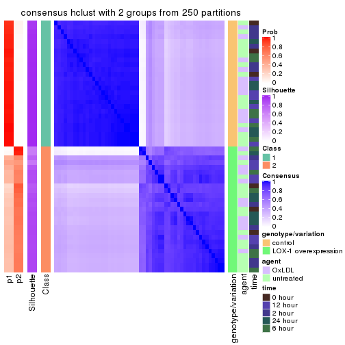</p>

</div>
<div id='tab-MAD-hclust-consensus-heatmap-2'>
<pre><code class="r">consensus_heatmap(res, k = 3)
</code></pre>

<p>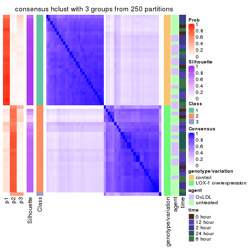</p>

</div>
<div id='tab-MAD-hclust-consensus-heatmap-3'>
<pre><code class="r">consensus_heatmap(res, k = 4)
</code></pre>

<p>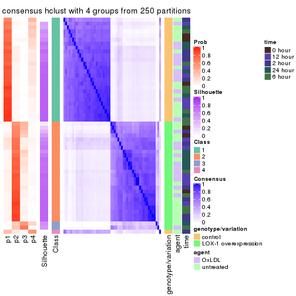</p>

</div>
<div id='tab-MAD-hclust-consensus-heatmap-4'>
<pre><code class="r">consensus_heatmap(res, k = 5)
</code></pre>

<p>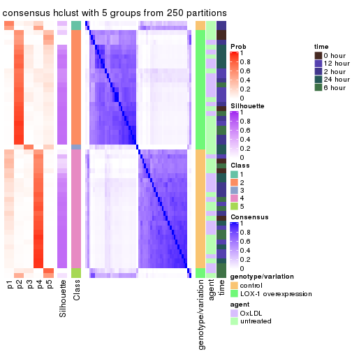</p>

</div>
<div id='tab-MAD-hclust-consensus-heatmap-5'>
<pre><code class="r">consensus_heatmap(res, k = 6)
</code></pre>

<p>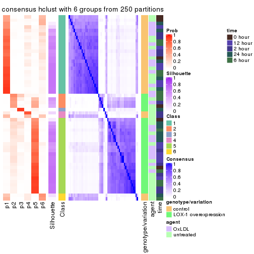</p>

</div>
</div>

Heatmaps for the membership of samples in all partitions to see how consistent they are:


<script>
$( function() {
	$( '#tabs-MAD-hclust-membership-heatmap' ).tabs();
} );
</script>
<div id='tabs-MAD-hclust-membership-heatmap'>
<ul>
<li><a href='#tab-MAD-hclust-membership-heatmap-1'>k = 2</a></li>
<li><a href='#tab-MAD-hclust-membership-heatmap-2'>k = 3</a></li>
<li><a href='#tab-MAD-hclust-membership-heatmap-3'>k = 4</a></li>
<li><a href='#tab-MAD-hclust-membership-heatmap-4'>k = 5</a></li>
<li><a href='#tab-MAD-hclust-membership-heatmap-5'>k = 6</a></li>
</ul>
<div id='tab-MAD-hclust-membership-heatmap-1'>
<pre><code class="r">membership_heatmap(res, k = 2)
</code></pre>

<p>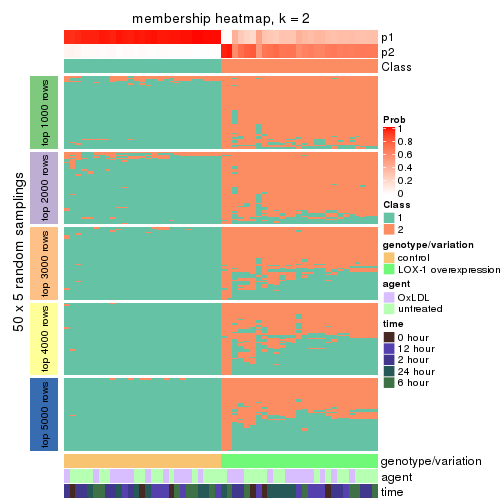</p>

</div>
<div id='tab-MAD-hclust-membership-heatmap-2'>
<pre><code class="r">membership_heatmap(res, k = 3)
</code></pre>

<p>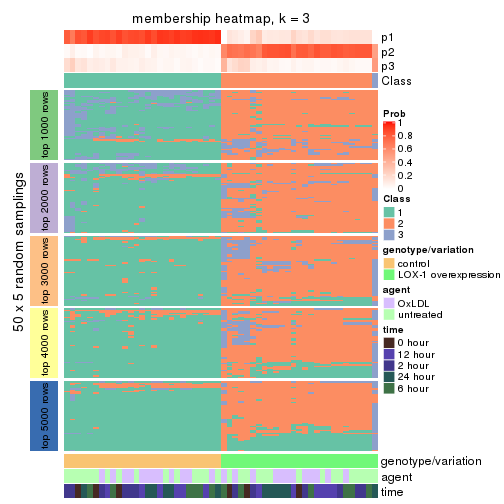</p>

</div>
<div id='tab-MAD-hclust-membership-heatmap-3'>
<pre><code class="r">membership_heatmap(res, k = 4)
</code></pre>

<p>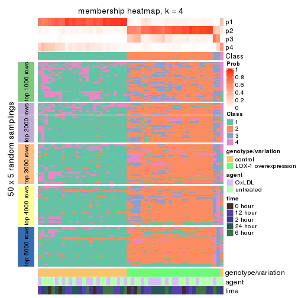</p>

</div>
<div id='tab-MAD-hclust-membership-heatmap-4'>
<pre><code class="r">membership_heatmap(res, k = 5)
</code></pre>

<p>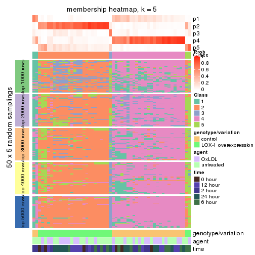</p>

</div>
<div id='tab-MAD-hclust-membership-heatmap-5'>
<pre><code class="r">membership_heatmap(res, k = 6)
</code></pre>

<p>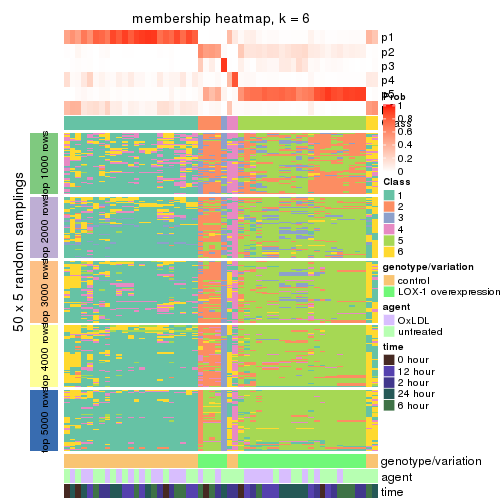</p>

</div>
</div>

As soon as we have had the classes for columns, we can look for signatures
which are significantly different between classes which can be candidate marks
for certain classes. Following are the heatmaps for signatures.


Signature heatmaps where rows are scaled:


<script>
$( function() {
	$( '#tabs-MAD-hclust-get-signatures' ).tabs();
} );
</script>
<div id='tabs-MAD-hclust-get-signatures'>
<ul>
<li><a href='#tab-MAD-hclust-get-signatures-1'>k = 2</a></li>
<li><a href='#tab-MAD-hclust-get-signatures-2'>k = 3</a></li>
<li><a href='#tab-MAD-hclust-get-signatures-3'>k = 4</a></li>
<li><a href='#tab-MAD-hclust-get-signatures-4'>k = 5</a></li>
<li><a href='#tab-MAD-hclust-get-signatures-5'>k = 6</a></li>
</ul>
<div id='tab-MAD-hclust-get-signatures-1'>
<pre><code class="r">get_signatures(res, k = 2)
</code></pre>

<p>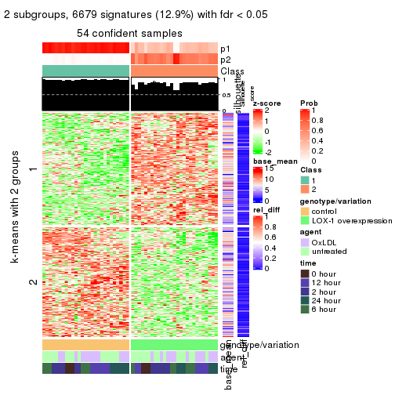</p>

</div>
<div id='tab-MAD-hclust-get-signatures-2'>
<pre><code class="r">get_signatures(res, k = 3)
</code></pre>

<p>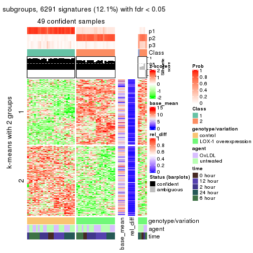</p>

</div>
<div id='tab-MAD-hclust-get-signatures-3'>
<pre><code class="r">get_signatures(res, k = 4)
</code></pre>

<p>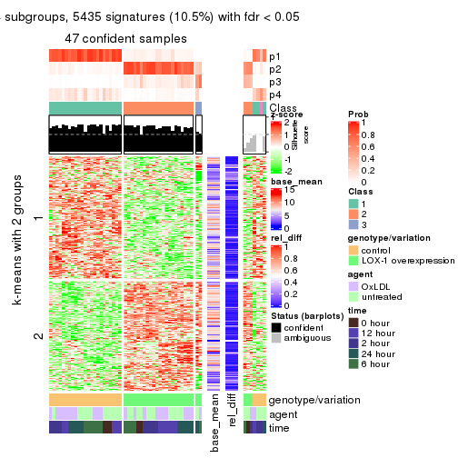</p>

</div>
<div id='tab-MAD-hclust-get-signatures-4'>
<pre><code class="r">get_signatures(res, k = 5)
</code></pre>

<p>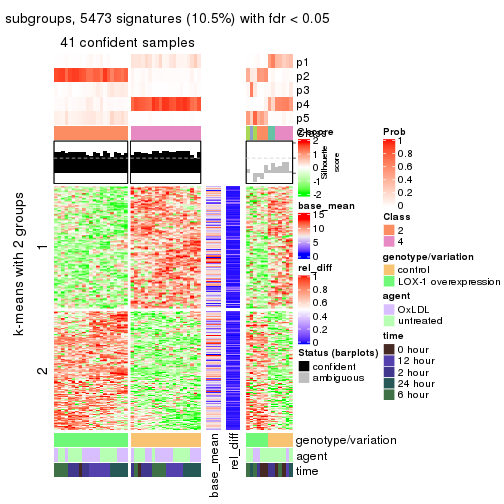</p>

</div>
<div id='tab-MAD-hclust-get-signatures-5'>
<pre><code class="r">get_signatures(res, k = 6)
</code></pre>

<p>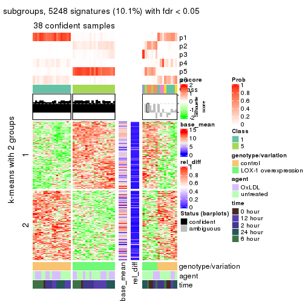</p>

</div>
</div>


Signature heatmaps where rows are not scaled:


<script>
$( function() {
	$( '#tabs-MAD-hclust-get-signatures-no-scale' ).tabs();
} );
</script>
<div id='tabs-MAD-hclust-get-signatures-no-scale'>
<ul>
<li><a href='#tab-MAD-hclust-get-signatures-no-scale-1'>k = 2</a></li>
<li><a href='#tab-MAD-hclust-get-signatures-no-scale-2'>k = 3</a></li>
<li><a href='#tab-MAD-hclust-get-signatures-no-scale-3'>k = 4</a></li>
<li><a href='#tab-MAD-hclust-get-signatures-no-scale-4'>k = 5</a></li>
<li><a href='#tab-MAD-hclust-get-signatures-no-scale-5'>k = 6</a></li>
</ul>
<div id='tab-MAD-hclust-get-signatures-no-scale-1'>
<pre><code class="r">get_signatures(res, k = 2, scale_rows = FALSE)
</code></pre>

<p>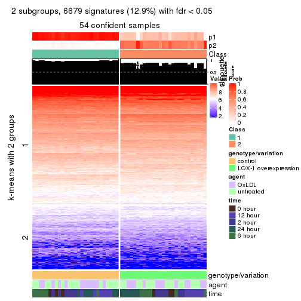</p>

</div>
<div id='tab-MAD-hclust-get-signatures-no-scale-2'>
<pre><code class="r">get_signatures(res, k = 3, scale_rows = FALSE)
</code></pre>

<p>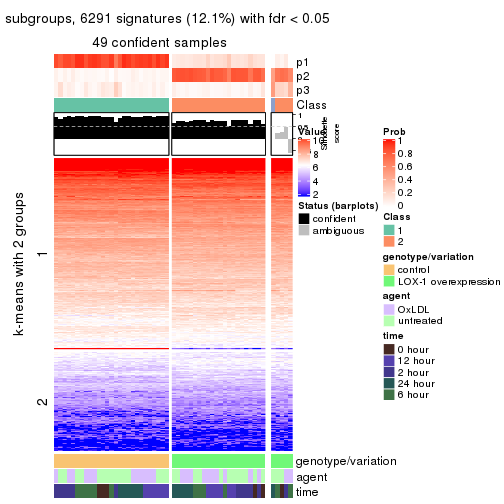</p>

</div>
<div id='tab-MAD-hclust-get-signatures-no-scale-3'>
<pre><code class="r">get_signatures(res, k = 4, scale_rows = FALSE)
</code></pre>

<p>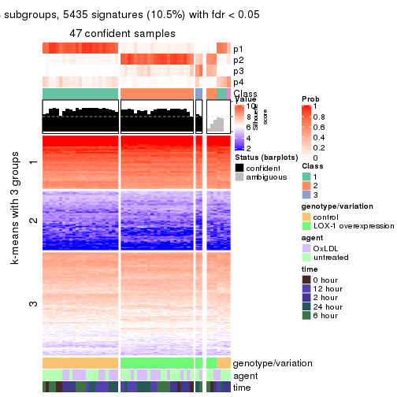</p>

</div>
<div id='tab-MAD-hclust-get-signatures-no-scale-4'>
<pre><code class="r">get_signatures(res, k = 5, scale_rows = FALSE)
</code></pre>

<p>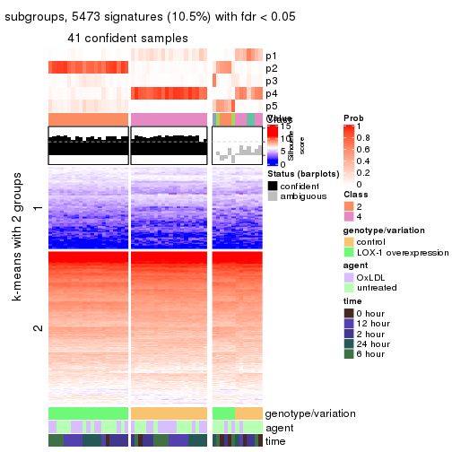</p>

</div>
<div id='tab-MAD-hclust-get-signatures-no-scale-5'>
<pre><code class="r">get_signatures(res, k = 6, scale_rows = FALSE)
</code></pre>

<p>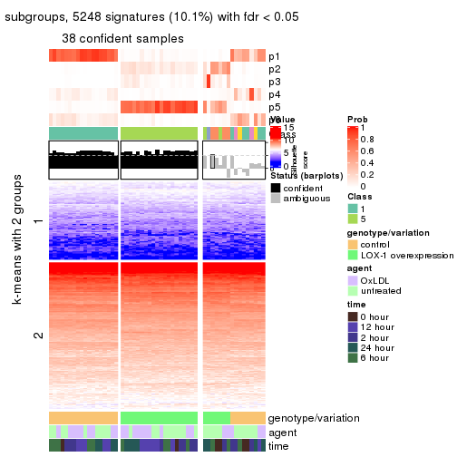</p>

</div>
</div>


Compare the overlap of signatures from different k:

```r
compare_signatures(res)
```

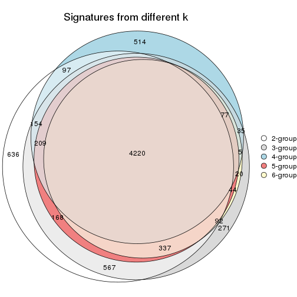

`get_signature()` returns a data frame invisibly. TO get the list of signatures, the function
call should be assigned to a variable explicitly. In following code, if `plot` argument is set
to `FALSE`, no heatmap is plotted while only the differential analysis is performed.

```r
# code only for demonstration
tb = get_signature(res, k = ..., plot = FALSE)
```

An example of the output of `tb` is:

```
#>   which_row         fdr    mean_1    mean_2 scaled_mean_1 scaled_mean_2 km
#> 1        38 0.042760348  8.373488  9.131774    -0.5533452     0.5164555  1
#> 2        40 0.018707592  7.106213  8.469186    -0.6173731     0.5762149  1
#> 3        55 0.019134737 10.221463 11.207825    -0.6159697     0.5749050  1
#> 4        59 0.006059896  5.921854  7.869574    -0.6899429     0.6439467  1
#> 5        60 0.018055526  8.928898 10.211722    -0.6204761     0.5791110  1
#> 6        98 0.009384629 15.714769 14.887706     0.6635654    -0.6193277  2
...
```

The columns in `tb` are:

1. `which_row`: row indices corresponding to the input matrix.
2. `fdr`: FDR for the differential test. 
3. `mean_x`: The mean value in group x.
4. `scaled_mean_x`: The mean value in group x after rows are scaled.
5. `km`: Row groups if k-means clustering is applied to rows.


UMAP plot which shows how samples are separated.


<script>
$( function() {
	$( '#tabs-MAD-hclust-dimension-reduction' ).tabs();
} );
</script>
<div id='tabs-MAD-hclust-dimension-reduction'>
<ul>
<li><a href='#tab-MAD-hclust-dimension-reduction-1'>k = 2</a></li>
<li><a href='#tab-MAD-hclust-dimension-reduction-2'>k = 3</a></li>
<li><a href='#tab-MAD-hclust-dimension-reduction-3'>k = 4</a></li>
<li><a href='#tab-MAD-hclust-dimension-reduction-4'>k = 5</a></li>
<li><a href='#tab-MAD-hclust-dimension-reduction-5'>k = 6</a></li>
</ul>
<div id='tab-MAD-hclust-dimension-reduction-1'>
<pre><code class="r">dimension_reduction(res, k = 2, method = &quot;UMAP&quot;)
</code></pre>

<p>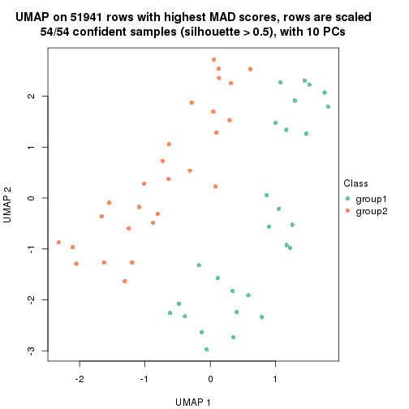</p>

</div>
<div id='tab-MAD-hclust-dimension-reduction-2'>
<pre><code class="r">dimension_reduction(res, k = 3, method = &quot;UMAP&quot;)
</code></pre>

<p>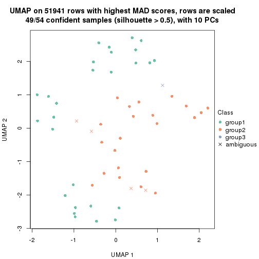</p>

</div>
<div id='tab-MAD-hclust-dimension-reduction-3'>
<pre><code class="r">dimension_reduction(res, k = 4, method = &quot;UMAP&quot;)
</code></pre>

<p>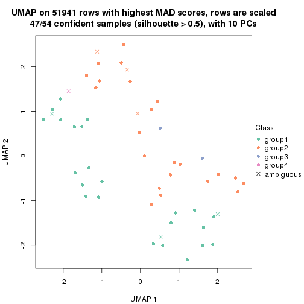</p>

</div>
<div id='tab-MAD-hclust-dimension-reduction-4'>
<pre><code class="r">dimension_reduction(res, k = 5, method = &quot;UMAP&quot;)
</code></pre>

<p>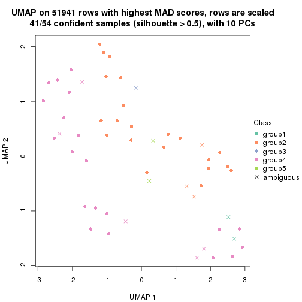</p>

</div>
<div id='tab-MAD-hclust-dimension-reduction-5'>
<pre><code class="r">dimension_reduction(res, k = 6, method = &quot;UMAP&quot;)
</code></pre>

<p>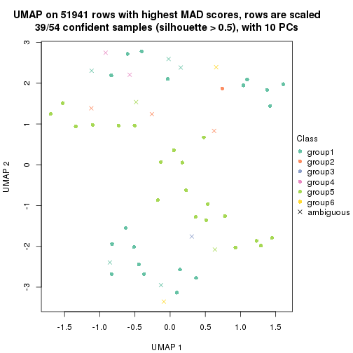</p>

</div>
</div>


Following heatmap shows how subgroups are split when increasing `k`:

```r
collect_classes(res)
```

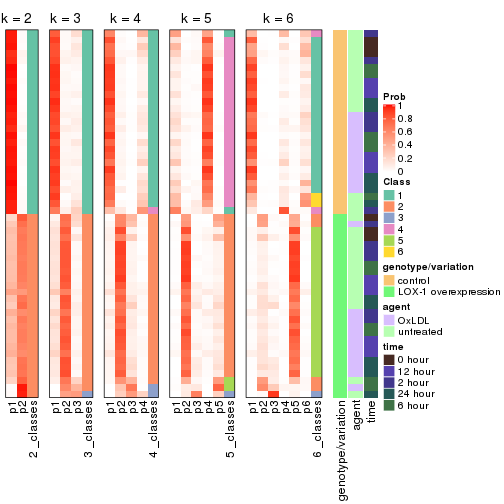


Test correlation between subgroups and known annotations. If the known
annotation is numeric, one-way ANOVA test is applied, and if the known
annotation is discrete, chi-squared contingency table test is applied.

```r
test_to_known_factors(res)
```

```
#>             n genotype/variation(p) agent(p) time(p) k
#> MAD:hclust 54              1.48e-12    1.000   1.000 2
#> MAD:hclust 49              1.93e-11    1.000   0.991 3
#> MAD:hclust 47              6.22e-11    0.983   0.924 4
#> MAD:hclust 41              1.12e-09    0.873   0.991 5
#> MAD:hclust 39              3.40e-09    0.614   0.894 6
```


If matrix rows can be associated to genes, consider to use `functional_enrichment(res,
...)` to perform function enrichment for the signature genes. See [this vignette](http://bioconductor.org/packages/devel/bioc/vignettes/cola/inst/doc/functional_enrichment.html) for more detailed explanations.


 

---------------------------------------------------


### MAD:kmeans**


The object with results only for a single top-value method and a single partition method 
can be extracted as:

```r
res = res_list["MAD", "kmeans"]
# you can also extract it by
# res = res_list["MAD:kmeans"]
```

A summary of `res` and all the functions that can be applied to it:

```r
res
```

```
#> A 'ConsensusPartition' object with k = 2, 3, 4, 5, 6.
#>   On a matrix with 51941 rows and 54 columns.
#>   Top rows (1000, 2000, 3000, 4000, 5000) are extracted by 'MAD' method.
#>   Subgroups are detected by 'kmeans' method.
#>   Performed in total 1250 partitions by row resampling.
#>   Best k for subgroups seems to be 2.
#> 
#> Following methods can be applied to this 'ConsensusPartition' object:
#>  [1] "cola_report"             "collect_classes"         "collect_plots"          
#>  [4] "collect_stats"           "colnames"                "compare_signatures"     
#>  [7] "consensus_heatmap"       "dimension_reduction"     "functional_enrichment"  
#> [10] "get_anno_col"            "get_anno"                "get_classes"            
#> [13] "get_consensus"           "get_matrix"              "get_membership"         
#> [16] "get_param"               "get_signatures"          "get_stats"              
#> [19] "is_best_k"               "is_stable_k"             "membership_heatmap"     
#> [22] "ncol"                    "nrow"                    "plot_ecdf"              
#> [25] "rownames"                "select_partition_number" "show"                   
#> [28] "suggest_best_k"          "test_to_known_factors"
```

`collect_plots()` function collects all the plots made from `res` for all `k` (number of partitions)
into one single page to provide an easy and fast comparison between different `k`.

```r
collect_plots(res)
```

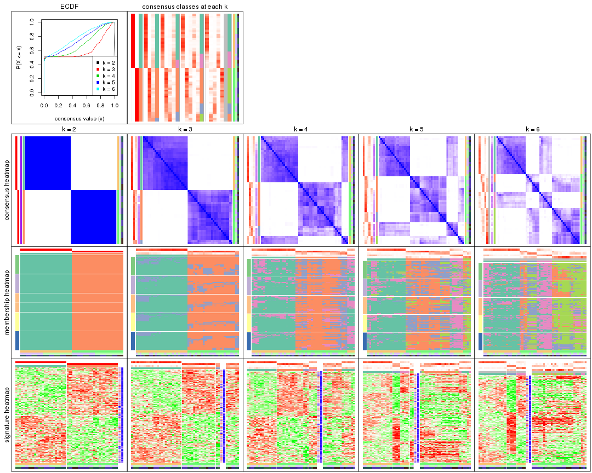

The plots are:

- The first row: a plot of the ECDF (empirical cumulative distribution
  function) curves of the consensus matrix for each `k` and the heatmap of
  predicted classes for each `k`.
- The second row: heatmaps of the consensus matrix for each `k`.
- The third row: heatmaps of the membership matrix for each `k`.
- The fouth row: heatmaps of the signatures for each `k`.

All the plots in panels can be made by individual functions and they are
plotted later in this section.

`select_partition_number()` produces several plots showing different
statistics for choosing "optimized" `k`. There are following statistics:

- ECDF curves of the consensus matrix for each `k`;
- 1-PAC. [The PAC
  score](https://en.wikipedia.org/wiki/Consensus_clustering#Over-interpretation_potential_of_consensus_clustering)
  measures the proportion of the ambiguous subgrouping.
- Mean silhouette score.
- Concordance. The mean probability of fiting the consensus class ids in all
  partitions.
- Area increased. Denote $A_k$ as the area under the ECDF curve for current
  `k`, the area increased is defined as $A_k - A_{k-1}$.
- Rand index. The percent of pairs of samples that are both in a same cluster
  or both are not in a same cluster in the partition of k and k-1.
- Jaccard index. The ratio of pairs of samples are both in a same cluster in
  the partition of k and k-1 and the pairs of samples are both in a same
  cluster in the partition k or k-1.

The detailed explanations of these statistics can be found in [the _cola_
vignette](http://bioconductor.org/packages/devel/bioc/vignettes/cola/inst/doc/cola.html#toc_13).

Generally speaking, lower PAC score, higher mean silhouette score or higher
concordance corresponds to better partition. Rand index and Jaccard index
measure how similar the current partition is compared to partition with `k-1`.
If they are too similar, we won't accept `k` is better than `k-1`.

```r
select_partition_number(res)
```

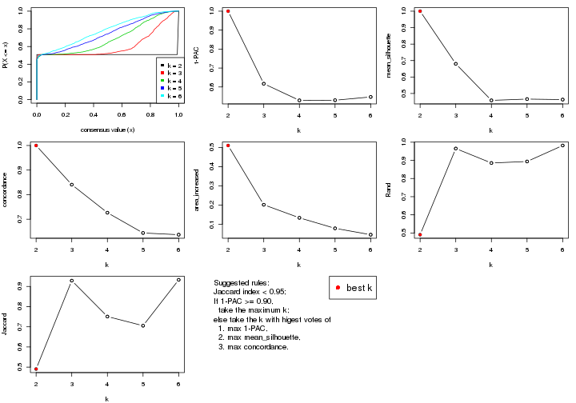

The numeric values for all these statistics can be obtained by `get_stats()`.

```r
get_stats(res)
```

```
#>   k 1-PAC mean_silhouette concordance area_increased  Rand Jaccard
#> 2 2 1.000           1.000       1.000         0.5099 0.491   0.491
#> 3 3 0.617           0.680       0.841         0.2018 0.965   0.929
#> 4 4 0.529           0.458       0.727         0.1337 0.885   0.751
#> 5 5 0.530           0.466       0.644         0.0790 0.894   0.705
#> 6 6 0.547           0.463       0.637         0.0459 0.982   0.933
```

`suggest_best_k()` suggests the best $k$ based on these statistics. The rules are as follows:

- All $k$ with Jaccard index larger than 0.95 are removed because increasing
  $k$ does not provide enough extra information. If all $k$ are removed, it is
  marked as no subgroup is detected.
- For all $k$ with 1-PAC score larger than 0.9, the maximal $k$ is taken as
  the best $k$, and other $k$ are marked as optional $k$.
- If it does not fit the second rule. The $k$ with the maximal vote of the
  highest 1-PAC score, highest mean silhouette, and highest concordance is
  taken as the best $k$.

```r
suggest_best_k(res)
```

```
#> [1] 2
```


Following shows the table of the partitions (You need to click the **show/hide
code output** link to see it). The membership matrix (columns with name `p*`)
is inferred by
[`clue::cl_consensus()`](https://www.rdocumentation.org/link/cl_consensus?package=clue)
function with the `SE` method. Basically the value in the membership matrix
represents the probability to belong to a certain group. The finall class
label for an item is determined with the group with highest probability it
belongs to.

In `get_classes()` function, the entropy is calculated from the membership
matrix and the silhouette score is calculated from the consensus matrix.


<script>
$( function() {
	$( '#tabs-MAD-kmeans-get-classes' ).tabs();
} );
</script>
<div id='tabs-MAD-kmeans-get-classes'>
<ul>
<li><a href='#tab-MAD-kmeans-get-classes-1'>k = 2</a></li>
<li><a href='#tab-MAD-kmeans-get-classes-2'>k = 3</a></li>
<li><a href='#tab-MAD-kmeans-get-classes-3'>k = 4</a></li>
<li><a href='#tab-MAD-kmeans-get-classes-4'>k = 5</a></li>
<li><a href='#tab-MAD-kmeans-get-classes-5'>k = 6</a></li>
</ul>

<div id='tab-MAD-kmeans-get-classes-1'>
<p><a id='tab-MAD-kmeans-get-classes-1-a' style='color:#0366d6' href='#'>show/hide code output</a></p>
<pre><code class="r">cbind(get_classes(res, k = 2), get_membership(res, k = 2))
</code></pre>

<pre><code>#&gt;           class entropy silhouette p1 p2
#&gt; GSM329068     2       0          1  0  1
#&gt; GSM329074     2       0          1  0  1
#&gt; GSM329100     2       0          1  0  1
#&gt; GSM329062     2       0          1  0  1
#&gt; GSM329079     2       0          1  0  1
#&gt; GSM329090     2       0          1  0  1
#&gt; GSM329066     2       0          1  0  1
#&gt; GSM329086     2       0          1  0  1
#&gt; GSM329099     2       0          1  0  1
#&gt; GSM329071     2       0          1  0  1
#&gt; GSM329078     2       0          1  0  1
#&gt; GSM329081     2       0          1  0  1
#&gt; GSM329096     2       0          1  0  1
#&gt; GSM329102     2       0          1  0  1
#&gt; GSM329104     2       0          1  0  1
#&gt; GSM329067     2       0          1  0  1
#&gt; GSM329072     2       0          1  0  1
#&gt; GSM329075     2       0          1  0  1
#&gt; GSM329058     2       0          1  0  1
#&gt; GSM329073     2       0          1  0  1
#&gt; GSM329107     2       0          1  0  1
#&gt; GSM329057     2       0          1  0  1
#&gt; GSM329085     2       0          1  0  1
#&gt; GSM329089     2       0          1  0  1
#&gt; GSM329076     2       0          1  0  1
#&gt; GSM329094     2       0          1  0  1
#&gt; GSM329105     2       0          1  0  1
#&gt; GSM329056     1       0          1  1  0
#&gt; GSM329069     1       0          1  1  0
#&gt; GSM329077     1       0          1  1  0
#&gt; GSM329070     1       0          1  1  0
#&gt; GSM329082     1       0          1  1  0
#&gt; GSM329092     1       0          1  1  0
#&gt; GSM329083     1       0          1  1  0
#&gt; GSM329101     1       0          1  1  0
#&gt; GSM329106     1       0          1  1  0
#&gt; GSM329087     1       0          1  1  0
#&gt; GSM329091     1       0          1  1  0
#&gt; GSM329093     1       0          1  1  0
#&gt; GSM329080     1       0          1  1  0
#&gt; GSM329084     1       0          1  1  0
#&gt; GSM329088     1       0          1  1  0
#&gt; GSM329059     1       0          1  1  0
#&gt; GSM329097     1       0          1  1  0
#&gt; GSM329098     1       0          1  1  0
#&gt; GSM329055     1       0          1  1  0
#&gt; GSM329103     1       0          1  1  0
#&gt; GSM329108     1       0          1  1  0
#&gt; GSM329061     1       0          1  1  0
#&gt; GSM329064     1       0          1  1  0
#&gt; GSM329065     1       0          1  1  0
#&gt; GSM329060     1       0          1  1  0
#&gt; GSM329063     1       0          1  1  0
#&gt; GSM329095     1       0          1  1  0
</code></pre>

<script>
$('#tab-MAD-kmeans-get-classes-1-a').parent().next().next().hide();
$('#tab-MAD-kmeans-get-classes-1-a').click(function(){
  $('#tab-MAD-kmeans-get-classes-1-a').parent().next().next().toggle();
  return(false);
});
</script>
</div>

<div id='tab-MAD-kmeans-get-classes-2'>
<p><a id='tab-MAD-kmeans-get-classes-2-a' style='color:#0366d6' href='#'>show/hide code output</a></p>
<pre><code class="r">cbind(get_classes(res, k = 3), get_membership(res, k = 3))
</code></pre>

<pre><code>#&gt;           class entropy silhouette    p1    p2    p3
#&gt; GSM329068     2   0.400      0.515 0.000 0.840 0.160
#&gt; GSM329074     2   0.470      0.422 0.000 0.788 0.212
#&gt; GSM329100     2   0.597     -0.325 0.000 0.636 0.364
#&gt; GSM329062     2   0.236      0.628 0.000 0.928 0.072
#&gt; GSM329079     2   0.153      0.638 0.000 0.960 0.040
#&gt; GSM329090     2   0.245      0.634 0.000 0.924 0.076
#&gt; GSM329066     2   0.129      0.643 0.000 0.968 0.032
#&gt; GSM329086     2   0.617     -0.576 0.000 0.588 0.412
#&gt; GSM329099     2   0.245      0.609 0.000 0.924 0.076
#&gt; GSM329071     2   0.280      0.637 0.000 0.908 0.092
#&gt; GSM329078     2   0.394      0.571 0.000 0.844 0.156
#&gt; GSM329081     2   0.312      0.626 0.000 0.892 0.108
#&gt; GSM329096     2   0.475      0.529 0.000 0.784 0.216
#&gt; GSM329102     2   0.590     -0.118 0.000 0.648 0.352
#&gt; GSM329104     3   0.630      0.607 0.000 0.484 0.516
#&gt; GSM329067     2   0.533      0.191 0.000 0.728 0.272
#&gt; GSM329072     2   0.280      0.615 0.000 0.908 0.092
#&gt; GSM329075     2   0.470      0.423 0.000 0.788 0.212
#&gt; GSM329058     2   0.319      0.639 0.000 0.888 0.112
#&gt; GSM329073     3   0.631      0.622 0.000 0.492 0.508
#&gt; GSM329107     2   0.153      0.645 0.000 0.960 0.040
#&gt; GSM329057     2   0.382      0.603 0.000 0.852 0.148
#&gt; GSM329085     2   0.382      0.581 0.000 0.852 0.148
#&gt; GSM329089     2   0.348      0.633 0.000 0.872 0.128
#&gt; GSM329076     2   0.450      0.544 0.000 0.804 0.196
#&gt; GSM329094     2   0.497      0.467 0.000 0.764 0.236
#&gt; GSM329105     2   0.440      0.556 0.000 0.812 0.188
#&gt; GSM329056     1   0.394      0.903 0.844 0.000 0.156
#&gt; GSM329069     1   0.573      0.827 0.676 0.000 0.324
#&gt; GSM329077     1   0.565      0.828 0.688 0.000 0.312
#&gt; GSM329070     1   0.525      0.845 0.736 0.000 0.264
#&gt; GSM329082     1   0.327      0.915 0.884 0.000 0.116
#&gt; GSM329092     1   0.550      0.837 0.708 0.000 0.292
#&gt; GSM329083     1   0.553      0.837 0.704 0.000 0.296
#&gt; GSM329101     1   0.153      0.918 0.960 0.000 0.040
#&gt; GSM329106     1   0.175      0.919 0.952 0.000 0.048
#&gt; GSM329087     1   0.175      0.917 0.952 0.000 0.048
#&gt; GSM329091     1   0.129      0.918 0.968 0.000 0.032
#&gt; GSM329093     1   0.186      0.916 0.948 0.000 0.052
#&gt; GSM329080     1   0.153      0.915 0.960 0.000 0.040
#&gt; GSM329084     1   0.348      0.915 0.872 0.000 0.128
#&gt; GSM329088     1   0.216      0.915 0.936 0.000 0.064
#&gt; GSM329059     1   0.429      0.899 0.820 0.000 0.180
#&gt; GSM329097     1   0.348      0.906 0.872 0.000 0.128
#&gt; GSM329098     1   0.406      0.899 0.836 0.000 0.164
#&gt; GSM329055     1   0.141      0.918 0.964 0.000 0.036
#&gt; GSM329103     1   0.175      0.918 0.952 0.000 0.048
#&gt; GSM329108     1   0.103      0.916 0.976 0.000 0.024
#&gt; GSM329061     1   0.164      0.914 0.956 0.000 0.044
#&gt; GSM329064     1   0.514      0.855 0.748 0.000 0.252
#&gt; GSM329065     1   0.141      0.912 0.964 0.000 0.036
#&gt; GSM329060     1   0.226      0.917 0.932 0.000 0.068
#&gt; GSM329063     1   0.450      0.884 0.804 0.000 0.196
#&gt; GSM329095     1   0.236      0.914 0.928 0.000 0.072
</code></pre>

<script>
$('#tab-MAD-kmeans-get-classes-2-a').parent().next().next().hide();
$('#tab-MAD-kmeans-get-classes-2-a').click(function(){
  $('#tab-MAD-kmeans-get-classes-2-a').parent().next().next().toggle();
  return(false);
});
</script>
</div>

<div id='tab-MAD-kmeans-get-classes-3'>
<p><a id='tab-MAD-kmeans-get-classes-3-a' style='color:#0366d6' href='#'>show/hide code output</a></p>
<pre><code class="r">cbind(get_classes(res, k = 4), get_membership(res, k = 4))
</code></pre>

<pre><code>#&gt;           class entropy silhouette    p1    p2    p3    p4
#&gt; GSM329068     2   0.433     0.4311 0.000 0.748 0.244 0.008
#&gt; GSM329074     2   0.551     0.1599 0.000 0.600 0.376 0.024
#&gt; GSM329100     3   0.545     0.4663 0.000 0.360 0.616 0.024
#&gt; GSM329062     2   0.277     0.5467 0.000 0.880 0.116 0.004
#&gt; GSM329079     2   0.234     0.5743 0.000 0.912 0.080 0.008
#&gt; GSM329090     2   0.337     0.5899 0.000 0.872 0.048 0.080
#&gt; GSM329066     2   0.149     0.5936 0.000 0.952 0.044 0.004
#&gt; GSM329086     3   0.585     0.5174 0.000 0.356 0.600 0.044
#&gt; GSM329099     2   0.305     0.5296 0.000 0.860 0.136 0.004
#&gt; GSM329071     2   0.383     0.5922 0.000 0.848 0.076 0.076
#&gt; GSM329078     2   0.548     0.5157 0.000 0.736 0.124 0.140
#&gt; GSM329081     2   0.428     0.5152 0.000 0.780 0.200 0.020
#&gt; GSM329096     2   0.659     0.4282 0.000 0.600 0.284 0.116
#&gt; GSM329102     3   0.675    -0.0799 0.000 0.448 0.460 0.092
#&gt; GSM329104     3   0.633     0.5138 0.000 0.200 0.656 0.144
#&gt; GSM329067     2   0.586    -0.2013 0.000 0.500 0.468 0.032
#&gt; GSM329072     2   0.382     0.5548 0.000 0.844 0.108 0.048
#&gt; GSM329075     2   0.540     0.1801 0.000 0.608 0.372 0.020
#&gt; GSM329058     2   0.406     0.5457 0.000 0.788 0.200 0.012
#&gt; GSM329073     3   0.455     0.5941 0.000 0.172 0.784 0.044
#&gt; GSM329107     2   0.141     0.6027 0.000 0.960 0.016 0.024
#&gt; GSM329057     2   0.557     0.5374 0.000 0.728 0.152 0.120
#&gt; GSM329085     2   0.538     0.5215 0.000 0.744 0.116 0.140
#&gt; GSM329089     2   0.542     0.5403 0.000 0.724 0.200 0.076
#&gt; GSM329076     2   0.635     0.4285 0.000 0.624 0.276 0.100
#&gt; GSM329094     2   0.665     0.3219 0.000 0.560 0.340 0.100
#&gt; GSM329105     2   0.642     0.3972 0.000 0.604 0.300 0.096
#&gt; GSM329056     1   0.504     0.3792 0.696 0.000 0.024 0.280
#&gt; GSM329069     4   0.598     0.7202 0.432 0.000 0.040 0.528
#&gt; GSM329077     4   0.573     0.7031 0.428 0.000 0.028 0.544
#&gt; GSM329070     1   0.607    -0.6471 0.504 0.000 0.044 0.452
#&gt; GSM329082     1   0.460     0.5646 0.776 0.000 0.040 0.184
#&gt; GSM329092     4   0.597     0.5258 0.428 0.000 0.040 0.532
#&gt; GSM329083     4   0.541     0.6740 0.480 0.000 0.012 0.508
#&gt; GSM329101     1   0.206     0.6582 0.932 0.000 0.016 0.052
#&gt; GSM329106     1   0.240     0.6523 0.912 0.000 0.012 0.076
#&gt; GSM329087     1   0.299     0.6601 0.880 0.000 0.016 0.104
#&gt; GSM329091     1   0.208     0.6553 0.916 0.000 0.000 0.084
#&gt; GSM329093     1   0.305     0.6350 0.876 0.000 0.016 0.108
#&gt; GSM329080     1   0.328     0.6384 0.864 0.000 0.020 0.116
#&gt; GSM329084     1   0.503     0.5517 0.716 0.000 0.032 0.252
#&gt; GSM329088     1   0.328     0.6505 0.864 0.000 0.020 0.116
#&gt; GSM329059     1   0.535     0.1629 0.640 0.000 0.024 0.336
#&gt; GSM329097     1   0.487     0.3497 0.728 0.000 0.028 0.244
#&gt; GSM329098     1   0.612     0.2622 0.668 0.024 0.044 0.264
#&gt; GSM329055     1   0.240     0.6507 0.904 0.000 0.004 0.092
#&gt; GSM329103     1   0.322     0.6307 0.868 0.000 0.020 0.112
#&gt; GSM329108     1   0.158     0.6565 0.948 0.000 0.004 0.048
#&gt; GSM329061     1   0.337     0.6275 0.864 0.000 0.028 0.108
#&gt; GSM329064     1   0.594    -0.4757 0.548 0.000 0.040 0.412
#&gt; GSM329065     1   0.256     0.6456 0.908 0.000 0.020 0.072
#&gt; GSM329060     1   0.386     0.6408 0.824 0.000 0.024 0.152
#&gt; GSM329063     1   0.527     0.0510 0.640 0.000 0.020 0.340
#&gt; GSM329095     1   0.424     0.6023 0.800 0.000 0.032 0.168
</code></pre>

<script>
$('#tab-MAD-kmeans-get-classes-3-a').parent().next().next().hide();
$('#tab-MAD-kmeans-get-classes-3-a').click(function(){
  $('#tab-MAD-kmeans-get-classes-3-a').parent().next().next().toggle();
  return(false);
});
</script>
</div>

<div id='tab-MAD-kmeans-get-classes-4'>
<p><a id='tab-MAD-kmeans-get-classes-4-a' style='color:#0366d6' href='#'>show/hide code output</a></p>
<pre><code class="r">cbind(get_classes(res, k = 5), get_membership(res, k = 5))
</code></pre>

<pre><code>#&gt;           class entropy silhouette    p1    p2    p3    p4    p5
#&gt; GSM329068     2  0.4354    0.39373 0.000 0.788 0.092 0.012 0.108
#&gt; GSM329074     2  0.6072    0.19532 0.000 0.612 0.096 0.028 0.264
#&gt; GSM329100     5  0.6154    0.35122 0.000 0.372 0.076 0.024 0.528
#&gt; GSM329062     2  0.2221    0.48779 0.000 0.912 0.052 0.000 0.036
#&gt; GSM329079     2  0.0865    0.48642 0.000 0.972 0.004 0.000 0.024
#&gt; GSM329090     2  0.4564    0.27605 0.000 0.696 0.272 0.024 0.008
#&gt; GSM329066     2  0.0727    0.48201 0.000 0.980 0.012 0.004 0.004
#&gt; GSM329086     5  0.5785    0.55154 0.000 0.288 0.076 0.020 0.616
#&gt; GSM329099     2  0.1956    0.47620 0.000 0.916 0.008 0.000 0.076
#&gt; GSM329071     2  0.4838    0.21012 0.000 0.676 0.284 0.020 0.020
#&gt; GSM329078     2  0.4821   -0.10692 0.000 0.516 0.464 0.020 0.000
#&gt; GSM329081     2  0.5229    0.29813 0.000 0.708 0.192 0.020 0.080
#&gt; GSM329096     3  0.5195    0.71114 0.000 0.420 0.536 0.000 0.044
#&gt; GSM329102     3  0.6591    0.43012 0.000 0.336 0.468 0.004 0.192
#&gt; GSM329104     5  0.5945    0.41975 0.000 0.068 0.360 0.020 0.552
#&gt; GSM329067     2  0.6403   -0.12114 0.000 0.508 0.108 0.020 0.364
#&gt; GSM329072     2  0.4435    0.43592 0.000 0.780 0.124 0.012 0.084
#&gt; GSM329075     2  0.5453    0.27816 0.000 0.672 0.112 0.008 0.208
#&gt; GSM329058     2  0.4447    0.32939 0.000 0.772 0.140 0.008 0.080
#&gt; GSM329073     5  0.4914    0.59379 0.000 0.108 0.180 0.000 0.712
#&gt; GSM329107     2  0.2959    0.44339 0.000 0.864 0.112 0.016 0.008
#&gt; GSM329057     2  0.4951   -0.06352 0.000 0.556 0.420 0.012 0.012
#&gt; GSM329085     2  0.4954   -0.06573 0.000 0.528 0.448 0.020 0.004
#&gt; GSM329089     2  0.6188    0.00916 0.000 0.524 0.376 0.028 0.072
#&gt; GSM329076     3  0.5318    0.74845 0.000 0.460 0.496 0.004 0.040
#&gt; GSM329094     3  0.5732    0.73885 0.000 0.428 0.496 0.004 0.072
#&gt; GSM329105     3  0.5431    0.76342 0.000 0.448 0.500 0.004 0.048
#&gt; GSM329056     1  0.5394    0.24304 0.528 0.000 0.024 0.428 0.020
#&gt; GSM329069     4  0.4472    0.68799 0.184 0.000 0.032 0.760 0.024
#&gt; GSM329077     4  0.5271    0.63607 0.128 0.000 0.048 0.736 0.088
#&gt; GSM329070     4  0.5906    0.67386 0.240 0.000 0.040 0.644 0.076
#&gt; GSM329082     1  0.4687    0.60600 0.756 0.000 0.052 0.168 0.024
#&gt; GSM329092     4  0.6432    0.63600 0.248 0.000 0.068 0.604 0.080
#&gt; GSM329083     4  0.5495    0.66467 0.220 0.000 0.048 0.684 0.048
#&gt; GSM329101     1  0.2564    0.72198 0.904 0.000 0.024 0.052 0.020
#&gt; GSM329106     1  0.3794    0.70738 0.828 0.000 0.036 0.112 0.024
#&gt; GSM329087     1  0.3463    0.71626 0.836 0.000 0.020 0.128 0.016
#&gt; GSM329091     1  0.3285    0.71493 0.868 0.000 0.036 0.064 0.032
#&gt; GSM329093     1  0.2943    0.70634 0.888 0.000 0.040 0.036 0.036
#&gt; GSM329080     1  0.3717    0.69766 0.816 0.000 0.028 0.144 0.012
#&gt; GSM329084     1  0.6178    0.55098 0.624 0.000 0.080 0.244 0.052
#&gt; GSM329088     1  0.3878    0.70354 0.808 0.000 0.036 0.144 0.012
#&gt; GSM329059     4  0.5639   -0.03160 0.452 0.000 0.024 0.492 0.032
#&gt; GSM329097     1  0.5425    0.27056 0.572 0.000 0.036 0.376 0.016
#&gt; GSM329098     1  0.6443    0.18289 0.512 0.024 0.028 0.392 0.044
#&gt; GSM329055     1  0.3463    0.70801 0.840 0.000 0.020 0.120 0.020
#&gt; GSM329103     1  0.3394    0.69409 0.864 0.000 0.052 0.044 0.040
#&gt; GSM329108     1  0.2180    0.71619 0.924 0.000 0.020 0.032 0.024
#&gt; GSM329061     1  0.2853    0.69705 0.892 0.000 0.036 0.044 0.028
#&gt; GSM329064     4  0.6242    0.49705 0.372 0.000 0.048 0.528 0.052
#&gt; GSM329065     1  0.1815    0.71926 0.940 0.000 0.024 0.020 0.016
#&gt; GSM329060     1  0.4204    0.69537 0.796 0.000 0.036 0.140 0.028
#&gt; GSM329063     1  0.6371   -0.06524 0.460 0.000 0.060 0.436 0.044
#&gt; GSM329095     1  0.4477    0.66321 0.788 0.000 0.068 0.116 0.028
</code></pre>

<script>
$('#tab-MAD-kmeans-get-classes-4-a').parent().next().next().hide();
$('#tab-MAD-kmeans-get-classes-4-a').click(function(){
  $('#tab-MAD-kmeans-get-classes-4-a').parent().next().next().toggle();
  return(false);
});
</script>
</div>

<div id='tab-MAD-kmeans-get-classes-5'>
<p><a id='tab-MAD-kmeans-get-classes-5-a' style='color:#0366d6' href='#'>show/hide code output</a></p>
<pre><code class="r">cbind(get_classes(res, k = 6), get_membership(res, k = 6))
</code></pre>

<pre><code>#&gt;           class entropy silhouette    p1    p2    p3    p4    p5 p6
#&gt; GSM329068     5  0.4107    0.39556 0.000 0.052 0.140 0.000 0.776 NA
#&gt; GSM329074     5  0.6240    0.19322 0.000 0.176 0.200 0.012 0.576 NA
#&gt; GSM329100     2  0.6525    0.42240 0.000 0.532 0.132 0.016 0.272 NA
#&gt; GSM329062     5  0.1616    0.50116 0.000 0.028 0.020 0.000 0.940 NA
#&gt; GSM329079     5  0.0603    0.49821 0.000 0.016 0.004 0.000 0.980 NA
#&gt; GSM329090     5  0.5365    0.34261 0.000 0.032 0.184 0.000 0.656 NA
#&gt; GSM329066     5  0.1007    0.49329 0.000 0.000 0.044 0.000 0.956 NA
#&gt; GSM329086     2  0.5358    0.48038 0.000 0.604 0.056 0.012 0.308 NA
#&gt; GSM329099     5  0.1524    0.48986 0.000 0.060 0.008 0.000 0.932 NA
#&gt; GSM329071     5  0.5682    0.24717 0.000 0.028 0.256 0.000 0.592 NA
#&gt; GSM329078     5  0.6091    0.08443 0.000 0.016 0.332 0.000 0.476 NA
#&gt; GSM329081     5  0.6356    0.07737 0.000 0.072 0.300 0.008 0.532 NA
#&gt; GSM329096     3  0.4388    0.71976 0.000 0.004 0.648 0.000 0.312 NA
#&gt; GSM329102     3  0.5385    0.54820 0.000 0.128 0.640 0.000 0.208 NA
#&gt; GSM329104     2  0.6605    0.34677 0.000 0.432 0.364 0.020 0.020 NA
#&gt; GSM329067     5  0.6455   -0.27447 0.000 0.384 0.164 0.008 0.420 NA
#&gt; GSM329072     5  0.3787    0.46976 0.000 0.088 0.064 0.000 0.812 NA
#&gt; GSM329075     5  0.5769    0.20209 0.000 0.156 0.224 0.004 0.596 NA
#&gt; GSM329058     5  0.5379    0.17374 0.000 0.060 0.272 0.008 0.628 NA
#&gt; GSM329073     2  0.5589    0.56231 0.000 0.676 0.168 0.016 0.080 NA
#&gt; GSM329107     5  0.3299    0.46490 0.000 0.012 0.092 0.000 0.836 NA
#&gt; GSM329057     5  0.6004    0.00317 0.000 0.020 0.368 0.000 0.472 NA
#&gt; GSM329085     5  0.6055    0.12783 0.000 0.016 0.316 0.000 0.492 NA
#&gt; GSM329089     5  0.7273    0.05683 0.000 0.140 0.320 0.008 0.408 NA
#&gt; GSM329076     3  0.3563    0.77540 0.000 0.000 0.664 0.000 0.336 NA
#&gt; GSM329094     3  0.4178    0.75307 0.000 0.032 0.700 0.000 0.260 NA
#&gt; GSM329105     3  0.3894    0.77486 0.000 0.004 0.664 0.000 0.324 NA
#&gt; GSM329056     1  0.5877    0.16825 0.480 0.016 0.004 0.388 0.000 NA
#&gt; GSM329069     4  0.3829    0.62165 0.124 0.012 0.000 0.792 0.000 NA
#&gt; GSM329077     4  0.5027    0.56209 0.072 0.064 0.032 0.748 0.000 NA
#&gt; GSM329070     4  0.6222    0.59339 0.196 0.028 0.016 0.576 0.000 NA
#&gt; GSM329082     1  0.5845    0.53525 0.656 0.040 0.016 0.152 0.004 NA
#&gt; GSM329092     4  0.6565    0.58145 0.136 0.056 0.020 0.556 0.000 NA
#&gt; GSM329083     4  0.5281    0.60423 0.148 0.028 0.020 0.700 0.000 NA
#&gt; GSM329101     1  0.3574    0.71228 0.824 0.008 0.012 0.052 0.000 NA
#&gt; GSM329106     1  0.3735    0.70373 0.800 0.000 0.016 0.056 0.000 NA
#&gt; GSM329087     1  0.2975    0.70513 0.860 0.004 0.008 0.088 0.000 NA
#&gt; GSM329091     1  0.4065    0.70552 0.784 0.008 0.012 0.068 0.000 NA
#&gt; GSM329093     1  0.3601    0.69777 0.792 0.000 0.008 0.040 0.000 NA
#&gt; GSM329080     1  0.3208    0.69113 0.844 0.000 0.012 0.076 0.000 NA
#&gt; GSM329084     1  0.6082    0.43687 0.572 0.016 0.016 0.172 0.000 NA
#&gt; GSM329088     1  0.3240    0.69270 0.840 0.000 0.012 0.092 0.000 NA
#&gt; GSM329059     4  0.6480    0.04013 0.376 0.028 0.016 0.448 0.000 NA
#&gt; GSM329097     1  0.5540    0.34350 0.556 0.012 0.004 0.332 0.000 NA
#&gt; GSM329098     1  0.6808    0.19242 0.480 0.036 0.004 0.340 0.040 NA
#&gt; GSM329055     1  0.2733    0.71391 0.864 0.000 0.000 0.080 0.000 NA
#&gt; GSM329103     1  0.4107    0.68962 0.772 0.004 0.008 0.084 0.000 NA
#&gt; GSM329108     1  0.3241    0.70486 0.836 0.000 0.012 0.044 0.000 NA
#&gt; GSM329061     1  0.3743    0.69453 0.804 0.008 0.004 0.072 0.000 NA
#&gt; GSM329064     4  0.6433    0.49725 0.252 0.016 0.012 0.492 0.000 NA
#&gt; GSM329065     1  0.1901    0.71370 0.912 0.000 0.004 0.008 0.000 NA
#&gt; GSM329060     1  0.4142    0.67451 0.776 0.004 0.012 0.096 0.000 NA
#&gt; GSM329063     4  0.6350    0.16709 0.408 0.016 0.016 0.420 0.000 NA
#&gt; GSM329095     1  0.4838    0.62341 0.708 0.012 0.012 0.080 0.000 NA
</code></pre>

<script>
$('#tab-MAD-kmeans-get-classes-5-a').parent().next().next().hide();
$('#tab-MAD-kmeans-get-classes-5-a').click(function(){
  $('#tab-MAD-kmeans-get-classes-5-a').parent().next().next().toggle();
  return(false);
});
</script>
</div>
</div>

Heatmaps for the consensus matrix. It visualizes the probability of two
samples to be in a same group.


<script>
$( function() {
	$( '#tabs-MAD-kmeans-consensus-heatmap' ).tabs();
} );
</script>
<div id='tabs-MAD-kmeans-consensus-heatmap'>
<ul>
<li><a href='#tab-MAD-kmeans-consensus-heatmap-1'>k = 2</a></li>
<li><a href='#tab-MAD-kmeans-consensus-heatmap-2'>k = 3</a></li>
<li><a href='#tab-MAD-kmeans-consensus-heatmap-3'>k = 4</a></li>
<li><a href='#tab-MAD-kmeans-consensus-heatmap-4'>k = 5</a></li>
<li><a href='#tab-MAD-kmeans-consensus-heatmap-5'>k = 6</a></li>
</ul>
<div id='tab-MAD-kmeans-consensus-heatmap-1'>
<pre><code class="r">consensus_heatmap(res, k = 2)
</code></pre>

<p>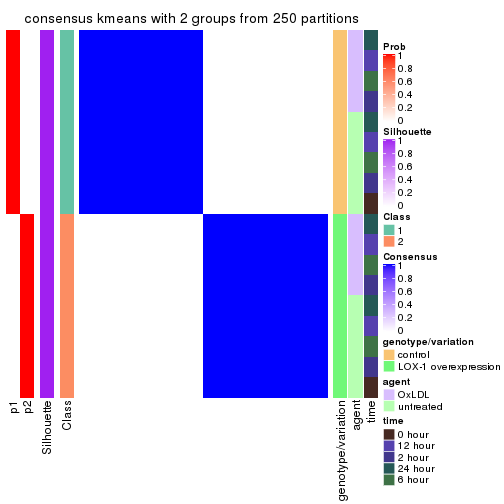</p>

</div>
<div id='tab-MAD-kmeans-consensus-heatmap-2'>
<pre><code class="r">consensus_heatmap(res, k = 3)
</code></pre>

<p>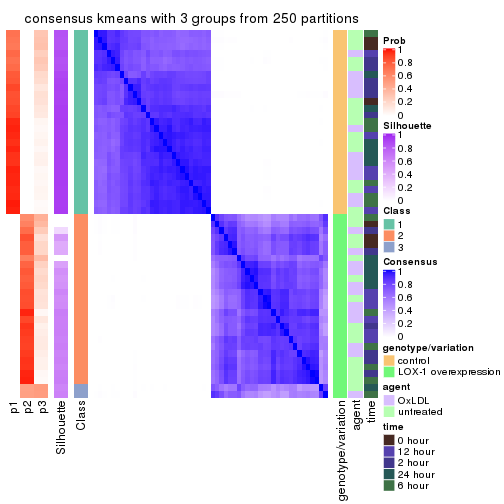</p>

</div>
<div id='tab-MAD-kmeans-consensus-heatmap-3'>
<pre><code class="r">consensus_heatmap(res, k = 4)
</code></pre>

<p>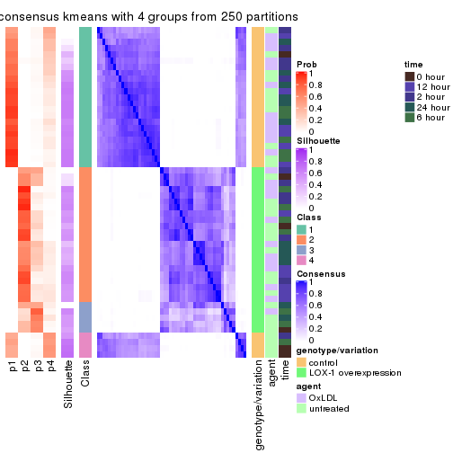</p>

</div>
<div id='tab-MAD-kmeans-consensus-heatmap-4'>
<pre><code class="r">consensus_heatmap(res, k = 5)
</code></pre>

<p>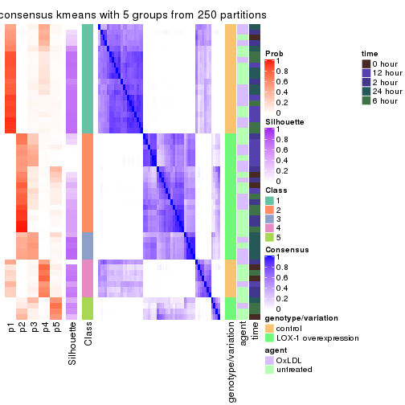</p>

</div>
<div id='tab-MAD-kmeans-consensus-heatmap-5'>
<pre><code class="r">consensus_heatmap(res, k = 6)
</code></pre>

<p>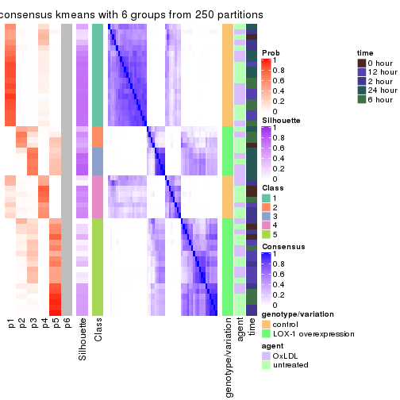</p>

</div>
</div>

Heatmaps for the membership of samples in all partitions to see how consistent they are:


<script>
$( function() {
	$( '#tabs-MAD-kmeans-membership-heatmap' ).tabs();
} );
</script>
<div id='tabs-MAD-kmeans-membership-heatmap'>
<ul>
<li><a href='#tab-MAD-kmeans-membership-heatmap-1'>k = 2</a></li>
<li><a href='#tab-MAD-kmeans-membership-heatmap-2'>k = 3</a></li>
<li><a href='#tab-MAD-kmeans-membership-heatmap-3'>k = 4</a></li>
<li><a href='#tab-MAD-kmeans-membership-heatmap-4'>k = 5</a></li>
<li><a href='#tab-MAD-kmeans-membership-heatmap-5'>k = 6</a></li>
</ul>
<div id='tab-MAD-kmeans-membership-heatmap-1'>
<pre><code class="r">membership_heatmap(res, k = 2)
</code></pre>

<p>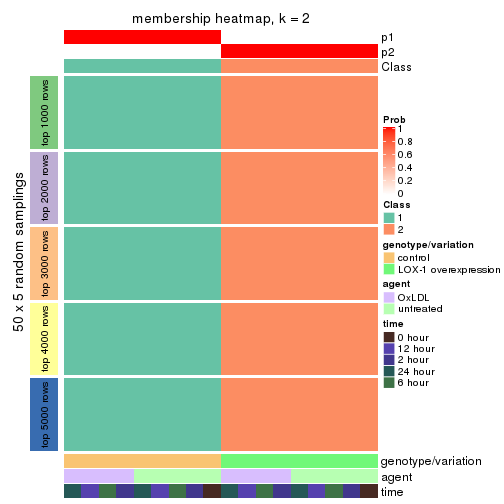</p>

</div>
<div id='tab-MAD-kmeans-membership-heatmap-2'>
<pre><code class="r">membership_heatmap(res, k = 3)
</code></pre>

<p>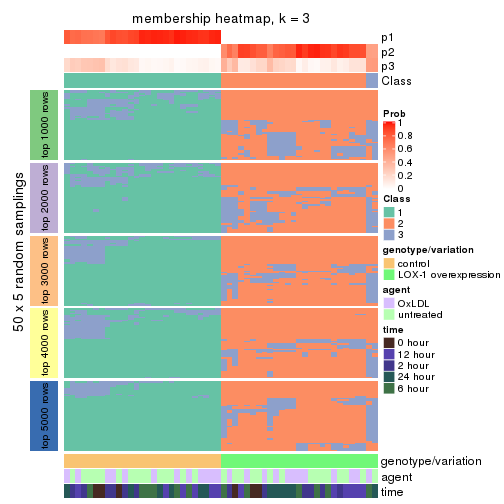</p>

</div>
<div id='tab-MAD-kmeans-membership-heatmap-3'>
<pre><code class="r">membership_heatmap(res, k = 4)
</code></pre>

<p>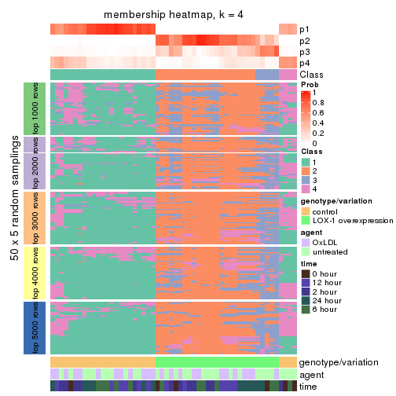</p>

</div>
<div id='tab-MAD-kmeans-membership-heatmap-4'>
<pre><code class="r">membership_heatmap(res, k = 5)
</code></pre>

<p>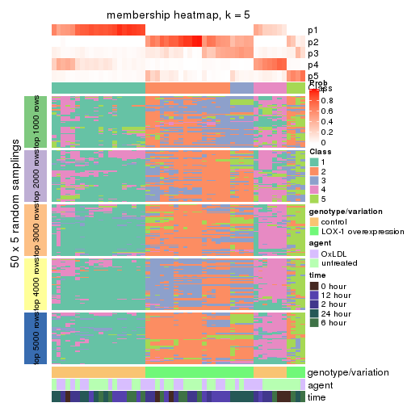</p>

</div>
<div id='tab-MAD-kmeans-membership-heatmap-5'>
<pre><code class="r">membership_heatmap(res, k = 6)
</code></pre>

<p>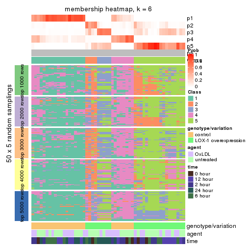</p>

</div>
</div>

As soon as we have had the classes for columns, we can look for signatures
which are significantly different between classes which can be candidate marks
for certain classes. Following are the heatmaps for signatures.


Signature heatmaps where rows are scaled:


<script>
$( function() {
	$( '#tabs-MAD-kmeans-get-signatures' ).tabs();
} );
</script>
<div id='tabs-MAD-kmeans-get-signatures'>
<ul>
<li><a href='#tab-MAD-kmeans-get-signatures-1'>k = 2</a></li>
<li><a href='#tab-MAD-kmeans-get-signatures-2'>k = 3</a></li>
<li><a href='#tab-MAD-kmeans-get-signatures-3'>k = 4</a></li>
<li><a href='#tab-MAD-kmeans-get-signatures-4'>k = 5</a></li>
<li><a href='#tab-MAD-kmeans-get-signatures-5'>k = 6</a></li>
</ul>
<div id='tab-MAD-kmeans-get-signatures-1'>
<pre><code class="r">get_signatures(res, k = 2)
</code></pre>

<p></p>

</div>
<div id='tab-MAD-kmeans-get-signatures-2'>
<pre><code class="r">get_signatures(res, k = 3)
</code></pre>

<p>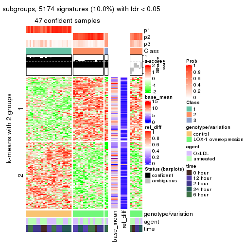</p>

</div>
<div id='tab-MAD-kmeans-get-signatures-3'>
<pre><code class="r">get_signatures(res, k = 4)
</code></pre>

<p>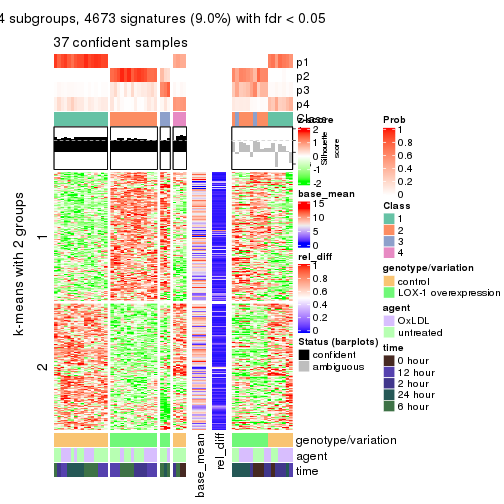</p>

</div>
<div id='tab-MAD-kmeans-get-signatures-4'>
<pre><code class="r">get_signatures(res, k = 5)
</code></pre>

<p>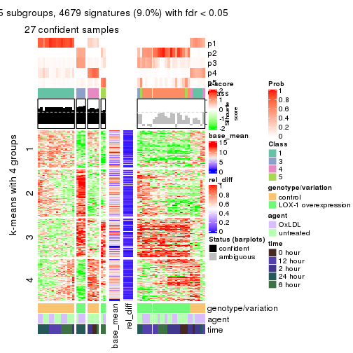</p>

</div>
<div id='tab-MAD-kmeans-get-signatures-5'>
<pre><code class="r">get_signatures(res, k = 6)
</code></pre>

<p>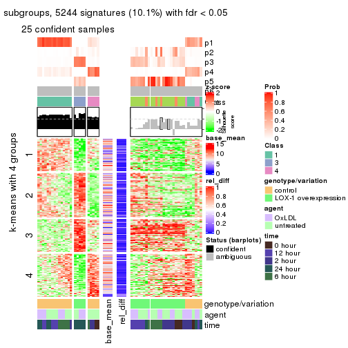</p>

</div>
</div>


Signature heatmaps where rows are not scaled:


<script>
$( function() {
	$( '#tabs-MAD-kmeans-get-signatures-no-scale' ).tabs();
} );
</script>
<div id='tabs-MAD-kmeans-get-signatures-no-scale'>
<ul>
<li><a href='#tab-MAD-kmeans-get-signatures-no-scale-1'>k = 2</a></li>
<li><a href='#tab-MAD-kmeans-get-signatures-no-scale-2'>k = 3</a></li>
<li><a href='#tab-MAD-kmeans-get-signatures-no-scale-3'>k = 4</a></li>
<li><a href='#tab-MAD-kmeans-get-signatures-no-scale-4'>k = 5</a></li>
<li><a href='#tab-MAD-kmeans-get-signatures-no-scale-5'>k = 6</a></li>
</ul>
<div id='tab-MAD-kmeans-get-signatures-no-scale-1'>
<pre><code class="r">get_signatures(res, k = 2, scale_rows = FALSE)
</code></pre>

<p></p>

</div>
<div id='tab-MAD-kmeans-get-signatures-no-scale-2'>
<pre><code class="r">get_signatures(res, k = 3, scale_rows = FALSE)
</code></pre>

<p>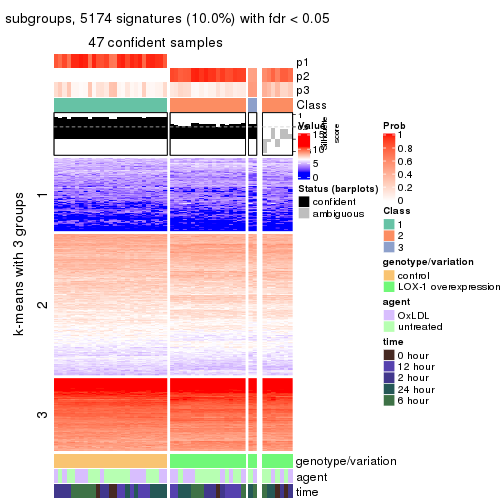</p>

</div>
<div id='tab-MAD-kmeans-get-signatures-no-scale-3'>
<pre><code class="r">get_signatures(res, k = 4, scale_rows = FALSE)
</code></pre>

<p>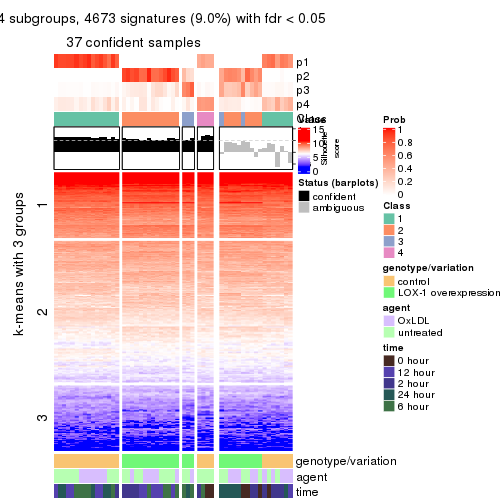</p>

</div>
<div id='tab-MAD-kmeans-get-signatures-no-scale-4'>
<pre><code class="r">get_signatures(res, k = 5, scale_rows = FALSE)
</code></pre>

<p>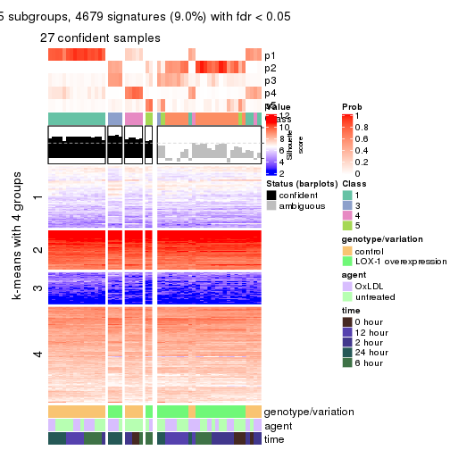</p>

</div>
<div id='tab-MAD-kmeans-get-signatures-no-scale-5'>
<pre><code class="r">get_signatures(res, k = 6, scale_rows = FALSE)
</code></pre>

<p>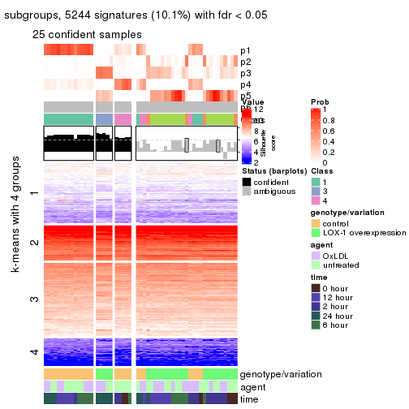</p>

</div>
</div>


Compare the overlap of signatures from different k:

```r
compare_signatures(res)
```

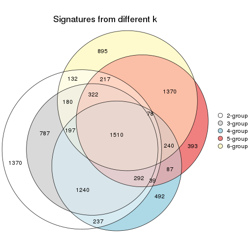

`get_signature()` returns a data frame invisibly. TO get the list of signatures, the function
call should be assigned to a variable explicitly. In following code, if `plot` argument is set
to `FALSE`, no heatmap is plotted while only the differential analysis is performed.

```r
# code only for demonstration
tb = get_signature(res, k = ..., plot = FALSE)
```

An example of the output of `tb` is:

```
#>   which_row         fdr    mean_1    mean_2 scaled_mean_1 scaled_mean_2 km
#> 1        38 0.042760348  8.373488  9.131774    -0.5533452     0.5164555  1
#> 2        40 0.018707592  7.106213  8.469186    -0.6173731     0.5762149  1
#> 3        55 0.019134737 10.221463 11.207825    -0.6159697     0.5749050  1
#> 4        59 0.006059896  5.921854  7.869574    -0.6899429     0.6439467  1
#> 5        60 0.018055526  8.928898 10.211722    -0.6204761     0.5791110  1
#> 6        98 0.009384629 15.714769 14.887706     0.6635654    -0.6193277  2
...
```

The columns in `tb` are:

1. `which_row`: row indices corresponding to the input matrix.
2. `fdr`: FDR for the differential test. 
3. `mean_x`: The mean value in group x.
4. `scaled_mean_x`: The mean value in group x after rows are scaled.
5. `km`: Row groups if k-means clustering is applied to rows.


UMAP plot which shows how samples are separated.


<script>
$( function() {
	$( '#tabs-MAD-kmeans-dimension-reduction' ).tabs();
} );
</script>
<div id='tabs-MAD-kmeans-dimension-reduction'>
<ul>
<li><a href='#tab-MAD-kmeans-dimension-reduction-1'>k = 2</a></li>
<li><a href='#tab-MAD-kmeans-dimension-reduction-2'>k = 3</a></li>
<li><a href='#tab-MAD-kmeans-dimension-reduction-3'>k = 4</a></li>
<li><a href='#tab-MAD-kmeans-dimension-reduction-4'>k = 5</a></li>
<li><a href='#tab-MAD-kmeans-dimension-reduction-5'>k = 6</a></li>
</ul>
<div id='tab-MAD-kmeans-dimension-reduction-1'>
<pre><code class="r">dimension_reduction(res, k = 2, method = &quot;UMAP&quot;)
</code></pre>

<p>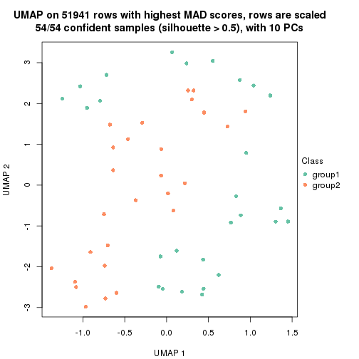</p>

</div>
<div id='tab-MAD-kmeans-dimension-reduction-2'>
<pre><code class="r">dimension_reduction(res, k = 3, method = &quot;UMAP&quot;)
</code></pre>

<p>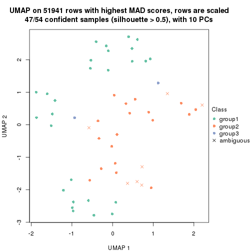</p>

</div>
<div id='tab-MAD-kmeans-dimension-reduction-3'>
<pre><code class="r">dimension_reduction(res, k = 4, method = &quot;UMAP&quot;)
</code></pre>

<p>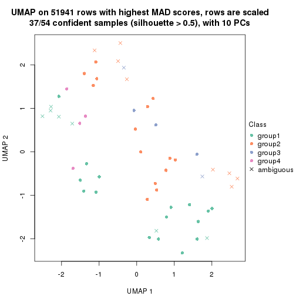</p>

</div>
<div id='tab-MAD-kmeans-dimension-reduction-4'>
<pre><code class="r">dimension_reduction(res, k = 5, method = &quot;UMAP&quot;)
</code></pre>

<p>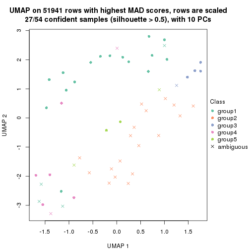</p>

</div>
<div id='tab-MAD-kmeans-dimension-reduction-5'>
<pre><code class="r">dimension_reduction(res, k = 6, method = &quot;UMAP&quot;)
</code></pre>

<p>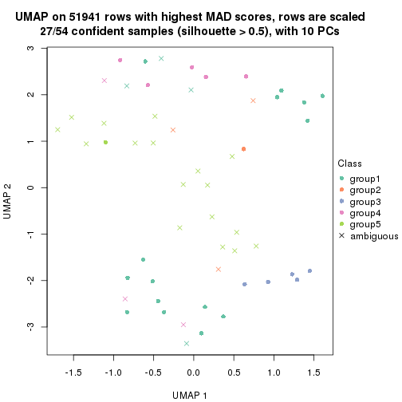</p>

</div>
</div>


Following heatmap shows how subgroups are split when increasing `k`:

```r
collect_classes(res)
```

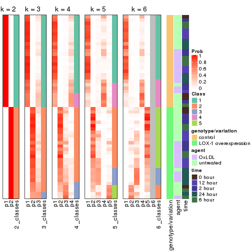


Test correlation between subgroups and known annotations. If the known
annotation is numeric, one-way ANOVA test is applied, and if the known
annotation is discrete, chi-squared contingency table test is applied.

```r
test_to_known_factors(res)
```

```
#>             n genotype/variation(p) agent(p) time(p) k
#> MAD:kmeans 54              1.48e-12    1.000 1.00000 2
#> MAD:kmeans 47              6.22e-11    0.988 0.88581 3
#> MAD:kmeans 37              4.60e-08    0.416 0.00356 4
#> MAD:kmeans 27              5.89e-06    0.138 0.00345 5
#> MAD:kmeans 27              1.99e-05    0.161 0.00443 6
```


If matrix rows can be associated to genes, consider to use `functional_enrichment(res,
...)` to perform function enrichment for the signature genes. See [this vignette](http://bioconductor.org/packages/devel/bioc/vignettes/cola/inst/doc/functional_enrichment.html) for more detailed explanations.


 

---------------------------------------------------


### MAD:skmeans


The object with results only for a single top-value method and a single partition method 
can be extracted as:

```r
res = res_list["MAD", "skmeans"]
# you can also extract it by
# res = res_list["MAD:skmeans"]
```

A summary of `res` and all the functions that can be applied to it:

```r
res
```

```
#> A 'ConsensusPartition' object with k = 2, 3, 4, 5, 6.
#>   On a matrix with 51941 rows and 54 columns.
#>   Top rows (1000, 2000, 3000, 4000, 5000) are extracted by 'MAD' method.
#>   Subgroups are detected by 'skmeans' method.
#>   Performed in total 1250 partitions by row resampling.
#>   Best k for subgroups seems to be 2.
#> 
#> Following methods can be applied to this 'ConsensusPartition' object:
#>  [1] "cola_report"             "collect_classes"         "collect_plots"          
#>  [4] "collect_stats"           "colnames"                "compare_signatures"     
#>  [7] "consensus_heatmap"       "dimension_reduction"     "functional_enrichment"  
#> [10] "get_anno_col"            "get_anno"                "get_classes"            
#> [13] "get_consensus"           "get_matrix"              "get_membership"         
#> [16] "get_param"               "get_signatures"          "get_stats"              
#> [19] "is_best_k"               "is_stable_k"             "membership_heatmap"     
#> [22] "ncol"                    "nrow"                    "plot_ecdf"              
#> [25] "rownames"                "select_partition_number" "show"                   
#> [28] "suggest_best_k"          "test_to_known_factors"
```

`collect_plots()` function collects all the plots made from `res` for all `k` (number of partitions)
into one single page to provide an easy and fast comparison between different `k`.

```r
collect_plots(res)
```

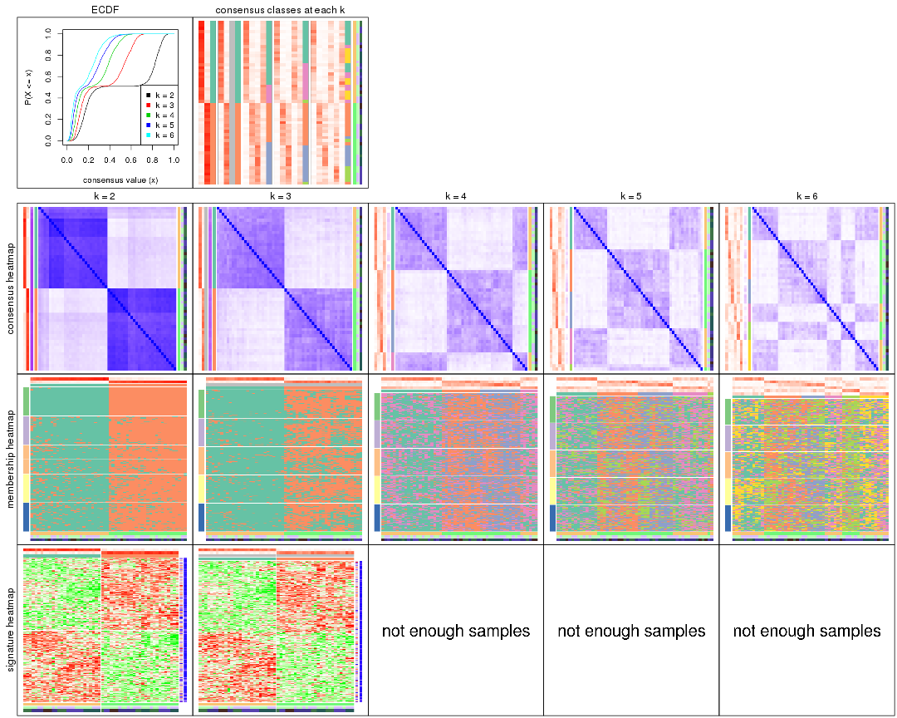

The plots are:

- The first row: a plot of the ECDF (empirical cumulative distribution
  function) curves of the consensus matrix for each `k` and the heatmap of
  predicted classes for each `k`.
- The second row: heatmaps of the consensus matrix for each `k`.
- The third row: heatmaps of the membership matrix for each `k`.
- The fouth row: heatmaps of the signatures for each `k`.

All the plots in panels can be made by individual functions and they are
plotted later in this section.

`select_partition_number()` produces several plots showing different
statistics for choosing "optimized" `k`. There are following statistics:

- ECDF curves of the consensus matrix for each `k`;
- 1-PAC. [The PAC
  score](https://en.wikipedia.org/wiki/Consensus_clustering#Over-interpretation_potential_of_consensus_clustering)
  measures the proportion of the ambiguous subgrouping.
- Mean silhouette score.
- Concordance. The mean probability of fiting the consensus class ids in all
  partitions.
- Area increased. Denote $A_k$ as the area under the ECDF curve for current
  `k`, the area increased is defined as $A_k - A_{k-1}$.
- Rand index. The percent of pairs of samples that are both in a same cluster
  or both are not in a same cluster in the partition of k and k-1.
- Jaccard index. The ratio of pairs of samples are both in a same cluster in
  the partition of k and k-1 and the pairs of samples are both in a same
  cluster in the partition k or k-1.

The detailed explanations of these statistics can be found in [the _cola_
vignette](http://bioconductor.org/packages/devel/bioc/vignettes/cola/inst/doc/cola.html#toc_13).

Generally speaking, lower PAC score, higher mean silhouette score or higher
concordance corresponds to better partition. Rand index and Jaccard index
measure how similar the current partition is compared to partition with `k-1`.
If they are too similar, we won't accept `k` is better than `k-1`.

```r
select_partition_number(res)
```

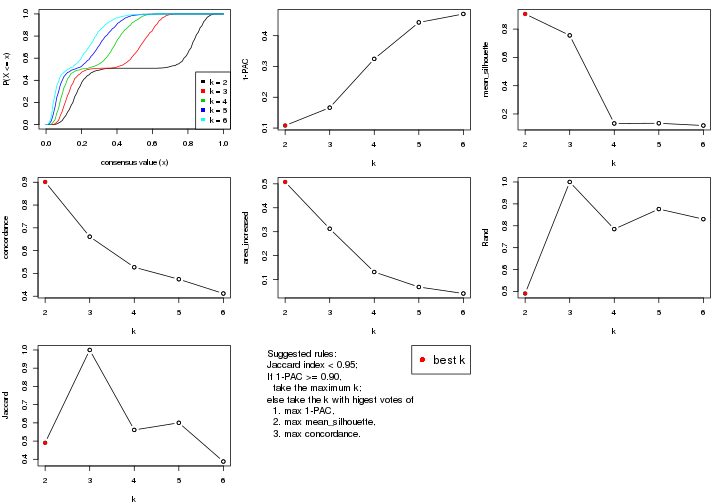

The numeric values for all these statistics can be obtained by `get_stats()`.

```r
get_stats(res)
```

```
#>   k 1-PAC mean_silhouette concordance area_increased  Rand Jaccard
#> 2 2 0.108           0.907       0.901         0.5077 0.491   0.491
#> 3 3 0.166           0.755       0.661         0.3123 1.000   1.000
#> 4 4 0.325           0.133       0.527         0.1316 0.785   0.561
#> 5 5 0.443           0.134       0.475         0.0690 0.876   0.600
#> 6 6 0.471           0.118       0.412         0.0418 0.830   0.388
```

`suggest_best_k()` suggests the best $k$ based on these statistics. The rules are as follows:

- All $k$ with Jaccard index larger than 0.95 are removed because increasing
  $k$ does not provide enough extra information. If all $k$ are removed, it is
  marked as no subgroup is detected.
- For all $k$ with 1-PAC score larger than 0.9, the maximal $k$ is taken as
  the best $k$, and other $k$ are marked as optional $k$.
- If it does not fit the second rule. The $k$ with the maximal vote of the
  highest 1-PAC score, highest mean silhouette, and highest concordance is
  taken as the best $k$.

```r
suggest_best_k(res)
```

```
#> [1] 2
```


Following shows the table of the partitions (You need to click the **show/hide
code output** link to see it). The membership matrix (columns with name `p*`)
is inferred by
[`clue::cl_consensus()`](https://www.rdocumentation.org/link/cl_consensus?package=clue)
function with the `SE` method. Basically the value in the membership matrix
represents the probability to belong to a certain group. The finall class
label for an item is determined with the group with highest probability it
belongs to.

In `get_classes()` function, the entropy is calculated from the membership
matrix and the silhouette score is calculated from the consensus matrix.


<script>
$( function() {
	$( '#tabs-MAD-skmeans-get-classes' ).tabs();
} );
</script>
<div id='tabs-MAD-skmeans-get-classes'>
<ul>
<li><a href='#tab-MAD-skmeans-get-classes-1'>k = 2</a></li>
<li><a href='#tab-MAD-skmeans-get-classes-2'>k = 3</a></li>
<li><a href='#tab-MAD-skmeans-get-classes-3'>k = 4</a></li>
<li><a href='#tab-MAD-skmeans-get-classes-4'>k = 5</a></li>
<li><a href='#tab-MAD-skmeans-get-classes-5'>k = 6</a></li>
</ul>

<div id='tab-MAD-skmeans-get-classes-1'>
<p><a id='tab-MAD-skmeans-get-classes-1-a' style='color:#0366d6' href='#'>show/hide code output</a></p>
<pre><code class="r">cbind(get_classes(res, k = 2), get_membership(res, k = 2))
</code></pre>

<pre><code>#&gt;           class entropy silhouette    p1    p2
#&gt; GSM329068     2  0.2778      0.928 0.048 0.952
#&gt; GSM329074     2  0.4562      0.927 0.096 0.904
#&gt; GSM329100     2  0.5519      0.912 0.128 0.872
#&gt; GSM329062     2  0.3114      0.930 0.056 0.944
#&gt; GSM329079     2  0.5629      0.908 0.132 0.868
#&gt; GSM329090     2  0.4431      0.928 0.092 0.908
#&gt; GSM329066     2  0.4022      0.932 0.080 0.920
#&gt; GSM329086     2  0.6887      0.851 0.184 0.816
#&gt; GSM329099     2  0.4431      0.930 0.092 0.908
#&gt; GSM329071     2  0.3114      0.929 0.056 0.944
#&gt; GSM329078     2  0.4022      0.929 0.080 0.920
#&gt; GSM329081     2  0.6623      0.869 0.172 0.828
#&gt; GSM329096     2  0.2236      0.924 0.036 0.964
#&gt; GSM329102     2  0.2778      0.925 0.048 0.952
#&gt; GSM329104     2  0.6623      0.869 0.172 0.828
#&gt; GSM329067     2  0.5408      0.916 0.124 0.876
#&gt; GSM329072     2  0.5946      0.894 0.144 0.856
#&gt; GSM329075     2  0.4022      0.933 0.080 0.920
#&gt; GSM329058     2  0.5842      0.903 0.140 0.860
#&gt; GSM329073     2  0.4939      0.922 0.108 0.892
#&gt; GSM329107     2  0.3114      0.930 0.056 0.944
#&gt; GSM329057     2  0.1843      0.919 0.028 0.972
#&gt; GSM329085     2  0.5629      0.908 0.132 0.868
#&gt; GSM329089     2  0.4161      0.929 0.084 0.916
#&gt; GSM329076     2  0.4690      0.926 0.100 0.900
#&gt; GSM329094     2  0.4161      0.930 0.084 0.916
#&gt; GSM329105     2  0.1843      0.916 0.028 0.972
#&gt; GSM329056     1  0.3879      0.924 0.924 0.076
#&gt; GSM329069     1  0.3431      0.924 0.936 0.064
#&gt; GSM329077     1  0.5629      0.901 0.868 0.132
#&gt; GSM329070     1  0.3879      0.924 0.924 0.076
#&gt; GSM329082     1  0.7602      0.803 0.780 0.220
#&gt; GSM329092     1  0.7139      0.835 0.804 0.196
#&gt; GSM329083     1  0.4690      0.920 0.900 0.100
#&gt; GSM329101     1  0.2603      0.918 0.956 0.044
#&gt; GSM329106     1  0.2423      0.915 0.960 0.040
#&gt; GSM329087     1  0.4298      0.921 0.912 0.088
#&gt; GSM329091     1  0.0938      0.902 0.988 0.012
#&gt; GSM329093     1  0.5629      0.903 0.868 0.132
#&gt; GSM329080     1  0.5519      0.904 0.872 0.128
#&gt; GSM329084     1  0.5629      0.901 0.868 0.132
#&gt; GSM329088     1  0.4431      0.920 0.908 0.092
#&gt; GSM329059     1  0.5408      0.905 0.876 0.124
#&gt; GSM329097     1  0.3879      0.925 0.924 0.076
#&gt; GSM329098     1  0.8608      0.687 0.716 0.284
#&gt; GSM329055     1  0.2603      0.918 0.956 0.044
#&gt; GSM329103     1  0.2423      0.916 0.960 0.040
#&gt; GSM329108     1  0.3431      0.924 0.936 0.064
#&gt; GSM329061     1  0.2948      0.921 0.948 0.052
#&gt; GSM329064     1  0.5629      0.902 0.868 0.132
#&gt; GSM329065     1  0.4022      0.924 0.920 0.080
#&gt; GSM329060     1  0.4161      0.923 0.916 0.084
#&gt; GSM329063     1  0.3733      0.924 0.928 0.072
#&gt; GSM329095     1  0.6438      0.877 0.836 0.164
</code></pre>

<script>
$('#tab-MAD-skmeans-get-classes-1-a').parent().next().next().hide();
$('#tab-MAD-skmeans-get-classes-1-a').click(function(){
  $('#tab-MAD-skmeans-get-classes-1-a').parent().next().next().toggle();
  return(false);
});
</script>
</div>

<div id='tab-MAD-skmeans-get-classes-2'>
<p><a id='tab-MAD-skmeans-get-classes-2-a' style='color:#0366d6' href='#'>show/hide code output</a></p>
<pre><code class="r">cbind(get_classes(res, k = 3), get_membership(res, k = 3))
</code></pre>

<pre><code>#&gt;           class entropy silhouette    p1    p2 p3
#&gt; GSM329068     2   0.562      0.784 0.012 0.744 NA
#&gt; GSM329074     2   0.703      0.768 0.048 0.668 NA
#&gt; GSM329100     2   0.658      0.761 0.052 0.724 NA
#&gt; GSM329062     2   0.762      0.766 0.052 0.580 NA
#&gt; GSM329079     2   0.832      0.722 0.080 0.492 NA
#&gt; GSM329090     2   0.805      0.738 0.064 0.504 NA
#&gt; GSM329066     2   0.738      0.776 0.040 0.584 NA
#&gt; GSM329086     2   0.861      0.685 0.116 0.548 NA
#&gt; GSM329099     2   0.785      0.743 0.056 0.532 NA
#&gt; GSM329071     2   0.622      0.781 0.016 0.688 NA
#&gt; GSM329078     2   0.801      0.714 0.064 0.524 NA
#&gt; GSM329081     2   0.732      0.743 0.068 0.668 NA
#&gt; GSM329096     2   0.677      0.754 0.040 0.684 NA
#&gt; GSM329102     2   0.629      0.768 0.044 0.740 NA
#&gt; GSM329104     2   0.677      0.752 0.068 0.724 NA
#&gt; GSM329067     2   0.717      0.752 0.036 0.612 NA
#&gt; GSM329072     2   0.808      0.735 0.068 0.520 NA
#&gt; GSM329075     2   0.645      0.767 0.032 0.704 NA
#&gt; GSM329058     2   0.597      0.786 0.032 0.752 NA
#&gt; GSM329073     2   0.788      0.691 0.080 0.612 NA
#&gt; GSM329107     2   0.731      0.771 0.032 0.552 NA
#&gt; GSM329057     2   0.658      0.774 0.020 0.652 NA
#&gt; GSM329085     2   0.765      0.720 0.044 0.512 NA
#&gt; GSM329089     2   0.735      0.770 0.040 0.592 NA
#&gt; GSM329076     2   0.790      0.732 0.092 0.628 NA
#&gt; GSM329094     2   0.607      0.774 0.024 0.728 NA
#&gt; GSM329105     2   0.505      0.782 0.024 0.812 NA
#&gt; GSM329056     1   0.645      0.790 0.744 0.060 NA
#&gt; GSM329069     1   0.668      0.787 0.708 0.048 NA
#&gt; GSM329077     1   0.838      0.692 0.552 0.096 NA
#&gt; GSM329070     1   0.655      0.792 0.716 0.044 NA
#&gt; GSM329082     1   0.857      0.660 0.548 0.112 NA
#&gt; GSM329092     1   0.831      0.688 0.544 0.088 NA
#&gt; GSM329083     1   0.676      0.795 0.712 0.056 NA
#&gt; GSM329101     1   0.492      0.801 0.832 0.036 NA
#&gt; GSM329106     1   0.547      0.798 0.800 0.040 NA
#&gt; GSM329087     1   0.634      0.798 0.736 0.044 NA
#&gt; GSM329091     1   0.535      0.804 0.796 0.028 NA
#&gt; GSM329093     1   0.737      0.754 0.668 0.072 NA
#&gt; GSM329080     1   0.772      0.749 0.668 0.112 NA
#&gt; GSM329084     1   0.844      0.717 0.596 0.128 NA
#&gt; GSM329088     1   0.701      0.783 0.696 0.064 NA
#&gt; GSM329059     1   0.739      0.779 0.652 0.064 NA
#&gt; GSM329097     1   0.608      0.793 0.748 0.036 NA
#&gt; GSM329098     1   0.918      0.540 0.508 0.168 NA
#&gt; GSM329055     1   0.527      0.801 0.784 0.016 NA
#&gt; GSM329103     1   0.640      0.801 0.724 0.040 NA
#&gt; GSM329108     1   0.541      0.801 0.800 0.036 NA
#&gt; GSM329061     1   0.590      0.802 0.736 0.020 NA
#&gt; GSM329064     1   0.761      0.761 0.644 0.076 NA
#&gt; GSM329065     1   0.689      0.773 0.708 0.064 NA
#&gt; GSM329060     1   0.666      0.794 0.716 0.052 NA
#&gt; GSM329063     1   0.746      0.779 0.676 0.088 NA
#&gt; GSM329095     1   0.857      0.646 0.524 0.104 NA
</code></pre>

<script>
$('#tab-MAD-skmeans-get-classes-2-a').parent().next().next().hide();
$('#tab-MAD-skmeans-get-classes-2-a').click(function(){
  $('#tab-MAD-skmeans-get-classes-2-a').parent().next().next().toggle();
  return(false);
});
</script>
</div>

<div id='tab-MAD-skmeans-get-classes-3'>
<p><a id='tab-MAD-skmeans-get-classes-3-a' style='color:#0366d6' href='#'>show/hide code output</a></p>
<pre><code class="r">cbind(get_classes(res, k = 4), get_membership(res, k = 4))
</code></pre>

<pre><code>#&gt;           class entropy silhouette    p1    p2    p3    p4
#&gt; GSM329068     2   0.705    0.11576 0.008 0.520 0.372 0.100
#&gt; GSM329074     2   0.806    0.14341 0.036 0.452 0.376 0.136
#&gt; GSM329100     3   0.780   -0.10118 0.024 0.384 0.460 0.132
#&gt; GSM329062     2   0.722    0.19528 0.024 0.572 0.304 0.100
#&gt; GSM329079     2   0.723    0.21715 0.052 0.596 0.284 0.068
#&gt; GSM329090     2   0.801    0.01910 0.028 0.464 0.356 0.152
#&gt; GSM329066     2   0.731    0.15621 0.028 0.476 0.420 0.076
#&gt; GSM329086     2   0.871    0.09392 0.060 0.436 0.320 0.184
#&gt; GSM329099     2   0.704    0.25383 0.044 0.612 0.276 0.068
#&gt; GSM329071     3   0.719    0.05082 0.016 0.384 0.508 0.092
#&gt; GSM329078     3   0.756    0.16542 0.056 0.288 0.572 0.084
#&gt; GSM329081     3   0.846   -0.04923 0.036 0.360 0.408 0.196
#&gt; GSM329096     3   0.632    0.25431 0.036 0.156 0.712 0.096
#&gt; GSM329102     3   0.723    0.09137 0.040 0.292 0.588 0.080
#&gt; GSM329104     3   0.805    0.16102 0.068 0.232 0.564 0.136
#&gt; GSM329067     2   0.721    0.09876 0.008 0.460 0.424 0.108
#&gt; GSM329072     2   0.862    0.12291 0.076 0.464 0.316 0.144
#&gt; GSM329075     2   0.791    0.08474 0.032 0.432 0.412 0.124
#&gt; GSM329058     2   0.743    0.09694 0.024 0.496 0.384 0.096
#&gt; GSM329073     3   0.777   -0.03333 0.024 0.364 0.480 0.132
#&gt; GSM329107     2   0.722    0.13211 0.056 0.568 0.324 0.052
#&gt; GSM329057     3   0.665    0.16669 0.024 0.292 0.620 0.064
#&gt; GSM329085     3   0.801    0.10778 0.072 0.364 0.484 0.080
#&gt; GSM329089     3   0.683    0.16599 0.004 0.296 0.584 0.116
#&gt; GSM329076     3   0.575    0.25508 0.040 0.156 0.748 0.056
#&gt; GSM329094     3   0.578    0.23509 0.012 0.156 0.732 0.100
#&gt; GSM329105     3   0.547    0.22410 0.008 0.208 0.728 0.056
#&gt; GSM329056     1   0.782   -0.00603 0.436 0.100 0.040 0.424
#&gt; GSM329069     4   0.647    0.08322 0.324 0.056 0.016 0.604
#&gt; GSM329077     4   0.841    0.18903 0.296 0.140 0.068 0.496
#&gt; GSM329070     1   0.803   -0.03422 0.444 0.096 0.056 0.404
#&gt; GSM329082     1   0.870   -0.00462 0.392 0.172 0.060 0.376
#&gt; GSM329092     4   0.853    0.12558 0.320 0.112 0.092 0.476
#&gt; GSM329083     4   0.702    0.00760 0.452 0.060 0.024 0.464
#&gt; GSM329101     1   0.663    0.22221 0.660 0.076 0.032 0.232
#&gt; GSM329106     1   0.595    0.24787 0.704 0.068 0.016 0.212
#&gt; GSM329087     1   0.641    0.22813 0.592 0.028 0.032 0.348
#&gt; GSM329091     1   0.551    0.23270 0.720 0.024 0.028 0.228
#&gt; GSM329093     1   0.738    0.25064 0.628 0.104 0.060 0.208
#&gt; GSM329080     1   0.762    0.20296 0.584 0.068 0.084 0.264
#&gt; GSM329084     1   0.854    0.06985 0.440 0.088 0.108 0.364
#&gt; GSM329088     1   0.720    0.24091 0.600 0.048 0.072 0.280
#&gt; GSM329059     4   0.794    0.07528 0.368 0.092 0.056 0.484
#&gt; GSM329097     1   0.751   -0.00604 0.460 0.092 0.028 0.420
#&gt; GSM329098     4   0.874    0.12358 0.256 0.252 0.052 0.440
#&gt; GSM329055     1   0.603    0.23217 0.664 0.036 0.024 0.276
#&gt; GSM329103     1   0.656    0.21896 0.636 0.048 0.036 0.280
#&gt; GSM329108     1   0.609    0.27386 0.692 0.064 0.020 0.224
#&gt; GSM329061     1   0.662    0.27396 0.672 0.088 0.032 0.208
#&gt; GSM329064     1   0.839   -0.01153 0.428 0.084 0.096 0.392
#&gt; GSM329065     1   0.727    0.26493 0.632 0.104 0.052 0.212
#&gt; GSM329060     1   0.762    0.17202 0.552 0.064 0.072 0.312
#&gt; GSM329063     1   0.743    0.00264 0.492 0.048 0.060 0.400
#&gt; GSM329095     1   0.891    0.07376 0.436 0.124 0.116 0.324
</code></pre>

<script>
$('#tab-MAD-skmeans-get-classes-3-a').parent().next().next().hide();
$('#tab-MAD-skmeans-get-classes-3-a').click(function(){
  $('#tab-MAD-skmeans-get-classes-3-a').parent().next().next().toggle();
  return(false);
});
</script>
</div>

<div id='tab-MAD-skmeans-get-classes-4'>
<p><a id='tab-MAD-skmeans-get-classes-4-a' style='color:#0366d6' href='#'>show/hide code output</a></p>
<pre><code class="r">cbind(get_classes(res, k = 5), get_membership(res, k = 5))
</code></pre>

<pre><code>#&gt;           class entropy silhouette    p1    p2    p3    p4    p5
#&gt; GSM329068     2   0.696    0.20403 0.016 0.536 0.260 0.016 0.172
#&gt; GSM329074     2   0.762    0.21825 0.012 0.500 0.236 0.060 0.192
#&gt; GSM329100     2   0.808    0.14251 0.020 0.384 0.256 0.048 0.292
#&gt; GSM329062     2   0.629    0.26855 0.024 0.668 0.172 0.036 0.100
#&gt; GSM329079     2   0.598    0.24513 0.024 0.668 0.196 0.012 0.100
#&gt; GSM329090     2   0.797    0.03573 0.032 0.452 0.272 0.044 0.200
#&gt; GSM329066     2   0.710    0.18895 0.032 0.556 0.264 0.028 0.120
#&gt; GSM329086     2   0.913    0.09277 0.068 0.328 0.248 0.096 0.260
#&gt; GSM329099     2   0.479    0.31440 0.028 0.788 0.104 0.020 0.060
#&gt; GSM329071     3   0.764    0.00571 0.028 0.376 0.396 0.024 0.176
#&gt; GSM329078     3   0.757    0.22487 0.028 0.196 0.528 0.044 0.204
#&gt; GSM329081     5   0.854   -0.18521 0.040 0.216 0.324 0.068 0.352
#&gt; GSM329096     3   0.615    0.31222 0.024 0.124 0.684 0.032 0.136
#&gt; GSM329102     3   0.691    0.15613 0.016 0.252 0.572 0.036 0.124
#&gt; GSM329104     3   0.808    0.16243 0.072 0.196 0.500 0.040 0.192
#&gt; GSM329067     2   0.791    0.15229 0.024 0.452 0.296 0.056 0.172
#&gt; GSM329072     2   0.807    0.15025 0.032 0.484 0.248 0.080 0.156
#&gt; GSM329075     2   0.801    0.11638 0.020 0.380 0.320 0.044 0.236
#&gt; GSM329058     2   0.821    0.06645 0.052 0.372 0.344 0.032 0.200
#&gt; GSM329073     3   0.800    0.05194 0.024 0.260 0.444 0.052 0.220
#&gt; GSM329107     2   0.715    0.11965 0.012 0.516 0.272 0.028 0.172
#&gt; GSM329057     3   0.678    0.24104 0.020 0.212 0.572 0.012 0.184
#&gt; GSM329085     3   0.781    0.16335 0.032 0.280 0.488 0.056 0.144
#&gt; GSM329089     3   0.816    0.09277 0.020 0.292 0.404 0.064 0.220
#&gt; GSM329076     3   0.617    0.29852 0.060 0.152 0.692 0.028 0.068
#&gt; GSM329094     3   0.659    0.25618 0.020 0.168 0.636 0.036 0.140
#&gt; GSM329105     3   0.566    0.27459 0.016 0.184 0.692 0.012 0.096
#&gt; GSM329056     1   0.826    0.00123 0.352 0.064 0.024 0.348 0.212
#&gt; GSM329069     4   0.650    0.10916 0.212 0.036 0.012 0.624 0.116
#&gt; GSM329077     4   0.876    0.16065 0.244 0.096 0.036 0.356 0.268
#&gt; GSM329070     4   0.735    0.08137 0.268 0.040 0.024 0.528 0.140
#&gt; GSM329082     4   0.882    0.03432 0.324 0.112 0.036 0.324 0.204
#&gt; GSM329092     4   0.837    0.16504 0.168 0.064 0.068 0.476 0.224
#&gt; GSM329083     4   0.744    0.04148 0.356 0.032 0.012 0.428 0.172
#&gt; GSM329101     1   0.648    0.19402 0.556 0.024 0.012 0.324 0.084
#&gt; GSM329106     1   0.681    0.21027 0.608 0.040 0.028 0.224 0.100
#&gt; GSM329087     1   0.693    0.12893 0.448 0.008 0.032 0.404 0.108
#&gt; GSM329091     1   0.654    0.15441 0.452 0.008 0.016 0.428 0.096
#&gt; GSM329093     1   0.792    0.18001 0.468 0.056 0.032 0.288 0.156
#&gt; GSM329080     1   0.696    0.17767 0.636 0.044 0.060 0.152 0.108
#&gt; GSM329084     1   0.756    0.10732 0.464 0.004 0.068 0.304 0.160
#&gt; GSM329088     1   0.667    0.21392 0.660 0.036 0.056 0.120 0.128
#&gt; GSM329059     4   0.863    0.08783 0.268 0.072 0.048 0.392 0.220
#&gt; GSM329097     4   0.840    0.02758 0.336 0.072 0.028 0.352 0.212
#&gt; GSM329098     5   0.941   -0.09940 0.160 0.228 0.064 0.260 0.288
#&gt; GSM329055     1   0.638    0.19453 0.600 0.016 0.012 0.252 0.120
#&gt; GSM329103     1   0.712    0.15689 0.416 0.012 0.028 0.416 0.128
#&gt; GSM329108     1   0.647    0.25172 0.632 0.040 0.024 0.228 0.076
#&gt; GSM329061     4   0.707   -0.13168 0.392 0.032 0.020 0.460 0.096
#&gt; GSM329064     4   0.730    0.12924 0.160 0.020 0.044 0.548 0.228
#&gt; GSM329065     1   0.703    0.21201 0.568 0.036 0.040 0.272 0.084
#&gt; GSM329060     1   0.749    0.13996 0.492 0.028 0.024 0.268 0.188
#&gt; GSM329063     4   0.738   -0.02343 0.408 0.020 0.040 0.416 0.116
#&gt; GSM329095     4   0.867   -0.02644 0.308 0.044 0.084 0.368 0.196
</code></pre>

<script>
$('#tab-MAD-skmeans-get-classes-4-a').parent().next().next().hide();
$('#tab-MAD-skmeans-get-classes-4-a').click(function(){
  $('#tab-MAD-skmeans-get-classes-4-a').parent().next().next().toggle();
  return(false);
});
</script>
</div>

<div id='tab-MAD-skmeans-get-classes-5'>
<p><a id='tab-MAD-skmeans-get-classes-5-a' style='color:#0366d6' href='#'>show/hide code output</a></p>
<pre><code class="r">cbind(get_classes(res, k = 6), get_membership(res, k = 6))
</code></pre>

<pre><code>#&gt;           class entropy silhouette    p1    p2    p3    p4    p5    p6
#&gt; GSM329068     2   0.782    0.15246 0.012 0.400 0.276 0.120 0.176 0.016
#&gt; GSM329074     2   0.751    0.13829 0.012 0.480 0.272 0.068 0.116 0.052
#&gt; GSM329100     2   0.849    0.07053 0.024 0.324 0.292 0.124 0.196 0.040
#&gt; GSM329062     2   0.714    0.15879 0.020 0.516 0.136 0.040 0.256 0.032
#&gt; GSM329079     2   0.648    0.22049 0.040 0.624 0.076 0.056 0.188 0.016
#&gt; GSM329090     5   0.714    0.21684 0.032 0.252 0.084 0.056 0.540 0.036
#&gt; GSM329066     2   0.750    0.13782 0.016 0.464 0.164 0.056 0.268 0.032
#&gt; GSM329086     2   0.895    0.09681 0.056 0.304 0.280 0.124 0.184 0.052
#&gt; GSM329099     2   0.566    0.28591 0.048 0.700 0.076 0.044 0.128 0.004
#&gt; GSM329071     5   0.682    0.21167 0.004 0.168 0.220 0.052 0.536 0.020
#&gt; GSM329078     5   0.543    0.36461 0.024 0.068 0.120 0.048 0.724 0.016
#&gt; GSM329081     2   0.912    0.04032 0.048 0.284 0.256 0.140 0.204 0.068
#&gt; GSM329096     3   0.696    0.09834 0.032 0.064 0.456 0.024 0.376 0.048
#&gt; GSM329102     3   0.617    0.27025 0.008 0.188 0.628 0.044 0.112 0.020
#&gt; GSM329104     3   0.787    0.18671 0.060 0.140 0.492 0.060 0.212 0.036
#&gt; GSM329067     2   0.866    0.09293 0.028 0.332 0.284 0.128 0.172 0.056
#&gt; GSM329072     2   0.837    0.07817 0.044 0.372 0.180 0.100 0.276 0.028
#&gt; GSM329075     3   0.772   -0.03718 0.008 0.344 0.372 0.092 0.156 0.028
#&gt; GSM329058     2   0.750    0.01506 0.008 0.372 0.272 0.064 0.272 0.012
#&gt; GSM329073     3   0.762    0.07446 0.020 0.256 0.468 0.088 0.144 0.024
#&gt; GSM329107     2   0.721    0.00960 0.020 0.404 0.104 0.048 0.396 0.028
#&gt; GSM329057     5   0.707    0.19732 0.008 0.160 0.276 0.056 0.484 0.016
#&gt; GSM329085     5   0.650    0.36780 0.064 0.104 0.120 0.040 0.648 0.024
#&gt; GSM329089     5   0.792    0.12280 0.028 0.124 0.272 0.084 0.448 0.044
#&gt; GSM329076     3   0.659    0.27654 0.016 0.076 0.588 0.044 0.236 0.040
#&gt; GSM329094     3   0.647    0.32040 0.024 0.128 0.624 0.040 0.160 0.024
#&gt; GSM329105     3   0.638    0.25904 0.016 0.100 0.580 0.048 0.248 0.008
#&gt; GSM329056     4   0.805    0.03483 0.244 0.068 0.024 0.344 0.028 0.292
#&gt; GSM329069     4   0.766    0.07768 0.168 0.036 0.024 0.380 0.040 0.352
#&gt; GSM329077     6   0.898   -0.03341 0.124 0.120 0.088 0.248 0.060 0.360
#&gt; GSM329070     4   0.664    0.11897 0.240 0.004 0.032 0.540 0.024 0.160
#&gt; GSM329082     1   0.918    0.00452 0.276 0.076 0.080 0.268 0.084 0.216
#&gt; GSM329092     4   0.823    0.15036 0.208 0.048 0.072 0.460 0.060 0.152
#&gt; GSM329083     6   0.799   -0.01556 0.224 0.060 0.032 0.292 0.024 0.368
#&gt; GSM329101     1   0.756    0.10263 0.436 0.032 0.032 0.252 0.024 0.224
#&gt; GSM329106     1   0.726    0.08380 0.484 0.032 0.028 0.192 0.020 0.244
#&gt; GSM329087     6   0.756    0.02340 0.328 0.004 0.052 0.160 0.052 0.404
#&gt; GSM329091     1   0.683    0.11319 0.504 0.020 0.016 0.140 0.028 0.292
#&gt; GSM329093     1   0.646    0.22224 0.664 0.040 0.048 0.068 0.068 0.112
#&gt; GSM329080     6   0.747    0.03968 0.344 0.028 0.028 0.092 0.072 0.436
#&gt; GSM329084     6   0.783    0.06298 0.260 0.024 0.072 0.100 0.072 0.472
#&gt; GSM329088     6   0.771    0.04399 0.332 0.024 0.048 0.120 0.056 0.420
#&gt; GSM329059     6   0.803    0.01472 0.132 0.068 0.044 0.252 0.048 0.456
#&gt; GSM329097     6   0.788   -0.05057 0.224 0.044 0.036 0.304 0.024 0.368
#&gt; GSM329098     4   0.934    0.03740 0.196 0.180 0.084 0.304 0.060 0.176
#&gt; GSM329055     1   0.729    0.02154 0.436 0.032 0.036 0.148 0.016 0.332
#&gt; GSM329103     1   0.717    0.17702 0.556 0.024 0.040 0.184 0.048 0.148
#&gt; GSM329108     1   0.610    0.20113 0.628 0.036 0.020 0.196 0.008 0.112
#&gt; GSM329061     1   0.668    0.17302 0.564 0.016 0.016 0.220 0.040 0.144
#&gt; GSM329064     4   0.864    0.05557 0.228 0.040 0.084 0.316 0.052 0.280
#&gt; GSM329065     1   0.749    0.11372 0.504 0.036 0.036 0.108 0.060 0.256
#&gt; GSM329060     6   0.745   -0.02450 0.336 0.020 0.020 0.144 0.060 0.420
#&gt; GSM329063     6   0.559    0.13296 0.156 0.004 0.048 0.084 0.020 0.688
#&gt; GSM329095     1   0.797    0.08041 0.424 0.012 0.040 0.112 0.152 0.260
</code></pre>

<script>
$('#tab-MAD-skmeans-get-classes-5-a').parent().next().next().hide();
$('#tab-MAD-skmeans-get-classes-5-a').click(function(){
  $('#tab-MAD-skmeans-get-classes-5-a').parent().next().next().toggle();
  return(false);
});
</script>
</div>
</div>

Heatmaps for the consensus matrix. It visualizes the probability of two
samples to be in a same group.


<script>
$( function() {
	$( '#tabs-MAD-skmeans-consensus-heatmap' ).tabs();
} );
</script>
<div id='tabs-MAD-skmeans-consensus-heatmap'>
<ul>
<li><a href='#tab-MAD-skmeans-consensus-heatmap-1'>k = 2</a></li>
<li><a href='#tab-MAD-skmeans-consensus-heatmap-2'>k = 3</a></li>
<li><a href='#tab-MAD-skmeans-consensus-heatmap-3'>k = 4</a></li>
<li><a href='#tab-MAD-skmeans-consensus-heatmap-4'>k = 5</a></li>
<li><a href='#tab-MAD-skmeans-consensus-heatmap-5'>k = 6</a></li>
</ul>
<div id='tab-MAD-skmeans-consensus-heatmap-1'>
<pre><code class="r">consensus_heatmap(res, k = 2)
</code></pre>

<p>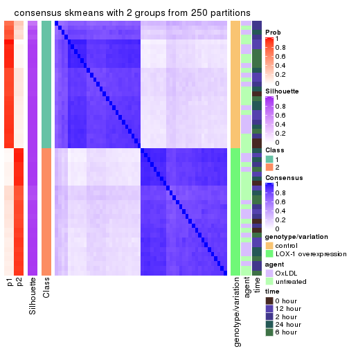</p>

</div>
<div id='tab-MAD-skmeans-consensus-heatmap-2'>
<pre><code class="r">consensus_heatmap(res, k = 3)
</code></pre>

<p>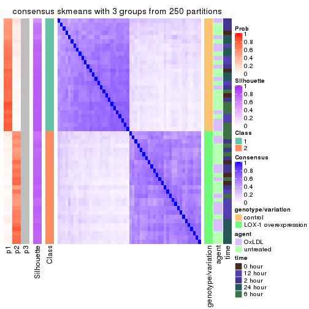</p>

</div>
<div id='tab-MAD-skmeans-consensus-heatmap-3'>
<pre><code class="r">consensus_heatmap(res, k = 4)
</code></pre>

<p>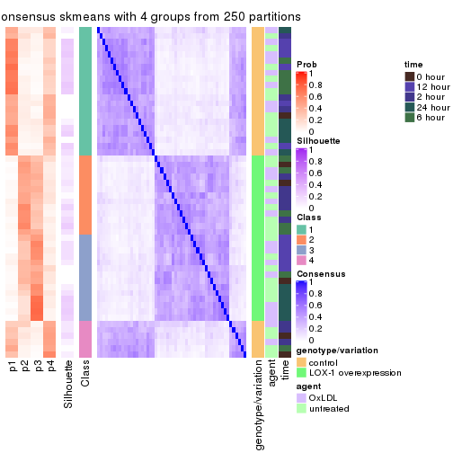</p>

</div>
<div id='tab-MAD-skmeans-consensus-heatmap-4'>
<pre><code class="r">consensus_heatmap(res, k = 5)
</code></pre>

<p>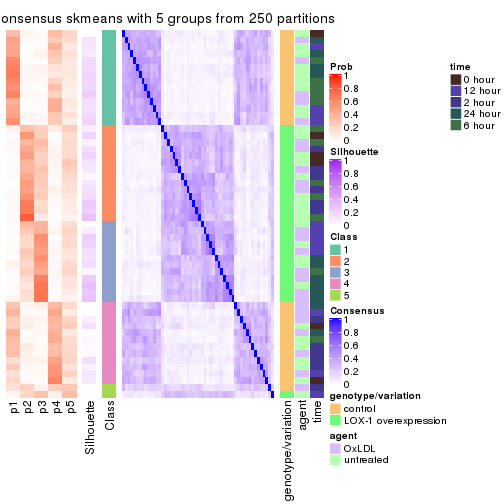</p>

</div>
<div id='tab-MAD-skmeans-consensus-heatmap-5'>
<pre><code class="r">consensus_heatmap(res, k = 6)
</code></pre>

<p>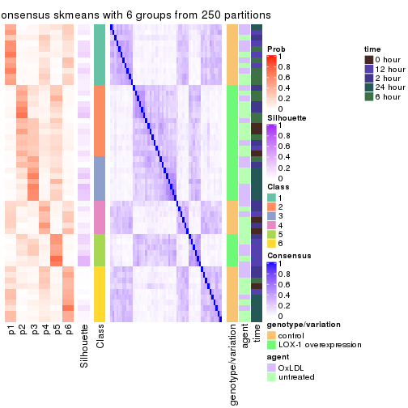</p>

</div>
</div>

Heatmaps for the membership of samples in all partitions to see how consistent they are:


<script>
$( function() {
	$( '#tabs-MAD-skmeans-membership-heatmap' ).tabs();
} );
</script>
<div id='tabs-MAD-skmeans-membership-heatmap'>
<ul>
<li><a href='#tab-MAD-skmeans-membership-heatmap-1'>k = 2</a></li>
<li><a href='#tab-MAD-skmeans-membership-heatmap-2'>k = 3</a></li>
<li><a href='#tab-MAD-skmeans-membership-heatmap-3'>k = 4</a></li>
<li><a href='#tab-MAD-skmeans-membership-heatmap-4'>k = 5</a></li>
<li><a href='#tab-MAD-skmeans-membership-heatmap-5'>k = 6</a></li>
</ul>
<div id='tab-MAD-skmeans-membership-heatmap-1'>
<pre><code class="r">membership_heatmap(res, k = 2)
</code></pre>

<p>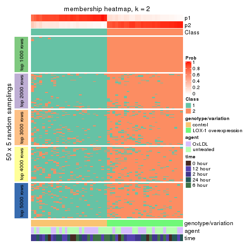</p>

</div>
<div id='tab-MAD-skmeans-membership-heatmap-2'>
<pre><code class="r">membership_heatmap(res, k = 3)
</code></pre>

<p>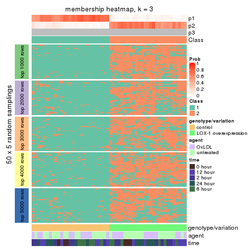</p>

</div>
<div id='tab-MAD-skmeans-membership-heatmap-3'>
<pre><code class="r">membership_heatmap(res, k = 4)
</code></pre>

<p>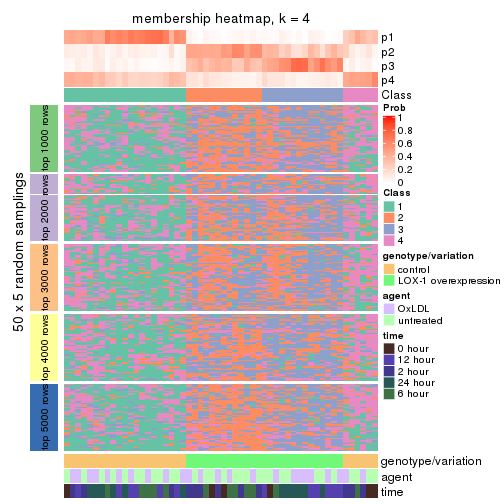</p>

</div>
<div id='tab-MAD-skmeans-membership-heatmap-4'>
<pre><code class="r">membership_heatmap(res, k = 5)
</code></pre>

<p>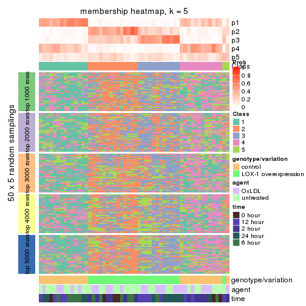</p>

</div>
<div id='tab-MAD-skmeans-membership-heatmap-5'>
<pre><code class="r">membership_heatmap(res, k = 6)
</code></pre>

<p>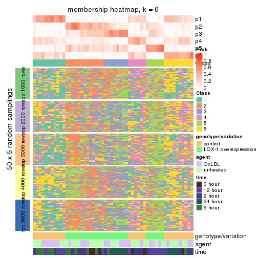</p>

</div>
</div>

As soon as we have had the classes for columns, we can look for signatures
which are significantly different between classes which can be candidate marks
for certain classes. Following are the heatmaps for signatures.


Signature heatmaps where rows are scaled:


<script>
$( function() {
	$( '#tabs-MAD-skmeans-get-signatures' ).tabs();
} );
</script>
<div id='tabs-MAD-skmeans-get-signatures'>
<ul>
<li><a href='#tab-MAD-skmeans-get-signatures-1'>k = 2</a></li>
<li><a href='#tab-MAD-skmeans-get-signatures-2'>k = 3</a></li>
<li><a href='#tab-MAD-skmeans-get-signatures-3'>k = 4</a></li>
<li><a href='#tab-MAD-skmeans-get-signatures-4'>k = 5</a></li>
<li><a href='#tab-MAD-skmeans-get-signatures-5'>k = 6</a></li>
</ul>
<div id='tab-MAD-skmeans-get-signatures-1'>
<pre><code class="r">get_signatures(res, k = 2)
</code></pre>

<p>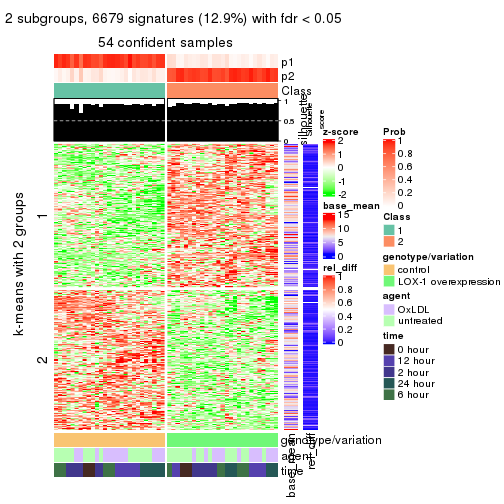</p>

</div>
<div id='tab-MAD-skmeans-get-signatures-2'>
<pre><code class="r">get_signatures(res, k = 3)
</code></pre>

<p>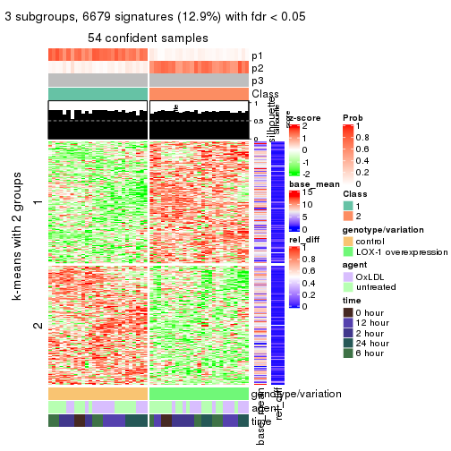</p>

</div>
<div id='tab-MAD-skmeans-get-signatures-3'>
<pre><code class="r">get_signatures(res, k = 4)
</code></pre>

<p></p>

</div>
<div id='tab-MAD-skmeans-get-signatures-4'>
<pre><code class="r">get_signatures(res, k = 5)
</code></pre>

<p></p>

</div>
<div id='tab-MAD-skmeans-get-signatures-5'>
<pre><code class="r">get_signatures(res, k = 6)
</code></pre>

<p></p>

</div>
</div>


Signature heatmaps where rows are not scaled:


<script>
$( function() {
	$( '#tabs-MAD-skmeans-get-signatures-no-scale' ).tabs();
} );
</script>
<div id='tabs-MAD-skmeans-get-signatures-no-scale'>
<ul>
<li><a href='#tab-MAD-skmeans-get-signatures-no-scale-1'>k = 2</a></li>
<li><a href='#tab-MAD-skmeans-get-signatures-no-scale-2'>k = 3</a></li>
<li><a href='#tab-MAD-skmeans-get-signatures-no-scale-3'>k = 4</a></li>
<li><a href='#tab-MAD-skmeans-get-signatures-no-scale-4'>k = 5</a></li>
<li><a href='#tab-MAD-skmeans-get-signatures-no-scale-5'>k = 6</a></li>
</ul>
<div id='tab-MAD-skmeans-get-signatures-no-scale-1'>
<pre><code class="r">get_signatures(res, k = 2, scale_rows = FALSE)
</code></pre>

<p>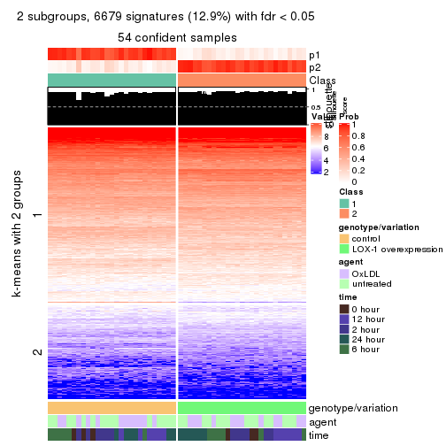</p>

</div>
<div id='tab-MAD-skmeans-get-signatures-no-scale-2'>
<pre><code class="r">get_signatures(res, k = 3, scale_rows = FALSE)
</code></pre>

<p>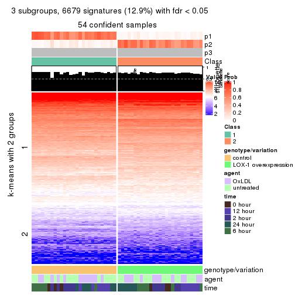</p>

</div>
<div id='tab-MAD-skmeans-get-signatures-no-scale-3'>
<pre><code class="r">get_signatures(res, k = 4, scale_rows = FALSE)
</code></pre>

<p></p>

</div>
<div id='tab-MAD-skmeans-get-signatures-no-scale-4'>
<pre><code class="r">get_signatures(res, k = 5, scale_rows = FALSE)
</code></pre>

<p></p>

</div>
<div id='tab-MAD-skmeans-get-signatures-no-scale-5'>
<pre><code class="r">get_signatures(res, k = 6, scale_rows = FALSE)
</code></pre>

<p></p>

</div>
</div>


Compare the overlap of signatures from different k:

```r
compare_signatures(res)
```

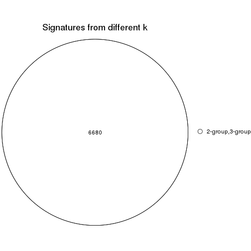

`get_signature()` returns a data frame invisibly. TO get the list of signatures, the function
call should be assigned to a variable explicitly. In following code, if `plot` argument is set
to `FALSE`, no heatmap is plotted while only the differential analysis is performed.

```r
# code only for demonstration
tb = get_signature(res, k = ..., plot = FALSE)
```

An example of the output of `tb` is:

```
#>   which_row         fdr    mean_1    mean_2 scaled_mean_1 scaled_mean_2 km
#> 1        38 0.042760348  8.373488  9.131774    -0.5533452     0.5164555  1
#> 2        40 0.018707592  7.106213  8.469186    -0.6173731     0.5762149  1
#> 3        55 0.019134737 10.221463 11.207825    -0.6159697     0.5749050  1
#> 4        59 0.006059896  5.921854  7.869574    -0.6899429     0.6439467  1
#> 5        60 0.018055526  8.928898 10.211722    -0.6204761     0.5791110  1
#> 6        98 0.009384629 15.714769 14.887706     0.6635654    -0.6193277  2
...
```

The columns in `tb` are:

1. `which_row`: row indices corresponding to the input matrix.
2. `fdr`: FDR for the differential test. 
3. `mean_x`: The mean value in group x.
4. `scaled_mean_x`: The mean value in group x after rows are scaled.
5. `km`: Row groups if k-means clustering is applied to rows.


UMAP plot which shows how samples are separated.


<script>
$( function() {
	$( '#tabs-MAD-skmeans-dimension-reduction' ).tabs();
} );
</script>
<div id='tabs-MAD-skmeans-dimension-reduction'>
<ul>
<li><a href='#tab-MAD-skmeans-dimension-reduction-1'>k = 2</a></li>
<li><a href='#tab-MAD-skmeans-dimension-reduction-2'>k = 3</a></li>
<li><a href='#tab-MAD-skmeans-dimension-reduction-3'>k = 4</a></li>
<li><a href='#tab-MAD-skmeans-dimension-reduction-4'>k = 5</a></li>
<li><a href='#tab-MAD-skmeans-dimension-reduction-5'>k = 6</a></li>
</ul>
<div id='tab-MAD-skmeans-dimension-reduction-1'>
<pre><code class="r">dimension_reduction(res, k = 2, method = &quot;UMAP&quot;)
</code></pre>

<p>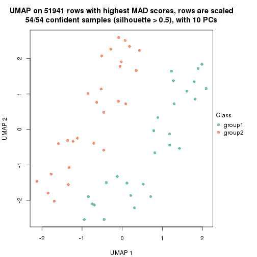</p>

</div>
<div id='tab-MAD-skmeans-dimension-reduction-2'>
<pre><code class="r">dimension_reduction(res, k = 3, method = &quot;UMAP&quot;)
</code></pre>

<p>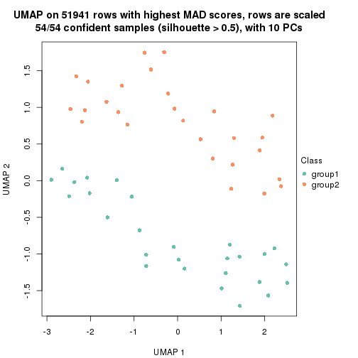</p>

</div>
<div id='tab-MAD-skmeans-dimension-reduction-3'>
<pre><code class="r">dimension_reduction(res, k = 4, method = &quot;UMAP&quot;)
</code></pre>

<p>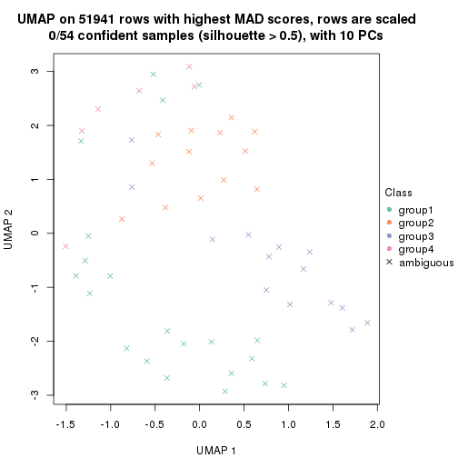</p>

</div>
<div id='tab-MAD-skmeans-dimension-reduction-4'>
<pre><code class="r">dimension_reduction(res, k = 5, method = &quot;UMAP&quot;)
</code></pre>

<p>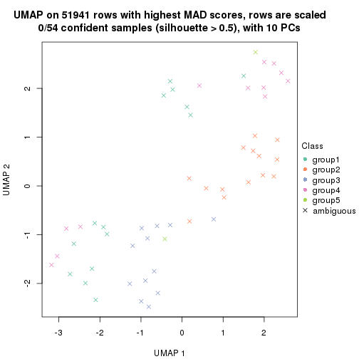</p>

</div>
<div id='tab-MAD-skmeans-dimension-reduction-5'>
<pre><code class="r">dimension_reduction(res, k = 6, method = &quot;UMAP&quot;)
</code></pre>

<p>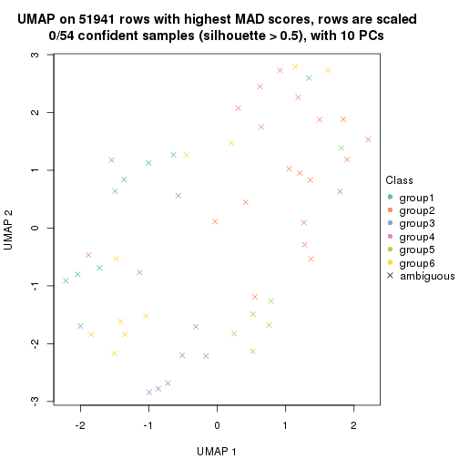</p>

</div>
</div>


Following heatmap shows how subgroups are split when increasing `k`:

```r
collect_classes(res)
```

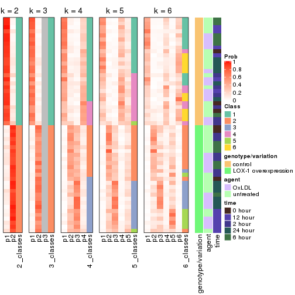


Test correlation between subgroups and known annotations. If the known
annotation is numeric, one-way ANOVA test is applied, and if the known
annotation is discrete, chi-squared contingency table test is applied.

```r
test_to_known_factors(res)
```

```
#>              n genotype/variation(p) agent(p) time(p) k
#> MAD:skmeans 54              1.48e-12        1       1 2
#> MAD:skmeans 54              1.48e-12        1       1 3
#> MAD:skmeans  0                    NA       NA      NA 4
#> MAD:skmeans  0                    NA       NA      NA 5
#> MAD:skmeans  0                    NA       NA      NA 6
```


If matrix rows can be associated to genes, consider to use `functional_enrichment(res,
...)` to perform function enrichment for the signature genes. See [this vignette](http://bioconductor.org/packages/devel/bioc/vignettes/cola/inst/doc/functional_enrichment.html) for more detailed explanations.


 

---------------------------------------------------


### MAD:pam


The object with results only for a single top-value method and a single partition method 
can be extracted as:

```r
res = res_list["MAD", "pam"]
# you can also extract it by
# res = res_list["MAD:pam"]
```

A summary of `res` and all the functions that can be applied to it:

```r
res
```

```
#> A 'ConsensusPartition' object with k = 2, 3, 4, 5, 6.
#>   On a matrix with 51941 rows and 54 columns.
#>   Top rows (1000, 2000, 3000, 4000, 5000) are extracted by 'MAD' method.
#>   Subgroups are detected by 'pam' method.
#>   Performed in total 1250 partitions by row resampling.
#>   Best k for subgroups seems to be 2.
#> 
#> Following methods can be applied to this 'ConsensusPartition' object:
#>  [1] "cola_report"             "collect_classes"         "collect_plots"          
#>  [4] "collect_stats"           "colnames"                "compare_signatures"     
#>  [7] "consensus_heatmap"       "dimension_reduction"     "functional_enrichment"  
#> [10] "get_anno_col"            "get_anno"                "get_classes"            
#> [13] "get_consensus"           "get_matrix"              "get_membership"         
#> [16] "get_param"               "get_signatures"          "get_stats"              
#> [19] "is_best_k"               "is_stable_k"             "membership_heatmap"     
#> [22] "ncol"                    "nrow"                    "plot_ecdf"              
#> [25] "rownames"                "select_partition_number" "show"                   
#> [28] "suggest_best_k"          "test_to_known_factors"
```

`collect_plots()` function collects all the plots made from `res` for all `k` (number of partitions)
into one single page to provide an easy and fast comparison between different `k`.

```r
collect_plots(res)
```

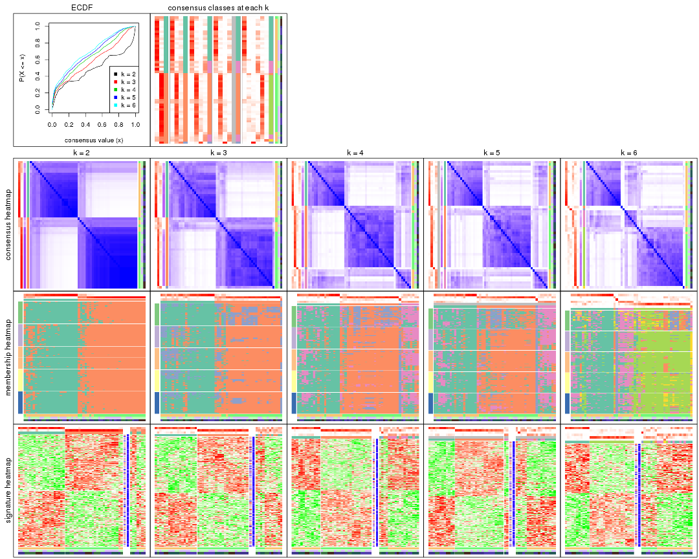

The plots are:

- The first row: a plot of the ECDF (empirical cumulative distribution
  function) curves of the consensus matrix for each `k` and the heatmap of
  predicted classes for each `k`.
- The second row: heatmaps of the consensus matrix for each `k`.
- The third row: heatmaps of the membership matrix for each `k`.
- The fouth row: heatmaps of the signatures for each `k`.

All the plots in panels can be made by individual functions and they are
plotted later in this section.

`select_partition_number()` produces several plots showing different
statistics for choosing "optimized" `k`. There are following statistics:

- ECDF curves of the consensus matrix for each `k`;
- 1-PAC. [The PAC
  score](https://en.wikipedia.org/wiki/Consensus_clustering#Over-interpretation_potential_of_consensus_clustering)
  measures the proportion of the ambiguous subgrouping.
- Mean silhouette score.
- Concordance. The mean probability of fiting the consensus class ids in all
  partitions.
- Area increased. Denote $A_k$ as the area under the ECDF curve for current
  `k`, the area increased is defined as $A_k - A_{k-1}$.
- Rand index. The percent of pairs of samples that are both in a same cluster
  or both are not in a same cluster in the partition of k and k-1.
- Jaccard index. The ratio of pairs of samples are both in a same cluster in
  the partition of k and k-1 and the pairs of samples are both in a same
  cluster in the partition k or k-1.

The detailed explanations of these statistics can be found in [the _cola_
vignette](http://bioconductor.org/packages/devel/bioc/vignettes/cola/inst/doc/cola.html#toc_13).

Generally speaking, lower PAC score, higher mean silhouette score or higher
concordance corresponds to better partition. Rand index and Jaccard index
measure how similar the current partition is compared to partition with `k-1`.
If they are too similar, we won't accept `k` is better than `k-1`.

```r
select_partition_number(res)
```

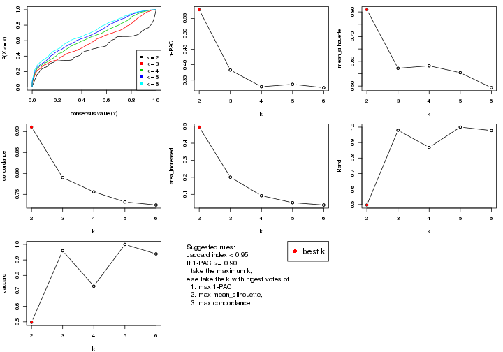

The numeric values for all these statistics can be obtained by `get_stats()`.

```r
get_stats(res)
```

```
#>   k 1-PAC mean_silhouette concordance area_increased  Rand Jaccard
#> 2 2 0.578           0.809       0.911         0.4943 0.497   0.497
#> 3 3 0.383           0.572       0.790         0.2008 0.980   0.959
#> 4 4 0.329           0.582       0.756         0.0920 0.869   0.730
#> 5 5 0.336           0.554       0.732         0.0512 1.000   1.000
#> 6 6 0.325           0.493       0.725         0.0376 0.978   0.939
```

`suggest_best_k()` suggests the best $k$ based on these statistics. The rules are as follows:

- All $k$ with Jaccard index larger than 0.95 are removed because increasing
  $k$ does not provide enough extra information. If all $k$ are removed, it is
  marked as no subgroup is detected.
- For all $k$ with 1-PAC score larger than 0.9, the maximal $k$ is taken as
  the best $k$, and other $k$ are marked as optional $k$.
- If it does not fit the second rule. The $k$ with the maximal vote of the
  highest 1-PAC score, highest mean silhouette, and highest concordance is
  taken as the best $k$.

```r
suggest_best_k(res)
```

```
#> [1] 2
```


Following shows the table of the partitions (You need to click the **show/hide
code output** link to see it). The membership matrix (columns with name `p*`)
is inferred by
[`clue::cl_consensus()`](https://www.rdocumentation.org/link/cl_consensus?package=clue)
function with the `SE` method. Basically the value in the membership matrix
represents the probability to belong to a certain group. The finall class
label for an item is determined with the group with highest probability it
belongs to.

In `get_classes()` function, the entropy is calculated from the membership
matrix and the silhouette score is calculated from the consensus matrix.


<script>
$( function() {
	$( '#tabs-MAD-pam-get-classes' ).tabs();
} );
</script>
<div id='tabs-MAD-pam-get-classes'>
<ul>
<li><a href='#tab-MAD-pam-get-classes-1'>k = 2</a></li>
<li><a href='#tab-MAD-pam-get-classes-2'>k = 3</a></li>
<li><a href='#tab-MAD-pam-get-classes-3'>k = 4</a></li>
<li><a href='#tab-MAD-pam-get-classes-4'>k = 5</a></li>
<li><a href='#tab-MAD-pam-get-classes-5'>k = 6</a></li>
</ul>

<div id='tab-MAD-pam-get-classes-1'>
<p><a id='tab-MAD-pam-get-classes-1-a' style='color:#0366d6' href='#'>show/hide code output</a></p>
<pre><code class="r">cbind(get_classes(res, k = 2), get_membership(res, k = 2))
</code></pre>

<pre><code>#&gt;           class entropy silhouette    p1    p2
#&gt; GSM329068     2  0.0000      0.920 0.000 1.000
#&gt; GSM329074     2  0.0000      0.920 0.000 1.000
#&gt; GSM329100     2  0.0000      0.920 0.000 1.000
#&gt; GSM329062     2  0.0000      0.920 0.000 1.000
#&gt; GSM329079     2  0.0000      0.920 0.000 1.000
#&gt; GSM329090     2  0.1184      0.918 0.016 0.984
#&gt; GSM329066     2  0.0376      0.921 0.004 0.996
#&gt; GSM329086     1  0.9993      0.150 0.516 0.484
#&gt; GSM329099     2  0.0376      0.921 0.004 0.996
#&gt; GSM329071     2  0.0000      0.920 0.000 1.000
#&gt; GSM329078     2  0.1414      0.917 0.020 0.980
#&gt; GSM329081     2  0.9087      0.487 0.324 0.676
#&gt; GSM329096     2  0.9608      0.338 0.384 0.616
#&gt; GSM329102     2  0.2778      0.900 0.048 0.952
#&gt; GSM329104     2  0.1843      0.913 0.028 0.972
#&gt; GSM329067     2  0.0376      0.921 0.004 0.996
#&gt; GSM329072     2  0.5294      0.828 0.120 0.880
#&gt; GSM329075     2  0.0376      0.921 0.004 0.996
#&gt; GSM329058     2  0.0000      0.920 0.000 1.000
#&gt; GSM329073     2  0.1184      0.919 0.016 0.984
#&gt; GSM329107     2  0.0000      0.920 0.000 1.000
#&gt; GSM329057     2  0.0376      0.921 0.004 0.996
#&gt; GSM329085     2  0.1843      0.913 0.028 0.972
#&gt; GSM329089     2  0.1414      0.917 0.020 0.980
#&gt; GSM329076     2  0.0000      0.920 0.000 1.000
#&gt; GSM329094     2  0.0938      0.919 0.012 0.988
#&gt; GSM329105     2  0.1184      0.918 0.016 0.984
#&gt; GSM329056     1  0.9044      0.593 0.680 0.320
#&gt; GSM329069     1  0.0672      0.871 0.992 0.008
#&gt; GSM329077     1  0.1843      0.874 0.972 0.028
#&gt; GSM329070     2  0.4431      0.861 0.092 0.908
#&gt; GSM329082     1  0.3114      0.871 0.944 0.056
#&gt; GSM329092     2  0.9661      0.314 0.392 0.608
#&gt; GSM329083     2  0.5408      0.830 0.124 0.876
#&gt; GSM329101     1  0.9129      0.556 0.672 0.328
#&gt; GSM329106     1  0.3274      0.867 0.940 0.060
#&gt; GSM329087     1  0.0000      0.868 1.000 0.000
#&gt; GSM329091     1  0.5408      0.828 0.876 0.124
#&gt; GSM329093     1  0.0376      0.869 0.996 0.004
#&gt; GSM329080     1  0.9686      0.409 0.604 0.396
#&gt; GSM329084     1  0.3431      0.868 0.936 0.064
#&gt; GSM329088     1  0.6623      0.791 0.828 0.172
#&gt; GSM329059     1  0.2236      0.874 0.964 0.036
#&gt; GSM329097     1  0.5842      0.823 0.860 0.140
#&gt; GSM329098     2  0.9460      0.417 0.364 0.636
#&gt; GSM329055     1  0.0000      0.868 1.000 0.000
#&gt; GSM329103     1  0.1414      0.873 0.980 0.020
#&gt; GSM329108     1  0.4562      0.853 0.904 0.096
#&gt; GSM329061     1  0.0938      0.872 0.988 0.012
#&gt; GSM329064     1  0.0938      0.872 0.988 0.012
#&gt; GSM329065     1  0.9661      0.419 0.608 0.392
#&gt; GSM329060     1  0.2043      0.874 0.968 0.032
#&gt; GSM329063     1  0.0000      0.868 1.000 0.000
#&gt; GSM329095     1  0.1633      0.874 0.976 0.024
</code></pre>

<script>
$('#tab-MAD-pam-get-classes-1-a').parent().next().next().hide();
$('#tab-MAD-pam-get-classes-1-a').click(function(){
  $('#tab-MAD-pam-get-classes-1-a').parent().next().next().toggle();
  return(false);
});
</script>
</div>

<div id='tab-MAD-pam-get-classes-2'>
<p><a id='tab-MAD-pam-get-classes-2-a' style='color:#0366d6' href='#'>show/hide code output</a></p>
<pre><code class="r">cbind(get_classes(res, k = 3), get_membership(res, k = 3))
</code></pre>

<pre><code>#&gt;           class entropy silhouette    p1    p2    p3
#&gt; GSM329068     2  0.2711     0.6716 0.000 0.912 0.088
#&gt; GSM329074     2  0.1529     0.6860 0.000 0.960 0.040
#&gt; GSM329100     2  0.3412     0.6486 0.000 0.876 0.124
#&gt; GSM329062     2  0.2356     0.6789 0.000 0.928 0.072
#&gt; GSM329079     2  0.0592     0.6870 0.000 0.988 0.012
#&gt; GSM329090     2  0.2063     0.6855 0.008 0.948 0.044
#&gt; GSM329066     2  0.1031     0.6873 0.000 0.976 0.024
#&gt; GSM329086     1  0.7036     0.0422 0.536 0.444 0.020
#&gt; GSM329099     2  0.2959     0.6670 0.000 0.900 0.100
#&gt; GSM329071     2  0.1860     0.6919 0.000 0.948 0.052
#&gt; GSM329078     2  0.2063     0.6827 0.008 0.948 0.044
#&gt; GSM329081     2  0.9029    -0.1448 0.300 0.536 0.164
#&gt; GSM329096     2  0.9245    -0.1322 0.320 0.504 0.176
#&gt; GSM329102     2  0.5167     0.6088 0.024 0.804 0.172
#&gt; GSM329104     3  0.5988     0.0000 0.000 0.368 0.632
#&gt; GSM329067     2  0.3644     0.6681 0.004 0.872 0.124
#&gt; GSM329072     2  0.4836     0.6285 0.080 0.848 0.072
#&gt; GSM329075     2  0.4834     0.5989 0.004 0.792 0.204
#&gt; GSM329058     2  0.3038     0.6641 0.000 0.896 0.104
#&gt; GSM329073     2  0.4228     0.6348 0.008 0.844 0.148
#&gt; GSM329107     2  0.0892     0.6850 0.000 0.980 0.020
#&gt; GSM329057     2  0.4629     0.5823 0.004 0.808 0.188
#&gt; GSM329085     2  0.3213     0.6608 0.008 0.900 0.092
#&gt; GSM329089     2  0.2860     0.6698 0.004 0.912 0.084
#&gt; GSM329076     2  0.3816     0.6070 0.000 0.852 0.148
#&gt; GSM329094     2  0.4121     0.5881 0.000 0.832 0.168
#&gt; GSM329105     2  0.5775     0.5063 0.012 0.728 0.260
#&gt; GSM329056     1  0.7983     0.4936 0.632 0.264 0.104
#&gt; GSM329069     1  0.1411     0.7846 0.964 0.000 0.036
#&gt; GSM329077     1  0.4324     0.7912 0.860 0.028 0.112
#&gt; GSM329070     2  0.5931     0.4362 0.084 0.792 0.124
#&gt; GSM329082     1  0.1525     0.7826 0.964 0.032 0.004
#&gt; GSM329092     2  0.9411    -0.1199 0.288 0.500 0.212
#&gt; GSM329083     2  0.7974    -0.0451 0.084 0.604 0.312
#&gt; GSM329101     1  0.9745     0.3725 0.420 0.232 0.348
#&gt; GSM329106     1  0.7624     0.6627 0.580 0.052 0.368
#&gt; GSM329087     1  0.0237     0.7771 0.996 0.000 0.004
#&gt; GSM329091     1  0.6936     0.7411 0.704 0.064 0.232
#&gt; GSM329093     1  0.5687     0.7596 0.756 0.020 0.224
#&gt; GSM329080     1  0.9651     0.4414 0.436 0.216 0.348
#&gt; GSM329084     1  0.3765     0.7890 0.888 0.028 0.084
#&gt; GSM329088     1  0.7797     0.6751 0.672 0.140 0.188
#&gt; GSM329059     1  0.1905     0.7869 0.956 0.016 0.028
#&gt; GSM329097     1  0.5067     0.7443 0.832 0.116 0.052
#&gt; GSM329098     2  0.9566    -0.2080 0.196 0.424 0.380
#&gt; GSM329055     1  0.5882     0.7132 0.652 0.000 0.348
#&gt; GSM329103     1  0.4164     0.7790 0.848 0.008 0.144
#&gt; GSM329108     1  0.5722     0.7677 0.804 0.084 0.112
#&gt; GSM329061     1  0.0424     0.7786 0.992 0.000 0.008
#&gt; GSM329064     1  0.0661     0.7805 0.988 0.004 0.008
#&gt; GSM329065     1  0.9681     0.4190 0.460 0.256 0.284
#&gt; GSM329060     1  0.2982     0.7916 0.920 0.024 0.056
#&gt; GSM329063     1  0.5216     0.7536 0.740 0.000 0.260
#&gt; GSM329095     1  0.3193     0.7866 0.896 0.004 0.100
</code></pre>

<script>
$('#tab-MAD-pam-get-classes-2-a').parent().next().next().hide();
$('#tab-MAD-pam-get-classes-2-a').click(function(){
  $('#tab-MAD-pam-get-classes-2-a').parent().next().next().toggle();
  return(false);
});
</script>
</div>

<div id='tab-MAD-pam-get-classes-3'>
<p><a id='tab-MAD-pam-get-classes-3-a' style='color:#0366d6' href='#'>show/hide code output</a></p>
<pre><code class="r">cbind(get_classes(res, k = 4), get_membership(res, k = 4))
</code></pre>

<pre><code>#&gt;           class entropy silhouette    p1    p2    p3    p4
#&gt; GSM329068     2  0.3013     0.7994 0.000 0.888 0.080 0.032
#&gt; GSM329074     2  0.1520     0.8127 0.000 0.956 0.020 0.024
#&gt; GSM329100     2  0.3899     0.7755 0.000 0.840 0.108 0.052
#&gt; GSM329062     2  0.1820     0.8098 0.000 0.944 0.036 0.020
#&gt; GSM329079     2  0.0707     0.8124 0.000 0.980 0.020 0.000
#&gt; GSM329090     2  0.2975     0.8105 0.008 0.900 0.060 0.032
#&gt; GSM329066     2  0.1305     0.8139 0.000 0.960 0.036 0.004
#&gt; GSM329086     1  0.5558    -0.0359 0.548 0.432 0.020 0.000
#&gt; GSM329099     2  0.2739     0.8039 0.000 0.904 0.060 0.036
#&gt; GSM329071     2  0.2402     0.8195 0.000 0.912 0.076 0.012
#&gt; GSM329078     2  0.3898     0.7884 0.008 0.852 0.092 0.048
#&gt; GSM329081     2  0.8111     0.2355 0.288 0.492 0.192 0.028
#&gt; GSM329096     2  0.8995     0.1945 0.264 0.460 0.172 0.104
#&gt; GSM329102     2  0.4356     0.7868 0.016 0.780 0.200 0.004
#&gt; GSM329104     3  0.3216     0.0000 0.000 0.076 0.880 0.044
#&gt; GSM329067     2  0.3450     0.8106 0.004 0.864 0.108 0.024
#&gt; GSM329072     2  0.4475     0.7898 0.080 0.828 0.076 0.016
#&gt; GSM329075     2  0.5613     0.7297 0.004 0.724 0.188 0.084
#&gt; GSM329058     2  0.3834     0.7876 0.000 0.848 0.076 0.076
#&gt; GSM329073     2  0.5610     0.7225 0.008 0.732 0.180 0.080
#&gt; GSM329107     2  0.1284     0.8101 0.000 0.964 0.024 0.012
#&gt; GSM329057     2  0.5262     0.7325 0.004 0.712 0.248 0.036
#&gt; GSM329085     2  0.4456     0.7739 0.004 0.804 0.148 0.044
#&gt; GSM329089     2  0.3711     0.8044 0.000 0.836 0.140 0.024
#&gt; GSM329076     2  0.4137     0.7662 0.000 0.780 0.208 0.012
#&gt; GSM329094     2  0.4364     0.7579 0.000 0.764 0.220 0.016
#&gt; GSM329105     2  0.5540     0.6953 0.004 0.648 0.320 0.028
#&gt; GSM329056     1  0.6986     0.1523 0.616 0.260 0.024 0.100
#&gt; GSM329069     1  0.2149     0.6752 0.912 0.000 0.000 0.088
#&gt; GSM329077     1  0.4604     0.6220 0.784 0.028 0.008 0.180
#&gt; GSM329070     2  0.5256     0.4968 0.040 0.700 0.000 0.260
#&gt; GSM329082     1  0.1022     0.6842 0.968 0.032 0.000 0.000
#&gt; GSM329092     4  0.7689     0.2889 0.124 0.308 0.032 0.536
#&gt; GSM329083     4  0.6493     0.3434 0.052 0.440 0.008 0.500
#&gt; GSM329101     4  0.8203     0.4598 0.292 0.204 0.028 0.476
#&gt; GSM329106     4  0.6310     0.1995 0.380 0.036 0.016 0.568
#&gt; GSM329087     1  0.0188     0.6803 0.996 0.000 0.000 0.004
#&gt; GSM329091     1  0.5955     0.3553 0.616 0.056 0.000 0.328
#&gt; GSM329093     1  0.5057     0.3835 0.648 0.012 0.000 0.340
#&gt; GSM329080     4  0.6942     0.4961 0.240 0.176 0.000 0.584
#&gt; GSM329084     1  0.3940     0.6550 0.824 0.020 0.004 0.152
#&gt; GSM329088     1  0.7360     0.2647 0.572 0.132 0.020 0.276
#&gt; GSM329059     1  0.1488     0.6883 0.956 0.012 0.000 0.032
#&gt; GSM329097     1  0.4882     0.5965 0.804 0.108 0.020 0.068
#&gt; GSM329098     4  0.7352     0.4802 0.132 0.320 0.012 0.536
#&gt; GSM329055     4  0.4888     0.0972 0.412 0.000 0.000 0.588
#&gt; GSM329103     1  0.4339     0.5436 0.764 0.008 0.004 0.224
#&gt; GSM329108     1  0.5395     0.5377 0.732 0.084 0.000 0.184
#&gt; GSM329061     1  0.0336     0.6817 0.992 0.000 0.000 0.008
#&gt; GSM329064     1  0.0657     0.6840 0.984 0.004 0.000 0.012
#&gt; GSM329065     4  0.7564     0.3671 0.328 0.208 0.000 0.464
#&gt; GSM329060     1  0.3325     0.6747 0.864 0.024 0.000 0.112
#&gt; GSM329063     1  0.4888     0.2821 0.588 0.000 0.000 0.412
#&gt; GSM329095     1  0.4245     0.6262 0.784 0.000 0.020 0.196
</code></pre>

<script>
$('#tab-MAD-pam-get-classes-3-a').parent().next().next().hide();
$('#tab-MAD-pam-get-classes-3-a').click(function(){
  $('#tab-MAD-pam-get-classes-3-a').parent().next().next().toggle();
  return(false);
});
</script>
</div>

<div id='tab-MAD-pam-get-classes-4'>
<p><a id='tab-MAD-pam-get-classes-4-a' style='color:#0366d6' href='#'>show/hide code output</a></p>
<pre><code class="r">cbind(get_classes(res, k = 5), get_membership(res, k = 5))
</code></pre>

<pre><code>#&gt;           class entropy silhouette    p1    p2    p3    p4 p5
#&gt; GSM329068     2  0.2654     0.7739 0.000 0.884 0.032 0.000 NA
#&gt; GSM329074     2  0.1651     0.7796 0.000 0.944 0.008 0.012 NA
#&gt; GSM329100     2  0.3928     0.7473 0.000 0.800 0.040 0.008 NA
#&gt; GSM329062     2  0.1710     0.7776 0.000 0.940 0.016 0.004 NA
#&gt; GSM329079     2  0.1399     0.7810 0.000 0.952 0.028 0.000 NA
#&gt; GSM329090     2  0.3115     0.7743 0.008 0.856 0.012 0.004 NA
#&gt; GSM329066     2  0.1828     0.7840 0.000 0.936 0.032 0.004 NA
#&gt; GSM329086     1  0.5097     0.0703 0.548 0.424 0.008 0.004 NA
#&gt; GSM329099     2  0.2456     0.7755 0.000 0.904 0.024 0.008 NA
#&gt; GSM329071     2  0.2754     0.7870 0.000 0.880 0.040 0.000 NA
#&gt; GSM329078     2  0.4397     0.6569 0.000 0.708 0.024 0.004 NA
#&gt; GSM329081     2  0.7355     0.3011 0.288 0.508 0.112 0.004 NA
#&gt; GSM329096     2  0.8764     0.2675 0.244 0.436 0.148 0.080 NA
#&gt; GSM329102     2  0.4153     0.7625 0.008 0.768 0.192 0.000 NA
#&gt; GSM329104     3  0.1117     0.0000 0.000 0.016 0.964 0.020 NA
#&gt; GSM329067     2  0.3949     0.7803 0.004 0.824 0.064 0.012 NA
#&gt; GSM329072     2  0.4174     0.7708 0.060 0.820 0.032 0.004 NA
#&gt; GSM329075     2  0.5695     0.7168 0.004 0.700 0.104 0.036 NA
#&gt; GSM329058     2  0.4151     0.7581 0.000 0.820 0.052 0.068 NA
#&gt; GSM329073     2  0.6585     0.3635 0.004 0.520 0.100 0.028 NA
#&gt; GSM329107     2  0.1704     0.7781 0.000 0.928 0.004 0.000 NA
#&gt; GSM329057     2  0.6129     0.6435 0.000 0.608 0.196 0.012 NA
#&gt; GSM329085     2  0.4974     0.6372 0.004 0.660 0.048 0.000 NA
#&gt; GSM329089     2  0.3875     0.7773 0.000 0.804 0.124 0.000 NA
#&gt; GSM329076     2  0.4802     0.7290 0.000 0.720 0.212 0.008 NA
#&gt; GSM329094     2  0.5231     0.7217 0.000 0.704 0.184 0.012 NA
#&gt; GSM329105     2  0.6113     0.6685 0.004 0.608 0.252 0.012 NA
#&gt; GSM329056     1  0.6575     0.1703 0.584 0.264 0.012 0.116 NA
#&gt; GSM329069     1  0.2020     0.6536 0.900 0.000 0.000 0.100 NA
#&gt; GSM329077     1  0.4072     0.6019 0.772 0.028 0.000 0.192 NA
#&gt; GSM329070     2  0.5397     0.4308 0.044 0.644 0.004 0.292 NA
#&gt; GSM329082     1  0.1202     0.6678 0.960 0.032 0.000 0.004 NA
#&gt; GSM329092     4  0.7205     0.0599 0.072 0.148 0.000 0.524 NA
#&gt; GSM329083     4  0.5817     0.3994 0.052 0.372 0.004 0.556 NA
#&gt; GSM329101     4  0.7176     0.4624 0.260 0.168 0.020 0.528 NA
#&gt; GSM329106     4  0.5354     0.3301 0.320 0.028 0.008 0.628 NA
#&gt; GSM329087     1  0.0162     0.6627 0.996 0.000 0.000 0.004 NA
#&gt; GSM329091     1  0.5627     0.3051 0.580 0.056 0.004 0.352 NA
#&gt; GSM329093     1  0.4644     0.2997 0.604 0.012 0.004 0.380 NA
#&gt; GSM329080     4  0.5853     0.5132 0.204 0.144 0.000 0.640 NA
#&gt; GSM329084     1  0.4127     0.6220 0.792 0.020 0.008 0.164 NA
#&gt; GSM329088     1  0.6692     0.2207 0.536 0.128 0.008 0.308 NA
#&gt; GSM329059     1  0.1364     0.6702 0.952 0.012 0.000 0.036 NA
#&gt; GSM329097     1  0.4233     0.5943 0.804 0.108 0.024 0.064 NA
#&gt; GSM329098     4  0.6257     0.5180 0.104 0.280 0.008 0.592 NA
#&gt; GSM329055     4  0.4015     0.2616 0.348 0.000 0.000 0.652 NA
#&gt; GSM329103     1  0.3883     0.5163 0.744 0.008 0.004 0.244 NA
#&gt; GSM329108     1  0.4989     0.5317 0.720 0.084 0.004 0.188 NA
#&gt; GSM329061     1  0.0404     0.6647 0.988 0.000 0.000 0.012 NA
#&gt; GSM329064     1  0.0566     0.6664 0.984 0.004 0.000 0.012 NA
#&gt; GSM329065     4  0.6541     0.3796 0.288 0.188 0.000 0.516 NA
#&gt; GSM329060     1  0.3122     0.6531 0.852 0.024 0.000 0.120 NA
#&gt; GSM329063     1  0.4522     0.2056 0.552 0.000 0.000 0.440 NA
#&gt; GSM329095     1  0.5430     0.4783 0.660 0.000 0.000 0.148 NA
</code></pre>

<script>
$('#tab-MAD-pam-get-classes-4-a').parent().next().next().hide();
$('#tab-MAD-pam-get-classes-4-a').click(function(){
  $('#tab-MAD-pam-get-classes-4-a').parent().next().next().toggle();
  return(false);
});
</script>
</div>

<div id='tab-MAD-pam-get-classes-5'>
<p><a id='tab-MAD-pam-get-classes-5-a' style='color:#0366d6' href='#'>show/hide code output</a></p>
<pre><code class="r">cbind(get_classes(res, k = 6), get_membership(res, k = 6))
</code></pre>

<pre><code>#&gt;           class entropy silhouette    p1    p2    p3    p4    p5    p6
#&gt; GSM329068     5  0.2854      0.705 0.000 0.084 0.004 0.008 0.868 0.036
#&gt; GSM329074     5  0.1520      0.722 0.000 0.016 0.008 0.008 0.948 0.020
#&gt; GSM329100     5  0.5245      0.575 0.000 0.112 0.008 0.048 0.704 0.128
#&gt; GSM329062     5  0.1116      0.720 0.000 0.028 0.000 0.004 0.960 0.008
#&gt; GSM329079     5  0.1251      0.727 0.000 0.012 0.024 0.000 0.956 0.008
#&gt; GSM329090     5  0.3062      0.717 0.008 0.156 0.008 0.004 0.824 0.000
#&gt; GSM329066     5  0.2100      0.730 0.000 0.016 0.036 0.000 0.916 0.032
#&gt; GSM329086     1  0.4763      0.115 0.544 0.012 0.008 0.000 0.420 0.016
#&gt; GSM329099     5  0.2194      0.716 0.000 0.040 0.008 0.004 0.912 0.036
#&gt; GSM329071     5  0.2915      0.731 0.000 0.120 0.024 0.000 0.848 0.008
#&gt; GSM329078     5  0.4269      0.482 0.000 0.340 0.016 0.004 0.636 0.004
#&gt; GSM329081     5  0.7402      0.123 0.272 0.080 0.056 0.016 0.500 0.076
#&gt; GSM329096     5  0.8440      0.194 0.224 0.124 0.108 0.104 0.420 0.020
#&gt; GSM329102     5  0.4083      0.701 0.008 0.044 0.176 0.004 0.764 0.004
#&gt; GSM329104     3  0.0405      0.000 0.000 0.000 0.988 0.004 0.008 0.000
#&gt; GSM329067     5  0.4019      0.710 0.004 0.092 0.024 0.016 0.812 0.052
#&gt; GSM329072     5  0.4132      0.707 0.052 0.084 0.008 0.000 0.800 0.056
#&gt; GSM329075     5  0.6059      0.584 0.004 0.140 0.048 0.048 0.664 0.096
#&gt; GSM329058     5  0.3564      0.701 0.000 0.052 0.016 0.068 0.840 0.024
#&gt; GSM329073     2  0.7002      0.000 0.000 0.496 0.024 0.056 0.232 0.192
#&gt; GSM329107     5  0.1753      0.726 0.000 0.084 0.000 0.000 0.912 0.004
#&gt; GSM329057     5  0.6021      0.520 0.000 0.268 0.152 0.024 0.552 0.004
#&gt; GSM329085     5  0.4553      0.461 0.000 0.384 0.032 0.000 0.580 0.004
#&gt; GSM329089     5  0.4132      0.721 0.000 0.088 0.104 0.004 0.784 0.020
#&gt; GSM329076     5  0.5000      0.662 0.000 0.092 0.192 0.016 0.692 0.008
#&gt; GSM329094     5  0.5216      0.654 0.000 0.140 0.148 0.020 0.684 0.008
#&gt; GSM329105     5  0.6525      0.568 0.004 0.152 0.192 0.032 0.584 0.036
#&gt; GSM329056     1  0.6292      0.169 0.564 0.016 0.004 0.120 0.264 0.032
#&gt; GSM329069     1  0.1814      0.633 0.900 0.000 0.000 0.100 0.000 0.000
#&gt; GSM329077     1  0.3968      0.573 0.752 0.012 0.000 0.208 0.020 0.008
#&gt; GSM329070     5  0.5529      0.372 0.036 0.004 0.004 0.284 0.612 0.060
#&gt; GSM329082     1  0.1049      0.648 0.960 0.000 0.000 0.000 0.032 0.008
#&gt; GSM329092     6  0.4810      0.000 0.036 0.000 0.000 0.240 0.044 0.680
#&gt; GSM329083     4  0.5643      0.295 0.044 0.024 0.004 0.576 0.332 0.020
#&gt; GSM329101     4  0.6807      0.495 0.224 0.020 0.012 0.544 0.160 0.040
#&gt; GSM329106     4  0.4444      0.461 0.264 0.008 0.000 0.688 0.032 0.008
#&gt; GSM329087     1  0.0146      0.642 0.996 0.000 0.000 0.004 0.000 0.000
#&gt; GSM329091     1  0.5641      0.165 0.520 0.000 0.004 0.384 0.056 0.036
#&gt; GSM329093     1  0.4927      0.185 0.552 0.000 0.004 0.400 0.016 0.028
#&gt; GSM329080     4  0.5150      0.510 0.160 0.000 0.000 0.676 0.140 0.024
#&gt; GSM329084     1  0.4257      0.575 0.748 0.000 0.004 0.184 0.016 0.048
#&gt; GSM329088     1  0.6325      0.110 0.480 0.008 0.004 0.356 0.128 0.024
#&gt; GSM329059     1  0.1225      0.650 0.952 0.000 0.000 0.036 0.012 0.000
#&gt; GSM329097     1  0.4184      0.571 0.788 0.000 0.028 0.068 0.108 0.008
#&gt; GSM329098     4  0.4988      0.419 0.072 0.004 0.000 0.652 0.260 0.012
#&gt; GSM329055     4  0.3584      0.369 0.308 0.000 0.000 0.688 0.000 0.004
#&gt; GSM329103     1  0.3512      0.493 0.740 0.004 0.000 0.248 0.008 0.000
#&gt; GSM329108     1  0.4864      0.504 0.700 0.000 0.004 0.196 0.080 0.020
#&gt; GSM329061     1  0.0717      0.646 0.976 0.000 0.000 0.016 0.000 0.008
#&gt; GSM329064     1  0.0508      0.646 0.984 0.000 0.000 0.012 0.004 0.000
#&gt; GSM329065     4  0.5937      0.450 0.244 0.000 0.000 0.564 0.164 0.028
#&gt; GSM329060     1  0.3100      0.626 0.836 0.000 0.000 0.128 0.024 0.012
#&gt; GSM329063     1  0.3991      0.108 0.524 0.000 0.000 0.472 0.000 0.004
#&gt; GSM329095     1  0.5999      0.354 0.564 0.232 0.000 0.172 0.000 0.032
</code></pre>

<script>
$('#tab-MAD-pam-get-classes-5-a').parent().next().next().hide();
$('#tab-MAD-pam-get-classes-5-a').click(function(){
  $('#tab-MAD-pam-get-classes-5-a').parent().next().next().toggle();
  return(false);
});
</script>
</div>
</div>

Heatmaps for the consensus matrix. It visualizes the probability of two
samples to be in a same group.


<script>
$( function() {
	$( '#tabs-MAD-pam-consensus-heatmap' ).tabs();
} );
</script>
<div id='tabs-MAD-pam-consensus-heatmap'>
<ul>
<li><a href='#tab-MAD-pam-consensus-heatmap-1'>k = 2</a></li>
<li><a href='#tab-MAD-pam-consensus-heatmap-2'>k = 3</a></li>
<li><a href='#tab-MAD-pam-consensus-heatmap-3'>k = 4</a></li>
<li><a href='#tab-MAD-pam-consensus-heatmap-4'>k = 5</a></li>
<li><a href='#tab-MAD-pam-consensus-heatmap-5'>k = 6</a></li>
</ul>
<div id='tab-MAD-pam-consensus-heatmap-1'>
<pre><code class="r">consensus_heatmap(res, k = 2)
</code></pre>

<p>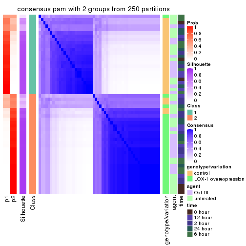</p>

</div>
<div id='tab-MAD-pam-consensus-heatmap-2'>
<pre><code class="r">consensus_heatmap(res, k = 3)
</code></pre>

<p>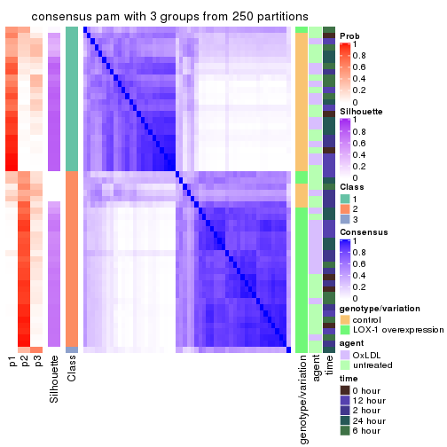</p>

</div>
<div id='tab-MAD-pam-consensus-heatmap-3'>
<pre><code class="r">consensus_heatmap(res, k = 4)
</code></pre>

<p>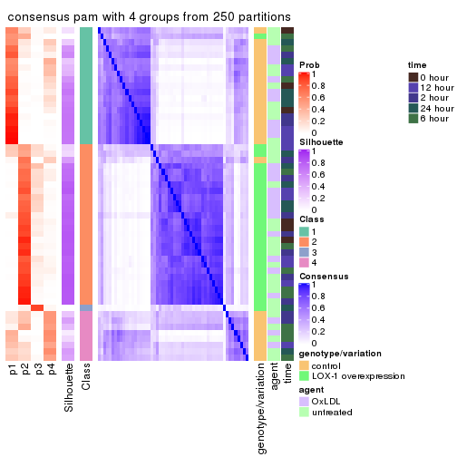</p>

</div>
<div id='tab-MAD-pam-consensus-heatmap-4'>
<pre><code class="r">consensus_heatmap(res, k = 5)
</code></pre>

<p>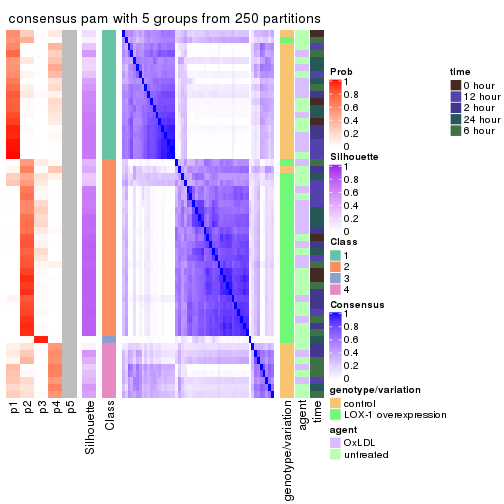</p>

</div>
<div id='tab-MAD-pam-consensus-heatmap-5'>
<pre><code class="r">consensus_heatmap(res, k = 6)
</code></pre>

<p>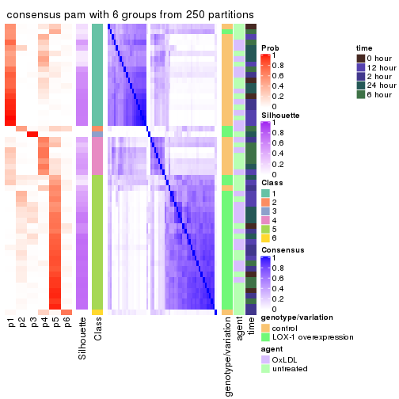</p>

</div>
</div>

Heatmaps for the membership of samples in all partitions to see how consistent they are:


<script>
$( function() {
	$( '#tabs-MAD-pam-membership-heatmap' ).tabs();
} );
</script>
<div id='tabs-MAD-pam-membership-heatmap'>
<ul>
<li><a href='#tab-MAD-pam-membership-heatmap-1'>k = 2</a></li>
<li><a href='#tab-MAD-pam-membership-heatmap-2'>k = 3</a></li>
<li><a href='#tab-MAD-pam-membership-heatmap-3'>k = 4</a></li>
<li><a href='#tab-MAD-pam-membership-heatmap-4'>k = 5</a></li>
<li><a href='#tab-MAD-pam-membership-heatmap-5'>k = 6</a></li>
</ul>
<div id='tab-MAD-pam-membership-heatmap-1'>
<pre><code class="r">membership_heatmap(res, k = 2)
</code></pre>

<p>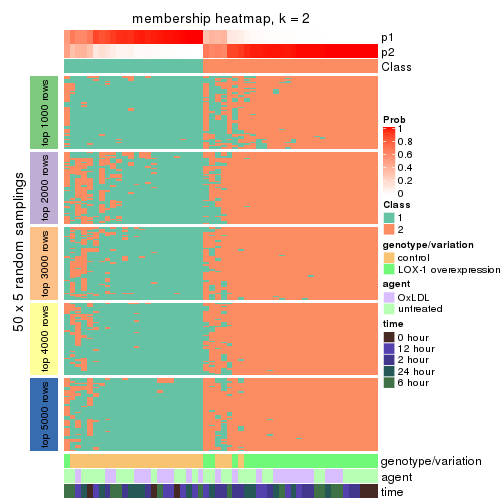</p>

</div>
<div id='tab-MAD-pam-membership-heatmap-2'>
<pre><code class="r">membership_heatmap(res, k = 3)
</code></pre>

<p>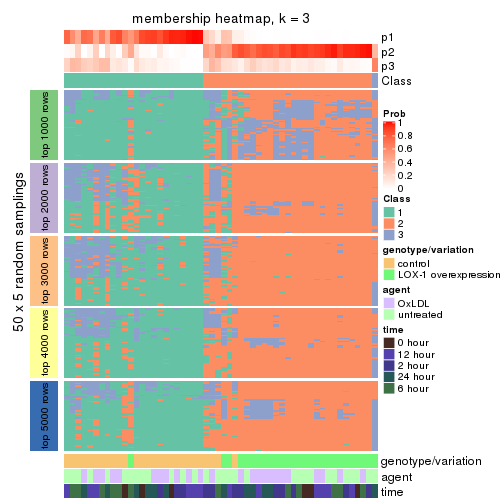</p>

</div>
<div id='tab-MAD-pam-membership-heatmap-3'>
<pre><code class="r">membership_heatmap(res, k = 4)
</code></pre>

<p>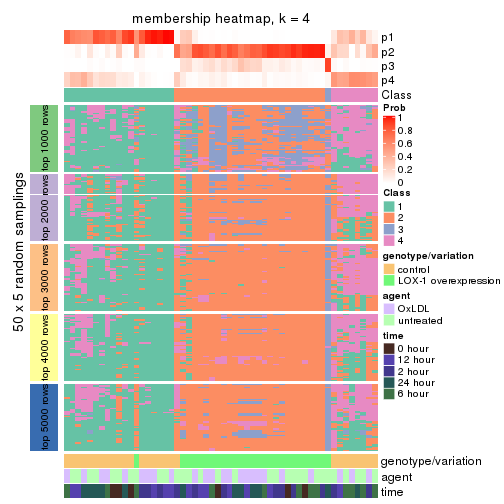</p>

</div>
<div id='tab-MAD-pam-membership-heatmap-4'>
<pre><code class="r">membership_heatmap(res, k = 5)
</code></pre>

<p>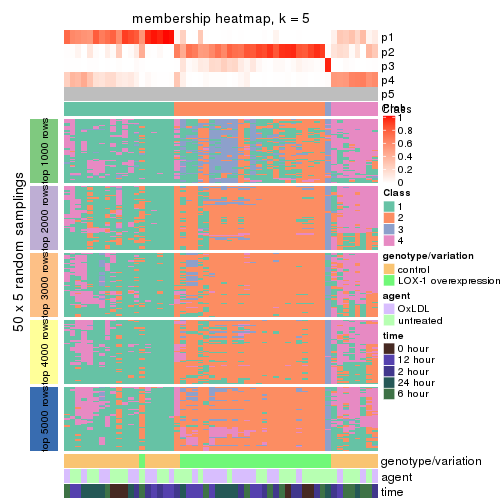</p>

</div>
<div id='tab-MAD-pam-membership-heatmap-5'>
<pre><code class="r">membership_heatmap(res, k = 6)
</code></pre>

<p>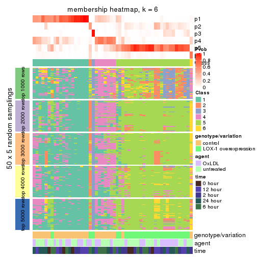</p>

</div>
</div>

As soon as we have had the classes for columns, we can look for signatures
which are significantly different between classes which can be candidate marks
for certain classes. Following are the heatmaps for signatures.


Signature heatmaps where rows are scaled:


<script>
$( function() {
	$( '#tabs-MAD-pam-get-signatures' ).tabs();
} );
</script>
<div id='tabs-MAD-pam-get-signatures'>
<ul>
<li><a href='#tab-MAD-pam-get-signatures-1'>k = 2</a></li>
<li><a href='#tab-MAD-pam-get-signatures-2'>k = 3</a></li>
<li><a href='#tab-MAD-pam-get-signatures-3'>k = 4</a></li>
<li><a href='#tab-MAD-pam-get-signatures-4'>k = 5</a></li>
<li><a href='#tab-MAD-pam-get-signatures-5'>k = 6</a></li>
</ul>
<div id='tab-MAD-pam-get-signatures-1'>
<pre><code class="r">get_signatures(res, k = 2)
</code></pre>

<p>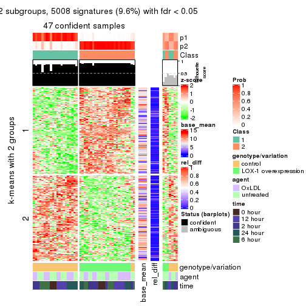</p>

</div>
<div id='tab-MAD-pam-get-signatures-2'>
<pre><code class="r">get_signatures(res, k = 3)
</code></pre>

<p>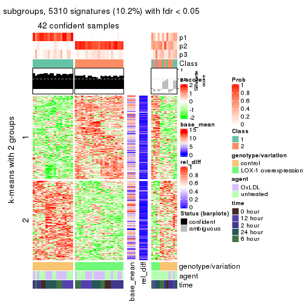</p>

</div>
<div id='tab-MAD-pam-get-signatures-3'>
<pre><code class="r">get_signatures(res, k = 4)
</code></pre>

<p>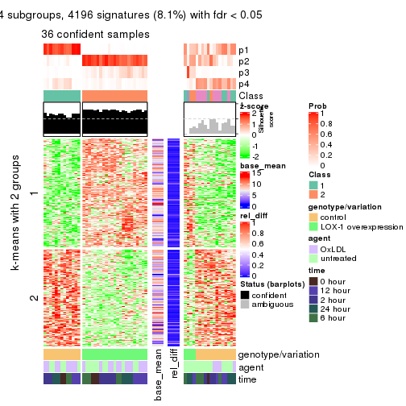</p>

</div>
<div id='tab-MAD-pam-get-signatures-4'>
<pre><code class="r">get_signatures(res, k = 5)
</code></pre>

<p>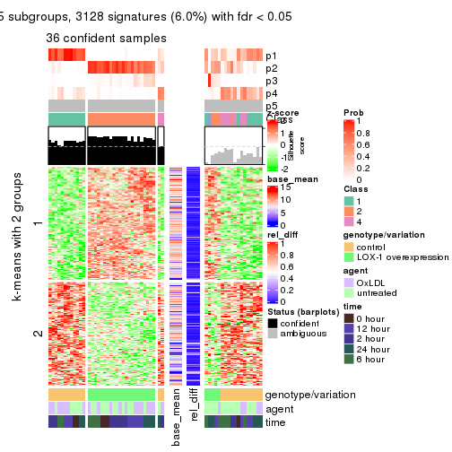</p>

</div>
<div id='tab-MAD-pam-get-signatures-5'>
<pre><code class="r">get_signatures(res, k = 6)
</code></pre>

<p>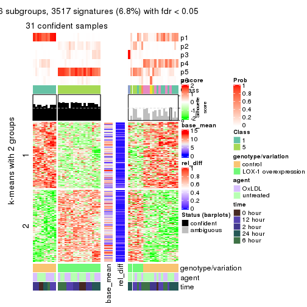</p>

</div>
</div>


Signature heatmaps where rows are not scaled:


<script>
$( function() {
	$( '#tabs-MAD-pam-get-signatures-no-scale' ).tabs();
} );
</script>
<div id='tabs-MAD-pam-get-signatures-no-scale'>
<ul>
<li><a href='#tab-MAD-pam-get-signatures-no-scale-1'>k = 2</a></li>
<li><a href='#tab-MAD-pam-get-signatures-no-scale-2'>k = 3</a></li>
<li><a href='#tab-MAD-pam-get-signatures-no-scale-3'>k = 4</a></li>
<li><a href='#tab-MAD-pam-get-signatures-no-scale-4'>k = 5</a></li>
<li><a href='#tab-MAD-pam-get-signatures-no-scale-5'>k = 6</a></li>
</ul>
<div id='tab-MAD-pam-get-signatures-no-scale-1'>
<pre><code class="r">get_signatures(res, k = 2, scale_rows = FALSE)
</code></pre>

<p>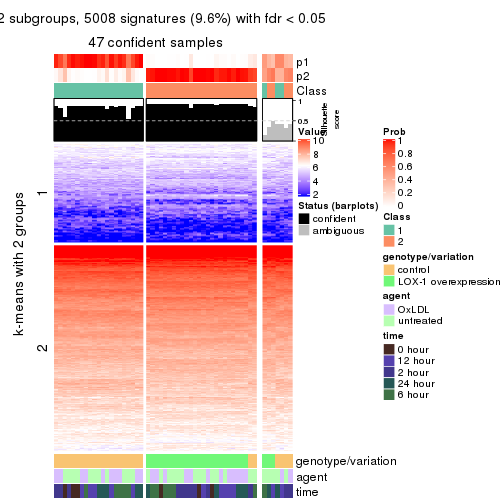</p>

</div>
<div id='tab-MAD-pam-get-signatures-no-scale-2'>
<pre><code class="r">get_signatures(res, k = 3, scale_rows = FALSE)
</code></pre>

<p>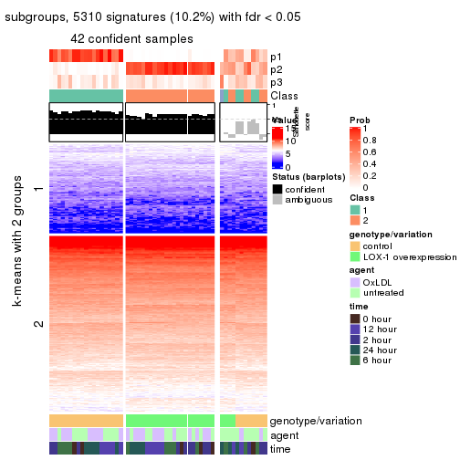</p>

</div>
<div id='tab-MAD-pam-get-signatures-no-scale-3'>
<pre><code class="r">get_signatures(res, k = 4, scale_rows = FALSE)
</code></pre>

<p>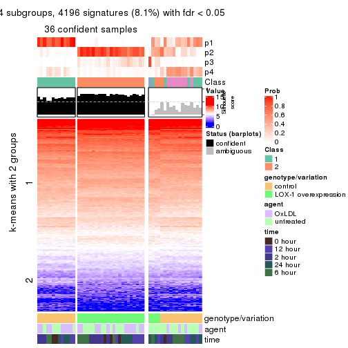</p>

</div>
<div id='tab-MAD-pam-get-signatures-no-scale-4'>
<pre><code class="r">get_signatures(res, k = 5, scale_rows = FALSE)
</code></pre>

<p>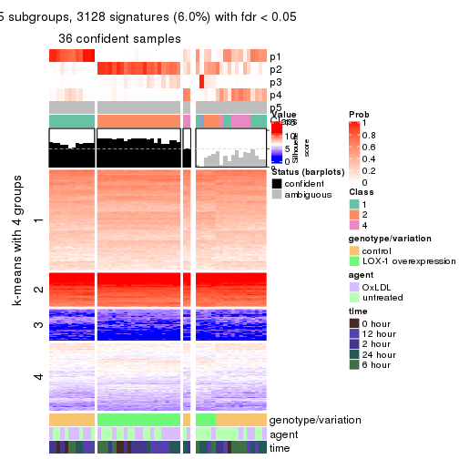</p>

</div>
<div id='tab-MAD-pam-get-signatures-no-scale-5'>
<pre><code class="r">get_signatures(res, k = 6, scale_rows = FALSE)
</code></pre>

<p>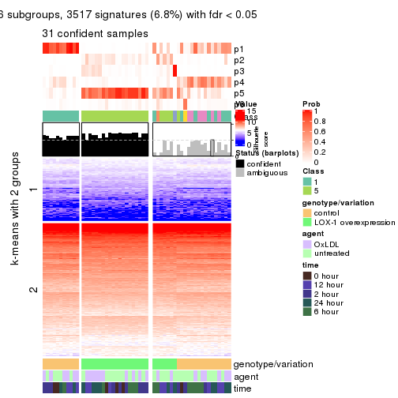</p>

</div>
</div>


Compare the overlap of signatures from different k:

```r
compare_signatures(res)
```

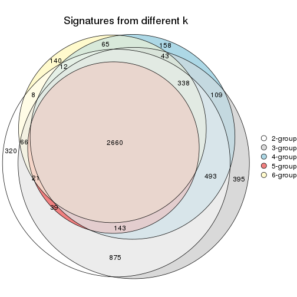

`get_signature()` returns a data frame invisibly. TO get the list of signatures, the function
call should be assigned to a variable explicitly. In following code, if `plot` argument is set
to `FALSE`, no heatmap is plotted while only the differential analysis is performed.

```r
# code only for demonstration
tb = get_signature(res, k = ..., plot = FALSE)
```

An example of the output of `tb` is:

```
#>   which_row         fdr    mean_1    mean_2 scaled_mean_1 scaled_mean_2 km
#> 1        38 0.042760348  8.373488  9.131774    -0.5533452     0.5164555  1
#> 2        40 0.018707592  7.106213  8.469186    -0.6173731     0.5762149  1
#> 3        55 0.019134737 10.221463 11.207825    -0.6159697     0.5749050  1
#> 4        59 0.006059896  5.921854  7.869574    -0.6899429     0.6439467  1
#> 5        60 0.018055526  8.928898 10.211722    -0.6204761     0.5791110  1
#> 6        98 0.009384629 15.714769 14.887706     0.6635654    -0.6193277  2
...
```

The columns in `tb` are:

1. `which_row`: row indices corresponding to the input matrix.
2. `fdr`: FDR for the differential test. 
3. `mean_x`: The mean value in group x.
4. `scaled_mean_x`: The mean value in group x after rows are scaled.
5. `km`: Row groups if k-means clustering is applied to rows.


UMAP plot which shows how samples are separated.


<script>
$( function() {
	$( '#tabs-MAD-pam-dimension-reduction' ).tabs();
} );
</script>
<div id='tabs-MAD-pam-dimension-reduction'>
<ul>
<li><a href='#tab-MAD-pam-dimension-reduction-1'>k = 2</a></li>
<li><a href='#tab-MAD-pam-dimension-reduction-2'>k = 3</a></li>
<li><a href='#tab-MAD-pam-dimension-reduction-3'>k = 4</a></li>
<li><a href='#tab-MAD-pam-dimension-reduction-4'>k = 5</a></li>
<li><a href='#tab-MAD-pam-dimension-reduction-5'>k = 6</a></li>
</ul>
<div id='tab-MAD-pam-dimension-reduction-1'>
<pre><code class="r">dimension_reduction(res, k = 2, method = &quot;UMAP&quot;)
</code></pre>

<p>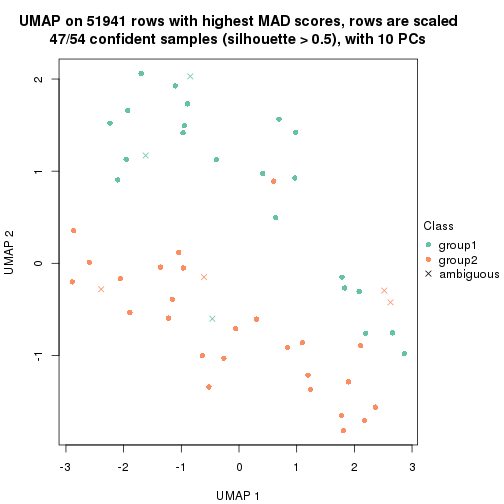</p>

</div>
<div id='tab-MAD-pam-dimension-reduction-2'>
<pre><code class="r">dimension_reduction(res, k = 3, method = &quot;UMAP&quot;)
</code></pre>

<p>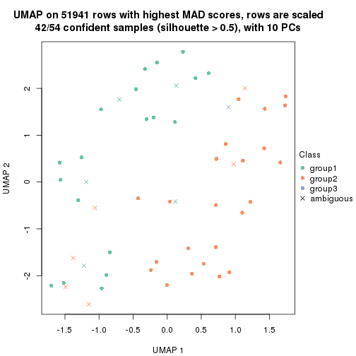</p>

</div>
<div id='tab-MAD-pam-dimension-reduction-3'>
<pre><code class="r">dimension_reduction(res, k = 4, method = &quot;UMAP&quot;)
</code></pre>

<p>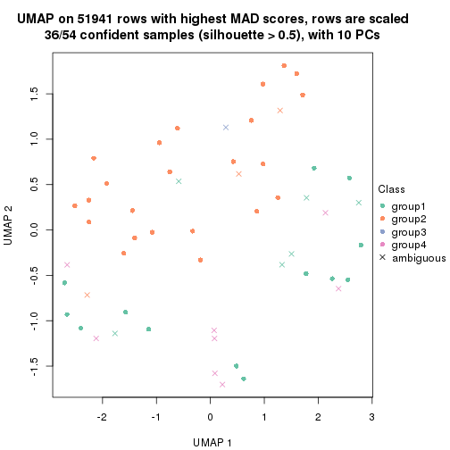</p>

</div>
<div id='tab-MAD-pam-dimension-reduction-4'>
<pre><code class="r">dimension_reduction(res, k = 5, method = &quot;UMAP&quot;)
</code></pre>

<p>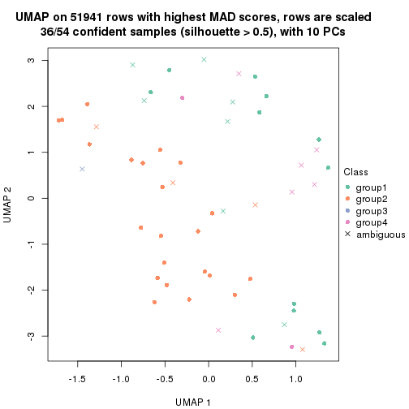</p>

</div>
<div id='tab-MAD-pam-dimension-reduction-5'>
<pre><code class="r">dimension_reduction(res, k = 6, method = &quot;UMAP&quot;)
</code></pre>

<p>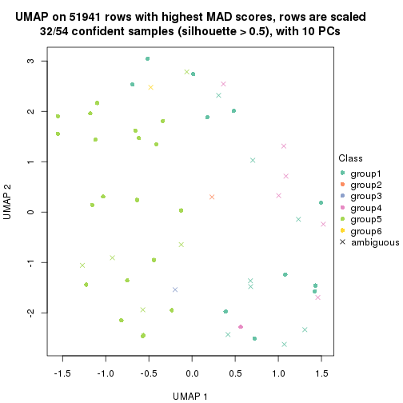</p>

</div>
</div>


Following heatmap shows how subgroups are split when increasing `k`:

```r
collect_classes(res)
```

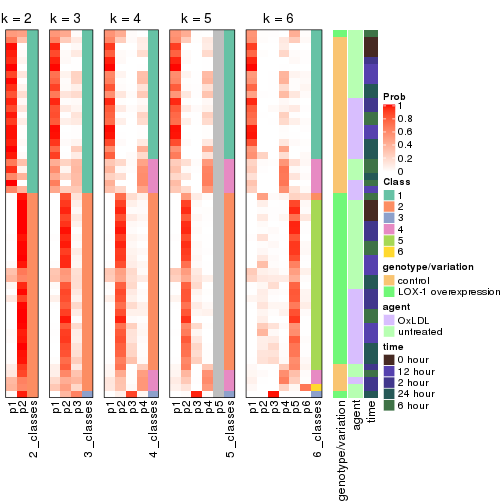


Test correlation between subgroups and known annotations. If the known
annotation is numeric, one-way ANOVA test is applied, and if the known
annotation is discrete, chi-squared contingency table test is applied.

```r
test_to_known_factors(res)
```

```
#>          n genotype/variation(p) agent(p) time(p) k
#> MAD:pam 47              1.97e-09    1.000   0.883 2
#> MAD:pam 42              6.86e-10    1.000   0.902 3
#> MAD:pam 36              1.71e-08    0.846   0.984 4
#> MAD:pam 36              1.52e-08    0.895   0.956 5
#> MAD:pam 32              1.13e-07    0.580   0.771 6
```


If matrix rows can be associated to genes, consider to use `functional_enrichment(res,
...)` to perform function enrichment for the signature genes. See [this vignette](http://bioconductor.org/packages/devel/bioc/vignettes/cola/inst/doc/functional_enrichment.html) for more detailed explanations.


 

---------------------------------------------------


### MAD:mclust**


The object with results only for a single top-value method and a single partition method 
can be extracted as:

```r
res = res_list["MAD", "mclust"]
# you can also extract it by
# res = res_list["MAD:mclust"]
```

A summary of `res` and all the functions that can be applied to it:

```r
res
```

```
#> A 'ConsensusPartition' object with k = 2, 3, 4, 5, 6.
#>   On a matrix with 51941 rows and 54 columns.
#>   Top rows (1000, 2000, 3000, 4000, 5000) are extracted by 'MAD' method.
#>   Subgroups are detected by 'mclust' method.
#>   Performed in total 1250 partitions by row resampling.
#>   Best k for subgroups seems to be 2.
#> 
#> Following methods can be applied to this 'ConsensusPartition' object:
#>  [1] "cola_report"             "collect_classes"         "collect_plots"          
#>  [4] "collect_stats"           "colnames"                "compare_signatures"     
#>  [7] "consensus_heatmap"       "dimension_reduction"     "functional_enrichment"  
#> [10] "get_anno_col"            "get_anno"                "get_classes"            
#> [13] "get_consensus"           "get_matrix"              "get_membership"         
#> [16] "get_param"               "get_signatures"          "get_stats"              
#> [19] "is_best_k"               "is_stable_k"             "membership_heatmap"     
#> [22] "ncol"                    "nrow"                    "plot_ecdf"              
#> [25] "rownames"                "select_partition_number" "show"                   
#> [28] "suggest_best_k"          "test_to_known_factors"
```

`collect_plots()` function collects all the plots made from `res` for all `k` (number of partitions)
into one single page to provide an easy and fast comparison between different `k`.

```r
collect_plots(res)
```

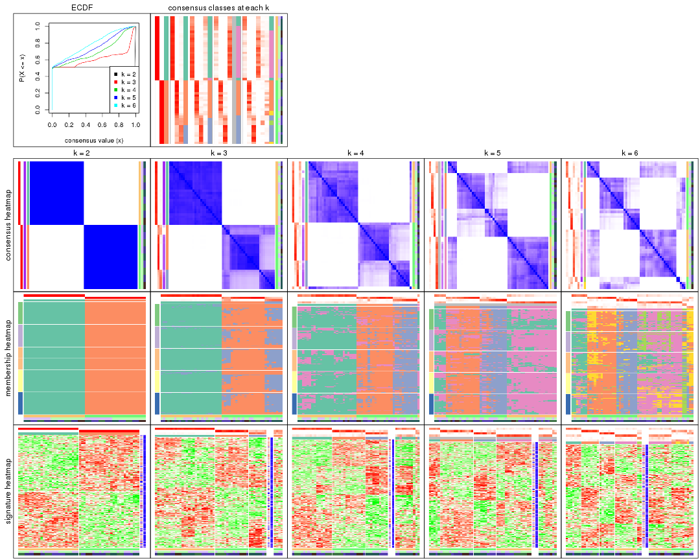

The plots are:

- The first row: a plot of the ECDF (empirical cumulative distribution
  function) curves of the consensus matrix for each `k` and the heatmap of
  predicted classes for each `k`.
- The second row: heatmaps of the consensus matrix for each `k`.
- The third row: heatmaps of the membership matrix for each `k`.
- The fouth row: heatmaps of the signatures for each `k`.

All the plots in panels can be made by individual functions and they are
plotted later in this section.

`select_partition_number()` produces several plots showing different
statistics for choosing "optimized" `k`. There are following statistics:

- ECDF curves of the consensus matrix for each `k`;
- 1-PAC. [The PAC
  score](https://en.wikipedia.org/wiki/Consensus_clustering#Over-interpretation_potential_of_consensus_clustering)
  measures the proportion of the ambiguous subgrouping.
- Mean silhouette score.
- Concordance. The mean probability of fiting the consensus class ids in all
  partitions.
- Area increased. Denote $A_k$ as the area under the ECDF curve for current
  `k`, the area increased is defined as $A_k - A_{k-1}$.
- Rand index. The percent of pairs of samples that are both in a same cluster
  or both are not in a same cluster in the partition of k and k-1.
- Jaccard index. The ratio of pairs of samples are both in a same cluster in
  the partition of k and k-1 and the pairs of samples are both in a same
  cluster in the partition k or k-1.

The detailed explanations of these statistics can be found in [the _cola_
vignette](http://bioconductor.org/packages/devel/bioc/vignettes/cola/inst/doc/cola.html#toc_13).

Generally speaking, lower PAC score, higher mean silhouette score or higher
concordance corresponds to better partition. Rand index and Jaccard index
measure how similar the current partition is compared to partition with `k-1`.
If they are too similar, we won't accept `k` is better than `k-1`.

```r
select_partition_number(res)
```

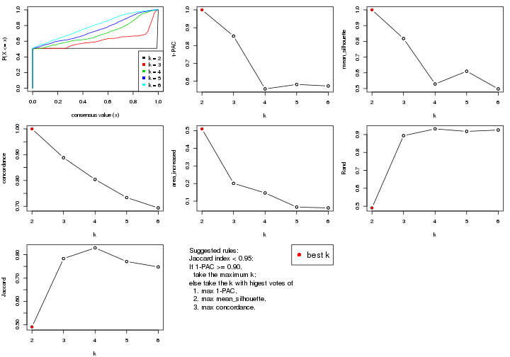

The numeric values for all these statistics can be obtained by `get_stats()`.

```r
get_stats(res)
```

```
#>   k 1-PAC mean_silhouette concordance area_increased  Rand Jaccard
#> 2 2 1.000           1.000       1.000         0.5099 0.491   0.491
#> 3 3 0.853           0.818       0.888         0.2012 0.894   0.783
#> 4 4 0.557           0.529       0.804         0.1467 0.932   0.829
#> 5 5 0.582           0.610       0.734         0.0667 0.918   0.771
#> 6 6 0.573           0.498       0.694         0.0620 0.925   0.748
```

`suggest_best_k()` suggests the best $k$ based on these statistics. The rules are as follows:

- All $k$ with Jaccard index larger than 0.95 are removed because increasing
  $k$ does not provide enough extra information. If all $k$ are removed, it is
  marked as no subgroup is detected.
- For all $k$ with 1-PAC score larger than 0.9, the maximal $k$ is taken as
  the best $k$, and other $k$ are marked as optional $k$.
- If it does not fit the second rule. The $k$ with the maximal vote of the
  highest 1-PAC score, highest mean silhouette, and highest concordance is
  taken as the best $k$.

```r
suggest_best_k(res)
```

```
#> [1] 2
```


Following shows the table of the partitions (You need to click the **show/hide
code output** link to see it). The membership matrix (columns with name `p*`)
is inferred by
[`clue::cl_consensus()`](https://www.rdocumentation.org/link/cl_consensus?package=clue)
function with the `SE` method. Basically the value in the membership matrix
represents the probability to belong to a certain group. The finall class
label for an item is determined with the group with highest probability it
belongs to.

In `get_classes()` function, the entropy is calculated from the membership
matrix and the silhouette score is calculated from the consensus matrix.


<script>
$( function() {
	$( '#tabs-MAD-mclust-get-classes' ).tabs();
} );
</script>
<div id='tabs-MAD-mclust-get-classes'>
<ul>
<li><a href='#tab-MAD-mclust-get-classes-1'>k = 2</a></li>
<li><a href='#tab-MAD-mclust-get-classes-2'>k = 3</a></li>
<li><a href='#tab-MAD-mclust-get-classes-3'>k = 4</a></li>
<li><a href='#tab-MAD-mclust-get-classes-4'>k = 5</a></li>
<li><a href='#tab-MAD-mclust-get-classes-5'>k = 6</a></li>
</ul>

<div id='tab-MAD-mclust-get-classes-1'>
<p><a id='tab-MAD-mclust-get-classes-1-a' style='color:#0366d6' href='#'>show/hide code output</a></p>
<pre><code class="r">cbind(get_classes(res, k = 2), get_membership(res, k = 2))
</code></pre>

<pre><code>#&gt;           class entropy silhouette p1 p2
#&gt; GSM329068     2       0          1  0  1
#&gt; GSM329074     2       0          1  0  1
#&gt; GSM329100     2       0          1  0  1
#&gt; GSM329062     2       0          1  0  1
#&gt; GSM329079     2       0          1  0  1
#&gt; GSM329090     2       0          1  0  1
#&gt; GSM329066     2       0          1  0  1
#&gt; GSM329086     2       0          1  0  1
#&gt; GSM329099     2       0          1  0  1
#&gt; GSM329071     2       0          1  0  1
#&gt; GSM329078     2       0          1  0  1
#&gt; GSM329081     2       0          1  0  1
#&gt; GSM329096     2       0          1  0  1
#&gt; GSM329102     2       0          1  0  1
#&gt; GSM329104     2       0          1  0  1
#&gt; GSM329067     2       0          1  0  1
#&gt; GSM329072     2       0          1  0  1
#&gt; GSM329075     2       0          1  0  1
#&gt; GSM329058     2       0          1  0  1
#&gt; GSM329073     2       0          1  0  1
#&gt; GSM329107     2       0          1  0  1
#&gt; GSM329057     2       0          1  0  1
#&gt; GSM329085     2       0          1  0  1
#&gt; GSM329089     2       0          1  0  1
#&gt; GSM329076     2       0          1  0  1
#&gt; GSM329094     2       0          1  0  1
#&gt; GSM329105     2       0          1  0  1
#&gt; GSM329056     1       0          1  1  0
#&gt; GSM329069     1       0          1  1  0
#&gt; GSM329077     1       0          1  1  0
#&gt; GSM329070     1       0          1  1  0
#&gt; GSM329082     1       0          1  1  0
#&gt; GSM329092     1       0          1  1  0
#&gt; GSM329083     1       0          1  1  0
#&gt; GSM329101     1       0          1  1  0
#&gt; GSM329106     1       0          1  1  0
#&gt; GSM329087     1       0          1  1  0
#&gt; GSM329091     1       0          1  1  0
#&gt; GSM329093     1       0          1  1  0
#&gt; GSM329080     1       0          1  1  0
#&gt; GSM329084     1       0          1  1  0
#&gt; GSM329088     1       0          1  1  0
#&gt; GSM329059     1       0          1  1  0
#&gt; GSM329097     1       0          1  1  0
#&gt; GSM329098     1       0          1  1  0
#&gt; GSM329055     1       0          1  1  0
#&gt; GSM329103     1       0          1  1  0
#&gt; GSM329108     1       0          1  1  0
#&gt; GSM329061     1       0          1  1  0
#&gt; GSM329064     1       0          1  1  0
#&gt; GSM329065     1       0          1  1  0
#&gt; GSM329060     1       0          1  1  0
#&gt; GSM329063     1       0          1  1  0
#&gt; GSM329095     1       0          1  1  0
</code></pre>

<script>
$('#tab-MAD-mclust-get-classes-1-a').parent().next().next().hide();
$('#tab-MAD-mclust-get-classes-1-a').click(function(){
  $('#tab-MAD-mclust-get-classes-1-a').parent().next().next().toggle();
  return(false);
});
</script>
</div>

<div id='tab-MAD-mclust-get-classes-2'>
<p><a id='tab-MAD-mclust-get-classes-2-a' style='color:#0366d6' href='#'>show/hide code output</a></p>
<pre><code class="r">cbind(get_classes(res, k = 3), get_membership(res, k = 3))
</code></pre>

<pre><code>#&gt;           class entropy silhouette    p1    p2    p3
#&gt; GSM329068     2  0.1411      0.814 0.000 0.964 0.036
#&gt; GSM329074     2  0.1411      0.812 0.000 0.964 0.036
#&gt; GSM329100     2  0.3816      0.707 0.000 0.852 0.148
#&gt; GSM329062     2  0.0747      0.815 0.000 0.984 0.016
#&gt; GSM329079     2  0.0237      0.812 0.000 0.996 0.004
#&gt; GSM329090     2  0.0747      0.813 0.000 0.984 0.016
#&gt; GSM329066     2  0.0424      0.815 0.000 0.992 0.008
#&gt; GSM329086     2  0.2878      0.778 0.000 0.904 0.096
#&gt; GSM329099     2  0.0424      0.810 0.000 0.992 0.008
#&gt; GSM329071     2  0.5706      0.256 0.000 0.680 0.320
#&gt; GSM329078     2  0.6308     -0.359 0.000 0.508 0.492
#&gt; GSM329081     2  0.1411      0.812 0.000 0.964 0.036
#&gt; GSM329096     3  0.5327      0.879 0.000 0.272 0.728
#&gt; GSM329102     3  0.5397      0.881 0.000 0.280 0.720
#&gt; GSM329104     3  0.5465      0.877 0.000 0.288 0.712
#&gt; GSM329067     2  0.2448      0.798 0.000 0.924 0.076
#&gt; GSM329072     2  0.0424      0.814 0.000 0.992 0.008
#&gt; GSM329075     2  0.1411      0.812 0.000 0.964 0.036
#&gt; GSM329058     2  0.2356      0.784 0.000 0.928 0.072
#&gt; GSM329073     3  0.6291      0.544 0.000 0.468 0.532
#&gt; GSM329107     2  0.1163      0.811 0.000 0.972 0.028
#&gt; GSM329057     3  0.5835      0.823 0.000 0.340 0.660
#&gt; GSM329085     2  0.6280     -0.243 0.000 0.540 0.460
#&gt; GSM329089     2  0.6267     -0.312 0.000 0.548 0.452
#&gt; GSM329076     3  0.6079      0.767 0.000 0.388 0.612
#&gt; GSM329094     3  0.5291      0.880 0.000 0.268 0.732
#&gt; GSM329105     3  0.5397      0.880 0.000 0.280 0.720
#&gt; GSM329056     1  0.0747      0.977 0.984 0.000 0.016
#&gt; GSM329069     1  0.1643      0.974 0.956 0.000 0.044
#&gt; GSM329077     1  0.2066      0.970 0.940 0.000 0.060
#&gt; GSM329070     1  0.1289      0.976 0.968 0.000 0.032
#&gt; GSM329082     1  0.1529      0.974 0.960 0.000 0.040
#&gt; GSM329092     1  0.1964      0.972 0.944 0.000 0.056
#&gt; GSM329083     1  0.1529      0.975 0.960 0.000 0.040
#&gt; GSM329101     1  0.1529      0.972 0.960 0.000 0.040
#&gt; GSM329106     1  0.1529      0.972 0.960 0.000 0.040
#&gt; GSM329087     1  0.1529      0.976 0.960 0.000 0.040
#&gt; GSM329091     1  0.1529      0.971 0.960 0.000 0.040
#&gt; GSM329093     1  0.1163      0.976 0.972 0.000 0.028
#&gt; GSM329080     1  0.1289      0.975 0.968 0.000 0.032
#&gt; GSM329084     1  0.2165      0.966 0.936 0.000 0.064
#&gt; GSM329088     1  0.1289      0.976 0.968 0.000 0.032
#&gt; GSM329059     1  0.1529      0.975 0.960 0.000 0.040
#&gt; GSM329097     1  0.0747      0.976 0.984 0.000 0.016
#&gt; GSM329098     1  0.2165      0.964 0.936 0.000 0.064
#&gt; GSM329055     1  0.1289      0.973 0.968 0.000 0.032
#&gt; GSM329103     1  0.1163      0.974 0.972 0.000 0.028
#&gt; GSM329108     1  0.1289      0.973 0.968 0.000 0.032
#&gt; GSM329061     1  0.1163      0.974 0.972 0.000 0.028
#&gt; GSM329064     1  0.1753      0.974 0.952 0.000 0.048
#&gt; GSM329065     1  0.1031      0.976 0.976 0.000 0.024
#&gt; GSM329060     1  0.1860      0.972 0.948 0.000 0.052
#&gt; GSM329063     1  0.2165      0.969 0.936 0.000 0.064
#&gt; GSM329095     1  0.1753      0.973 0.952 0.000 0.048
</code></pre>

<script>
$('#tab-MAD-mclust-get-classes-2-a').parent().next().next().hide();
$('#tab-MAD-mclust-get-classes-2-a').click(function(){
  $('#tab-MAD-mclust-get-classes-2-a').parent().next().next().toggle();
  return(false);
});
</script>
</div>

<div id='tab-MAD-mclust-get-classes-3'>
<p><a id='tab-MAD-mclust-get-classes-3-a' style='color:#0366d6' href='#'>show/hide code output</a></p>
<pre><code class="r">cbind(get_classes(res, k = 4), get_membership(res, k = 4))
</code></pre>

<pre><code>#&gt;           class entropy silhouette    p1    p2    p3    p4
#&gt; GSM329068     2  0.3547     0.8269 0.000 0.864 0.064 0.072
#&gt; GSM329074     2  0.4636     0.7924 0.000 0.792 0.068 0.140
#&gt; GSM329100     2  0.6497     0.6162 0.000 0.640 0.200 0.160
#&gt; GSM329062     2  0.1854     0.8304 0.000 0.940 0.048 0.012
#&gt; GSM329079     2  0.1174     0.8301 0.000 0.968 0.012 0.020
#&gt; GSM329090     2  0.1629     0.8290 0.000 0.952 0.024 0.024
#&gt; GSM329066     2  0.1042     0.8313 0.000 0.972 0.008 0.020
#&gt; GSM329086     2  0.5574     0.7132 0.000 0.728 0.148 0.124
#&gt; GSM329099     2  0.0707     0.8320 0.000 0.980 0.000 0.020
#&gt; GSM329071     2  0.5511    -0.2632 0.000 0.500 0.484 0.016
#&gt; GSM329078     3  0.6111     0.6777 0.000 0.256 0.652 0.092
#&gt; GSM329081     2  0.3958     0.8069 0.000 0.836 0.112 0.052
#&gt; GSM329096     3  0.2081     0.8151 0.000 0.084 0.916 0.000
#&gt; GSM329102     3  0.2662     0.8089 0.000 0.084 0.900 0.016
#&gt; GSM329104     3  0.2676     0.8122 0.000 0.092 0.896 0.012
#&gt; GSM329067     2  0.4635     0.7944 0.000 0.796 0.080 0.124
#&gt; GSM329072     2  0.1733     0.8318 0.000 0.948 0.028 0.024
#&gt; GSM329075     2  0.3659     0.8097 0.000 0.840 0.024 0.136
#&gt; GSM329058     2  0.3818     0.8030 0.000 0.844 0.108 0.048
#&gt; GSM329073     3  0.6928     0.4020 0.000 0.308 0.556 0.136
#&gt; GSM329107     2  0.2363     0.8163 0.000 0.920 0.056 0.024
#&gt; GSM329057     3  0.3757     0.8087 0.000 0.152 0.828 0.020
#&gt; GSM329085     3  0.6371     0.6192 0.000 0.300 0.608 0.092
#&gt; GSM329089     3  0.5152     0.6332 0.000 0.316 0.664 0.020
#&gt; GSM329076     3  0.4175     0.7623 0.000 0.200 0.784 0.016
#&gt; GSM329094     3  0.2053     0.8115 0.000 0.072 0.924 0.004
#&gt; GSM329105     3  0.2805     0.8176 0.000 0.100 0.888 0.012
#&gt; GSM329056     1  0.2611     0.6371 0.896 0.000 0.008 0.096
#&gt; GSM329069     1  0.4283     0.4066 0.740 0.000 0.004 0.256
#&gt; GSM329077     1  0.3836     0.5894 0.816 0.000 0.016 0.168
#&gt; GSM329070     1  0.2542     0.6421 0.904 0.000 0.012 0.084
#&gt; GSM329082     1  0.3196     0.5969 0.856 0.000 0.008 0.136
#&gt; GSM329092     1  0.4049     0.5104 0.780 0.000 0.008 0.212
#&gt; GSM329083     1  0.3636     0.5647 0.820 0.000 0.008 0.172
#&gt; GSM329101     1  0.2918     0.6153 0.876 0.000 0.008 0.116
#&gt; GSM329106     1  0.3032     0.6077 0.868 0.000 0.008 0.124
#&gt; GSM329087     1  0.3528     0.4628 0.808 0.000 0.000 0.192
#&gt; GSM329091     1  0.2944     0.6059 0.868 0.000 0.004 0.128
#&gt; GSM329093     1  0.2675     0.6078 0.892 0.000 0.008 0.100
#&gt; GSM329080     1  0.4406    -0.0351 0.700 0.000 0.000 0.300
#&gt; GSM329084     4  0.4994     0.0000 0.480 0.000 0.000 0.520
#&gt; GSM329088     1  0.4543    -0.0988 0.676 0.000 0.000 0.324
#&gt; GSM329059     1  0.3157     0.5999 0.852 0.000 0.004 0.144
#&gt; GSM329097     1  0.1824     0.6382 0.936 0.000 0.004 0.060
#&gt; GSM329098     1  0.3708     0.5772 0.832 0.000 0.020 0.148
#&gt; GSM329055     1  0.2799     0.6141 0.884 0.000 0.008 0.108
#&gt; GSM329103     1  0.2737     0.6324 0.888 0.000 0.008 0.104
#&gt; GSM329108     1  0.2053     0.6333 0.924 0.000 0.004 0.072
#&gt; GSM329061     1  0.2401     0.6336 0.904 0.000 0.004 0.092
#&gt; GSM329064     1  0.4877    -0.5853 0.592 0.000 0.000 0.408
#&gt; GSM329065     1  0.1978     0.6238 0.928 0.000 0.004 0.068
#&gt; GSM329060     1  0.4972    -0.7236 0.544 0.000 0.000 0.456
#&gt; GSM329063     1  0.4996    -0.8079 0.516 0.000 0.000 0.484
#&gt; GSM329095     1  0.4933    -0.6576 0.568 0.000 0.000 0.432
</code></pre>

<script>
$('#tab-MAD-mclust-get-classes-3-a').parent().next().next().hide();
$('#tab-MAD-mclust-get-classes-3-a').click(function(){
  $('#tab-MAD-mclust-get-classes-3-a').parent().next().next().toggle();
  return(false);
});
</script>
</div>

<div id='tab-MAD-mclust-get-classes-4'>
<p><a id='tab-MAD-mclust-get-classes-4-a' style='color:#0366d6' href='#'>show/hide code output</a></p>
<pre><code class="r">cbind(get_classes(res, k = 5), get_membership(res, k = 5))
</code></pre>

<pre><code>#&gt;           class entropy silhouette    p1    p2    p3    p4 p5
#&gt; GSM329068     2  0.4536      0.765 0.000 0.712 0.048 0.000 NA
#&gt; GSM329074     2  0.5294      0.686 0.000 0.564 0.056 0.000 NA
#&gt; GSM329100     2  0.6490      0.504 0.004 0.420 0.160 0.000 NA
#&gt; GSM329062     2  0.2819      0.769 0.004 0.884 0.052 0.000 NA
#&gt; GSM329079     2  0.0955      0.768 0.004 0.968 0.000 0.000 NA
#&gt; GSM329090     2  0.1547      0.772 0.004 0.948 0.016 0.000 NA
#&gt; GSM329066     2  0.1522      0.785 0.000 0.944 0.012 0.000 NA
#&gt; GSM329086     2  0.6004      0.654 0.004 0.596 0.160 0.000 NA
#&gt; GSM329099     2  0.1798      0.779 0.004 0.928 0.004 0.000 NA
#&gt; GSM329071     3  0.5693      0.259 0.004 0.440 0.488 0.000 NA
#&gt; GSM329078     3  0.7418      0.535 0.060 0.188 0.472 0.000 NA
#&gt; GSM329081     2  0.4428      0.765 0.000 0.760 0.096 0.000 NA
#&gt; GSM329096     3  0.0703      0.755 0.000 0.024 0.976 0.000 NA
#&gt; GSM329102     3  0.1569      0.746 0.004 0.008 0.944 0.000 NA
#&gt; GSM329104     3  0.1934      0.748 0.004 0.016 0.928 0.000 NA
#&gt; GSM329067     2  0.5383      0.730 0.004 0.644 0.084 0.000 NA
#&gt; GSM329072     2  0.1399      0.781 0.000 0.952 0.028 0.000 NA
#&gt; GSM329075     2  0.4608      0.727 0.000 0.640 0.024 0.000 NA
#&gt; GSM329058     2  0.4959      0.730 0.000 0.712 0.128 0.000 NA
#&gt; GSM329073     3  0.6252      0.343 0.008 0.120 0.504 0.000 NA
#&gt; GSM329107     2  0.2804      0.752 0.004 0.884 0.044 0.000 NA
#&gt; GSM329057     3  0.3971      0.731 0.000 0.100 0.800 0.000 NA
#&gt; GSM329085     3  0.7515      0.514 0.060 0.204 0.452 0.000 NA
#&gt; GSM329089     3  0.5124      0.579 0.004 0.260 0.668 0.000 NA
#&gt; GSM329076     3  0.3396      0.714 0.004 0.136 0.832 0.000 NA
#&gt; GSM329094     3  0.0912      0.751 0.000 0.012 0.972 0.000 NA
#&gt; GSM329105     3  0.1808      0.755 0.004 0.040 0.936 0.000 NA
#&gt; GSM329056     4  0.2905      0.673 0.096 0.000 0.000 0.868 NA
#&gt; GSM329069     4  0.4735      0.391 0.284 0.000 0.000 0.672 NA
#&gt; GSM329077     4  0.4755      0.537 0.244 0.000 0.000 0.696 NA
#&gt; GSM329070     4  0.3267      0.674 0.112 0.000 0.000 0.844 NA
#&gt; GSM329082     4  0.4725      0.562 0.200 0.000 0.000 0.720 NA
#&gt; GSM329092     4  0.4960      0.463 0.268 0.000 0.000 0.668 NA
#&gt; GSM329083     4  0.3875      0.599 0.160 0.000 0.000 0.792 NA
#&gt; GSM329101     4  0.2726      0.653 0.064 0.000 0.000 0.884 NA
#&gt; GSM329106     4  0.3051      0.643 0.076 0.000 0.000 0.864 NA
#&gt; GSM329087     4  0.4527      0.416 0.260 0.000 0.000 0.700 NA
#&gt; GSM329091     4  0.2962      0.648 0.084 0.000 0.000 0.868 NA
#&gt; GSM329093     4  0.3803      0.610 0.140 0.000 0.000 0.804 NA
#&gt; GSM329080     4  0.4974     -0.431 0.464 0.000 0.000 0.508 NA
#&gt; GSM329084     1  0.3928      0.732 0.700 0.000 0.000 0.296 NA
#&gt; GSM329088     4  0.5143     -0.451 0.428 0.000 0.000 0.532 NA
#&gt; GSM329059     4  0.4433      0.587 0.200 0.000 0.000 0.740 NA
#&gt; GSM329097     4  0.2843      0.670 0.076 0.000 0.000 0.876 NA
#&gt; GSM329098     4  0.5215      0.493 0.240 0.000 0.000 0.664 NA
#&gt; GSM329055     4  0.2426      0.661 0.064 0.000 0.000 0.900 NA
#&gt; GSM329103     4  0.2632      0.664 0.072 0.000 0.000 0.888 NA
#&gt; GSM329108     4  0.1992      0.675 0.032 0.000 0.000 0.924 NA
#&gt; GSM329061     4  0.2300      0.667 0.052 0.000 0.000 0.908 NA
#&gt; GSM329064     1  0.4632      0.630 0.540 0.000 0.000 0.448 NA
#&gt; GSM329065     4  0.3090      0.645 0.104 0.000 0.000 0.856 NA
#&gt; GSM329060     1  0.4576      0.751 0.608 0.000 0.000 0.376 NA
#&gt; GSM329063     1  0.4356      0.692 0.648 0.000 0.000 0.340 NA
#&gt; GSM329095     1  0.4885      0.682 0.572 0.000 0.000 0.400 NA
</code></pre>

<script>
$('#tab-MAD-mclust-get-classes-4-a').parent().next().next().hide();
$('#tab-MAD-mclust-get-classes-4-a').click(function(){
  $('#tab-MAD-mclust-get-classes-4-a').parent().next().next().toggle();
  return(false);
});
</script>
</div>

<div id='tab-MAD-mclust-get-classes-5'>
<p><a id='tab-MAD-mclust-get-classes-5-a' style='color:#0366d6' href='#'>show/hide code output</a></p>
<pre><code class="r">cbind(get_classes(res, k = 6), get_membership(res, k = 6))
</code></pre>

<pre><code>#&gt;           class entropy silhouette    p1    p2    p3    p4    p5    p6
#&gt; GSM329068     2  0.4414     0.3382 0.000 0.628 0.032 0.000 0.004 0.336
#&gt; GSM329074     6  0.4537     0.1212 0.000 0.412 0.036 0.000 0.000 0.552
#&gt; GSM329100     6  0.5019     0.3883 0.000 0.292 0.104 0.000 0.000 0.604
#&gt; GSM329062     2  0.2872     0.6370 0.000 0.868 0.028 0.000 0.024 0.080
#&gt; GSM329079     2  0.1349     0.6467 0.000 0.940 0.000 0.000 0.004 0.056
#&gt; GSM329090     2  0.1478     0.6438 0.000 0.944 0.004 0.000 0.032 0.020
#&gt; GSM329066     2  0.1765     0.6498 0.000 0.904 0.000 0.000 0.000 0.096
#&gt; GSM329086     2  0.5379     0.0137 0.000 0.516 0.120 0.000 0.000 0.364
#&gt; GSM329099     2  0.1714     0.6419 0.000 0.908 0.000 0.000 0.000 0.092
#&gt; GSM329071     3  0.6359    -0.0487 0.000 0.416 0.420 0.000 0.080 0.084
#&gt; GSM329078     5  0.5428     0.9717 0.000 0.128 0.308 0.000 0.560 0.004
#&gt; GSM329081     2  0.4228     0.5214 0.000 0.716 0.072 0.000 0.000 0.212
#&gt; GSM329096     3  0.1078     0.6895 0.000 0.016 0.964 0.000 0.012 0.008
#&gt; GSM329102     3  0.1477     0.6818 0.004 0.008 0.940 0.000 0.000 0.048
#&gt; GSM329104     3  0.1829     0.6822 0.004 0.012 0.920 0.000 0.000 0.064
#&gt; GSM329067     2  0.4967    -0.0500 0.000 0.512 0.068 0.000 0.000 0.420
#&gt; GSM329072     2  0.1003     0.6562 0.000 0.964 0.004 0.000 0.004 0.028
#&gt; GSM329075     2  0.4097    -0.1425 0.000 0.500 0.008 0.000 0.000 0.492
#&gt; GSM329058     2  0.5011     0.4054 0.000 0.620 0.116 0.000 0.000 0.264
#&gt; GSM329073     6  0.5242     0.0687 0.004 0.080 0.448 0.000 0.000 0.468
#&gt; GSM329107     2  0.3362     0.6044 0.000 0.840 0.028 0.000 0.052 0.080
#&gt; GSM329057     3  0.4151     0.5437 0.000 0.064 0.780 0.000 0.120 0.036
#&gt; GSM329085     5  0.5451     0.9720 0.000 0.136 0.296 0.000 0.564 0.004
#&gt; GSM329089     3  0.5652     0.3271 0.000 0.216 0.632 0.000 0.076 0.076
#&gt; GSM329076     3  0.3339     0.5856 0.000 0.144 0.816 0.000 0.012 0.028
#&gt; GSM329094     3  0.0717     0.6931 0.000 0.016 0.976 0.000 0.000 0.008
#&gt; GSM329105     3  0.1710     0.6883 0.000 0.028 0.936 0.000 0.016 0.020
#&gt; GSM329056     4  0.4784     0.5658 0.056 0.000 0.000 0.724 0.160 0.060
#&gt; GSM329069     4  0.6342     0.3344 0.204 0.000 0.000 0.568 0.136 0.092
#&gt; GSM329077     4  0.6629     0.3971 0.100 0.000 0.000 0.500 0.280 0.120
#&gt; GSM329070     4  0.4057     0.5927 0.072 0.000 0.000 0.796 0.080 0.052
#&gt; GSM329082     4  0.6549     0.4272 0.140 0.000 0.000 0.544 0.208 0.108
#&gt; GSM329092     4  0.6774     0.2904 0.260 0.000 0.000 0.492 0.144 0.104
#&gt; GSM329083     4  0.6072     0.4473 0.124 0.000 0.000 0.612 0.160 0.104
#&gt; GSM329101     4  0.2923     0.5761 0.060 0.000 0.000 0.868 0.020 0.052
#&gt; GSM329106     4  0.4175     0.5443 0.072 0.000 0.000 0.788 0.060 0.080
#&gt; GSM329087     4  0.5401     0.2607 0.316 0.000 0.000 0.588 0.048 0.048
#&gt; GSM329091     4  0.4201     0.5403 0.084 0.000 0.000 0.784 0.048 0.084
#&gt; GSM329093     4  0.5672     0.4601 0.172 0.000 0.000 0.648 0.100 0.080
#&gt; GSM329080     1  0.5229     0.5641 0.596 0.000 0.000 0.320 0.052 0.032
#&gt; GSM329084     1  0.3670     0.6392 0.812 0.000 0.000 0.112 0.052 0.024
#&gt; GSM329088     1  0.4780     0.5766 0.592 0.000 0.000 0.360 0.020 0.028
#&gt; GSM329059     4  0.6150     0.4756 0.160 0.000 0.000 0.600 0.148 0.092
#&gt; GSM329097     4  0.4586     0.5780 0.076 0.000 0.000 0.756 0.096 0.072
#&gt; GSM329098     4  0.6856     0.3393 0.112 0.000 0.000 0.456 0.304 0.128
#&gt; GSM329055     4  0.3616     0.5690 0.056 0.000 0.000 0.828 0.056 0.060
#&gt; GSM329103     4  0.3667     0.5424 0.136 0.000 0.000 0.804 0.028 0.032
#&gt; GSM329108     4  0.2731     0.5854 0.068 0.000 0.000 0.876 0.012 0.044
#&gt; GSM329061     4  0.3574     0.5440 0.144 0.000 0.000 0.804 0.016 0.036
#&gt; GSM329064     1  0.4436     0.6336 0.652 0.000 0.000 0.308 0.012 0.028
#&gt; GSM329065     4  0.5337     0.4870 0.164 0.000 0.000 0.680 0.084 0.072
#&gt; GSM329060     1  0.3535     0.7126 0.760 0.000 0.000 0.220 0.008 0.012
#&gt; GSM329063     1  0.4717     0.5919 0.704 0.000 0.000 0.208 0.056 0.032
#&gt; GSM329095     1  0.4564     0.6634 0.684 0.000 0.000 0.256 0.024 0.036
</code></pre>

<script>
$('#tab-MAD-mclust-get-classes-5-a').parent().next().next().hide();
$('#tab-MAD-mclust-get-classes-5-a').click(function(){
  $('#tab-MAD-mclust-get-classes-5-a').parent().next().next().toggle();
  return(false);
});
</script>
</div>
</div>

Heatmaps for the consensus matrix. It visualizes the probability of two
samples to be in a same group.


<script>
$( function() {
	$( '#tabs-MAD-mclust-consensus-heatmap' ).tabs();
} );
</script>
<div id='tabs-MAD-mclust-consensus-heatmap'>
<ul>
<li><a href='#tab-MAD-mclust-consensus-heatmap-1'>k = 2</a></li>
<li><a href='#tab-MAD-mclust-consensus-heatmap-2'>k = 3</a></li>
<li><a href='#tab-MAD-mclust-consensus-heatmap-3'>k = 4</a></li>
<li><a href='#tab-MAD-mclust-consensus-heatmap-4'>k = 5</a></li>
<li><a href='#tab-MAD-mclust-consensus-heatmap-5'>k = 6</a></li>
</ul>
<div id='tab-MAD-mclust-consensus-heatmap-1'>
<pre><code class="r">consensus_heatmap(res, k = 2)
</code></pre>

<p></p>

</div>
<div id='tab-MAD-mclust-consensus-heatmap-2'>
<pre><code class="r">consensus_heatmap(res, k = 3)
</code></pre>

<p>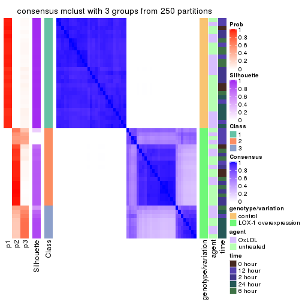</p>

</div>
<div id='tab-MAD-mclust-consensus-heatmap-3'>
<pre><code class="r">consensus_heatmap(res, k = 4)
</code></pre>

<p>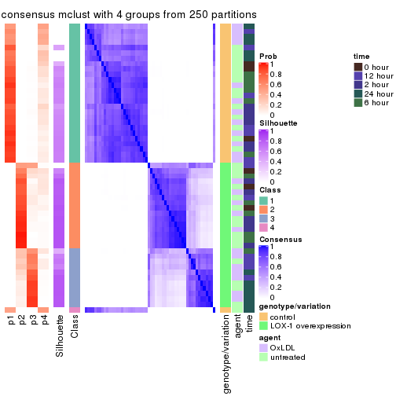</p>

</div>
<div id='tab-MAD-mclust-consensus-heatmap-4'>
<pre><code class="r">consensus_heatmap(res, k = 5)
</code></pre>

<p>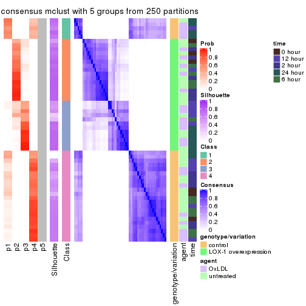</p>

</div>
<div id='tab-MAD-mclust-consensus-heatmap-5'>
<pre><code class="r">consensus_heatmap(res, k = 6)
</code></pre>

<p>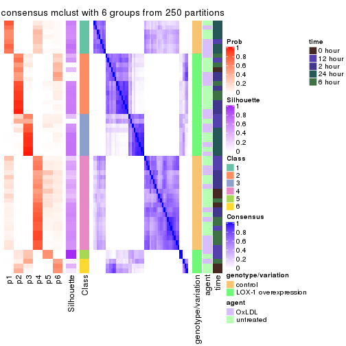</p>

</div>
</div>

Heatmaps for the membership of samples in all partitions to see how consistent they are:


<script>
$( function() {
	$( '#tabs-MAD-mclust-membership-heatmap' ).tabs();
} );
</script>
<div id='tabs-MAD-mclust-membership-heatmap'>
<ul>
<li><a href='#tab-MAD-mclust-membership-heatmap-1'>k = 2</a></li>
<li><a href='#tab-MAD-mclust-membership-heatmap-2'>k = 3</a></li>
<li><a href='#tab-MAD-mclust-membership-heatmap-3'>k = 4</a></li>
<li><a href='#tab-MAD-mclust-membership-heatmap-4'>k = 5</a></li>
<li><a href='#tab-MAD-mclust-membership-heatmap-5'>k = 6</a></li>
</ul>
<div id='tab-MAD-mclust-membership-heatmap-1'>
<pre><code class="r">membership_heatmap(res, k = 2)
</code></pre>

<p></p>

</div>
<div id='tab-MAD-mclust-membership-heatmap-2'>
<pre><code class="r">membership_heatmap(res, k = 3)
</code></pre>

<p>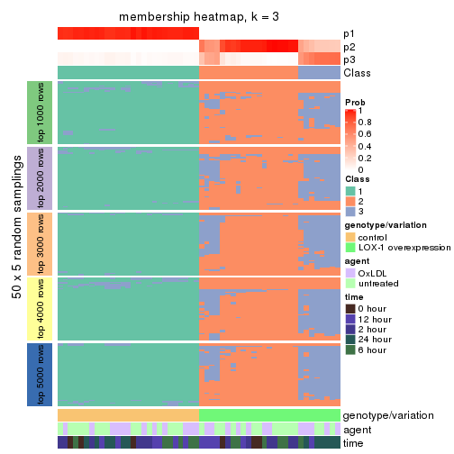</p>

</div>
<div id='tab-MAD-mclust-membership-heatmap-3'>
<pre><code class="r">membership_heatmap(res, k = 4)
</code></pre>

<p>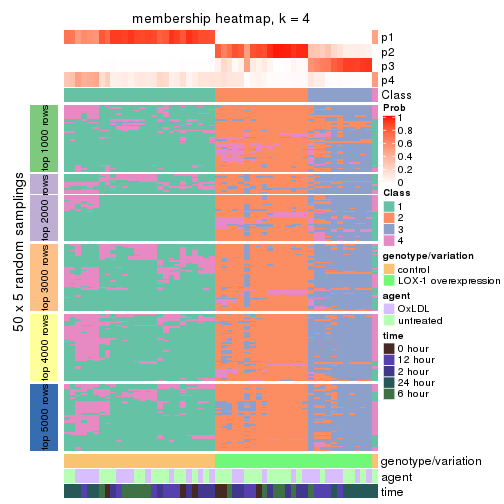</p>

</div>
<div id='tab-MAD-mclust-membership-heatmap-4'>
<pre><code class="r">membership_heatmap(res, k = 5)
</code></pre>

<p>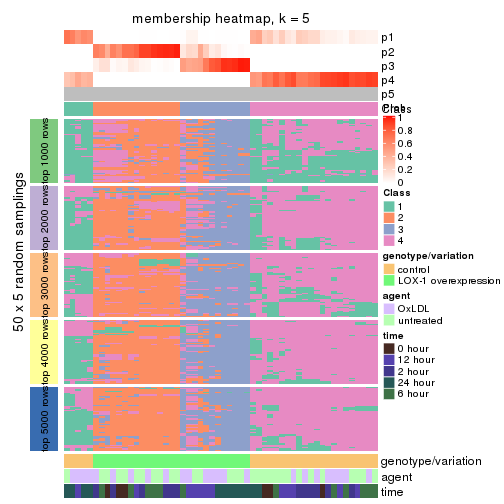</p>

</div>
<div id='tab-MAD-mclust-membership-heatmap-5'>
<pre><code class="r">membership_heatmap(res, k = 6)
</code></pre>

<p>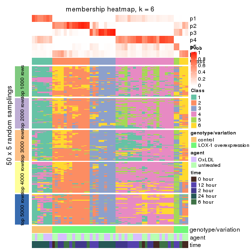</p>

</div>
</div>

As soon as we have had the classes for columns, we can look for signatures
which are significantly different between classes which can be candidate marks
for certain classes. Following are the heatmaps for signatures.


Signature heatmaps where rows are scaled:


<script>
$( function() {
	$( '#tabs-MAD-mclust-get-signatures' ).tabs();
} );
</script>
<div id='tabs-MAD-mclust-get-signatures'>
<ul>
<li><a href='#tab-MAD-mclust-get-signatures-1'>k = 2</a></li>
<li><a href='#tab-MAD-mclust-get-signatures-2'>k = 3</a></li>
<li><a href='#tab-MAD-mclust-get-signatures-3'>k = 4</a></li>
<li><a href='#tab-MAD-mclust-get-signatures-4'>k = 5</a></li>
<li><a href='#tab-MAD-mclust-get-signatures-5'>k = 6</a></li>
</ul>
<div id='tab-MAD-mclust-get-signatures-1'>
<pre><code class="r">get_signatures(res, k = 2)
</code></pre>

<p>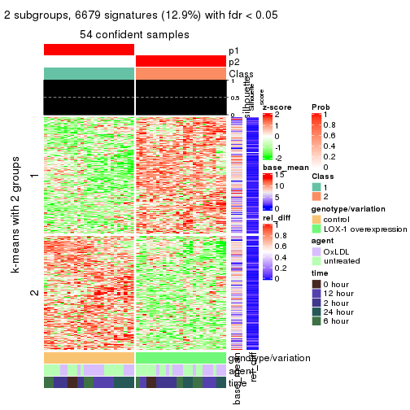</p>

</div>
<div id='tab-MAD-mclust-get-signatures-2'>
<pre><code class="r">get_signatures(res, k = 3)
</code></pre>

<p>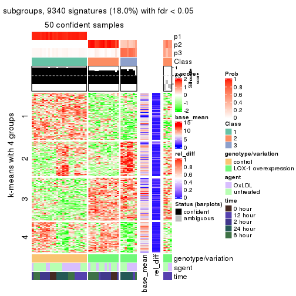</p>

</div>
<div id='tab-MAD-mclust-get-signatures-3'>
<pre><code class="r">get_signatures(res, k = 4)
</code></pre>

<p>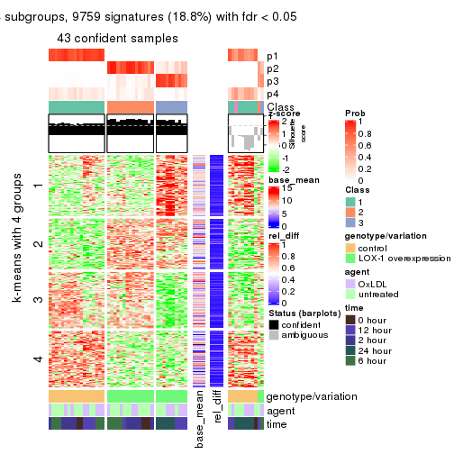</p>

</div>
<div id='tab-MAD-mclust-get-signatures-4'>
<pre><code class="r">get_signatures(res, k = 5)
</code></pre>

<p>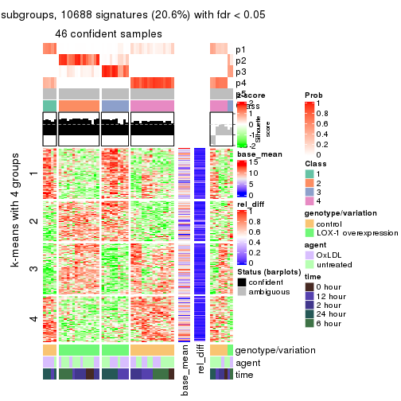</p>

</div>
<div id='tab-MAD-mclust-get-signatures-5'>
<pre><code class="r">get_signatures(res, k = 6)
</code></pre>

<p>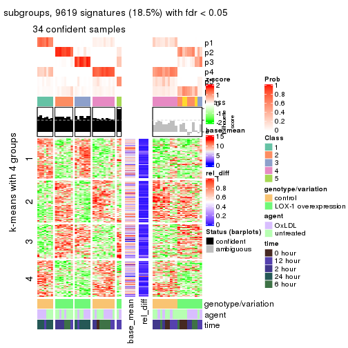</p>

</div>
</div>


Signature heatmaps where rows are not scaled:


<script>
$( function() {
	$( '#tabs-MAD-mclust-get-signatures-no-scale' ).tabs();
} );
</script>
<div id='tabs-MAD-mclust-get-signatures-no-scale'>
<ul>
<li><a href='#tab-MAD-mclust-get-signatures-no-scale-1'>k = 2</a></li>
<li><a href='#tab-MAD-mclust-get-signatures-no-scale-2'>k = 3</a></li>
<li><a href='#tab-MAD-mclust-get-signatures-no-scale-3'>k = 4</a></li>
<li><a href='#tab-MAD-mclust-get-signatures-no-scale-4'>k = 5</a></li>
<li><a href='#tab-MAD-mclust-get-signatures-no-scale-5'>k = 6</a></li>
</ul>
<div id='tab-MAD-mclust-get-signatures-no-scale-1'>
<pre><code class="r">get_signatures(res, k = 2, scale_rows = FALSE)
</code></pre>

<p></p>

</div>
<div id='tab-MAD-mclust-get-signatures-no-scale-2'>
<pre><code class="r">get_signatures(res, k = 3, scale_rows = FALSE)
</code></pre>

<p>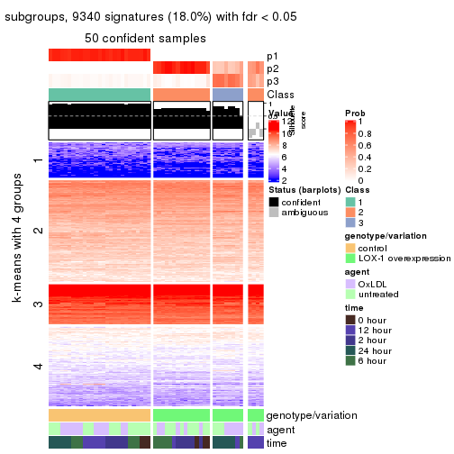</p>

</div>
<div id='tab-MAD-mclust-get-signatures-no-scale-3'>
<pre><code class="r">get_signatures(res, k = 4, scale_rows = FALSE)
</code></pre>

<p>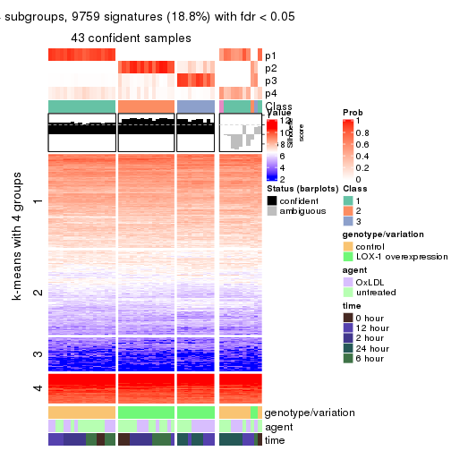</p>

</div>
<div id='tab-MAD-mclust-get-signatures-no-scale-4'>
<pre><code class="r">get_signatures(res, k = 5, scale_rows = FALSE)
</code></pre>

<p>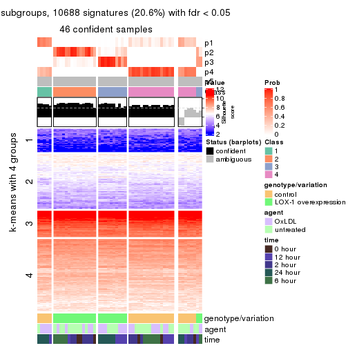</p>

</div>
<div id='tab-MAD-mclust-get-signatures-no-scale-5'>
<pre><code class="r">get_signatures(res, k = 6, scale_rows = FALSE)
</code></pre>

<p>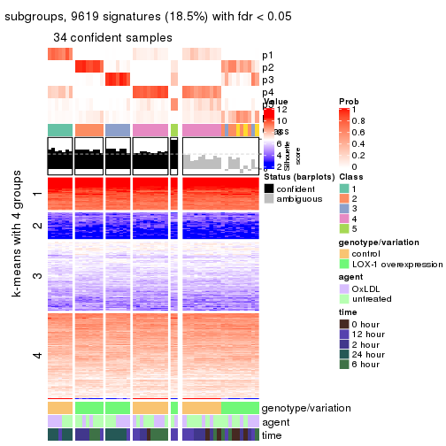</p>

</div>
</div>


Compare the overlap of signatures from different k:

```r
compare_signatures(res)
```

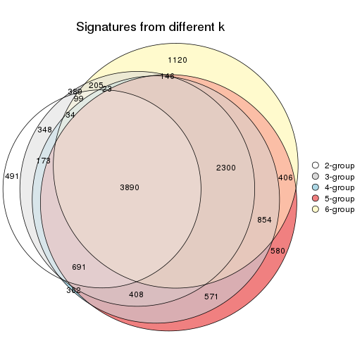

`get_signature()` returns a data frame invisibly. TO get the list of signatures, the function
call should be assigned to a variable explicitly. In following code, if `plot` argument is set
to `FALSE`, no heatmap is plotted while only the differential analysis is performed.

```r
# code only for demonstration
tb = get_signature(res, k = ..., plot = FALSE)
```

An example of the output of `tb` is:

```
#>   which_row         fdr    mean_1    mean_2 scaled_mean_1 scaled_mean_2 km
#> 1        38 0.042760348  8.373488  9.131774    -0.5533452     0.5164555  1
#> 2        40 0.018707592  7.106213  8.469186    -0.6173731     0.5762149  1
#> 3        55 0.019134737 10.221463 11.207825    -0.6159697     0.5749050  1
#> 4        59 0.006059896  5.921854  7.869574    -0.6899429     0.6439467  1
#> 5        60 0.018055526  8.928898 10.211722    -0.6204761     0.5791110  1
#> 6        98 0.009384629 15.714769 14.887706     0.6635654    -0.6193277  2
...
```

The columns in `tb` are:

1. `which_row`: row indices corresponding to the input matrix.
2. `fdr`: FDR for the differential test. 
3. `mean_x`: The mean value in group x.
4. `scaled_mean_x`: The mean value in group x after rows are scaled.
5. `km`: Row groups if k-means clustering is applied to rows.


UMAP plot which shows how samples are separated.


<script>
$( function() {
	$( '#tabs-MAD-mclust-dimension-reduction' ).tabs();
} );
</script>
<div id='tabs-MAD-mclust-dimension-reduction'>
<ul>
<li><a href='#tab-MAD-mclust-dimension-reduction-1'>k = 2</a></li>
<li><a href='#tab-MAD-mclust-dimension-reduction-2'>k = 3</a></li>
<li><a href='#tab-MAD-mclust-dimension-reduction-3'>k = 4</a></li>
<li><a href='#tab-MAD-mclust-dimension-reduction-4'>k = 5</a></li>
<li><a href='#tab-MAD-mclust-dimension-reduction-5'>k = 6</a></li>
</ul>
<div id='tab-MAD-mclust-dimension-reduction-1'>
<pre><code class="r">dimension_reduction(res, k = 2, method = &quot;UMAP&quot;)
</code></pre>

<p></p>

</div>
<div id='tab-MAD-mclust-dimension-reduction-2'>
<pre><code class="r">dimension_reduction(res, k = 3, method = &quot;UMAP&quot;)
</code></pre>

<p>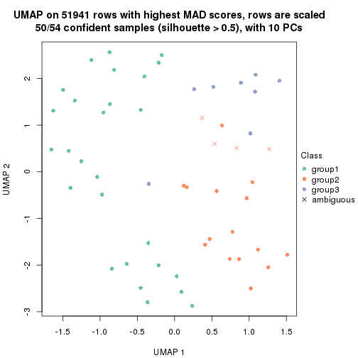</p>

</div>
<div id='tab-MAD-mclust-dimension-reduction-3'>
<pre><code class="r">dimension_reduction(res, k = 4, method = &quot;UMAP&quot;)
</code></pre>

<p>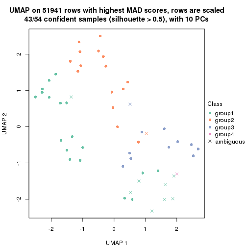</p>

</div>
<div id='tab-MAD-mclust-dimension-reduction-4'>
<pre><code class="r">dimension_reduction(res, k = 5, method = &quot;UMAP&quot;)
</code></pre>

<p>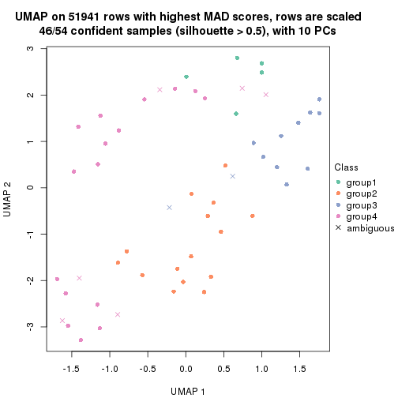</p>

</div>
<div id='tab-MAD-mclust-dimension-reduction-5'>
<pre><code class="r">dimension_reduction(res, k = 6, method = &quot;UMAP&quot;)
</code></pre>

<p>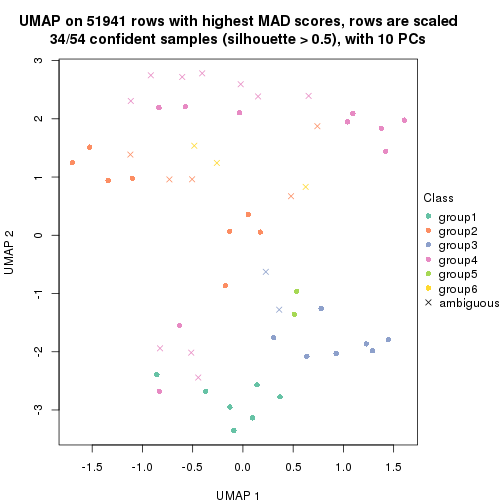</p>

</div>
</div>


Following heatmap shows how subgroups are split when increasing `k`:

```r
collect_classes(res)
```

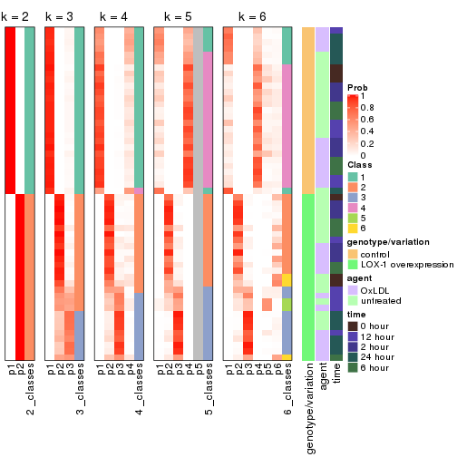


Test correlation between subgroups and known annotations. If the known
annotation is numeric, one-way ANOVA test is applied, and if the known
annotation is discrete, chi-squared contingency table test is applied.

```r
test_to_known_factors(res)
```

```
#>             n genotype/variation(p) agent(p)  time(p) k
#> MAD:mclust 54              1.48e-12    1.000 1.00e+00 2
#> MAD:mclust 50              1.39e-11    0.405 9.64e-03 3
#> MAD:mclust 43              4.60e-10    0.421 8.64e-05 4
#> MAD:mclust 46              5.67e-10    0.257 1.37e-04 5
#> MAD:mclust 34              7.45e-07    0.703 5.19e-04 6
```


If matrix rows can be associated to genes, consider to use `functional_enrichment(res,
...)` to perform function enrichment for the signature genes. See [this vignette](http://bioconductor.org/packages/devel/bioc/vignettes/cola/inst/doc/functional_enrichment.html) for more detailed explanations.


 

---------------------------------------------------


### MAD:NMF**


The object with results only for a single top-value method and a single partition method 
can be extracted as:

```r
res = res_list["MAD", "NMF"]
# you can also extract it by
# res = res_list["MAD:NMF"]
```

A summary of `res` and all the functions that can be applied to it:

```r
res
```

```
#> A 'ConsensusPartition' object with k = 2, 3, 4, 5, 6.
#>   On a matrix with 51941 rows and 54 columns.
#>   Top rows (1000, 2000, 3000, 4000, 5000) are extracted by 'MAD' method.
#>   Subgroups are detected by 'NMF' method.
#>   Performed in total 1250 partitions by row resampling.
#>   Best k for subgroups seems to be 2.
#> 
#> Following methods can be applied to this 'ConsensusPartition' object:
#>  [1] "cola_report"             "collect_classes"         "collect_plots"          
#>  [4] "collect_stats"           "colnames"                "compare_signatures"     
#>  [7] "consensus_heatmap"       "dimension_reduction"     "functional_enrichment"  
#> [10] "get_anno_col"            "get_anno"                "get_classes"            
#> [13] "get_consensus"           "get_matrix"              "get_membership"         
#> [16] "get_param"               "get_signatures"          "get_stats"              
#> [19] "is_best_k"               "is_stable_k"             "membership_heatmap"     
#> [22] "ncol"                    "nrow"                    "plot_ecdf"              
#> [25] "rownames"                "select_partition_number" "show"                   
#> [28] "suggest_best_k"          "test_to_known_factors"
```

`collect_plots()` function collects all the plots made from `res` for all `k` (number of partitions)
into one single page to provide an easy and fast comparison between different `k`.

```r
collect_plots(res)
```

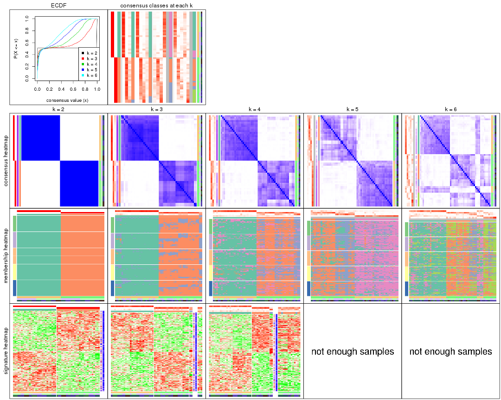

The plots are:

- The first row: a plot of the ECDF (empirical cumulative distribution
  function) curves of the consensus matrix for each `k` and the heatmap of
  predicted classes for each `k`.
- The second row: heatmaps of the consensus matrix for each `k`.
- The third row: heatmaps of the membership matrix for each `k`.
- The fouth row: heatmaps of the signatures for each `k`.

All the plots in panels can be made by individual functions and they are
plotted later in this section.

`select_partition_number()` produces several plots showing different
statistics for choosing "optimized" `k`. There are following statistics:

- ECDF curves of the consensus matrix for each `k`;
- 1-PAC. [The PAC
  score](https://en.wikipedia.org/wiki/Consensus_clustering#Over-interpretation_potential_of_consensus_clustering)
  measures the proportion of the ambiguous subgrouping.
- Mean silhouette score.
- Concordance. The mean probability of fiting the consensus class ids in all
  partitions.
- Area increased. Denote $A_k$ as the area under the ECDF curve for current
  `k`, the area increased is defined as $A_k - A_{k-1}$.
- Rand index. The percent of pairs of samples that are both in a same cluster
  or both are not in a same cluster in the partition of k and k-1.
- Jaccard index. The ratio of pairs of samples are both in a same cluster in
  the partition of k and k-1 and the pairs of samples are both in a same
  cluster in the partition k or k-1.

The detailed explanations of these statistics can be found in [the _cola_
vignette](http://bioconductor.org/packages/devel/bioc/vignettes/cola/inst/doc/cola.html#toc_13).

Generally speaking, lower PAC score, higher mean silhouette score or higher
concordance corresponds to better partition. Rand index and Jaccard index
measure how similar the current partition is compared to partition with `k-1`.
If they are too similar, we won't accept `k` is better than `k-1`.

```r
select_partition_number(res)
```

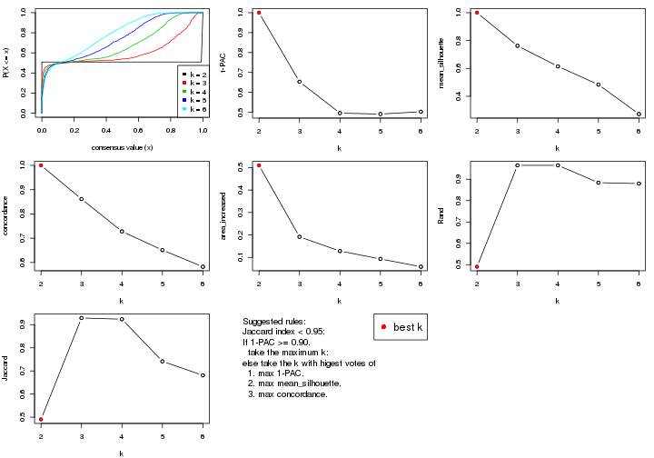

The numeric values for all these statistics can be obtained by `get_stats()`.

```r
get_stats(res)
```

```
#>   k 1-PAC mean_silhouette concordance area_increased  Rand Jaccard
#> 2 2 1.000           1.000       1.000         0.5099 0.491   0.491
#> 3 3 0.653           0.762       0.861         0.1917 0.965   0.929
#> 4 4 0.496           0.615       0.728         0.1283 0.965   0.924
#> 5 5 0.491           0.484       0.651         0.0932 0.884   0.741
#> 6 6 0.503           0.273       0.583         0.0586 0.880   0.681
```

`suggest_best_k()` suggests the best $k$ based on these statistics. The rules are as follows:

- All $k$ with Jaccard index larger than 0.95 are removed because increasing
  $k$ does not provide enough extra information. If all $k$ are removed, it is
  marked as no subgroup is detected.
- For all $k$ with 1-PAC score larger than 0.9, the maximal $k$ is taken as
  the best $k$, and other $k$ are marked as optional $k$.
- If it does not fit the second rule. The $k$ with the maximal vote of the
  highest 1-PAC score, highest mean silhouette, and highest concordance is
  taken as the best $k$.

```r
suggest_best_k(res)
```

```
#> [1] 2
```


Following shows the table of the partitions (You need to click the **show/hide
code output** link to see it). The membership matrix (columns with name `p*`)
is inferred by
[`clue::cl_consensus()`](https://www.rdocumentation.org/link/cl_consensus?package=clue)
function with the `SE` method. Basically the value in the membership matrix
represents the probability to belong to a certain group. The finall class
label for an item is determined with the group with highest probability it
belongs to.

In `get_classes()` function, the entropy is calculated from the membership
matrix and the silhouette score is calculated from the consensus matrix.


<script>
$( function() {
	$( '#tabs-MAD-NMF-get-classes' ).tabs();
} );
</script>
<div id='tabs-MAD-NMF-get-classes'>
<ul>
<li><a href='#tab-MAD-NMF-get-classes-1'>k = 2</a></li>
<li><a href='#tab-MAD-NMF-get-classes-2'>k = 3</a></li>
<li><a href='#tab-MAD-NMF-get-classes-3'>k = 4</a></li>
<li><a href='#tab-MAD-NMF-get-classes-4'>k = 5</a></li>
<li><a href='#tab-MAD-NMF-get-classes-5'>k = 6</a></li>
</ul>

<div id='tab-MAD-NMF-get-classes-1'>
<p><a id='tab-MAD-NMF-get-classes-1-a' style='color:#0366d6' href='#'>show/hide code output</a></p>
<pre><code class="r">cbind(get_classes(res, k = 2), get_membership(res, k = 2))
</code></pre>

<pre><code>#&gt;           class entropy silhouette p1 p2
#&gt; GSM329068     2       0          1  0  1
#&gt; GSM329074     2       0          1  0  1
#&gt; GSM329100     2       0          1  0  1
#&gt; GSM329062     2       0          1  0  1
#&gt; GSM329079     2       0          1  0  1
#&gt; GSM329090     2       0          1  0  1
#&gt; GSM329066     2       0          1  0  1
#&gt; GSM329086     2       0          1  0  1
#&gt; GSM329099     2       0          1  0  1
#&gt; GSM329071     2       0          1  0  1
#&gt; GSM329078     2       0          1  0  1
#&gt; GSM329081     2       0          1  0  1
#&gt; GSM329096     2       0          1  0  1
#&gt; GSM329102     2       0          1  0  1
#&gt; GSM329104     2       0          1  0  1
#&gt; GSM329067     2       0          1  0  1
#&gt; GSM329072     2       0          1  0  1
#&gt; GSM329075     2       0          1  0  1
#&gt; GSM329058     2       0          1  0  1
#&gt; GSM329073     2       0          1  0  1
#&gt; GSM329107     2       0          1  0  1
#&gt; GSM329057     2       0          1  0  1
#&gt; GSM329085     2       0          1  0  1
#&gt; GSM329089     2       0          1  0  1
#&gt; GSM329076     2       0          1  0  1
#&gt; GSM329094     2       0          1  0  1
#&gt; GSM329105     2       0          1  0  1
#&gt; GSM329056     1       0          1  1  0
#&gt; GSM329069     1       0          1  1  0
#&gt; GSM329077     1       0          1  1  0
#&gt; GSM329070     1       0          1  1  0
#&gt; GSM329082     1       0          1  1  0
#&gt; GSM329092     1       0          1  1  0
#&gt; GSM329083     1       0          1  1  0
#&gt; GSM329101     1       0          1  1  0
#&gt; GSM329106     1       0          1  1  0
#&gt; GSM329087     1       0          1  1  0
#&gt; GSM329091     1       0          1  1  0
#&gt; GSM329093     1       0          1  1  0
#&gt; GSM329080     1       0          1  1  0
#&gt; GSM329084     1       0          1  1  0
#&gt; GSM329088     1       0          1  1  0
#&gt; GSM329059     1       0          1  1  0
#&gt; GSM329097     1       0          1  1  0
#&gt; GSM329098     1       0          1  1  0
#&gt; GSM329055     1       0          1  1  0
#&gt; GSM329103     1       0          1  1  0
#&gt; GSM329108     1       0          1  1  0
#&gt; GSM329061     1       0          1  1  0
#&gt; GSM329064     1       0          1  1  0
#&gt; GSM329065     1       0          1  1  0
#&gt; GSM329060     1       0          1  1  0
#&gt; GSM329063     1       0          1  1  0
#&gt; GSM329095     1       0          1  1  0
</code></pre>

<script>
$('#tab-MAD-NMF-get-classes-1-a').parent().next().next().hide();
$('#tab-MAD-NMF-get-classes-1-a').click(function(){
  $('#tab-MAD-NMF-get-classes-1-a').parent().next().next().toggle();
  return(false);
});
</script>
</div>

<div id='tab-MAD-NMF-get-classes-2'>
<p><a id='tab-MAD-NMF-get-classes-2-a' style='color:#0366d6' href='#'>show/hide code output</a></p>
<pre><code class="r">cbind(get_classes(res, k = 3), get_membership(res, k = 3))
</code></pre>

<pre><code>#&gt;           class entropy silhouette    p1    p2    p3
#&gt; GSM329068     2  0.4062      0.695 0.000 0.836 0.164
#&gt; GSM329074     2  0.5560      0.610 0.000 0.700 0.300
#&gt; GSM329100     2  0.5497      0.619 0.000 0.708 0.292
#&gt; GSM329062     2  0.2448      0.677 0.000 0.924 0.076
#&gt; GSM329079     2  0.3686      0.691 0.000 0.860 0.140
#&gt; GSM329090     2  0.3941      0.502 0.000 0.844 0.156
#&gt; GSM329066     2  0.2356      0.670 0.000 0.928 0.072
#&gt; GSM329086     2  0.5397      0.631 0.000 0.720 0.280
#&gt; GSM329099     2  0.4504      0.685 0.000 0.804 0.196
#&gt; GSM329071     2  0.3340      0.565 0.000 0.880 0.120
#&gt; GSM329078     3  0.6521      0.936 0.004 0.492 0.504
#&gt; GSM329081     2  0.3816      0.702 0.000 0.852 0.148
#&gt; GSM329096     2  0.5216      0.116 0.000 0.740 0.260
#&gt; GSM329102     2  0.3340      0.700 0.000 0.880 0.120
#&gt; GSM329104     2  0.3619      0.699 0.000 0.864 0.136
#&gt; GSM329067     2  0.5178      0.653 0.000 0.744 0.256
#&gt; GSM329072     2  0.3619      0.621 0.000 0.864 0.136
#&gt; GSM329075     2  0.5591      0.603 0.000 0.696 0.304
#&gt; GSM329058     2  0.4062      0.702 0.000 0.836 0.164
#&gt; GSM329073     2  0.5706      0.591 0.000 0.680 0.320
#&gt; GSM329107     2  0.3038      0.593 0.000 0.896 0.104
#&gt; GSM329057     2  0.5058      0.166 0.000 0.756 0.244
#&gt; GSM329085     3  0.6500      0.939 0.004 0.464 0.532
#&gt; GSM329089     2  0.3686      0.544 0.000 0.860 0.140
#&gt; GSM329076     2  0.4346      0.429 0.000 0.816 0.184
#&gt; GSM329094     2  0.3482      0.579 0.000 0.872 0.128
#&gt; GSM329105     2  0.1753      0.653 0.000 0.952 0.048
#&gt; GSM329056     1  0.3551      0.890 0.868 0.000 0.132
#&gt; GSM329069     1  0.2448      0.927 0.924 0.000 0.076
#&gt; GSM329077     1  0.6294      0.702 0.692 0.020 0.288
#&gt; GSM329070     1  0.2356      0.936 0.928 0.000 0.072
#&gt; GSM329082     1  0.1529      0.940 0.960 0.000 0.040
#&gt; GSM329092     1  0.2165      0.936 0.936 0.000 0.064
#&gt; GSM329083     1  0.4291      0.853 0.820 0.000 0.180
#&gt; GSM329101     1  0.1163      0.939 0.972 0.000 0.028
#&gt; GSM329106     1  0.1529      0.938 0.960 0.000 0.040
#&gt; GSM329087     1  0.1031      0.936 0.976 0.000 0.024
#&gt; GSM329091     1  0.1643      0.937 0.956 0.000 0.044
#&gt; GSM329093     1  0.2356      0.927 0.928 0.000 0.072
#&gt; GSM329080     1  0.1753      0.937 0.952 0.000 0.048
#&gt; GSM329084     1  0.2165      0.933 0.936 0.000 0.064
#&gt; GSM329088     1  0.1643      0.936 0.956 0.000 0.044
#&gt; GSM329059     1  0.1860      0.938 0.948 0.000 0.052
#&gt; GSM329097     1  0.1289      0.940 0.968 0.000 0.032
#&gt; GSM329098     1  0.5551      0.789 0.760 0.016 0.224
#&gt; GSM329055     1  0.1529      0.937 0.960 0.000 0.040
#&gt; GSM329103     1  0.1031      0.937 0.976 0.000 0.024
#&gt; GSM329108     1  0.2165      0.932 0.936 0.000 0.064
#&gt; GSM329061     1  0.1289      0.935 0.968 0.000 0.032
#&gt; GSM329064     1  0.0892      0.938 0.980 0.000 0.020
#&gt; GSM329065     1  0.3038      0.908 0.896 0.000 0.104
#&gt; GSM329060     1  0.1643      0.936 0.956 0.000 0.044
#&gt; GSM329063     1  0.2261      0.934 0.932 0.000 0.068
#&gt; GSM329095     1  0.4654      0.803 0.792 0.000 0.208
</code></pre>

<script>
$('#tab-MAD-NMF-get-classes-2-a').parent().next().next().hide();
$('#tab-MAD-NMF-get-classes-2-a').click(function(){
  $('#tab-MAD-NMF-get-classes-2-a').parent().next().next().toggle();
  return(false);
});
</script>
</div>

<div id='tab-MAD-NMF-get-classes-3'>
<p><a id='tab-MAD-NMF-get-classes-3-a' style='color:#0366d6' href='#'>show/hide code output</a></p>
<pre><code class="r">cbind(get_classes(res, k = 4), get_membership(res, k = 4))
</code></pre>

<pre><code>#&gt;           class entropy silhouette    p1    p2    p3    p4
#&gt; GSM329068     2   0.276     0.5957 0.000 0.904 0.048 0.048
#&gt; GSM329074     2   0.390     0.5537 0.000 0.832 0.036 0.132
#&gt; GSM329100     2   0.476     0.5315 0.000 0.760 0.040 0.200
#&gt; GSM329062     2   0.466     0.5565 0.000 0.788 0.148 0.064
#&gt; GSM329079     2   0.526     0.5365 0.008 0.768 0.096 0.128
#&gt; GSM329090     2   0.639    -0.0663 0.000 0.480 0.456 0.064
#&gt; GSM329066     2   0.578     0.4764 0.004 0.696 0.228 0.072
#&gt; GSM329086     2   0.485     0.5581 0.000 0.776 0.072 0.152
#&gt; GSM329099     2   0.468     0.5530 0.008 0.804 0.064 0.124
#&gt; GSM329071     2   0.607     0.0311 0.000 0.504 0.452 0.044
#&gt; GSM329078     3   0.422     0.6535 0.000 0.144 0.812 0.044
#&gt; GSM329081     2   0.531     0.5563 0.000 0.744 0.164 0.092
#&gt; GSM329096     3   0.622     0.4526 0.000 0.316 0.608 0.076
#&gt; GSM329102     2   0.644     0.4515 0.000 0.640 0.224 0.136
#&gt; GSM329104     2   0.689     0.3900 0.000 0.596 0.200 0.204
#&gt; GSM329067     2   0.334     0.5815 0.000 0.868 0.032 0.100
#&gt; GSM329072     2   0.594     0.3077 0.004 0.604 0.352 0.040
#&gt; GSM329075     2   0.348     0.5701 0.000 0.856 0.028 0.116
#&gt; GSM329058     2   0.430     0.5924 0.000 0.820 0.088 0.092
#&gt; GSM329073     2   0.576     0.4786 0.000 0.688 0.080 0.232
#&gt; GSM329107     2   0.599     0.2838 0.000 0.608 0.336 0.056
#&gt; GSM329057     3   0.556     0.2994 0.000 0.392 0.584 0.024
#&gt; GSM329085     3   0.438     0.6303 0.012 0.128 0.820 0.040
#&gt; GSM329089     2   0.650    -0.0950 0.000 0.484 0.444 0.072
#&gt; GSM329076     2   0.680    -0.0999 0.000 0.460 0.444 0.096
#&gt; GSM329094     2   0.695     0.1045 0.000 0.500 0.384 0.116
#&gt; GSM329105     2   0.630     0.3616 0.000 0.608 0.308 0.084
#&gt; GSM329056     1   0.373     0.8626 0.848 0.028 0.004 0.120
#&gt; GSM329069     1   0.423     0.8498 0.776 0.008 0.004 0.212
#&gt; GSM329077     1   0.778     0.5374 0.496 0.152 0.020 0.332
#&gt; GSM329070     1   0.418     0.8559 0.800 0.008 0.012 0.180
#&gt; GSM329082     1   0.382     0.8667 0.836 0.008 0.016 0.140
#&gt; GSM329092     1   0.543     0.8028 0.696 0.004 0.040 0.260
#&gt; GSM329083     1   0.483     0.8241 0.748 0.020 0.008 0.224
#&gt; GSM329101     1   0.233     0.8715 0.908 0.000 0.004 0.088
#&gt; GSM329106     1   0.298     0.8734 0.888 0.004 0.016 0.092
#&gt; GSM329087     1   0.247     0.8709 0.908 0.000 0.012 0.080
#&gt; GSM329091     1   0.224     0.8724 0.920 0.004 0.004 0.072
#&gt; GSM329093     1   0.370     0.8659 0.852 0.000 0.048 0.100
#&gt; GSM329080     1   0.350     0.8696 0.860 0.000 0.036 0.104
#&gt; GSM329084     1   0.484     0.8372 0.764 0.000 0.052 0.184
#&gt; GSM329088     1   0.352     0.8692 0.856 0.000 0.032 0.112
#&gt; GSM329059     1   0.343     0.8676 0.848 0.004 0.008 0.140
#&gt; GSM329097     1   0.336     0.8732 0.860 0.008 0.008 0.124
#&gt; GSM329098     1   0.729     0.5795 0.556 0.188 0.004 0.252
#&gt; GSM329055     1   0.234     0.8734 0.912 0.000 0.008 0.080
#&gt; GSM329103     1   0.274     0.8708 0.900 0.000 0.024 0.076
#&gt; GSM329108     1   0.338     0.8661 0.868 0.008 0.016 0.108
#&gt; GSM329061     1   0.350     0.8654 0.860 0.000 0.036 0.104
#&gt; GSM329064     1   0.472     0.8397 0.764 0.000 0.040 0.196
#&gt; GSM329065     1   0.483     0.8273 0.784 0.000 0.096 0.120
#&gt; GSM329060     1   0.367     0.8701 0.852 0.000 0.044 0.104
#&gt; GSM329063     1   0.388     0.8557 0.812 0.000 0.016 0.172
#&gt; GSM329095     1   0.664     0.6279 0.596 0.000 0.284 0.120
</code></pre>

<script>
$('#tab-MAD-NMF-get-classes-3-a').parent().next().next().hide();
$('#tab-MAD-NMF-get-classes-3-a').click(function(){
  $('#tab-MAD-NMF-get-classes-3-a').parent().next().next().toggle();
  return(false);
});
</script>
</div>

<div id='tab-MAD-NMF-get-classes-4'>
<p><a id='tab-MAD-NMF-get-classes-4-a' style='color:#0366d6' href='#'>show/hide code output</a></p>
<pre><code class="r">cbind(get_classes(res, k = 5), get_membership(res, k = 5))
</code></pre>

<pre><code>#&gt;           class entropy silhouette    p1    p2    p3    p4 p5
#&gt; GSM329068     2   0.507     0.4952 0.092 0.732 0.156 0.000 NA
#&gt; GSM329074     2   0.309     0.4920 0.044 0.880 0.044 0.000 NA
#&gt; GSM329100     2   0.488     0.3836 0.148 0.756 0.044 0.000 NA
#&gt; GSM329062     2   0.678     0.2374 0.100 0.516 0.332 0.000 NA
#&gt; GSM329079     2   0.715     0.4290 0.108 0.596 0.184 0.016 NA
#&gt; GSM329090     3   0.654     0.3332 0.120 0.264 0.576 0.000 NA
#&gt; GSM329066     2   0.632     0.1092 0.060 0.508 0.388 0.000 NA
#&gt; GSM329086     2   0.622     0.3498 0.216 0.644 0.092 0.008 NA
#&gt; GSM329099     2   0.625     0.4654 0.096 0.680 0.120 0.008 NA
#&gt; GSM329071     3   0.544     0.3836 0.092 0.260 0.644 0.000 NA
#&gt; GSM329078     3   0.364     0.3652 0.080 0.008 0.836 0.000 NA
#&gt; GSM329081     2   0.707     0.2268 0.128 0.536 0.264 0.000 NA
#&gt; GSM329096     3   0.564     0.2105 0.200 0.136 0.656 0.000 NA
#&gt; GSM329102     2   0.690    -0.4532 0.300 0.400 0.296 0.000 NA
#&gt; GSM329104     1   0.732     0.0000 0.428 0.292 0.248 0.000 NA
#&gt; GSM329067     2   0.515     0.4771 0.100 0.752 0.084 0.000 NA
#&gt; GSM329072     3   0.661     0.1897 0.068 0.344 0.524 0.000 NA
#&gt; GSM329075     2   0.234     0.4942 0.020 0.916 0.040 0.000 NA
#&gt; GSM329058     2   0.607     0.3441 0.164 0.648 0.156 0.000 NA
#&gt; GSM329073     2   0.637     0.0526 0.236 0.616 0.076 0.000 NA
#&gt; GSM329107     3   0.656     0.1617 0.064 0.364 0.512 0.000 NA
#&gt; GSM329057     3   0.427     0.4084 0.060 0.164 0.772 0.000 NA
#&gt; GSM329085     3   0.402     0.3594 0.088 0.012 0.820 0.004 NA
#&gt; GSM329089     3   0.590     0.2896 0.108 0.184 0.668 0.000 NA
#&gt; GSM329076     3   0.628     0.1399 0.212 0.224 0.560 0.000 NA
#&gt; GSM329094     3   0.657     0.0599 0.196 0.240 0.548 0.000 NA
#&gt; GSM329105     3   0.659    -0.1049 0.180 0.384 0.432 0.000 NA
#&gt; GSM329056     4   0.473     0.7647 0.024 0.048 0.000 0.748 NA
#&gt; GSM329069     4   0.539     0.7501 0.052 0.032 0.000 0.680 NA
#&gt; GSM329077     4   0.766     0.3798 0.052 0.268 0.000 0.388 NA
#&gt; GSM329070     4   0.485     0.7596 0.040 0.008 0.000 0.684 NA
#&gt; GSM329082     4   0.538     0.7422 0.032 0.028 0.000 0.628 NA
#&gt; GSM329092     4   0.671     0.6496 0.092 0.020 0.016 0.496 NA
#&gt; GSM329083     4   0.595     0.7225 0.056 0.068 0.000 0.652 NA
#&gt; GSM329101     4   0.311     0.7793 0.016 0.008 0.000 0.852 NA
#&gt; GSM329106     4   0.399     0.7758 0.024 0.020 0.000 0.796 NA
#&gt; GSM329087     4   0.303     0.7793 0.020 0.000 0.004 0.856 NA
#&gt; GSM329091     4   0.247     0.7820 0.012 0.008 0.000 0.896 NA
#&gt; GSM329093     4   0.527     0.7497 0.060 0.000 0.040 0.716 NA
#&gt; GSM329080     4   0.486     0.7641 0.068 0.004 0.024 0.760 NA
#&gt; GSM329084     4   0.646     0.6578 0.148 0.004 0.024 0.596 NA
#&gt; GSM329088     4   0.433     0.7742 0.032 0.000 0.032 0.784 NA
#&gt; GSM329059     4   0.522     0.7456 0.032 0.036 0.000 0.680 NA
#&gt; GSM329097     4   0.403     0.7842 0.024 0.012 0.000 0.780 NA
#&gt; GSM329098     4   0.792     0.3446 0.084 0.244 0.000 0.396 NA
#&gt; GSM329055     4   0.343     0.7809 0.028 0.008 0.000 0.836 NA
#&gt; GSM329103     4   0.382     0.7810 0.032 0.000 0.008 0.804 NA
#&gt; GSM329108     4   0.429     0.7534 0.032 0.004 0.000 0.740 NA
#&gt; GSM329061     4   0.420     0.7742 0.024 0.000 0.012 0.760 NA
#&gt; GSM329064     4   0.579     0.7216 0.072 0.004 0.012 0.604 NA
#&gt; GSM329065     4   0.568     0.7227 0.048 0.000 0.056 0.668 NA
#&gt; GSM329060     4   0.467     0.7741 0.076 0.000 0.008 0.748 NA
#&gt; GSM329063     4   0.503     0.7520 0.076 0.000 0.004 0.692 NA
#&gt; GSM329095     4   0.799     0.4682 0.112 0.000 0.240 0.424 NA
</code></pre>

<script>
$('#tab-MAD-NMF-get-classes-4-a').parent().next().next().hide();
$('#tab-MAD-NMF-get-classes-4-a').click(function(){
  $('#tab-MAD-NMF-get-classes-4-a').parent().next().next().toggle();
  return(false);
});
</script>
</div>

<div id='tab-MAD-NMF-get-classes-5'>
<p><a id='tab-MAD-NMF-get-classes-5-a' style='color:#0366d6' href='#'>show/hide code output</a></p>
<pre><code class="r">cbind(get_classes(res, k = 6), get_membership(res, k = 6))
</code></pre>

<pre><code>#&gt;           class entropy silhouette    p1    p2    p3    p4    p5 p6
#&gt; GSM329068     2   0.478    0.43686 0.000 0.748 0.056 0.008 0.072 NA
#&gt; GSM329074     2   0.519    0.40098 0.000 0.704 0.084 0.040 0.012 NA
#&gt; GSM329100     2   0.639    0.32925 0.004 0.500 0.076 0.048 0.016 NA
#&gt; GSM329062     2   0.623    0.24671 0.004 0.584 0.044 0.020 0.260 NA
#&gt; GSM329079     2   0.551    0.38097 0.024 0.692 0.008 0.024 0.156 NA
#&gt; GSM329090     5   0.593    0.26139 0.000 0.348 0.036 0.016 0.536 NA
#&gt; GSM329066     2   0.533    0.30094 0.004 0.648 0.052 0.008 0.256 NA
#&gt; GSM329086     2   0.708    0.23233 0.000 0.396 0.148 0.024 0.056 NA
#&gt; GSM329099     2   0.495    0.44106 0.028 0.752 0.008 0.024 0.084 NA
#&gt; GSM329071     5   0.629    0.28441 0.000 0.308 0.112 0.012 0.528 NA
#&gt; GSM329078     5   0.279    0.44175 0.000 0.016 0.060 0.016 0.884 NA
#&gt; GSM329081     2   0.818    0.21519 0.004 0.436 0.164 0.080 0.148 NA
#&gt; GSM329096     5   0.564   -0.28658 0.000 0.112 0.420 0.004 0.460 NA
#&gt; GSM329102     3   0.626    0.52128 0.004 0.316 0.520 0.004 0.120 NA
#&gt; GSM329104     3   0.723    0.35496 0.000 0.264 0.488 0.036 0.096 NA
#&gt; GSM329067     2   0.583    0.39735 0.000 0.552 0.036 0.036 0.032 NA
#&gt; GSM329072     5   0.586    0.16401 0.004 0.372 0.024 0.000 0.504 NA
#&gt; GSM329075     2   0.441    0.43045 0.000 0.764 0.084 0.020 0.008 NA
#&gt; GSM329058     2   0.591    0.34444 0.000 0.652 0.144 0.012 0.108 NA
#&gt; GSM329073     2   0.731   -0.00458 0.000 0.392 0.248 0.040 0.032 NA
#&gt; GSM329107     2   0.566   -0.09315 0.008 0.476 0.012 0.024 0.444 NA
#&gt; GSM329057     5   0.547    0.28956 0.000 0.180 0.160 0.000 0.636 NA
#&gt; GSM329085     5   0.150    0.45095 0.000 0.012 0.024 0.004 0.948 NA
#&gt; GSM329089     5   0.644    0.31496 0.000 0.152 0.172 0.032 0.596 NA
#&gt; GSM329076     3   0.658    0.37617 0.000 0.228 0.408 0.000 0.332 NA
#&gt; GSM329094     3   0.613    0.48070 0.000 0.212 0.496 0.000 0.276 NA
#&gt; GSM329105     2   0.660   -0.48631 0.000 0.348 0.336 0.000 0.292 NA
#&gt; GSM329056     1   0.585    0.36673 0.644 0.036 0.020 0.168 0.000 NA
#&gt; GSM329069     4   0.594    0.16672 0.424 0.000 0.020 0.432 0.000 NA
#&gt; GSM329077     4   0.826    0.27188 0.232 0.152 0.052 0.344 0.000 NA
#&gt; GSM329070     1   0.603    0.01210 0.504 0.028 0.012 0.384 0.008 NA
#&gt; GSM329082     1   0.624    0.17587 0.576 0.024 0.032 0.288 0.016 NA
#&gt; GSM329092     4   0.538    0.38217 0.256 0.004 0.016 0.648 0.028 NA
#&gt; GSM329083     1   0.715   -0.05478 0.480 0.064 0.028 0.288 0.004 NA
#&gt; GSM329101     1   0.359    0.47845 0.816 0.008 0.008 0.120 0.000 NA
#&gt; GSM329106     1   0.484    0.45873 0.752 0.024 0.024 0.132 0.008 NA
#&gt; GSM329087     1   0.377    0.46289 0.816 0.000 0.048 0.104 0.008 NA
#&gt; GSM329091     1   0.332    0.47818 0.852 0.024 0.012 0.076 0.000 NA
#&gt; GSM329093     1   0.577    0.42378 0.708 0.032 0.028 0.108 0.080 NA
#&gt; GSM329080     1   0.571    0.37424 0.660 0.000 0.164 0.120 0.020 NA
#&gt; GSM329084     1   0.767   -0.04296 0.400 0.004 0.276 0.208 0.024 NA
#&gt; GSM329088     1   0.433    0.47276 0.784 0.000 0.112 0.048 0.016 NA
#&gt; GSM329059     1   0.679    0.07815 0.516 0.020 0.048 0.272 0.004 NA
#&gt; GSM329097     1   0.576    0.29751 0.624 0.048 0.012 0.240 0.000 NA
#&gt; GSM329098     1   0.802   -0.10927 0.328 0.220 0.016 0.164 0.004 NA
#&gt; GSM329055     1   0.385    0.47844 0.804 0.012 0.012 0.120 0.000 NA
#&gt; GSM329103     1   0.517    0.40356 0.708 0.008 0.032 0.188 0.040 NA
#&gt; GSM329108     1   0.459    0.46605 0.772 0.012 0.020 0.116 0.016 NA
#&gt; GSM329061     1   0.512    0.39258 0.700 0.004 0.024 0.188 0.072 NA
#&gt; GSM329064     4   0.630    0.27663 0.380 0.008 0.048 0.496 0.040 NA
#&gt; GSM329065     1   0.537    0.44113 0.732 0.020 0.024 0.064 0.112 NA
#&gt; GSM329060     1   0.597    0.30495 0.636 0.000 0.116 0.180 0.048 NA
#&gt; GSM329063     1   0.641    0.12736 0.552 0.000 0.132 0.240 0.004 NA
#&gt; GSM329095     1   0.768   -0.08719 0.368 0.000 0.108 0.188 0.312 NA
</code></pre>

<script>
$('#tab-MAD-NMF-get-classes-5-a').parent().next().next().hide();
$('#tab-MAD-NMF-get-classes-5-a').click(function(){
  $('#tab-MAD-NMF-get-classes-5-a').parent().next().next().toggle();
  return(false);
});
</script>
</div>
</div>

Heatmaps for the consensus matrix. It visualizes the probability of two
samples to be in a same group.


<script>
$( function() {
	$( '#tabs-MAD-NMF-consensus-heatmap' ).tabs();
} );
</script>
<div id='tabs-MAD-NMF-consensus-heatmap'>
<ul>
<li><a href='#tab-MAD-NMF-consensus-heatmap-1'>k = 2</a></li>
<li><a href='#tab-MAD-NMF-consensus-heatmap-2'>k = 3</a></li>
<li><a href='#tab-MAD-NMF-consensus-heatmap-3'>k = 4</a></li>
<li><a href='#tab-MAD-NMF-consensus-heatmap-4'>k = 5</a></li>
<li><a href='#tab-MAD-NMF-consensus-heatmap-5'>k = 6</a></li>
</ul>
<div id='tab-MAD-NMF-consensus-heatmap-1'>
<pre><code class="r">consensus_heatmap(res, k = 2)
</code></pre>

<p></p>

</div>
<div id='tab-MAD-NMF-consensus-heatmap-2'>
<pre><code class="r">consensus_heatmap(res, k = 3)
</code></pre>

<p>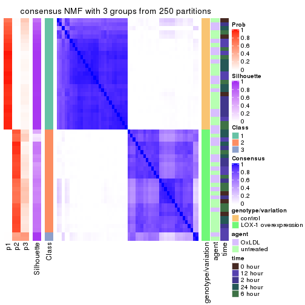</p>

</div>
<div id='tab-MAD-NMF-consensus-heatmap-3'>
<pre><code class="r">consensus_heatmap(res, k = 4)
</code></pre>

<p>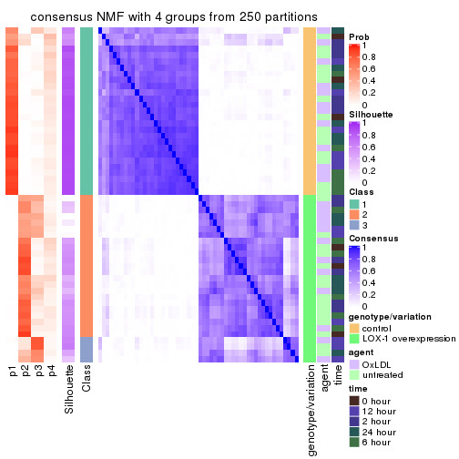</p>

</div>
<div id='tab-MAD-NMF-consensus-heatmap-4'>
<pre><code class="r">consensus_heatmap(res, k = 5)
</code></pre>

<p>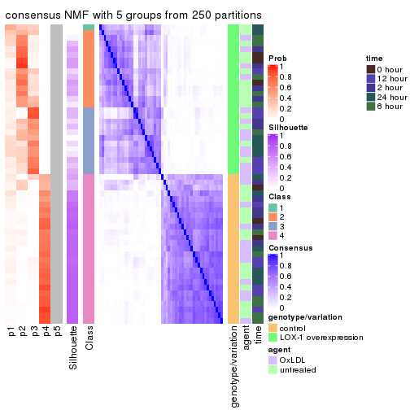</p>

</div>
<div id='tab-MAD-NMF-consensus-heatmap-5'>
<pre><code class="r">consensus_heatmap(res, k = 6)
</code></pre>

<p>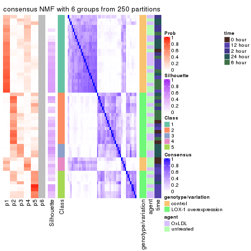</p>

</div>
</div>

Heatmaps for the membership of samples in all partitions to see how consistent they are:


<script>
$( function() {
	$( '#tabs-MAD-NMF-membership-heatmap' ).tabs();
} );
</script>
<div id='tabs-MAD-NMF-membership-heatmap'>
<ul>
<li><a href='#tab-MAD-NMF-membership-heatmap-1'>k = 2</a></li>
<li><a href='#tab-MAD-NMF-membership-heatmap-2'>k = 3</a></li>
<li><a href='#tab-MAD-NMF-membership-heatmap-3'>k = 4</a></li>
<li><a href='#tab-MAD-NMF-membership-heatmap-4'>k = 5</a></li>
<li><a href='#tab-MAD-NMF-membership-heatmap-5'>k = 6</a></li>
</ul>
<div id='tab-MAD-NMF-membership-heatmap-1'>
<pre><code class="r">membership_heatmap(res, k = 2)
</code></pre>

<p></p>

</div>
<div id='tab-MAD-NMF-membership-heatmap-2'>
<pre><code class="r">membership_heatmap(res, k = 3)
</code></pre>

<p>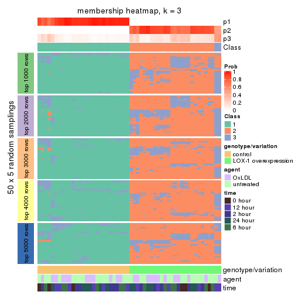</p>

</div>
<div id='tab-MAD-NMF-membership-heatmap-3'>
<pre><code class="r">membership_heatmap(res, k = 4)
</code></pre>

<p>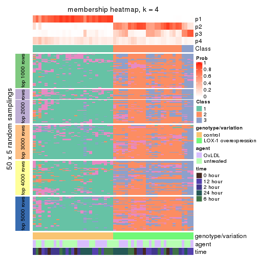</p>

</div>
<div id='tab-MAD-NMF-membership-heatmap-4'>
<pre><code class="r">membership_heatmap(res, k = 5)
</code></pre>

<p>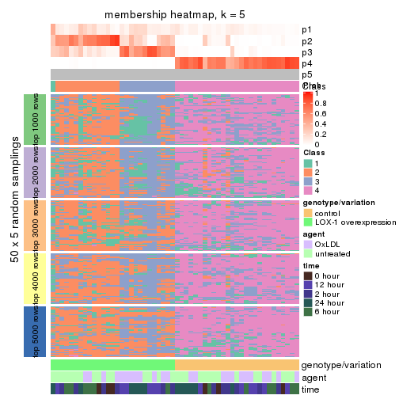</p>

</div>
<div id='tab-MAD-NMF-membership-heatmap-5'>
<pre><code class="r">membership_heatmap(res, k = 6)
</code></pre>

<p>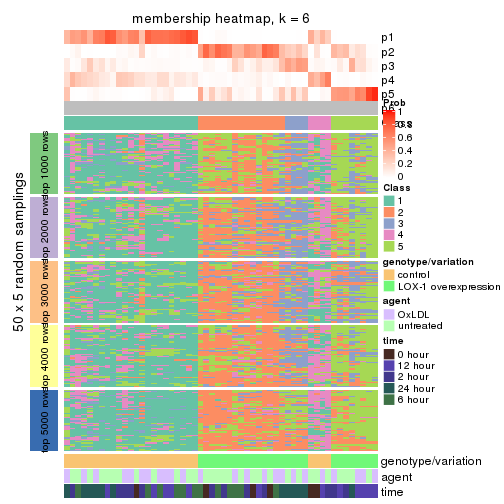</p>

</div>
</div>

As soon as we have had the classes for columns, we can look for signatures
which are significantly different between classes which can be candidate marks
for certain classes. Following are the heatmaps for signatures.


Signature heatmaps where rows are scaled:


<script>
$( function() {
	$( '#tabs-MAD-NMF-get-signatures' ).tabs();
} );
</script>
<div id='tabs-MAD-NMF-get-signatures'>
<ul>
<li><a href='#tab-MAD-NMF-get-signatures-1'>k = 2</a></li>
<li><a href='#tab-MAD-NMF-get-signatures-2'>k = 3</a></li>
<li><a href='#tab-MAD-NMF-get-signatures-3'>k = 4</a></li>
<li><a href='#tab-MAD-NMF-get-signatures-4'>k = 5</a></li>
<li><a href='#tab-MAD-NMF-get-signatures-5'>k = 6</a></li>
</ul>
<div id='tab-MAD-NMF-get-signatures-1'>
<pre><code class="r">get_signatures(res, k = 2)
</code></pre>

<p></p>

</div>
<div id='tab-MAD-NMF-get-signatures-2'>
<pre><code class="r">get_signatures(res, k = 3)
</code></pre>

<p>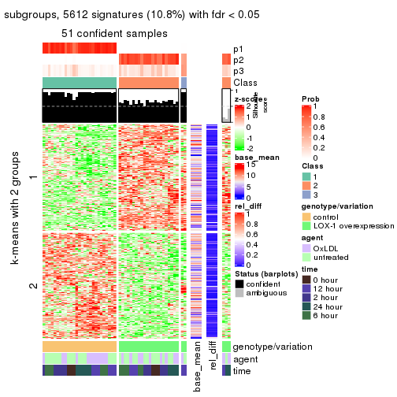</p>

</div>
<div id='tab-MAD-NMF-get-signatures-3'>
<pre><code class="r">get_signatures(res, k = 4)
</code></pre>

<p>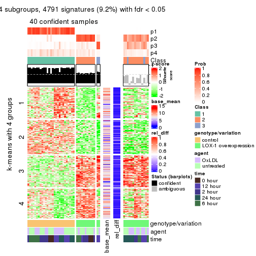</p>

</div>
<div id='tab-MAD-NMF-get-signatures-4'>
<pre><code class="r">get_signatures(res, k = 5)
</code></pre>

<p></p>

</div>
<div id='tab-MAD-NMF-get-signatures-5'>
<pre><code class="r">get_signatures(res, k = 6)
</code></pre>

<p></p>

</div>
</div>


Signature heatmaps where rows are not scaled:


<script>
$( function() {
	$( '#tabs-MAD-NMF-get-signatures-no-scale' ).tabs();
} );
</script>
<div id='tabs-MAD-NMF-get-signatures-no-scale'>
<ul>
<li><a href='#tab-MAD-NMF-get-signatures-no-scale-1'>k = 2</a></li>
<li><a href='#tab-MAD-NMF-get-signatures-no-scale-2'>k = 3</a></li>
<li><a href='#tab-MAD-NMF-get-signatures-no-scale-3'>k = 4</a></li>
<li><a href='#tab-MAD-NMF-get-signatures-no-scale-4'>k = 5</a></li>
<li><a href='#tab-MAD-NMF-get-signatures-no-scale-5'>k = 6</a></li>
</ul>
<div id='tab-MAD-NMF-get-signatures-no-scale-1'>
<pre><code class="r">get_signatures(res, k = 2, scale_rows = FALSE)
</code></pre>

<p>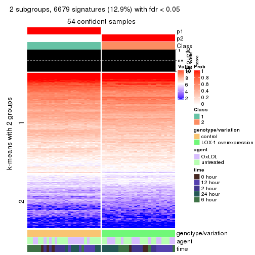</p>

</div>
<div id='tab-MAD-NMF-get-signatures-no-scale-2'>
<pre><code class="r">get_signatures(res, k = 3, scale_rows = FALSE)
</code></pre>

<p>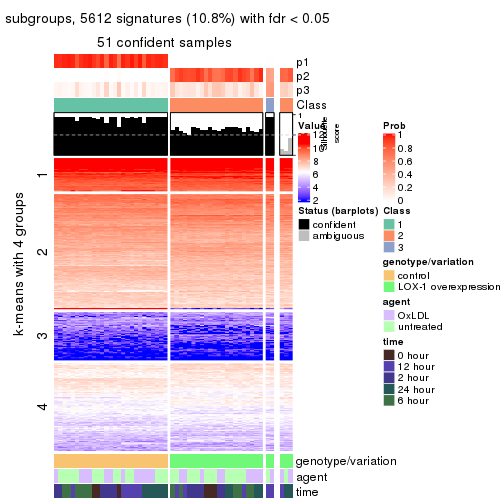</p>

</div>
<div id='tab-MAD-NMF-get-signatures-no-scale-3'>
<pre><code class="r">get_signatures(res, k = 4, scale_rows = FALSE)
</code></pre>

<p>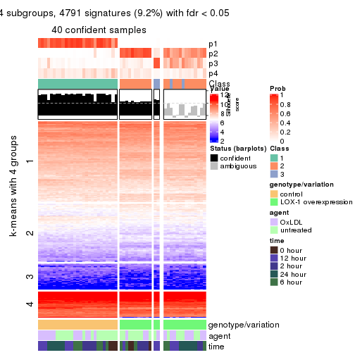</p>

</div>
<div id='tab-MAD-NMF-get-signatures-no-scale-4'>
<pre><code class="r">get_signatures(res, k = 5, scale_rows = FALSE)
</code></pre>

<p></p>

</div>
<div id='tab-MAD-NMF-get-signatures-no-scale-5'>
<pre><code class="r">get_signatures(res, k = 6, scale_rows = FALSE)
</code></pre>

<p></p>

</div>
</div>


Compare the overlap of signatures from different k:

```r
compare_signatures(res)
```

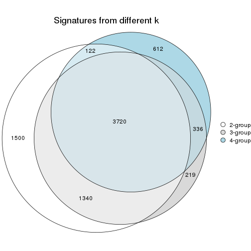

`get_signature()` returns a data frame invisibly. TO get the list of signatures, the function
call should be assigned to a variable explicitly. In following code, if `plot` argument is set
to `FALSE`, no heatmap is plotted while only the differential analysis is performed.

```r
# code only for demonstration
tb = get_signature(res, k = ..., plot = FALSE)
```

An example of the output of `tb` is:

```
#>   which_row         fdr    mean_1    mean_2 scaled_mean_1 scaled_mean_2 km
#> 1        38 0.042760348  8.373488  9.131774    -0.5533452     0.5164555  1
#> 2        40 0.018707592  7.106213  8.469186    -0.6173731     0.5762149  1
#> 3        55 0.019134737 10.221463 11.207825    -0.6159697     0.5749050  1
#> 4        59 0.006059896  5.921854  7.869574    -0.6899429     0.6439467  1
#> 5        60 0.018055526  8.928898 10.211722    -0.6204761     0.5791110  1
#> 6        98 0.009384629 15.714769 14.887706     0.6635654    -0.6193277  2
...
```

The columns in `tb` are:

1. `which_row`: row indices corresponding to the input matrix.
2. `fdr`: FDR for the differential test. 
3. `mean_x`: The mean value in group x.
4. `scaled_mean_x`: The mean value in group x after rows are scaled.
5. `km`: Row groups if k-means clustering is applied to rows.


UMAP plot which shows how samples are separated.


<script>
$( function() {
	$( '#tabs-MAD-NMF-dimension-reduction' ).tabs();
} );
</script>
<div id='tabs-MAD-NMF-dimension-reduction'>
<ul>
<li><a href='#tab-MAD-NMF-dimension-reduction-1'>k = 2</a></li>
<li><a href='#tab-MAD-NMF-dimension-reduction-2'>k = 3</a></li>
<li><a href='#tab-MAD-NMF-dimension-reduction-3'>k = 4</a></li>
<li><a href='#tab-MAD-NMF-dimension-reduction-4'>k = 5</a></li>
<li><a href='#tab-MAD-NMF-dimension-reduction-5'>k = 6</a></li>
</ul>
<div id='tab-MAD-NMF-dimension-reduction-1'>
<pre><code class="r">dimension_reduction(res, k = 2, method = &quot;UMAP&quot;)
</code></pre>

<p>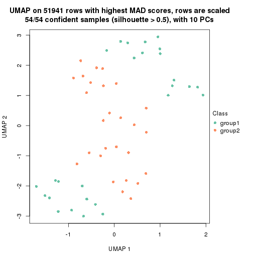</p>

</div>
<div id='tab-MAD-NMF-dimension-reduction-2'>
<pre><code class="r">dimension_reduction(res, k = 3, method = &quot;UMAP&quot;)
</code></pre>

<p>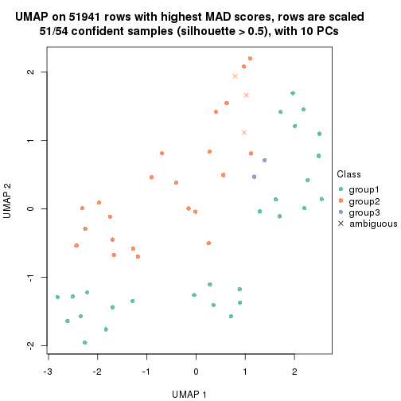</p>

</div>
<div id='tab-MAD-NMF-dimension-reduction-3'>
<pre><code class="r">dimension_reduction(res, k = 4, method = &quot;UMAP&quot;)
</code></pre>

<p>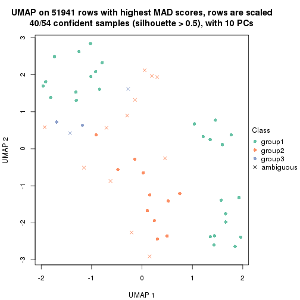</p>

</div>
<div id='tab-MAD-NMF-dimension-reduction-4'>
<pre><code class="r">dimension_reduction(res, k = 5, method = &quot;UMAP&quot;)
</code></pre>

<p>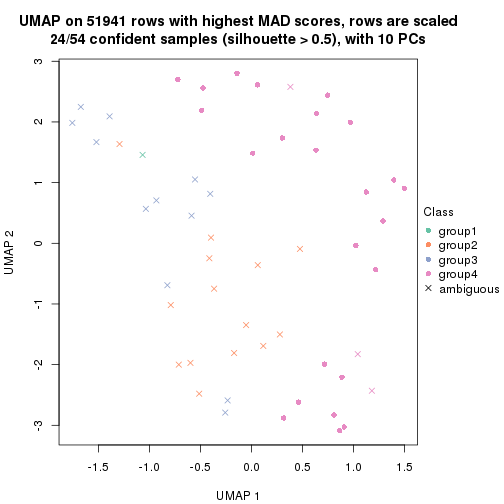</p>

</div>
<div id='tab-MAD-NMF-dimension-reduction-5'>
<pre><code class="r">dimension_reduction(res, k = 6, method = &quot;UMAP&quot;)
</code></pre>

<p>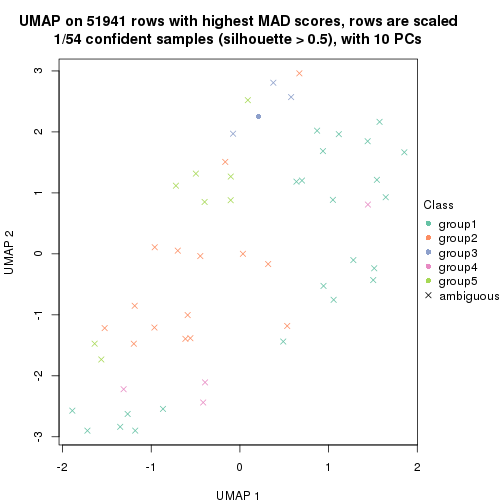</p>

</div>
</div>


Following heatmap shows how subgroups are split when increasing `k`:

```r
collect_classes(res)
```

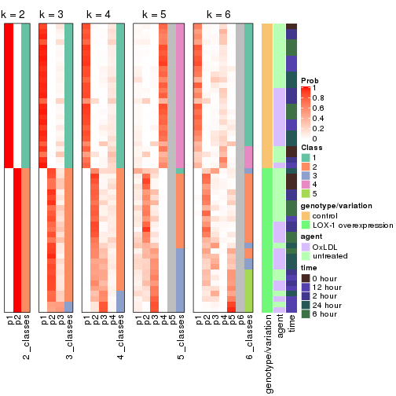


Test correlation between subgroups and known annotations. If the known
annotation is numeric, one-way ANOVA test is applied, and if the known
annotation is discrete, chi-squared contingency table test is applied.

```r
test_to_known_factors(res)
```

```
#>          n genotype/variation(p) agent(p) time(p) k
#> MAD:NMF 54              1.48e-12    1.000   1.000 2
#> MAD:NMF 51              8.42e-12    0.950   0.394 3
#> MAD:NMF 40              2.06e-09    0.592   0.130 4
#> MAD:NMF 24                    NA       NA      NA 5
#> MAD:NMF  1                    NA       NA      NA 6
```


If matrix rows can be associated to genes, consider to use `functional_enrichment(res,
...)` to perform function enrichment for the signature genes. See [this vignette](http://bioconductor.org/packages/devel/bioc/vignettes/cola/inst/doc/functional_enrichment.html) for more detailed explanations.


 

---------------------------------------------------


### ATC:hclust**


The object with results only for a single top-value method and a single partition method 
can be extracted as:

```r
res = res_list["ATC", "hclust"]
# you can also extract it by
# res = res_list["ATC:hclust"]
```

A summary of `res` and all the functions that can be applied to it:

```r
res
```

```
#> A 'ConsensusPartition' object with k = 2, 3, 4, 5, 6.
#>   On a matrix with 51941 rows and 54 columns.
#>   Top rows (1000, 2000, 3000, 4000, 5000) are extracted by 'ATC' method.
#>   Subgroups are detected by 'hclust' method.
#>   Performed in total 1250 partitions by row resampling.
#>   Best k for subgroups seems to be 3.
#> 
#> Following methods can be applied to this 'ConsensusPartition' object:
#>  [1] "cola_report"             "collect_classes"         "collect_plots"          
#>  [4] "collect_stats"           "colnames"                "compare_signatures"     
#>  [7] "consensus_heatmap"       "dimension_reduction"     "functional_enrichment"  
#> [10] "get_anno_col"            "get_anno"                "get_classes"            
#> [13] "get_consensus"           "get_matrix"              "get_membership"         
#> [16] "get_param"               "get_signatures"          "get_stats"              
#> [19] "is_best_k"               "is_stable_k"             "membership_heatmap"     
#> [22] "ncol"                    "nrow"                    "plot_ecdf"              
#> [25] "rownames"                "select_partition_number" "show"                   
#> [28] "suggest_best_k"          "test_to_known_factors"
```

`collect_plots()` function collects all the plots made from `res` for all `k` (number of partitions)
into one single page to provide an easy and fast comparison between different `k`.

```r
collect_plots(res)
```

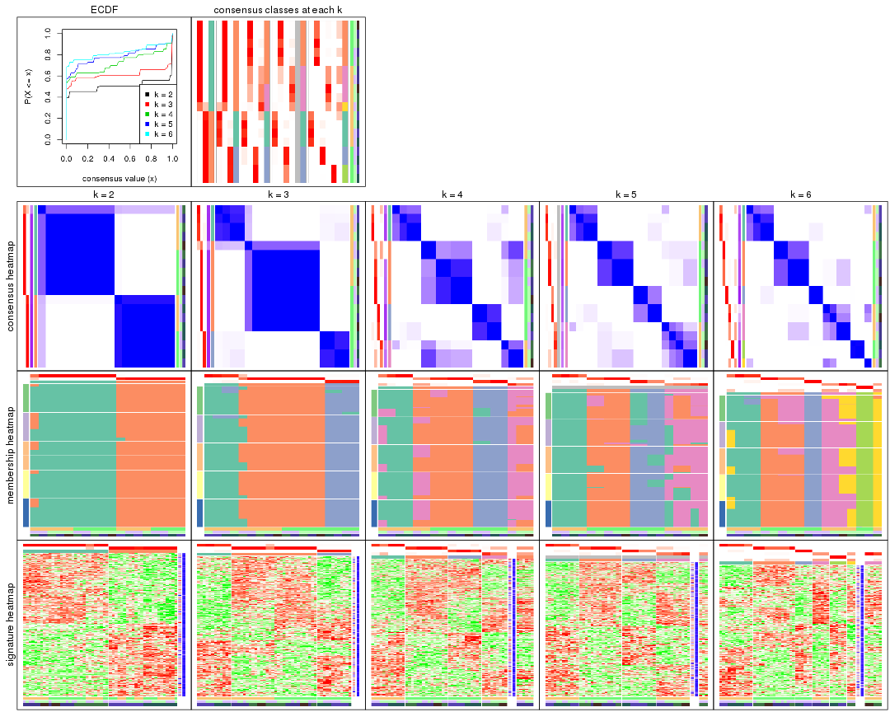

The plots are:

- The first row: a plot of the ECDF (empirical cumulative distribution
  function) curves of the consensus matrix for each `k` and the heatmap of
  predicted classes for each `k`.
- The second row: heatmaps of the consensus matrix for each `k`.
- The third row: heatmaps of the membership matrix for each `k`.
- The fouth row: heatmaps of the signatures for each `k`.

All the plots in panels can be made by individual functions and they are
plotted later in this section.

`select_partition_number()` produces several plots showing different
statistics for choosing "optimized" `k`. There are following statistics:

- ECDF curves of the consensus matrix for each `k`;
- 1-PAC. [The PAC
  score](https://en.wikipedia.org/wiki/Consensus_clustering#Over-interpretation_potential_of_consensus_clustering)
  measures the proportion of the ambiguous subgrouping.
- Mean silhouette score.
- Concordance. The mean probability of fiting the consensus class ids in all
  partitions.
- Area increased. Denote $A_k$ as the area under the ECDF curve for current
  `k`, the area increased is defined as $A_k - A_{k-1}$.
- Rand index. The percent of pairs of samples that are both in a same cluster
  or both are not in a same cluster in the partition of k and k-1.
- Jaccard index. The ratio of pairs of samples are both in a same cluster in
  the partition of k and k-1 and the pairs of samples are both in a same
  cluster in the partition k or k-1.

The detailed explanations of these statistics can be found in [the _cola_
vignette](http://bioconductor.org/packages/devel/bioc/vignettes/cola/inst/doc/cola.html#toc_13).

Generally speaking, lower PAC score, higher mean silhouette score or higher
concordance corresponds to better partition. Rand index and Jaccard index
measure how similar the current partition is compared to partition with `k-1`.
If they are too similar, we won't accept `k` is better than `k-1`.

```r
select_partition_number(res)
```

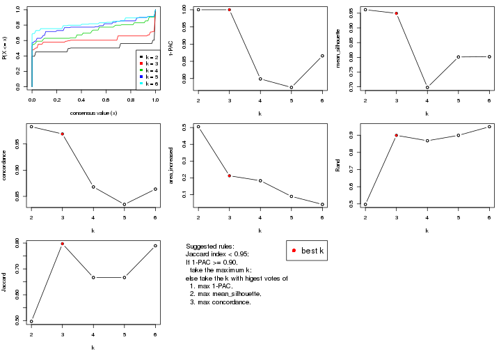

The numeric values for all these statistics can be obtained by `get_stats()`.

```r
get_stats(res)
```

```
#>   k 1-PAC mean_silhouette concordance area_increased  Rand Jaccard
#> 2 2 1.000           0.962       0.983         0.5050 0.497   0.497
#> 3 3 1.000           0.949       0.969         0.2123 0.899   0.797
#> 4 4 0.799           0.698       0.868         0.1830 0.868   0.667
#> 5 5 0.774           0.801       0.835         0.0894 0.899   0.667
#> 6 6 0.866           0.802       0.864         0.0416 0.950   0.789
```

`suggest_best_k()` suggests the best $k$ based on these statistics. The rules are as follows:

- All $k$ with Jaccard index larger than 0.95 are removed because increasing
  $k$ does not provide enough extra information. If all $k$ are removed, it is
  marked as no subgroup is detected.
- For all $k$ with 1-PAC score larger than 0.9, the maximal $k$ is taken as
  the best $k$, and other $k$ are marked as optional $k$.
- If it does not fit the second rule. The $k$ with the maximal vote of the
  highest 1-PAC score, highest mean silhouette, and highest concordance is
  taken as the best $k$.

```r
suggest_best_k(res)
```

```
#> [1] 3
#> attr(,"optional")
#> [1] 2
```

There is also optional best $k$ = 2 that is worth to check.

Following shows the table of the partitions (You need to click the **show/hide
code output** link to see it). The membership matrix (columns with name `p*`)
is inferred by
[`clue::cl_consensus()`](https://www.rdocumentation.org/link/cl_consensus?package=clue)
function with the `SE` method. Basically the value in the membership matrix
represents the probability to belong to a certain group. The finall class
label for an item is determined with the group with highest probability it
belongs to.

In `get_classes()` function, the entropy is calculated from the membership
matrix and the silhouette score is calculated from the consensus matrix.


<script>
$( function() {
	$( '#tabs-ATC-hclust-get-classes' ).tabs();
} );
</script>
<div id='tabs-ATC-hclust-get-classes'>
<ul>
<li><a href='#tab-ATC-hclust-get-classes-1'>k = 2</a></li>
<li><a href='#tab-ATC-hclust-get-classes-2'>k = 3</a></li>
<li><a href='#tab-ATC-hclust-get-classes-3'>k = 4</a></li>
<li><a href='#tab-ATC-hclust-get-classes-4'>k = 5</a></li>
<li><a href='#tab-ATC-hclust-get-classes-5'>k = 6</a></li>
</ul>

<div id='tab-ATC-hclust-get-classes-1'>
<p><a id='tab-ATC-hclust-get-classes-1-a' style='color:#0366d6' href='#'>show/hide code output</a></p>
<pre><code class="r">cbind(get_classes(res, k = 2), get_membership(res, k = 2))
</code></pre>

<pre><code>#&gt;           class entropy silhouette    p1    p2
#&gt; GSM329068     1   0.000      0.970 1.000 0.000
#&gt; GSM329074     1   0.000      0.970 1.000 0.000
#&gt; GSM329100     1   0.000      0.970 1.000 0.000
#&gt; GSM329062     1   0.000      0.970 1.000 0.000
#&gt; GSM329079     1   0.000      0.970 1.000 0.000
#&gt; GSM329090     1   0.000      0.970 1.000 0.000
#&gt; GSM329066     1   0.000      0.970 1.000 0.000
#&gt; GSM329086     1   0.000      0.970 1.000 0.000
#&gt; GSM329099     1   0.000      0.970 1.000 0.000
#&gt; GSM329071     2   0.000      0.997 0.000 1.000
#&gt; GSM329078     2   0.000      0.997 0.000 1.000
#&gt; GSM329081     2   0.000      0.997 0.000 1.000
#&gt; GSM329096     2   0.000      0.997 0.000 1.000
#&gt; GSM329102     2   0.000      0.997 0.000 1.000
#&gt; GSM329104     2   0.000      0.997 0.000 1.000
#&gt; GSM329067     1   0.000      0.970 1.000 0.000
#&gt; GSM329072     1   0.000      0.970 1.000 0.000
#&gt; GSM329075     1   0.000      0.970 1.000 0.000
#&gt; GSM329058     1   0.000      0.970 1.000 0.000
#&gt; GSM329073     1   0.000      0.970 1.000 0.000
#&gt; GSM329107     1   0.000      0.970 1.000 0.000
#&gt; GSM329057     2   0.000      0.997 0.000 1.000
#&gt; GSM329085     2   0.000      0.997 0.000 1.000
#&gt; GSM329089     2   0.000      0.997 0.000 1.000
#&gt; GSM329076     2   0.000      0.997 0.000 1.000
#&gt; GSM329094     2   0.000      0.997 0.000 1.000
#&gt; GSM329105     2   0.000      0.997 0.000 1.000
#&gt; GSM329056     1   0.000      0.970 1.000 0.000
#&gt; GSM329069     1   0.000      0.970 1.000 0.000
#&gt; GSM329077     1   0.000      0.970 1.000 0.000
#&gt; GSM329070     1   0.000      0.970 1.000 0.000
#&gt; GSM329082     1   0.000      0.970 1.000 0.000
#&gt; GSM329092     1   0.000      0.970 1.000 0.000
#&gt; GSM329083     1   0.000      0.970 1.000 0.000
#&gt; GSM329101     1   0.000      0.970 1.000 0.000
#&gt; GSM329106     1   0.000      0.970 1.000 0.000
#&gt; GSM329087     2   0.163      0.976 0.024 0.976
#&gt; GSM329091     2   0.163      0.976 0.024 0.976
#&gt; GSM329093     2   0.163      0.976 0.024 0.976
#&gt; GSM329080     2   0.000      0.997 0.000 1.000
#&gt; GSM329084     2   0.000      0.997 0.000 1.000
#&gt; GSM329088     2   0.000      0.997 0.000 1.000
#&gt; GSM329059     1   0.000      0.970 1.000 0.000
#&gt; GSM329097     1   0.000      0.970 1.000 0.000
#&gt; GSM329098     1   0.000      0.970 1.000 0.000
#&gt; GSM329055     1   0.861      0.628 0.716 0.284
#&gt; GSM329103     1   0.861      0.628 0.716 0.284
#&gt; GSM329108     1   0.861      0.628 0.716 0.284
#&gt; GSM329061     2   0.000      0.997 0.000 1.000
#&gt; GSM329064     2   0.000      0.997 0.000 1.000
#&gt; GSM329065     2   0.000      0.997 0.000 1.000
#&gt; GSM329060     2   0.000      0.997 0.000 1.000
#&gt; GSM329063     2   0.000      0.997 0.000 1.000
#&gt; GSM329095     2   0.000      0.997 0.000 1.000
</code></pre>

<script>
$('#tab-ATC-hclust-get-classes-1-a').parent().next().next().hide();
$('#tab-ATC-hclust-get-classes-1-a').click(function(){
  $('#tab-ATC-hclust-get-classes-1-a').parent().next().next().toggle();
  return(false);
});
</script>
</div>

<div id='tab-ATC-hclust-get-classes-2'>
<p><a id='tab-ATC-hclust-get-classes-2-a' style='color:#0366d6' href='#'>show/hide code output</a></p>
<pre><code class="r">cbind(get_classes(res, k = 3), get_membership(res, k = 3))
</code></pre>

<pre><code>#&gt;           class entropy silhouette    p1    p2    p3
#&gt; GSM329068     2  0.0000      0.968 0.000 1.000 0.000
#&gt; GSM329074     2  0.0000      0.968 0.000 1.000 0.000
#&gt; GSM329100     2  0.0000      0.968 0.000 1.000 0.000
#&gt; GSM329062     2  0.0000      0.968 0.000 1.000 0.000
#&gt; GSM329079     2  0.0000      0.968 0.000 1.000 0.000
#&gt; GSM329090     2  0.0000      0.968 0.000 1.000 0.000
#&gt; GSM329066     2  0.0000      0.968 0.000 1.000 0.000
#&gt; GSM329086     2  0.0000      0.968 0.000 1.000 0.000
#&gt; GSM329099     2  0.0000      0.968 0.000 1.000 0.000
#&gt; GSM329071     3  0.1031      0.978 0.024 0.000 0.976
#&gt; GSM329078     3  0.1031      0.978 0.024 0.000 0.976
#&gt; GSM329081     3  0.1031      0.978 0.024 0.000 0.976
#&gt; GSM329096     3  0.1031      0.978 0.024 0.000 0.976
#&gt; GSM329102     3  0.1031      0.978 0.024 0.000 0.976
#&gt; GSM329104     3  0.1031      0.978 0.024 0.000 0.976
#&gt; GSM329067     2  0.0000      0.968 0.000 1.000 0.000
#&gt; GSM329072     2  0.0000      0.968 0.000 1.000 0.000
#&gt; GSM329075     2  0.0000      0.968 0.000 1.000 0.000
#&gt; GSM329058     2  0.0000      0.968 0.000 1.000 0.000
#&gt; GSM329073     2  0.0000      0.968 0.000 1.000 0.000
#&gt; GSM329107     2  0.0000      0.968 0.000 1.000 0.000
#&gt; GSM329057     3  0.0892      0.977 0.020 0.000 0.980
#&gt; GSM329085     3  0.0892      0.977 0.020 0.000 0.980
#&gt; GSM329089     3  0.0892      0.977 0.020 0.000 0.980
#&gt; GSM329076     3  0.0892      0.977 0.020 0.000 0.980
#&gt; GSM329094     3  0.0892      0.977 0.020 0.000 0.980
#&gt; GSM329105     3  0.0892      0.977 0.020 0.000 0.980
#&gt; GSM329056     2  0.0000      0.968 0.000 1.000 0.000
#&gt; GSM329069     2  0.0000      0.968 0.000 1.000 0.000
#&gt; GSM329077     2  0.0000      0.968 0.000 1.000 0.000
#&gt; GSM329070     2  0.0000      0.968 0.000 1.000 0.000
#&gt; GSM329082     2  0.0000      0.968 0.000 1.000 0.000
#&gt; GSM329092     2  0.0000      0.968 0.000 1.000 0.000
#&gt; GSM329083     2  0.0000      0.968 0.000 1.000 0.000
#&gt; GSM329101     2  0.0000      0.968 0.000 1.000 0.000
#&gt; GSM329106     2  0.0000      0.968 0.000 1.000 0.000
#&gt; GSM329087     1  0.0000      0.959 1.000 0.000 0.000
#&gt; GSM329091     1  0.0000      0.959 1.000 0.000 0.000
#&gt; GSM329093     1  0.0000      0.959 1.000 0.000 0.000
#&gt; GSM329080     1  0.2261      0.972 0.932 0.000 0.068
#&gt; GSM329084     1  0.2261      0.972 0.932 0.000 0.068
#&gt; GSM329088     1  0.2261      0.972 0.932 0.000 0.068
#&gt; GSM329059     2  0.0000      0.968 0.000 1.000 0.000
#&gt; GSM329097     2  0.0000      0.968 0.000 1.000 0.000
#&gt; GSM329098     2  0.0000      0.968 0.000 1.000 0.000
#&gt; GSM329055     2  0.5621      0.597 0.308 0.692 0.000
#&gt; GSM329103     2  0.5621      0.597 0.308 0.692 0.000
#&gt; GSM329108     2  0.5621      0.597 0.308 0.692 0.000
#&gt; GSM329061     1  0.1031      0.970 0.976 0.000 0.024
#&gt; GSM329064     1  0.1031      0.970 0.976 0.000 0.024
#&gt; GSM329065     1  0.1031      0.970 0.976 0.000 0.024
#&gt; GSM329060     1  0.2261      0.972 0.932 0.000 0.068
#&gt; GSM329063     1  0.2261      0.972 0.932 0.000 0.068
#&gt; GSM329095     1  0.2261      0.972 0.932 0.000 0.068
</code></pre>

<script>
$('#tab-ATC-hclust-get-classes-2-a').parent().next().next().hide();
$('#tab-ATC-hclust-get-classes-2-a').click(function(){
  $('#tab-ATC-hclust-get-classes-2-a').parent().next().next().toggle();
  return(false);
});
</script>
</div>

<div id='tab-ATC-hclust-get-classes-3'>
<p><a id='tab-ATC-hclust-get-classes-3-a' style='color:#0366d6' href='#'>show/hide code output</a></p>
<pre><code class="r">cbind(get_classes(res, k = 4), get_membership(res, k = 4))
</code></pre>

<pre><code>#&gt;           class entropy silhouette    p1    p2    p3    p4
#&gt; GSM329068     2   0.000      0.752 0.000 1.000 0.000 0.000
#&gt; GSM329074     2   0.000      0.752 0.000 1.000 0.000 0.000
#&gt; GSM329100     2   0.000      0.752 0.000 1.000 0.000 0.000
#&gt; GSM329062     2   0.000      0.752 0.000 1.000 0.000 0.000
#&gt; GSM329079     2   0.000      0.752 0.000 1.000 0.000 0.000
#&gt; GSM329090     2   0.000      0.752 0.000 1.000 0.000 0.000
#&gt; GSM329066     2   0.156      0.734 0.000 0.944 0.000 0.056
#&gt; GSM329086     2   0.156      0.734 0.000 0.944 0.000 0.056
#&gt; GSM329099     2   0.156      0.734 0.000 0.944 0.000 0.056
#&gt; GSM329071     3   0.000      0.954 0.000 0.000 1.000 0.000
#&gt; GSM329078     3   0.000      0.954 0.000 0.000 1.000 0.000
#&gt; GSM329081     3   0.000      0.954 0.000 0.000 1.000 0.000
#&gt; GSM329096     3   0.000      0.954 0.000 0.000 1.000 0.000
#&gt; GSM329102     3   0.000      0.954 0.000 0.000 1.000 0.000
#&gt; GSM329104     3   0.000      0.954 0.000 0.000 1.000 0.000
#&gt; GSM329067     2   0.000      0.752 0.000 1.000 0.000 0.000
#&gt; GSM329072     2   0.000      0.752 0.000 1.000 0.000 0.000
#&gt; GSM329075     2   0.000      0.752 0.000 1.000 0.000 0.000
#&gt; GSM329058     2   0.156      0.734 0.000 0.944 0.000 0.056
#&gt; GSM329073     2   0.156      0.734 0.000 0.944 0.000 0.056
#&gt; GSM329107     2   0.156      0.734 0.000 0.944 0.000 0.056
#&gt; GSM329057     3   0.215      0.952 0.088 0.000 0.912 0.000
#&gt; GSM329085     3   0.215      0.952 0.088 0.000 0.912 0.000
#&gt; GSM329089     3   0.215      0.952 0.088 0.000 0.912 0.000
#&gt; GSM329076     3   0.215      0.952 0.088 0.000 0.912 0.000
#&gt; GSM329094     3   0.215      0.952 0.088 0.000 0.912 0.000
#&gt; GSM329105     3   0.215      0.952 0.088 0.000 0.912 0.000
#&gt; GSM329056     4   0.471      0.716 0.000 0.360 0.000 0.640
#&gt; GSM329069     4   0.471      0.716 0.000 0.360 0.000 0.640
#&gt; GSM329077     4   0.471      0.716 0.000 0.360 0.000 0.640
#&gt; GSM329070     2   0.498     -0.248 0.000 0.540 0.000 0.460
#&gt; GSM329082     2   0.498     -0.248 0.000 0.540 0.000 0.460
#&gt; GSM329092     2   0.498     -0.248 0.000 0.540 0.000 0.460
#&gt; GSM329083     4   0.471      0.716 0.000 0.360 0.000 0.640
#&gt; GSM329101     4   0.471      0.716 0.000 0.360 0.000 0.640
#&gt; GSM329106     4   0.471      0.716 0.000 0.360 0.000 0.640
#&gt; GSM329087     1   0.462      0.763 0.660 0.000 0.000 0.340
#&gt; GSM329091     1   0.462      0.763 0.660 0.000 0.000 0.340
#&gt; GSM329093     1   0.462      0.763 0.660 0.000 0.000 0.340
#&gt; GSM329080     1   0.000      0.908 1.000 0.000 0.000 0.000
#&gt; GSM329084     1   0.000      0.908 1.000 0.000 0.000 0.000
#&gt; GSM329088     1   0.000      0.908 1.000 0.000 0.000 0.000
#&gt; GSM329059     2   0.498     -0.248 0.000 0.540 0.000 0.460
#&gt; GSM329097     2   0.498     -0.248 0.000 0.540 0.000 0.460
#&gt; GSM329098     2   0.498     -0.248 0.000 0.540 0.000 0.460
#&gt; GSM329055     4   0.155      0.609 0.008 0.040 0.000 0.952
#&gt; GSM329103     4   0.155      0.609 0.008 0.040 0.000 0.952
#&gt; GSM329108     4   0.155      0.609 0.008 0.040 0.000 0.952
#&gt; GSM329061     1   0.164      0.902 0.940 0.000 0.000 0.060
#&gt; GSM329064     1   0.164      0.902 0.940 0.000 0.000 0.060
#&gt; GSM329065     1   0.164      0.902 0.940 0.000 0.000 0.060
#&gt; GSM329060     1   0.000      0.908 1.000 0.000 0.000 0.000
#&gt; GSM329063     1   0.000      0.908 1.000 0.000 0.000 0.000
#&gt; GSM329095     1   0.000      0.908 1.000 0.000 0.000 0.000
</code></pre>

<script>
$('#tab-ATC-hclust-get-classes-3-a').parent().next().next().hide();
$('#tab-ATC-hclust-get-classes-3-a').click(function(){
  $('#tab-ATC-hclust-get-classes-3-a').parent().next().next().toggle();
  return(false);
});
</script>
</div>

<div id='tab-ATC-hclust-get-classes-4'>
<p><a id='tab-ATC-hclust-get-classes-4-a' style='color:#0366d6' href='#'>show/hide code output</a></p>
<pre><code class="r">cbind(get_classes(res, k = 5), get_membership(res, k = 5))
</code></pre>

<pre><code>#&gt;           class entropy silhouette    p1    p2    p3    p4 p5
#&gt; GSM329068     2  0.0290      0.923 0.000 0.992 0.000 0.008 NA
#&gt; GSM329074     2  0.0290      0.923 0.000 0.992 0.000 0.008 NA
#&gt; GSM329100     2  0.0290      0.923 0.000 0.992 0.000 0.008 NA
#&gt; GSM329062     2  0.0290      0.923 0.000 0.992 0.000 0.008 NA
#&gt; GSM329079     2  0.0290      0.923 0.000 0.992 0.000 0.008 NA
#&gt; GSM329090     2  0.0290      0.923 0.000 0.992 0.000 0.008 NA
#&gt; GSM329066     2  0.3180      0.882 0.000 0.856 0.000 0.076 NA
#&gt; GSM329086     2  0.3180      0.882 0.000 0.856 0.000 0.076 NA
#&gt; GSM329099     2  0.3180      0.882 0.000 0.856 0.000 0.076 NA
#&gt; GSM329071     3  0.4171      0.803 0.000 0.000 0.604 0.000 NA
#&gt; GSM329078     3  0.4171      0.803 0.000 0.000 0.604 0.000 NA
#&gt; GSM329081     3  0.4171      0.803 0.000 0.000 0.604 0.000 NA
#&gt; GSM329096     3  0.4171      0.803 0.000 0.000 0.604 0.000 NA
#&gt; GSM329102     3  0.4171      0.803 0.000 0.000 0.604 0.000 NA
#&gt; GSM329104     3  0.4171      0.803 0.000 0.000 0.604 0.000 NA
#&gt; GSM329067     2  0.0290      0.923 0.000 0.992 0.000 0.008 NA
#&gt; GSM329072     2  0.0290      0.923 0.000 0.992 0.000 0.008 NA
#&gt; GSM329075     2  0.0290      0.923 0.000 0.992 0.000 0.008 NA
#&gt; GSM329058     2  0.3180      0.882 0.000 0.856 0.000 0.076 NA
#&gt; GSM329073     2  0.3180      0.882 0.000 0.856 0.000 0.076 NA
#&gt; GSM329107     2  0.3180      0.882 0.000 0.856 0.000 0.076 NA
#&gt; GSM329057     3  0.0609      0.800 0.020 0.000 0.980 0.000 NA
#&gt; GSM329085     3  0.0609      0.800 0.020 0.000 0.980 0.000 NA
#&gt; GSM329089     3  0.0609      0.800 0.020 0.000 0.980 0.000 NA
#&gt; GSM329076     3  0.0609      0.800 0.020 0.000 0.980 0.000 NA
#&gt; GSM329094     3  0.0609      0.800 0.020 0.000 0.980 0.000 NA
#&gt; GSM329105     3  0.0609      0.800 0.020 0.000 0.980 0.000 NA
#&gt; GSM329056     4  0.0794      0.731 0.000 0.028 0.000 0.972 NA
#&gt; GSM329069     4  0.0794      0.731 0.000 0.028 0.000 0.972 NA
#&gt; GSM329077     4  0.0794      0.731 0.000 0.028 0.000 0.972 NA
#&gt; GSM329070     4  0.5312      0.669 0.000 0.248 0.000 0.652 NA
#&gt; GSM329082     4  0.5312      0.669 0.000 0.248 0.000 0.652 NA
#&gt; GSM329092     4  0.5312      0.669 0.000 0.248 0.000 0.652 NA
#&gt; GSM329083     4  0.3283      0.709 0.000 0.028 0.000 0.832 NA
#&gt; GSM329101     4  0.3283      0.709 0.000 0.028 0.000 0.832 NA
#&gt; GSM329106     4  0.3283      0.709 0.000 0.028 0.000 0.832 NA
#&gt; GSM329087     1  0.4040      0.735 0.712 0.000 0.000 0.012 NA
#&gt; GSM329091     1  0.4040      0.735 0.712 0.000 0.000 0.012 NA
#&gt; GSM329093     1  0.4040      0.735 0.712 0.000 0.000 0.012 NA
#&gt; GSM329080     1  0.1478      0.897 0.936 0.000 0.064 0.000 NA
#&gt; GSM329084     1  0.1478      0.897 0.936 0.000 0.064 0.000 NA
#&gt; GSM329088     1  0.1478      0.897 0.936 0.000 0.064 0.000 NA
#&gt; GSM329059     4  0.5312      0.669 0.000 0.248 0.000 0.652 NA
#&gt; GSM329097     4  0.5312      0.669 0.000 0.248 0.000 0.652 NA
#&gt; GSM329098     4  0.5312      0.669 0.000 0.248 0.000 0.652 NA
#&gt; GSM329055     4  0.4940      0.489 0.020 0.004 0.000 0.540 NA
#&gt; GSM329103     4  0.4940      0.489 0.020 0.004 0.000 0.540 NA
#&gt; GSM329108     4  0.4940      0.489 0.020 0.004 0.000 0.540 NA
#&gt; GSM329061     1  0.0000      0.890 1.000 0.000 0.000 0.000 NA
#&gt; GSM329064     1  0.0000      0.890 1.000 0.000 0.000 0.000 NA
#&gt; GSM329065     1  0.0000      0.890 1.000 0.000 0.000 0.000 NA
#&gt; GSM329060     1  0.1478      0.897 0.936 0.000 0.064 0.000 NA
#&gt; GSM329063     1  0.1478      0.897 0.936 0.000 0.064 0.000 NA
#&gt; GSM329095     1  0.1478      0.897 0.936 0.000 0.064 0.000 NA
</code></pre>

<script>
$('#tab-ATC-hclust-get-classes-4-a').parent().next().next().hide();
$('#tab-ATC-hclust-get-classes-4-a').click(function(){
  $('#tab-ATC-hclust-get-classes-4-a').parent().next().next().toggle();
  return(false);
});
</script>
</div>

<div id='tab-ATC-hclust-get-classes-5'>
<p><a id='tab-ATC-hclust-get-classes-5-a' style='color:#0366d6' href='#'>show/hide code output</a></p>
<pre><code class="r">cbind(get_classes(res, k = 6), get_membership(res, k = 6))
</code></pre>

<pre><code>#&gt;           class entropy silhouette    p1    p2    p3    p4    p5    p6
#&gt; GSM329068     2  0.3539      0.878 0.000 0.756 0.000 0.024 0.000 0.220
#&gt; GSM329074     2  0.3539      0.878 0.000 0.756 0.000 0.024 0.000 0.220
#&gt; GSM329100     2  0.3539      0.878 0.000 0.756 0.000 0.024 0.000 0.220
#&gt; GSM329062     2  0.3539      0.878 0.000 0.756 0.000 0.024 0.000 0.220
#&gt; GSM329079     2  0.3539      0.878 0.000 0.756 0.000 0.024 0.000 0.220
#&gt; GSM329090     2  0.3539      0.878 0.000 0.756 0.000 0.024 0.000 0.220
#&gt; GSM329066     2  0.0000      0.821 0.000 1.000 0.000 0.000 0.000 0.000
#&gt; GSM329086     2  0.0000      0.821 0.000 1.000 0.000 0.000 0.000 0.000
#&gt; GSM329099     2  0.0000      0.821 0.000 1.000 0.000 0.000 0.000 0.000
#&gt; GSM329071     5  0.0000      0.998 0.000 0.000 0.000 0.000 1.000 0.000
#&gt; GSM329078     5  0.0000      0.998 0.000 0.000 0.000 0.000 1.000 0.000
#&gt; GSM329081     5  0.0000      0.998 0.000 0.000 0.000 0.000 1.000 0.000
#&gt; GSM329096     5  0.0146      0.997 0.000 0.000 0.004 0.000 0.996 0.000
#&gt; GSM329102     5  0.0146      0.997 0.000 0.000 0.004 0.000 0.996 0.000
#&gt; GSM329104     5  0.0000      0.998 0.000 0.000 0.000 0.000 1.000 0.000
#&gt; GSM329067     2  0.3539      0.878 0.000 0.756 0.000 0.024 0.000 0.220
#&gt; GSM329072     2  0.3539      0.878 0.000 0.756 0.000 0.024 0.000 0.220
#&gt; GSM329075     2  0.3539      0.878 0.000 0.756 0.000 0.024 0.000 0.220
#&gt; GSM329058     2  0.0000      0.821 0.000 1.000 0.000 0.000 0.000 0.000
#&gt; GSM329073     2  0.0000      0.821 0.000 1.000 0.000 0.000 0.000 0.000
#&gt; GSM329107     2  0.0000      0.821 0.000 1.000 0.000 0.000 0.000 0.000
#&gt; GSM329057     3  0.0000      1.000 0.000 0.000 1.000 0.000 0.000 0.000
#&gt; GSM329085     3  0.0000      1.000 0.000 0.000 1.000 0.000 0.000 0.000
#&gt; GSM329089     3  0.0000      1.000 0.000 0.000 1.000 0.000 0.000 0.000
#&gt; GSM329076     3  0.0000      1.000 0.000 0.000 1.000 0.000 0.000 0.000
#&gt; GSM329094     3  0.0000      1.000 0.000 0.000 1.000 0.000 0.000 0.000
#&gt; GSM329105     3  0.0000      1.000 0.000 0.000 1.000 0.000 0.000 0.000
#&gt; GSM329056     4  0.0000      0.405 0.000 0.000 0.000 1.000 0.000 0.000
#&gt; GSM329069     4  0.0000      0.405 0.000 0.000 0.000 1.000 0.000 0.000
#&gt; GSM329077     4  0.0000      0.405 0.000 0.000 0.000 1.000 0.000 0.000
#&gt; GSM329070     4  0.3851      0.641 0.000 0.000 0.000 0.540 0.000 0.460
#&gt; GSM329082     4  0.3851      0.641 0.000 0.000 0.000 0.540 0.000 0.460
#&gt; GSM329092     4  0.3851      0.641 0.000 0.000 0.000 0.540 0.000 0.460
#&gt; GSM329083     4  0.2260      0.156 0.000 0.000 0.000 0.860 0.000 0.140
#&gt; GSM329101     4  0.2260      0.156 0.000 0.000 0.000 0.860 0.000 0.140
#&gt; GSM329106     4  0.2260      0.156 0.000 0.000 0.000 0.860 0.000 0.140
#&gt; GSM329087     1  0.3351      0.669 0.712 0.000 0.000 0.000 0.000 0.288
#&gt; GSM329091     1  0.3351      0.669 0.712 0.000 0.000 0.000 0.000 0.288
#&gt; GSM329093     1  0.3351      0.669 0.712 0.000 0.000 0.000 0.000 0.288
#&gt; GSM329080     1  0.1327      0.889 0.936 0.000 0.064 0.000 0.000 0.000
#&gt; GSM329084     1  0.1327      0.889 0.936 0.000 0.064 0.000 0.000 0.000
#&gt; GSM329088     1  0.1327      0.889 0.936 0.000 0.064 0.000 0.000 0.000
#&gt; GSM329059     4  0.3851      0.641 0.000 0.000 0.000 0.540 0.000 0.460
#&gt; GSM329097     4  0.3851      0.641 0.000 0.000 0.000 0.540 0.000 0.460
#&gt; GSM329098     4  0.3851      0.641 0.000 0.000 0.000 0.540 0.000 0.460
#&gt; GSM329055     6  0.3851      1.000 0.000 0.000 0.000 0.460 0.000 0.540
#&gt; GSM329103     6  0.3851      1.000 0.000 0.000 0.000 0.460 0.000 0.540
#&gt; GSM329108     6  0.3851      1.000 0.000 0.000 0.000 0.460 0.000 0.540
#&gt; GSM329061     1  0.0000      0.877 1.000 0.000 0.000 0.000 0.000 0.000
#&gt; GSM329064     1  0.0000      0.877 1.000 0.000 0.000 0.000 0.000 0.000
#&gt; GSM329065     1  0.0000      0.877 1.000 0.000 0.000 0.000 0.000 0.000
#&gt; GSM329060     1  0.1327      0.889 0.936 0.000 0.064 0.000 0.000 0.000
#&gt; GSM329063     1  0.1327      0.889 0.936 0.000 0.064 0.000 0.000 0.000
#&gt; GSM329095     1  0.1327      0.889 0.936 0.000 0.064 0.000 0.000 0.000
</code></pre>

<script>
$('#tab-ATC-hclust-get-classes-5-a').parent().next().next().hide();
$('#tab-ATC-hclust-get-classes-5-a').click(function(){
  $('#tab-ATC-hclust-get-classes-5-a').parent().next().next().toggle();
  return(false);
});
</script>
</div>
</div>

Heatmaps for the consensus matrix. It visualizes the probability of two
samples to be in a same group.


<script>
$( function() {
	$( '#tabs-ATC-hclust-consensus-heatmap' ).tabs();
} );
</script>
<div id='tabs-ATC-hclust-consensus-heatmap'>
<ul>
<li><a href='#tab-ATC-hclust-consensus-heatmap-1'>k = 2</a></li>
<li><a href='#tab-ATC-hclust-consensus-heatmap-2'>k = 3</a></li>
<li><a href='#tab-ATC-hclust-consensus-heatmap-3'>k = 4</a></li>
<li><a href='#tab-ATC-hclust-consensus-heatmap-4'>k = 5</a></li>
<li><a href='#tab-ATC-hclust-consensus-heatmap-5'>k = 6</a></li>
</ul>
<div id='tab-ATC-hclust-consensus-heatmap-1'>
<pre><code class="r">consensus_heatmap(res, k = 2)
</code></pre>

<p>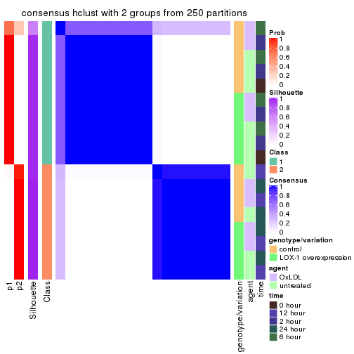</p>

</div>
<div id='tab-ATC-hclust-consensus-heatmap-2'>
<pre><code class="r">consensus_heatmap(res, k = 3)
</code></pre>

<p>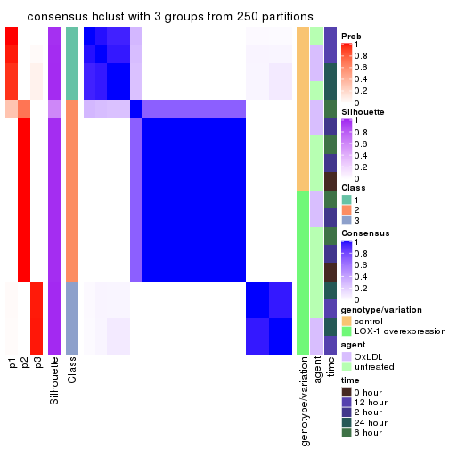</p>

</div>
<div id='tab-ATC-hclust-consensus-heatmap-3'>
<pre><code class="r">consensus_heatmap(res, k = 4)
</code></pre>

<p>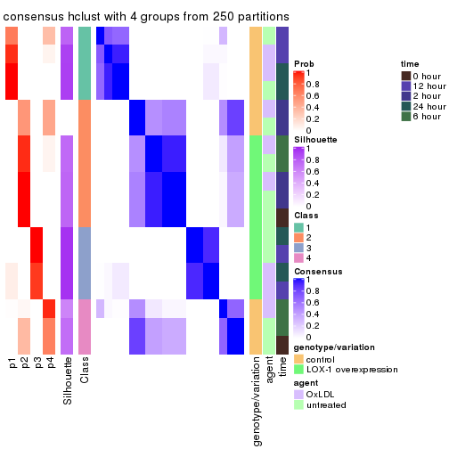</p>

</div>
<div id='tab-ATC-hclust-consensus-heatmap-4'>
<pre><code class="r">consensus_heatmap(res, k = 5)
</code></pre>

<p>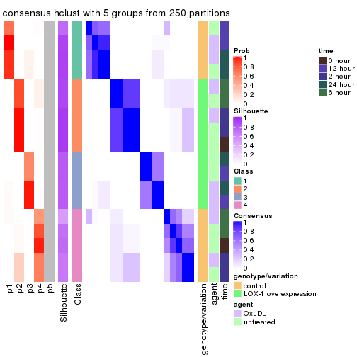</p>

</div>
<div id='tab-ATC-hclust-consensus-heatmap-5'>
<pre><code class="r">consensus_heatmap(res, k = 6)
</code></pre>

<p>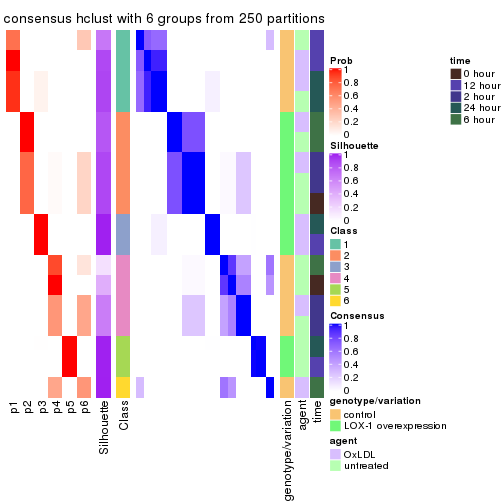</p>

</div>
</div>

Heatmaps for the membership of samples in all partitions to see how consistent they are:


<script>
$( function() {
	$( '#tabs-ATC-hclust-membership-heatmap' ).tabs();
} );
</script>
<div id='tabs-ATC-hclust-membership-heatmap'>
<ul>
<li><a href='#tab-ATC-hclust-membership-heatmap-1'>k = 2</a></li>
<li><a href='#tab-ATC-hclust-membership-heatmap-2'>k = 3</a></li>
<li><a href='#tab-ATC-hclust-membership-heatmap-3'>k = 4</a></li>
<li><a href='#tab-ATC-hclust-membership-heatmap-4'>k = 5</a></li>
<li><a href='#tab-ATC-hclust-membership-heatmap-5'>k = 6</a></li>
</ul>
<div id='tab-ATC-hclust-membership-heatmap-1'>
<pre><code class="r">membership_heatmap(res, k = 2)
</code></pre>

<p>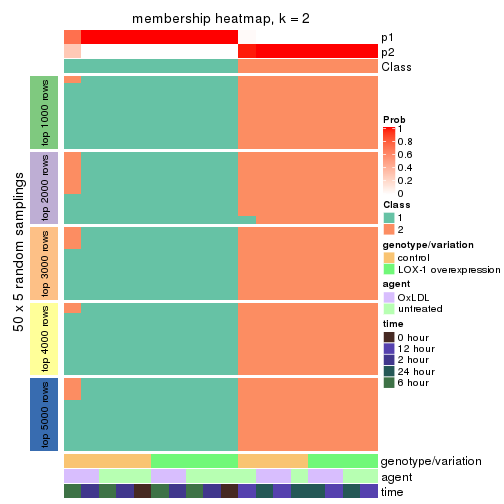</p>

</div>
<div id='tab-ATC-hclust-membership-heatmap-2'>
<pre><code class="r">membership_heatmap(res, k = 3)
</code></pre>

<p>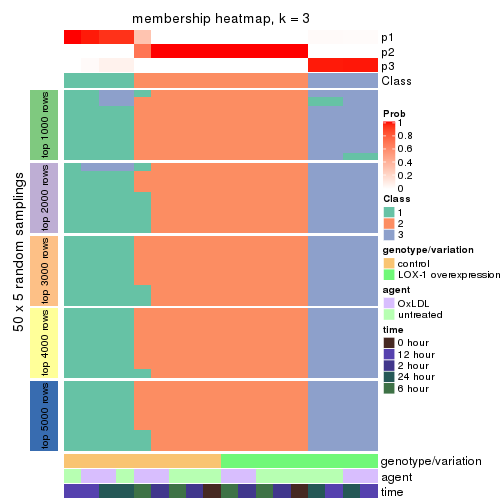</p>

</div>
<div id='tab-ATC-hclust-membership-heatmap-3'>
<pre><code class="r">membership_heatmap(res, k = 4)
</code></pre>

<p>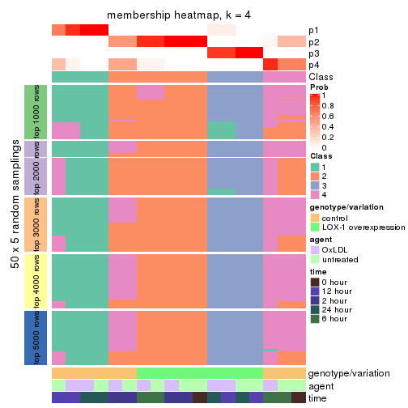</p>

</div>
<div id='tab-ATC-hclust-membership-heatmap-4'>
<pre><code class="r">membership_heatmap(res, k = 5)
</code></pre>

<p>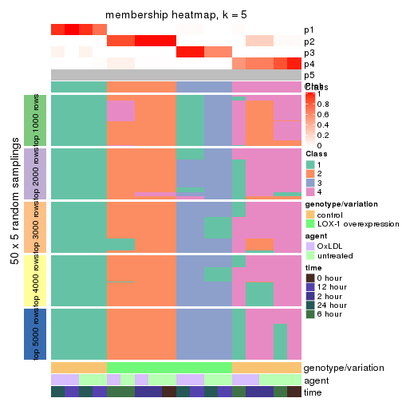</p>

</div>
<div id='tab-ATC-hclust-membership-heatmap-5'>
<pre><code class="r">membership_heatmap(res, k = 6)
</code></pre>

<p>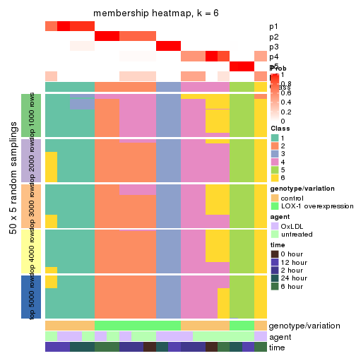</p>

</div>
</div>

As soon as we have had the classes for columns, we can look for signatures
which are significantly different between classes which can be candidate marks
for certain classes. Following are the heatmaps for signatures.


Signature heatmaps where rows are scaled:


<script>
$( function() {
	$( '#tabs-ATC-hclust-get-signatures' ).tabs();
} );
</script>
<div id='tabs-ATC-hclust-get-signatures'>
<ul>
<li><a href='#tab-ATC-hclust-get-signatures-1'>k = 2</a></li>
<li><a href='#tab-ATC-hclust-get-signatures-2'>k = 3</a></li>
<li><a href='#tab-ATC-hclust-get-signatures-3'>k = 4</a></li>
<li><a href='#tab-ATC-hclust-get-signatures-4'>k = 5</a></li>
<li><a href='#tab-ATC-hclust-get-signatures-5'>k = 6</a></li>
</ul>
<div id='tab-ATC-hclust-get-signatures-1'>
<pre><code class="r">get_signatures(res, k = 2)
</code></pre>

<p>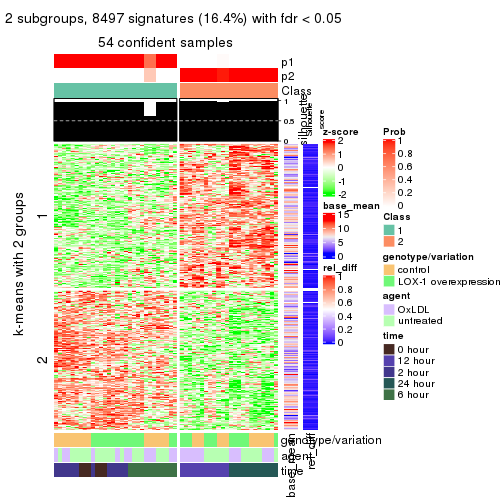</p>

</div>
<div id='tab-ATC-hclust-get-signatures-2'>
<pre><code class="r">get_signatures(res, k = 3)
</code></pre>

<p>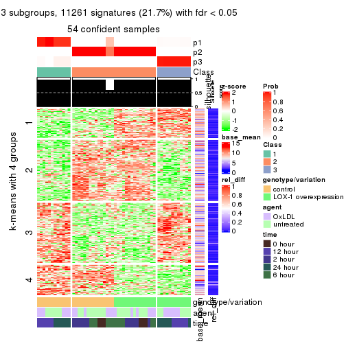</p>

</div>
<div id='tab-ATC-hclust-get-signatures-3'>
<pre><code class="r">get_signatures(res, k = 4)
</code></pre>

<p>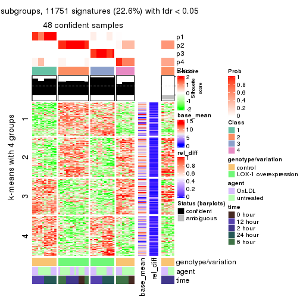</p>

</div>
<div id='tab-ATC-hclust-get-signatures-4'>
<pre><code class="r">get_signatures(res, k = 5)
</code></pre>

<p>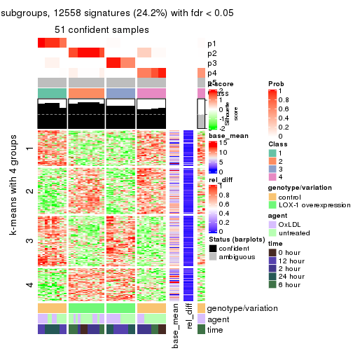</p>

</div>
<div id='tab-ATC-hclust-get-signatures-5'>
<pre><code class="r">get_signatures(res, k = 6)
</code></pre>

<p>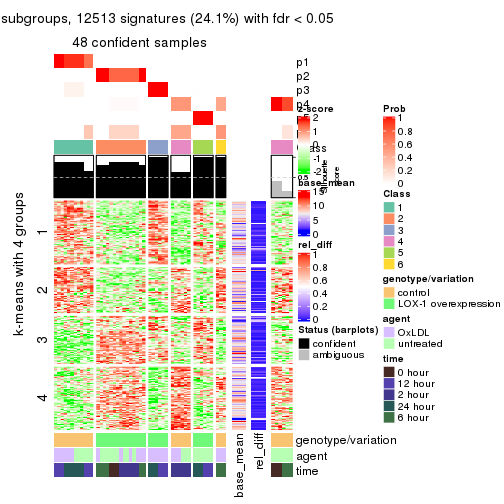</p>

</div>
</div>


Signature heatmaps where rows are not scaled:


<script>
$( function() {
	$( '#tabs-ATC-hclust-get-signatures-no-scale' ).tabs();
} );
</script>
<div id='tabs-ATC-hclust-get-signatures-no-scale'>
<ul>
<li><a href='#tab-ATC-hclust-get-signatures-no-scale-1'>k = 2</a></li>
<li><a href='#tab-ATC-hclust-get-signatures-no-scale-2'>k = 3</a></li>
<li><a href='#tab-ATC-hclust-get-signatures-no-scale-3'>k = 4</a></li>
<li><a href='#tab-ATC-hclust-get-signatures-no-scale-4'>k = 5</a></li>
<li><a href='#tab-ATC-hclust-get-signatures-no-scale-5'>k = 6</a></li>
</ul>
<div id='tab-ATC-hclust-get-signatures-no-scale-1'>
<pre><code class="r">get_signatures(res, k = 2, scale_rows = FALSE)
</code></pre>

<p>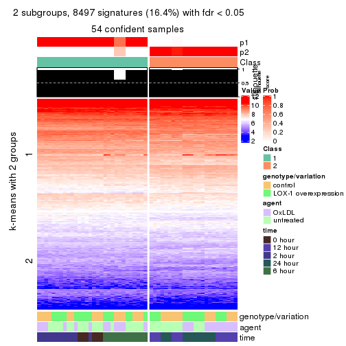</p>

</div>
<div id='tab-ATC-hclust-get-signatures-no-scale-2'>
<pre><code class="r">get_signatures(res, k = 3, scale_rows = FALSE)
</code></pre>

<p>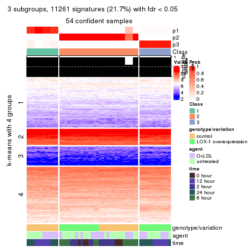</p>

</div>
<div id='tab-ATC-hclust-get-signatures-no-scale-3'>
<pre><code class="r">get_signatures(res, k = 4, scale_rows = FALSE)
</code></pre>

<p>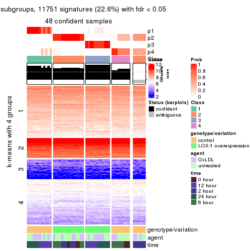</p>

</div>
<div id='tab-ATC-hclust-get-signatures-no-scale-4'>
<pre><code class="r">get_signatures(res, k = 5, scale_rows = FALSE)
</code></pre>

<p>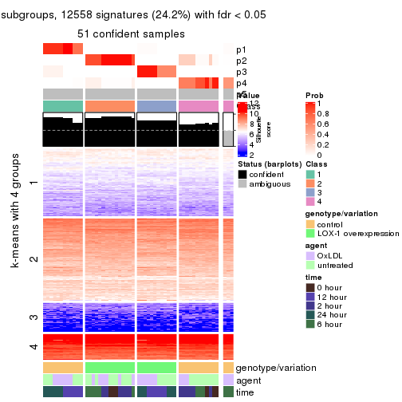</p>

</div>
<div id='tab-ATC-hclust-get-signatures-no-scale-5'>
<pre><code class="r">get_signatures(res, k = 6, scale_rows = FALSE)
</code></pre>

<p>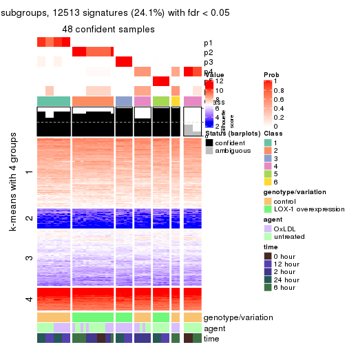</p>

</div>
</div>


Compare the overlap of signatures from different k:

```r
compare_signatures(res)
```

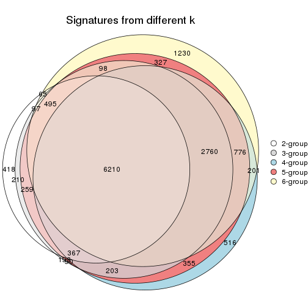

`get_signature()` returns a data frame invisibly. TO get the list of signatures, the function
call should be assigned to a variable explicitly. In following code, if `plot` argument is set
to `FALSE`, no heatmap is plotted while only the differential analysis is performed.

```r
# code only for demonstration
tb = get_signature(res, k = ..., plot = FALSE)
```

An example of the output of `tb` is:

```
#>   which_row         fdr    mean_1    mean_2 scaled_mean_1 scaled_mean_2 km
#> 1        38 0.042760348  8.373488  9.131774    -0.5533452     0.5164555  1
#> 2        40 0.018707592  7.106213  8.469186    -0.6173731     0.5762149  1
#> 3        55 0.019134737 10.221463 11.207825    -0.6159697     0.5749050  1
#> 4        59 0.006059896  5.921854  7.869574    -0.6899429     0.6439467  1
#> 5        60 0.018055526  8.928898 10.211722    -0.6204761     0.5791110  1
#> 6        98 0.009384629 15.714769 14.887706     0.6635654    -0.6193277  2
...
```

The columns in `tb` are:

1. `which_row`: row indices corresponding to the input matrix.
2. `fdr`: FDR for the differential test. 
3. `mean_x`: The mean value in group x.
4. `scaled_mean_x`: The mean value in group x after rows are scaled.
5. `km`: Row groups if k-means clustering is applied to rows.


UMAP plot which shows how samples are separated.


<script>
$( function() {
	$( '#tabs-ATC-hclust-dimension-reduction' ).tabs();
} );
</script>
<div id='tabs-ATC-hclust-dimension-reduction'>
<ul>
<li><a href='#tab-ATC-hclust-dimension-reduction-1'>k = 2</a></li>
<li><a href='#tab-ATC-hclust-dimension-reduction-2'>k = 3</a></li>
<li><a href='#tab-ATC-hclust-dimension-reduction-3'>k = 4</a></li>
<li><a href='#tab-ATC-hclust-dimension-reduction-4'>k = 5</a></li>
<li><a href='#tab-ATC-hclust-dimension-reduction-5'>k = 6</a></li>
</ul>
<div id='tab-ATC-hclust-dimension-reduction-1'>
<pre><code class="r">dimension_reduction(res, k = 2, method = &quot;UMAP&quot;)
</code></pre>

<p></p>

</div>
<div id='tab-ATC-hclust-dimension-reduction-2'>
<pre><code class="r">dimension_reduction(res, k = 3, method = &quot;UMAP&quot;)
</code></pre>

<p>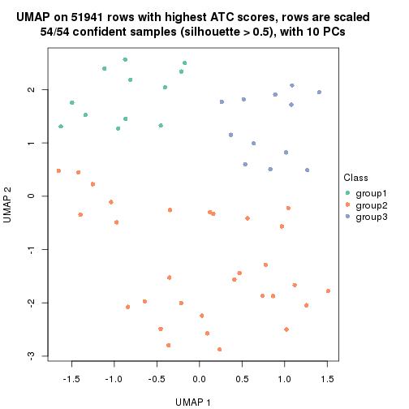</p>

</div>
<div id='tab-ATC-hclust-dimension-reduction-3'>
<pre><code class="r">dimension_reduction(res, k = 4, method = &quot;UMAP&quot;)
</code></pre>

<p>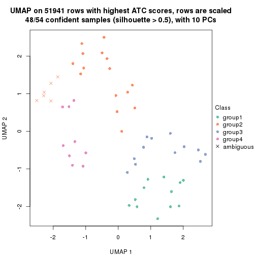</p>

</div>
<div id='tab-ATC-hclust-dimension-reduction-4'>
<pre><code class="r">dimension_reduction(res, k = 5, method = &quot;UMAP&quot;)
</code></pre>

<p>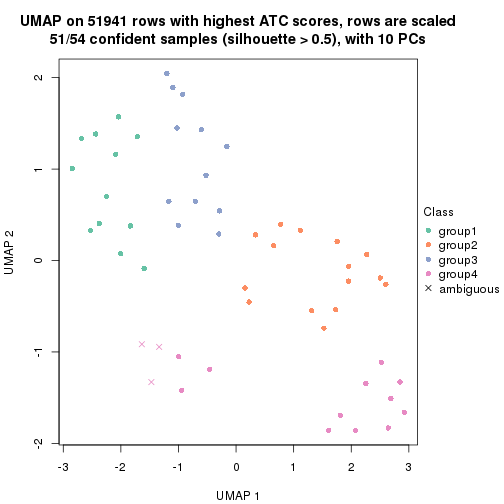</p>

</div>
<div id='tab-ATC-hclust-dimension-reduction-5'>
<pre><code class="r">dimension_reduction(res, k = 6, method = &quot;UMAP&quot;)
</code></pre>

<p>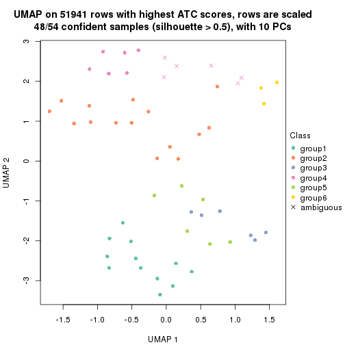</p>

</div>
</div>


Following heatmap shows how subgroups are split when increasing `k`:

```r
collect_classes(res)
```

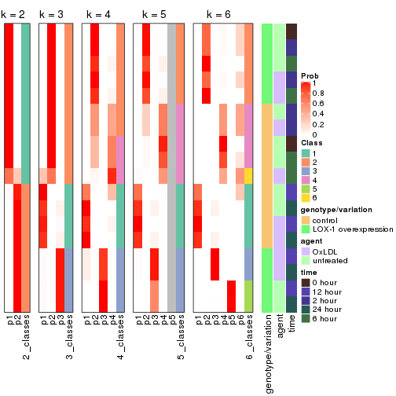


Test correlation between subgroups and known annotations. If the known
annotation is numeric, one-way ANOVA test is applied, and if the known
annotation is discrete, chi-squared contingency table test is applied.

```r
test_to_known_factors(res)
```

```
#>             n genotype/variation(p) agent(p)  time(p) k
#> ATC:hclust 54              1.00e+00  0.64603 5.26e-11 2
#> ATC:hclust 54              6.14e-06  0.76338 6.90e-09 3
#> ATC:hclust 48              2.13e-10  0.83423 6.16e-08 4
#> ATC:hclust 51              4.89e-11  0.55670 5.54e-07 5
#> ATC:hclust 48              3.55e-09  0.00808 8.56e-08 6
```


If matrix rows can be associated to genes, consider to use `functional_enrichment(res,
...)` to perform function enrichment for the signature genes. See [this vignette](http://bioconductor.org/packages/devel/bioc/vignettes/cola/inst/doc/functional_enrichment.html) for more detailed explanations.


 

---------------------------------------------------


### ATC:kmeans


The object with results only for a single top-value method and a single partition method 
can be extracted as:

```r
res = res_list["ATC", "kmeans"]
# you can also extract it by
# res = res_list["ATC:kmeans"]
```

A summary of `res` and all the functions that can be applied to it:

```r
res
```

```
#> A 'ConsensusPartition' object with k = 2, 3, 4, 5, 6.
#>   On a matrix with 51941 rows and 54 columns.
#>   Top rows (1000, 2000, 3000, 4000, 5000) are extracted by 'ATC' method.
#>   Subgroups are detected by 'kmeans' method.
#>   Performed in total 1250 partitions by row resampling.
#>   Best k for subgroups seems to be 2.
#> 
#> Following methods can be applied to this 'ConsensusPartition' object:
#>  [1] "cola_report"             "collect_classes"         "collect_plots"          
#>  [4] "collect_stats"           "colnames"                "compare_signatures"     
#>  [7] "consensus_heatmap"       "dimension_reduction"     "functional_enrichment"  
#> [10] "get_anno_col"            "get_anno"                "get_classes"            
#> [13] "get_consensus"           "get_matrix"              "get_membership"         
#> [16] "get_param"               "get_signatures"          "get_stats"              
#> [19] "is_best_k"               "is_stable_k"             "membership_heatmap"     
#> [22] "ncol"                    "nrow"                    "plot_ecdf"              
#> [25] "rownames"                "select_partition_number" "show"                   
#> [28] "suggest_best_k"          "test_to_known_factors"
```

`collect_plots()` function collects all the plots made from `res` for all `k` (number of partitions)
into one single page to provide an easy and fast comparison between different `k`.

```r
collect_plots(res)
```

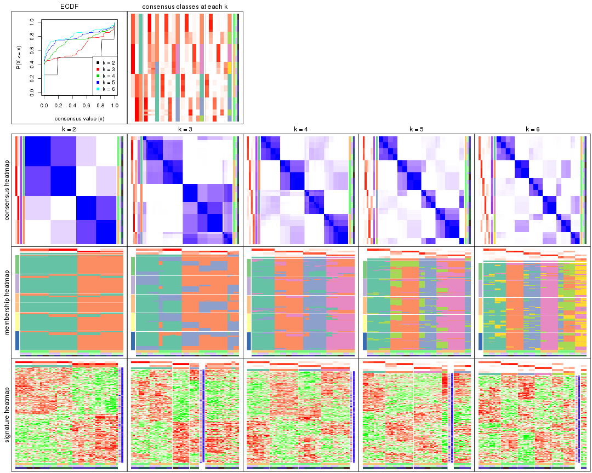

The plots are:

- The first row: a plot of the ECDF (empirical cumulative distribution
  function) curves of the consensus matrix for each `k` and the heatmap of
  predicted classes for each `k`.
- The second row: heatmaps of the consensus matrix for each `k`.
- The third row: heatmaps of the membership matrix for each `k`.
- The fouth row: heatmaps of the signatures for each `k`.

All the plots in panels can be made by individual functions and they are
plotted later in this section.

`select_partition_number()` produces several plots showing different
statistics for choosing "optimized" `k`. There are following statistics:

- ECDF curves of the consensus matrix for each `k`;
- 1-PAC. [The PAC
  score](https://en.wikipedia.org/wiki/Consensus_clustering#Over-interpretation_potential_of_consensus_clustering)
  measures the proportion of the ambiguous subgrouping.
- Mean silhouette score.
- Concordance. The mean probability of fiting the consensus class ids in all
  partitions.
- Area increased. Denote $A_k$ as the area under the ECDF curve for current
  `k`, the area increased is defined as $A_k - A_{k-1}$.
- Rand index. The percent of pairs of samples that are both in a same cluster
  or both are not in a same cluster in the partition of k and k-1.
- Jaccard index. The ratio of pairs of samples are both in a same cluster in
  the partition of k and k-1 and the pairs of samples are both in a same
  cluster in the partition k or k-1.

The detailed explanations of these statistics can be found in [the _cola_
vignette](http://bioconductor.org/packages/devel/bioc/vignettes/cola/inst/doc/cola.html#toc_13).

Generally speaking, lower PAC score, higher mean silhouette score or higher
concordance corresponds to better partition. Rand index and Jaccard index
measure how similar the current partition is compared to partition with `k-1`.
If they are too similar, we won't accept `k` is better than `k-1`.

```r
select_partition_number(res)
```

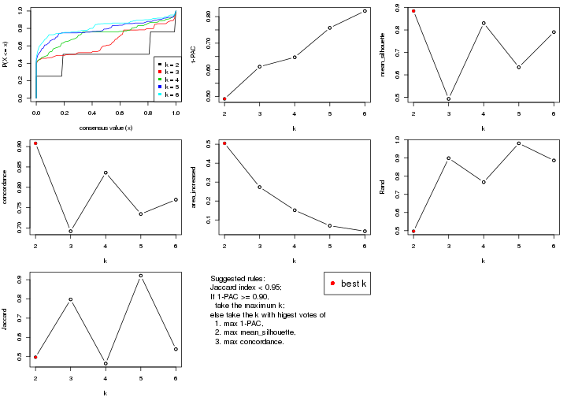

The numeric values for all these statistics can be obtained by `get_stats()`.

```r
get_stats(res)
```

```
#>   k 1-PAC mean_silhouette concordance area_increased  Rand Jaccard
#> 2 2 0.491           0.884       0.908         0.5048 0.497   0.497
#> 3 3 0.612           0.493       0.692         0.2736 0.899   0.797
#> 4 4 0.647           0.830       0.836         0.1514 0.767   0.464
#> 5 5 0.758           0.634       0.734         0.0695 0.981   0.921
#> 6 6 0.821           0.790       0.770         0.0405 0.887   0.538
```

`suggest_best_k()` suggests the best $k$ based on these statistics. The rules are as follows:

- All $k$ with Jaccard index larger than 0.95 are removed because increasing
  $k$ does not provide enough extra information. If all $k$ are removed, it is
  marked as no subgroup is detected.
- For all $k$ with 1-PAC score larger than 0.9, the maximal $k$ is taken as
  the best $k$, and other $k$ are marked as optional $k$.
- If it does not fit the second rule. The $k$ with the maximal vote of the
  highest 1-PAC score, highest mean silhouette, and highest concordance is
  taken as the best $k$.

```r
suggest_best_k(res)
```

```
#> [1] 2
```


Following shows the table of the partitions (You need to click the **show/hide
code output** link to see it). The membership matrix (columns with name `p*`)
is inferred by
[`clue::cl_consensus()`](https://www.rdocumentation.org/link/cl_consensus?package=clue)
function with the `SE` method. Basically the value in the membership matrix
represents the probability to belong to a certain group. The finall class
label for an item is determined with the group with highest probability it
belongs to.

In `get_classes()` function, the entropy is calculated from the membership
matrix and the silhouette score is calculated from the consensus matrix.


<script>
$( function() {
	$( '#tabs-ATC-kmeans-get-classes' ).tabs();
} );
</script>
<div id='tabs-ATC-kmeans-get-classes'>
<ul>
<li><a href='#tab-ATC-kmeans-get-classes-1'>k = 2</a></li>
<li><a href='#tab-ATC-kmeans-get-classes-2'>k = 3</a></li>
<li><a href='#tab-ATC-kmeans-get-classes-3'>k = 4</a></li>
<li><a href='#tab-ATC-kmeans-get-classes-4'>k = 5</a></li>
<li><a href='#tab-ATC-kmeans-get-classes-5'>k = 6</a></li>
</ul>

<div id='tab-ATC-kmeans-get-classes-1'>
<p><a id='tab-ATC-kmeans-get-classes-1-a' style='color:#0366d6' href='#'>show/hide code output</a></p>
<pre><code class="r">cbind(get_classes(res, k = 2), get_membership(res, k = 2))
</code></pre>

<pre><code>#&gt;           class entropy silhouette    p1    p2
#&gt; GSM329068     1   0.689      0.885 0.816 0.184
#&gt; GSM329074     1   0.689      0.885 0.816 0.184
#&gt; GSM329100     1   0.689      0.885 0.816 0.184
#&gt; GSM329062     1   0.689      0.885 0.816 0.184
#&gt; GSM329079     1   0.689      0.885 0.816 0.184
#&gt; GSM329090     1   0.689      0.885 0.816 0.184
#&gt; GSM329066     1   0.689      0.885 0.816 0.184
#&gt; GSM329086     1   0.689      0.885 0.816 0.184
#&gt; GSM329099     1   0.689      0.885 0.816 0.184
#&gt; GSM329071     2   0.000      0.884 0.000 1.000
#&gt; GSM329078     2   0.000      0.884 0.000 1.000
#&gt; GSM329081     2   0.000      0.884 0.000 1.000
#&gt; GSM329096     2   0.000      0.884 0.000 1.000
#&gt; GSM329102     2   0.000      0.884 0.000 1.000
#&gt; GSM329104     2   0.000      0.884 0.000 1.000
#&gt; GSM329067     1   0.689      0.885 0.816 0.184
#&gt; GSM329072     1   0.689      0.885 0.816 0.184
#&gt; GSM329075     1   0.689      0.885 0.816 0.184
#&gt; GSM329058     1   0.689      0.885 0.816 0.184
#&gt; GSM329073     1   0.689      0.885 0.816 0.184
#&gt; GSM329107     1   0.689      0.885 0.816 0.184
#&gt; GSM329057     2   0.000      0.884 0.000 1.000
#&gt; GSM329085     2   0.000      0.884 0.000 1.000
#&gt; GSM329089     2   0.000      0.884 0.000 1.000
#&gt; GSM329076     2   0.000      0.884 0.000 1.000
#&gt; GSM329094     2   0.000      0.884 0.000 1.000
#&gt; GSM329105     2   0.000      0.884 0.000 1.000
#&gt; GSM329056     1   0.000      0.885 1.000 0.000
#&gt; GSM329069     1   0.000      0.885 1.000 0.000
#&gt; GSM329077     1   0.000      0.885 1.000 0.000
#&gt; GSM329070     1   0.000      0.885 1.000 0.000
#&gt; GSM329082     1   0.000      0.885 1.000 0.000
#&gt; GSM329092     1   0.000      0.885 1.000 0.000
#&gt; GSM329083     1   0.000      0.885 1.000 0.000
#&gt; GSM329101     1   0.000      0.885 1.000 0.000
#&gt; GSM329106     1   0.000      0.885 1.000 0.000
#&gt; GSM329087     2   0.689      0.884 0.184 0.816
#&gt; GSM329091     2   0.689      0.884 0.184 0.816
#&gt; GSM329093     2   0.689      0.884 0.184 0.816
#&gt; GSM329080     2   0.689      0.884 0.184 0.816
#&gt; GSM329084     2   0.689      0.884 0.184 0.816
#&gt; GSM329088     2   0.689      0.884 0.184 0.816
#&gt; GSM329059     1   0.000      0.885 1.000 0.000
#&gt; GSM329097     1   0.000      0.885 1.000 0.000
#&gt; GSM329098     1   0.000      0.885 1.000 0.000
#&gt; GSM329055     1   0.000      0.885 1.000 0.000
#&gt; GSM329103     1   0.000      0.885 1.000 0.000
#&gt; GSM329108     1   0.000      0.885 1.000 0.000
#&gt; GSM329061     2   0.689      0.884 0.184 0.816
#&gt; GSM329064     2   0.689      0.884 0.184 0.816
#&gt; GSM329065     2   0.689      0.884 0.184 0.816
#&gt; GSM329060     2   0.689      0.884 0.184 0.816
#&gt; GSM329063     2   0.689      0.884 0.184 0.816
#&gt; GSM329095     2   0.689      0.884 0.184 0.816
</code></pre>

<script>
$('#tab-ATC-kmeans-get-classes-1-a').parent().next().next().hide();
$('#tab-ATC-kmeans-get-classes-1-a').click(function(){
  $('#tab-ATC-kmeans-get-classes-1-a').parent().next().next().toggle();
  return(false);
});
</script>
</div>

<div id='tab-ATC-kmeans-get-classes-2'>
<p><a id='tab-ATC-kmeans-get-classes-2-a' style='color:#0366d6' href='#'>show/hide code output</a></p>
<pre><code class="r">cbind(get_classes(res, k = 3), get_membership(res, k = 3))
</code></pre>

<pre><code>#&gt;           class entropy silhouette    p1    p2    p3
#&gt; GSM329068     2  0.0000      0.575 0.000 1.000 0.000
#&gt; GSM329074     2  0.0000      0.575 0.000 1.000 0.000
#&gt; GSM329100     2  0.0000      0.575 0.000 1.000 0.000
#&gt; GSM329062     2  0.0000      0.575 0.000 1.000 0.000
#&gt; GSM329079     2  0.0000      0.575 0.000 1.000 0.000
#&gt; GSM329090     2  0.0000      0.575 0.000 1.000 0.000
#&gt; GSM329066     2  0.4228      0.476 0.008 0.844 0.148
#&gt; GSM329086     2  0.4047      0.478 0.004 0.848 0.148
#&gt; GSM329099     2  0.4228      0.476 0.008 0.844 0.148
#&gt; GSM329071     1  0.8985      0.226 0.544 0.292 0.164
#&gt; GSM329078     1  0.1643      0.732 0.956 0.000 0.044
#&gt; GSM329081     1  0.8985      0.226 0.544 0.292 0.164
#&gt; GSM329096     1  0.0237      0.746 0.996 0.000 0.004
#&gt; GSM329102     1  0.0237      0.746 0.996 0.000 0.004
#&gt; GSM329104     1  0.0424      0.745 0.992 0.000 0.008
#&gt; GSM329067     2  0.0000      0.575 0.000 1.000 0.000
#&gt; GSM329072     2  0.0000      0.575 0.000 1.000 0.000
#&gt; GSM329075     2  0.0000      0.575 0.000 1.000 0.000
#&gt; GSM329058     2  0.4291      0.472 0.008 0.840 0.152
#&gt; GSM329073     2  0.4291      0.472 0.008 0.840 0.152
#&gt; GSM329107     2  0.4291      0.472 0.008 0.840 0.152
#&gt; GSM329057     1  0.0592      0.746 0.988 0.000 0.012
#&gt; GSM329085     1  0.0592      0.746 0.988 0.000 0.012
#&gt; GSM329089     1  0.0592      0.746 0.988 0.000 0.012
#&gt; GSM329076     1  0.0424      0.748 0.992 0.000 0.008
#&gt; GSM329094     1  0.0424      0.748 0.992 0.000 0.008
#&gt; GSM329105     1  0.0424      0.748 0.992 0.000 0.008
#&gt; GSM329056     2  0.6045     -0.253 0.000 0.620 0.380
#&gt; GSM329069     2  0.6045     -0.253 0.000 0.620 0.380
#&gt; GSM329077     2  0.6079     -0.285 0.000 0.612 0.388
#&gt; GSM329070     2  0.6045     -0.253 0.000 0.620 0.380
#&gt; GSM329082     2  0.6045     -0.253 0.000 0.620 0.380
#&gt; GSM329092     2  0.6045     -0.253 0.000 0.620 0.380
#&gt; GSM329083     3  0.6291      0.708 0.000 0.468 0.532
#&gt; GSM329101     3  0.6291      0.708 0.000 0.468 0.532
#&gt; GSM329106     3  0.6302      0.671 0.000 0.480 0.520
#&gt; GSM329087     1  0.6295      0.740 0.528 0.000 0.472
#&gt; GSM329091     1  0.6295      0.740 0.528 0.000 0.472
#&gt; GSM329093     1  0.6295      0.740 0.528 0.000 0.472
#&gt; GSM329080     1  0.6154      0.760 0.592 0.000 0.408
#&gt; GSM329084     1  0.6154      0.760 0.592 0.000 0.408
#&gt; GSM329088     1  0.6154      0.760 0.592 0.000 0.408
#&gt; GSM329059     2  0.6045     -0.253 0.000 0.620 0.380
#&gt; GSM329097     2  0.6045     -0.253 0.000 0.620 0.380
#&gt; GSM329098     2  0.6045     -0.253 0.000 0.620 0.380
#&gt; GSM329055     3  0.4605      0.431 0.000 0.204 0.796
#&gt; GSM329103     3  0.6140      0.732 0.000 0.404 0.596
#&gt; GSM329108     3  0.6140      0.732 0.000 0.404 0.596
#&gt; GSM329061     1  0.6267      0.748 0.548 0.000 0.452
#&gt; GSM329064     1  0.6267      0.748 0.548 0.000 0.452
#&gt; GSM329065     1  0.6267      0.748 0.548 0.000 0.452
#&gt; GSM329060     1  0.6140      0.760 0.596 0.000 0.404
#&gt; GSM329063     1  0.6140      0.760 0.596 0.000 0.404
#&gt; GSM329095     1  0.6140      0.760 0.596 0.000 0.404
</code></pre>

<script>
$('#tab-ATC-kmeans-get-classes-2-a').parent().next().next().hide();
$('#tab-ATC-kmeans-get-classes-2-a').click(function(){
  $('#tab-ATC-kmeans-get-classes-2-a').parent().next().next().toggle();
  return(false);
});
</script>
</div>

<div id='tab-ATC-kmeans-get-classes-3'>
<p><a id='tab-ATC-kmeans-get-classes-3-a' style='color:#0366d6' href='#'>show/hide code output</a></p>
<pre><code class="r">cbind(get_classes(res, k = 4), get_membership(res, k = 4))
</code></pre>

<pre><code>#&gt;           class entropy silhouette    p1    p2    p3    p4
#&gt; GSM329068     2   0.240      0.840 0.000 0.904 0.004 0.092
#&gt; GSM329074     2   0.240      0.840 0.000 0.904 0.004 0.092
#&gt; GSM329100     2   0.240      0.840 0.000 0.904 0.004 0.092
#&gt; GSM329062     2   0.222      0.840 0.000 0.908 0.000 0.092
#&gt; GSM329079     2   0.222      0.840 0.000 0.908 0.000 0.092
#&gt; GSM329090     2   0.222      0.840 0.000 0.908 0.000 0.092
#&gt; GSM329066     2   0.455      0.776 0.000 0.804 0.100 0.096
#&gt; GSM329086     2   0.449      0.777 0.000 0.808 0.096 0.096
#&gt; GSM329099     2   0.455      0.776 0.000 0.804 0.100 0.096
#&gt; GSM329071     3   0.553      0.680 0.052 0.176 0.748 0.024
#&gt; GSM329078     3   0.465      0.758 0.076 0.084 0.820 0.020
#&gt; GSM329081     3   0.553      0.680 0.052 0.176 0.748 0.024
#&gt; GSM329096     3   0.331      0.870 0.156 0.000 0.840 0.004
#&gt; GSM329102     3   0.345      0.871 0.156 0.000 0.836 0.008
#&gt; GSM329104     3   0.314      0.869 0.132 0.000 0.860 0.008
#&gt; GSM329067     2   0.222      0.840 0.000 0.908 0.000 0.092
#&gt; GSM329072     2   0.222      0.840 0.000 0.908 0.000 0.092
#&gt; GSM329075     2   0.222      0.840 0.000 0.908 0.000 0.092
#&gt; GSM329058     2   0.496      0.754 0.000 0.776 0.116 0.108
#&gt; GSM329073     2   0.496      0.754 0.000 0.776 0.116 0.108
#&gt; GSM329107     2   0.496      0.754 0.000 0.776 0.116 0.108
#&gt; GSM329057     3   0.385      0.869 0.188 0.004 0.804 0.004
#&gt; GSM329085     3   0.385      0.869 0.188 0.004 0.804 0.004
#&gt; GSM329089     3   0.385      0.869 0.188 0.004 0.804 0.004
#&gt; GSM329076     3   0.384      0.857 0.168 0.000 0.816 0.016
#&gt; GSM329094     3   0.384      0.857 0.168 0.000 0.816 0.016
#&gt; GSM329105     3   0.384      0.857 0.168 0.000 0.816 0.016
#&gt; GSM329056     4   0.383      0.853 0.000 0.204 0.004 0.792
#&gt; GSM329069     4   0.383      0.853 0.000 0.204 0.004 0.792
#&gt; GSM329077     4   0.379      0.853 0.000 0.200 0.004 0.796
#&gt; GSM329070     4   0.391      0.849 0.000 0.232 0.000 0.768
#&gt; GSM329082     4   0.391      0.849 0.000 0.232 0.000 0.768
#&gt; GSM329092     4   0.391      0.849 0.000 0.232 0.000 0.768
#&gt; GSM329083     4   0.444      0.794 0.044 0.084 0.036 0.836
#&gt; GSM329101     4   0.444      0.794 0.044 0.084 0.036 0.836
#&gt; GSM329106     4   0.397      0.800 0.024 0.084 0.036 0.856
#&gt; GSM329087     1   0.198      0.862 0.928 0.000 0.004 0.068
#&gt; GSM329091     1   0.249      0.846 0.912 0.000 0.020 0.068
#&gt; GSM329093     1   0.198      0.862 0.928 0.000 0.004 0.068
#&gt; GSM329080     1   0.289      0.898 0.872 0.000 0.124 0.004
#&gt; GSM329084     1   0.289      0.898 0.872 0.000 0.124 0.004
#&gt; GSM329088     1   0.289      0.898 0.872 0.000 0.124 0.004
#&gt; GSM329059     4   0.391      0.849 0.000 0.232 0.000 0.768
#&gt; GSM329097     4   0.391      0.849 0.000 0.232 0.000 0.768
#&gt; GSM329098     4   0.391      0.849 0.000 0.232 0.000 0.768
#&gt; GSM329055     4   0.524      0.657 0.172 0.024 0.040 0.764
#&gt; GSM329103     4   0.507      0.722 0.120 0.044 0.040 0.796
#&gt; GSM329108     4   0.507      0.722 0.120 0.044 0.040 0.796
#&gt; GSM329061     1   0.250      0.897 0.916 0.000 0.044 0.040
#&gt; GSM329064     1   0.250      0.897 0.916 0.000 0.044 0.040
#&gt; GSM329065     1   0.250      0.897 0.916 0.000 0.044 0.040
#&gt; GSM329060     1   0.294      0.896 0.868 0.000 0.128 0.004
#&gt; GSM329063     1   0.294      0.896 0.868 0.000 0.128 0.004
#&gt; GSM329095     1   0.294      0.896 0.868 0.000 0.128 0.004
</code></pre>

<script>
$('#tab-ATC-kmeans-get-classes-3-a').parent().next().next().hide();
$('#tab-ATC-kmeans-get-classes-3-a').click(function(){
  $('#tab-ATC-kmeans-get-classes-3-a').parent().next().next().toggle();
  return(false);
});
</script>
</div>

<div id='tab-ATC-kmeans-get-classes-4'>
<p><a id='tab-ATC-kmeans-get-classes-4-a' style='color:#0366d6' href='#'>show/hide code output</a></p>
<pre><code class="r">cbind(get_classes(res, k = 5), get_membership(res, k = 5))
</code></pre>

<pre><code>#&gt;           class entropy silhouette    p1    p2    p3    p4    p5
#&gt; GSM329068     2  0.1522      0.784 0.000 0.944 0.000 0.044 0.012
#&gt; GSM329074     2  0.1522      0.784 0.000 0.944 0.000 0.044 0.012
#&gt; GSM329100     2  0.1522      0.784 0.000 0.944 0.000 0.044 0.012
#&gt; GSM329062     2  0.1121      0.785 0.000 0.956 0.000 0.044 0.000
#&gt; GSM329079     2  0.1121      0.785 0.000 0.956 0.000 0.044 0.000
#&gt; GSM329090     2  0.1121      0.785 0.000 0.956 0.000 0.044 0.000
#&gt; GSM329066     2  0.5940      0.648 0.000 0.568 0.336 0.080 0.016
#&gt; GSM329086     2  0.5940      0.648 0.000 0.568 0.336 0.080 0.016
#&gt; GSM329099     2  0.5940      0.648 0.000 0.568 0.336 0.080 0.016
#&gt; GSM329071     3  0.0912      0.307 0.012 0.016 0.972 0.000 0.000
#&gt; GSM329078     3  0.1485      0.304 0.020 0.000 0.948 0.000 0.032
#&gt; GSM329081     3  0.0912      0.307 0.012 0.016 0.972 0.000 0.000
#&gt; GSM329096     3  0.5842     -0.536 0.072 0.008 0.492 0.000 0.428
#&gt; GSM329102     3  0.5825     -0.488 0.072 0.008 0.508 0.000 0.412
#&gt; GSM329104     3  0.5666     -0.436 0.060 0.008 0.524 0.000 0.408
#&gt; GSM329067     2  0.1121      0.785 0.000 0.956 0.000 0.044 0.000
#&gt; GSM329072     2  0.1121      0.785 0.000 0.956 0.000 0.044 0.000
#&gt; GSM329075     2  0.1522      0.784 0.000 0.944 0.000 0.044 0.012
#&gt; GSM329058     2  0.6362      0.604 0.000 0.508 0.380 0.080 0.032
#&gt; GSM329073     2  0.6362      0.604 0.000 0.508 0.380 0.080 0.032
#&gt; GSM329107     2  0.6292      0.604 0.000 0.512 0.380 0.080 0.028
#&gt; GSM329057     3  0.5447     -0.336 0.064 0.000 0.536 0.000 0.400
#&gt; GSM329085     3  0.5447     -0.336 0.064 0.000 0.536 0.000 0.400
#&gt; GSM329089     3  0.5447     -0.336 0.064 0.000 0.536 0.000 0.400
#&gt; GSM329076     5  0.5415      1.000 0.064 0.000 0.384 0.000 0.552
#&gt; GSM329094     5  0.5415      1.000 0.064 0.000 0.384 0.000 0.552
#&gt; GSM329105     5  0.5415      1.000 0.064 0.000 0.384 0.000 0.552
#&gt; GSM329056     4  0.2249      0.822 0.000 0.096 0.008 0.896 0.000
#&gt; GSM329069     4  0.2249      0.822 0.000 0.096 0.008 0.896 0.000
#&gt; GSM329077     4  0.2249      0.822 0.000 0.096 0.008 0.896 0.000
#&gt; GSM329070     4  0.2127      0.822 0.000 0.108 0.000 0.892 0.000
#&gt; GSM329082     4  0.2127      0.822 0.000 0.108 0.000 0.892 0.000
#&gt; GSM329092     4  0.2127      0.822 0.000 0.108 0.000 0.892 0.000
#&gt; GSM329083     4  0.4088      0.729 0.000 0.008 0.004 0.712 0.276
#&gt; GSM329101     4  0.4088      0.729 0.000 0.008 0.004 0.712 0.276
#&gt; GSM329106     4  0.4170      0.732 0.000 0.012 0.004 0.712 0.272
#&gt; GSM329087     1  0.1780      0.863 0.940 0.000 0.028 0.008 0.024
#&gt; GSM329091     1  0.1869      0.860 0.936 0.000 0.028 0.008 0.028
#&gt; GSM329093     1  0.1780      0.863 0.940 0.000 0.028 0.008 0.024
#&gt; GSM329080     1  0.3114      0.872 0.844 0.008 0.004 0.004 0.140
#&gt; GSM329084     1  0.3114      0.872 0.844 0.008 0.004 0.004 0.140
#&gt; GSM329088     1  0.3114      0.872 0.844 0.008 0.004 0.004 0.140
#&gt; GSM329059     4  0.2127      0.822 0.000 0.108 0.000 0.892 0.000
#&gt; GSM329097     4  0.2127      0.822 0.000 0.108 0.000 0.892 0.000
#&gt; GSM329098     4  0.2127      0.822 0.000 0.108 0.000 0.892 0.000
#&gt; GSM329055     4  0.5956      0.617 0.140 0.000 0.000 0.564 0.296
#&gt; GSM329103     4  0.5373      0.676 0.084 0.000 0.000 0.620 0.296
#&gt; GSM329108     4  0.5373      0.676 0.084 0.000 0.000 0.620 0.296
#&gt; GSM329061     1  0.1883      0.878 0.932 0.000 0.012 0.008 0.048
#&gt; GSM329064     1  0.1883      0.878 0.932 0.000 0.012 0.008 0.048
#&gt; GSM329065     1  0.1883      0.878 0.932 0.000 0.012 0.008 0.048
#&gt; GSM329060     1  0.3642      0.856 0.760 0.008 0.000 0.000 0.232
#&gt; GSM329063     1  0.3642      0.856 0.760 0.008 0.000 0.000 0.232
#&gt; GSM329095     1  0.3642      0.856 0.760 0.008 0.000 0.000 0.232
</code></pre>

<script>
$('#tab-ATC-kmeans-get-classes-4-a').parent().next().next().hide();
$('#tab-ATC-kmeans-get-classes-4-a').click(function(){
  $('#tab-ATC-kmeans-get-classes-4-a').parent().next().next().toggle();
  return(false);
});
</script>
</div>

<div id='tab-ATC-kmeans-get-classes-5'>
<p><a id='tab-ATC-kmeans-get-classes-5-a' style='color:#0366d6' href='#'>show/hide code output</a></p>
<pre><code class="r">cbind(get_classes(res, k = 6), get_membership(res, k = 6))
</code></pre>

<pre><code>#&gt;           class entropy silhouette    p1    p2    p3    p4    p5    p6
#&gt; GSM329068     2  0.2074   0.961281 0.000 0.920 0.012 0.028 0.004 0.036
#&gt; GSM329074     2  0.2074   0.961281 0.000 0.920 0.012 0.028 0.004 0.036
#&gt; GSM329100     2  0.2074   0.961281 0.000 0.920 0.012 0.028 0.004 0.036
#&gt; GSM329062     2  0.0632   0.971094 0.000 0.976 0.000 0.024 0.000 0.000
#&gt; GSM329079     2  0.0632   0.971094 0.000 0.976 0.000 0.024 0.000 0.000
#&gt; GSM329090     2  0.0632   0.971094 0.000 0.976 0.000 0.024 0.000 0.000
#&gt; GSM329066     5  0.5455   0.568327 0.000 0.436 0.000 0.004 0.456 0.104
#&gt; GSM329086     5  0.5456   0.561782 0.000 0.440 0.000 0.004 0.452 0.104
#&gt; GSM329099     5  0.5455   0.568327 0.000 0.436 0.000 0.004 0.456 0.104
#&gt; GSM329071     5  0.3521   0.153653 0.008 0.004 0.212 0.000 0.768 0.008
#&gt; GSM329078     5  0.4293   0.000353 0.016 0.000 0.248 0.000 0.704 0.032
#&gt; GSM329081     5  0.3521   0.153653 0.008 0.004 0.212 0.000 0.768 0.008
#&gt; GSM329096     3  0.4491   0.817807 0.040 0.000 0.732 0.008 0.196 0.024
#&gt; GSM329102     3  0.4520   0.816484 0.040 0.000 0.728 0.008 0.200 0.024
#&gt; GSM329104     3  0.4520   0.816484 0.040 0.000 0.728 0.008 0.200 0.024
#&gt; GSM329067     2  0.0632   0.971094 0.000 0.976 0.000 0.024 0.000 0.000
#&gt; GSM329072     2  0.0632   0.971094 0.000 0.976 0.000 0.024 0.000 0.000
#&gt; GSM329075     2  0.1893   0.963426 0.000 0.928 0.008 0.024 0.004 0.036
#&gt; GSM329058     5  0.5552   0.599167 0.000 0.392 0.000 0.004 0.484 0.120
#&gt; GSM329073     5  0.5552   0.599167 0.000 0.392 0.000 0.004 0.484 0.120
#&gt; GSM329107     5  0.5557   0.598907 0.000 0.396 0.000 0.004 0.480 0.120
#&gt; GSM329057     3  0.4690   0.808288 0.056 0.000 0.708 0.000 0.204 0.032
#&gt; GSM329085     3  0.4690   0.808288 0.056 0.000 0.708 0.000 0.204 0.032
#&gt; GSM329089     3  0.4690   0.808288 0.056 0.000 0.708 0.000 0.204 0.032
#&gt; GSM329076     3  0.1838   0.775419 0.068 0.000 0.916 0.000 0.000 0.016
#&gt; GSM329094     3  0.1838   0.775419 0.068 0.000 0.916 0.000 0.000 0.016
#&gt; GSM329105     3  0.1838   0.775419 0.068 0.000 0.916 0.000 0.000 0.016
#&gt; GSM329056     4  0.2251   0.910586 0.000 0.036 0.008 0.904 0.052 0.000
#&gt; GSM329069     4  0.2251   0.910586 0.000 0.036 0.008 0.904 0.052 0.000
#&gt; GSM329077     4  0.2251   0.910586 0.000 0.036 0.008 0.904 0.052 0.000
#&gt; GSM329070     4  0.1267   0.957368 0.000 0.060 0.000 0.940 0.000 0.000
#&gt; GSM329082     4  0.1267   0.957368 0.000 0.060 0.000 0.940 0.000 0.000
#&gt; GSM329092     4  0.1267   0.957368 0.000 0.060 0.000 0.940 0.000 0.000
#&gt; GSM329083     6  0.4493   0.827639 0.000 0.004 0.004 0.436 0.016 0.540
#&gt; GSM329101     6  0.4493   0.827639 0.000 0.004 0.004 0.436 0.016 0.540
#&gt; GSM329106     6  0.4497   0.821526 0.000 0.004 0.004 0.440 0.016 0.536
#&gt; GSM329087     1  0.3947   0.779466 0.756 0.000 0.000 0.016 0.032 0.196
#&gt; GSM329091     1  0.3977   0.776156 0.752 0.000 0.000 0.016 0.032 0.200
#&gt; GSM329093     1  0.3947   0.779466 0.756 0.000 0.000 0.016 0.032 0.196
#&gt; GSM329080     1  0.2144   0.805586 0.908 0.000 0.068 0.008 0.012 0.004
#&gt; GSM329084     1  0.2144   0.805586 0.908 0.000 0.068 0.008 0.012 0.004
#&gt; GSM329088     1  0.2144   0.805586 0.908 0.000 0.068 0.008 0.012 0.004
#&gt; GSM329059     4  0.1267   0.957368 0.000 0.060 0.000 0.940 0.000 0.000
#&gt; GSM329097     4  0.1267   0.957368 0.000 0.060 0.000 0.940 0.000 0.000
#&gt; GSM329098     4  0.1267   0.957368 0.000 0.060 0.000 0.940 0.000 0.000
#&gt; GSM329055     6  0.3778   0.784407 0.020 0.000 0.000 0.272 0.000 0.708
#&gt; GSM329103     6  0.3835   0.845877 0.012 0.000 0.000 0.320 0.000 0.668
#&gt; GSM329108     6  0.3835   0.845877 0.012 0.000 0.000 0.320 0.000 0.668
#&gt; GSM329061     1  0.4239   0.814043 0.748 0.000 0.004 0.008 0.064 0.176
#&gt; GSM329064     1  0.4239   0.814043 0.748 0.000 0.004 0.008 0.064 0.176
#&gt; GSM329065     1  0.4239   0.814043 0.748 0.000 0.004 0.008 0.064 0.176
#&gt; GSM329060     1  0.4388   0.783245 0.772 0.004 0.116 0.000 0.048 0.060
#&gt; GSM329063     1  0.4388   0.783245 0.772 0.004 0.116 0.000 0.048 0.060
#&gt; GSM329095     1  0.4388   0.783245 0.772 0.004 0.116 0.000 0.048 0.060
</code></pre>

<script>
$('#tab-ATC-kmeans-get-classes-5-a').parent().next().next().hide();
$('#tab-ATC-kmeans-get-classes-5-a').click(function(){
  $('#tab-ATC-kmeans-get-classes-5-a').parent().next().next().toggle();
  return(false);
});
</script>
</div>
</div>

Heatmaps for the consensus matrix. It visualizes the probability of two
samples to be in a same group.


<script>
$( function() {
	$( '#tabs-ATC-kmeans-consensus-heatmap' ).tabs();
} );
</script>
<div id='tabs-ATC-kmeans-consensus-heatmap'>
<ul>
<li><a href='#tab-ATC-kmeans-consensus-heatmap-1'>k = 2</a></li>
<li><a href='#tab-ATC-kmeans-consensus-heatmap-2'>k = 3</a></li>
<li><a href='#tab-ATC-kmeans-consensus-heatmap-3'>k = 4</a></li>
<li><a href='#tab-ATC-kmeans-consensus-heatmap-4'>k = 5</a></li>
<li><a href='#tab-ATC-kmeans-consensus-heatmap-5'>k = 6</a></li>
</ul>
<div id='tab-ATC-kmeans-consensus-heatmap-1'>
<pre><code class="r">consensus_heatmap(res, k = 2)
</code></pre>

<p>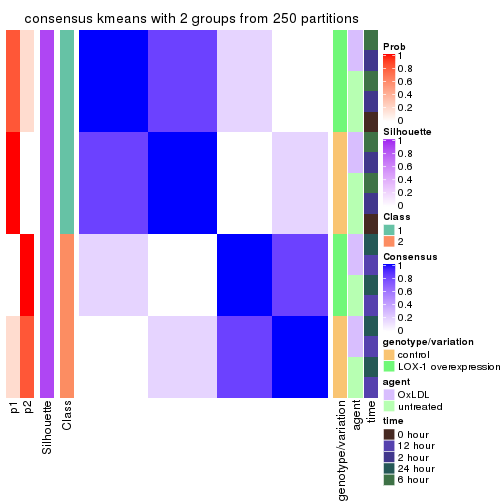</p>

</div>
<div id='tab-ATC-kmeans-consensus-heatmap-2'>
<pre><code class="r">consensus_heatmap(res, k = 3)
</code></pre>

<p>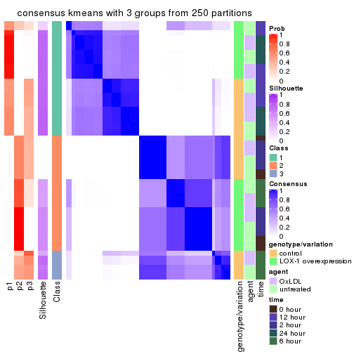</p>

</div>
<div id='tab-ATC-kmeans-consensus-heatmap-3'>
<pre><code class="r">consensus_heatmap(res, k = 4)
</code></pre>

<p>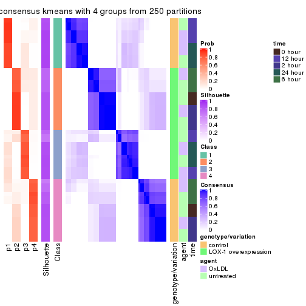</p>

</div>
<div id='tab-ATC-kmeans-consensus-heatmap-4'>
<pre><code class="r">consensus_heatmap(res, k = 5)
</code></pre>

<p>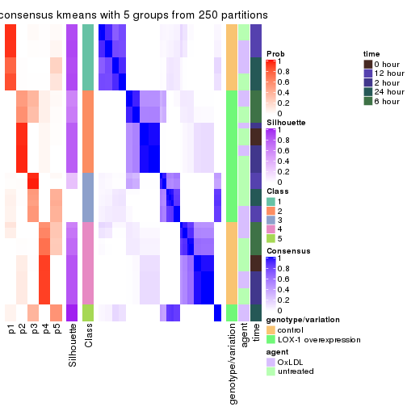</p>

</div>
<div id='tab-ATC-kmeans-consensus-heatmap-5'>
<pre><code class="r">consensus_heatmap(res, k = 6)
</code></pre>

<p>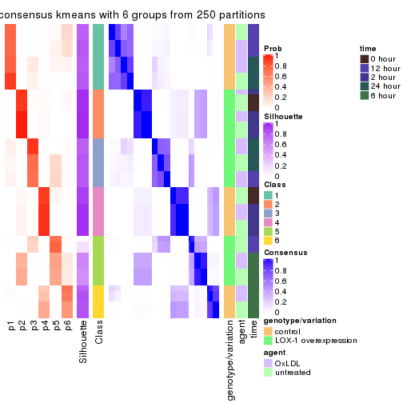</p>

</div>
</div>

Heatmaps for the membership of samples in all partitions to see how consistent they are:


<script>
$( function() {
	$( '#tabs-ATC-kmeans-membership-heatmap' ).tabs();
} );
</script>
<div id='tabs-ATC-kmeans-membership-heatmap'>
<ul>
<li><a href='#tab-ATC-kmeans-membership-heatmap-1'>k = 2</a></li>
<li><a href='#tab-ATC-kmeans-membership-heatmap-2'>k = 3</a></li>
<li><a href='#tab-ATC-kmeans-membership-heatmap-3'>k = 4</a></li>
<li><a href='#tab-ATC-kmeans-membership-heatmap-4'>k = 5</a></li>
<li><a href='#tab-ATC-kmeans-membership-heatmap-5'>k = 6</a></li>
</ul>
<div id='tab-ATC-kmeans-membership-heatmap-1'>
<pre><code class="r">membership_heatmap(res, k = 2)
</code></pre>

<p>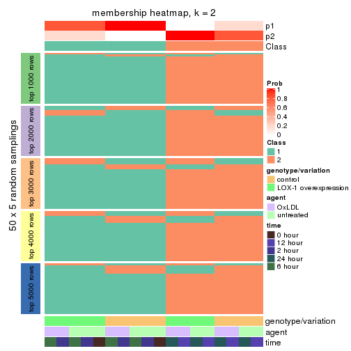</p>

</div>
<div id='tab-ATC-kmeans-membership-heatmap-2'>
<pre><code class="r">membership_heatmap(res, k = 3)
</code></pre>

<p>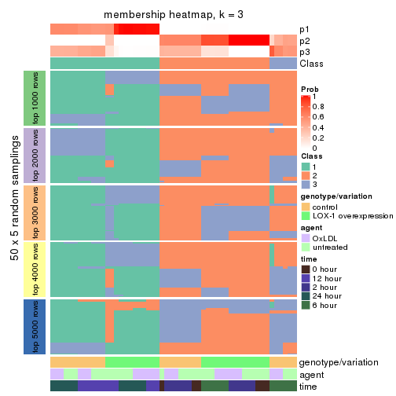</p>

</div>
<div id='tab-ATC-kmeans-membership-heatmap-3'>
<pre><code class="r">membership_heatmap(res, k = 4)
</code></pre>

<p>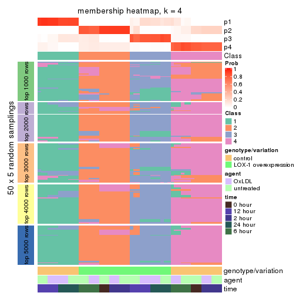</p>

</div>
<div id='tab-ATC-kmeans-membership-heatmap-4'>
<pre><code class="r">membership_heatmap(res, k = 5)
</code></pre>

<p>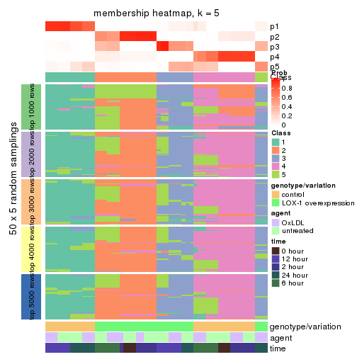</p>

</div>
<div id='tab-ATC-kmeans-membership-heatmap-5'>
<pre><code class="r">membership_heatmap(res, k = 6)
</code></pre>

<p>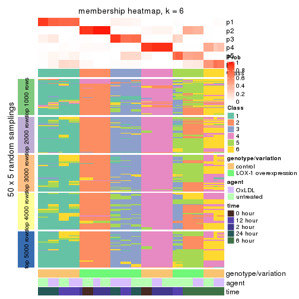</p>

</div>
</div>

As soon as we have had the classes for columns, we can look for signatures
which are significantly different between classes which can be candidate marks
for certain classes. Following are the heatmaps for signatures.


Signature heatmaps where rows are scaled:


<script>
$( function() {
	$( '#tabs-ATC-kmeans-get-signatures' ).tabs();
} );
</script>
<div id='tabs-ATC-kmeans-get-signatures'>
<ul>
<li><a href='#tab-ATC-kmeans-get-signatures-1'>k = 2</a></li>
<li><a href='#tab-ATC-kmeans-get-signatures-2'>k = 3</a></li>
<li><a href='#tab-ATC-kmeans-get-signatures-3'>k = 4</a></li>
<li><a href='#tab-ATC-kmeans-get-signatures-4'>k = 5</a></li>
<li><a href='#tab-ATC-kmeans-get-signatures-5'>k = 6</a></li>
</ul>
<div id='tab-ATC-kmeans-get-signatures-1'>
<pre><code class="r">get_signatures(res, k = 2)
</code></pre>

<p>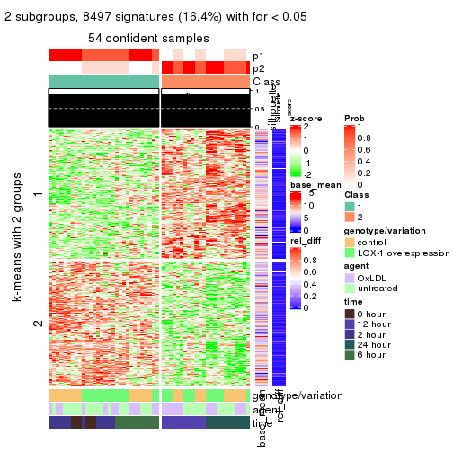</p>

</div>
<div id='tab-ATC-kmeans-get-signatures-2'>
<pre><code class="r">get_signatures(res, k = 3)
</code></pre>

<p>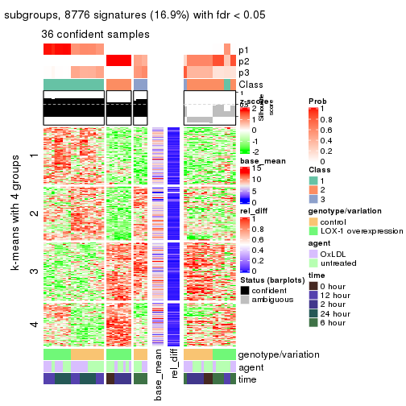</p>

</div>
<div id='tab-ATC-kmeans-get-signatures-3'>
<pre><code class="r">get_signatures(res, k = 4)
</code></pre>

<p>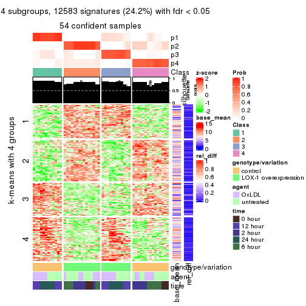</p>

</div>
<div id='tab-ATC-kmeans-get-signatures-4'>
<pre><code class="r">get_signatures(res, k = 5)
</code></pre>

<p>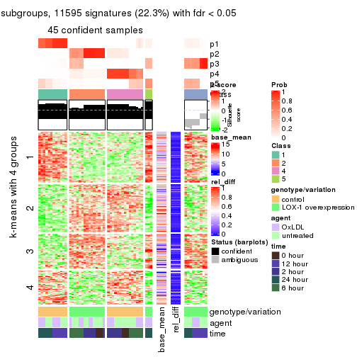</p>

</div>
<div id='tab-ATC-kmeans-get-signatures-5'>
<pre><code class="r">get_signatures(res, k = 6)
</code></pre>

<p>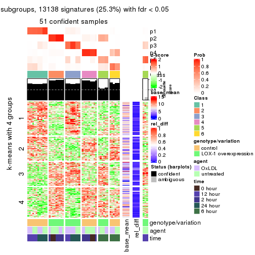</p>

</div>
</div>


Signature heatmaps where rows are not scaled:


<script>
$( function() {
	$( '#tabs-ATC-kmeans-get-signatures-no-scale' ).tabs();
} );
</script>
<div id='tabs-ATC-kmeans-get-signatures-no-scale'>
<ul>
<li><a href='#tab-ATC-kmeans-get-signatures-no-scale-1'>k = 2</a></li>
<li><a href='#tab-ATC-kmeans-get-signatures-no-scale-2'>k = 3</a></li>
<li><a href='#tab-ATC-kmeans-get-signatures-no-scale-3'>k = 4</a></li>
<li><a href='#tab-ATC-kmeans-get-signatures-no-scale-4'>k = 5</a></li>
<li><a href='#tab-ATC-kmeans-get-signatures-no-scale-5'>k = 6</a></li>
</ul>
<div id='tab-ATC-kmeans-get-signatures-no-scale-1'>
<pre><code class="r">get_signatures(res, k = 2, scale_rows = FALSE)
</code></pre>

<p>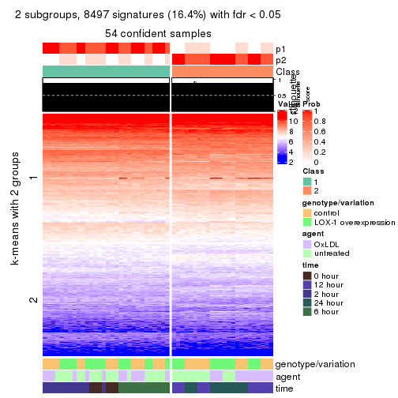</p>

</div>
<div id='tab-ATC-kmeans-get-signatures-no-scale-2'>
<pre><code class="r">get_signatures(res, k = 3, scale_rows = FALSE)
</code></pre>

<p>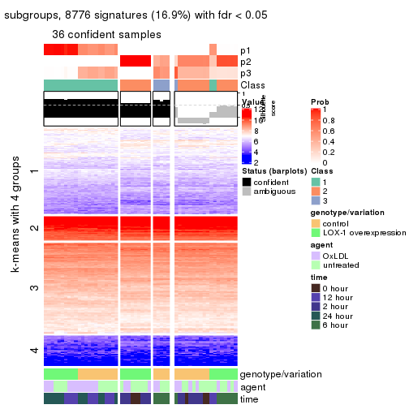</p>

</div>
<div id='tab-ATC-kmeans-get-signatures-no-scale-3'>
<pre><code class="r">get_signatures(res, k = 4, scale_rows = FALSE)
</code></pre>

<p>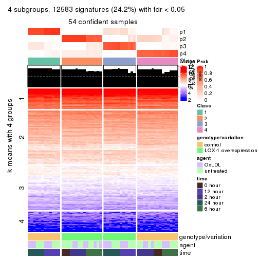</p>

</div>
<div id='tab-ATC-kmeans-get-signatures-no-scale-4'>
<pre><code class="r">get_signatures(res, k = 5, scale_rows = FALSE)
</code></pre>

<p>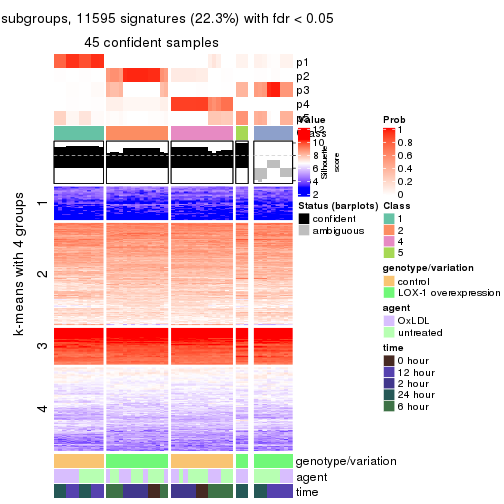</p>

</div>
<div id='tab-ATC-kmeans-get-signatures-no-scale-5'>
<pre><code class="r">get_signatures(res, k = 6, scale_rows = FALSE)
</code></pre>

<p>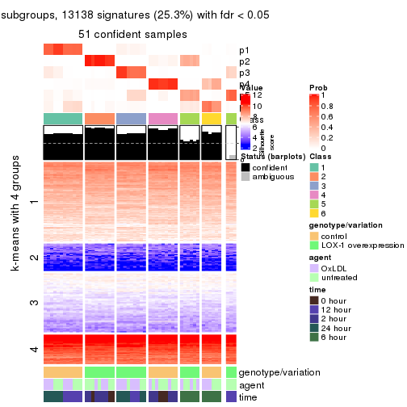</p>

</div>
</div>


Compare the overlap of signatures from different k:

```r
compare_signatures(res)
```

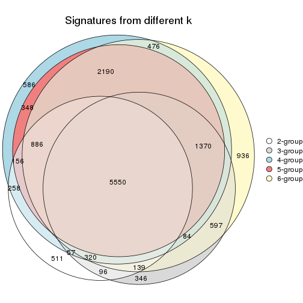

`get_signature()` returns a data frame invisibly. TO get the list of signatures, the function
call should be assigned to a variable explicitly. In following code, if `plot` argument is set
to `FALSE`, no heatmap is plotted while only the differential analysis is performed.

```r
# code only for demonstration
tb = get_signature(res, k = ..., plot = FALSE)
```

An example of the output of `tb` is:

```
#>   which_row         fdr    mean_1    mean_2 scaled_mean_1 scaled_mean_2 km
#> 1        38 0.042760348  8.373488  9.131774    -0.5533452     0.5164555  1
#> 2        40 0.018707592  7.106213  8.469186    -0.6173731     0.5762149  1
#> 3        55 0.019134737 10.221463 11.207825    -0.6159697     0.5749050  1
#> 4        59 0.006059896  5.921854  7.869574    -0.6899429     0.6439467  1
#> 5        60 0.018055526  8.928898 10.211722    -0.6204761     0.5791110  1
#> 6        98 0.009384629 15.714769 14.887706     0.6635654    -0.6193277  2
...
```

The columns in `tb` are:

1. `which_row`: row indices corresponding to the input matrix.
2. `fdr`: FDR for the differential test. 
3. `mean_x`: The mean value in group x.
4. `scaled_mean_x`: The mean value in group x after rows are scaled.
5. `km`: Row groups if k-means clustering is applied to rows.


UMAP plot which shows how samples are separated.


<script>
$( function() {
	$( '#tabs-ATC-kmeans-dimension-reduction' ).tabs();
} );
</script>
<div id='tabs-ATC-kmeans-dimension-reduction'>
<ul>
<li><a href='#tab-ATC-kmeans-dimension-reduction-1'>k = 2</a></li>
<li><a href='#tab-ATC-kmeans-dimension-reduction-2'>k = 3</a></li>
<li><a href='#tab-ATC-kmeans-dimension-reduction-3'>k = 4</a></li>
<li><a href='#tab-ATC-kmeans-dimension-reduction-4'>k = 5</a></li>
<li><a href='#tab-ATC-kmeans-dimension-reduction-5'>k = 6</a></li>
</ul>
<div id='tab-ATC-kmeans-dimension-reduction-1'>
<pre><code class="r">dimension_reduction(res, k = 2, method = &quot;UMAP&quot;)
</code></pre>

<p>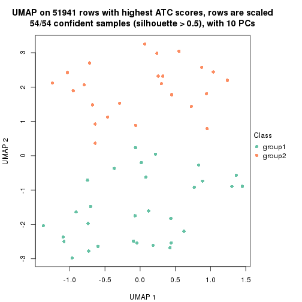</p>

</div>
<div id='tab-ATC-kmeans-dimension-reduction-2'>
<pre><code class="r">dimension_reduction(res, k = 3, method = &quot;UMAP&quot;)
</code></pre>

<p>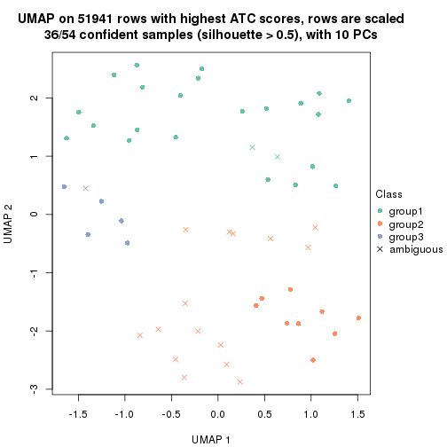</p>

</div>
<div id='tab-ATC-kmeans-dimension-reduction-3'>
<pre><code class="r">dimension_reduction(res, k = 4, method = &quot;UMAP&quot;)
</code></pre>

<p>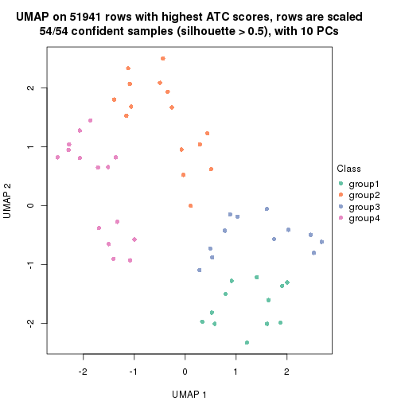</p>

</div>
<div id='tab-ATC-kmeans-dimension-reduction-4'>
<pre><code class="r">dimension_reduction(res, k = 5, method = &quot;UMAP&quot;)
</code></pre>

<p>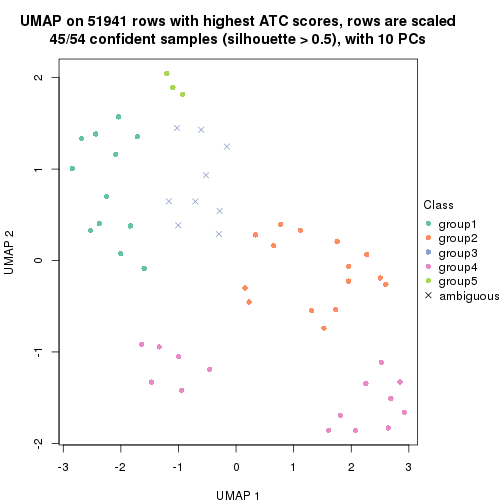</p>

</div>
<div id='tab-ATC-kmeans-dimension-reduction-5'>
<pre><code class="r">dimension_reduction(res, k = 6, method = &quot;UMAP&quot;)
</code></pre>

<p>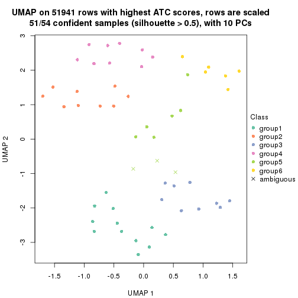</p>

</div>
</div>


Following heatmap shows how subgroups are split when increasing `k`:

```r
collect_classes(res)
```

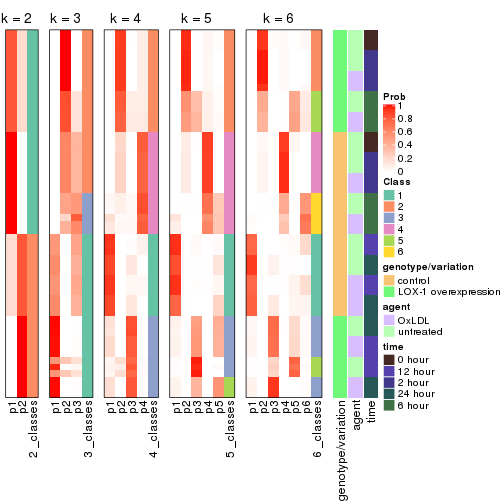


Test correlation between subgroups and known annotations. If the known
annotation is numeric, one-way ANOVA test is applied, and if the known
annotation is discrete, chi-squared contingency table test is applied.

```r
test_to_known_factors(res)
```

```
#>             n genotype/variation(p) agent(p)  time(p) k
#> ATC:kmeans 54              1.00e+00    0.646 5.26e-11 2
#> ATC:kmeans 36              8.61e-04    0.529 1.96e-12 3
#> ATC:kmeans 54              1.12e-11    0.910 2.73e-07 4
#> ATC:kmeans 45              9.25e-10    0.260 5.05e-07 5
#> ATC:kmeans 51              8.65e-10    0.726 3.07e-13 6
```


If matrix rows can be associated to genes, consider to use `functional_enrichment(res,
...)` to perform function enrichment for the signature genes. See [this vignette](http://bioconductor.org/packages/devel/bioc/vignettes/cola/inst/doc/functional_enrichment.html) for more detailed explanations.


 

---------------------------------------------------


### ATC:skmeans*


The object with results only for a single top-value method and a single partition method 
can be extracted as:

```r
res = res_list["ATC", "skmeans"]
# you can also extract it by
# res = res_list["ATC:skmeans"]
```

A summary of `res` and all the functions that can be applied to it:

```r
res
```

```
#> A 'ConsensusPartition' object with k = 2, 3, 4, 5, 6.
#>   On a matrix with 51941 rows and 54 columns.
#>   Top rows (1000, 2000, 3000, 4000, 5000) are extracted by 'ATC' method.
#>   Subgroups are detected by 'skmeans' method.
#>   Performed in total 1250 partitions by row resampling.
#>   Best k for subgroups seems to be 6.
#> 
#> Following methods can be applied to this 'ConsensusPartition' object:
#>  [1] "cola_report"             "collect_classes"         "collect_plots"          
#>  [4] "collect_stats"           "colnames"                "compare_signatures"     
#>  [7] "consensus_heatmap"       "dimension_reduction"     "functional_enrichment"  
#> [10] "get_anno_col"            "get_anno"                "get_classes"            
#> [13] "get_consensus"           "get_matrix"              "get_membership"         
#> [16] "get_param"               "get_signatures"          "get_stats"              
#> [19] "is_best_k"               "is_stable_k"             "membership_heatmap"     
#> [22] "ncol"                    "nrow"                    "plot_ecdf"              
#> [25] "rownames"                "select_partition_number" "show"                   
#> [28] "suggest_best_k"          "test_to_known_factors"
```

`collect_plots()` function collects all the plots made from `res` for all `k` (number of partitions)
into one single page to provide an easy and fast comparison between different `k`.

```r
collect_plots(res)
```

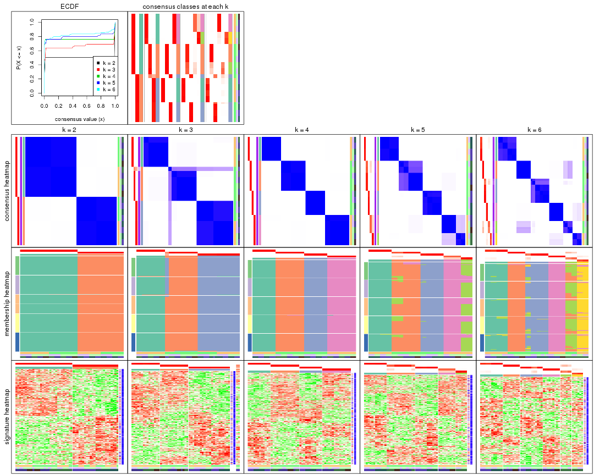

The plots are:

- The first row: a plot of the ECDF (empirical cumulative distribution
  function) curves of the consensus matrix for each `k` and the heatmap of
  predicted classes for each `k`.
- The second row: heatmaps of the consensus matrix for each `k`.
- The third row: heatmaps of the membership matrix for each `k`.
- The fouth row: heatmaps of the signatures for each `k`.

All the plots in panels can be made by individual functions and they are
plotted later in this section.

`select_partition_number()` produces several plots showing different
statistics for choosing "optimized" `k`. There are following statistics:

- ECDF curves of the consensus matrix for each `k`;
- 1-PAC. [The PAC
  score](https://en.wikipedia.org/wiki/Consensus_clustering#Over-interpretation_potential_of_consensus_clustering)
  measures the proportion of the ambiguous subgrouping.
- Mean silhouette score.
- Concordance. The mean probability of fiting the consensus class ids in all
  partitions.
- Area increased. Denote $A_k$ as the area under the ECDF curve for current
  `k`, the area increased is defined as $A_k - A_{k-1}$.
- Rand index. The percent of pairs of samples that are both in a same cluster
  or both are not in a same cluster in the partition of k and k-1.
- Jaccard index. The ratio of pairs of samples are both in a same cluster in
  the partition of k and k-1 and the pairs of samples are both in a same
  cluster in the partition k or k-1.

The detailed explanations of these statistics can be found in [the _cola_
vignette](http://bioconductor.org/packages/devel/bioc/vignettes/cola/inst/doc/cola.html#toc_13).

Generally speaking, lower PAC score, higher mean silhouette score or higher
concordance corresponds to better partition. Rand index and Jaccard index
measure how similar the current partition is compared to partition with `k-1`.
If they are too similar, we won't accept `k` is better than `k-1`.

```r
select_partition_number(res)
```

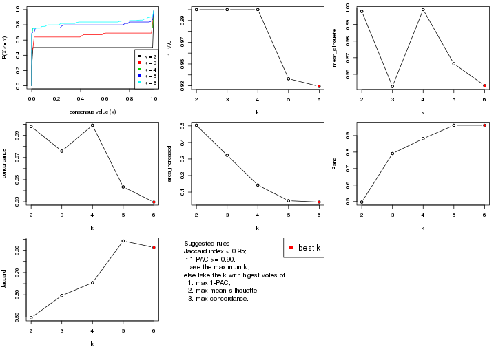

The numeric values for all these statistics can be obtained by `get_stats()`.

```r
get_stats(res)
```

```
#>   k 1-PAC mean_silhouette concordance area_increased  Rand Jaccard
#> 2 2 1.000           0.998       0.998         0.5037 0.497   0.497
#> 3 3 1.000           0.953       0.976         0.3227 0.791   0.596
#> 4 4 1.000           0.999       0.999         0.1425 0.881   0.654
#> 5 5 0.936           0.966       0.943         0.0479 0.962   0.842
#> 6 6 0.929           0.953       0.930         0.0397 0.962   0.812
```

`suggest_best_k()` suggests the best $k$ based on these statistics. The rules are as follows:

- All $k$ with Jaccard index larger than 0.95 are removed because increasing
  $k$ does not provide enough extra information. If all $k$ are removed, it is
  marked as no subgroup is detected.
- For all $k$ with 1-PAC score larger than 0.9, the maximal $k$ is taken as
  the best $k$, and other $k$ are marked as optional $k$.
- If it does not fit the second rule. The $k$ with the maximal vote of the
  highest 1-PAC score, highest mean silhouette, and highest concordance is
  taken as the best $k$.

```r
suggest_best_k(res)
```

```
#> [1] 6
#> attr(,"optional")
#> [1] 2 3 4 5
```

There is also optional best $k$ = 2 3 4 5 that is worth to check.

Following shows the table of the partitions (You need to click the **show/hide
code output** link to see it). The membership matrix (columns with name `p*`)
is inferred by
[`clue::cl_consensus()`](https://www.rdocumentation.org/link/cl_consensus?package=clue)
function with the `SE` method. Basically the value in the membership matrix
represents the probability to belong to a certain group. The finall class
label for an item is determined with the group with highest probability it
belongs to.

In `get_classes()` function, the entropy is calculated from the membership
matrix and the silhouette score is calculated from the consensus matrix.


<script>
$( function() {
	$( '#tabs-ATC-skmeans-get-classes' ).tabs();
} );
</script>
<div id='tabs-ATC-skmeans-get-classes'>
<ul>
<li><a href='#tab-ATC-skmeans-get-classes-1'>k = 2</a></li>
<li><a href='#tab-ATC-skmeans-get-classes-2'>k = 3</a></li>
<li><a href='#tab-ATC-skmeans-get-classes-3'>k = 4</a></li>
<li><a href='#tab-ATC-skmeans-get-classes-4'>k = 5</a></li>
<li><a href='#tab-ATC-skmeans-get-classes-5'>k = 6</a></li>
</ul>

<div id='tab-ATC-skmeans-get-classes-1'>
<p><a id='tab-ATC-skmeans-get-classes-1-a' style='color:#0366d6' href='#'>show/hide code output</a></p>
<pre><code class="r">cbind(get_classes(res, k = 2), get_membership(res, k = 2))
</code></pre>

<pre><code>#&gt;           class entropy silhouette    p1    p2
#&gt; GSM329068     1  0.0000      0.998 1.000 0.000
#&gt; GSM329074     1  0.0000      0.998 1.000 0.000
#&gt; GSM329100     1  0.0000      0.998 1.000 0.000
#&gt; GSM329062     1  0.0000      0.998 1.000 0.000
#&gt; GSM329079     1  0.0000      0.998 1.000 0.000
#&gt; GSM329090     1  0.0000      0.998 1.000 0.000
#&gt; GSM329066     1  0.0000      0.998 1.000 0.000
#&gt; GSM329086     1  0.0000      0.998 1.000 0.000
#&gt; GSM329099     1  0.0000      0.998 1.000 0.000
#&gt; GSM329071     2  0.0376      0.998 0.004 0.996
#&gt; GSM329078     2  0.0376      0.998 0.004 0.996
#&gt; GSM329081     2  0.0376      0.998 0.004 0.996
#&gt; GSM329096     2  0.0376      0.998 0.004 0.996
#&gt; GSM329102     2  0.0376      0.998 0.004 0.996
#&gt; GSM329104     2  0.0376      0.998 0.004 0.996
#&gt; GSM329067     1  0.0000      0.998 1.000 0.000
#&gt; GSM329072     1  0.0000      0.998 1.000 0.000
#&gt; GSM329075     1  0.0000      0.998 1.000 0.000
#&gt; GSM329058     1  0.0000      0.998 1.000 0.000
#&gt; GSM329073     1  0.0000      0.998 1.000 0.000
#&gt; GSM329107     1  0.0000      0.998 1.000 0.000
#&gt; GSM329057     2  0.0376      0.998 0.004 0.996
#&gt; GSM329085     2  0.0376      0.998 0.004 0.996
#&gt; GSM329089     2  0.0376      0.998 0.004 0.996
#&gt; GSM329076     2  0.0376      0.998 0.004 0.996
#&gt; GSM329094     2  0.0376      0.998 0.004 0.996
#&gt; GSM329105     2  0.0376      0.998 0.004 0.996
#&gt; GSM329056     1  0.0376      0.998 0.996 0.004
#&gt; GSM329069     1  0.0376      0.998 0.996 0.004
#&gt; GSM329077     1  0.0376      0.998 0.996 0.004
#&gt; GSM329070     1  0.0376      0.998 0.996 0.004
#&gt; GSM329082     1  0.0376      0.998 0.996 0.004
#&gt; GSM329092     1  0.0376      0.998 0.996 0.004
#&gt; GSM329083     1  0.0376      0.998 0.996 0.004
#&gt; GSM329101     1  0.0376      0.998 0.996 0.004
#&gt; GSM329106     1  0.0376      0.998 0.996 0.004
#&gt; GSM329087     2  0.0000      0.998 0.000 1.000
#&gt; GSM329091     2  0.0000      0.998 0.000 1.000
#&gt; GSM329093     2  0.0000      0.998 0.000 1.000
#&gt; GSM329080     2  0.0000      0.998 0.000 1.000
#&gt; GSM329084     2  0.0000      0.998 0.000 1.000
#&gt; GSM329088     2  0.0000      0.998 0.000 1.000
#&gt; GSM329059     1  0.0376      0.998 0.996 0.004
#&gt; GSM329097     1  0.0376      0.998 0.996 0.004
#&gt; GSM329098     1  0.0376      0.998 0.996 0.004
#&gt; GSM329055     1  0.0376      0.998 0.996 0.004
#&gt; GSM329103     1  0.0376      0.998 0.996 0.004
#&gt; GSM329108     1  0.0376      0.998 0.996 0.004
#&gt; GSM329061     2  0.0000      0.998 0.000 1.000
#&gt; GSM329064     2  0.0000      0.998 0.000 1.000
#&gt; GSM329065     2  0.0000      0.998 0.000 1.000
#&gt; GSM329060     2  0.0000      0.998 0.000 1.000
#&gt; GSM329063     2  0.0000      0.998 0.000 1.000
#&gt; GSM329095     2  0.0000      0.998 0.000 1.000
</code></pre>

<script>
$('#tab-ATC-skmeans-get-classes-1-a').parent().next().next().hide();
$('#tab-ATC-skmeans-get-classes-1-a').click(function(){
  $('#tab-ATC-skmeans-get-classes-1-a').parent().next().next().toggle();
  return(false);
});
</script>
</div>

<div id='tab-ATC-skmeans-get-classes-2'>
<p><a id='tab-ATC-skmeans-get-classes-2-a' style='color:#0366d6' href='#'>show/hide code output</a></p>
<pre><code class="r">cbind(get_classes(res, k = 3), get_membership(res, k = 3))
</code></pre>

<pre><code>#&gt;           class entropy silhouette    p1    p2    p3
#&gt; GSM329068     2  0.0747      0.939 0.016 0.984 0.000
#&gt; GSM329074     2  0.0747      0.939 0.016 0.984 0.000
#&gt; GSM329100     2  0.0747      0.939 0.016 0.984 0.000
#&gt; GSM329062     2  0.0747      0.939 0.016 0.984 0.000
#&gt; GSM329079     2  0.0747      0.939 0.016 0.984 0.000
#&gt; GSM329090     2  0.0747      0.939 0.016 0.984 0.000
#&gt; GSM329066     2  0.0747      0.939 0.016 0.984 0.000
#&gt; GSM329086     2  0.0747      0.939 0.016 0.984 0.000
#&gt; GSM329099     2  0.0747      0.939 0.016 0.984 0.000
#&gt; GSM329071     2  0.6126      0.349 0.000 0.600 0.400
#&gt; GSM329078     3  0.0747      0.990 0.000 0.016 0.984
#&gt; GSM329081     2  0.6126      0.349 0.000 0.600 0.400
#&gt; GSM329096     3  0.0747      0.990 0.000 0.016 0.984
#&gt; GSM329102     3  0.0747      0.990 0.000 0.016 0.984
#&gt; GSM329104     3  0.0747      0.990 0.000 0.016 0.984
#&gt; GSM329067     2  0.0747      0.939 0.016 0.984 0.000
#&gt; GSM329072     2  0.0747      0.939 0.016 0.984 0.000
#&gt; GSM329075     2  0.0747      0.939 0.016 0.984 0.000
#&gt; GSM329058     2  0.0237      0.932 0.004 0.996 0.000
#&gt; GSM329073     2  0.0237      0.932 0.004 0.996 0.000
#&gt; GSM329107     2  0.0237      0.932 0.004 0.996 0.000
#&gt; GSM329057     3  0.0747      0.990 0.000 0.016 0.984
#&gt; GSM329085     3  0.0747      0.990 0.000 0.016 0.984
#&gt; GSM329089     3  0.0747      0.990 0.000 0.016 0.984
#&gt; GSM329076     3  0.0747      0.990 0.000 0.016 0.984
#&gt; GSM329094     3  0.0747      0.990 0.000 0.016 0.984
#&gt; GSM329105     3  0.0747      0.990 0.000 0.016 0.984
#&gt; GSM329056     1  0.0237      0.996 0.996 0.004 0.000
#&gt; GSM329069     1  0.0237      0.996 0.996 0.004 0.000
#&gt; GSM329077     1  0.0237      0.996 0.996 0.004 0.000
#&gt; GSM329070     1  0.0237      0.996 0.996 0.004 0.000
#&gt; GSM329082     1  0.0237      0.996 0.996 0.004 0.000
#&gt; GSM329092     1  0.0237      0.996 0.996 0.004 0.000
#&gt; GSM329083     1  0.0237      0.996 0.996 0.004 0.000
#&gt; GSM329101     1  0.0237      0.996 0.996 0.004 0.000
#&gt; GSM329106     1  0.0237      0.996 0.996 0.004 0.000
#&gt; GSM329087     3  0.0237      0.991 0.004 0.000 0.996
#&gt; GSM329091     3  0.0237      0.991 0.004 0.000 0.996
#&gt; GSM329093     3  0.0237      0.991 0.004 0.000 0.996
#&gt; GSM329080     3  0.0237      0.991 0.004 0.000 0.996
#&gt; GSM329084     3  0.0237      0.991 0.004 0.000 0.996
#&gt; GSM329088     3  0.0237      0.991 0.004 0.000 0.996
#&gt; GSM329059     1  0.0237      0.996 0.996 0.004 0.000
#&gt; GSM329097     1  0.0237      0.996 0.996 0.004 0.000
#&gt; GSM329098     1  0.0237      0.996 0.996 0.004 0.000
#&gt; GSM329055     1  0.0747      0.980 0.984 0.000 0.016
#&gt; GSM329103     1  0.0592      0.984 0.988 0.000 0.012
#&gt; GSM329108     1  0.0592      0.984 0.988 0.000 0.012
#&gt; GSM329061     3  0.0237      0.991 0.004 0.000 0.996
#&gt; GSM329064     3  0.0237      0.991 0.004 0.000 0.996
#&gt; GSM329065     3  0.0237      0.991 0.004 0.000 0.996
#&gt; GSM329060     3  0.0237      0.991 0.004 0.000 0.996
#&gt; GSM329063     3  0.0237      0.991 0.004 0.000 0.996
#&gt; GSM329095     3  0.0237      0.991 0.004 0.000 0.996
</code></pre>

<script>
$('#tab-ATC-skmeans-get-classes-2-a').parent().next().next().hide();
$('#tab-ATC-skmeans-get-classes-2-a').click(function(){
  $('#tab-ATC-skmeans-get-classes-2-a').parent().next().next().toggle();
  return(false);
});
</script>
</div>

<div id='tab-ATC-skmeans-get-classes-3'>
<p><a id='tab-ATC-skmeans-get-classes-3-a' style='color:#0366d6' href='#'>show/hide code output</a></p>
<pre><code class="r">cbind(get_classes(res, k = 4), get_membership(res, k = 4))
</code></pre>

<pre><code>#&gt;           class entropy silhouette    p1    p2 p3    p4
#&gt; GSM329068     2  0.0188      0.998 0.000 0.996  0 0.004
#&gt; GSM329074     2  0.0188      0.998 0.000 0.996  0 0.004
#&gt; GSM329100     2  0.0188      0.998 0.000 0.996  0 0.004
#&gt; GSM329062     2  0.0188      0.998 0.000 0.996  0 0.004
#&gt; GSM329079     2  0.0188      0.998 0.000 0.996  0 0.004
#&gt; GSM329090     2  0.0188      0.998 0.000 0.996  0 0.004
#&gt; GSM329066     2  0.0000      0.997 0.000 1.000  0 0.000
#&gt; GSM329086     2  0.0000      0.997 0.000 1.000  0 0.000
#&gt; GSM329099     2  0.0000      0.997 0.000 1.000  0 0.000
#&gt; GSM329071     3  0.0000      1.000 0.000 0.000  1 0.000
#&gt; GSM329078     3  0.0000      1.000 0.000 0.000  1 0.000
#&gt; GSM329081     3  0.0000      1.000 0.000 0.000  1 0.000
#&gt; GSM329096     3  0.0000      1.000 0.000 0.000  1 0.000
#&gt; GSM329102     3  0.0000      1.000 0.000 0.000  1 0.000
#&gt; GSM329104     3  0.0000      1.000 0.000 0.000  1 0.000
#&gt; GSM329067     2  0.0188      0.998 0.000 0.996  0 0.004
#&gt; GSM329072     2  0.0188      0.998 0.000 0.996  0 0.004
#&gt; GSM329075     2  0.0188      0.998 0.000 0.996  0 0.004
#&gt; GSM329058     2  0.0000      0.997 0.000 1.000  0 0.000
#&gt; GSM329073     2  0.0000      0.997 0.000 1.000  0 0.000
#&gt; GSM329107     2  0.0000      0.997 0.000 1.000  0 0.000
#&gt; GSM329057     3  0.0000      1.000 0.000 0.000  1 0.000
#&gt; GSM329085     3  0.0000      1.000 0.000 0.000  1 0.000
#&gt; GSM329089     3  0.0000      1.000 0.000 0.000  1 0.000
#&gt; GSM329076     3  0.0000      1.000 0.000 0.000  1 0.000
#&gt; GSM329094     3  0.0000      1.000 0.000 0.000  1 0.000
#&gt; GSM329105     3  0.0000      1.000 0.000 0.000  1 0.000
#&gt; GSM329056     4  0.0000      0.999 0.000 0.000  0 1.000
#&gt; GSM329069     4  0.0000      0.999 0.000 0.000  0 1.000
#&gt; GSM329077     4  0.0000      0.999 0.000 0.000  0 1.000
#&gt; GSM329070     4  0.0000      0.999 0.000 0.000  0 1.000
#&gt; GSM329082     4  0.0000      0.999 0.000 0.000  0 1.000
#&gt; GSM329092     4  0.0000      0.999 0.000 0.000  0 1.000
#&gt; GSM329083     4  0.0000      0.999 0.000 0.000  0 1.000
#&gt; GSM329101     4  0.0000      0.999 0.000 0.000  0 1.000
#&gt; GSM329106     4  0.0000      0.999 0.000 0.000  0 1.000
#&gt; GSM329087     1  0.0000      1.000 1.000 0.000  0 0.000
#&gt; GSM329091     1  0.0000      1.000 1.000 0.000  0 0.000
#&gt; GSM329093     1  0.0000      1.000 1.000 0.000  0 0.000
#&gt; GSM329080     1  0.0000      1.000 1.000 0.000  0 0.000
#&gt; GSM329084     1  0.0000      1.000 1.000 0.000  0 0.000
#&gt; GSM329088     1  0.0000      1.000 1.000 0.000  0 0.000
#&gt; GSM329059     4  0.0000      0.999 0.000 0.000  0 1.000
#&gt; GSM329097     4  0.0000      0.999 0.000 0.000  0 1.000
#&gt; GSM329098     4  0.0000      0.999 0.000 0.000  0 1.000
#&gt; GSM329055     4  0.0188      0.996 0.004 0.000  0 0.996
#&gt; GSM329103     4  0.0188      0.996 0.004 0.000  0 0.996
#&gt; GSM329108     4  0.0188      0.996 0.004 0.000  0 0.996
#&gt; GSM329061     1  0.0000      1.000 1.000 0.000  0 0.000
#&gt; GSM329064     1  0.0000      1.000 1.000 0.000  0 0.000
#&gt; GSM329065     1  0.0000      1.000 1.000 0.000  0 0.000
#&gt; GSM329060     1  0.0000      1.000 1.000 0.000  0 0.000
#&gt; GSM329063     1  0.0000      1.000 1.000 0.000  0 0.000
#&gt; GSM329095     1  0.0000      1.000 1.000 0.000  0 0.000
</code></pre>

<script>
$('#tab-ATC-skmeans-get-classes-3-a').parent().next().next().hide();
$('#tab-ATC-skmeans-get-classes-3-a').click(function(){
  $('#tab-ATC-skmeans-get-classes-3-a').parent().next().next().toggle();
  return(false);
});
</script>
</div>

<div id='tab-ATC-skmeans-get-classes-4'>
<p><a id='tab-ATC-skmeans-get-classes-4-a' style='color:#0366d6' href='#'>show/hide code output</a></p>
<pre><code class="r">cbind(get_classes(res, k = 5), get_membership(res, k = 5))
</code></pre>

<pre><code>#&gt;           class entropy silhouette    p1    p2    p3    p4    p5
#&gt; GSM329068     2  0.0794      0.915 0.000 0.972 0.000 0.028 0.000
#&gt; GSM329074     2  0.0794      0.915 0.000 0.972 0.000 0.028 0.000
#&gt; GSM329100     2  0.0794      0.915 0.000 0.972 0.000 0.028 0.000
#&gt; GSM329062     2  0.0794      0.915 0.000 0.972 0.000 0.028 0.000
#&gt; GSM329079     2  0.0794      0.915 0.000 0.972 0.000 0.028 0.000
#&gt; GSM329090     2  0.0794      0.915 0.000 0.972 0.000 0.028 0.000
#&gt; GSM329066     2  0.2966      0.868 0.000 0.816 0.000 0.184 0.000
#&gt; GSM329086     2  0.2966      0.868 0.000 0.816 0.000 0.184 0.000
#&gt; GSM329099     2  0.2966      0.868 0.000 0.816 0.000 0.184 0.000
#&gt; GSM329071     3  0.0703      0.985 0.000 0.000 0.976 0.024 0.000
#&gt; GSM329078     3  0.0510      0.990 0.000 0.000 0.984 0.016 0.000
#&gt; GSM329081     3  0.0703      0.985 0.000 0.000 0.976 0.024 0.000
#&gt; GSM329096     3  0.0000      0.995 0.000 0.000 1.000 0.000 0.000
#&gt; GSM329102     3  0.0000      0.995 0.000 0.000 1.000 0.000 0.000
#&gt; GSM329104     3  0.0000      0.995 0.000 0.000 1.000 0.000 0.000
#&gt; GSM329067     2  0.0794      0.915 0.000 0.972 0.000 0.028 0.000
#&gt; GSM329072     2  0.0794      0.915 0.000 0.972 0.000 0.028 0.000
#&gt; GSM329075     2  0.0794      0.915 0.000 0.972 0.000 0.028 0.000
#&gt; GSM329058     2  0.3274      0.852 0.000 0.780 0.000 0.220 0.000
#&gt; GSM329073     2  0.3274      0.852 0.000 0.780 0.000 0.220 0.000
#&gt; GSM329107     2  0.3210      0.856 0.000 0.788 0.000 0.212 0.000
#&gt; GSM329057     3  0.0162      0.994 0.000 0.000 0.996 0.004 0.000
#&gt; GSM329085     3  0.0162      0.994 0.000 0.000 0.996 0.004 0.000
#&gt; GSM329089     3  0.0162      0.994 0.000 0.000 0.996 0.004 0.000
#&gt; GSM329076     3  0.0000      0.995 0.000 0.000 1.000 0.000 0.000
#&gt; GSM329094     3  0.0000      0.995 0.000 0.000 1.000 0.000 0.000
#&gt; GSM329105     3  0.0000      0.995 0.000 0.000 1.000 0.000 0.000
#&gt; GSM329056     4  0.3395      1.000 0.000 0.000 0.000 0.764 0.236
#&gt; GSM329069     4  0.3395      1.000 0.000 0.000 0.000 0.764 0.236
#&gt; GSM329077     4  0.3395      1.000 0.000 0.000 0.000 0.764 0.236
#&gt; GSM329070     4  0.3395      1.000 0.000 0.000 0.000 0.764 0.236
#&gt; GSM329082     4  0.3395      1.000 0.000 0.000 0.000 0.764 0.236
#&gt; GSM329092     4  0.3395      1.000 0.000 0.000 0.000 0.764 0.236
#&gt; GSM329083     5  0.0510      0.988 0.000 0.000 0.000 0.016 0.984
#&gt; GSM329101     5  0.0510      0.988 0.000 0.000 0.000 0.016 0.984
#&gt; GSM329106     5  0.0609      0.985 0.000 0.000 0.000 0.020 0.980
#&gt; GSM329087     1  0.0290      0.996 0.992 0.000 0.000 0.000 0.008
#&gt; GSM329091     1  0.0290      0.996 0.992 0.000 0.000 0.000 0.008
#&gt; GSM329093     1  0.0290      0.996 0.992 0.000 0.000 0.000 0.008
#&gt; GSM329080     1  0.0000      0.996 1.000 0.000 0.000 0.000 0.000
#&gt; GSM329084     1  0.0000      0.996 1.000 0.000 0.000 0.000 0.000
#&gt; GSM329088     1  0.0000      0.996 1.000 0.000 0.000 0.000 0.000
#&gt; GSM329059     4  0.3395      1.000 0.000 0.000 0.000 0.764 0.236
#&gt; GSM329097     4  0.3395      1.000 0.000 0.000 0.000 0.764 0.236
#&gt; GSM329098     4  0.3395      1.000 0.000 0.000 0.000 0.764 0.236
#&gt; GSM329055     5  0.0000      0.984 0.000 0.000 0.000 0.000 1.000
#&gt; GSM329103     5  0.0162      0.988 0.000 0.000 0.000 0.004 0.996
#&gt; GSM329108     5  0.0162      0.988 0.000 0.000 0.000 0.004 0.996
#&gt; GSM329061     1  0.0290      0.996 0.992 0.000 0.000 0.000 0.008
#&gt; GSM329064     1  0.0290      0.996 0.992 0.000 0.000 0.000 0.008
#&gt; GSM329065     1  0.0290      0.996 0.992 0.000 0.000 0.000 0.008
#&gt; GSM329060     1  0.0000      0.996 1.000 0.000 0.000 0.000 0.000
#&gt; GSM329063     1  0.0000      0.996 1.000 0.000 0.000 0.000 0.000
#&gt; GSM329095     1  0.0000      0.996 1.000 0.000 0.000 0.000 0.000
</code></pre>

<script>
$('#tab-ATC-skmeans-get-classes-4-a').parent().next().next().hide();
$('#tab-ATC-skmeans-get-classes-4-a').click(function(){
  $('#tab-ATC-skmeans-get-classes-4-a').parent().next().next().toggle();
  return(false);
});
</script>
</div>

<div id='tab-ATC-skmeans-get-classes-5'>
<p><a id='tab-ATC-skmeans-get-classes-5-a' style='color:#0366d6' href='#'>show/hide code output</a></p>
<pre><code class="r">cbind(get_classes(res, k = 6), get_membership(res, k = 6))
</code></pre>

<pre><code>#&gt;           class entropy silhouette    p1    p2    p3    p4    p5    p6
#&gt; GSM329068     2  0.0000      1.000 0.000 1.000 0.000 0.000 0.000 0.000
#&gt; GSM329074     2  0.0000      1.000 0.000 1.000 0.000 0.000 0.000 0.000
#&gt; GSM329100     2  0.0000      1.000 0.000 1.000 0.000 0.000 0.000 0.000
#&gt; GSM329062     2  0.0000      1.000 0.000 1.000 0.000 0.000 0.000 0.000
#&gt; GSM329079     2  0.0000      1.000 0.000 1.000 0.000 0.000 0.000 0.000
#&gt; GSM329090     2  0.0000      1.000 0.000 1.000 0.000 0.000 0.000 0.000
#&gt; GSM329066     5  0.3647      0.877 0.000 0.360 0.000 0.000 0.640 0.000
#&gt; GSM329086     5  0.3695      0.857 0.000 0.376 0.000 0.000 0.624 0.000
#&gt; GSM329099     5  0.3634      0.879 0.000 0.356 0.000 0.000 0.644 0.000
#&gt; GSM329071     3  0.4367      0.778 0.000 0.000 0.712 0.008 0.220 0.060
#&gt; GSM329078     3  0.3742      0.835 0.000 0.000 0.788 0.008 0.148 0.056
#&gt; GSM329081     3  0.4367      0.778 0.000 0.000 0.712 0.008 0.220 0.060
#&gt; GSM329096     3  0.0000      0.937 0.000 0.000 1.000 0.000 0.000 0.000
#&gt; GSM329102     3  0.0146      0.937 0.000 0.000 0.996 0.000 0.004 0.000
#&gt; GSM329104     3  0.0146      0.937 0.000 0.000 0.996 0.000 0.004 0.000
#&gt; GSM329067     2  0.0000      1.000 0.000 1.000 0.000 0.000 0.000 0.000
#&gt; GSM329072     2  0.0000      1.000 0.000 1.000 0.000 0.000 0.000 0.000
#&gt; GSM329075     2  0.0000      1.000 0.000 1.000 0.000 0.000 0.000 0.000
#&gt; GSM329058     5  0.3163      0.886 0.000 0.232 0.000 0.000 0.764 0.004
#&gt; GSM329073     5  0.3163      0.886 0.000 0.232 0.000 0.000 0.764 0.004
#&gt; GSM329107     5  0.3076      0.888 0.000 0.240 0.000 0.000 0.760 0.000
#&gt; GSM329057     3  0.0520      0.936 0.000 0.000 0.984 0.000 0.008 0.008
#&gt; GSM329085     3  0.0520      0.936 0.000 0.000 0.984 0.000 0.008 0.008
#&gt; GSM329089     3  0.0520      0.936 0.000 0.000 0.984 0.000 0.008 0.008
#&gt; GSM329076     3  0.0000      0.937 0.000 0.000 1.000 0.000 0.000 0.000
#&gt; GSM329094     3  0.0000      0.937 0.000 0.000 1.000 0.000 0.000 0.000
#&gt; GSM329105     3  0.0000      0.937 0.000 0.000 1.000 0.000 0.000 0.000
#&gt; GSM329056     4  0.0260      1.000 0.000 0.008 0.000 0.992 0.000 0.000
#&gt; GSM329069     4  0.0260      1.000 0.000 0.008 0.000 0.992 0.000 0.000
#&gt; GSM329077     4  0.0260      1.000 0.000 0.008 0.000 0.992 0.000 0.000
#&gt; GSM329070     4  0.0260      1.000 0.000 0.008 0.000 0.992 0.000 0.000
#&gt; GSM329082     4  0.0260      1.000 0.000 0.008 0.000 0.992 0.000 0.000
#&gt; GSM329092     4  0.0260      1.000 0.000 0.008 0.000 0.992 0.000 0.000
#&gt; GSM329083     6  0.2450      0.966 0.000 0.000 0.000 0.116 0.016 0.868
#&gt; GSM329101     6  0.2450      0.966 0.000 0.000 0.000 0.116 0.016 0.868
#&gt; GSM329106     6  0.2538      0.960 0.000 0.000 0.000 0.124 0.016 0.860
#&gt; GSM329087     1  0.1926      0.958 0.912 0.000 0.000 0.000 0.068 0.020
#&gt; GSM329091     1  0.1926      0.958 0.912 0.000 0.000 0.000 0.068 0.020
#&gt; GSM329093     1  0.1926      0.958 0.912 0.000 0.000 0.000 0.068 0.020
#&gt; GSM329080     1  0.0146      0.969 0.996 0.000 0.000 0.000 0.000 0.004
#&gt; GSM329084     1  0.0146      0.969 0.996 0.000 0.000 0.000 0.000 0.004
#&gt; GSM329088     1  0.0146      0.969 0.996 0.000 0.000 0.000 0.000 0.004
#&gt; GSM329059     4  0.0260      1.000 0.000 0.008 0.000 0.992 0.000 0.000
#&gt; GSM329097     4  0.0260      1.000 0.000 0.008 0.000 0.992 0.000 0.000
#&gt; GSM329098     4  0.0260      1.000 0.000 0.008 0.000 0.992 0.000 0.000
#&gt; GSM329055     6  0.1501      0.967 0.000 0.000 0.000 0.076 0.000 0.924
#&gt; GSM329103     6  0.1501      0.967 0.000 0.000 0.000 0.076 0.000 0.924
#&gt; GSM329108     6  0.1501      0.967 0.000 0.000 0.000 0.076 0.000 0.924
#&gt; GSM329061     1  0.1367      0.967 0.944 0.000 0.000 0.000 0.044 0.012
#&gt; GSM329064     1  0.1367      0.967 0.944 0.000 0.000 0.000 0.044 0.012
#&gt; GSM329065     1  0.1367      0.967 0.944 0.000 0.000 0.000 0.044 0.012
#&gt; GSM329060     1  0.0000      0.969 1.000 0.000 0.000 0.000 0.000 0.000
#&gt; GSM329063     1  0.0000      0.969 1.000 0.000 0.000 0.000 0.000 0.000
#&gt; GSM329095     1  0.0000      0.969 1.000 0.000 0.000 0.000 0.000 0.000
</code></pre>

<script>
$('#tab-ATC-skmeans-get-classes-5-a').parent().next().next().hide();
$('#tab-ATC-skmeans-get-classes-5-a').click(function(){
  $('#tab-ATC-skmeans-get-classes-5-a').parent().next().next().toggle();
  return(false);
});
</script>
</div>
</div>

Heatmaps for the consensus matrix. It visualizes the probability of two
samples to be in a same group.


<script>
$( function() {
	$( '#tabs-ATC-skmeans-consensus-heatmap' ).tabs();
} );
</script>
<div id='tabs-ATC-skmeans-consensus-heatmap'>
<ul>
<li><a href='#tab-ATC-skmeans-consensus-heatmap-1'>k = 2</a></li>
<li><a href='#tab-ATC-skmeans-consensus-heatmap-2'>k = 3</a></li>
<li><a href='#tab-ATC-skmeans-consensus-heatmap-3'>k = 4</a></li>
<li><a href='#tab-ATC-skmeans-consensus-heatmap-4'>k = 5</a></li>
<li><a href='#tab-ATC-skmeans-consensus-heatmap-5'>k = 6</a></li>
</ul>
<div id='tab-ATC-skmeans-consensus-heatmap-1'>
<pre><code class="r">consensus_heatmap(res, k = 2)
</code></pre>

<p>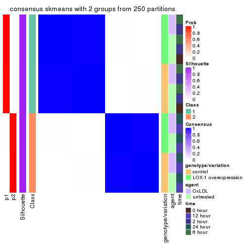</p>

</div>
<div id='tab-ATC-skmeans-consensus-heatmap-2'>
<pre><code class="r">consensus_heatmap(res, k = 3)
</code></pre>

<p>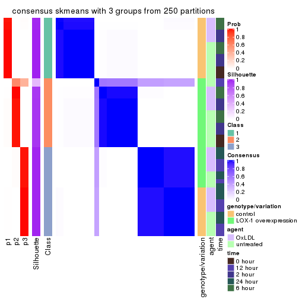</p>

</div>
<div id='tab-ATC-skmeans-consensus-heatmap-3'>
<pre><code class="r">consensus_heatmap(res, k = 4)
</code></pre>

<p>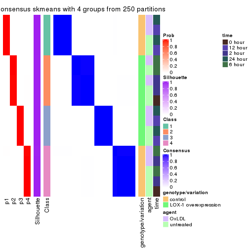</p>

</div>
<div id='tab-ATC-skmeans-consensus-heatmap-4'>
<pre><code class="r">consensus_heatmap(res, k = 5)
</code></pre>

<p>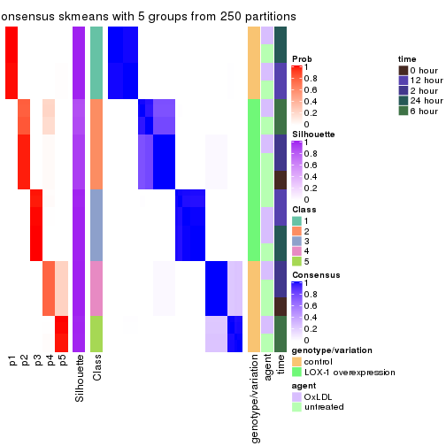</p>

</div>
<div id='tab-ATC-skmeans-consensus-heatmap-5'>
<pre><code class="r">consensus_heatmap(res, k = 6)
</code></pre>

<p>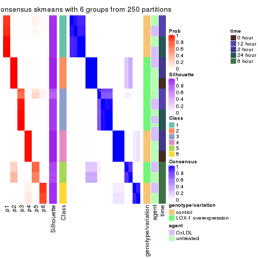</p>

</div>
</div>

Heatmaps for the membership of samples in all partitions to see how consistent they are:


<script>
$( function() {
	$( '#tabs-ATC-skmeans-membership-heatmap' ).tabs();
} );
</script>
<div id='tabs-ATC-skmeans-membership-heatmap'>
<ul>
<li><a href='#tab-ATC-skmeans-membership-heatmap-1'>k = 2</a></li>
<li><a href='#tab-ATC-skmeans-membership-heatmap-2'>k = 3</a></li>
<li><a href='#tab-ATC-skmeans-membership-heatmap-3'>k = 4</a></li>
<li><a href='#tab-ATC-skmeans-membership-heatmap-4'>k = 5</a></li>
<li><a href='#tab-ATC-skmeans-membership-heatmap-5'>k = 6</a></li>
</ul>
<div id='tab-ATC-skmeans-membership-heatmap-1'>
<pre><code class="r">membership_heatmap(res, k = 2)
</code></pre>

<p>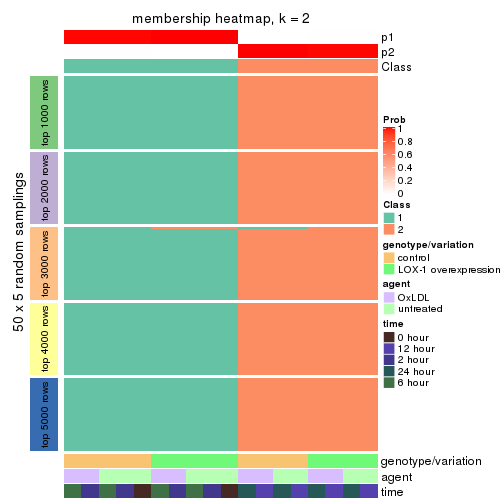</p>

</div>
<div id='tab-ATC-skmeans-membership-heatmap-2'>
<pre><code class="r">membership_heatmap(res, k = 3)
</code></pre>

<p>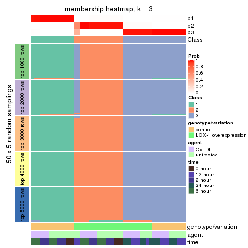</p>

</div>
<div id='tab-ATC-skmeans-membership-heatmap-3'>
<pre><code class="r">membership_heatmap(res, k = 4)
</code></pre>

<p>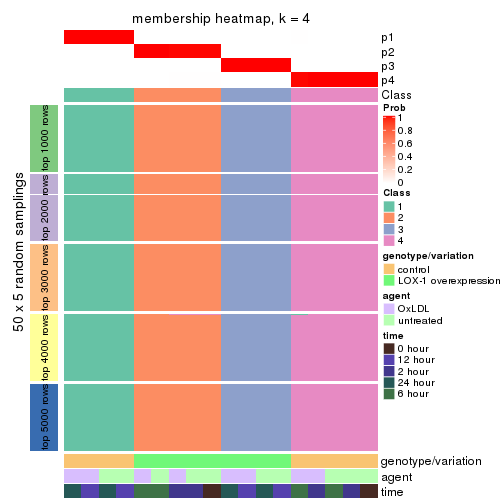</p>

</div>
<div id='tab-ATC-skmeans-membership-heatmap-4'>
<pre><code class="r">membership_heatmap(res, k = 5)
</code></pre>

<p>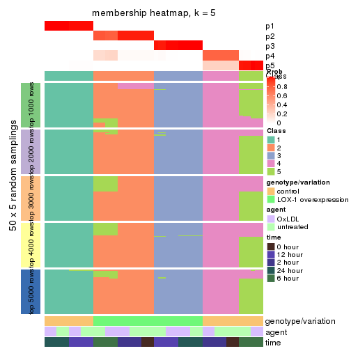</p>

</div>
<div id='tab-ATC-skmeans-membership-heatmap-5'>
<pre><code class="r">membership_heatmap(res, k = 6)
</code></pre>

<p>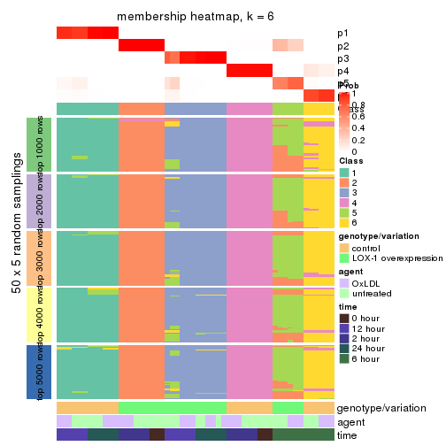</p>

</div>
</div>

As soon as we have had the classes for columns, we can look for signatures
which are significantly different between classes which can be candidate marks
for certain classes. Following are the heatmaps for signatures.


Signature heatmaps where rows are scaled:


<script>
$( function() {
	$( '#tabs-ATC-skmeans-get-signatures' ).tabs();
} );
</script>
<div id='tabs-ATC-skmeans-get-signatures'>
<ul>
<li><a href='#tab-ATC-skmeans-get-signatures-1'>k = 2</a></li>
<li><a href='#tab-ATC-skmeans-get-signatures-2'>k = 3</a></li>
<li><a href='#tab-ATC-skmeans-get-signatures-3'>k = 4</a></li>
<li><a href='#tab-ATC-skmeans-get-signatures-4'>k = 5</a></li>
<li><a href='#tab-ATC-skmeans-get-signatures-5'>k = 6</a></li>
</ul>
<div id='tab-ATC-skmeans-get-signatures-1'>
<pre><code class="r">get_signatures(res, k = 2)
</code></pre>

<p>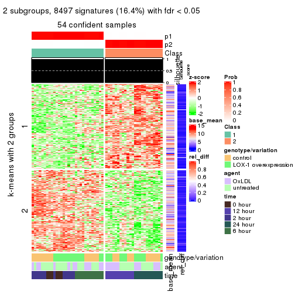</p>

</div>
<div id='tab-ATC-skmeans-get-signatures-2'>
<pre><code class="r">get_signatures(res, k = 3)
</code></pre>

<p>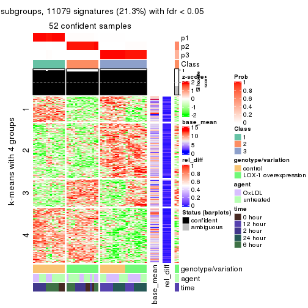</p>

</div>
<div id='tab-ATC-skmeans-get-signatures-3'>
<pre><code class="r">get_signatures(res, k = 4)
</code></pre>

<p>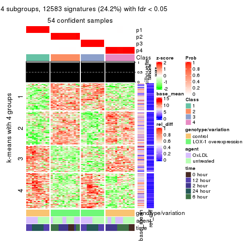</p>

</div>
<div id='tab-ATC-skmeans-get-signatures-4'>
<pre><code class="r">get_signatures(res, k = 5)
</code></pre>

<p>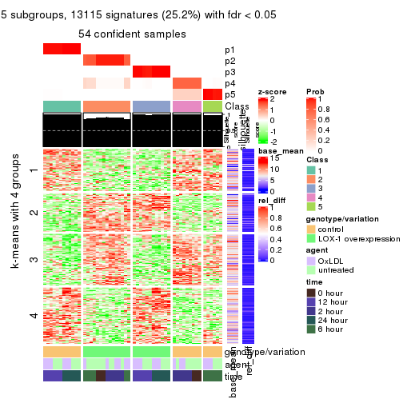</p>

</div>
<div id='tab-ATC-skmeans-get-signatures-5'>
<pre><code class="r">get_signatures(res, k = 6)
</code></pre>

<p>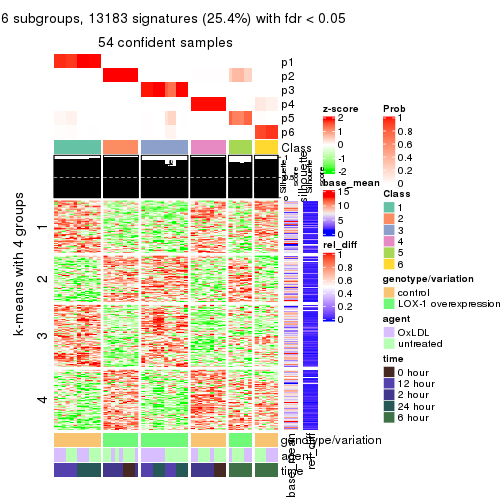</p>

</div>
</div>


Signature heatmaps where rows are not scaled:


<script>
$( function() {
	$( '#tabs-ATC-skmeans-get-signatures-no-scale' ).tabs();
} );
</script>
<div id='tabs-ATC-skmeans-get-signatures-no-scale'>
<ul>
<li><a href='#tab-ATC-skmeans-get-signatures-no-scale-1'>k = 2</a></li>
<li><a href='#tab-ATC-skmeans-get-signatures-no-scale-2'>k = 3</a></li>
<li><a href='#tab-ATC-skmeans-get-signatures-no-scale-3'>k = 4</a></li>
<li><a href='#tab-ATC-skmeans-get-signatures-no-scale-4'>k = 5</a></li>
<li><a href='#tab-ATC-skmeans-get-signatures-no-scale-5'>k = 6</a></li>
</ul>
<div id='tab-ATC-skmeans-get-signatures-no-scale-1'>
<pre><code class="r">get_signatures(res, k = 2, scale_rows = FALSE)
</code></pre>

<p>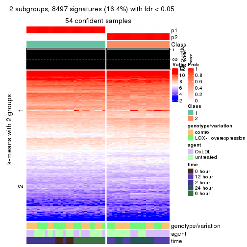</p>

</div>
<div id='tab-ATC-skmeans-get-signatures-no-scale-2'>
<pre><code class="r">get_signatures(res, k = 3, scale_rows = FALSE)
</code></pre>

<p>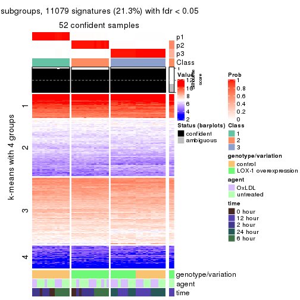</p>

</div>
<div id='tab-ATC-skmeans-get-signatures-no-scale-3'>
<pre><code class="r">get_signatures(res, k = 4, scale_rows = FALSE)
</code></pre>

<p>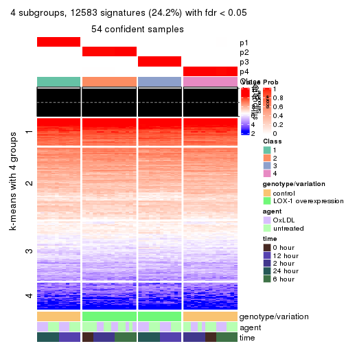</p>

</div>
<div id='tab-ATC-skmeans-get-signatures-no-scale-4'>
<pre><code class="r">get_signatures(res, k = 5, scale_rows = FALSE)
</code></pre>

<p>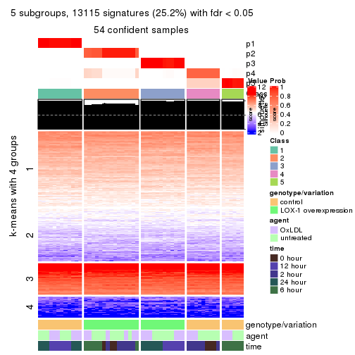</p>

</div>
<div id='tab-ATC-skmeans-get-signatures-no-scale-5'>
<pre><code class="r">get_signatures(res, k = 6, scale_rows = FALSE)
</code></pre>

<p>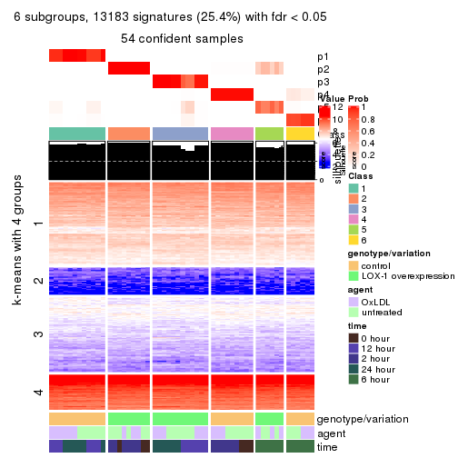</p>

</div>
</div>


Compare the overlap of signatures from different k:

```r
compare_signatures(res)
```

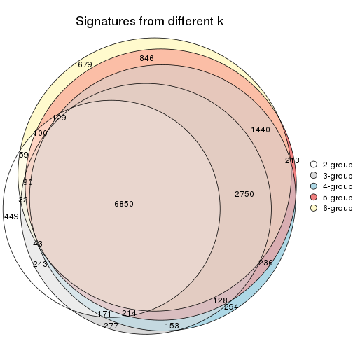

`get_signature()` returns a data frame invisibly. TO get the list of signatures, the function
call should be assigned to a variable explicitly. In following code, if `plot` argument is set
to `FALSE`, no heatmap is plotted while only the differential analysis is performed.

```r
# code only for demonstration
tb = get_signature(res, k = ..., plot = FALSE)
```

An example of the output of `tb` is:

```
#>   which_row         fdr    mean_1    mean_2 scaled_mean_1 scaled_mean_2 km
#> 1        38 0.042760348  8.373488  9.131774    -0.5533452     0.5164555  1
#> 2        40 0.018707592  7.106213  8.469186    -0.6173731     0.5762149  1
#> 3        55 0.019134737 10.221463 11.207825    -0.6159697     0.5749050  1
#> 4        59 0.006059896  5.921854  7.869574    -0.6899429     0.6439467  1
#> 5        60 0.018055526  8.928898 10.211722    -0.6204761     0.5791110  1
#> 6        98 0.009384629 15.714769 14.887706     0.6635654    -0.6193277  2
...
```

The columns in `tb` are:

1. `which_row`: row indices corresponding to the input matrix.
2. `fdr`: FDR for the differential test. 
3. `mean_x`: The mean value in group x.
4. `scaled_mean_x`: The mean value in group x after rows are scaled.
5. `km`: Row groups if k-means clustering is applied to rows.


UMAP plot which shows how samples are separated.


<script>
$( function() {
	$( '#tabs-ATC-skmeans-dimension-reduction' ).tabs();
} );
</script>
<div id='tabs-ATC-skmeans-dimension-reduction'>
<ul>
<li><a href='#tab-ATC-skmeans-dimension-reduction-1'>k = 2</a></li>
<li><a href='#tab-ATC-skmeans-dimension-reduction-2'>k = 3</a></li>
<li><a href='#tab-ATC-skmeans-dimension-reduction-3'>k = 4</a></li>
<li><a href='#tab-ATC-skmeans-dimension-reduction-4'>k = 5</a></li>
<li><a href='#tab-ATC-skmeans-dimension-reduction-5'>k = 6</a></li>
</ul>
<div id='tab-ATC-skmeans-dimension-reduction-1'>
<pre><code class="r">dimension_reduction(res, k = 2, method = &quot;UMAP&quot;)
</code></pre>

<p></p>

</div>
<div id='tab-ATC-skmeans-dimension-reduction-2'>
<pre><code class="r">dimension_reduction(res, k = 3, method = &quot;UMAP&quot;)
</code></pre>

<p>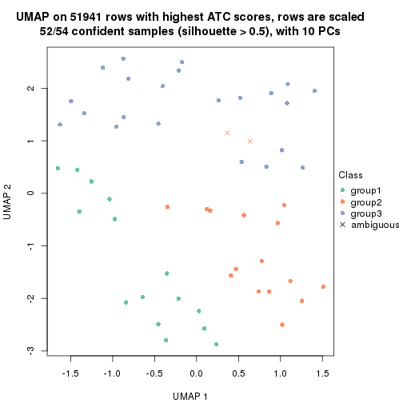</p>

</div>
<div id='tab-ATC-skmeans-dimension-reduction-3'>
<pre><code class="r">dimension_reduction(res, k = 4, method = &quot;UMAP&quot;)
</code></pre>

<p></p>

</div>
<div id='tab-ATC-skmeans-dimension-reduction-4'>
<pre><code class="r">dimension_reduction(res, k = 5, method = &quot;UMAP&quot;)
</code></pre>

<p>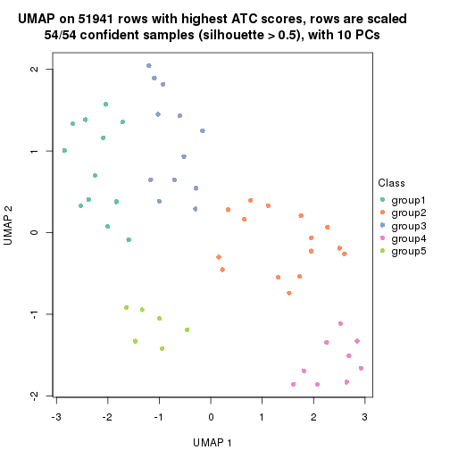</p>

</div>
<div id='tab-ATC-skmeans-dimension-reduction-5'>
<pre><code class="r">dimension_reduction(res, k = 6, method = &quot;UMAP&quot;)
</code></pre>

<p>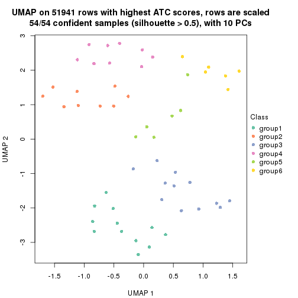</p>

</div>
</div>


Following heatmap shows how subgroups are split when increasing `k`:

```r
collect_classes(res)
```

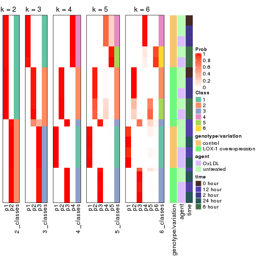


Test correlation between subgroups and known annotations. If the known
annotation is numeric, one-way ANOVA test is applied, and if the known
annotation is discrete, chi-squared contingency table test is applied.

```r
test_to_known_factors(res)
```

```
#>              n genotype/variation(p) agent(p)  time(p) k
#> ATC:skmeans 54              1.00e+00    0.646 5.26e-11 2
#> ATC:skmeans 52              2.84e-07    0.583 1.68e-08 3
#> ATC:skmeans 54              1.12e-11    0.910 2.73e-07 4
#> ATC:skmeans 54              5.26e-11    0.918 1.10e-10 5
#> ATC:skmeans 54              2.10e-10    0.930 4.54e-14 6
```


If matrix rows can be associated to genes, consider to use `functional_enrichment(res,
...)` to perform function enrichment for the signature genes. See [this vignette](http://bioconductor.org/packages/devel/bioc/vignettes/cola/inst/doc/functional_enrichment.html) for more detailed explanations.


 

---------------------------------------------------


### ATC:pam*


The object with results only for a single top-value method and a single partition method 
can be extracted as:

```r
res = res_list["ATC", "pam"]
# you can also extract it by
# res = res_list["ATC:pam"]
```

A summary of `res` and all the functions that can be applied to it:

```r
res
```

```
#> A 'ConsensusPartition' object with k = 2, 3, 4, 5, 6.
#>   On a matrix with 51941 rows and 54 columns.
#>   Top rows (1000, 2000, 3000, 4000, 5000) are extracted by 'ATC' method.
#>   Subgroups are detected by 'pam' method.
#>   Performed in total 1250 partitions by row resampling.
#>   Best k for subgroups seems to be 6.
#> 
#> Following methods can be applied to this 'ConsensusPartition' object:
#>  [1] "cola_report"             "collect_classes"         "collect_plots"          
#>  [4] "collect_stats"           "colnames"                "compare_signatures"     
#>  [7] "consensus_heatmap"       "dimension_reduction"     "functional_enrichment"  
#> [10] "get_anno_col"            "get_anno"                "get_classes"            
#> [13] "get_consensus"           "get_matrix"              "get_membership"         
#> [16] "get_param"               "get_signatures"          "get_stats"              
#> [19] "is_best_k"               "is_stable_k"             "membership_heatmap"     
#> [22] "ncol"                    "nrow"                    "plot_ecdf"              
#> [25] "rownames"                "select_partition_number" "show"                   
#> [28] "suggest_best_k"          "test_to_known_factors"
```

`collect_plots()` function collects all the plots made from `res` for all `k` (number of partitions)
into one single page to provide an easy and fast comparison between different `k`.

```r
collect_plots(res)
```

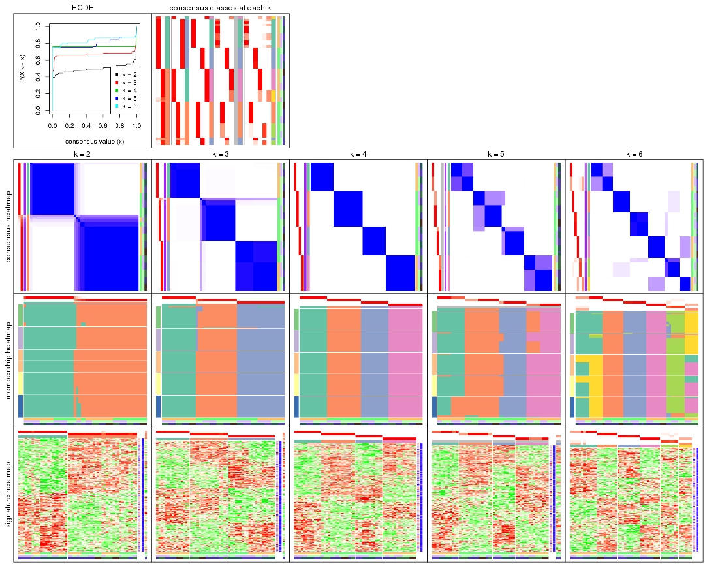

The plots are:

- The first row: a plot of the ECDF (empirical cumulative distribution
  function) curves of the consensus matrix for each `k` and the heatmap of
  predicted classes for each `k`.
- The second row: heatmaps of the consensus matrix for each `k`.
- The third row: heatmaps of the membership matrix for each `k`.
- The fouth row: heatmaps of the signatures for each `k`.

All the plots in panels can be made by individual functions and they are
plotted later in this section.

`select_partition_number()` produces several plots showing different
statistics for choosing "optimized" `k`. There are following statistics:

- ECDF curves of the consensus matrix for each `k`;
- 1-PAC. [The PAC
  score](https://en.wikipedia.org/wiki/Consensus_clustering#Over-interpretation_potential_of_consensus_clustering)
  measures the proportion of the ambiguous subgrouping.
- Mean silhouette score.
- Concordance. The mean probability of fiting the consensus class ids in all
  partitions.
- Area increased. Denote $A_k$ as the area under the ECDF curve for current
  `k`, the area increased is defined as $A_k - A_{k-1}$.
- Rand index. The percent of pairs of samples that are both in a same cluster
  or both are not in a same cluster in the partition of k and k-1.
- Jaccard index. The ratio of pairs of samples are both in a same cluster in
  the partition of k and k-1 and the pairs of samples are both in a same
  cluster in the partition k or k-1.

The detailed explanations of these statistics can be found in [the _cola_
vignette](http://bioconductor.org/packages/devel/bioc/vignettes/cola/inst/doc/cola.html#toc_13).

Generally speaking, lower PAC score, higher mean silhouette score or higher
concordance corresponds to better partition. Rand index and Jaccard index
measure how similar the current partition is compared to partition with `k-1`.
If they are too similar, we won't accept `k` is better than `k-1`.

```r
select_partition_number(res)
```

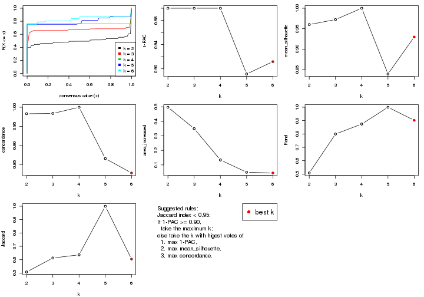

The numeric values for all these statistics can be obtained by `get_stats()`.

```r
get_stats(res)
```

```
#>   k 1-PAC mean_silhouette concordance area_increased  Rand Jaccard
#> 2 2 1.000           0.960       0.983         0.4972 0.508   0.508
#> 3 3 1.000           0.972       0.984         0.3500 0.799   0.613
#> 4 4 1.000           1.000       1.000         0.1342 0.874   0.636
#> 5 5 0.891           0.839       0.866         0.0497 1.000   1.000
#> 6 6 0.912           0.930       0.828         0.0448 0.902   0.605
```

`suggest_best_k()` suggests the best $k$ based on these statistics. The rules are as follows:

- All $k$ with Jaccard index larger than 0.95 are removed because increasing
  $k$ does not provide enough extra information. If all $k$ are removed, it is
  marked as no subgroup is detected.
- For all $k$ with 1-PAC score larger than 0.9, the maximal $k$ is taken as
  the best $k$, and other $k$ are marked as optional $k$.
- If it does not fit the second rule. The $k$ with the maximal vote of the
  highest 1-PAC score, highest mean silhouette, and highest concordance is
  taken as the best $k$.

```r
suggest_best_k(res)
```

```
#> [1] 6
#> attr(,"optional")
#> [1] 2 3 4
```

There is also optional best $k$ = 2 3 4 that is worth to check.

Following shows the table of the partitions (You need to click the **show/hide
code output** link to see it). The membership matrix (columns with name `p*`)
is inferred by
[`clue::cl_consensus()`](https://www.rdocumentation.org/link/cl_consensus?package=clue)
function with the `SE` method. Basically the value in the membership matrix
represents the probability to belong to a certain group. The finall class
label for an item is determined with the group with highest probability it
belongs to.

In `get_classes()` function, the entropy is calculated from the membership
matrix and the silhouette score is calculated from the consensus matrix.


<script>
$( function() {
	$( '#tabs-ATC-pam-get-classes' ).tabs();
} );
</script>
<div id='tabs-ATC-pam-get-classes'>
<ul>
<li><a href='#tab-ATC-pam-get-classes-1'>k = 2</a></li>
<li><a href='#tab-ATC-pam-get-classes-2'>k = 3</a></li>
<li><a href='#tab-ATC-pam-get-classes-3'>k = 4</a></li>
<li><a href='#tab-ATC-pam-get-classes-4'>k = 5</a></li>
<li><a href='#tab-ATC-pam-get-classes-5'>k = 6</a></li>
</ul>

<div id='tab-ATC-pam-get-classes-1'>
<p><a id='tab-ATC-pam-get-classes-1-a' style='color:#0366d6' href='#'>show/hide code output</a></p>
<pre><code class="r">cbind(get_classes(res, k = 2), get_membership(res, k = 2))
</code></pre>

<pre><code>#&gt;           class entropy silhouette    p1    p2
#&gt; GSM329068     2   0.000      0.972 0.000 1.000
#&gt; GSM329074     2   0.000      0.972 0.000 1.000
#&gt; GSM329100     2   0.000      0.972 0.000 1.000
#&gt; GSM329062     2   0.000      0.972 0.000 1.000
#&gt; GSM329079     2   0.000      0.972 0.000 1.000
#&gt; GSM329090     2   0.000      0.972 0.000 1.000
#&gt; GSM329066     2   0.000      0.972 0.000 1.000
#&gt; GSM329086     2   0.000      0.972 0.000 1.000
#&gt; GSM329099     2   0.000      0.972 0.000 1.000
#&gt; GSM329071     2   0.224      0.943 0.036 0.964
#&gt; GSM329078     2   0.973      0.337 0.404 0.596
#&gt; GSM329081     2   0.224      0.943 0.036 0.964
#&gt; GSM329096     1   0.000      0.997 1.000 0.000
#&gt; GSM329102     1   0.000      0.997 1.000 0.000
#&gt; GSM329104     1   0.000      0.997 1.000 0.000
#&gt; GSM329067     2   0.000      0.972 0.000 1.000
#&gt; GSM329072     2   0.000      0.972 0.000 1.000
#&gt; GSM329075     2   0.000      0.972 0.000 1.000
#&gt; GSM329058     2   0.000      0.972 0.000 1.000
#&gt; GSM329073     2   0.000      0.972 0.000 1.000
#&gt; GSM329107     2   0.000      0.972 0.000 1.000
#&gt; GSM329057     1   0.000      0.997 1.000 0.000
#&gt; GSM329085     1   0.000      0.997 1.000 0.000
#&gt; GSM329089     1   0.000      0.997 1.000 0.000
#&gt; GSM329076     1   0.000      0.997 1.000 0.000
#&gt; GSM329094     1   0.000      0.997 1.000 0.000
#&gt; GSM329105     1   0.000      0.997 1.000 0.000
#&gt; GSM329056     2   0.000      0.972 0.000 1.000
#&gt; GSM329069     2   0.000      0.972 0.000 1.000
#&gt; GSM329077     2   0.000      0.972 0.000 1.000
#&gt; GSM329070     2   0.000      0.972 0.000 1.000
#&gt; GSM329082     2   0.000      0.972 0.000 1.000
#&gt; GSM329092     2   0.000      0.972 0.000 1.000
#&gt; GSM329083     2   0.000      0.972 0.000 1.000
#&gt; GSM329101     2   0.000      0.972 0.000 1.000
#&gt; GSM329106     2   0.000      0.972 0.000 1.000
#&gt; GSM329087     1   0.000      0.997 1.000 0.000
#&gt; GSM329091     1   0.000      0.997 1.000 0.000
#&gt; GSM329093     1   0.000      0.997 1.000 0.000
#&gt; GSM329080     1   0.000      0.997 1.000 0.000
#&gt; GSM329084     1   0.000      0.997 1.000 0.000
#&gt; GSM329088     1   0.000      0.997 1.000 0.000
#&gt; GSM329059     2   0.000      0.972 0.000 1.000
#&gt; GSM329097     2   0.000      0.972 0.000 1.000
#&gt; GSM329098     2   0.000      0.972 0.000 1.000
#&gt; GSM329055     1   0.358      0.925 0.932 0.068
#&gt; GSM329103     2   0.541      0.850 0.124 0.876
#&gt; GSM329108     2   0.814      0.670 0.252 0.748
#&gt; GSM329061     1   0.000      0.997 1.000 0.000
#&gt; GSM329064     1   0.000      0.997 1.000 0.000
#&gt; GSM329065     1   0.000      0.997 1.000 0.000
#&gt; GSM329060     1   0.000      0.997 1.000 0.000
#&gt; GSM329063     1   0.000      0.997 1.000 0.000
#&gt; GSM329095     1   0.000      0.997 1.000 0.000
</code></pre>

<script>
$('#tab-ATC-pam-get-classes-1-a').parent().next().next().hide();
$('#tab-ATC-pam-get-classes-1-a').click(function(){
  $('#tab-ATC-pam-get-classes-1-a').parent().next().next().toggle();
  return(false);
});
</script>
</div>

<div id='tab-ATC-pam-get-classes-2'>
<p><a id='tab-ATC-pam-get-classes-2-a' style='color:#0366d6' href='#'>show/hide code output</a></p>
<pre><code class="r">cbind(get_classes(res, k = 3), get_membership(res, k = 3))
</code></pre>

<pre><code>#&gt;           class entropy silhouette    p1    p2    p3
#&gt; GSM329068     2  0.0424      0.968 0.008 0.992 0.000
#&gt; GSM329074     2  0.0424      0.968 0.008 0.992 0.000
#&gt; GSM329100     2  0.0424      0.968 0.008 0.992 0.000
#&gt; GSM329062     2  0.0424      0.968 0.008 0.992 0.000
#&gt; GSM329079     2  0.0424      0.968 0.008 0.992 0.000
#&gt; GSM329090     2  0.0424      0.968 0.008 0.992 0.000
#&gt; GSM329066     2  0.0424      0.968 0.008 0.992 0.000
#&gt; GSM329086     2  0.0424      0.968 0.008 0.992 0.000
#&gt; GSM329099     2  0.0424      0.968 0.008 0.992 0.000
#&gt; GSM329071     2  0.1643      0.928 0.000 0.956 0.044
#&gt; GSM329078     2  0.6111      0.348 0.000 0.604 0.396
#&gt; GSM329081     2  0.1643      0.928 0.000 0.956 0.044
#&gt; GSM329096     3  0.0424      0.992 0.000 0.008 0.992
#&gt; GSM329102     3  0.0424      0.992 0.000 0.008 0.992
#&gt; GSM329104     3  0.0424      0.992 0.000 0.008 0.992
#&gt; GSM329067     2  0.0424      0.968 0.008 0.992 0.000
#&gt; GSM329072     2  0.0424      0.968 0.008 0.992 0.000
#&gt; GSM329075     2  0.0424      0.968 0.008 0.992 0.000
#&gt; GSM329058     2  0.0424      0.968 0.008 0.992 0.000
#&gt; GSM329073     2  0.0424      0.968 0.008 0.992 0.000
#&gt; GSM329107     2  0.0424      0.968 0.008 0.992 0.000
#&gt; GSM329057     3  0.0424      0.992 0.000 0.008 0.992
#&gt; GSM329085     3  0.0424      0.992 0.000 0.008 0.992
#&gt; GSM329089     3  0.0424      0.992 0.000 0.008 0.992
#&gt; GSM329076     3  0.0424      0.992 0.000 0.008 0.992
#&gt; GSM329094     3  0.0424      0.992 0.000 0.008 0.992
#&gt; GSM329105     3  0.0424      0.992 0.000 0.008 0.992
#&gt; GSM329056     1  0.0424      0.997 0.992 0.008 0.000
#&gt; GSM329069     1  0.0424      0.997 0.992 0.008 0.000
#&gt; GSM329077     1  0.0424      0.997 0.992 0.008 0.000
#&gt; GSM329070     1  0.0424      0.997 0.992 0.008 0.000
#&gt; GSM329082     1  0.0424      0.997 0.992 0.008 0.000
#&gt; GSM329092     1  0.0424      0.997 0.992 0.008 0.000
#&gt; GSM329083     1  0.0424      0.997 0.992 0.008 0.000
#&gt; GSM329101     1  0.0424      0.997 0.992 0.008 0.000
#&gt; GSM329106     1  0.0424      0.997 0.992 0.008 0.000
#&gt; GSM329087     3  0.0424      0.994 0.008 0.000 0.992
#&gt; GSM329091     3  0.0424      0.994 0.008 0.000 0.992
#&gt; GSM329093     3  0.0424      0.994 0.008 0.000 0.992
#&gt; GSM329080     3  0.0424      0.994 0.008 0.000 0.992
#&gt; GSM329084     3  0.0424      0.994 0.008 0.000 0.992
#&gt; GSM329088     3  0.0424      0.994 0.008 0.000 0.992
#&gt; GSM329059     1  0.0424      0.997 0.992 0.008 0.000
#&gt; GSM329097     1  0.0424      0.997 0.992 0.008 0.000
#&gt; GSM329098     1  0.0424      0.997 0.992 0.008 0.000
#&gt; GSM329055     1  0.0424      0.983 0.992 0.000 0.008
#&gt; GSM329103     1  0.0000      0.991 1.000 0.000 0.000
#&gt; GSM329108     1  0.0000      0.991 1.000 0.000 0.000
#&gt; GSM329061     3  0.0424      0.994 0.008 0.000 0.992
#&gt; GSM329064     3  0.0424      0.994 0.008 0.000 0.992
#&gt; GSM329065     3  0.0424      0.994 0.008 0.000 0.992
#&gt; GSM329060     3  0.0424      0.994 0.008 0.000 0.992
#&gt; GSM329063     3  0.0424      0.994 0.008 0.000 0.992
#&gt; GSM329095     3  0.0424      0.994 0.008 0.000 0.992
</code></pre>

<script>
$('#tab-ATC-pam-get-classes-2-a').parent().next().next().hide();
$('#tab-ATC-pam-get-classes-2-a').click(function(){
  $('#tab-ATC-pam-get-classes-2-a').parent().next().next().toggle();
  return(false);
});
</script>
</div>

<div id='tab-ATC-pam-get-classes-3'>
<p><a id='tab-ATC-pam-get-classes-3-a' style='color:#0366d6' href='#'>show/hide code output</a></p>
<pre><code class="r">cbind(get_classes(res, k = 4), get_membership(res, k = 4))
</code></pre>

<pre><code>#&gt;           class entropy silhouette p1 p2 p3 p4
#&gt; GSM329068     2       0          1  0  1  0  0
#&gt; GSM329074     2       0          1  0  1  0  0
#&gt; GSM329100     2       0          1  0  1  0  0
#&gt; GSM329062     2       0          1  0  1  0  0
#&gt; GSM329079     2       0          1  0  1  0  0
#&gt; GSM329090     2       0          1  0  1  0  0
#&gt; GSM329066     2       0          1  0  1  0  0
#&gt; GSM329086     2       0          1  0  1  0  0
#&gt; GSM329099     2       0          1  0  1  0  0
#&gt; GSM329071     3       0          1  0  0  1  0
#&gt; GSM329078     3       0          1  0  0  1  0
#&gt; GSM329081     3       0          1  0  0  1  0
#&gt; GSM329096     3       0          1  0  0  1  0
#&gt; GSM329102     3       0          1  0  0  1  0
#&gt; GSM329104     3       0          1  0  0  1  0
#&gt; GSM329067     2       0          1  0  1  0  0
#&gt; GSM329072     2       0          1  0  1  0  0
#&gt; GSM329075     2       0          1  0  1  0  0
#&gt; GSM329058     2       0          1  0  1  0  0
#&gt; GSM329073     2       0          1  0  1  0  0
#&gt; GSM329107     2       0          1  0  1  0  0
#&gt; GSM329057     3       0          1  0  0  1  0
#&gt; GSM329085     3       0          1  0  0  1  0
#&gt; GSM329089     3       0          1  0  0  1  0
#&gt; GSM329076     3       0          1  0  0  1  0
#&gt; GSM329094     3       0          1  0  0  1  0
#&gt; GSM329105     3       0          1  0  0  1  0
#&gt; GSM329056     4       0          1  0  0  0  1
#&gt; GSM329069     4       0          1  0  0  0  1
#&gt; GSM329077     4       0          1  0  0  0  1
#&gt; GSM329070     4       0          1  0  0  0  1
#&gt; GSM329082     4       0          1  0  0  0  1
#&gt; GSM329092     4       0          1  0  0  0  1
#&gt; GSM329083     4       0          1  0  0  0  1
#&gt; GSM329101     4       0          1  0  0  0  1
#&gt; GSM329106     4       0          1  0  0  0  1
#&gt; GSM329087     1       0          1  1  0  0  0
#&gt; GSM329091     1       0          1  1  0  0  0
#&gt; GSM329093     1       0          1  1  0  0  0
#&gt; GSM329080     1       0          1  1  0  0  0
#&gt; GSM329084     1       0          1  1  0  0  0
#&gt; GSM329088     1       0          1  1  0  0  0
#&gt; GSM329059     4       0          1  0  0  0  1
#&gt; GSM329097     4       0          1  0  0  0  1
#&gt; GSM329098     4       0          1  0  0  0  1
#&gt; GSM329055     4       0          1  0  0  0  1
#&gt; GSM329103     4       0          1  0  0  0  1
#&gt; GSM329108     4       0          1  0  0  0  1
#&gt; GSM329061     1       0          1  1  0  0  0
#&gt; GSM329064     1       0          1  1  0  0  0
#&gt; GSM329065     1       0          1  1  0  0  0
#&gt; GSM329060     1       0          1  1  0  0  0
#&gt; GSM329063     1       0          1  1  0  0  0
#&gt; GSM329095     1       0          1  1  0  0  0
</code></pre>

<script>
$('#tab-ATC-pam-get-classes-3-a').parent().next().next().hide();
$('#tab-ATC-pam-get-classes-3-a').click(function(){
  $('#tab-ATC-pam-get-classes-3-a').parent().next().next().toggle();
  return(false);
});
</script>
</div>

<div id='tab-ATC-pam-get-classes-4'>
<p><a id='tab-ATC-pam-get-classes-4-a' style='color:#0366d6' href='#'>show/hide code output</a></p>
<pre><code class="r">cbind(get_classes(res, k = 5), get_membership(res, k = 5))
</code></pre>

<pre><code>#&gt;           class entropy silhouette    p1   p2   p3    p4 p5
#&gt; GSM329068     2   0.000      0.809 0.000 1.00 0.00 0.000 NA
#&gt; GSM329074     2   0.000      0.809 0.000 1.00 0.00 0.000 NA
#&gt; GSM329100     2   0.000      0.809 0.000 1.00 0.00 0.000 NA
#&gt; GSM329062     2   0.000      0.809 0.000 1.00 0.00 0.000 NA
#&gt; GSM329079     2   0.000      0.809 0.000 1.00 0.00 0.000 NA
#&gt; GSM329090     2   0.000      0.809 0.000 1.00 0.00 0.000 NA
#&gt; GSM329066     2   0.430      0.684 0.000 0.52 0.00 0.000 NA
#&gt; GSM329086     2   0.430      0.684 0.000 0.52 0.00 0.000 NA
#&gt; GSM329099     2   0.430      0.684 0.000 0.52 0.00 0.000 NA
#&gt; GSM329071     3   0.430      0.439 0.000 0.00 0.52 0.000 NA
#&gt; GSM329078     3   0.000      0.917 0.000 0.00 1.00 0.000 NA
#&gt; GSM329081     3   0.430      0.439 0.000 0.00 0.52 0.000 NA
#&gt; GSM329096     3   0.000      0.917 0.000 0.00 1.00 0.000 NA
#&gt; GSM329102     3   0.000      0.917 0.000 0.00 1.00 0.000 NA
#&gt; GSM329104     3   0.000      0.917 0.000 0.00 1.00 0.000 NA
#&gt; GSM329067     2   0.000      0.809 0.000 1.00 0.00 0.000 NA
#&gt; GSM329072     2   0.000      0.809 0.000 1.00 0.00 0.000 NA
#&gt; GSM329075     2   0.000      0.809 0.000 1.00 0.00 0.000 NA
#&gt; GSM329058     2   0.430      0.684 0.000 0.52 0.00 0.000 NA
#&gt; GSM329073     2   0.430      0.684 0.000 0.52 0.00 0.000 NA
#&gt; GSM329107     2   0.430      0.684 0.000 0.52 0.00 0.000 NA
#&gt; GSM329057     3   0.000      0.917 0.000 0.00 1.00 0.000 NA
#&gt; GSM329085     3   0.000      0.917 0.000 0.00 1.00 0.000 NA
#&gt; GSM329089     3   0.000      0.917 0.000 0.00 1.00 0.000 NA
#&gt; GSM329076     3   0.000      0.917 0.000 0.00 1.00 0.000 NA
#&gt; GSM329094     3   0.000      0.917 0.000 0.00 1.00 0.000 NA
#&gt; GSM329105     3   0.000      0.917 0.000 0.00 1.00 0.000 NA
#&gt; GSM329056     4   0.000      0.887 0.000 0.00 0.00 1.000 NA
#&gt; GSM329069     4   0.000      0.887 0.000 0.00 0.00 1.000 NA
#&gt; GSM329077     4   0.000      0.887 0.000 0.00 0.00 1.000 NA
#&gt; GSM329070     4   0.000      0.887 0.000 0.00 0.00 1.000 NA
#&gt; GSM329082     4   0.000      0.887 0.000 0.00 0.00 1.000 NA
#&gt; GSM329092     4   0.000      0.887 0.000 0.00 0.00 1.000 NA
#&gt; GSM329083     4   0.388      0.824 0.000 0.00 0.00 0.684 NA
#&gt; GSM329101     4   0.388      0.824 0.000 0.00 0.00 0.684 NA
#&gt; GSM329106     4   0.388      0.824 0.000 0.00 0.00 0.684 NA
#&gt; GSM329087     1   0.314      0.913 0.796 0.00 0.00 0.000 NA
#&gt; GSM329091     1   0.000      0.913 1.000 0.00 0.00 0.000 NA
#&gt; GSM329093     1   0.314      0.913 0.796 0.00 0.00 0.000 NA
#&gt; GSM329080     1   0.000      0.913 1.000 0.00 0.00 0.000 NA
#&gt; GSM329084     1   0.000      0.913 1.000 0.00 0.00 0.000 NA
#&gt; GSM329088     1   0.000      0.913 1.000 0.00 0.00 0.000 NA
#&gt; GSM329059     4   0.000      0.887 0.000 0.00 0.00 1.000 NA
#&gt; GSM329097     4   0.000      0.887 0.000 0.00 0.00 1.000 NA
#&gt; GSM329098     4   0.000      0.887 0.000 0.00 0.00 1.000 NA
#&gt; GSM329055     4   0.389      0.821 0.000 0.00 0.00 0.680 NA
#&gt; GSM329103     4   0.388      0.824 0.000 0.00 0.00 0.684 NA
#&gt; GSM329108     4   0.388      0.824 0.000 0.00 0.00 0.684 NA
#&gt; GSM329061     1   0.314      0.913 0.796 0.00 0.00 0.000 NA
#&gt; GSM329064     1   0.314      0.913 0.796 0.00 0.00 0.000 NA
#&gt; GSM329065     1   0.314      0.913 0.796 0.00 0.00 0.000 NA
#&gt; GSM329060     1   0.000      0.913 1.000 0.00 0.00 0.000 NA
#&gt; GSM329063     1   0.000      0.913 1.000 0.00 0.00 0.000 NA
#&gt; GSM329095     1   0.314      0.913 0.796 0.00 0.00 0.000 NA
</code></pre>

<script>
$('#tab-ATC-pam-get-classes-4-a').parent().next().next().hide();
$('#tab-ATC-pam-get-classes-4-a').click(function(){
  $('#tab-ATC-pam-get-classes-4-a').parent().next().next().toggle();
  return(false);
});
</script>
</div>

<div id='tab-ATC-pam-get-classes-5'>
<p><a id='tab-ATC-pam-get-classes-5-a' style='color:#0366d6' href='#'>show/hide code output</a></p>
<pre><code class="r">cbind(get_classes(res, k = 6), get_membership(res, k = 6))
</code></pre>

<pre><code>#&gt;           class entropy silhouette    p1    p2    p3    p4    p5    p6
#&gt; GSM329068     2  0.0000      0.999 0.000 1.000 0.000 0.000 0.000 0.000
#&gt; GSM329074     2  0.0146      0.996 0.000 0.996 0.000 0.000 0.004 0.000
#&gt; GSM329100     2  0.0000      0.999 0.000 1.000 0.000 0.000 0.000 0.000
#&gt; GSM329062     2  0.0000      0.999 0.000 1.000 0.000 0.000 0.000 0.000
#&gt; GSM329079     2  0.0000      0.999 0.000 1.000 0.000 0.000 0.000 0.000
#&gt; GSM329090     2  0.0000      0.999 0.000 1.000 0.000 0.000 0.000 0.000
#&gt; GSM329066     5  0.1765      0.939 0.000 0.096 0.000 0.000 0.904 0.000
#&gt; GSM329086     5  0.1765      0.939 0.000 0.096 0.000 0.000 0.904 0.000
#&gt; GSM329099     5  0.1765      0.939 0.000 0.096 0.000 0.000 0.904 0.000
#&gt; GSM329071     5  0.2597      0.805 0.000 0.000 0.176 0.000 0.824 0.000
#&gt; GSM329078     3  0.0000      0.995 0.000 0.000 1.000 0.000 0.000 0.000
#&gt; GSM329081     5  0.2631      0.801 0.000 0.000 0.180 0.000 0.820 0.000
#&gt; GSM329096     3  0.0363      0.993 0.000 0.000 0.988 0.000 0.012 0.000
#&gt; GSM329102     3  0.0000      0.995 0.000 0.000 1.000 0.000 0.000 0.000
#&gt; GSM329104     3  0.0000      0.995 0.000 0.000 1.000 0.000 0.000 0.000
#&gt; GSM329067     2  0.0000      0.999 0.000 1.000 0.000 0.000 0.000 0.000
#&gt; GSM329072     2  0.0000      0.999 0.000 1.000 0.000 0.000 0.000 0.000
#&gt; GSM329075     2  0.0000      0.999 0.000 1.000 0.000 0.000 0.000 0.000
#&gt; GSM329058     5  0.1765      0.939 0.000 0.096 0.000 0.000 0.904 0.000
#&gt; GSM329073     5  0.1765      0.939 0.000 0.096 0.000 0.000 0.904 0.000
#&gt; GSM329107     5  0.1765      0.939 0.000 0.096 0.000 0.000 0.904 0.000
#&gt; GSM329057     3  0.0000      0.995 0.000 0.000 1.000 0.000 0.000 0.000
#&gt; GSM329085     3  0.0000      0.995 0.000 0.000 1.000 0.000 0.000 0.000
#&gt; GSM329089     3  0.0000      0.995 0.000 0.000 1.000 0.000 0.000 0.000
#&gt; GSM329076     3  0.0363      0.993 0.000 0.000 0.988 0.000 0.012 0.000
#&gt; GSM329094     3  0.0363      0.993 0.000 0.000 0.988 0.000 0.012 0.000
#&gt; GSM329105     3  0.0363      0.993 0.000 0.000 0.988 0.000 0.012 0.000
#&gt; GSM329056     4  0.0000      1.000 0.000 0.000 0.000 1.000 0.000 0.000
#&gt; GSM329069     4  0.0000      1.000 0.000 0.000 0.000 1.000 0.000 0.000
#&gt; GSM329077     4  0.0000      1.000 0.000 0.000 0.000 1.000 0.000 0.000
#&gt; GSM329070     4  0.0000      1.000 0.000 0.000 0.000 1.000 0.000 0.000
#&gt; GSM329082     4  0.0000      1.000 0.000 0.000 0.000 1.000 0.000 0.000
#&gt; GSM329092     4  0.0000      1.000 0.000 0.000 0.000 1.000 0.000 0.000
#&gt; GSM329083     6  0.3789      0.998 0.000 0.000 0.000 0.416 0.000 0.584
#&gt; GSM329101     6  0.3789      0.998 0.000 0.000 0.000 0.416 0.000 0.584
#&gt; GSM329106     6  0.3789      0.998 0.000 0.000 0.000 0.416 0.000 0.584
#&gt; GSM329087     1  0.5132      0.754 0.500 0.000 0.000 0.000 0.084 0.416
#&gt; GSM329091     1  0.0146      0.753 0.996 0.000 0.000 0.000 0.004 0.000
#&gt; GSM329093     1  0.5132      0.754 0.500 0.000 0.000 0.000 0.084 0.416
#&gt; GSM329080     1  0.0000      0.754 1.000 0.000 0.000 0.000 0.000 0.000
#&gt; GSM329084     1  0.0000      0.754 1.000 0.000 0.000 0.000 0.000 0.000
#&gt; GSM329088     1  0.0000      0.754 1.000 0.000 0.000 0.000 0.000 0.000
#&gt; GSM329059     4  0.0000      1.000 0.000 0.000 0.000 1.000 0.000 0.000
#&gt; GSM329097     4  0.0000      1.000 0.000 0.000 0.000 1.000 0.000 0.000
#&gt; GSM329098     4  0.0000      1.000 0.000 0.000 0.000 1.000 0.000 0.000
#&gt; GSM329055     6  0.3782      0.992 0.000 0.000 0.000 0.412 0.000 0.588
#&gt; GSM329103     6  0.3789      0.998 0.000 0.000 0.000 0.416 0.000 0.584
#&gt; GSM329108     6  0.3789      0.998 0.000 0.000 0.000 0.416 0.000 0.584
#&gt; GSM329061     1  0.5132      0.754 0.500 0.000 0.000 0.000 0.084 0.416
#&gt; GSM329064     1  0.5132      0.754 0.500 0.000 0.000 0.000 0.084 0.416
#&gt; GSM329065     1  0.5132      0.754 0.500 0.000 0.000 0.000 0.084 0.416
#&gt; GSM329060     1  0.0000      0.754 1.000 0.000 0.000 0.000 0.000 0.000
#&gt; GSM329063     1  0.0000      0.754 1.000 0.000 0.000 0.000 0.000 0.000
#&gt; GSM329095     1  0.5091      0.753 0.504 0.000 0.000 0.000 0.080 0.416
</code></pre>

<script>
$('#tab-ATC-pam-get-classes-5-a').parent().next().next().hide();
$('#tab-ATC-pam-get-classes-5-a').click(function(){
  $('#tab-ATC-pam-get-classes-5-a').parent().next().next().toggle();
  return(false);
});
</script>
</div>
</div>

Heatmaps for the consensus matrix. It visualizes the probability of two
samples to be in a same group.


<script>
$( function() {
	$( '#tabs-ATC-pam-consensus-heatmap' ).tabs();
} );
</script>
<div id='tabs-ATC-pam-consensus-heatmap'>
<ul>
<li><a href='#tab-ATC-pam-consensus-heatmap-1'>k = 2</a></li>
<li><a href='#tab-ATC-pam-consensus-heatmap-2'>k = 3</a></li>
<li><a href='#tab-ATC-pam-consensus-heatmap-3'>k = 4</a></li>
<li><a href='#tab-ATC-pam-consensus-heatmap-4'>k = 5</a></li>
<li><a href='#tab-ATC-pam-consensus-heatmap-5'>k = 6</a></li>
</ul>
<div id='tab-ATC-pam-consensus-heatmap-1'>
<pre><code class="r">consensus_heatmap(res, k = 2)
</code></pre>

<p>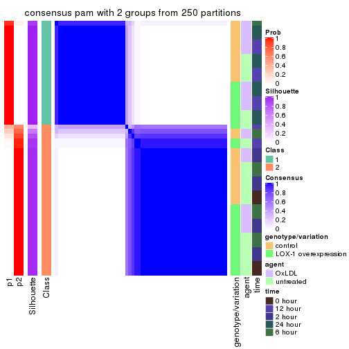</p>

</div>
<div id='tab-ATC-pam-consensus-heatmap-2'>
<pre><code class="r">consensus_heatmap(res, k = 3)
</code></pre>

<p>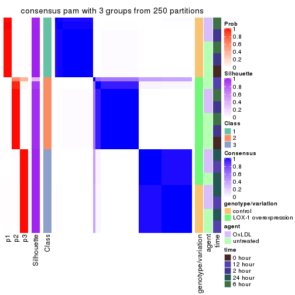</p>

</div>
<div id='tab-ATC-pam-consensus-heatmap-3'>
<pre><code class="r">consensus_heatmap(res, k = 4)
</code></pre>

<p>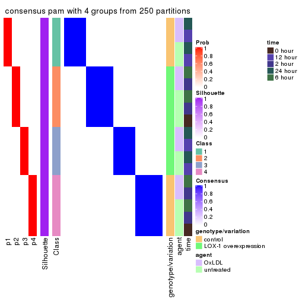</p>

</div>
<div id='tab-ATC-pam-consensus-heatmap-4'>
<pre><code class="r">consensus_heatmap(res, k = 5)
</code></pre>

<p>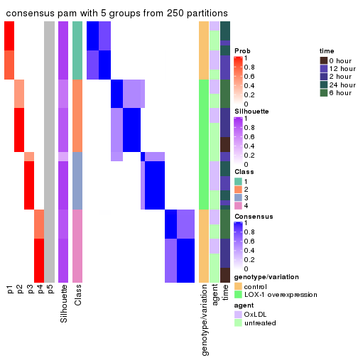</p>

</div>
<div id='tab-ATC-pam-consensus-heatmap-5'>
<pre><code class="r">consensus_heatmap(res, k = 6)
</code></pre>

<p>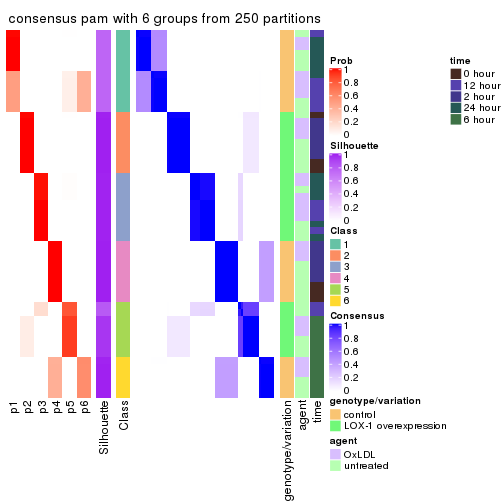</p>

</div>
</div>

Heatmaps for the membership of samples in all partitions to see how consistent they are:


<script>
$( function() {
	$( '#tabs-ATC-pam-membership-heatmap' ).tabs();
} );
</script>
<div id='tabs-ATC-pam-membership-heatmap'>
<ul>
<li><a href='#tab-ATC-pam-membership-heatmap-1'>k = 2</a></li>
<li><a href='#tab-ATC-pam-membership-heatmap-2'>k = 3</a></li>
<li><a href='#tab-ATC-pam-membership-heatmap-3'>k = 4</a></li>
<li><a href='#tab-ATC-pam-membership-heatmap-4'>k = 5</a></li>
<li><a href='#tab-ATC-pam-membership-heatmap-5'>k = 6</a></li>
</ul>
<div id='tab-ATC-pam-membership-heatmap-1'>
<pre><code class="r">membership_heatmap(res, k = 2)
</code></pre>

<p>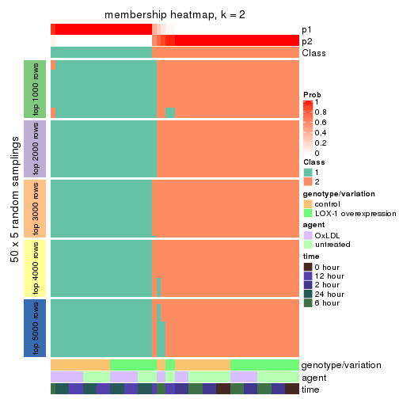</p>

</div>
<div id='tab-ATC-pam-membership-heatmap-2'>
<pre><code class="r">membership_heatmap(res, k = 3)
</code></pre>

<p>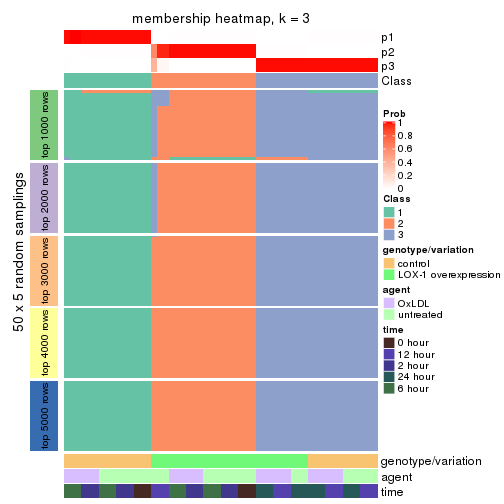</p>

</div>
<div id='tab-ATC-pam-membership-heatmap-3'>
<pre><code class="r">membership_heatmap(res, k = 4)
</code></pre>

<p>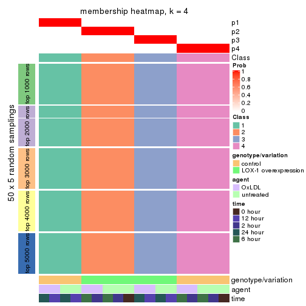</p>

</div>
<div id='tab-ATC-pam-membership-heatmap-4'>
<pre><code class="r">membership_heatmap(res, k = 5)
</code></pre>

<p>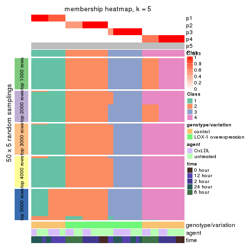</p>

</div>
<div id='tab-ATC-pam-membership-heatmap-5'>
<pre><code class="r">membership_heatmap(res, k = 6)
</code></pre>

<p>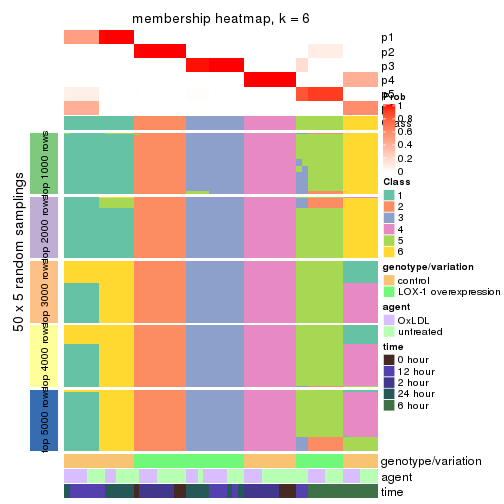</p>

</div>
</div>

As soon as we have had the classes for columns, we can look for signatures
which are significantly different between classes which can be candidate marks
for certain classes. Following are the heatmaps for signatures.


Signature heatmaps where rows are scaled:


<script>
$( function() {
	$( '#tabs-ATC-pam-get-signatures' ).tabs();
} );
</script>
<div id='tabs-ATC-pam-get-signatures'>
<ul>
<li><a href='#tab-ATC-pam-get-signatures-1'>k = 2</a></li>
<li><a href='#tab-ATC-pam-get-signatures-2'>k = 3</a></li>
<li><a href='#tab-ATC-pam-get-signatures-3'>k = 4</a></li>
<li><a href='#tab-ATC-pam-get-signatures-4'>k = 5</a></li>
<li><a href='#tab-ATC-pam-get-signatures-5'>k = 6</a></li>
</ul>
<div id='tab-ATC-pam-get-signatures-1'>
<pre><code class="r">get_signatures(res, k = 2)
</code></pre>

<p>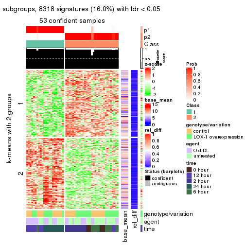</p>

</div>
<div id='tab-ATC-pam-get-signatures-2'>
<pre><code class="r">get_signatures(res, k = 3)
</code></pre>

<p>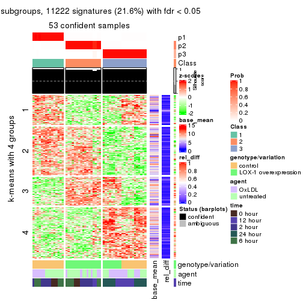</p>

</div>
<div id='tab-ATC-pam-get-signatures-3'>
<pre><code class="r">get_signatures(res, k = 4)
</code></pre>

<p>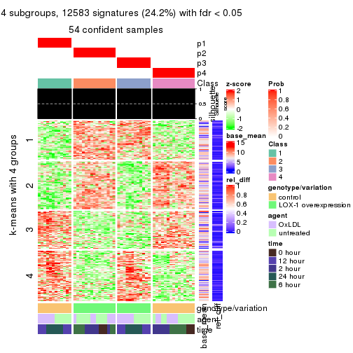</p>

</div>
<div id='tab-ATC-pam-get-signatures-4'>
<pre><code class="r">get_signatures(res, k = 5)
</code></pre>

<p>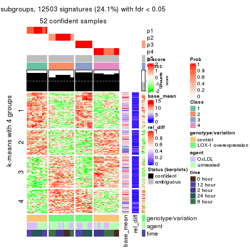</p>

</div>
<div id='tab-ATC-pam-get-signatures-5'>
<pre><code class="r">get_signatures(res, k = 6)
</code></pre>

<p>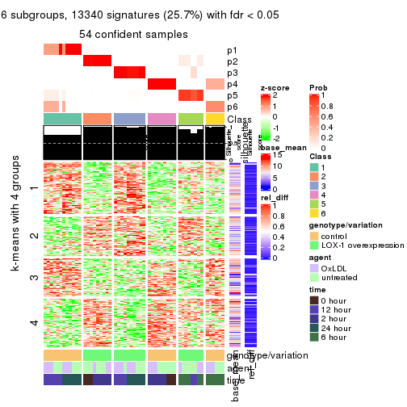</p>

</div>
</div>


Signature heatmaps where rows are not scaled:


<script>
$( function() {
	$( '#tabs-ATC-pam-get-signatures-no-scale' ).tabs();
} );
</script>
<div id='tabs-ATC-pam-get-signatures-no-scale'>
<ul>
<li><a href='#tab-ATC-pam-get-signatures-no-scale-1'>k = 2</a></li>
<li><a href='#tab-ATC-pam-get-signatures-no-scale-2'>k = 3</a></li>
<li><a href='#tab-ATC-pam-get-signatures-no-scale-3'>k = 4</a></li>
<li><a href='#tab-ATC-pam-get-signatures-no-scale-4'>k = 5</a></li>
<li><a href='#tab-ATC-pam-get-signatures-no-scale-5'>k = 6</a></li>
</ul>
<div id='tab-ATC-pam-get-signatures-no-scale-1'>
<pre><code class="r">get_signatures(res, k = 2, scale_rows = FALSE)
</code></pre>

<p>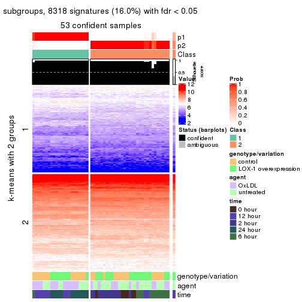</p>

</div>
<div id='tab-ATC-pam-get-signatures-no-scale-2'>
<pre><code class="r">get_signatures(res, k = 3, scale_rows = FALSE)
</code></pre>

<p>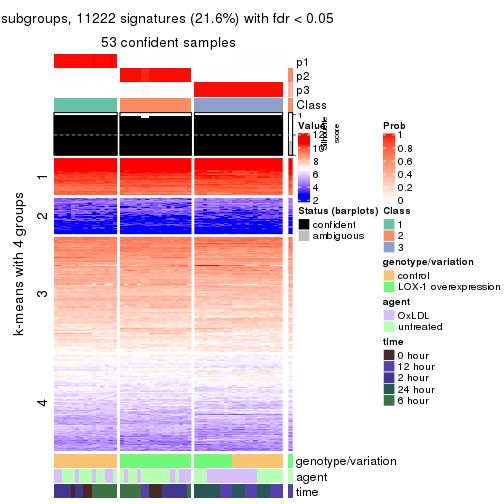</p>

</div>
<div id='tab-ATC-pam-get-signatures-no-scale-3'>
<pre><code class="r">get_signatures(res, k = 4, scale_rows = FALSE)
</code></pre>

<p>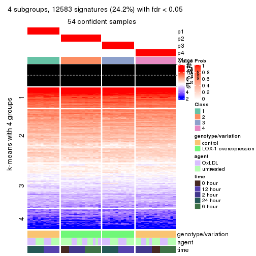</p>

</div>
<div id='tab-ATC-pam-get-signatures-no-scale-4'>
<pre><code class="r">get_signatures(res, k = 5, scale_rows = FALSE)
</code></pre>

<p>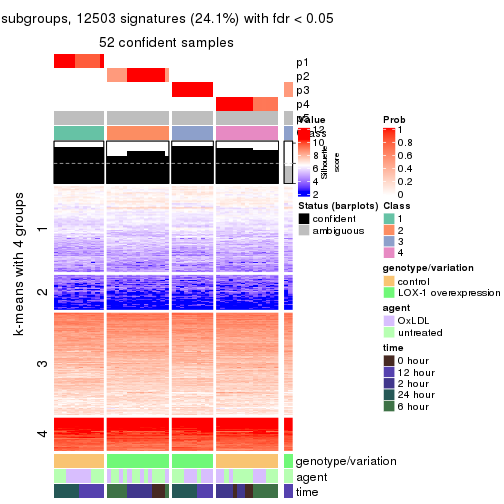</p>

</div>
<div id='tab-ATC-pam-get-signatures-no-scale-5'>
<pre><code class="r">get_signatures(res, k = 6, scale_rows = FALSE)
</code></pre>

<p>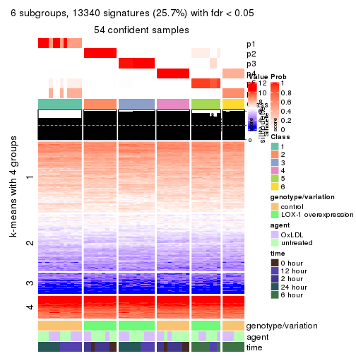</p>

</div>
</div>


Compare the overlap of signatures from different k:

```r
compare_signatures(res)
```

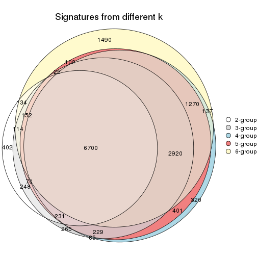

`get_signature()` returns a data frame invisibly. TO get the list of signatures, the function
call should be assigned to a variable explicitly. In following code, if `plot` argument is set
to `FALSE`, no heatmap is plotted while only the differential analysis is performed.

```r
# code only for demonstration
tb = get_signature(res, k = ..., plot = FALSE)
```

An example of the output of `tb` is:

```
#>   which_row         fdr    mean_1    mean_2 scaled_mean_1 scaled_mean_2 km
#> 1        38 0.042760348  8.373488  9.131774    -0.5533452     0.5164555  1
#> 2        40 0.018707592  7.106213  8.469186    -0.6173731     0.5762149  1
#> 3        55 0.019134737 10.221463 11.207825    -0.6159697     0.5749050  1
#> 4        59 0.006059896  5.921854  7.869574    -0.6899429     0.6439467  1
#> 5        60 0.018055526  8.928898 10.211722    -0.6204761     0.5791110  1
#> 6        98 0.009384629 15.714769 14.887706     0.6635654    -0.6193277  2
...
```

The columns in `tb` are:

1. `which_row`: row indices corresponding to the input matrix.
2. `fdr`: FDR for the differential test. 
3. `mean_x`: The mean value in group x.
4. `scaled_mean_x`: The mean value in group x after rows are scaled.
5. `km`: Row groups if k-means clustering is applied to rows.


UMAP plot which shows how samples are separated.


<script>
$( function() {
	$( '#tabs-ATC-pam-dimension-reduction' ).tabs();
} );
</script>
<div id='tabs-ATC-pam-dimension-reduction'>
<ul>
<li><a href='#tab-ATC-pam-dimension-reduction-1'>k = 2</a></li>
<li><a href='#tab-ATC-pam-dimension-reduction-2'>k = 3</a></li>
<li><a href='#tab-ATC-pam-dimension-reduction-3'>k = 4</a></li>
<li><a href='#tab-ATC-pam-dimension-reduction-4'>k = 5</a></li>
<li><a href='#tab-ATC-pam-dimension-reduction-5'>k = 6</a></li>
</ul>
<div id='tab-ATC-pam-dimension-reduction-1'>
<pre><code class="r">dimension_reduction(res, k = 2, method = &quot;UMAP&quot;)
</code></pre>

<p>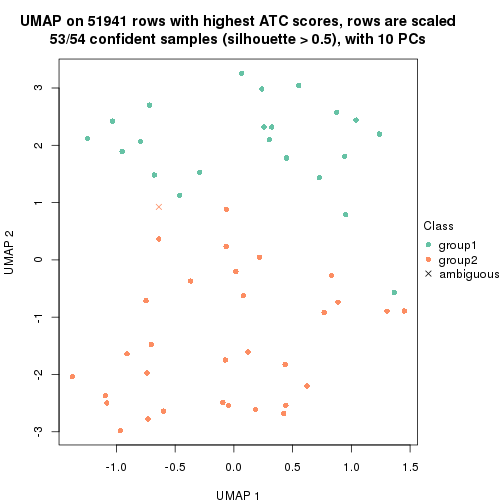</p>

</div>
<div id='tab-ATC-pam-dimension-reduction-2'>
<pre><code class="r">dimension_reduction(res, k = 3, method = &quot;UMAP&quot;)
</code></pre>

<p>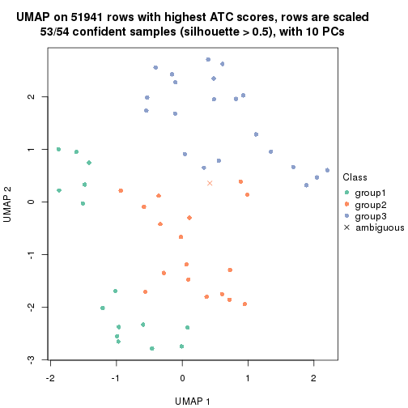</p>

</div>
<div id='tab-ATC-pam-dimension-reduction-3'>
<pre><code class="r">dimension_reduction(res, k = 4, method = &quot;UMAP&quot;)
</code></pre>

<p></p>

</div>
<div id='tab-ATC-pam-dimension-reduction-4'>
<pre><code class="r">dimension_reduction(res, k = 5, method = &quot;UMAP&quot;)
</code></pre>

<p>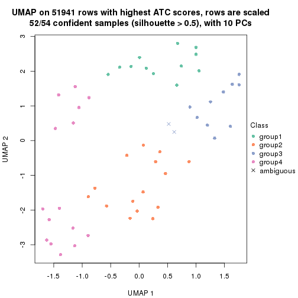</p>

</div>
<div id='tab-ATC-pam-dimension-reduction-5'>
<pre><code class="r">dimension_reduction(res, k = 6, method = &quot;UMAP&quot;)
</code></pre>

<p>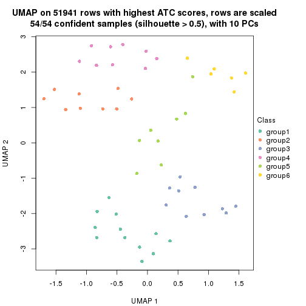</p>

</div>
</div>


Following heatmap shows how subgroups are split when increasing `k`:

```r
collect_classes(res)
```

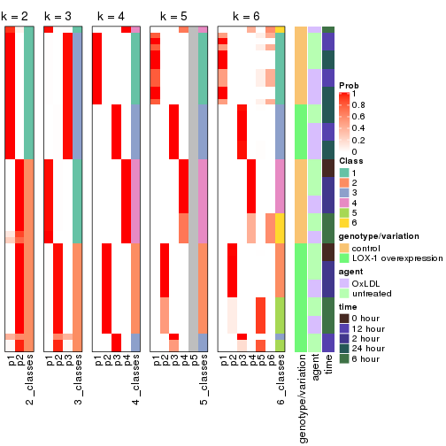


Test correlation between subgroups and known annotations. If the known
annotation is numeric, one-way ANOVA test is applied, and if the known
annotation is discrete, chi-squared contingency table test is applied.

```r
test_to_known_factors(res)
```

```
#>          n genotype/variation(p) agent(p)  time(p) k
#> ATC:pam 53              4.71e-01    0.155 1.32e-08 2
#> ATC:pam 53              9.12e-08    0.360 1.61e-07 3
#> ATC:pam 54              1.12e-11    0.910 2.73e-07 4
#> ATC:pam 52              3.00e-11    0.729 5.01e-07 5
#> ATC:pam 54              2.10e-10    0.812 1.31e-12 6
```


If matrix rows can be associated to genes, consider to use `functional_enrichment(res,
...)` to perform function enrichment for the signature genes. See [this vignette](http://bioconductor.org/packages/devel/bioc/vignettes/cola/inst/doc/functional_enrichment.html) for more detailed explanations.


 

---------------------------------------------------


### ATC:mclust*


The object with results only for a single top-value method and a single partition method 
can be extracted as:

```r
res = res_list["ATC", "mclust"]
# you can also extract it by
# res = res_list["ATC:mclust"]
```

A summary of `res` and all the functions that can be applied to it:

```r
res
```

```
#> A 'ConsensusPartition' object with k = 2, 3, 4, 5, 6.
#>   On a matrix with 51941 rows and 54 columns.
#>   Top rows (1000, 2000, 3000, 4000, 5000) are extracted by 'ATC' method.
#>   Subgroups are detected by 'mclust' method.
#>   Performed in total 1250 partitions by row resampling.
#>   Best k for subgroups seems to be 6.
#> 
#> Following methods can be applied to this 'ConsensusPartition' object:
#>  [1] "cola_report"             "collect_classes"         "collect_plots"          
#>  [4] "collect_stats"           "colnames"                "compare_signatures"     
#>  [7] "consensus_heatmap"       "dimension_reduction"     "functional_enrichment"  
#> [10] "get_anno_col"            "get_anno"                "get_classes"            
#> [13] "get_consensus"           "get_matrix"              "get_membership"         
#> [16] "get_param"               "get_signatures"          "get_stats"              
#> [19] "is_best_k"               "is_stable_k"             "membership_heatmap"     
#> [22] "ncol"                    "nrow"                    "plot_ecdf"              
#> [25] "rownames"                "select_partition_number" "show"                   
#> [28] "suggest_best_k"          "test_to_known_factors"
```

`collect_plots()` function collects all the plots made from `res` for all `k` (number of partitions)
into one single page to provide an easy and fast comparison between different `k`.

```r
collect_plots(res)
```

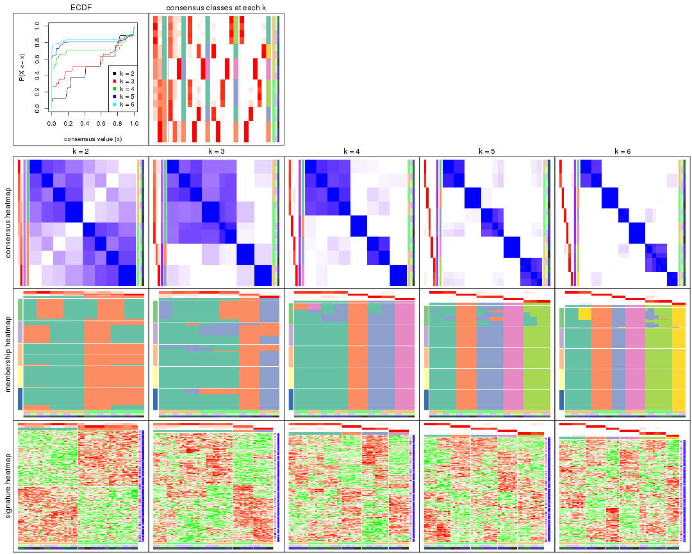

The plots are:

- The first row: a plot of the ECDF (empirical cumulative distribution
  function) curves of the consensus matrix for each `k` and the heatmap of
  predicted classes for each `k`.
- The second row: heatmaps of the consensus matrix for each `k`.
- The third row: heatmaps of the membership matrix for each `k`.
- The fouth row: heatmaps of the signatures for each `k`.

All the plots in panels can be made by individual functions and they are
plotted later in this section.

`select_partition_number()` produces several plots showing different
statistics for choosing "optimized" `k`. There are following statistics:

- ECDF curves of the consensus matrix for each `k`;
- 1-PAC. [The PAC
  score](https://en.wikipedia.org/wiki/Consensus_clustering#Over-interpretation_potential_of_consensus_clustering)
  measures the proportion of the ambiguous subgrouping.
- Mean silhouette score.
- Concordance. The mean probability of fiting the consensus class ids in all
  partitions.
- Area increased. Denote $A_k$ as the area under the ECDF curve for current
  `k`, the area increased is defined as $A_k - A_{k-1}$.
- Rand index. The percent of pairs of samples that are both in a same cluster
  or both are not in a same cluster in the partition of k and k-1.
- Jaccard index. The ratio of pairs of samples are both in a same cluster in
  the partition of k and k-1 and the pairs of samples are both in a same
  cluster in the partition k or k-1.

The detailed explanations of these statistics can be found in [the _cola_
vignette](http://bioconductor.org/packages/devel/bioc/vignettes/cola/inst/doc/cola.html#toc_13).

Generally speaking, lower PAC score, higher mean silhouette score or higher
concordance corresponds to better partition. Rand index and Jaccard index
measure how similar the current partition is compared to partition with `k-1`.
If they are too similar, we won't accept `k` is better than `k-1`.

```r
select_partition_number(res)
```

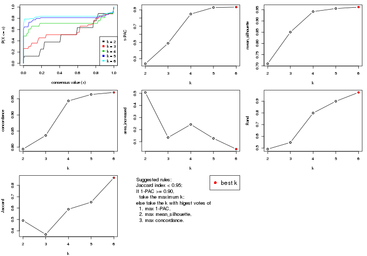

The numeric values for all these statistics can be obtained by `get_stats()`.

```r
get_stats(res)
```

```
#>   k 1-PAC mean_silhouette concordance area_increased  Rand Jaccard
#> 2 2 0.239           0.709       0.794         0.5072 0.491   0.491
#> 3 3 0.491           0.850       0.836         0.1346 0.547   0.368
#> 4 4 0.849           0.942       0.944         0.2424 0.799   0.590
#> 5 5 0.929           0.955       0.964         0.1272 0.899   0.652
#> 6 6 0.934           0.962       0.970         0.0388 0.975   0.867
```

`suggest_best_k()` suggests the best $k$ based on these statistics. The rules are as follows:

- All $k$ with Jaccard index larger than 0.95 are removed because increasing
  $k$ does not provide enough extra information. If all $k$ are removed, it is
  marked as no subgroup is detected.
- For all $k$ with 1-PAC score larger than 0.9, the maximal $k$ is taken as
  the best $k$, and other $k$ are marked as optional $k$.
- If it does not fit the second rule. The $k$ with the maximal vote of the
  highest 1-PAC score, highest mean silhouette, and highest concordance is
  taken as the best $k$.

```r
suggest_best_k(res)
```

```
#> [1] 6
#> attr(,"optional")
#> [1] 5
```

There is also optional best $k$ = 5 that is worth to check.

Following shows the table of the partitions (You need to click the **show/hide
code output** link to see it). The membership matrix (columns with name `p*`)
is inferred by
[`clue::cl_consensus()`](https://www.rdocumentation.org/link/cl_consensus?package=clue)
function with the `SE` method. Basically the value in the membership matrix
represents the probability to belong to a certain group. The finall class
label for an item is determined with the group with highest probability it
belongs to.

In `get_classes()` function, the entropy is calculated from the membership
matrix and the silhouette score is calculated from the consensus matrix.


<script>
$( function() {
	$( '#tabs-ATC-mclust-get-classes' ).tabs();
} );
</script>
<div id='tabs-ATC-mclust-get-classes'>
<ul>
<li><a href='#tab-ATC-mclust-get-classes-1'>k = 2</a></li>
<li><a href='#tab-ATC-mclust-get-classes-2'>k = 3</a></li>
<li><a href='#tab-ATC-mclust-get-classes-3'>k = 4</a></li>
<li><a href='#tab-ATC-mclust-get-classes-4'>k = 5</a></li>
<li><a href='#tab-ATC-mclust-get-classes-5'>k = 6</a></li>
</ul>

<div id='tab-ATC-mclust-get-classes-1'>
<p><a id='tab-ATC-mclust-get-classes-1-a' style='color:#0366d6' href='#'>show/hide code output</a></p>
<pre><code class="r">cbind(get_classes(res, k = 2), get_membership(res, k = 2))
</code></pre>

<pre><code>#&gt;           class entropy silhouette    p1    p2
#&gt; GSM329068     2   0.000      0.732 0.000 1.000
#&gt; GSM329074     2   0.000      0.732 0.000 1.000
#&gt; GSM329100     2   0.000      0.732 0.000 1.000
#&gt; GSM329062     2   0.000      0.732 0.000 1.000
#&gt; GSM329079     2   0.000      0.732 0.000 1.000
#&gt; GSM329090     2   0.000      0.732 0.000 1.000
#&gt; GSM329066     2   0.781      0.703 0.232 0.768
#&gt; GSM329086     2   0.781      0.703 0.232 0.768
#&gt; GSM329099     2   0.781      0.703 0.232 0.768
#&gt; GSM329071     2   0.978      0.680 0.412 0.588
#&gt; GSM329078     2   0.978      0.680 0.412 0.588
#&gt; GSM329081     2   0.978      0.680 0.412 0.588
#&gt; GSM329096     2   0.689      0.711 0.184 0.816
#&gt; GSM329102     2   0.689      0.711 0.184 0.816
#&gt; GSM329104     2   0.689      0.711 0.184 0.816
#&gt; GSM329067     2   0.000      0.732 0.000 1.000
#&gt; GSM329072     2   0.000      0.732 0.000 1.000
#&gt; GSM329075     2   0.000      0.732 0.000 1.000
#&gt; GSM329058     2   0.781      0.703 0.232 0.768
#&gt; GSM329073     2   0.781      0.703 0.232 0.768
#&gt; GSM329107     2   0.781      0.703 0.232 0.768
#&gt; GSM329057     2   0.978      0.680 0.412 0.588
#&gt; GSM329085     2   0.978      0.680 0.412 0.588
#&gt; GSM329089     2   0.978      0.680 0.412 0.588
#&gt; GSM329076     2   0.689      0.711 0.184 0.816
#&gt; GSM329094     2   0.689      0.711 0.184 0.816
#&gt; GSM329105     2   0.689      0.711 0.184 0.816
#&gt; GSM329056     1   0.978      0.732 0.588 0.412
#&gt; GSM329069     1   0.978      0.732 0.588 0.412
#&gt; GSM329077     1   0.978      0.732 0.588 0.412
#&gt; GSM329070     1   0.978      0.732 0.588 0.412
#&gt; GSM329082     1   0.978      0.732 0.588 0.412
#&gt; GSM329092     1   0.978      0.732 0.588 0.412
#&gt; GSM329083     1   0.680      0.703 0.820 0.180
#&gt; GSM329101     1   0.680      0.703 0.820 0.180
#&gt; GSM329106     1   0.680      0.703 0.820 0.180
#&gt; GSM329087     1   0.000      0.680 1.000 0.000
#&gt; GSM329091     1   0.000      0.680 1.000 0.000
#&gt; GSM329093     1   0.000      0.680 1.000 0.000
#&gt; GSM329080     1   0.775      0.711 0.772 0.228
#&gt; GSM329084     1   0.775      0.711 0.772 0.228
#&gt; GSM329088     1   0.775      0.711 0.772 0.228
#&gt; GSM329059     1   0.978      0.732 0.588 0.412
#&gt; GSM329097     1   0.978      0.732 0.588 0.412
#&gt; GSM329098     1   0.978      0.732 0.588 0.412
#&gt; GSM329055     1   0.680      0.703 0.820 0.180
#&gt; GSM329103     1   0.680      0.703 0.820 0.180
#&gt; GSM329108     1   0.680      0.703 0.820 0.180
#&gt; GSM329061     1   0.000      0.680 1.000 0.000
#&gt; GSM329064     1   0.000      0.680 1.000 0.000
#&gt; GSM329065     1   0.000      0.680 1.000 0.000
#&gt; GSM329060     1   0.775      0.711 0.772 0.228
#&gt; GSM329063     1   0.775      0.711 0.772 0.228
#&gt; GSM329095     1   0.775      0.711 0.772 0.228
</code></pre>

<script>
$('#tab-ATC-mclust-get-classes-1-a').parent().next().next().hide();
$('#tab-ATC-mclust-get-classes-1-a').click(function(){
  $('#tab-ATC-mclust-get-classes-1-a').parent().next().next().toggle();
  return(false);
});
</script>
</div>

<div id='tab-ATC-mclust-get-classes-2'>
<p><a id='tab-ATC-mclust-get-classes-2-a' style='color:#0366d6' href='#'>show/hide code output</a></p>
<pre><code class="r">cbind(get_classes(res, k = 3), get_membership(res, k = 3))
</code></pre>

<pre><code>#&gt;           class entropy silhouette    p1    p2    p3
#&gt; GSM329068     2   0.578      1.000 0.052 0.788 0.160
#&gt; GSM329074     2   0.578      1.000 0.052 0.788 0.160
#&gt; GSM329100     2   0.578      1.000 0.052 0.788 0.160
#&gt; GSM329062     2   0.578      1.000 0.052 0.788 0.160
#&gt; GSM329079     2   0.578      1.000 0.052 0.788 0.160
#&gt; GSM329090     2   0.578      1.000 0.052 0.788 0.160
#&gt; GSM329066     1   0.455      0.725 0.800 0.200 0.000
#&gt; GSM329086     1   0.455      0.725 0.800 0.200 0.000
#&gt; GSM329099     1   0.455      0.725 0.800 0.200 0.000
#&gt; GSM329071     1   0.455      0.725 0.800 0.200 0.000
#&gt; GSM329078     1   0.455      0.725 0.800 0.200 0.000
#&gt; GSM329081     1   0.455      0.725 0.800 0.200 0.000
#&gt; GSM329096     1   0.141      0.812 0.964 0.036 0.000
#&gt; GSM329102     1   0.129      0.813 0.968 0.032 0.000
#&gt; GSM329104     1   0.129      0.813 0.968 0.032 0.000
#&gt; GSM329067     2   0.578      1.000 0.052 0.788 0.160
#&gt; GSM329072     2   0.578      1.000 0.052 0.788 0.160
#&gt; GSM329075     2   0.578      1.000 0.052 0.788 0.160
#&gt; GSM329058     1   0.455      0.725 0.800 0.200 0.000
#&gt; GSM329073     1   0.455      0.725 0.800 0.200 0.000
#&gt; GSM329107     1   0.455      0.725 0.800 0.200 0.000
#&gt; GSM329057     1   0.129      0.808 0.968 0.032 0.000
#&gt; GSM329085     1   0.129      0.808 0.968 0.032 0.000
#&gt; GSM329089     1   0.129      0.808 0.968 0.032 0.000
#&gt; GSM329076     1   0.129      0.813 0.968 0.032 0.000
#&gt; GSM329094     1   0.129      0.813 0.968 0.032 0.000
#&gt; GSM329105     1   0.129      0.813 0.968 0.032 0.000
#&gt; GSM329056     3   0.000      1.000 0.000 0.000 1.000
#&gt; GSM329069     3   0.000      1.000 0.000 0.000 1.000
#&gt; GSM329077     3   0.000      1.000 0.000 0.000 1.000
#&gt; GSM329070     3   0.000      1.000 0.000 0.000 1.000
#&gt; GSM329082     3   0.000      1.000 0.000 0.000 1.000
#&gt; GSM329092     3   0.000      1.000 0.000 0.000 1.000
#&gt; GSM329083     1   0.808      0.741 0.652 0.180 0.168
#&gt; GSM329101     1   0.808      0.741 0.652 0.180 0.168
#&gt; GSM329106     1   0.808      0.741 0.652 0.180 0.168
#&gt; GSM329087     1   0.429      0.811 0.820 0.180 0.000
#&gt; GSM329091     1   0.429      0.811 0.820 0.180 0.000
#&gt; GSM329093     1   0.429      0.811 0.820 0.180 0.000
#&gt; GSM329080     1   0.649      0.798 0.756 0.160 0.084
#&gt; GSM329084     1   0.649      0.798 0.756 0.160 0.084
#&gt; GSM329088     1   0.649      0.798 0.756 0.160 0.084
#&gt; GSM329059     3   0.000      1.000 0.000 0.000 1.000
#&gt; GSM329097     3   0.000      1.000 0.000 0.000 1.000
#&gt; GSM329098     3   0.000      1.000 0.000 0.000 1.000
#&gt; GSM329055     1   0.808      0.741 0.652 0.180 0.168
#&gt; GSM329103     1   0.808      0.741 0.652 0.180 0.168
#&gt; GSM329108     1   0.808      0.741 0.652 0.180 0.168
#&gt; GSM329061     1   0.429      0.811 0.820 0.180 0.000
#&gt; GSM329064     1   0.429      0.811 0.820 0.180 0.000
#&gt; GSM329065     1   0.429      0.811 0.820 0.180 0.000
#&gt; GSM329060     1   0.649      0.798 0.756 0.160 0.084
#&gt; GSM329063     1   0.649      0.798 0.756 0.160 0.084
#&gt; GSM329095     1   0.649      0.798 0.756 0.160 0.084
</code></pre>

<script>
$('#tab-ATC-mclust-get-classes-2-a').parent().next().next().hide();
$('#tab-ATC-mclust-get-classes-2-a').click(function(){
  $('#tab-ATC-mclust-get-classes-2-a').parent().next().next().toggle();
  return(false);
});
</script>
</div>

<div id='tab-ATC-mclust-get-classes-3'>
<p><a id='tab-ATC-mclust-get-classes-3-a' style='color:#0366d6' href='#'>show/hide code output</a></p>
<pre><code class="r">cbind(get_classes(res, k = 4), get_membership(res, k = 4))
</code></pre>

<pre><code>#&gt;           class entropy silhouette    p1   p2    p3   p4
#&gt; GSM329068     2   0.000      1.000 0.000 1.00 0.000 0.00
#&gt; GSM329074     2   0.000      1.000 0.000 1.00 0.000 0.00
#&gt; GSM329100     2   0.000      1.000 0.000 1.00 0.000 0.00
#&gt; GSM329062     2   0.000      1.000 0.000 1.00 0.000 0.00
#&gt; GSM329079     2   0.000      1.000 0.000 1.00 0.000 0.00
#&gt; GSM329090     2   0.000      1.000 0.000 1.00 0.000 0.00
#&gt; GSM329066     1   0.274      0.899 0.904 0.06 0.036 0.00
#&gt; GSM329086     1   0.274      0.899 0.904 0.06 0.036 0.00
#&gt; GSM329099     1   0.274      0.899 0.904 0.06 0.036 0.00
#&gt; GSM329071     1   0.336      0.894 0.824 0.00 0.176 0.00
#&gt; GSM329078     1   0.336      0.894 0.824 0.00 0.176 0.00
#&gt; GSM329081     1   0.336      0.894 0.824 0.00 0.176 0.00
#&gt; GSM329096     3   0.000      0.943 0.000 0.00 1.000 0.00
#&gt; GSM329102     3   0.000      0.943 0.000 0.00 1.000 0.00
#&gt; GSM329104     3   0.000      0.943 0.000 0.00 1.000 0.00
#&gt; GSM329067     2   0.000      1.000 0.000 1.00 0.000 0.00
#&gt; GSM329072     2   0.000      1.000 0.000 1.00 0.000 0.00
#&gt; GSM329075     2   0.000      1.000 0.000 1.00 0.000 0.00
#&gt; GSM329058     1   0.274      0.899 0.904 0.06 0.036 0.00
#&gt; GSM329073     1   0.274      0.899 0.904 0.06 0.036 0.00
#&gt; GSM329107     1   0.274      0.899 0.904 0.06 0.036 0.00
#&gt; GSM329057     1   0.336      0.894 0.824 0.00 0.176 0.00
#&gt; GSM329085     1   0.336      0.894 0.824 0.00 0.176 0.00
#&gt; GSM329089     1   0.336      0.894 0.824 0.00 0.176 0.00
#&gt; GSM329076     3   0.000      0.943 0.000 0.00 1.000 0.00
#&gt; GSM329094     3   0.000      0.943 0.000 0.00 1.000 0.00
#&gt; GSM329105     3   0.000      0.943 0.000 0.00 1.000 0.00
#&gt; GSM329056     4   0.000      1.000 0.000 0.00 0.000 1.00
#&gt; GSM329069     4   0.000      1.000 0.000 0.00 0.000 1.00
#&gt; GSM329077     4   0.000      1.000 0.000 0.00 0.000 1.00
#&gt; GSM329070     4   0.000      1.000 0.000 0.00 0.000 1.00
#&gt; GSM329082     4   0.000      1.000 0.000 0.00 0.000 1.00
#&gt; GSM329092     4   0.000      1.000 0.000 0.00 0.000 1.00
#&gt; GSM329083     1   0.164      0.899 0.940 0.00 0.000 0.06
#&gt; GSM329101     1   0.164      0.899 0.940 0.00 0.000 0.06
#&gt; GSM329106     1   0.164      0.899 0.940 0.00 0.000 0.06
#&gt; GSM329087     1   0.208      0.894 0.916 0.00 0.084 0.00
#&gt; GSM329091     1   0.208      0.894 0.916 0.00 0.084 0.00
#&gt; GSM329093     1   0.208      0.894 0.916 0.00 0.084 0.00
#&gt; GSM329080     3   0.222      0.943 0.092 0.00 0.908 0.00
#&gt; GSM329084     3   0.222      0.943 0.092 0.00 0.908 0.00
#&gt; GSM329088     3   0.222      0.943 0.092 0.00 0.908 0.00
#&gt; GSM329059     4   0.000      1.000 0.000 0.00 0.000 1.00
#&gt; GSM329097     4   0.000      1.000 0.000 0.00 0.000 1.00
#&gt; GSM329098     4   0.000      1.000 0.000 0.00 0.000 1.00
#&gt; GSM329055     1   0.164      0.899 0.940 0.00 0.000 0.06
#&gt; GSM329103     1   0.164      0.899 0.940 0.00 0.000 0.06
#&gt; GSM329108     1   0.164      0.899 0.940 0.00 0.000 0.06
#&gt; GSM329061     1   0.208      0.894 0.916 0.00 0.084 0.00
#&gt; GSM329064     1   0.208      0.894 0.916 0.00 0.084 0.00
#&gt; GSM329065     1   0.208      0.894 0.916 0.00 0.084 0.00
#&gt; GSM329060     3   0.222      0.943 0.092 0.00 0.908 0.00
#&gt; GSM329063     3   0.222      0.943 0.092 0.00 0.908 0.00
#&gt; GSM329095     3   0.222      0.943 0.092 0.00 0.908 0.00
</code></pre>

<script>
$('#tab-ATC-mclust-get-classes-3-a').parent().next().next().hide();
$('#tab-ATC-mclust-get-classes-3-a').click(function(){
  $('#tab-ATC-mclust-get-classes-3-a').parent().next().next().toggle();
  return(false);
});
</script>
</div>

<div id='tab-ATC-mclust-get-classes-4'>
<p><a id='tab-ATC-mclust-get-classes-4-a' style='color:#0366d6' href='#'>show/hide code output</a></p>
<pre><code class="r">cbind(get_classes(res, k = 5), get_membership(res, k = 5))
</code></pre>

<pre><code>#&gt;           class entropy silhouette    p1    p2    p3    p4    p5
#&gt; GSM329068     2  0.0000      1.000 0.000 1.000 0.000 0.000 0.000
#&gt; GSM329074     2  0.0000      1.000 0.000 1.000 0.000 0.000 0.000
#&gt; GSM329100     2  0.0000      1.000 0.000 1.000 0.000 0.000 0.000
#&gt; GSM329062     2  0.0000      1.000 0.000 1.000 0.000 0.000 0.000
#&gt; GSM329079     2  0.0000      1.000 0.000 1.000 0.000 0.000 0.000
#&gt; GSM329090     2  0.0000      1.000 0.000 1.000 0.000 0.000 0.000
#&gt; GSM329066     3  0.1270      0.915 0.000 0.052 0.948 0.000 0.000
#&gt; GSM329086     3  0.1270      0.915 0.000 0.052 0.948 0.000 0.000
#&gt; GSM329099     3  0.1270      0.915 0.000 0.052 0.948 0.000 0.000
#&gt; GSM329071     3  0.1270      0.912 0.052 0.000 0.948 0.000 0.000
#&gt; GSM329078     3  0.1270      0.912 0.052 0.000 0.948 0.000 0.000
#&gt; GSM329081     3  0.1270      0.912 0.052 0.000 0.948 0.000 0.000
#&gt; GSM329096     1  0.1270      0.970 0.948 0.000 0.052 0.000 0.000
#&gt; GSM329102     1  0.1270      0.970 0.948 0.000 0.052 0.000 0.000
#&gt; GSM329104     1  0.1270      0.970 0.948 0.000 0.052 0.000 0.000
#&gt; GSM329067     2  0.0000      1.000 0.000 1.000 0.000 0.000 0.000
#&gt; GSM329072     2  0.0000      1.000 0.000 1.000 0.000 0.000 0.000
#&gt; GSM329075     2  0.0000      1.000 0.000 1.000 0.000 0.000 0.000
#&gt; GSM329058     3  0.1270      0.915 0.000 0.052 0.948 0.000 0.000
#&gt; GSM329073     3  0.1270      0.915 0.000 0.052 0.948 0.000 0.000
#&gt; GSM329107     3  0.1270      0.915 0.000 0.052 0.948 0.000 0.000
#&gt; GSM329057     3  0.2424      0.862 0.132 0.000 0.868 0.000 0.000
#&gt; GSM329085     3  0.2424      0.862 0.132 0.000 0.868 0.000 0.000
#&gt; GSM329089     3  0.2424      0.862 0.132 0.000 0.868 0.000 0.000
#&gt; GSM329076     1  0.1270      0.970 0.948 0.000 0.052 0.000 0.000
#&gt; GSM329094     1  0.1270      0.970 0.948 0.000 0.052 0.000 0.000
#&gt; GSM329105     1  0.1270      0.970 0.948 0.000 0.052 0.000 0.000
#&gt; GSM329056     4  0.0000      1.000 0.000 0.000 0.000 1.000 0.000
#&gt; GSM329069     4  0.0000      1.000 0.000 0.000 0.000 1.000 0.000
#&gt; GSM329077     4  0.0000      1.000 0.000 0.000 0.000 1.000 0.000
#&gt; GSM329070     4  0.0000      1.000 0.000 0.000 0.000 1.000 0.000
#&gt; GSM329082     4  0.0000      1.000 0.000 0.000 0.000 1.000 0.000
#&gt; GSM329092     4  0.0000      1.000 0.000 0.000 0.000 1.000 0.000
#&gt; GSM329083     5  0.0162      0.935 0.000 0.000 0.000 0.004 0.996
#&gt; GSM329101     5  0.0162      0.935 0.000 0.000 0.000 0.004 0.996
#&gt; GSM329106     5  0.0162      0.935 0.000 0.000 0.000 0.004 0.996
#&gt; GSM329087     5  0.1851      0.933 0.088 0.000 0.000 0.000 0.912
#&gt; GSM329091     5  0.1851      0.933 0.088 0.000 0.000 0.000 0.912
#&gt; GSM329093     5  0.1851      0.933 0.088 0.000 0.000 0.000 0.912
#&gt; GSM329080     1  0.0000      0.971 1.000 0.000 0.000 0.000 0.000
#&gt; GSM329084     1  0.0000      0.971 1.000 0.000 0.000 0.000 0.000
#&gt; GSM329088     1  0.0000      0.971 1.000 0.000 0.000 0.000 0.000
#&gt; GSM329059     4  0.0000      1.000 0.000 0.000 0.000 1.000 0.000
#&gt; GSM329097     4  0.0000      1.000 0.000 0.000 0.000 1.000 0.000
#&gt; GSM329098     4  0.0000      1.000 0.000 0.000 0.000 1.000 0.000
#&gt; GSM329055     5  0.0162      0.935 0.000 0.000 0.000 0.004 0.996
#&gt; GSM329103     5  0.0162      0.935 0.000 0.000 0.000 0.004 0.996
#&gt; GSM329108     5  0.0162      0.935 0.000 0.000 0.000 0.004 0.996
#&gt; GSM329061     5  0.2471      0.905 0.136 0.000 0.000 0.000 0.864
#&gt; GSM329064     5  0.2471      0.905 0.136 0.000 0.000 0.000 0.864
#&gt; GSM329065     5  0.2471      0.905 0.136 0.000 0.000 0.000 0.864
#&gt; GSM329060     1  0.0000      0.971 1.000 0.000 0.000 0.000 0.000
#&gt; GSM329063     1  0.0000      0.971 1.000 0.000 0.000 0.000 0.000
#&gt; GSM329095     1  0.0000      0.971 1.000 0.000 0.000 0.000 0.000
</code></pre>

<script>
$('#tab-ATC-mclust-get-classes-4-a').parent().next().next().hide();
$('#tab-ATC-mclust-get-classes-4-a').click(function(){
  $('#tab-ATC-mclust-get-classes-4-a').parent().next().next().toggle();
  return(false);
});
</script>
</div>

<div id='tab-ATC-mclust-get-classes-5'>
<p><a id='tab-ATC-mclust-get-classes-5-a' style='color:#0366d6' href='#'>show/hide code output</a></p>
<pre><code class="r">cbind(get_classes(res, k = 6), get_membership(res, k = 6))
</code></pre>

<pre><code>#&gt;           class entropy silhouette    p1    p2    p3    p4    p5    p6
#&gt; GSM329068     2  0.0000      1.000 0.000 1.000 0.000 0.000 0.000 0.000
#&gt; GSM329074     2  0.0000      1.000 0.000 1.000 0.000 0.000 0.000 0.000
#&gt; GSM329100     2  0.0000      1.000 0.000 1.000 0.000 0.000 0.000 0.000
#&gt; GSM329062     2  0.0000      1.000 0.000 1.000 0.000 0.000 0.000 0.000
#&gt; GSM329079     2  0.0000      1.000 0.000 1.000 0.000 0.000 0.000 0.000
#&gt; GSM329090     2  0.0000      1.000 0.000 1.000 0.000 0.000 0.000 0.000
#&gt; GSM329066     5  0.0260      0.925 0.000 0.008 0.000 0.000 0.992 0.000
#&gt; GSM329086     5  0.0260      0.925 0.000 0.008 0.000 0.000 0.992 0.000
#&gt; GSM329099     5  0.0260      0.925 0.000 0.008 0.000 0.000 0.992 0.000
#&gt; GSM329071     5  0.1387      0.920 0.000 0.000 0.068 0.000 0.932 0.000
#&gt; GSM329078     5  0.2178      0.893 0.000 0.000 0.132 0.000 0.868 0.000
#&gt; GSM329081     5  0.1387      0.920 0.000 0.000 0.068 0.000 0.932 0.000
#&gt; GSM329096     3  0.0000      0.995 0.000 0.000 1.000 0.000 0.000 0.000
#&gt; GSM329102     3  0.0000      0.995 0.000 0.000 1.000 0.000 0.000 0.000
#&gt; GSM329104     3  0.0000      0.995 0.000 0.000 1.000 0.000 0.000 0.000
#&gt; GSM329067     2  0.0000      1.000 0.000 1.000 0.000 0.000 0.000 0.000
#&gt; GSM329072     2  0.0000      1.000 0.000 1.000 0.000 0.000 0.000 0.000
#&gt; GSM329075     2  0.0000      1.000 0.000 1.000 0.000 0.000 0.000 0.000
#&gt; GSM329058     5  0.0146      0.924 0.000 0.004 0.000 0.000 0.996 0.000
#&gt; GSM329073     5  0.0260      0.924 0.000 0.008 0.000 0.000 0.992 0.000
#&gt; GSM329107     5  0.0146      0.924 0.000 0.004 0.000 0.000 0.996 0.000
#&gt; GSM329057     5  0.2597      0.868 0.000 0.000 0.176 0.000 0.824 0.000
#&gt; GSM329085     5  0.2597      0.868 0.000 0.000 0.176 0.000 0.824 0.000
#&gt; GSM329089     5  0.2597      0.868 0.000 0.000 0.176 0.000 0.824 0.000
#&gt; GSM329076     3  0.0260      0.995 0.000 0.000 0.992 0.000 0.000 0.008
#&gt; GSM329094     3  0.0260      0.995 0.000 0.000 0.992 0.000 0.000 0.008
#&gt; GSM329105     3  0.0260      0.995 0.000 0.000 0.992 0.000 0.000 0.008
#&gt; GSM329056     4  0.0000      1.000 0.000 0.000 0.000 1.000 0.000 0.000
#&gt; GSM329069     4  0.0000      1.000 0.000 0.000 0.000 1.000 0.000 0.000
#&gt; GSM329077     4  0.0000      1.000 0.000 0.000 0.000 1.000 0.000 0.000
#&gt; GSM329070     4  0.0000      1.000 0.000 0.000 0.000 1.000 0.000 0.000
#&gt; GSM329082     4  0.0000      1.000 0.000 0.000 0.000 1.000 0.000 0.000
#&gt; GSM329092     4  0.0000      1.000 0.000 0.000 0.000 1.000 0.000 0.000
#&gt; GSM329083     1  0.0000      0.927 1.000 0.000 0.000 0.000 0.000 0.000
#&gt; GSM329101     1  0.0000      0.927 1.000 0.000 0.000 0.000 0.000 0.000
#&gt; GSM329106     1  0.0000      0.927 1.000 0.000 0.000 0.000 0.000 0.000
#&gt; GSM329087     1  0.2048      0.924 0.880 0.000 0.000 0.000 0.000 0.120
#&gt; GSM329091     1  0.2048      0.924 0.880 0.000 0.000 0.000 0.000 0.120
#&gt; GSM329093     1  0.2048      0.924 0.880 0.000 0.000 0.000 0.000 0.120
#&gt; GSM329080     6  0.0291      0.995 0.004 0.000 0.004 0.000 0.000 0.992
#&gt; GSM329084     6  0.0291      0.995 0.004 0.000 0.004 0.000 0.000 0.992
#&gt; GSM329088     6  0.0291      0.995 0.004 0.000 0.004 0.000 0.000 0.992
#&gt; GSM329059     4  0.0000      1.000 0.000 0.000 0.000 1.000 0.000 0.000
#&gt; GSM329097     4  0.0000      1.000 0.000 0.000 0.000 1.000 0.000 0.000
#&gt; GSM329098     4  0.0000      1.000 0.000 0.000 0.000 1.000 0.000 0.000
#&gt; GSM329055     1  0.0146      0.927 0.996 0.000 0.000 0.004 0.000 0.000
#&gt; GSM329103     1  0.0146      0.927 0.996 0.000 0.000 0.004 0.000 0.000
#&gt; GSM329108     1  0.0146      0.927 0.996 0.000 0.000 0.004 0.000 0.000
#&gt; GSM329061     1  0.2191      0.923 0.876 0.000 0.004 0.000 0.000 0.120
#&gt; GSM329064     1  0.2191      0.923 0.876 0.000 0.004 0.000 0.000 0.120
#&gt; GSM329065     1  0.2191      0.923 0.876 0.000 0.004 0.000 0.000 0.120
#&gt; GSM329060     6  0.0000      0.995 0.000 0.000 0.000 0.000 0.000 1.000
#&gt; GSM329063     6  0.0000      0.995 0.000 0.000 0.000 0.000 0.000 1.000
#&gt; GSM329095     6  0.0000      0.995 0.000 0.000 0.000 0.000 0.000 1.000
</code></pre>

<script>
$('#tab-ATC-mclust-get-classes-5-a').parent().next().next().hide();
$('#tab-ATC-mclust-get-classes-5-a').click(function(){
  $('#tab-ATC-mclust-get-classes-5-a').parent().next().next().toggle();
  return(false);
});
</script>
</div>
</div>

Heatmaps for the consensus matrix. It visualizes the probability of two
samples to be in a same group.


<script>
$( function() {
	$( '#tabs-ATC-mclust-consensus-heatmap' ).tabs();
} );
</script>
<div id='tabs-ATC-mclust-consensus-heatmap'>
<ul>
<li><a href='#tab-ATC-mclust-consensus-heatmap-1'>k = 2</a></li>
<li><a href='#tab-ATC-mclust-consensus-heatmap-2'>k = 3</a></li>
<li><a href='#tab-ATC-mclust-consensus-heatmap-3'>k = 4</a></li>
<li><a href='#tab-ATC-mclust-consensus-heatmap-4'>k = 5</a></li>
<li><a href='#tab-ATC-mclust-consensus-heatmap-5'>k = 6</a></li>
</ul>
<div id='tab-ATC-mclust-consensus-heatmap-1'>
<pre><code class="r">consensus_heatmap(res, k = 2)
</code></pre>

<p>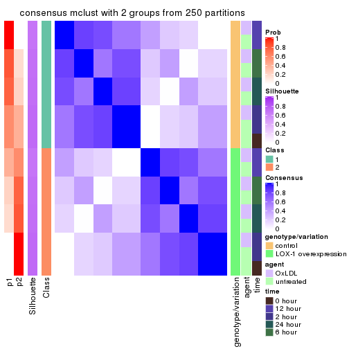</p>

</div>
<div id='tab-ATC-mclust-consensus-heatmap-2'>
<pre><code class="r">consensus_heatmap(res, k = 3)
</code></pre>

<p>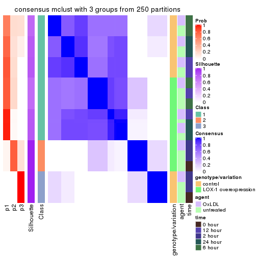</p>

</div>
<div id='tab-ATC-mclust-consensus-heatmap-3'>
<pre><code class="r">consensus_heatmap(res, k = 4)
</code></pre>

<p>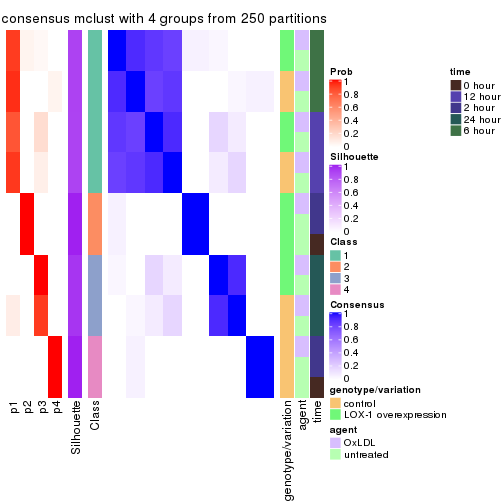</p>

</div>
<div id='tab-ATC-mclust-consensus-heatmap-4'>
<pre><code class="r">consensus_heatmap(res, k = 5)
</code></pre>

<p>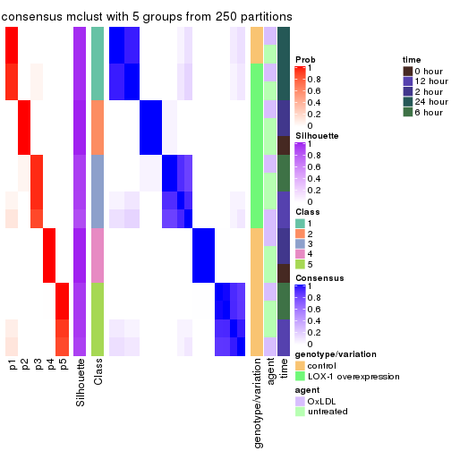</p>

</div>
<div id='tab-ATC-mclust-consensus-heatmap-5'>
<pre><code class="r">consensus_heatmap(res, k = 6)
</code></pre>

<p>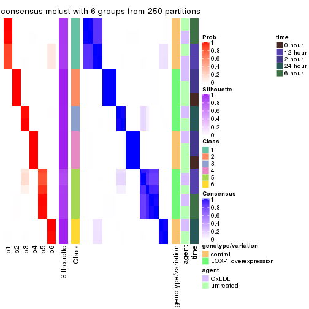</p>

</div>
</div>

Heatmaps for the membership of samples in all partitions to see how consistent they are:


<script>
$( function() {
	$( '#tabs-ATC-mclust-membership-heatmap' ).tabs();
} );
</script>
<div id='tabs-ATC-mclust-membership-heatmap'>
<ul>
<li><a href='#tab-ATC-mclust-membership-heatmap-1'>k = 2</a></li>
<li><a href='#tab-ATC-mclust-membership-heatmap-2'>k = 3</a></li>
<li><a href='#tab-ATC-mclust-membership-heatmap-3'>k = 4</a></li>
<li><a href='#tab-ATC-mclust-membership-heatmap-4'>k = 5</a></li>
<li><a href='#tab-ATC-mclust-membership-heatmap-5'>k = 6</a></li>
</ul>
<div id='tab-ATC-mclust-membership-heatmap-1'>
<pre><code class="r">membership_heatmap(res, k = 2)
</code></pre>

<p>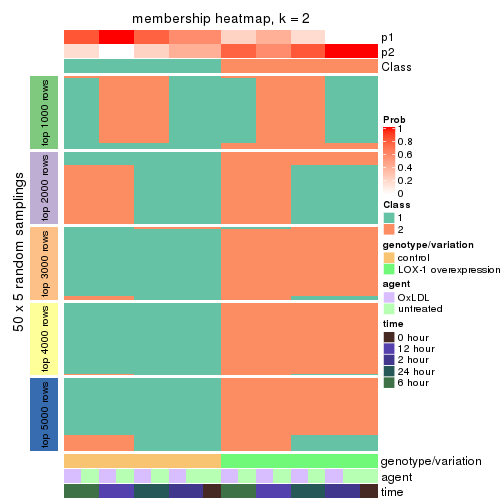</p>

</div>
<div id='tab-ATC-mclust-membership-heatmap-2'>
<pre><code class="r">membership_heatmap(res, k = 3)
</code></pre>

<p>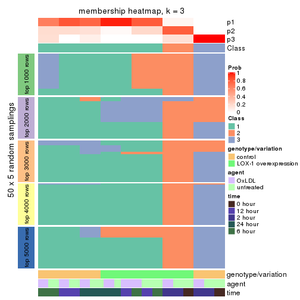</p>

</div>
<div id='tab-ATC-mclust-membership-heatmap-3'>
<pre><code class="r">membership_heatmap(res, k = 4)
</code></pre>

<p>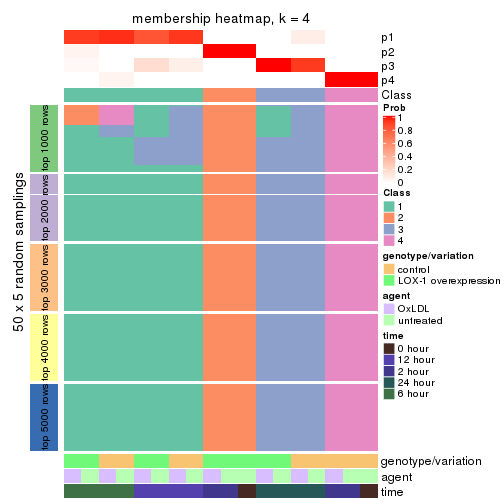</p>

</div>
<div id='tab-ATC-mclust-membership-heatmap-4'>
<pre><code class="r">membership_heatmap(res, k = 5)
</code></pre>

<p>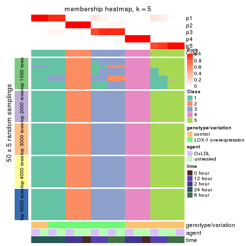</p>

</div>
<div id='tab-ATC-mclust-membership-heatmap-5'>
<pre><code class="r">membership_heatmap(res, k = 6)
</code></pre>

<p>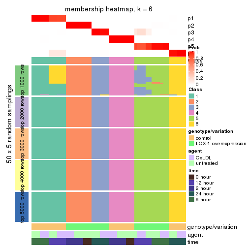</p>

</div>
</div>

As soon as we have had the classes for columns, we can look for signatures
which are significantly different between classes which can be candidate marks
for certain classes. Following are the heatmaps for signatures.


Signature heatmaps where rows are scaled:


<script>
$( function() {
	$( '#tabs-ATC-mclust-get-signatures' ).tabs();
} );
</script>
<div id='tabs-ATC-mclust-get-signatures'>
<ul>
<li><a href='#tab-ATC-mclust-get-signatures-1'>k = 2</a></li>
<li><a href='#tab-ATC-mclust-get-signatures-2'>k = 3</a></li>
<li><a href='#tab-ATC-mclust-get-signatures-3'>k = 4</a></li>
<li><a href='#tab-ATC-mclust-get-signatures-4'>k = 5</a></li>
<li><a href='#tab-ATC-mclust-get-signatures-5'>k = 6</a></li>
</ul>
<div id='tab-ATC-mclust-get-signatures-1'>
<pre><code class="r">get_signatures(res, k = 2)
</code></pre>

<p>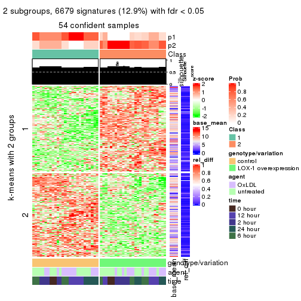</p>

</div>
<div id='tab-ATC-mclust-get-signatures-2'>
<pre><code class="r">get_signatures(res, k = 3)
</code></pre>

<p>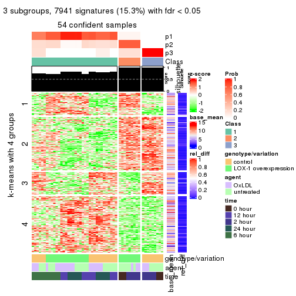</p>

</div>
<div id='tab-ATC-mclust-get-signatures-3'>
<pre><code class="r">get_signatures(res, k = 4)
</code></pre>

<p>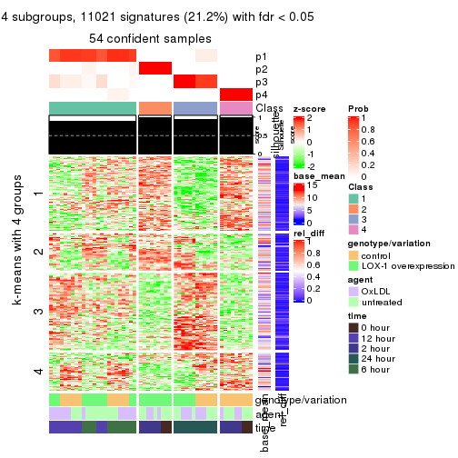</p>

</div>
<div id='tab-ATC-mclust-get-signatures-4'>
<pre><code class="r">get_signatures(res, k = 5)
</code></pre>

<p>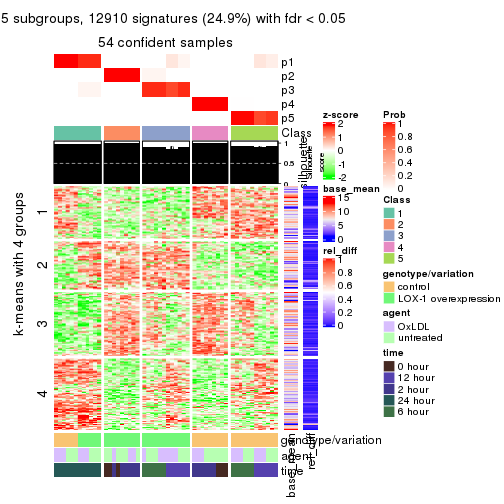</p>

</div>
<div id='tab-ATC-mclust-get-signatures-5'>
<pre><code class="r">get_signatures(res, k = 6)
</code></pre>

<p>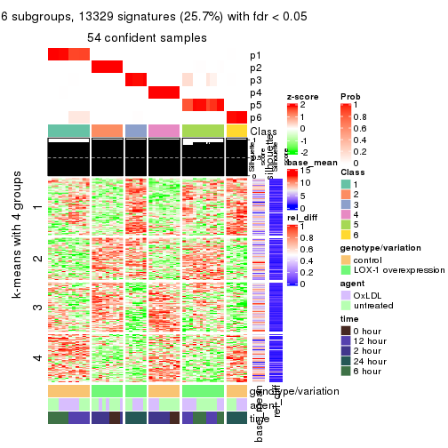</p>

</div>
</div>


Signature heatmaps where rows are not scaled:


<script>
$( function() {
	$( '#tabs-ATC-mclust-get-signatures-no-scale' ).tabs();
} );
</script>
<div id='tabs-ATC-mclust-get-signatures-no-scale'>
<ul>
<li><a href='#tab-ATC-mclust-get-signatures-no-scale-1'>k = 2</a></li>
<li><a href='#tab-ATC-mclust-get-signatures-no-scale-2'>k = 3</a></li>
<li><a href='#tab-ATC-mclust-get-signatures-no-scale-3'>k = 4</a></li>
<li><a href='#tab-ATC-mclust-get-signatures-no-scale-4'>k = 5</a></li>
<li><a href='#tab-ATC-mclust-get-signatures-no-scale-5'>k = 6</a></li>
</ul>
<div id='tab-ATC-mclust-get-signatures-no-scale-1'>
<pre><code class="r">get_signatures(res, k = 2, scale_rows = FALSE)
</code></pre>

<p>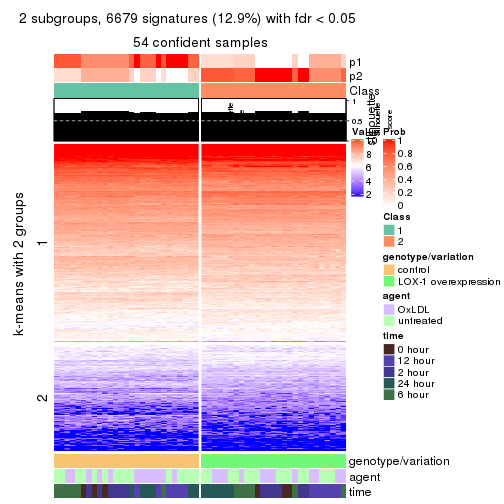</p>

</div>
<div id='tab-ATC-mclust-get-signatures-no-scale-2'>
<pre><code class="r">get_signatures(res, k = 3, scale_rows = FALSE)
</code></pre>

<p>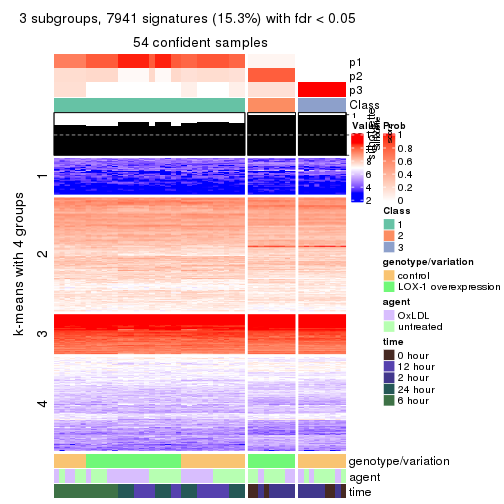</p>

</div>
<div id='tab-ATC-mclust-get-signatures-no-scale-3'>
<pre><code class="r">get_signatures(res, k = 4, scale_rows = FALSE)
</code></pre>

<p>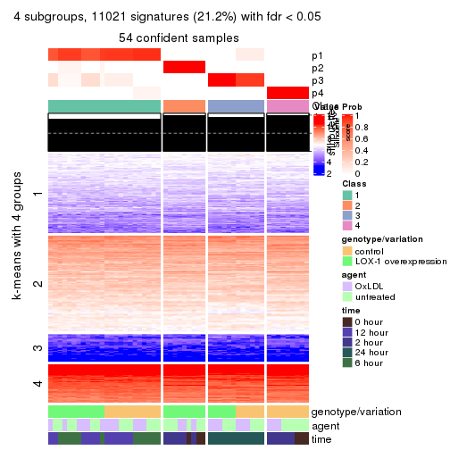</p>

</div>
<div id='tab-ATC-mclust-get-signatures-no-scale-4'>
<pre><code class="r">get_signatures(res, k = 5, scale_rows = FALSE)
</code></pre>

<p>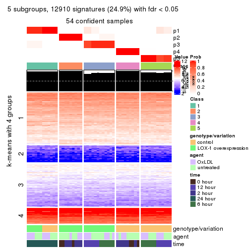</p>

</div>
<div id='tab-ATC-mclust-get-signatures-no-scale-5'>
<pre><code class="r">get_signatures(res, k = 6, scale_rows = FALSE)
</code></pre>

<p>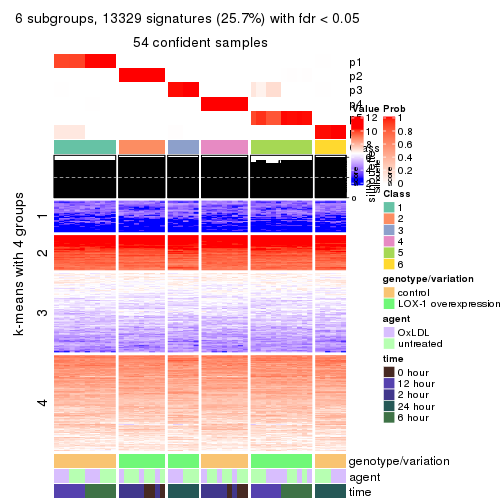</p>

</div>
</div>


Compare the overlap of signatures from different k:

```r
compare_signatures(res)
```

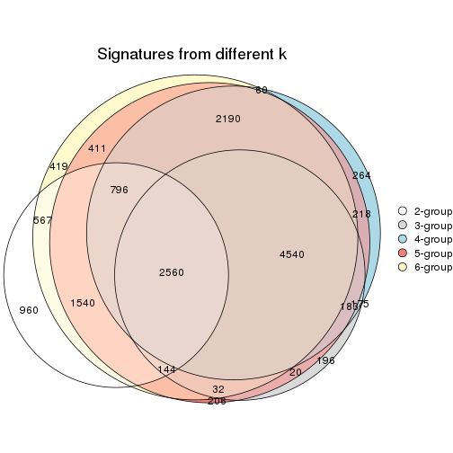

`get_signature()` returns a data frame invisibly. TO get the list of signatures, the function
call should be assigned to a variable explicitly. In following code, if `plot` argument is set
to `FALSE`, no heatmap is plotted while only the differential analysis is performed.

```r
# code only for demonstration
tb = get_signature(res, k = ..., plot = FALSE)
```

An example of the output of `tb` is:

```
#>   which_row         fdr    mean_1    mean_2 scaled_mean_1 scaled_mean_2 km
#> 1        38 0.042760348  8.373488  9.131774    -0.5533452     0.5164555  1
#> 2        40 0.018707592  7.106213  8.469186    -0.6173731     0.5762149  1
#> 3        55 0.019134737 10.221463 11.207825    -0.6159697     0.5749050  1
#> 4        59 0.006059896  5.921854  7.869574    -0.6899429     0.6439467  1
#> 5        60 0.018055526  8.928898 10.211722    -0.6204761     0.5791110  1
#> 6        98 0.009384629 15.714769 14.887706     0.6635654    -0.6193277  2
...
```

The columns in `tb` are:

1. `which_row`: row indices corresponding to the input matrix.
2. `fdr`: FDR for the differential test. 
3. `mean_x`: The mean value in group x.
4. `scaled_mean_x`: The mean value in group x after rows are scaled.
5. `km`: Row groups if k-means clustering is applied to rows.


UMAP plot which shows how samples are separated.


<script>
$( function() {
	$( '#tabs-ATC-mclust-dimension-reduction' ).tabs();
} );
</script>
<div id='tabs-ATC-mclust-dimension-reduction'>
<ul>
<li><a href='#tab-ATC-mclust-dimension-reduction-1'>k = 2</a></li>
<li><a href='#tab-ATC-mclust-dimension-reduction-2'>k = 3</a></li>
<li><a href='#tab-ATC-mclust-dimension-reduction-3'>k = 4</a></li>
<li><a href='#tab-ATC-mclust-dimension-reduction-4'>k = 5</a></li>
<li><a href='#tab-ATC-mclust-dimension-reduction-5'>k = 6</a></li>
</ul>
<div id='tab-ATC-mclust-dimension-reduction-1'>
<pre><code class="r">dimension_reduction(res, k = 2, method = &quot;UMAP&quot;)
</code></pre>

<p>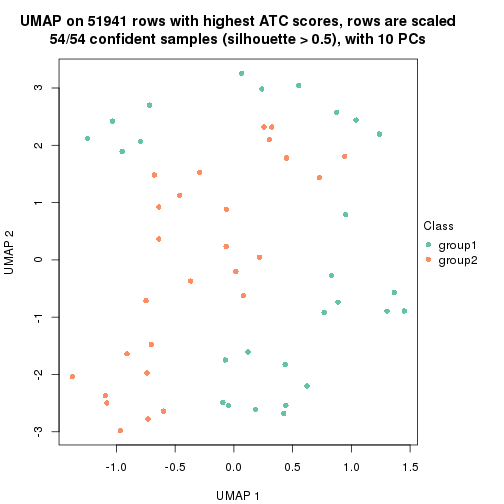</p>

</div>
<div id='tab-ATC-mclust-dimension-reduction-2'>
<pre><code class="r">dimension_reduction(res, k = 3, method = &quot;UMAP&quot;)
</code></pre>

<p>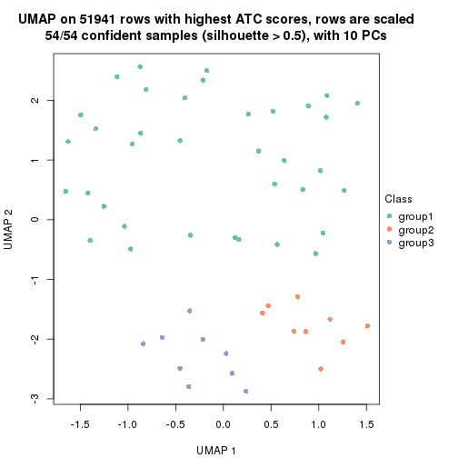</p>

</div>
<div id='tab-ATC-mclust-dimension-reduction-3'>
<pre><code class="r">dimension_reduction(res, k = 4, method = &quot;UMAP&quot;)
</code></pre>

<p>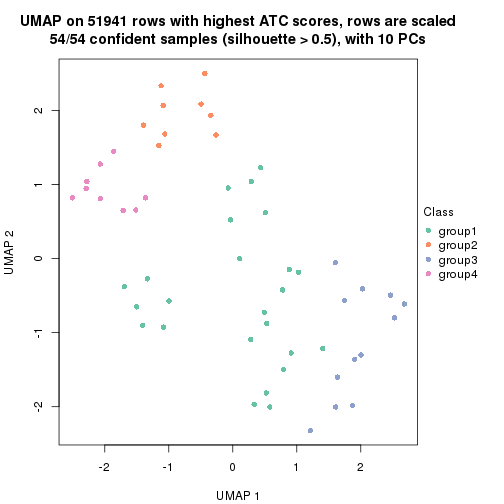</p>

</div>
<div id='tab-ATC-mclust-dimension-reduction-4'>
<pre><code class="r">dimension_reduction(res, k = 5, method = &quot;UMAP&quot;)
</code></pre>

<p>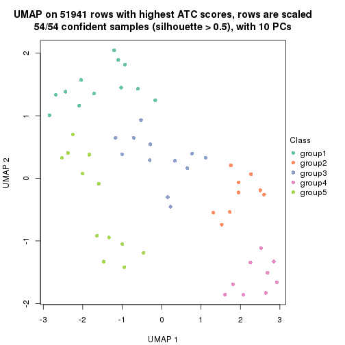</p>

</div>
<div id='tab-ATC-mclust-dimension-reduction-5'>
<pre><code class="r">dimension_reduction(res, k = 6, method = &quot;UMAP&quot;)
</code></pre>

<p>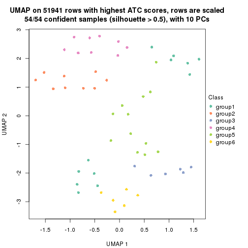</p>

</div>
</div>


Following heatmap shows how subgroups are split when increasing `k`:

```r
collect_classes(res)
```

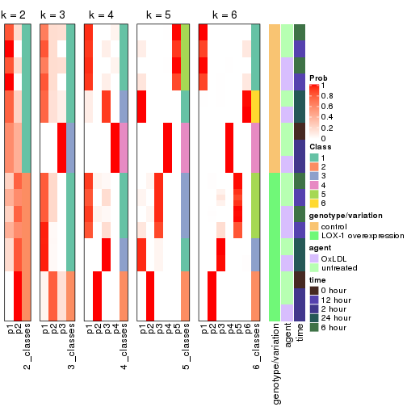


Test correlation between subgroups and known annotations. If the known
annotation is numeric, one-way ANOVA test is applied, and if the known
annotation is discrete, chi-squared contingency table test is applied.

```r
test_to_known_factors(res)
```

```
#>             n genotype/variation(p) agent(p)  time(p) k
#> ATC:mclust 54              1.48e-12    1.000 1.00e+00 2
#> ATC:mclust 54              1.23e-04    0.509 6.90e-09 3
#> ATC:mclust 54              4.40e-04    0.717 1.49e-17 4
#> ATC:mclust 54              1.67e-08    0.853 1.07e-15 5
#> ATC:mclust 54              2.10e-10    0.930 4.54e-14 6
```


If matrix rows can be associated to genes, consider to use `functional_enrichment(res,
...)` to perform function enrichment for the signature genes. See [this vignette](http://bioconductor.org/packages/devel/bioc/vignettes/cola/inst/doc/functional_enrichment.html) for more detailed explanations.


 

---------------------------------------------------


### ATC:NMF*


The object with results only for a single top-value method and a single partition method 
can be extracted as:

```r
res = res_list["ATC", "NMF"]
# you can also extract it by
# res = res_list["ATC:NMF"]
```

A summary of `res` and all the functions that can be applied to it:

```r
res
```

```
#> A 'ConsensusPartition' object with k = 2, 3, 4, 5, 6.
#>   On a matrix with 51941 rows and 54 columns.
#>   Top rows (1000, 2000, 3000, 4000, 5000) are extracted by 'ATC' method.
#>   Subgroups are detected by 'NMF' method.
#>   Performed in total 1250 partitions by row resampling.
#>   Best k for subgroups seems to be 4.
#> 
#> Following methods can be applied to this 'ConsensusPartition' object:
#>  [1] "cola_report"             "collect_classes"         "collect_plots"          
#>  [4] "collect_stats"           "colnames"                "compare_signatures"     
#>  [7] "consensus_heatmap"       "dimension_reduction"     "functional_enrichment"  
#> [10] "get_anno_col"            "get_anno"                "get_classes"            
#> [13] "get_consensus"           "get_matrix"              "get_membership"         
#> [16] "get_param"               "get_signatures"          "get_stats"              
#> [19] "is_best_k"               "is_stable_k"             "membership_heatmap"     
#> [22] "ncol"                    "nrow"                    "plot_ecdf"              
#> [25] "rownames"                "select_partition_number" "show"                   
#> [28] "suggest_best_k"          "test_to_known_factors"
```

`collect_plots()` function collects all the plots made from `res` for all `k` (number of partitions)
into one single page to provide an easy and fast comparison between different `k`.

```r
collect_plots(res)
```

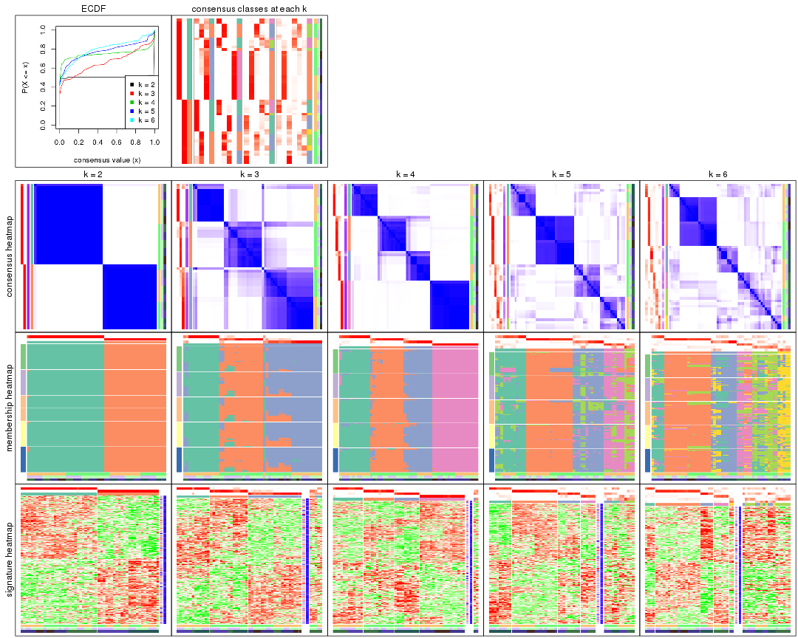

The plots are:

- The first row: a plot of the ECDF (empirical cumulative distribution
  function) curves of the consensus matrix for each `k` and the heatmap of
  predicted classes for each `k`.
- The second row: heatmaps of the consensus matrix for each `k`.
- The third row: heatmaps of the membership matrix for each `k`.
- The fouth row: heatmaps of the signatures for each `k`.

All the plots in panels can be made by individual functions and they are
plotted later in this section.

`select_partition_number()` produces several plots showing different
statistics for choosing "optimized" `k`. There are following statistics:

- ECDF curves of the consensus matrix for each `k`;
- 1-PAC. [The PAC
  score](https://en.wikipedia.org/wiki/Consensus_clustering#Over-interpretation_potential_of_consensus_clustering)
  measures the proportion of the ambiguous subgrouping.
- Mean silhouette score.
- Concordance. The mean probability of fiting the consensus class ids in all
  partitions.
- Area increased. Denote $A_k$ as the area under the ECDF curve for current
  `k`, the area increased is defined as $A_k - A_{k-1}$.
- Rand index. The percent of pairs of samples that are both in a same cluster
  or both are not in a same cluster in the partition of k and k-1.
- Jaccard index. The ratio of pairs of samples are both in a same cluster in
  the partition of k and k-1 and the pairs of samples are both in a same
  cluster in the partition k or k-1.

The detailed explanations of these statistics can be found in [the _cola_
vignette](http://bioconductor.org/packages/devel/bioc/vignettes/cola/inst/doc/cola.html#toc_13).

Generally speaking, lower PAC score, higher mean silhouette score or higher
concordance corresponds to better partition. Rand index and Jaccard index
measure how similar the current partition is compared to partition with `k-1`.
If they are too similar, we won't accept `k` is better than `k-1`.

```r
select_partition_number(res)
```

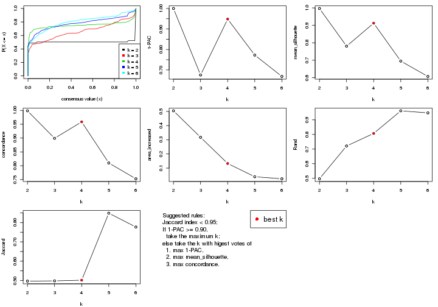

The numeric values for all these statistics can be obtained by `get_stats()`.

```r
get_stats(res)
```

```
#>   k 1-PAC mean_silhouette concordance area_increased  Rand Jaccard
#> 2 2 1.000           0.997       0.998         0.5038 0.497   0.497
#> 3 3 0.675           0.781       0.899         0.3172 0.721   0.498
#> 4 4 0.948           0.913       0.959         0.1325 0.807   0.502
#> 5 5 0.773           0.695       0.810         0.0390 0.962   0.848
#> 6 6 0.668           0.607       0.753         0.0247 0.948   0.777
```

`suggest_best_k()` suggests the best $k$ based on these statistics. The rules are as follows:

- All $k$ with Jaccard index larger than 0.95 are removed because increasing
  $k$ does not provide enough extra information. If all $k$ are removed, it is
  marked as no subgroup is detected.
- For all $k$ with 1-PAC score larger than 0.9, the maximal $k$ is taken as
  the best $k$, and other $k$ are marked as optional $k$.
- If it does not fit the second rule. The $k$ with the maximal vote of the
  highest 1-PAC score, highest mean silhouette, and highest concordance is
  taken as the best $k$.

```r
suggest_best_k(res)
```

```
#> [1] 4
#> attr(,"optional")
#> [1] 2
```

There is also optional best $k$ = 2 that is worth to check.

Following shows the table of the partitions (You need to click the **show/hide
code output** link to see it). The membership matrix (columns with name `p*`)
is inferred by
[`clue::cl_consensus()`](https://www.rdocumentation.org/link/cl_consensus?package=clue)
function with the `SE` method. Basically the value in the membership matrix
represents the probability to belong to a certain group. The finall class
label for an item is determined with the group with highest probability it
belongs to.

In `get_classes()` function, the entropy is calculated from the membership
matrix and the silhouette score is calculated from the consensus matrix.


<script>
$( function() {
	$( '#tabs-ATC-NMF-get-classes' ).tabs();
} );
</script>
<div id='tabs-ATC-NMF-get-classes'>
<ul>
<li><a href='#tab-ATC-NMF-get-classes-1'>k = 2</a></li>
<li><a href='#tab-ATC-NMF-get-classes-2'>k = 3</a></li>
<li><a href='#tab-ATC-NMF-get-classes-3'>k = 4</a></li>
<li><a href='#tab-ATC-NMF-get-classes-4'>k = 5</a></li>
<li><a href='#tab-ATC-NMF-get-classes-5'>k = 6</a></li>
</ul>

<div id='tab-ATC-NMF-get-classes-1'>
<p><a id='tab-ATC-NMF-get-classes-1-a' style='color:#0366d6' href='#'>show/hide code output</a></p>
<pre><code class="r">cbind(get_classes(res, k = 2), get_membership(res, k = 2))
</code></pre>

<pre><code>#&gt;           class entropy silhouette    p1    p2
#&gt; GSM329068     1  0.0000      0.997 1.000 0.000
#&gt; GSM329074     1  0.0000      0.997 1.000 0.000
#&gt; GSM329100     1  0.0000      0.997 1.000 0.000
#&gt; GSM329062     1  0.0000      0.997 1.000 0.000
#&gt; GSM329079     1  0.0000      0.997 1.000 0.000
#&gt; GSM329090     1  0.0000      0.997 1.000 0.000
#&gt; GSM329066     1  0.0000      0.997 1.000 0.000
#&gt; GSM329086     1  0.0000      0.997 1.000 0.000
#&gt; GSM329099     1  0.0000      0.997 1.000 0.000
#&gt; GSM329071     2  0.0376      0.996 0.004 0.996
#&gt; GSM329078     2  0.0000      0.999 0.000 1.000
#&gt; GSM329081     2  0.0672      0.992 0.008 0.992
#&gt; GSM329096     2  0.0000      0.999 0.000 1.000
#&gt; GSM329102     2  0.0000      0.999 0.000 1.000
#&gt; GSM329104     2  0.0000      0.999 0.000 1.000
#&gt; GSM329067     1  0.0000      0.997 1.000 0.000
#&gt; GSM329072     1  0.0000      0.997 1.000 0.000
#&gt; GSM329075     1  0.0000      0.997 1.000 0.000
#&gt; GSM329058     1  0.0000      0.997 1.000 0.000
#&gt; GSM329073     1  0.0000      0.997 1.000 0.000
#&gt; GSM329107     1  0.0000      0.997 1.000 0.000
#&gt; GSM329057     2  0.0000      0.999 0.000 1.000
#&gt; GSM329085     2  0.0000      0.999 0.000 1.000
#&gt; GSM329089     2  0.0000      0.999 0.000 1.000
#&gt; GSM329076     2  0.0000      0.999 0.000 1.000
#&gt; GSM329094     2  0.0000      0.999 0.000 1.000
#&gt; GSM329105     2  0.0000      0.999 0.000 1.000
#&gt; GSM329056     1  0.0000      0.997 1.000 0.000
#&gt; GSM329069     1  0.0000      0.997 1.000 0.000
#&gt; GSM329077     1  0.0000      0.997 1.000 0.000
#&gt; GSM329070     1  0.0000      0.997 1.000 0.000
#&gt; GSM329082     1  0.0000      0.997 1.000 0.000
#&gt; GSM329092     1  0.0000      0.997 1.000 0.000
#&gt; GSM329083     1  0.0000      0.997 1.000 0.000
#&gt; GSM329101     1  0.0000      0.997 1.000 0.000
#&gt; GSM329106     1  0.0000      0.997 1.000 0.000
#&gt; GSM329087     2  0.0000      0.999 0.000 1.000
#&gt; GSM329091     2  0.0000      0.999 0.000 1.000
#&gt; GSM329093     2  0.0000      0.999 0.000 1.000
#&gt; GSM329080     2  0.0000      0.999 0.000 1.000
#&gt; GSM329084     2  0.0000      0.999 0.000 1.000
#&gt; GSM329088     2  0.0000      0.999 0.000 1.000
#&gt; GSM329059     1  0.0000      0.997 1.000 0.000
#&gt; GSM329097     1  0.0000      0.997 1.000 0.000
#&gt; GSM329098     1  0.0000      0.997 1.000 0.000
#&gt; GSM329055     1  0.3879      0.918 0.924 0.076
#&gt; GSM329103     1  0.0000      0.997 1.000 0.000
#&gt; GSM329108     1  0.0000      0.997 1.000 0.000
#&gt; GSM329061     2  0.0000      0.999 0.000 1.000
#&gt; GSM329064     2  0.0000      0.999 0.000 1.000
#&gt; GSM329065     2  0.0000      0.999 0.000 1.000
#&gt; GSM329060     2  0.0000      0.999 0.000 1.000
#&gt; GSM329063     2  0.0000      0.999 0.000 1.000
#&gt; GSM329095     2  0.0000      0.999 0.000 1.000
</code></pre>

<script>
$('#tab-ATC-NMF-get-classes-1-a').parent().next().next().hide();
$('#tab-ATC-NMF-get-classes-1-a').click(function(){
  $('#tab-ATC-NMF-get-classes-1-a').parent().next().next().toggle();
  return(false);
});
</script>
</div>

<div id='tab-ATC-NMF-get-classes-2'>
<p><a id='tab-ATC-NMF-get-classes-2-a' style='color:#0366d6' href='#'>show/hide code output</a></p>
<pre><code class="r">cbind(get_classes(res, k = 3), get_membership(res, k = 3))
</code></pre>

<pre><code>#&gt;           class entropy silhouette    p1    p2    p3
#&gt; GSM329068     3  0.5465      0.683 0.000 0.288 0.712
#&gt; GSM329074     3  0.5465      0.683 0.000 0.288 0.712
#&gt; GSM329100     3  0.4654      0.777 0.000 0.208 0.792
#&gt; GSM329062     3  0.3816      0.817 0.000 0.148 0.852
#&gt; GSM329079     3  0.3941      0.813 0.000 0.156 0.844
#&gt; GSM329090     3  0.3941      0.813 0.000 0.156 0.844
#&gt; GSM329066     2  0.5650      0.415 0.000 0.688 0.312
#&gt; GSM329086     3  0.6308      0.198 0.000 0.492 0.508
#&gt; GSM329099     2  0.5859      0.329 0.000 0.656 0.344
#&gt; GSM329071     2  0.0000      0.873 0.000 1.000 0.000
#&gt; GSM329078     2  0.0237      0.874 0.004 0.996 0.000
#&gt; GSM329081     2  0.0000      0.873 0.000 1.000 0.000
#&gt; GSM329096     2  0.1529      0.868 0.040 0.960 0.000
#&gt; GSM329102     2  0.0747      0.875 0.016 0.984 0.000
#&gt; GSM329104     2  0.0424      0.875 0.008 0.992 0.000
#&gt; GSM329067     3  0.4887      0.758 0.000 0.228 0.772
#&gt; GSM329072     3  0.4654      0.777 0.000 0.208 0.792
#&gt; GSM329075     3  0.4002      0.811 0.000 0.160 0.840
#&gt; GSM329058     2  0.0747      0.867 0.000 0.984 0.016
#&gt; GSM329073     2  0.1529      0.849 0.000 0.960 0.040
#&gt; GSM329107     2  0.0592      0.869 0.000 0.988 0.012
#&gt; GSM329057     2  0.1031      0.874 0.024 0.976 0.000
#&gt; GSM329085     2  0.3551      0.801 0.132 0.868 0.000
#&gt; GSM329089     2  0.1411      0.870 0.036 0.964 0.000
#&gt; GSM329076     2  0.4974      0.698 0.236 0.764 0.000
#&gt; GSM329094     2  0.5216      0.667 0.260 0.740 0.000
#&gt; GSM329105     2  0.5058      0.688 0.244 0.756 0.000
#&gt; GSM329056     3  0.0000      0.853 0.000 0.000 1.000
#&gt; GSM329069     3  0.0000      0.853 0.000 0.000 1.000
#&gt; GSM329077     3  0.0424      0.850 0.008 0.000 0.992
#&gt; GSM329070     3  0.0000      0.853 0.000 0.000 1.000
#&gt; GSM329082     3  0.0000      0.853 0.000 0.000 1.000
#&gt; GSM329092     3  0.0000      0.853 0.000 0.000 1.000
#&gt; GSM329083     3  0.1163      0.837 0.028 0.000 0.972
#&gt; GSM329101     3  0.1163      0.837 0.028 0.000 0.972
#&gt; GSM329106     3  0.0424      0.850 0.008 0.000 0.992
#&gt; GSM329087     1  0.0237      0.926 0.996 0.000 0.004
#&gt; GSM329091     1  0.0237      0.926 0.996 0.000 0.004
#&gt; GSM329093     1  0.0237      0.926 0.996 0.000 0.004
#&gt; GSM329080     1  0.0000      0.925 1.000 0.000 0.000
#&gt; GSM329084     1  0.0000      0.925 1.000 0.000 0.000
#&gt; GSM329088     1  0.0000      0.925 1.000 0.000 0.000
#&gt; GSM329059     3  0.0237      0.852 0.000 0.004 0.996
#&gt; GSM329097     3  0.0000      0.853 0.000 0.000 1.000
#&gt; GSM329098     3  0.0000      0.853 0.000 0.000 1.000
#&gt; GSM329055     1  0.5859      0.524 0.656 0.000 0.344
#&gt; GSM329103     3  0.6295     -0.140 0.472 0.000 0.528
#&gt; GSM329108     1  0.6307      0.178 0.512 0.000 0.488
#&gt; GSM329061     1  0.0237      0.926 0.996 0.000 0.004
#&gt; GSM329064     1  0.0237      0.926 0.996 0.000 0.004
#&gt; GSM329065     1  0.0237      0.926 0.996 0.000 0.004
#&gt; GSM329060     1  0.0000      0.925 1.000 0.000 0.000
#&gt; GSM329063     1  0.0000      0.925 1.000 0.000 0.000
#&gt; GSM329095     1  0.0000      0.925 1.000 0.000 0.000
</code></pre>

<script>
$('#tab-ATC-NMF-get-classes-2-a').parent().next().next().hide();
$('#tab-ATC-NMF-get-classes-2-a').click(function(){
  $('#tab-ATC-NMF-get-classes-2-a').parent().next().next().toggle();
  return(false);
});
</script>
</div>

<div id='tab-ATC-NMF-get-classes-3'>
<p><a id='tab-ATC-NMF-get-classes-3-a' style='color:#0366d6' href='#'>show/hide code output</a></p>
<pre><code class="r">cbind(get_classes(res, k = 4), get_membership(res, k = 4))
</code></pre>

<pre><code>#&gt;           class entropy silhouette    p1    p2    p3    p4
#&gt; GSM329068     4  0.0469      0.989 0.000 0.012 0.000 0.988
#&gt; GSM329074     4  0.1389      0.953 0.000 0.048 0.000 0.952
#&gt; GSM329100     4  0.0336      0.992 0.000 0.008 0.000 0.992
#&gt; GSM329062     4  0.0336      0.992 0.000 0.008 0.000 0.992
#&gt; GSM329079     4  0.0188      0.994 0.000 0.004 0.000 0.996
#&gt; GSM329090     4  0.0188      0.994 0.000 0.004 0.000 0.996
#&gt; GSM329066     2  0.0524      0.921 0.004 0.988 0.000 0.008
#&gt; GSM329086     2  0.1118      0.898 0.000 0.964 0.000 0.036
#&gt; GSM329099     2  0.0524      0.922 0.008 0.988 0.000 0.004
#&gt; GSM329071     2  0.0188      0.923 0.004 0.996 0.000 0.000
#&gt; GSM329078     2  0.0188      0.923 0.004 0.996 0.000 0.000
#&gt; GSM329081     2  0.0188      0.923 0.004 0.996 0.000 0.000
#&gt; GSM329096     3  0.3528      0.767 0.000 0.192 0.808 0.000
#&gt; GSM329102     3  0.4713      0.457 0.000 0.360 0.640 0.000
#&gt; GSM329104     2  0.3610      0.713 0.000 0.800 0.200 0.000
#&gt; GSM329067     4  0.0336      0.992 0.000 0.008 0.000 0.992
#&gt; GSM329072     4  0.0188      0.994 0.000 0.004 0.000 0.996
#&gt; GSM329075     4  0.0336      0.992 0.000 0.008 0.000 0.992
#&gt; GSM329058     2  0.0336      0.922 0.008 0.992 0.000 0.000
#&gt; GSM329073     2  0.0707      0.917 0.020 0.980 0.000 0.000
#&gt; GSM329107     2  0.0657      0.921 0.012 0.984 0.000 0.004
#&gt; GSM329057     2  0.0707      0.915 0.000 0.980 0.020 0.000
#&gt; GSM329085     2  0.4967      0.088 0.000 0.548 0.452 0.000
#&gt; GSM329089     2  0.1474      0.894 0.000 0.948 0.052 0.000
#&gt; GSM329076     3  0.1557      0.905 0.000 0.056 0.944 0.000
#&gt; GSM329094     3  0.1557      0.905 0.000 0.056 0.944 0.000
#&gt; GSM329105     3  0.1557      0.905 0.000 0.056 0.944 0.000
#&gt; GSM329056     4  0.0000      0.994 0.000 0.000 0.000 1.000
#&gt; GSM329069     4  0.0000      0.994 0.000 0.000 0.000 1.000
#&gt; GSM329077     4  0.0000      0.994 0.000 0.000 0.000 1.000
#&gt; GSM329070     4  0.0000      0.994 0.000 0.000 0.000 1.000
#&gt; GSM329082     4  0.0000      0.994 0.000 0.000 0.000 1.000
#&gt; GSM329092     4  0.0000      0.994 0.000 0.000 0.000 1.000
#&gt; GSM329083     1  0.0592      0.947 0.984 0.000 0.000 0.016
#&gt; GSM329101     1  0.0469      0.950 0.988 0.000 0.000 0.012
#&gt; GSM329106     1  0.3444      0.765 0.816 0.000 0.000 0.184
#&gt; GSM329087     1  0.0469      0.953 0.988 0.000 0.012 0.000
#&gt; GSM329091     1  0.0188      0.953 0.996 0.000 0.004 0.000
#&gt; GSM329093     1  0.0336      0.953 0.992 0.000 0.008 0.000
#&gt; GSM329080     3  0.0469      0.915 0.012 0.000 0.988 0.000
#&gt; GSM329084     3  0.0336      0.916 0.008 0.000 0.992 0.000
#&gt; GSM329088     3  0.0469      0.915 0.012 0.000 0.988 0.000
#&gt; GSM329059     4  0.0000      0.994 0.000 0.000 0.000 1.000
#&gt; GSM329097     4  0.0000      0.994 0.000 0.000 0.000 1.000
#&gt; GSM329098     4  0.0000      0.994 0.000 0.000 0.000 1.000
#&gt; GSM329055     1  0.0336      0.953 0.992 0.000 0.008 0.000
#&gt; GSM329103     1  0.0376      0.952 0.992 0.000 0.004 0.004
#&gt; GSM329108     1  0.0376      0.953 0.992 0.000 0.004 0.004
#&gt; GSM329061     1  0.1940      0.925 0.924 0.000 0.076 0.000
#&gt; GSM329064     1  0.2149      0.917 0.912 0.000 0.088 0.000
#&gt; GSM329065     1  0.2408      0.904 0.896 0.000 0.104 0.000
#&gt; GSM329060     3  0.0188      0.917 0.004 0.000 0.996 0.000
#&gt; GSM329063     3  0.0188      0.917 0.004 0.000 0.996 0.000
#&gt; GSM329095     3  0.0188      0.917 0.004 0.000 0.996 0.000
</code></pre>

<script>
$('#tab-ATC-NMF-get-classes-3-a').parent().next().next().hide();
$('#tab-ATC-NMF-get-classes-3-a').click(function(){
  $('#tab-ATC-NMF-get-classes-3-a').parent().next().next().toggle();
  return(false);
});
</script>
</div>

<div id='tab-ATC-NMF-get-classes-4'>
<p><a id='tab-ATC-NMF-get-classes-4-a' style='color:#0366d6' href='#'>show/hide code output</a></p>
<pre><code class="r">cbind(get_classes(res, k = 5), get_membership(res, k = 5))
</code></pre>

<pre><code>#&gt;           class entropy silhouette    p1    p2    p3    p4    p5
#&gt; GSM329068     2  0.1478     0.9480 0.000 0.936 0.064 0.000 0.000
#&gt; GSM329074     2  0.2074     0.9099 0.000 0.896 0.104 0.000 0.000
#&gt; GSM329100     2  0.1410     0.9493 0.000 0.940 0.060 0.000 0.000
#&gt; GSM329062     2  0.1571     0.9494 0.000 0.936 0.060 0.000 0.004
#&gt; GSM329079     2  0.1571     0.9494 0.000 0.936 0.060 0.000 0.004
#&gt; GSM329090     2  0.1571     0.9494 0.000 0.936 0.060 0.000 0.004
#&gt; GSM329066     3  0.0703     0.7538 0.000 0.000 0.976 0.024 0.000
#&gt; GSM329086     3  0.2770     0.7014 0.000 0.044 0.880 0.000 0.076
#&gt; GSM329099     3  0.0510     0.7475 0.000 0.000 0.984 0.000 0.016
#&gt; GSM329071     3  0.4909     0.4488 0.028 0.000 0.560 0.000 0.412
#&gt; GSM329078     3  0.2284     0.7393 0.056 0.000 0.912 0.004 0.028
#&gt; GSM329081     3  0.4886     0.4044 0.024 0.000 0.528 0.000 0.448
#&gt; GSM329096     1  0.3455     0.6276 0.784 0.000 0.208 0.000 0.008
#&gt; GSM329102     1  0.5674     0.3985 0.576 0.000 0.324 0.000 0.100
#&gt; GSM329104     1  0.6785     0.0686 0.376 0.000 0.340 0.000 0.284
#&gt; GSM329067     2  0.1571     0.9494 0.000 0.936 0.060 0.000 0.004
#&gt; GSM329072     2  0.1571     0.9494 0.000 0.936 0.060 0.000 0.004
#&gt; GSM329075     2  0.1571     0.9494 0.000 0.936 0.060 0.000 0.004
#&gt; GSM329058     3  0.1251     0.7516 0.000 0.000 0.956 0.036 0.008
#&gt; GSM329073     3  0.1981     0.7452 0.000 0.000 0.920 0.064 0.016
#&gt; GSM329107     3  0.5110     0.5727 0.028 0.000 0.660 0.288 0.024
#&gt; GSM329057     3  0.4801     0.6652 0.184 0.000 0.728 0.084 0.004
#&gt; GSM329085     3  0.6471     0.4136 0.300 0.000 0.508 0.188 0.004
#&gt; GSM329089     3  0.5581     0.6234 0.192 0.000 0.656 0.148 0.004
#&gt; GSM329076     1  0.0771     0.7545 0.976 0.000 0.020 0.000 0.004
#&gt; GSM329094     1  0.0771     0.7545 0.976 0.000 0.020 0.000 0.004
#&gt; GSM329105     1  0.0771     0.7545 0.976 0.000 0.020 0.000 0.004
#&gt; GSM329056     2  0.0510     0.9451 0.000 0.984 0.000 0.000 0.016
#&gt; GSM329069     2  0.0510     0.9451 0.000 0.984 0.000 0.000 0.016
#&gt; GSM329077     2  0.0609     0.9428 0.000 0.980 0.000 0.000 0.020
#&gt; GSM329070     2  0.0290     0.9477 0.000 0.992 0.000 0.000 0.008
#&gt; GSM329082     2  0.0290     0.9477 0.000 0.992 0.000 0.000 0.008
#&gt; GSM329092     2  0.0290     0.9477 0.000 0.992 0.000 0.000 0.008
#&gt; GSM329083     5  0.6133     0.3876 0.000 0.148 0.000 0.328 0.524
#&gt; GSM329101     5  0.5959     0.1690 0.000 0.108 0.000 0.420 0.472
#&gt; GSM329106     5  0.5523     0.4000 0.000 0.348 0.000 0.080 0.572
#&gt; GSM329087     4  0.4030     0.3243 0.000 0.000 0.000 0.648 0.352
#&gt; GSM329091     5  0.1965     0.2938 0.000 0.000 0.000 0.096 0.904
#&gt; GSM329093     4  0.4273     0.1584 0.000 0.000 0.000 0.552 0.448
#&gt; GSM329080     1  0.3590     0.7377 0.828 0.000 0.000 0.080 0.092
#&gt; GSM329084     1  0.5535     0.4807 0.536 0.000 0.000 0.072 0.392
#&gt; GSM329088     1  0.4212     0.7115 0.776 0.000 0.000 0.080 0.144
#&gt; GSM329059     2  0.0290     0.9488 0.000 0.992 0.000 0.000 0.008
#&gt; GSM329097     2  0.0404     0.9480 0.000 0.988 0.000 0.000 0.012
#&gt; GSM329098     2  0.0510     0.9449 0.000 0.984 0.000 0.000 0.016
#&gt; GSM329055     4  0.3165     0.6230 0.000 0.036 0.000 0.848 0.116
#&gt; GSM329103     4  0.3489     0.6032 0.000 0.036 0.000 0.820 0.144
#&gt; GSM329108     4  0.3237     0.6144 0.000 0.048 0.000 0.848 0.104
#&gt; GSM329061     4  0.1205     0.6579 0.040 0.000 0.000 0.956 0.004
#&gt; GSM329064     4  0.2969     0.6069 0.128 0.000 0.000 0.852 0.020
#&gt; GSM329065     4  0.2305     0.6390 0.092 0.000 0.000 0.896 0.012
#&gt; GSM329060     1  0.2624     0.7409 0.872 0.000 0.000 0.116 0.012
#&gt; GSM329063     1  0.2953     0.7274 0.844 0.000 0.000 0.144 0.012
#&gt; GSM329095     1  0.3203     0.7116 0.820 0.000 0.000 0.168 0.012
</code></pre>

<script>
$('#tab-ATC-NMF-get-classes-4-a').parent().next().next().hide();
$('#tab-ATC-NMF-get-classes-4-a').click(function(){
  $('#tab-ATC-NMF-get-classes-4-a').parent().next().next().toggle();
  return(false);
});
</script>
</div>

<div id='tab-ATC-NMF-get-classes-5'>
<p><a id='tab-ATC-NMF-get-classes-5-a' style='color:#0366d6' href='#'>show/hide code output</a></p>
<pre><code class="r">cbind(get_classes(res, k = 6), get_membership(res, k = 6))
</code></pre>

<pre><code>#&gt;           class entropy silhouette    p1    p2    p3    p4    p5    p6
#&gt; GSM329068     2  0.2006     0.8983 0.000 0.892 0.000 0.000 0.104 0.004
#&gt; GSM329074     2  0.3206     0.8279 0.000 0.808 0.008 0.008 0.172 0.004
#&gt; GSM329100     2  0.2100     0.8938 0.000 0.884 0.000 0.000 0.112 0.004
#&gt; GSM329062     2  0.1806     0.9062 0.000 0.908 0.000 0.000 0.088 0.004
#&gt; GSM329079     2  0.1806     0.9062 0.000 0.908 0.000 0.000 0.088 0.004
#&gt; GSM329090     2  0.1949     0.9062 0.000 0.904 0.000 0.004 0.088 0.004
#&gt; GSM329066     5  0.5382     0.4734 0.164 0.056 0.000 0.064 0.696 0.020
#&gt; GSM329086     5  0.6081     0.3459 0.000 0.160 0.000 0.156 0.604 0.080
#&gt; GSM329099     5  0.4254     0.4449 0.000 0.032 0.000 0.156 0.760 0.052
#&gt; GSM329071     6  0.4186     0.5168 0.000 0.000 0.032 0.000 0.312 0.656
#&gt; GSM329078     5  0.6449     0.1323 0.104 0.000 0.092 0.008 0.564 0.232
#&gt; GSM329081     6  0.4083     0.5257 0.000 0.000 0.028 0.000 0.304 0.668
#&gt; GSM329096     3  0.3602     0.4336 0.000 0.000 0.784 0.000 0.056 0.160
#&gt; GSM329102     3  0.5178    -0.2623 0.000 0.000 0.488 0.000 0.088 0.424
#&gt; GSM329104     6  0.5505     0.4144 0.000 0.000 0.312 0.004 0.136 0.548
#&gt; GSM329067     2  0.1806     0.9062 0.000 0.908 0.000 0.000 0.088 0.004
#&gt; GSM329072     2  0.1806     0.9062 0.000 0.908 0.000 0.000 0.088 0.004
#&gt; GSM329075     2  0.1806     0.9062 0.000 0.908 0.000 0.000 0.088 0.004
#&gt; GSM329058     5  0.4453     0.3050 0.012 0.000 0.016 0.336 0.632 0.004
#&gt; GSM329073     5  0.5225     0.1880 0.036 0.004 0.020 0.380 0.556 0.004
#&gt; GSM329107     5  0.6596     0.4166 0.312 0.004 0.016 0.216 0.444 0.008
#&gt; GSM329057     5  0.5926     0.4420 0.212 0.000 0.244 0.012 0.532 0.000
#&gt; GSM329085     5  0.6373     0.2129 0.332 0.000 0.324 0.004 0.336 0.004
#&gt; GSM329089     5  0.5985     0.4317 0.224 0.000 0.244 0.012 0.520 0.000
#&gt; GSM329076     3  0.0000     0.5931 0.000 0.000 1.000 0.000 0.000 0.000
#&gt; GSM329094     3  0.0146     0.5921 0.004 0.000 0.996 0.000 0.000 0.000
#&gt; GSM329105     3  0.0000     0.5931 0.000 0.000 1.000 0.000 0.000 0.000
#&gt; GSM329056     2  0.1297     0.8961 0.000 0.948 0.000 0.040 0.000 0.012
#&gt; GSM329069     2  0.1594     0.8872 0.000 0.932 0.000 0.052 0.000 0.016
#&gt; GSM329077     2  0.1838     0.8748 0.000 0.916 0.000 0.068 0.000 0.016
#&gt; GSM329070     2  0.1219     0.8995 0.000 0.948 0.000 0.048 0.000 0.004
#&gt; GSM329082     2  0.1152     0.9007 0.000 0.952 0.000 0.044 0.000 0.004
#&gt; GSM329092     2  0.1082     0.9017 0.000 0.956 0.000 0.040 0.000 0.004
#&gt; GSM329083     4  0.4292     0.6864 0.004 0.148 0.000 0.748 0.004 0.096
#&gt; GSM329101     4  0.4230     0.6896 0.008 0.156 0.000 0.756 0.004 0.076
#&gt; GSM329106     4  0.5412     0.5557 0.004 0.248 0.000 0.604 0.004 0.140
#&gt; GSM329087     1  0.4421     0.6834 0.716 0.000 0.000 0.156 0.000 0.128
#&gt; GSM329091     6  0.3138     0.4542 0.060 0.000 0.000 0.096 0.004 0.840
#&gt; GSM329093     1  0.4648     0.3287 0.548 0.000 0.000 0.044 0.000 0.408
#&gt; GSM329080     3  0.6013     0.3369 0.252 0.000 0.420 0.000 0.000 0.328
#&gt; GSM329084     6  0.5404     0.0994 0.144 0.000 0.240 0.004 0.004 0.608
#&gt; GSM329088     3  0.6211     0.4189 0.240 0.000 0.472 0.008 0.004 0.276
#&gt; GSM329059     2  0.1082     0.9020 0.000 0.956 0.000 0.040 0.000 0.004
#&gt; GSM329097     2  0.1152     0.9007 0.000 0.952 0.000 0.044 0.000 0.004
#&gt; GSM329098     2  0.1219     0.8991 0.000 0.948 0.000 0.048 0.000 0.004
#&gt; GSM329055     4  0.2454     0.6464 0.160 0.000 0.000 0.840 0.000 0.000
#&gt; GSM329103     4  0.2595     0.6558 0.160 0.000 0.000 0.836 0.000 0.004
#&gt; GSM329108     4  0.3589     0.6138 0.228 0.012 0.000 0.752 0.000 0.008
#&gt; GSM329061     1  0.2119     0.7421 0.904 0.000 0.036 0.060 0.000 0.000
#&gt; GSM329064     1  0.3118     0.7399 0.836 0.000 0.072 0.092 0.000 0.000
#&gt; GSM329065     1  0.2112     0.7205 0.896 0.000 0.088 0.016 0.000 0.000
#&gt; GSM329060     3  0.3690     0.5295 0.288 0.000 0.700 0.000 0.000 0.012
#&gt; GSM329063     3  0.3748     0.5176 0.300 0.000 0.688 0.000 0.000 0.012
#&gt; GSM329095     3  0.3887     0.4411 0.360 0.000 0.632 0.000 0.000 0.008
</code></pre>

<script>
$('#tab-ATC-NMF-get-classes-5-a').parent().next().next().hide();
$('#tab-ATC-NMF-get-classes-5-a').click(function(){
  $('#tab-ATC-NMF-get-classes-5-a').parent().next().next().toggle();
  return(false);
});
</script>
</div>
</div>

Heatmaps for the consensus matrix. It visualizes the probability of two
samples to be in a same group.


<script>
$( function() {
	$( '#tabs-ATC-NMF-consensus-heatmap' ).tabs();
} );
</script>
<div id='tabs-ATC-NMF-consensus-heatmap'>
<ul>
<li><a href='#tab-ATC-NMF-consensus-heatmap-1'>k = 2</a></li>
<li><a href='#tab-ATC-NMF-consensus-heatmap-2'>k = 3</a></li>
<li><a href='#tab-ATC-NMF-consensus-heatmap-3'>k = 4</a></li>
<li><a href='#tab-ATC-NMF-consensus-heatmap-4'>k = 5</a></li>
<li><a href='#tab-ATC-NMF-consensus-heatmap-5'>k = 6</a></li>
</ul>
<div id='tab-ATC-NMF-consensus-heatmap-1'>
<pre><code class="r">consensus_heatmap(res, k = 2)
</code></pre>

<p>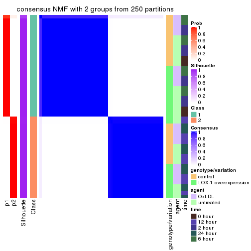</p>

</div>
<div id='tab-ATC-NMF-consensus-heatmap-2'>
<pre><code class="r">consensus_heatmap(res, k = 3)
</code></pre>

<p></p>

</div>
<div id='tab-ATC-NMF-consensus-heatmap-3'>
<pre><code class="r">consensus_heatmap(res, k = 4)
</code></pre>

<p>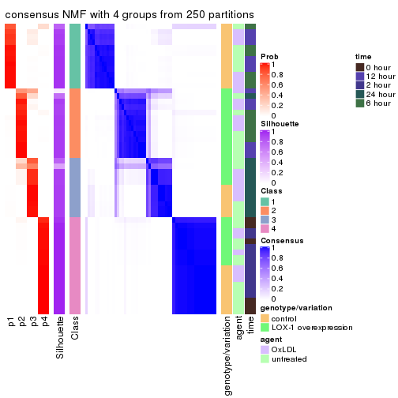</p>

</div>
<div id='tab-ATC-NMF-consensus-heatmap-4'>
<pre><code class="r">consensus_heatmap(res, k = 5)
</code></pre>

<p>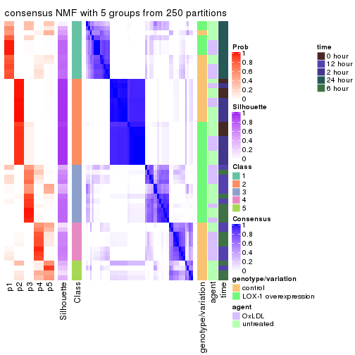</p>

</div>
<div id='tab-ATC-NMF-consensus-heatmap-5'>
<pre><code class="r">consensus_heatmap(res, k = 6)
</code></pre>

<p>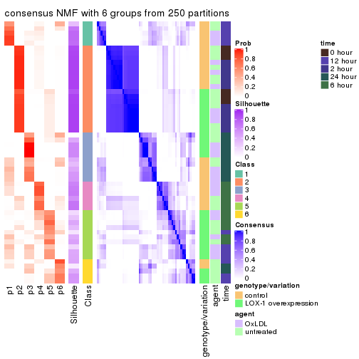</p>

</div>
</div>

Heatmaps for the membership of samples in all partitions to see how consistent they are:


<script>
$( function() {
	$( '#tabs-ATC-NMF-membership-heatmap' ).tabs();
} );
</script>
<div id='tabs-ATC-NMF-membership-heatmap'>
<ul>
<li><a href='#tab-ATC-NMF-membership-heatmap-1'>k = 2</a></li>
<li><a href='#tab-ATC-NMF-membership-heatmap-2'>k = 3</a></li>
<li><a href='#tab-ATC-NMF-membership-heatmap-3'>k = 4</a></li>
<li><a href='#tab-ATC-NMF-membership-heatmap-4'>k = 5</a></li>
<li><a href='#tab-ATC-NMF-membership-heatmap-5'>k = 6</a></li>
</ul>
<div id='tab-ATC-NMF-membership-heatmap-1'>
<pre><code class="r">membership_heatmap(res, k = 2)
</code></pre>

<p>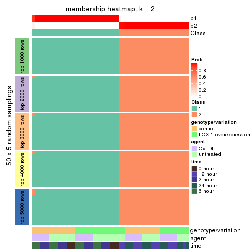</p>

</div>
<div id='tab-ATC-NMF-membership-heatmap-2'>
<pre><code class="r">membership_heatmap(res, k = 3)
</code></pre>

<p>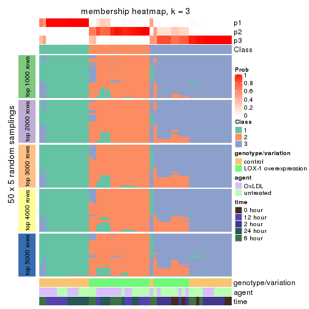</p>

</div>
<div id='tab-ATC-NMF-membership-heatmap-3'>
<pre><code class="r">membership_heatmap(res, k = 4)
</code></pre>

<p>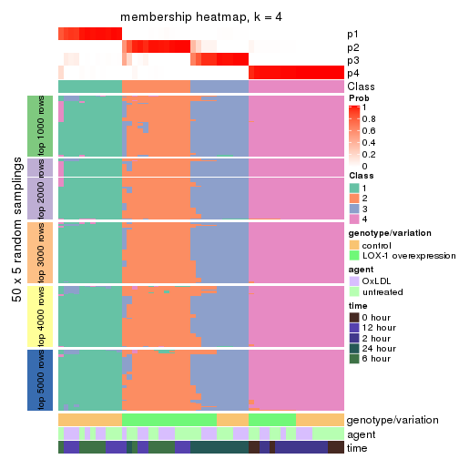</p>

</div>
<div id='tab-ATC-NMF-membership-heatmap-4'>
<pre><code class="r">membership_heatmap(res, k = 5)
</code></pre>

<p>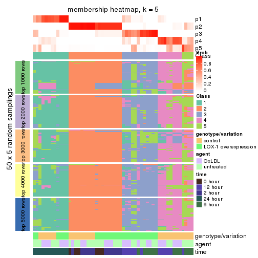</p>

</div>
<div id='tab-ATC-NMF-membership-heatmap-5'>
<pre><code class="r">membership_heatmap(res, k = 6)
</code></pre>

<p>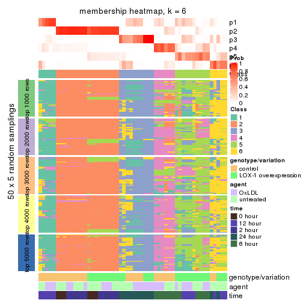</p>

</div>
</div>

As soon as we have had the classes for columns, we can look for signatures
which are significantly different between classes which can be candidate marks
for certain classes. Following are the heatmaps for signatures.


Signature heatmaps where rows are scaled:


<script>
$( function() {
	$( '#tabs-ATC-NMF-get-signatures' ).tabs();
} );
</script>
<div id='tabs-ATC-NMF-get-signatures'>
<ul>
<li><a href='#tab-ATC-NMF-get-signatures-1'>k = 2</a></li>
<li><a href='#tab-ATC-NMF-get-signatures-2'>k = 3</a></li>
<li><a href='#tab-ATC-NMF-get-signatures-3'>k = 4</a></li>
<li><a href='#tab-ATC-NMF-get-signatures-4'>k = 5</a></li>
<li><a href='#tab-ATC-NMF-get-signatures-5'>k = 6</a></li>
</ul>
<div id='tab-ATC-NMF-get-signatures-1'>
<pre><code class="r">get_signatures(res, k = 2)
</code></pre>

<p>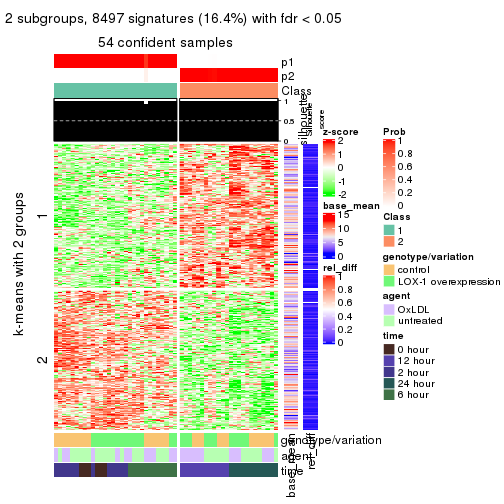</p>

</div>
<div id='tab-ATC-NMF-get-signatures-2'>
<pre><code class="r">get_signatures(res, k = 3)
</code></pre>

<p>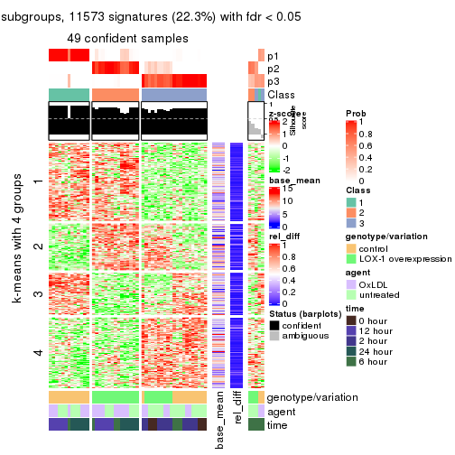</p>

</div>
<div id='tab-ATC-NMF-get-signatures-3'>
<pre><code class="r">get_signatures(res, k = 4)
</code></pre>

<p>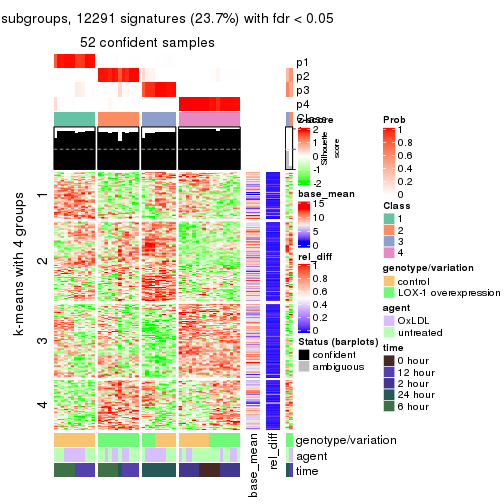</p>

</div>
<div id='tab-ATC-NMF-get-signatures-4'>
<pre><code class="r">get_signatures(res, k = 5)
</code></pre>

<p>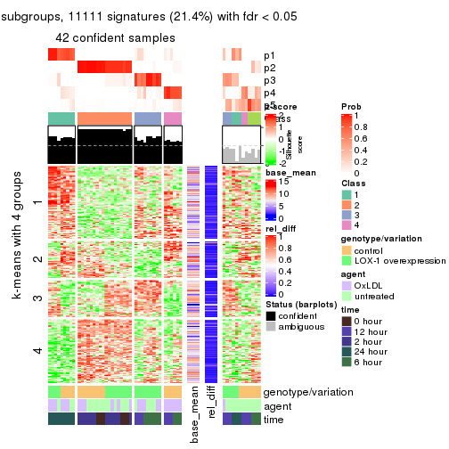</p>

</div>
<div id='tab-ATC-NMF-get-signatures-5'>
<pre><code class="r">get_signatures(res, k = 6)
</code></pre>

<p>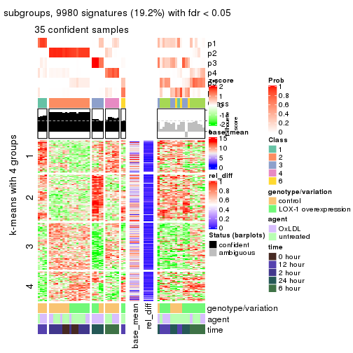</p>

</div>
</div>


Signature heatmaps where rows are not scaled:


<script>
$( function() {
	$( '#tabs-ATC-NMF-get-signatures-no-scale' ).tabs();
} );
</script>
<div id='tabs-ATC-NMF-get-signatures-no-scale'>
<ul>
<li><a href='#tab-ATC-NMF-get-signatures-no-scale-1'>k = 2</a></li>
<li><a href='#tab-ATC-NMF-get-signatures-no-scale-2'>k = 3</a></li>
<li><a href='#tab-ATC-NMF-get-signatures-no-scale-3'>k = 4</a></li>
<li><a href='#tab-ATC-NMF-get-signatures-no-scale-4'>k = 5</a></li>
<li><a href='#tab-ATC-NMF-get-signatures-no-scale-5'>k = 6</a></li>
</ul>
<div id='tab-ATC-NMF-get-signatures-no-scale-1'>
<pre><code class="r">get_signatures(res, k = 2, scale_rows = FALSE)
</code></pre>

<p>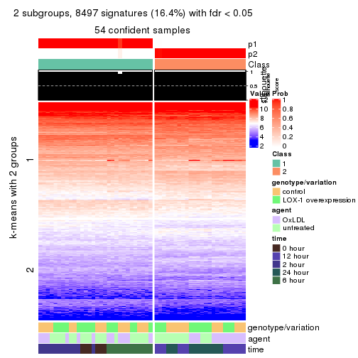</p>

</div>
<div id='tab-ATC-NMF-get-signatures-no-scale-2'>
<pre><code class="r">get_signatures(res, k = 3, scale_rows = FALSE)
</code></pre>

<p>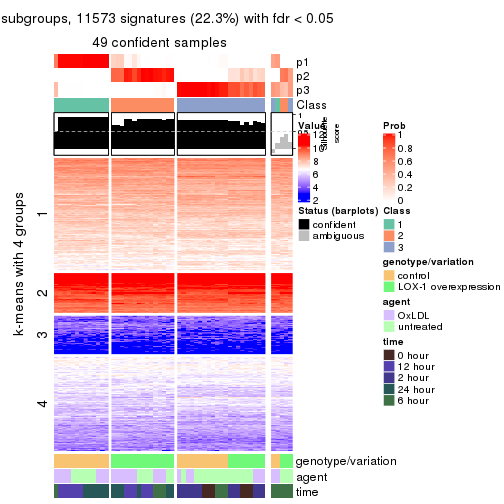</p>

</div>
<div id='tab-ATC-NMF-get-signatures-no-scale-3'>
<pre><code class="r">get_signatures(res, k = 4, scale_rows = FALSE)
</code></pre>

<p>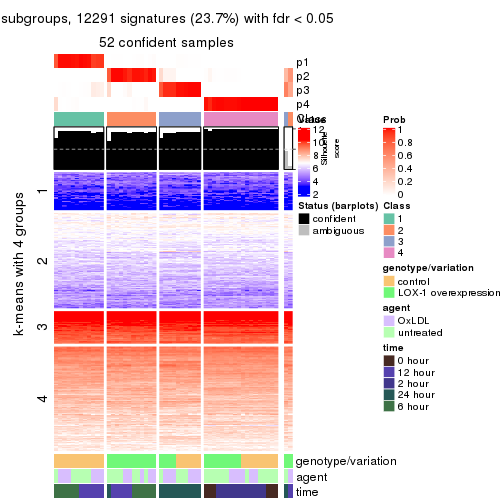</p>

</div>
<div id='tab-ATC-NMF-get-signatures-no-scale-4'>
<pre><code class="r">get_signatures(res, k = 5, scale_rows = FALSE)
</code></pre>

<p>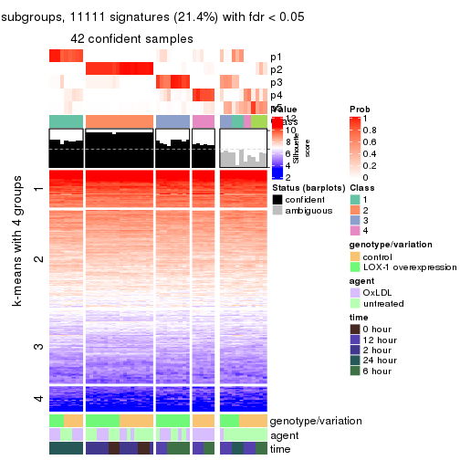</p>

</div>
<div id='tab-ATC-NMF-get-signatures-no-scale-5'>
<pre><code class="r">get_signatures(res, k = 6, scale_rows = FALSE)
</code></pre>

<p>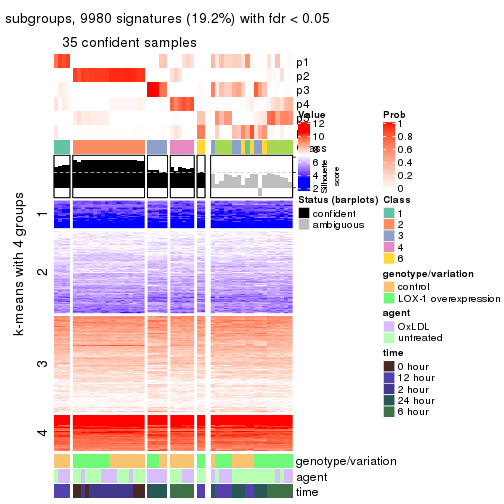</p>

</div>
</div>


Compare the overlap of signatures from different k:

```r
compare_signatures(res)
```

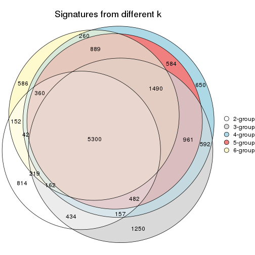

`get_signature()` returns a data frame invisibly. TO get the list of signatures, the function
call should be assigned to a variable explicitly. In following code, if `plot` argument is set
to `FALSE`, no heatmap is plotted while only the differential analysis is performed.

```r
# code only for demonstration
tb = get_signature(res, k = ..., plot = FALSE)
```

An example of the output of `tb` is:

```
#>   which_row         fdr    mean_1    mean_2 scaled_mean_1 scaled_mean_2 km
#> 1        38 0.042760348  8.373488  9.131774    -0.5533452     0.5164555  1
#> 2        40 0.018707592  7.106213  8.469186    -0.6173731     0.5762149  1
#> 3        55 0.019134737 10.221463 11.207825    -0.6159697     0.5749050  1
#> 4        59 0.006059896  5.921854  7.869574    -0.6899429     0.6439467  1
#> 5        60 0.018055526  8.928898 10.211722    -0.6204761     0.5791110  1
#> 6        98 0.009384629 15.714769 14.887706     0.6635654    -0.6193277  2
...
```

The columns in `tb` are:

1. `which_row`: row indices corresponding to the input matrix.
2. `fdr`: FDR for the differential test. 
3. `mean_x`: The mean value in group x.
4. `scaled_mean_x`: The mean value in group x after rows are scaled.
5. `km`: Row groups if k-means clustering is applied to rows.


UMAP plot which shows how samples are separated.


<script>
$( function() {
	$( '#tabs-ATC-NMF-dimension-reduction' ).tabs();
} );
</script>
<div id='tabs-ATC-NMF-dimension-reduction'>
<ul>
<li><a href='#tab-ATC-NMF-dimension-reduction-1'>k = 2</a></li>
<li><a href='#tab-ATC-NMF-dimension-reduction-2'>k = 3</a></li>
<li><a href='#tab-ATC-NMF-dimension-reduction-3'>k = 4</a></li>
<li><a href='#tab-ATC-NMF-dimension-reduction-4'>k = 5</a></li>
<li><a href='#tab-ATC-NMF-dimension-reduction-5'>k = 6</a></li>
</ul>
<div id='tab-ATC-NMF-dimension-reduction-1'>
<pre><code class="r">dimension_reduction(res, k = 2, method = &quot;UMAP&quot;)
</code></pre>

<p></p>

</div>
<div id='tab-ATC-NMF-dimension-reduction-2'>
<pre><code class="r">dimension_reduction(res, k = 3, method = &quot;UMAP&quot;)
</code></pre>

<p>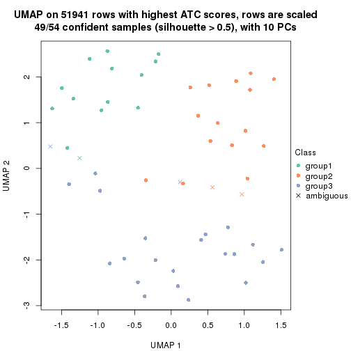</p>

</div>
<div id='tab-ATC-NMF-dimension-reduction-3'>
<pre><code class="r">dimension_reduction(res, k = 4, method = &quot;UMAP&quot;)
</code></pre>

<p>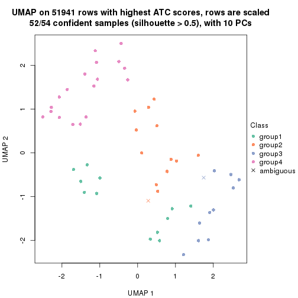</p>

</div>
<div id='tab-ATC-NMF-dimension-reduction-4'>
<pre><code class="r">dimension_reduction(res, k = 5, method = &quot;UMAP&quot;)
</code></pre>

<p>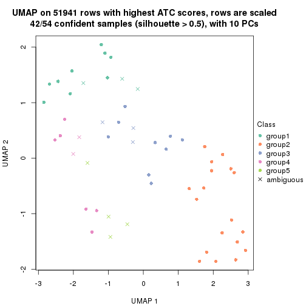</p>

</div>
<div id='tab-ATC-NMF-dimension-reduction-5'>
<pre><code class="r">dimension_reduction(res, k = 6, method = &quot;UMAP&quot;)
</code></pre>

<p>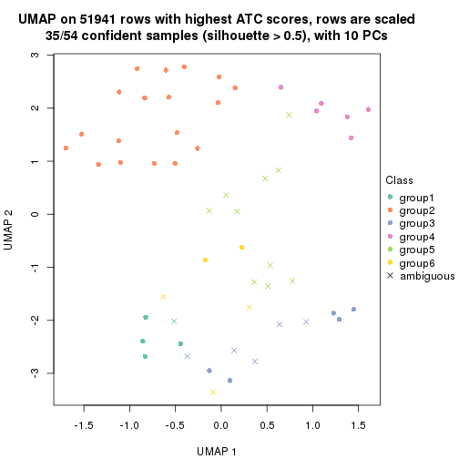</p>

</div>
</div>


Following heatmap shows how subgroups are split when increasing `k`:

```r
collect_classes(res)
```

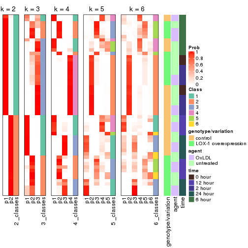


Test correlation between subgroups and known annotations. If the known
annotation is numeric, one-way ANOVA test is applied, and if the known
annotation is discrete, chi-squared contingency table test is applied.

```r
test_to_known_factors(res)
```

```
#>          n genotype/variation(p) agent(p)  time(p) k
#> ATC:NMF 54              1.00e+00   0.6460 5.26e-11 2
#> ATC:NMF 49              6.74e-07   0.1309 8.96e-07 3
#> ATC:NMF 52              2.10e-05   0.5583 1.57e-15 4
#> ATC:NMF 42              1.77e-03   0.0319 4.23e-13 5
#> ATC:NMF 35              2.39e-02   0.0408 3.97e-15 6
```


If matrix rows can be associated to genes, consider to use `functional_enrichment(res,
...)` to perform function enrichment for the signature genes. See [this vignette](http://bioconductor.org/packages/devel/bioc/vignettes/cola/inst/doc/functional_enrichment.html) for more detailed explanations.


 

## Session info


```r
sessionInfo()
```

```
#> R version 3.6.0 (2019-04-26)
#> Platform: x86_64-pc-linux-gnu (64-bit)
#> Running under: CentOS Linux 7 (Core)
#> 
#> Matrix products: default
#> BLAS:   /usr/lib64/libblas.so.3.4.2
#> LAPACK: /usr/lib64/liblapack.so.3.4.2
#> 
#> locale:
#>  [1] LC_CTYPE=en_GB.UTF-8       LC_NUMERIC=C               LC_TIME=en_GB.UTF-8       
#>  [4] LC_COLLATE=en_GB.UTF-8     LC_MONETARY=en_GB.UTF-8    LC_MESSAGES=en_GB.UTF-8   
#>  [7] LC_PAPER=en_GB.UTF-8       LC_NAME=C                  LC_ADDRESS=C              
#> [10] LC_TELEPHONE=C             LC_MEASUREMENT=en_GB.UTF-8 LC_IDENTIFICATION=C       
#> 
#> attached base packages:
#> [1] grid      stats     graphics  grDevices utils     datasets  methods   base     
#> 
#> other attached packages:
#> [1] genefilter_1.66.0    ComplexHeatmap_2.3.1 markdown_1.1         knitr_1.26          
#> [5] GetoptLong_0.1.7     cola_1.3.2          
#> 
#> loaded via a namespace (and not attached):
#>  [1] circlize_0.4.8       shape_1.4.4          xfun_0.11            slam_0.1-46         
#>  [5] lattice_0.20-38      splines_3.6.0        colorspace_1.4-1     vctrs_0.2.0         
#>  [9] stats4_3.6.0         blob_1.2.0           XML_3.98-1.20        survival_2.44-1.1   
#> [13] rlang_0.4.2          pillar_1.4.2         DBI_1.0.0            BiocGenerics_0.30.0 
#> [17] bit64_0.9-7          RColorBrewer_1.1-2   matrixStats_0.55.0   stringr_1.4.0       
#> [21] GlobalOptions_0.1.1  evaluate_0.14        memoise_1.1.0        Biobase_2.44.0      
#> [25] IRanges_2.18.3       parallel_3.6.0       AnnotationDbi_1.46.1 highr_0.8           
#> [29] Rcpp_1.0.3           xtable_1.8-4         backports_1.1.5      S4Vectors_0.22.1    
#> [33] annotate_1.62.0      skmeans_0.2-11       bit_1.1-14           microbenchmark_1.4-7
#> [37] brew_1.0-6           impute_1.58.0        rjson_0.2.20         png_0.1-7           
#> [41] digest_0.6.23        stringi_1.4.3        polyclip_1.10-0      clue_0.3-57         
#> [45] tools_3.6.0          bitops_1.0-6         magrittr_1.5         eulerr_6.0.0        
#> [49] RCurl_1.95-4.12      RSQLite_2.1.4        tibble_2.1.3         cluster_2.1.0       
#> [53] crayon_1.3.4         pkgconfig_2.0.3      zeallot_0.1.0        Matrix_1.2-17       
#> [57] xml2_1.2.2           httr_1.4.1           R6_2.4.1             mclust_5.4.5        
#> [61] compiler_3.6.0
```


